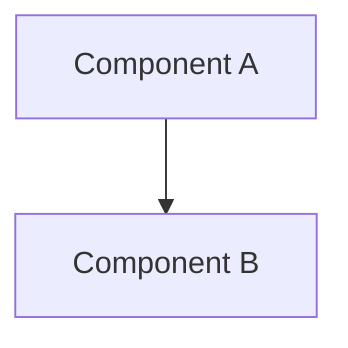

# Documentation-First Workflow - Quick Reference

**Version**: 1.0  
**Last Updated**: 2026-01-16

---

## 🚦 Before You Code: STOP and Check

```
┌─────────────────────────────────────────────────┐
│  ⚠️  DOCUMENTATION-FIRST WORKFLOW ACTIVE  ⚠️   │
│                                                 │
│  Before modifying ANY code, you MUST:          │
│                                                 │
│  ✅ Update requirements.md                     │
│  ✅ Update design.md                           │
│  ✅ Update tasks.md                            │
│  ✅ Update CHANGELOG.md                        │
│  ✅ Run validation scripts                     │
│                                                 │
│  Violations will result in PR rejection!       │
└─────────────────────────────────────────────────┘
```

---

## 📋 Quick Checklist

### Before Starting Any Task

- [ ] Read `.kiro/steering/doc-first-workflow.md`
- [ ] Identify the feature spec directory
- [ ] Run alignment check
- [ ] Run size check
- [ ] Fix any documentation issues

### During Documentation Update

- [ ] Update requirements.md with user stories (EARS format)
- [ ] Update design.md with architecture decisions
- [ ] Update tasks.md with task breakdown (time estimates)
- [ ] Update CHANGELOG.md with changes
- [ ] Verify no redundancy (use cross-references)
- [ ] Check document sizes (<10K tokens)

### Before Code Implementation

- [ ] All documentation approved
- [ ] Alignment check passes (0 critical issues)
- [ ] Size check passes (all files <10K tokens)
- [ ] Team review complete (if required)

### After Code Implementation

- [ ] All tests pass (unit + property-based)
- [ ] Re-run alignment check
- [ ] Update task status in tasks.md
- [ ] Commit with descriptive message

---

## 🛠️ Essential Commands

### Validation Commands

```bash
# Check documentation-code alignment
python3 scripts/check_doc_alignment.py .kiro/specs/{feature-name}

# Check document sizes
python3 scripts/check_doc_size.py .kiro/specs/{feature-name}

# Run both checks
python3 scripts/check_doc_alignment.py .kiro/specs/{feature-name} && \
python3 scripts/check_doc_size.py .kiro/specs/{feature-name}
```

### Git Workflow

```bash
# Commit documentation changes
git add .kiro/specs/{feature-name}/*.md
git commit -m "docs: {description}"

# Commit code changes (after docs approved)
git add src/ tests/
git commit -m "feat: {description} (validates: Requirements X.Y)"

# Update CHANGELOG
git add CHANGELOG.md
git commit -m "docs: Update CHANGELOG for {feature}"
```

---

## 📝 Document Templates

### requirements.md Entry

```markdown
## X.Y {Requirement Name}

**As a** {role}  
**I want** {capability}  
**So that** {benefit}

**Priority**: P0/P1/P2  
**Acceptance Criteria** (EARS):
- WHEN {condition}, THEN {expected result}
- IF {condition}, THEN {expected result}
- WHERE {condition}, THEN {expected result}

**Dependencies**:
- Depends on: {requirement IDs}
- Blocks: {requirement IDs}
```

### design.md Entry

```markdown
## X.Y {Component Name}

### X.Y.1 Overview
**Responsibility**: {description}

### X.Y.2 Architecture


### X.Y.3 Interface
```python
class ComponentName:
    """Component description
    
    Validates: Requirements X.Y
    """
    pass
```

### X.Y.4 Technical Decision
**Decision**: {what}  
**Rationale**: {why}  
**Alternatives**: {options considered}
```

### tasks.md Entry

```markdown
- [ ] X. {Task Name} (Est: {hours}h)
  - [ ] X.1 {Subtask} (Est: {hours}h)
    - {Description}
    - **Validates**: Requirements X.Y
    - **Dependencies**: Task Y
```

### CHANGELOG.md Entry

```markdown
## [Unreleased]

### Added
- {New feature description} (#{issue-id})

### Changed
- {Modified behavior description} (#{issue-id})

### Fixed
- {Bug fix description} (#{issue-id})
```

---

## 🎯 Common Scenarios

### Scenario 1: New Feature

```
1. Create feature spec directory: .kiro/specs/{feature-name}/
2. Create requirements.md (use template)
3. Create design.md (use template)
4. Create tasks.md (use template)
5. Run validation scripts
6. Get approval
7. Implement code
8. Update CHANGELOG.md
```

### Scenario 2: Bug Fix

```
1. Identify affected feature spec
2. Update requirements.md (if acceptance criteria wrong)
3. Update design.md (if design issue)
4. Add task to tasks.md
5. Run validation scripts
6. Fix code
7. Update CHANGELOG.md (Fixed section)
```

### Scenario 3: Performance Optimization

```
1. Update requirements.md (add/modify performance criteria)
2. Update design.md (add optimization architecture)
3. Add tasks to tasks.md
4. Run validation scripts
5. Implement optimization
6. Verify performance targets met
7. Update CHANGELOG.md (Changed section)
```

### Scenario 4: Document Too Large

```
1. Run: python3 scripts/check_doc_size.py .kiro/specs/{feature}/
2. Review split recommendations
3. Create {doc}-part1.md, {doc}-part2.md, etc.
4. Create {doc}-index.md with navigation table
5. Move original to archive/{doc}-v1-deprecated.md
6. Update cross-references
7. Re-run validation
```

---

## ⚠️ Common Mistakes

### ❌ DON'T

1. **Don't** modify code before updating docs
2. **Don't** duplicate content across documents
3. **Don't** skip validation scripts
4. **Don't** create documents >10K tokens
5. **Don't** forget to update CHANGELOG.md
6. **Don't** skip time estimates in tasks
7. **Don't** forget EARS notation in acceptance criteria

### ✅ DO

1. **Do** update all 4 core documents (requirements, design, tasks, CHANGELOG)
2. **Do** use cross-references instead of duplication
3. **Do** run validation before and after changes
4. **Do** split large documents with index
5. **Do** link tasks to requirements
6. **Do** add time estimates to all tasks
7. **Do** use EARS format for acceptance criteria

---

## 🔍 Validation Criteria

### Alignment Check Must Pass

- ✅ 0 critical issues
- ✅ <5 warnings acceptable
- ✅ Info issues can be addressed later

### Size Check Must Pass

- ✅ All files <10K tokens
- ✅ Total feature docs <32K tokens
- ✅ Index created if split

### Code Quality Must Pass

- ✅ All tests pass
- ✅ Coverage >90%
- ✅ Property tests run 100+ iterations
- ✅ Performance targets met

---

## 📞 Getting Help

### Resources

- **Full Guide**: `.kiro/steering/doc-first-workflow.md`
- **Demo**: `.kiro/specs/DOC_FIRST_DEMO.md`
- **Templates**: See this document § Document Templates

### Common Questions

**Q: Do I really need to update docs for a small bug fix?**  
A: Yes. Even small changes need documentation to maintain alignment.

**Q: What if I'm just refactoring without changing behavior?**  
A: Update design.md with refactoring rationale, add task to tasks.md.

**Q: Can I update docs and code in the same commit?**  
A: No. Docs must be committed first, then code in separate commit.

**Q: What if validation scripts fail?**  
A: Fix documentation issues before proceeding. Scripts block for a reason.

**Q: How do I know if my document is too large?**  
A: Run `python3 scripts/check_doc_size.py` - it will tell you.

---

## 🎓 Training Resources

### For New Developers

1. Read this quick reference (5 min)
2. Read full workflow guide (15 min)
3. Review demo example (30 min)
4. Practice with small task (1 hour)

### For Team Leads

1. Review workflow with team
2. Set up validation in CI/CD
3. Enforce in code reviews
4. Monitor compliance metrics

---

## 📊 Success Metrics

Track these metrics to measure workflow adoption:

- **Documentation-Code Alignment**: Target 100%
- **Average Document Size**: Target <8K tokens
- **Validation Pass Rate**: Target >95%
- **Time from Doc to Code**: Target <1 day
- **PR Rejection Rate**: Target <5%

---

## 🚀 Quick Start

```bash
# 1. Check current state
python3 scripts/check_doc_alignment.py .kiro/specs/{feature}
python3 scripts/check_doc_size.py .kiro/specs/{feature}

# 2. Update documentation
vim .kiro/specs/{feature}/requirements.md
vim .kiro/specs/{feature}/design.md
vim .kiro/specs/{feature}/tasks.md
vim CHANGELOG.md

# 3. Validate
python3 scripts/check_doc_alignment.py .kiro/specs/{feature}
python3 scripts/check_doc_size.py .kiro/specs/{feature}

# 4. Commit docs
git add .kiro/specs/{feature}/ CHANGELOG.md
git commit -m "docs: {description}"

# 5. Implement code
# ... write code ...

# 6. Test
pytest tests/ -v

# 7. Validate again
python3 scripts/check_doc_alignment.py .kiro/specs/{feature}

# 8. Commit code
git add src/ tests/
git commit -m "feat: {description} (validates: Requirements X.Y)"
```

---

**Remember**: Documentation-first is not overhead, it's investment in quality!

**Questions?** See `.kiro/steering/doc-first-workflow.md` for complete details.
