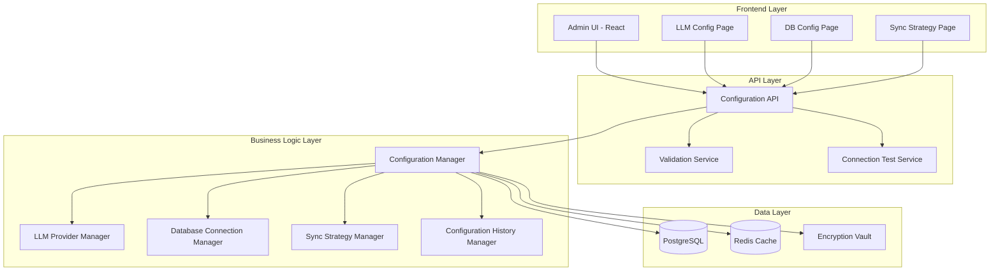
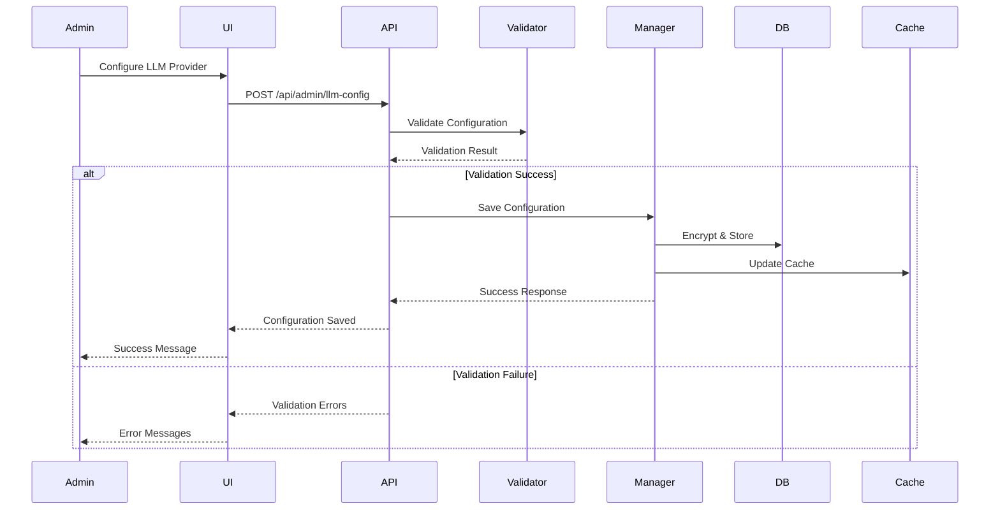

# Design Document - Admin Configuration Module

## Overview

The Admin Configuration Module provides a comprehensive web-based interface for system administrators to manage LLM integrations, database connections, and data synchronization strategies. The design follows a layered architecture with clear separation between presentation (React frontend), business logic (FastAPI backend), and data persistence (PostgreSQL with Redis caching).

### Key Design Goals

1. **User-Friendly Interface**: Intuitive configuration wizards with inline validation and contextual help
2. **Security-First**: All sensitive data encrypted at rest and in transit, with comprehensive audit logging
3. **Multi-Tenant Isolation**: Complete configuration isolation between tenants with inheritance support
4. **Extensibility**: Plugin architecture for adding new LLM providers and database types
5. **Reliability**: Configuration validation, testing, and rollback capabilities to prevent service disruptions
6. **Internationalization**: Full i18n support for Chinese and English with extensible translation framework

## Architecture

### High-Level Architecture



### Component Interaction Flow




## Components and Interfaces

### Frontend Components

#### 1. LLMConfigPage Component

**Location**: `frontend/src/pages/admin/LLMConfig.tsx`

**Responsibilities**:
- Render LLM provider configuration form
- Handle provider selection (Global/Chinese)
- Manage form state and validation
- Execute connection tests
- Display test results and error messages

**Key Interfaces**:
```typescript
interface LLMConfig {
  id?: string;
  tenantId: string;
  providerType: 'global' | 'chinese';
  providerName: string;
  apiKey: string;
  endpoint: string;
  modelName: string;
  maxTokens?: number;
  temperature?: number;
  timeout?: number;
  isActive: boolean;
}

interface LLMConfigFormProps {
  initialConfig?: LLMConfig;
  onSave: (config: LLMConfig) => Promise<void>;
  onTest: (config: LLMConfig) => Promise<TestResult>;
}
```

#### 2. DBConfigPage Component

**Location**: `frontend/src/pages/admin/DBConfig.tsx`

**Responsibilities**:
- Render database connection configuration form
- Support multiple database types (MySQL, PostgreSQL, Oracle, SQL Server)
- Handle connection parameter validation
- Execute connection tests
- Manage SSL/TLS configuration

**Key Interfaces**:
```typescript
interface DBConfig {
  id?: string;
  tenantId: string;
  dbType: 'mysql' | 'postgresql' | 'oracle' | 'sqlserver';
  host: string;
  port: number;
  database: string;
  username: string;
  password: string;
  sslEnabled: boolean;
  sslCert?: string;
  readOnly: boolean;
  connectionPool: {
    minSize: number;
    maxSize: number;
    timeout: number;
  };
}

interface DBConfigFormProps {
  initialConfig?: DBConfig;
  onSave: (config: DBConfig) => Promise<void>;
  onTest: (config: DBConfig) => Promise<TestResult>;
}
```

#### 3. SyncStrategyPage Component

**Location**: `frontend/src/pages/admin/SyncStrategy.tsx`

**Responsibilities**:
- Configure synchronization mode (poll/webhook)
- Set up scheduling for poll mode
- Generate webhook URLs
- Configure desensitization rules
- Manage sync filters and transformations

**Key Interfaces**:
```typescript
interface SyncStrategy {
  id?: string;
  tenantId: string;
  dataSourceId: string;
  syncMode: 'poll' | 'webhook';
  pollConfig?: {
    interval: number;
    cronExpression?: string;
    timeWindow?: { start: string; end: string };
  };
  webhookConfig?: {
    url: string;
    secret: string;
    retryPolicy: { maxRetries: number; backoffMs: number };
  };
  desensitizationRules: DesensitizationRule[];
  filters: DataFilter[];
  isActive: boolean;
}

interface DesensitizationRule {
  fieldName: string;
  method: 'mask' | 'hash' | 'encrypt' | 'redact';
  pattern?: string;
}
```

### Backend Services

#### 1. Configuration API Router

**Location**: `src/api/admin_config.py`

**Endpoints**:
```python
# LLM Configuration
POST   /api/admin/llm-config          # Create LLM configuration
GET    /api/admin/llm-config          # List LLM configurations
GET    /api/admin/llm-config/{id}     # Get specific configuration
PUT    /api/admin/llm-config/{id}     # Update configuration
DELETE /api/admin/llm-config/{id}     # Delete configuration
POST   /api/admin/llm-config/{id}/test # Test connection

# Database Configuration
POST   /api/admin/db-config           # Create DB configuration
GET    /api/admin/db-config           # List DB configurations
GET    /api/admin/db-config/{id}      # Get specific configuration
PUT    /api/admin/db-config/{id}      # Update configuration
DELETE /api/admin/db-config/{id}      # Delete configuration
POST   /api/admin/db-config/{id}/test # Test connection

# Sync Strategy
POST   /api/admin/sync-strategy       # Create sync strategy
GET    /api/admin/sync-strategy       # List sync strategies
GET    /api/admin/sync-strategy/{id}  # Get specific strategy
PUT    /api/admin/sync-strategy/{id}  # Update strategy
DELETE /api/admin/sync-strategy/{id}  # Delete strategy
POST   /api/admin/sync-strategy/{id}/dry-run # Test sync without execution

# Configuration History
GET    /api/admin/config-history/{type}/{id} # Get configuration history
POST   /api/admin/config-history/{type}/{id}/rollback/{version} # Rollback
```

#### 2. Configuration Manager Service

**Location**: `src/admin/config_manager.py`

**Responsibilities**:
- Centralized configuration management
- Configuration validation and sanitization
- Encryption/decryption of sensitive data
- Configuration versioning and history tracking
- Cache management for configuration data

**Key Methods**:
```python
class ConfigurationManager:
    async def create_config(
        self, 
        config_type: ConfigType, 
        config_data: dict, 
        tenant_id: str
    ) -> ConfigModel
    
    async def update_config(
        self, 
        config_id: str, 
        config_data: dict, 
        tenant_id: str
    ) -> ConfigModel
    
    async def get_config(
        self, 
        config_id: str, 
        tenant_id: str
    ) -> ConfigModel
    
    async def delete_config(
        self, 
        config_id: str, 
        tenant_id: str
    ) -> bool
    
    async def list_configs(
        self, 
        config_type: ConfigType, 
        tenant_id: str
    ) -> List[ConfigModel]
    
    async def get_config_history(
        self, 
        config_id: str, 
        tenant_id: str
    ) -> List[ConfigVersion]
    
    async def rollback_config(
        self, 
        config_id: str, 
        version: int, 
        tenant_id: str
    ) -> ConfigModel
```


#### 3. LLM Provider Manager

**Location**: `src/admin/llm_provider_manager.py`

**Responsibilities**:
- Manage LLM provider configurations
- Test LLM connections
- Handle provider-specific authentication
- Monitor API quota usage
- Support multiple concurrent providers per tenant

**Key Methods**:
```python
class LLMProviderManager:
    async def test_connection(
        self, 
        config: LLMConfig
    ) -> TestResult
    
    async def get_available_models(
        self, 
        provider: str
    ) -> List[str]
    
    async def validate_api_key(
        self, 
        provider: str, 
        api_key: str
    ) -> bool
    
    async def get_quota_usage(
        self, 
        config_id: str
    ) -> QuotaInfo
```

#### 4. Database Connection Manager

**Location**: `src/admin/db_connection_manager.py`

**Responsibilities**:
- Manage database connection configurations
- Test database connections
- Handle connection pooling
- Support multiple database types
- Enforce read-only mode

**Key Methods**:
```python
class DBConnectionManager:
    async def test_connection(
        self, 
        config: DBConfig
    ) -> TestResult
    
    async def get_connection(
        self, 
        config_id: str
    ) -> AsyncConnection
    
    async def execute_test_query(
        self, 
        config: DBConfig, 
        query: str
    ) -> QueryResult
    
    async def validate_schema(
        self, 
        config: DBConfig
    ) -> SchemaInfo
```

#### 5. Sync Strategy Manager

**Location**: `src/admin/sync_strategy_manager.py`

**Responsibilities**:
- Manage synchronization strategies
- Schedule poll-based synchronization
- Handle webhook registration
- Apply desensitization rules
- Monitor sync performance

**Key Methods**:
```python
class SyncStrategyManager:
    async def activate_strategy(
        self, 
        strategy_id: str
    ) -> bool
    
    async def deactivate_strategy(
        self, 
        strategy_id: str
    ) -> bool
    
    async def execute_dry_run(
        self, 
        strategy: SyncStrategy
    ) -> DryRunResult
    
    async def generate_webhook_url(
        self, 
        strategy_id: str
    ) -> str
    
    async def apply_desensitization(
        self, 
        data: dict, 
        rules: List[DesensitizationRule]
    ) -> dict
```

#### 6. Validation Service

**Location**: `src/admin/validation_service.py`

**Responsibilities**:
- Validate configuration data
- Check for conflicts and duplicates
- Verify tenant permissions
- Sanitize input data
- Provide detailed validation error messages

**Key Methods**:
```python
class ValidationService:
    async def validate_llm_config(
        self, 
        config: LLMConfig
    ) -> ValidationResult
    
    async def validate_db_config(
        self, 
        config: DBConfig
    ) -> ValidationResult
    
    async def validate_sync_strategy(
        self, 
        strategy: SyncStrategy
    ) -> ValidationResult
    
    async def check_conflicts(
        self, 
        config_type: ConfigType, 
        config_data: dict, 
        tenant_id: str
    ) -> List[Conflict]
```

## Data Models

### Configuration Tables

#### llm_configurations Table

```sql
CREATE TABLE llm_configurations (
    id UUID PRIMARY KEY DEFAULT gen_random_uuid(),
    tenant_id UUID NOT NULL REFERENCES tenants(id) ON DELETE CASCADE,
    provider_type VARCHAR(20) NOT NULL CHECK (provider_type IN ('global', 'chinese')),
    provider_name VARCHAR(100) NOT NULL,
    api_key_encrypted TEXT NOT NULL,
    endpoint VARCHAR(500) NOT NULL,
    model_name VARCHAR(100) NOT NULL,
    max_tokens INTEGER,
    temperature DECIMAL(3,2),
    timeout INTEGER DEFAULT 30,
    is_active BOOLEAN DEFAULT true,
    created_at TIMESTAMP WITH TIME ZONE DEFAULT CURRENT_TIMESTAMP,
    updated_at TIMESTAMP WITH TIME ZONE DEFAULT CURRENT_TIMESTAMP,
    created_by UUID REFERENCES users(id),
    updated_by UUID REFERENCES users(id),
    UNIQUE(tenant_id, provider_name)
);

CREATE INDEX idx_llm_config_tenant ON llm_configurations(tenant_id);
CREATE INDEX idx_llm_config_active ON llm_configurations(is_active);
```

#### db_configurations Table

```sql
CREATE TABLE db_configurations (
    id UUID PRIMARY KEY DEFAULT gen_random_uuid(),
    tenant_id UUID NOT NULL REFERENCES tenants(id) ON DELETE CASCADE,
    name VARCHAR(200) NOT NULL,
    db_type VARCHAR(20) NOT NULL CHECK (db_type IN ('mysql', 'postgresql', 'oracle', 'sqlserver')),
    host VARCHAR(500) NOT NULL,
    port INTEGER NOT NULL,
    database_name VARCHAR(200) NOT NULL,
    username VARCHAR(200) NOT NULL,
    password_encrypted TEXT NOT NULL,
    ssl_enabled BOOLEAN DEFAULT false,
    ssl_cert_encrypted TEXT,
    read_only BOOLEAN DEFAULT true,
    connection_pool_config JSONB,
    is_active BOOLEAN DEFAULT true,
    created_at TIMESTAMP WITH TIME ZONE DEFAULT CURRENT_TIMESTAMP,
    updated_at TIMESTAMP WITH TIME ZONE DEFAULT CURRENT_TIMESTAMP,
    created_by UUID REFERENCES users(id),
    updated_by UUID REFERENCES users(id),
    UNIQUE(tenant_id, name)
);

CREATE INDEX idx_db_config_tenant ON db_configurations(tenant_id);
CREATE INDEX idx_db_config_type ON db_configurations(db_type);
```

#### sync_strategies Table

```sql
CREATE TABLE sync_strategies (
    id UUID PRIMARY KEY DEFAULT gen_random_uuid(),
    tenant_id UUID NOT NULL REFERENCES tenants(id) ON DELETE CASCADE,
    name VARCHAR(200) NOT NULL,
    data_source_id UUID NOT NULL REFERENCES db_configurations(id) ON DELETE CASCADE,
    sync_mode VARCHAR(20) NOT NULL CHECK (sync_mode IN ('poll', 'webhook')),
    poll_config JSONB,
    webhook_config JSONB,
    desensitization_rules JSONB NOT NULL DEFAULT '[]',
    filters JSONB NOT NULL DEFAULT '[]',
    is_active BOOLEAN DEFAULT false,
    last_sync_at TIMESTAMP WITH TIME ZONE,
    last_sync_status VARCHAR(20),
    created_at TIMESTAMP WITH TIME ZONE DEFAULT CURRENT_TIMESTAMP,
    updated_at TIMESTAMP WITH TIME ZONE DEFAULT CURRENT_TIMESTAMP,
    created_by UUID REFERENCES users(id),
    updated_by UUID REFERENCES users(id),
    UNIQUE(tenant_id, name)
);

CREATE INDEX idx_sync_strategy_tenant ON sync_strategies(tenant_id);
CREATE INDEX idx_sync_strategy_source ON sync_strategies(data_source_id);
CREATE INDEX idx_sync_strategy_active ON sync_strategies(is_active);
```

#### configuration_history Table

```sql
CREATE TABLE configuration_history (
    id UUID PRIMARY KEY DEFAULT gen_random_uuid(),
    tenant_id UUID NOT NULL REFERENCES tenants(id) ON DELETE CASCADE,
    config_type VARCHAR(50) NOT NULL,
    config_id UUID NOT NULL,
    version INTEGER NOT NULL,
    config_data JSONB NOT NULL,
    change_type VARCHAR(20) NOT NULL CHECK (change_type IN ('create', 'update', 'delete', 'rollback')),
    changed_by UUID REFERENCES users(id),
    changed_at TIMESTAMP WITH TIME ZONE DEFAULT CURRENT_TIMESTAMP,
    change_reason TEXT,
    UNIQUE(config_type, config_id, version)
);

CREATE INDEX idx_config_history_tenant ON configuration_history(tenant_id);
CREATE INDEX idx_config_history_config ON configuration_history(config_type, config_id);
CREATE INDEX idx_config_history_time ON configuration_history(changed_at DESC);
```


## Technical Decisions

### Decision 1: Use PostgreSQL JSONB for Flexible Configuration Storage

**Rationale**: Configuration structures vary significantly between providers and database types. JSONB provides flexibility while maintaining queryability and validation through JSON Schema.

**Alternatives Considered**:
- Separate tables for each configuration type: Too rigid, difficult to extend
- Plain JSON text: No indexing or query capabilities
- NoSQL database: Adds complexity, PostgreSQL JSONB provides sufficient flexibility

**Trade-offs**: JSONB queries are slightly slower than normalized tables, but the flexibility and ease of extension outweigh this minor performance cost.

### Decision 2: Encrypt Sensitive Data at Application Layer

**Rationale**: Application-layer encryption provides fine-grained control over encryption keys and allows for key rotation without database migration.

**Implementation**: Use `cryptography` library with Fernet symmetric encryption. Store encryption keys in environment variables or dedicated key management service.

**Alternatives Considered**:
- Database-level encryption: Less flexible, harder to rotate keys
- HashiCorp Vault: Adds infrastructure complexity for initial deployment
- AWS KMS: Vendor lock-in, not suitable for private deployment

### Decision 3: Use Redis for Configuration Caching

**Rationale**: Configuration data is read frequently but updated infrequently. Redis caching reduces database load and improves API response times.

**Cache Strategy**:
- Cache TTL: 5 minutes for active configurations
- Cache invalidation: Immediate on configuration updates
- Cache key pattern: `config:{type}:{tenant_id}:{config_id}`

**Alternatives Considered**:
- In-memory caching: Doesn't scale across multiple API instances
- No caching: Unnecessary database load for frequently accessed data

### Decision 4: Async-First Architecture

**Rationale**: Configuration operations often involve external I/O (testing connections, calling LLM APIs). Async architecture prevents blocking and improves throughput.

**Implementation**:
- Use `asyncio` for all I/O operations
- Use `asyncio.Lock()` for thread-safe operations (NOT `threading.Lock`)
- Use `aiohttp` for external HTTP calls
- Use async database drivers (asyncpg, aiomysql)

**Reference**: See `.kiro/steering/async-sync-safety.md` for detailed async safety rules.

### Decision 5: Configuration Validation Pipeline

**Rationale**: Multi-stage validation catches errors early and provides specific feedback to administrators.

**Validation Stages**:
1. **Schema Validation**: Pydantic models validate data types and required fields
2. **Business Logic Validation**: Check for conflicts, duplicates, and tenant permissions
3. **Connection Testing**: Verify external connectivity (optional, user-initiated)
4. **Dry Run**: Test configuration in isolated environment before activation

### Decision 6: Webhook Security Model

**Rationale**: Webhooks expose endpoints to external systems, requiring strong authentication and replay protection.

**Security Measures**:
- Generate unique webhook URLs with cryptographically secure tokens
- Require HMAC signature verification for webhook payloads
- Implement replay protection with timestamp validation
- Rate limit webhook endpoints (100 requests/minute per webhook)

## Error Handling

### Error Categories

#### 1. Validation Errors

**HTTP Status**: 400 Bad Request

**Response Format**:
```json
{
  "error": "validation_error",
  "message": "Configuration validation failed",
  "details": [
    {
      "field": "api_key",
      "error": "API key format is invalid",
      "code": "INVALID_FORMAT"
    }
  ]
}
```

#### 2. Connection Test Failures

**HTTP Status**: 200 OK (test result, not API error)

**Response Format**:
```json
{
  "success": false,
  "error": "connection_failed",
  "message": "Failed to connect to database",
  "details": {
    "error_code": "CONN_TIMEOUT",
    "error_message": "Connection timeout after 15 seconds",
    "suggestions": [
      "Check if host is reachable",
      "Verify firewall rules allow connection",
      "Confirm database is running"
    ]
  }
}
```

#### 3. Permission Errors

**HTTP Status**: 403 Forbidden

**Response Format**:
```json
{
  "error": "permission_denied",
  "message": "Insufficient permissions to modify configuration",
  "required_permission": "admin:config:write"
}
```

#### 4. Conflict Errors

**HTTP Status**: 409 Conflict

**Response Format**:
```json
{
  "error": "conflict",
  "message": "Configuration with this name already exists",
  "conflicting_resource": {
    "id": "uuid",
    "name": "existing-config"
  }
}
```

### Error Recovery Strategies

#### Connection Test Failures
- Provide detailed error messages with troubleshooting steps
- Log full error details for administrator review
- Allow retry without re-entering all configuration data

#### Configuration Save Failures
- Use database transactions to ensure atomicity
- Rollback on any failure during multi-step operations
- Preserve user input in UI for correction

#### Sync Pipeline Failures
- Implement exponential backoff retry (3 attempts)
- Alert administrators after consecutive failures
- Provide detailed logs for debugging
- Allow manual retry from admin UI


## Correctness Properties

A property is a characteristic or behavior that should hold true across all valid executions of a system—essentially, a formal statement about what the system should do. Properties serve as the bridge between human-readable specifications and machine-verifiable correctness guarantees.

### Property Reflection Analysis

After analyzing all acceptance criteria, several properties can be consolidated:
- Properties 1.2, 2.2, and 3.2 all test conditional UI rendering and can be combined
- Properties 1.4 and 2.5 both test configuration persistence with encryption
- Properties 1.7 and 2.5 both verify encryption of sensitive data
- Properties 2.7, 5.6, and 4.6 all test audit logging and can be combined
- Properties 7.1, 7.2, and 7.3 all test tenant isolation from different angles

### Configuration Persistence and Encryption Properties

Property 1: Configuration Round-Trip with Encryption
*For any* valid configuration (LLM, database, or sync strategy), saving the configuration and then retrieving it should return equivalent data, and all sensitive fields (API keys, passwords, secrets) should be encrypted in storage (not plaintext).
**Validates: Requirements 1.4, 1.7, 2.5**

Property 2: Multi-Tenant Configuration Isolation
*For any* two different tenants, configurations created by one tenant should not be visible or accessible to the other tenant, even with direct API calls attempting cross-tenant access.
**Validates: Requirements 1.6, 7.1, 7.2, 7.3**

### Validation and Error Handling Properties

Property 3: Validation Before Persistence
*For any* invalid configuration submission, the system should reject the configuration with specific error messages before any database write operation occurs.
**Validates: Requirements 2.3, 5.1, 5.2**

Property 4: Localized Error Messages
*For any* validation error and any supported language preference (Chinese/English), the system should return error messages in the administrator's preferred language.
**Validates: Requirements 8.4**

Property 5: Input Validation Consistency
*For any* configuration data submitted via UI or API, the same validation rules should be applied and produce identical validation results.
**Validates: Requirements 9.2**

### Connection Testing Properties

Property 6: Connection Test Timeout Enforcement
*For any* connection test (LLM or database), the system should return a result (success or timeout error) within the specified timeout period (10 seconds for LLM, 15 seconds for database).
**Validates: Requirements 1.3, 2.4**

Property 7: Connection Test Isolation
*For any* connection test execution, the test should not affect production data, connections, or services, and should execute in an isolated environment.
**Validates: Requirements 5.3**

Property 8: Connection Failure Logging
*For any* connection failure (LLM or database), the system should log detailed error information including error code, message, and timestamp for troubleshooting.
**Validates: Requirements 2.7**

### Conditional Rendering Properties

Property 9: Provider-Specific Options Display
*For any* provider type selection (Global/Chinese LLM providers, or MySQL/PostgreSQL/Oracle/SQL Server database types), the UI should display only the configuration options specific to that provider/database type.
**Validates: Requirements 1.2, 2.2, 3.2**

### Permission and Access Control Properties

Property 10: Read-Only Mode Enforcement
*For any* database configuration with read-only mode enabled, all write operations (INSERT, UPDATE, DELETE) should be rejected, while read operations (SELECT) should be allowed.
**Validates: Requirements 2.6**

Property 11: Query-Only Mode Enforcement
*For any* data source with query-only mode enabled, only SQL query interface access should be allowed, and all other data access methods should be rejected.
**Validates: Requirements 4.2**

Property 12: Permission Immediate Effect
*For any* permission configuration change, the new permissions should be enforced immediately on the next API request without requiring service restart.
**Validates: Requirements 4.5**

Property 13: Permission Enforcement at API Level
*For any* API request attempting unauthorized access based on configured permissions, the system should reject the request with a 403 Forbidden response.
**Validates: Requirements 4.4**

### Synchronization Properties

Property 14: Webhook URL Uniqueness
*For any* two sync strategies configured with webhook mode, the generated webhook URLs should be unique and cryptographically secure.
**Validates: Requirements 3.3**

Property 15: Incremental Synchronization
*For any* sync strategy execution, only new or modified data since the last successful sync should be transferred, not all data.
**Validates: Requirements 3.6**

Property 16: Sync Retry with Exponential Backoff
*For any* sync operation that fails, the system should retry with exponential backoff, and after 3 consecutive failures, should alert administrators.
**Validates: Requirements 3.7**

Property 17: Dry-Run Non-Modification
*For any* sync strategy dry-run execution, no data should be modified in either source or destination, but preview results should be returned.
**Validates: Requirements 5.4**

### Configuration History Properties

Property 18: Configuration History Completeness
*For any* configuration change (create, update, delete, rollback), a history entry should be created with timestamp, author, change type, and full configuration data.
**Validates: Requirements 6.1, 6.5, 4.6, 5.6**

Property 19: Configuration Rollback Round-Trip
*For any* configuration at version N, rolling back to version N-1 and then rolling back again should restore the configuration to version N state.
**Validates: Requirements 6.3**

Property 20: Configuration History Retention
*For any* configuration history entry, it should be retained for at least 90 days from creation.
**Validates: Requirements 6.4**

Property 21: Rollback Compatibility Check
*For any* rollback attempt to a historical configuration that is incompatible with the current system version, the system should reject the rollback with a specific error message.
**Validates: Requirements 6.6**

### Tenant Management Properties

Property 22: Tenant Default Initialization
*For any* newly created tenant, the system should automatically initialize default configuration templates for LLM providers, database connections, and sync strategies.
**Validates: Requirements 7.4**

Property 23: Configuration Inheritance
*For any* tenant configuration that doesn't override a global default, the tenant should inherit the global default value, and overridden values should take precedence.
**Validates: Requirements 7.5**

Property 24: Tenant Deletion Archival
*For any* deleted tenant, all tenant-specific configurations should be archived (not permanently deleted) for compliance retention.
**Validates: Requirements 7.6**

### Internationalization Properties

Property 25: Language Switching Completeness
*For any* language preference change (Chinese to English or vice versa), all UI text labels, messages, help content, and error messages should update immediately to the selected language.
**Validates: Requirements 8.2**

Property 26: No Hardcoded UI Strings
*For any* user-facing text in the Admin UI components, the text should use i18n translation keys rather than hardcoded strings.
**Validates: Requirements 8.5**

Property 27: Language Extensibility
*For any* new language added through translation file updates, the system should support the new language without requiring code changes or redeployment.
**Validates: Requirements 8.6**

### API Properties

Property 28: Bulk Import/Export Round-Trip
*For any* set of configurations exported in JSON format, importing the exported data should recreate equivalent configurations with the same settings.
**Validates: Requirements 9.3**

Property 29: API Authentication Enforcement
*For any* configuration API endpoint, requests without valid authentication tokens should be rejected with 401 Unauthorized response.
**Validates: Requirements 9.4**

Property 30: API Response Format Consistency
*For any* successful API operation (create, update, delete), the response should follow a standardized format including operation status, resource ID, and timestamp.
**Validates: Requirements 9.5**

Property 31: API Rate Limiting
*For any* API client making more than 100 requests per minute, subsequent requests should be rejected with 429 Too Many Requests response until the rate limit window resets.
**Validates: Requirements 9.7**

### Monitoring and Alerting Properties

Property 32: Alert Threshold Validation
*For any* alert threshold configuration, the system should validate that threshold values are within acceptable ranges (e.g., percentages between 0-100, timeouts > 0).
**Validates: Requirements 10.2**

Property 33: Threshold Violation Alerting
*For any* monitored metric that exceeds configured thresholds, the system should send alerts through all configured channels (email, webhook, SMS).
**Validates: Requirements 10.3**

Property 34: Connection Failure Alert Timing
*For any* database connection failure, the system should send an alert to administrators within 1 minute of detecting the failure.
**Validates: Requirements 10.5**

Property 35: Real-Time Dashboard Status
*For any* configured connection or sync pipeline, the admin dashboard should display current health status that reflects the actual state within 30 seconds of any status change.
**Validates: Requirements 10.6**


## Testing Strategy

### Dual Testing Approach

The testing strategy employs both unit tests and property-based tests to ensure comprehensive coverage:

- **Unit Tests**: Verify specific examples, edge cases, error conditions, and integration points
- **Property Tests**: Verify universal properties across all inputs through randomized testing

Both approaches are complementary and necessary for comprehensive validation.

### Unit Testing Focus Areas

Unit tests should focus on:

1. **Specific Examples**
   - Valid LLM configuration with OpenAI provider
   - Valid database configuration with PostgreSQL
   - Valid sync strategy with poll mode
   - Webhook URL generation format

2. **Edge Cases**
   - Empty configuration fields
   - Maximum length strings
   - Special characters in passwords
   - Boundary values for timeouts and thresholds

3. **Error Conditions**
   - Invalid API key format
   - Unreachable database host
   - Malformed JSON in configuration
   - Expired authentication tokens

4. **Integration Points**
   - Configuration API to database persistence
   - UI form submission to API endpoint
   - Cache invalidation on configuration update
   - Audit log creation on configuration change

### Property-Based Testing Configuration

All property tests must:
- Run minimum 100 iterations per test (due to randomization)
- Reference the design document property number
- Use tag format: **Feature: admin-configuration, Property {number}: {property_text}**

### Property Test Implementation

Each correctness property will be implemented as a property-based test using an appropriate testing library:

**For Python Backend** (pytest with Hypothesis):
```python
from hypothesis import given, strategies as st
import pytest

@given(
    config=st.builds(LLMConfig, 
        provider_name=st.sampled_from(['openai', 'anthropic', 'alibaba']),
        api_key=st.text(min_size=20, max_size=100),
        endpoint=st.from_regex(r'https://[a-z0-9\-\.]+\.[a-z]{2,}', fullmatch=True)
    )
)
@pytest.mark.property_test
def test_property_1_config_round_trip_with_encryption(config):
    """
    Feature: admin-configuration, Property 1: Configuration Round-Trip with Encryption
    
    For any valid configuration, saving and retrieving should return equivalent data,
    and sensitive fields should be encrypted in storage.
    """
    # Save configuration
    saved_id = config_manager.save(config)
    
    # Verify encryption in database
    raw_db_record = db.execute(f"SELECT api_key_encrypted FROM llm_configurations WHERE id = '{saved_id}'")
    assert raw_db_record['api_key_encrypted'] != config.api_key  # Not plaintext
    
    # Retrieve configuration
    retrieved = config_manager.get(saved_id)
    
    # Verify equivalence (decrypted)
    assert retrieved.api_key == config.api_key
    assert retrieved.provider_name == config.provider_name
    assert retrieved.endpoint == config.endpoint
```

**For TypeScript Frontend** (Vitest with fast-check):
```typescript
import { test } from 'vitest';
import * as fc from 'fast-check';

test('Property 9: Provider-Specific Options Display', () => {
  /**
   * Feature: admin-configuration, Property 9: Provider-Specific Options Display
   * 
   * For any provider type selection, the UI should display only the configuration
   * options specific to that provider type.
   */
  fc.assert(
    fc.property(
      fc.constantFrom('global', 'chinese'),
      (providerType) => {
        const { getByTestId } = render(<LLMConfigForm providerType={providerType} />);
        
        if (providerType === 'global') {
          expect(getByTestId('openai-options')).toBeInTheDocument();
          expect(() => getByTestId('alibaba-options')).toThrow();
        } else {
          expect(getByTestId('alibaba-options')).toBeInTheDocument();
          expect(() => getByTestId('openai-options')).toThrow();
        }
      }
    ),
    { numRuns: 100 }
  );
});
```

### Test Organization

```
tests/
├── unit/
│   ├── test_config_manager.py
│   ├── test_llm_provider_manager.py
│   ├── test_db_connection_manager.py
│   ├── test_sync_strategy_manager.py
│   └── test_validation_service.py
├── property/
│   ├── test_config_persistence_properties.py
│   ├── test_tenant_isolation_properties.py
│   ├── test_validation_properties.py
│   ├── test_connection_test_properties.py
│   ├── test_permission_properties.py
│   ├── test_sync_properties.py
│   ├── test_history_properties.py
│   ├── test_i18n_properties.py
│   └── test_api_properties.py
├── integration/
│   ├── test_config_api_integration.py
│   ├── test_ui_to_api_flow.py
│   └── test_sync_pipeline_integration.py
└── e2e/
    ├── test_llm_config_workflow.spec.ts
    ├── test_db_config_workflow.spec.ts
    └── test_sync_strategy_workflow.spec.ts
```

### Testing Libraries

- **Backend**: pytest, Hypothesis (property-based testing), pytest-asyncio
- **Frontend**: Vitest, fast-check (property-based testing), Playwright (E2E)
- **API Testing**: httpx (async HTTP client), pytest-mock
- **Database Testing**: pytest-postgresql, fakeredis

### Continuous Integration

All tests must pass before merging:
```yaml
# .github/workflows/test.yml
- name: Run Unit Tests
  run: pytest tests/unit/ -v --cov=src

- name: Run Property Tests
  run: pytest tests/property/ -v --hypothesis-show-statistics

- name: Run Integration Tests
  run: pytest tests/integration/ -v

- name: Run E2E Tests
  run: npm run test:e2e
```

### Test Coverage Requirements

- Unit test coverage: Minimum 80% for all modules
- Property test coverage: All 35 correctness properties must have corresponding tests
- Integration test coverage: All API endpoints must have integration tests
- E2E test coverage: All critical user workflows must have E2E tests

