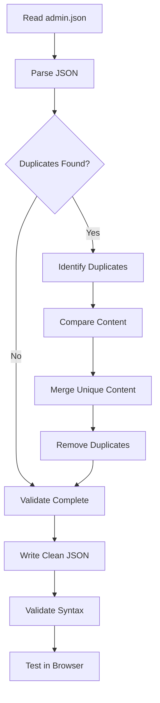

# Admin Console Translation Fix - Design

## 1. Overview

This design addresses the duplicate translation key issue in admin.json files that causes raw translation keys to display instead of translated text.

## 2. Problem Analysis

### 2.1 Duplicate Key Detection

From the file analysis, the following duplicate keys were found in `frontend/src/locales/zh/admin.json`:

1. **`permissionConfig`** - appears twice:
   - First occurrence: ~line 1150
   - Second occurrence: ~line 1250
   
2. **`billingManagement`** - may have incomplete or duplicate sections

### 2.2 Why Duplicates Cause Issues

When JavaScript/TypeScript parses JSON with duplicate keys:
```javascript
{
  "key": "value1",
  "key": "value2"  // This overwrites value1
}
```

The last occurrence wins, but i18n libraries may cache or handle this inconsistently, leading to:
- Undefined behavior
- Fallback to key path display
- Inconsistent translations across page loads

## 3. Solution Design

### 3.1 Duplicate Removal Strategy

**Step 1: Identify All Duplicates**
- Parse JSON and track all key paths
- Report any duplicate top-level keys
- Report any duplicate nested keys

**Step 2: Compare Duplicate Content**
- For each duplicate, compare the content
- If identical: remove one
- If different: merge unique content

**Step 3: Validate Structure**
- Ensure zh and en files have matching structure
- Ensure all keys used in components exist

### 3.2 Merge Strategy for Different Content

When duplicate keys have different content:

```javascript
// Duplicate 1
"permissionConfig": {
  "title": "权限配置",
  "field1": "value1"
}

// Duplicate 2
"permissionConfig": {
  "title": "权限配置管理",
  "field2": "value2"
}

// Merged Result
"permissionConfig": {
  "title": "权限配置管理",  // Use more complete/descriptive version
  "field1": "value1",
  "field2": "value2"
}
```

### 3.3 File Processing Workflow



## 4. Implementation Plan

### 4.1 Manual Fix Approach

Since the files are large (1817 lines), we'll use a careful manual approach:

1. **Read the complete file** to identify exact duplicate locations
2. **Extract duplicate sections** for comparison
3. **Merge content** preserving all unique keys
4. **Remove duplicate sections** from the file
5. **Validate JSON syntax**
6. **Test in browser**

### 4.2 Specific Fixes Required

#### Fix 1: Remove Duplicate `permissionConfig`

Location: Lines ~1150 and ~1250 in zh/admin.json

**Action**:
- Compare both definitions
- Merge unique keys
- Keep only one definition
- Apply same fix to en/admin.json

#### Fix 2: Verify `billingManagement` Section

**Action**:
- Check for duplicates
- Ensure all keys from component usage exist
- Verify completeness

#### Fix 3: Verify `console` Section

**Action**:
- Check for duplicates
- Ensure all keys match component usage

### 4.3 Validation Steps

After fixing duplicates:

1. **JSON Syntax Validation**
   ```bash
   # Validate JSON syntax
   node -e "JSON.parse(require('fs').readFileSync('frontend/src/locales/zh/admin.json', 'utf8'))"
   node -e "JSON.parse(require('fs').readFileSync('frontend/src/locales/en/admin.json', 'utf8'))"
   ```

2. **Duplicate Key Detection**
   ```javascript
   // Check for duplicate keys
   const json = require('./frontend/src/locales/zh/admin.json');
   const keys = Object.keys(json);
   const duplicates = keys.filter((key, index) => keys.indexOf(key) !== index);
   console.log('Duplicates:', duplicates);
   ```

3. **Structure Comparison**
   ```javascript
   // Compare zh and en structure
   const zh = require('./frontend/src/locales/zh/admin.json');
   const en = require('./frontend/src/locales/en/admin.json');
   const zhKeys = Object.keys(zh).sort();
   const enKeys = Object.keys(en).sort();
   console.log('Missing in EN:', zhKeys.filter(k => !enKeys.includes(k)));
   console.log('Missing in ZH:', enKeys.filter(k => !zhKeys.includes(k)));
   ```

## 5. Testing Strategy

### 5.1 Unit Testing (JSON Validation)

- Validate JSON syntax
- Check for duplicate keys
- Verify structure consistency

### 5.2 Integration Testing (Browser)

Test each admin page:

1. **Console/Overview Page** (`/admin` or `/admin/console`)
   - Verify all statistics labels are translated
   - Verify all section titles are translated
   - Verify all button labels are translated

2. **Billing Management Page** (`/admin/billing`)
   - Verify `billingManagement.summary.monthlyRevenue` displays correctly
   - Verify all column headers are translated
   - Verify all status tags are translated

3. **Permission Config Page** (`/admin/permissions`)
   - Verify `permissionConfig.title` displays correctly
   - Verify all permission labels are translated
   - Verify all role names are translated

4. **Quota Management Page** (`/admin/quotas`)
   - Verify all quota labels are translated
   - Verify all status indicators are translated

### 5.3 Regression Testing

- Test language switching (zh ↔ en)
- Test page navigation
- Test browser cache clearing
- Test hard refresh (Cmd+Shift+R)

## 6. Rollback Plan

If issues occur after deployment:

1. **Immediate Rollback**
   - Revert to previous version of admin.json files
   - Rebuild frontend container
   - Clear browser cache

2. **Backup Strategy**
   - Keep backup of original files before modification
   - Document all changes made

## 7. Performance Considerations

### 7.1 File Size

- Current: 1817 lines each (zh and en)
- After fix: Should be slightly smaller (duplicates removed)
- Impact: Negligible - translation files are loaded once

### 7.2 Load Time

- No impact on load time
- May slightly improve i18n resolution speed

## 8. Security Considerations

- No security impact
- Translation files are static assets
- No sensitive data in translation files

## 9. Correctness Properties

### Property 1: No Duplicate Keys
**Specification**: For any translation file, all top-level keys must be unique.

**Formal Definition**:
```
∀ file ∈ {zh/admin.json, en/admin.json}:
  keys(file) = unique(keys(file))
```

**Test**: Parse JSON and check `Object.keys(json).length === new Set(Object.keys(json)).size`

### Property 2: Structure Consistency
**Specification**: Chinese and English translation files must have identical key structures.

**Formal Definition**:
```
keys(zh/admin.json) = keys(en/admin.json)
```

**Test**: Compare sorted key arrays from both files

### Property 3: Translation Completeness
**Specification**: All translation keys used in components must exist in translation files.

**Formal Definition**:
```
∀ key ∈ usedKeys(components):
  key ∈ keys(zh/admin.json) ∧ key ∈ keys(en/admin.json)
```

**Test**: Extract all `t('xxx')` calls from components and verify keys exist

### Property 4: Valid JSON Syntax
**Specification**: All translation files must be valid JSON.

**Formal Definition**:
```
∀ file ∈ translationFiles:
  JSON.parse(file) succeeds
```

**Test**: Use `JSON.parse()` and catch exceptions

## 10. Implementation Checklist

- [ ] Read complete zh/admin.json file
- [ ] Read complete en/admin.json file
- [ ] Identify all duplicate keys in zh file
- [ ] Identify all duplicate keys in en file
- [ ] Compare duplicate content in zh file
- [ ] Compare duplicate content in en file
- [ ] Merge unique content for each duplicate
- [ ] Remove duplicate sections from zh file
- [ ] Remove duplicate sections from en file
- [ ] Validate JSON syntax for both files
- [ ] Test in browser - Console page
- [ ] Test in browser - Billing page
- [ ] Test in browser - Permission page
- [ ] Test in browser - Quota page
- [ ] Test language switching
- [ ] Clear browser cache and retest
- [ ] Document changes made

## 11. Success Metrics

- **Zero duplicate keys** in both translation files
- **Zero raw translation keys** visible in admin console
- **100% translation coverage** for all admin pages
- **Zero i18n warnings** in browser console

## 12. Future Enhancements

1. **Automated Duplicate Detection**
   - Add pre-commit hook to detect duplicates
   - Add CI/CD validation step

2. **Translation Key Validation**
   - Validate all component usage against translation files
   - Generate report of missing translations

3. **Translation Management Tool**
   - Use a translation management system
   - Prevent duplicates at source
