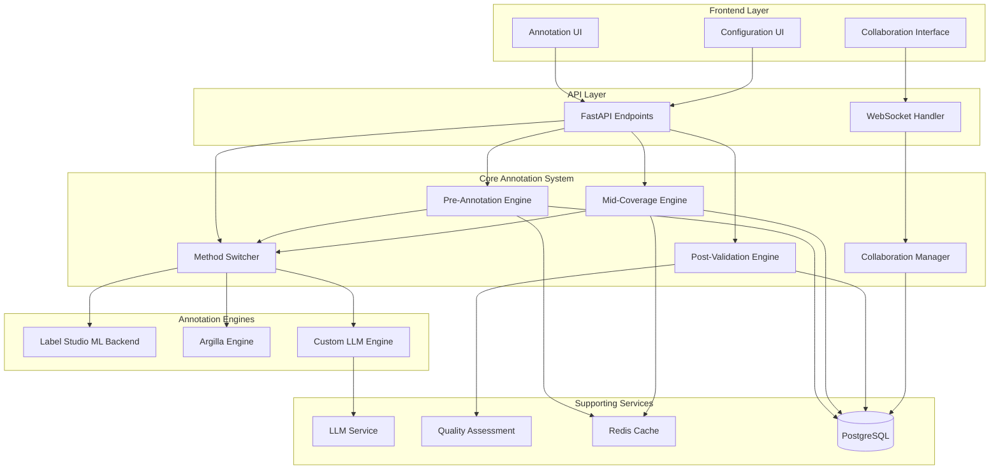
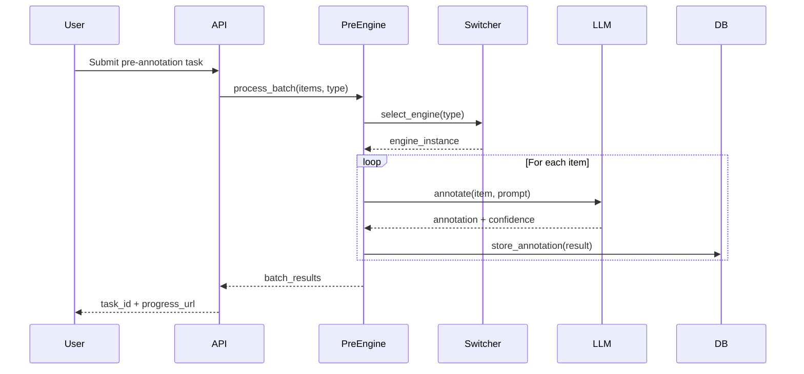
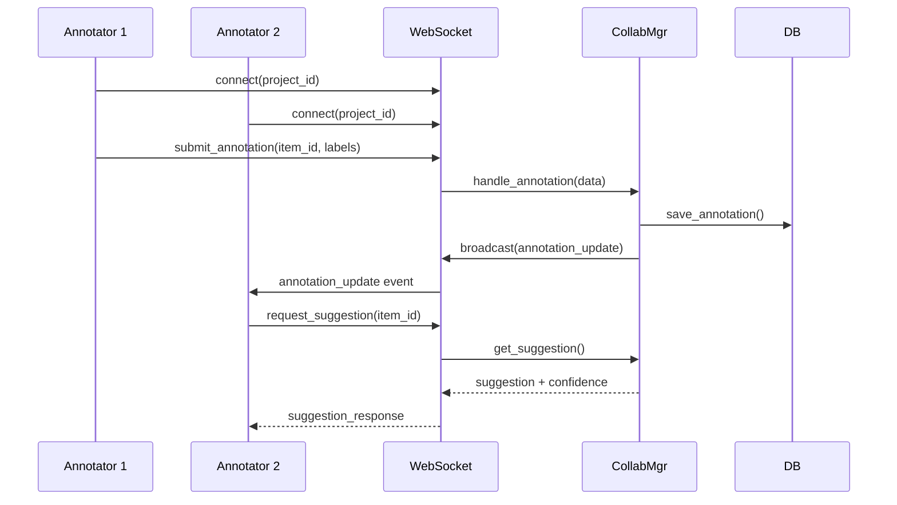

# Design Document: AI Annotation Methods

## Overview

The AI Annotation Methods feature implements a comprehensive intelligent annotation system that integrates multiple AI-powered engines to support the complete annotation lifecycle: pre-annotation, real-time assistance, and post-validation. The system is designed with a modular architecture that allows seamless switching between different annotation engines (Label Studio ML Backend, Argilla, Custom LLM) while maintaining consistent interfaces and data formats.

The design follows async/await patterns throughout to ensure non-blocking operations, uses WebSocket for real-time collaboration, and implements comprehensive caching strategies for optimal performance. All components are multi-tenant aware with strict data isolation and full audit logging.

### Key Design Principles

1. **Modularity**: Each annotation method (pre, mid, post) is an independent component with clear interfaces
2. **Extensibility**: New annotation engines can be added without modifying core logic
3. **Async-First**: All I/O operations use async/await to prevent blocking
4. **Real-Time**: WebSocket-based collaboration for immediate synchronization
5. **Quality-Driven**: Built-in quality assessment at every stage
6. **Multi-Tenant**: Complete data isolation with tenant-aware operations

## Architecture



### Component Interaction Flow

**Pre-Annotation Flow:**


**Real-Time Collaboration Flow:**


## Components and Interfaces

### 1. Pre-Annotation Engine

**Responsibility**: Batch pre-annotation of data items using AI models before human review.

**Interface**:
```python
class PreAnnotationEngine:
    async def process_batch(
        self,
        tenant_id: str,
        project_id: str,
        items: List[DataItem],
        annotation_type: AnnotationType,
        engine_preference: Optional[str] = None,
        use_sample_learning: bool = False,
        confidence_threshold: float = 0.7
    ) -> BatchAnnotationResult:
        """
        Process a batch of items for pre-annotation.
        
        Args:
            tenant_id: Tenant identifier for multi-tenant isolation
            project_id: Project identifier
            items: List of data items to annotate
            annotation_type: Type of annotation (NER, classification, etc.)
            engine_preference: Preferred annotation engine (optional)
            use_sample_learning: Whether to use few-shot learning from existing annotations
            confidence_threshold: Minimum confidence for auto-approval
            
        Returns:
            BatchAnnotationResult with annotations, confidence scores, and metadata
        """
        pass
    
    async def get_sample_annotations(
        self,
        tenant_id: str,
        project_id: str,
        annotation_type: AnnotationType,
        limit: int = 5
    ) -> List[Annotation]:
        """Get high-quality sample annotations for few-shot learning."""
        pass
    
    async def get_progress(
        self,
        tenant_id: str,
        task_id: str
    ) -> AnnotationProgress:
        """Get progress of a running pre-annotation task."""
        pass
```

**Data Models**:
```python
class DataItem(BaseModel):
    id: str
    content: str
    metadata: Dict[str, Any]

class BatchAnnotationResult(BaseModel):
    task_id: str
    total_items: int
    completed_items: int
    annotations: List[AnnotationResult]
    average_confidence: float
    flagged_for_review: List[str]  # Item IDs
    processing_time_seconds: float

class AnnotationResult(BaseModel):
    item_id: str
    labels: List[Label]
    confidence_score: float
    engine_used: str
    requires_review: bool
    metadata: Dict[str, Any]

class Label(BaseModel):
    text: str
    start: Optional[int]  # For span-based annotations
    end: Optional[int]
    label_type: str
    confidence: float
```

### 2. Mid-Coverage Engine

**Responsibility**: Provide real-time annotation suggestions during human annotation.

**Interface**:
```python
class MidCoverageEngine:
    async def get_suggestion(
        self,
        tenant_id: str,
        project_id: str,
        item: DataItem,
        annotation_type: AnnotationType,
        context: Optional[AnnotationContext] = None
    ) -> AnnotationSuggestion:
        """
        Get real-time annotation suggestion for an item.
        
        Args:
            tenant_id: Tenant identifier
            project_id: Project identifier
            item: Data item to annotate
            annotation_type: Type of annotation
            context: Optional context from previous annotations
            
        Returns:
            AnnotationSuggestion with labels and confidence
        """
        pass
    
    async def learn_from_feedback(
        self,
        tenant_id: str,
        project_id: str,
        item_id: str,
        suggested: AnnotationResult,
        actual: AnnotationResult,
        feedback_type: FeedbackType
    ) -> None:
        """Learn from annotator feedback (accept/reject/modify)."""
        pass
    
    async def apply_batch_coverage(
        self,
        tenant_id: str,
        project_id: str,
        source_item_id: str,
        target_item_ids: List[str],
        similarity_threshold: float = 0.85
    ) -> BatchCoverageResult:
        """Apply annotation from source to similar target items."""
        pass
    
    async def detect_conflicts(
        self,
        tenant_id: str,
        project_id: str,
        item_id: str
    ) -> List[AnnotationConflict]:
        """Detect conflicts between AI and human annotations."""
        pass
```

**Data Models**:
```python
class AnnotationSuggestion(BaseModel):
    item_id: str
    labels: List[Label]
    confidence_score: float
    reasoning: Optional[str]
    similar_examples: List[str]  # IDs of similar annotated items

class AnnotationContext(BaseModel):
    recent_annotations: List[AnnotationResult]
    annotator_patterns: Dict[str, Any]
    project_guidelines: Optional[str]

class FeedbackType(str, Enum):
    ACCEPTED = "accepted"
    REJECTED = "rejected"
    MODIFIED = "modified"

class BatchCoverageResult(BaseModel):
    applied_count: int
    skipped_count: int
    applied_items: List[str]
    skipped_items: List[str]
    average_similarity: float

class AnnotationConflict(BaseModel):
    item_id: str
    ai_annotation: AnnotationResult
    human_annotation: AnnotationResult
    conflict_type: str
    severity: str
```

### 3. Post-Validation Engine

**Responsibility**: Multi-dimensional quality assessment of completed annotations.

**Interface**:
```python
class PostValidationEngine:
    async def validate_annotations(
        self,
        tenant_id: str,
        project_id: str,
        annotation_ids: List[str]
    ) -> ValidationReport:
        """
        Validate a set of annotations using multiple quality dimensions.
        
        Args:
            tenant_id: Tenant identifier
            project_id: Project identifier
            annotation_ids: List of annotation IDs to validate
            
        Returns:
            ValidationReport with quality metrics and recommendations
        """
        pass
    
    async def detect_inconsistencies(
        self,
        tenant_id: str,
        project_id: str,
        annotation_type: AnnotationType
    ) -> List[InconsistencyGroup]:
        """Detect inconsistent annotations for similar items."""
        pass
    
    async def generate_quality_report(
        self,
        tenant_id: str,
        project_id: str,
        time_range: Optional[TimeRange] = None
    ) -> QualityReport:
        """Generate comprehensive quality report with trends."""
        pass
    
    async def create_review_tasks(
        self,
        tenant_id: str,
        project_id: str,
        low_quality_annotations: List[str]
    ) -> List[ReviewTask]:
        """Create review tasks for low-quality annotations."""
        pass
```

**Data Models**:
```python
class ValidationReport(BaseModel):
    project_id: str
    total_annotations: int
    quality_metrics: QualityMetrics
    flagged_annotations: List[str]
    recommendations: List[str]
    validation_timestamp: datetime

class QualityMetrics(BaseModel):
    accuracy: float  # 0.0-1.0
    recall: float
    consistency: float
    completeness: float
    inter_annotator_agreement: Optional[float]

class InconsistencyGroup(BaseModel):
    similar_items: List[str]
    annotations: List[AnnotationResult]
    inconsistency_type: str
    suggested_correction: Optional[AnnotationResult]

class QualityReport(BaseModel):
    project_id: str
    time_range: TimeRange
    overall_metrics: QualityMetrics
    metrics_by_annotator: Dict[str, QualityMetrics]
    metrics_by_type: Dict[str, QualityMetrics]
    quality_trends: List[QualityTrend]
    recommendations: List[str]

class QualityTrend(BaseModel):
    date: date
    metrics: QualityMetrics

class ReviewTask(BaseModel):
    task_id: str
    annotation_ids: List[str]
    assigned_to: Optional[str]
    priority: str
    reason: str
```

### 4. Method Switcher

**Responsibility**: Select and switch between different annotation engines based on context.

**Interface**:
```python
class MethodSwitcher:
    async def select_engine(
        self,
        tenant_id: str,
        annotation_type: AnnotationType,
        data_characteristics: DataCharacteristics,
        preferences: Optional[EnginePreferences] = None
    ) -> AnnotationEngine:
        """
        Select the optimal annotation engine for the given context.
        
        Args:
            tenant_id: Tenant identifier
            annotation_type: Type of annotation task
            data_characteristics: Characteristics of the data
            preferences: Optional engine preferences
            
        Returns:
            Selected AnnotationEngine instance
        """
        pass
    
    async def get_fallback_engine(
        self,
        tenant_id: str,
        primary_engine: str,
        annotation_type: AnnotationType
    ) -> Optional[AnnotationEngine]:
        """Get fallback engine when primary fails."""
        pass
    
    async def compare_engines(
        self,
        tenant_id: str,
        project_id: str,
        test_items: List[DataItem],
        annotation_type: AnnotationType
    ) -> EngineComparisonReport:
        """Compare performance of available engines."""
        pass
    
    async def register_engine(
        self,
        tenant_id: str,
        engine_config: EngineConfig
    ) -> None:
        """Register a new annotation engine."""
        pass
```

**Data Models**:
```python
class DataCharacteristics(BaseModel):
    language: str
    domain: str
    complexity: str  # simple, medium, complex
    volume: int
    has_examples: bool

class EnginePreferences(BaseModel):
    preferred_engines: List[str]
    optimize_for: str  # accuracy, speed, cost
    max_latency_ms: Optional[int]
    max_cost_per_item: Optional[float]

class EngineComparisonReport(BaseModel):
    engines_tested: List[str]
    test_items_count: int
    results: List[EnginePerformance]
    recommendation: str

class EnginePerformance(BaseModel):
    engine_name: str
    accuracy: float
    average_latency_ms: float
    cost_per_item: float
    success_rate: float

class EngineConfig(BaseModel):
    engine_name: str
    engine_type: str  # label_studio_ml, argilla, custom_llm
    endpoint: Optional[str]
    api_key: Optional[str]
    model_config: Dict[str, Any]
    supported_types: List[AnnotationType]
```

### 5. Collaboration Manager

**Responsibility**: Manage human-AI collaboration workflows with role-based access.

**Interface**:
```python
class CollaborationManager:
    async def assign_task(
        self,
        tenant_id: str,
        project_id: str,
        task: AnnotationTask,
        assignee_id: str,
        role: AnnotatorRole
    ) -> TaskAssignment:
        """Assign annotation task to a user."""
        pass
    
    async def handle_annotation_submission(
        self,
        tenant_id: str,
        project_id: str,
        item_id: str,
        annotation: AnnotationResult,
        annotator_id: str
    ) -> SubmissionResult:
        """Handle annotation submission and routing."""
        pass
    
    async def resolve_conflict(
        self,
        tenant_id: str,
        project_id: str,
        conflict_id: str,
        resolution: AnnotationResult,
        resolver_id: str
    ) -> ConflictResolution:
        """Resolve annotation conflict."""
        pass
    
    async def get_workload_stats(
        self,
        tenant_id: str,
        project_id: str
    ) -> Dict[str, WorkloadStats]:
        """Get workload statistics per annotator."""
        pass
    
    async def broadcast_update(
        self,
        tenant_id: str,
        project_id: str,
        update: AnnotationUpdate
    ) -> None:
        """Broadcast annotation update to all connected clients."""
        pass
```

**Data Models**:
```python
class AnnotatorRole(str, Enum):
    ANNOTATOR = "annotator"
    EXPERT_REVIEWER = "expert_reviewer"
    QUALITY_CHECKER = "quality_checker"
    EXTERNAL_CONTRACTOR = "external_contractor"

class TaskAssignment(BaseModel):
    assignment_id: str
    task_id: str
    assignee_id: str
    role: AnnotatorRole
    assigned_at: datetime
    due_date: Optional[datetime]
    priority: str

class SubmissionResult(BaseModel):
    submission_id: str
    status: str  # accepted, needs_review, rejected
    next_step: Optional[str]
    routed_to: Optional[str]

class ConflictResolution(BaseModel):
    conflict_id: str
    resolved_annotation: AnnotationResult
    resolver_id: str
    resolution_timestamp: datetime
    notes: Optional[str]

class WorkloadStats(BaseModel):
    annotator_id: str
    assigned_tasks: int
    completed_tasks: int
    pending_tasks: int
    average_time_per_item: float
    quality_score: float

class AnnotationUpdate(BaseModel):
    update_type: str  # new_annotation, conflict, quality_alert
    item_id: str
    data: Dict[str, Any]
    timestamp: datetime
```

## Data Models

### Database Schema

```python
# src/database/ai_annotation_models.py

class AnnotationProject(Base):
    __tablename__ = "annotation_projects"
    
    id = Column(String, primary_key=True)
    tenant_id = Column(String, nullable=False, index=True)
    name = Column(String, nullable=False)
    annotation_type = Column(String, nullable=False)
    status = Column(String, default="active")
    config = Column(JSONB)
    created_at = Column(DateTime, default=datetime.utcnow)
    updated_at = Column(DateTime, onupdate=datetime.utcnow)

class AnnotationItem(Base):
    __tablename__ = "annotation_items"
    
    id = Column(String, primary_key=True)
    tenant_id = Column(String, nullable=False, index=True)
    project_id = Column(String, ForeignKey("annotation_projects.id"))
    content = Column(Text, nullable=False)
    metadata = Column(JSONB)
    status = Column(String, default="pending")
    created_at = Column(DateTime, default=datetime.utcnow)

class Annotation(Base):
    __tablename__ = "annotations"
    
    id = Column(String, primary_key=True)
    tenant_id = Column(String, nullable=False, index=True)
    item_id = Column(String, ForeignKey("annotation_items.id"))
    project_id = Column(String, ForeignKey("annotation_projects.id"))
    annotator_id = Column(String, nullable=False)
    annotator_role = Column(String, nullable=False)
    labels = Column(JSONB, nullable=False)
    confidence_score = Column(Float)
    engine_used = Column(String)
    is_ai_generated = Column(Boolean, default=False)
    requires_review = Column(Boolean, default=False)
    status = Column(String, default="pending")
    created_at = Column(DateTime, default=datetime.utcnow)
    updated_at = Column(DateTime, onupdate=datetime.utcnow)

class AnnotationQuality(Base):
    __tablename__ = "annotation_quality"
    
    id = Column(String, primary_key=True)
    tenant_id = Column(String, nullable=False, index=True)
    annotation_id = Column(String, ForeignKey("annotations.id"))
    project_id = Column(String, ForeignKey("annotation_projects.id"))
    accuracy = Column(Float)
    recall = Column(Float)
    consistency = Column(Float)
    completeness = Column(Float)
    validation_method = Column(String)
    validated_at = Column(DateTime, default=datetime.utcnow)

class AnnotationEngine(Base):
    __tablename__ = "annotation_engines"
    
    id = Column(String, primary_key=True)
    tenant_id = Column(String, nullable=False, index=True)
    name = Column(String, nullable=False)
    engine_type = Column(String, nullable=False)
    config = Column(JSONB, nullable=False)
    supported_types = Column(JSONB)
    is_active = Column(Boolean, default=True)
    performance_metrics = Column(JSONB)
    created_at = Column(DateTime, default=datetime.utcnow)
    updated_at = Column(DateTime, onupdate=datetime.utcnow)

class AnnotationTask(Base):
    __tablename__ = "annotation_tasks"
    
    id = Column(String, primary_key=True)
    tenant_id = Column(String, nullable=False, index=True)
    project_id = Column(String, ForeignKey("annotation_projects.id"))
    assignee_id = Column(String, nullable=False)
    role = Column(String, nullable=False)
    item_ids = Column(JSONB, nullable=False)
    status = Column(String, default="assigned")
    assigned_at = Column(DateTime, default=datetime.utcnow)
    completed_at = Column(DateTime)
    due_date = Column(DateTime)
```

## Correctness Properties

*A property is a characteristic or behavior that should hold true across all valid executions of a system—essentially, a formal statement about what the system should do. Properties serve as the bridge between human-readable specifications and machine-verifiable correctness guarantees.*


### Property Reflection

After analyzing all acceptance criteria, I identified the following redundancies and consolidations:

**Redundancies Identified:**
1. Properties 4.2 and 10.3 both test fallback behavior when engines fail - can be consolidated
2. Properties 1.1, 1.3, and 1.4 all relate to batch processing - can be combined into comprehensive batch processing property
3. Properties 3.1, 3.2, and 3.5 all relate to quality validation workflow - can be consolidated
4. Properties 7.1, 7.4, and 7.5 all relate to audit trail completeness - can be combined
5. Properties 8.2, 8.3, and 8.4 all relate to i18n display - can be consolidated

**Properties to Consolidate:**
- Batch processing properties (1.1, 1.3, 1.4) → Single comprehensive batch processing property
- Quality validation workflow (3.1, 3.2, 3.5) → Single quality validation pipeline property
- Audit trail properties (7.1, 7.4, 7.5) → Single audit completeness property
- I18n display properties (8.2, 8.3, 8.4) → Single i18n rendering property

**Unique Properties to Keep:**
- All engine-specific integration examples (6.1, 6.2, 6.3)
- All role and language support examples (5.1, 8.1, 4.5)
- Performance properties with specific thresholds (2.1, 9.1, 9.2)
- Specific business logic properties (2.3, 2.5, 2.6, 3.3, 3.6, 4.1, 4.4, 5.3, 5.5, 5.6)

### Correctness Properties

Property 1: Batch Pre-Annotation Completeness
*For any* pre-annotation batch with N items, processing the batch should result in exactly N annotation results (successful or failed), all results stored in database with correct tenant_id, and Label Studio tasks created for all items
**Validates: Requirements 1.1, 1.3, 1.4**

Property 2: Annotation Type Prompt Mapping
*For any* supported annotation type (NER, classification, sentiment, relation_extraction, summarization), requesting pre-annotation should apply the prompt template and model configuration specific to that type
**Validates: Requirements 1.2**

Property 3: Sample-Based Learning Inclusion
*For any* pre-annotation request with sample-based learning enabled, the LLM prompt should include high-quality sample annotations as few-shot examples
**Validates: Requirements 1.5**

Property 4: Confidence-Based Review Flagging
*For any* annotation with confidence score below the configured threshold (default 0.7), the annotation should be flagged for mandatory human review
**Validates: Requirements 1.6**

Property 5: Large Batch Chunking
*For any* pre-annotation batch with size > 1000 items, processing should occur in chunks with progress updates sent via WebSocket
**Validates: Requirements 1.7**

Property 6: Real-Time Suggestion Latency
*For any* annotation suggestion request, the Mid_Coverage_Engine should respond within 500ms for 95% of requests
**Validates: Requirements 2.1**

Property 7: Consistent Pattern Application
*For any* batch containing similar items (similarity > 0.85), the Mid_Coverage_Engine should apply consistent annotation patterns learned from previous items in the batch
**Validates: Requirements 2.3**

Property 8: High Rejection Rate Notification
*For any* annotator with rejection rate > 30%, the Mid_Coverage_Engine should notify the quality checker for review
**Validates: Requirements 2.5**

Property 9: Batch Coverage Application
*For any* batch coverage operation with source annotation and target items, the annotation should be applied to all target items with similarity score > 0.85
**Validates: Requirements 2.6**

Property 10: Quality Validation Pipeline
*For any* completed annotation task, the Post_Validation_Engine should evaluate quality metrics (accuracy, recall, consistency, completeness), flag annotations below thresholds (accuracy <0.8, consistency <0.75), and create review tasks for flagged annotations
**Validates: Requirements 3.1, 3.2, 3.5**

Property 11: Inconsistency Detection and Grouping
*For any* set of annotations on similar items, validation should detect inconsistencies, group them, and suggest corrections
**Validates: Requirements 3.3**

Property 12: Quality Report Generation
*For any* validation completion, a quality report should be generated containing detailed metrics, trends, and recommendations
**Validates: Requirements 3.4**

Property 13: Quality Degradation Alerting
*For any* quality trend showing degradation over time, alerts should be triggered to project managers
**Validates: Requirements 3.6**

Property 14: Optimal Engine Selection
*For any* annotation task creation, the Method_Switcher should select an engine based on annotation type, data characteristics, and configured preferences
**Validates: Requirements 4.1**

Property 15: Engine Fallback on Failure
*For any* primary engine failure or timeout, the Method_Switcher should automatically fall back to the secondary engine and log the failure
**Validates: Requirements 4.2, 10.3**

Property 16: Engine Performance Comparison
*For any* performance metric collection, comparison reports should include accuracy, latency, and cost for each engine
**Validates: Requirements 4.4**

Property 17: Engine Format Compatibility
*For any* engine switch mid-project, annotation format compatibility should be maintained and existing annotations migrated if needed
**Validates: Requirements 4.6**

Property 18: Real-Time Collaboration Latency
*For any* annotation update in a multi-annotator project, synchronization via WebSocket should occur with <100ms latency
**Validates: Requirements 5.2**

Property 19: Confidence-Based Routing
*For any* annotation submission, routing to appropriate reviewer should be based on confidence scores and project rules
**Validates: Requirements 5.3**

Property 20: Task Distribution Rules
*For any* task distribution configuration, load balancing, skill-based routing, and workload limits should be enforced per annotator
**Validates: Requirements 5.5**

Property 21: Progress Metrics Completeness
*For any* progress tracking request, metrics should include completion rate, average time per item, and quality scores per annotator
**Validates: Requirements 5.6**

Property 22: Engine Hot-Reload
*For any* engine addition or removal, available methods should be updated without requiring system restart
**Validates: Requirements 6.4**

Property 23: Engine Health Check Retry
*For any* engine health check failure, the engine should be disabled temporarily and retried with exponential backoff
**Validates: Requirements 6.5**

Property 24: Annotation Format Normalization
*For any* annotation result from any engine, the result should be normalized to a common format for storage and display
**Validates: Requirements 6.6**

Property 25: Audit Trail Completeness
*For any* annotation operation, audit logs should contain user ID, timestamp, operation type, affected data items, and for history requests, complete version history with change tracking should be provided, and for exports, audit metadata should be included
**Validates: Requirements 7.1, 7.4, 7.5**

Property 26: Role-Based Access Enforcement
*For any* user access to annotation features, role-based access control should be enforced based on their assigned Annotator_Role
**Validates: Requirements 7.2**

Property 27: Sensitive Data Desensitization
*For any* sensitive data annotation sent to external LLM engines, automatic desensitization should be applied
**Validates: Requirements 7.3**

Property 28: Multi-Tenant Isolation
*For any* multi-tenant operation, annotations from different tenants should be completely isolated
**Validates: Requirements 7.6**

Property 29: I18n Display Consistency
*For any* user with language preference set, all UI text, error messages, notifications, guidelines, and quality reports should be displayed in that language with locale-appropriate formatting
**Validates: Requirements 8.2, 8.3, 8.4**

Property 30: I18n Hot-Reload
*For any* new language addition, translations should be loaded from the i18n system without code changes
**Validates: Requirements 8.5**

Property 31: Large Batch Performance
*For any* pre-annotation batch with 10,000+ items, processing should complete within 1 hour using parallel processing
**Validates: Requirements 9.1**

Property 32: Model Caching
*For any* annotation model loading, the model should be cached in memory to avoid repeated loading overhead
**Validates: Requirements 9.4**

Property 33: Rate Limiting Under Load
*For any* system resource constraint, rate limiting and queue management should prevent overload
**Validates: Requirements 9.6**

Property 34: LLM API Retry Logic
*For any* LLM API call failure, the system should retry up to 3 times with exponential backoff before marking the item as failed
**Validates: Requirements 10.1**

Property 35: Network Failure Queuing
*For any* network connectivity loss, annotation requests should be queued and processed when connectivity is restored
**Validates: Requirements 10.2**

Property 36: Transaction Rollback
*For any* database transaction failure, partial changes should be rolled back and a clear error message returned
**Validates: Requirements 10.4**

Property 37: Input Validation
*For any* invalid input received, the system should validate and reject with specific error details before processing
**Validates: Requirements 10.5**

Property 38: Error Logging and Notification
*For any* system error, detailed error context should be logged and administrators notified via the monitoring system
**Validates: Requirements 10.6**

## Error Handling

### Error Categories

1. **LLM API Errors**
   - Connection timeout: Retry with exponential backoff (1s, 2s, 4s)
   - Rate limit exceeded: Queue request and retry after rate limit window
   - Invalid response: Log error, mark item as failed, continue processing
   - Authentication failure: Disable engine, notify administrator

2. **Database Errors**
   - Connection pool exhausted: Queue operation, wait for available connection
   - Transaction deadlock: Retry transaction up to 3 times
   - Constraint violation: Rollback transaction, return validation error
   - Connection lost: Attempt reconnection, queue operations if persistent

3. **WebSocket Errors**
   - Connection dropped: Attempt reconnection with exponential backoff
   - Message delivery failure: Queue message, retry on reconnection
   - Invalid message format: Log error, send error response to client
   - Authentication failure: Close connection, require re-authentication

4. **Validation Errors**
   - Invalid annotation type: Return 400 error with supported types
   - Missing required fields: Return 400 error with field details
   - Invalid confidence score: Return 400 error with valid range
   - Tenant mismatch: Return 403 error, log security event

5. **Engine Errors**
   - Engine unavailable: Switch to fallback engine automatically
   - Model loading failure: Retry loading, use cached model if available
   - Prediction timeout: Cancel prediction, mark item for retry
   - Format incompatibility: Attempt format conversion, log warning

### Error Response Format

```python
class ErrorResponse(BaseModel):
    error_code: str
    error_message: str
    error_details: Optional[Dict[str, Any]]
    request_id: str
    timestamp: datetime
    retry_after: Optional[int]  # Seconds
```

### Retry Strategy

```python
class RetryConfig:
    max_attempts: int = 3
    initial_delay: float = 1.0
    max_delay: float = 60.0
    exponential_base: float = 2.0
    jitter: bool = True
    
    def get_delay(self, attempt: int) -> float:
        """Calculate delay for given attempt with exponential backoff."""
        delay = min(
            self.initial_delay * (self.exponential_base ** attempt),
            self.max_delay
        )
        if self.jitter:
            delay *= (0.5 + random.random() * 0.5)
        return delay
```

## Testing Strategy

### Dual Testing Approach

The AI Annotation Methods feature requires both unit tests and property-based tests for comprehensive coverage:

**Unit Tests**: Focus on specific examples, edge cases, and integration points
- Specific annotation type handling (NER, classification, etc.)
- Engine integration with Label Studio, Argilla, Custom LLM
- WebSocket connection and message handling
- Database transaction scenarios
- Error handling for specific failure modes

**Property-Based Tests**: Verify universal properties across all inputs
- Batch processing completeness for any batch size
- Confidence-based flagging for any confidence score
- Multi-tenant isolation for any tenant combination
- Format normalization for any engine output
- Audit trail completeness for any operation

### Property-Based Testing Configuration

**Library**: Use `hypothesis` for Python property-based testing

**Configuration**:
- Minimum 100 iterations per property test
- Each test tagged with feature name and property number
- Tag format: `# Feature: ai-annotation-methods, Property {N}: {property_text}`

**Example Property Test**:
```python
from hypothesis import given, strategies as st
import pytest

@given(
    batch_size=st.integers(min_value=1, max_value=10000),
    annotation_type=st.sampled_from(['NER', 'classification', 'sentiment']),
    tenant_id=st.text(min_size=1, max_size=50)
)
@pytest.mark.asyncio
async def test_batch_processing_completeness(batch_size, annotation_type, tenant_id):
    """
    Feature: ai-annotation-methods, Property 1: Batch Pre-Annotation Completeness
    
    For any pre-annotation batch with N items, processing should result in
    exactly N annotation results with all stored in database.
    """
    # Generate batch of items
    items = [generate_test_item() for _ in range(batch_size)]
    
    # Process batch
    engine = PreAnnotationEngine()
    result = await engine.process_batch(
        tenant_id=tenant_id,
        project_id="test_project",
        items=items,
        annotation_type=annotation_type
    )
    
    # Verify completeness
    assert result.total_items == batch_size
    assert len(result.annotations) == batch_size
    
    # Verify database storage
    stored_annotations = await get_annotations_from_db(
        tenant_id=tenant_id,
        task_id=result.task_id
    )
    assert len(stored_annotations) == batch_size
    
    # Verify tenant isolation
    for annotation in stored_annotations:
        assert annotation.tenant_id == tenant_id
```

### Unit Test Coverage

**Core Components**:
- `test_pre_annotation_engine.py`: Pre-annotation logic, sample learning, chunking
- `test_mid_coverage_engine.py`: Real-time suggestions, learning, batch coverage
- `test_post_validation_engine.py`: Quality metrics, inconsistency detection, reporting
- `test_method_switcher.py`: Engine selection, fallback, comparison
- `test_collaboration_manager.py`: Task assignment, routing, conflict resolution

**Integration Tests**:
- `test_label_studio_integration.py`: Label Studio ML Backend integration
- `test_argilla_integration.py`: Argilla SDK integration
- `test_custom_llm_integration.py`: Custom LLM provider integration
- `test_websocket_collaboration.py`: Real-time collaboration via WebSocket
- `test_quality_assessment.py`: Ragas framework integration

**Edge Cases**:
- Empty batches
- Single-item batches
- Extremely large batches (>100,000 items)
- Invalid annotation types
- Malformed engine responses
- Network failures during processing
- Database connection loss
- Concurrent annotation conflicts

### Performance Testing

**Load Tests**:
- 100 concurrent annotators
- 10,000 item pre-annotation batches
- 1,000 real-time suggestion requests/second
- WebSocket message throughput

**Latency Tests**:
- Real-time suggestion response time (<500ms)
- WebSocket synchronization latency (<100ms)
- Database query performance
- Cache hit/miss ratios

### Integration Test Environment

**Required Services**:
- PostgreSQL database with test schema
- Redis cache for testing
- Label Studio instance (containerized)
- Mock LLM API endpoints
- WebSocket test server

**Test Data**:
- Sample annotation projects
- Pre-annotated datasets
- Quality assessment ground truth
- Multi-tenant test data

## Deployment Considerations

### Configuration

**Environment Variables**:
```bash
# Annotation Engine Configuration
LABEL_STUDIO_URL=http://localhost:8080
LABEL_STUDIO_API_KEY=your_api_key
ARGILLA_URL=http://localhost:6900
ARGILLA_API_KEY=your_api_key

# LLM Configuration
OLLAMA_BASE_URL=http://localhost:11434
OPENAI_API_KEY=your_api_key
CHINESE_LLM_API_KEY=your_api_key

# Performance Configuration
ANNOTATION_BATCH_SIZE=100
ANNOTATION_CHUNK_SIZE=1000
SUGGESTION_TIMEOUT_MS=500
WEBSOCKET_PING_INTERVAL=30

# Quality Thresholds
CONFIDENCE_THRESHOLD=0.7
ACCURACY_THRESHOLD=0.8
CONSISTENCY_THRESHOLD=0.75

# Retry Configuration
MAX_RETRY_ATTEMPTS=3
RETRY_INITIAL_DELAY=1.0
RETRY_MAX_DELAY=60.0
```

### Database Migrations

**Alembic Migration**:
```python
# alembic/versions/016_add_ai_annotation_tables.py

def upgrade():
    # Create annotation_projects table
    op.create_table(
        'annotation_projects',
        sa.Column('id', sa.String(), nullable=False),
        sa.Column('tenant_id', sa.String(), nullable=False),
        sa.Column('name', sa.String(), nullable=False),
        sa.Column('annotation_type', sa.String(), nullable=False),
        sa.Column('status', sa.String(), default='active'),
        sa.Column('config', JSONB),
        sa.Column('created_at', sa.DateTime(), default=datetime.utcnow),
        sa.Column('updated_at', sa.DateTime(), onupdate=datetime.utcnow),
        sa.PrimaryKeyConstraint('id')
    )
    op.create_index('ix_annotation_projects_tenant_id', 'annotation_projects', ['tenant_id'])
    
    # Create other tables...
    # (annotation_items, annotations, annotation_quality, annotation_engines, annotation_tasks)
```

### Caching Strategy

**Redis Cache Keys**:
```
annotation:model:{engine_name}:{model_version}  # Cached models
annotation:suggestion:{project_id}:{item_id}    # Cached suggestions
annotation:quality:{project_id}:{date}          # Cached quality metrics
annotation:engine_health:{engine_name}          # Engine health status
```

**Cache TTL**:
- Models: 1 hour (or until model update)
- Suggestions: 5 minutes
- Quality metrics: 1 hour
- Engine health: 1 minute

### Monitoring and Alerting

**Metrics to Track**:
- Annotation throughput (items/second)
- Suggestion latency (p50, p95, p99)
- Engine success rate
- Quality score trends
- WebSocket connection count
- Cache hit rate
- Database query performance

**Alerts**:
- Suggestion latency > 500ms for >5% of requests
- Engine failure rate > 10%
- Quality score degradation > 20%
- WebSocket connection failures > 5%
- Database connection pool exhaustion

### Security Considerations

**Data Protection**:
- Automatic PII desensitization before sending to external LLMs
- Encryption at rest for sensitive annotations
- TLS for all external API calls
- Secure WebSocket connections (WSS)

**Access Control**:
- Role-based access control for all annotation operations
- Tenant isolation at database level
- API key rotation for external engines
- Audit logging for all security-relevant events

**Compliance**:
- GDPR compliance for annotation data
- Data retention policies
- Right to deletion support
- Export capabilities for data portability
