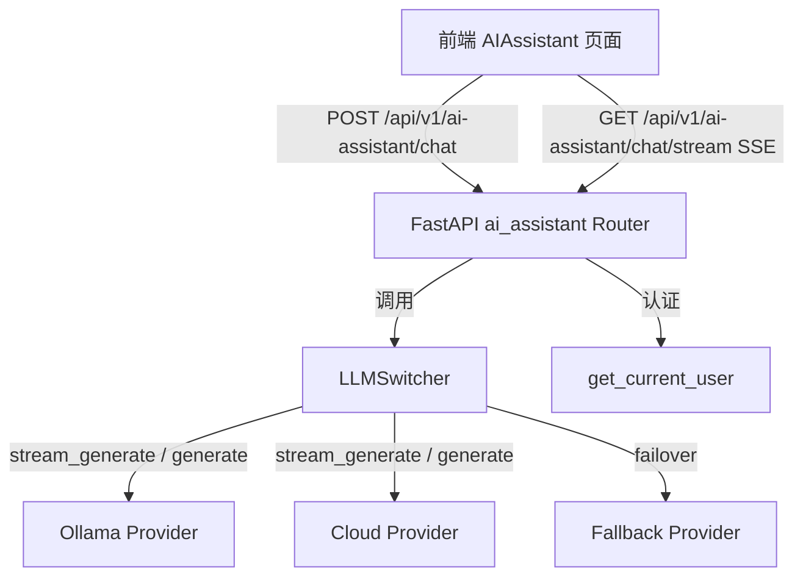
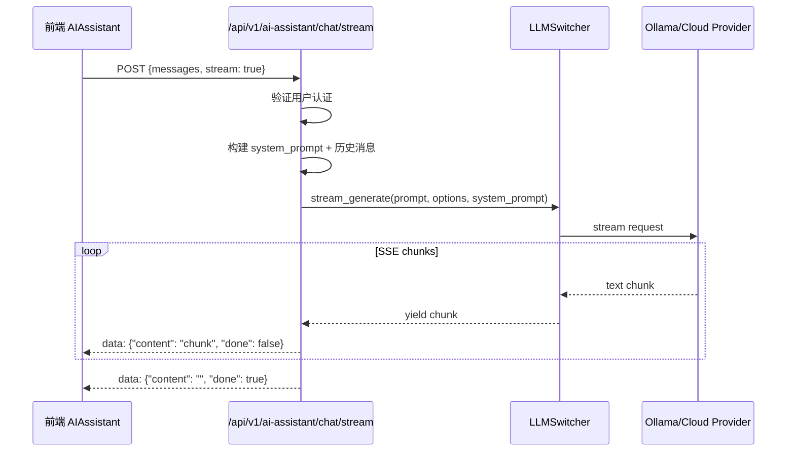
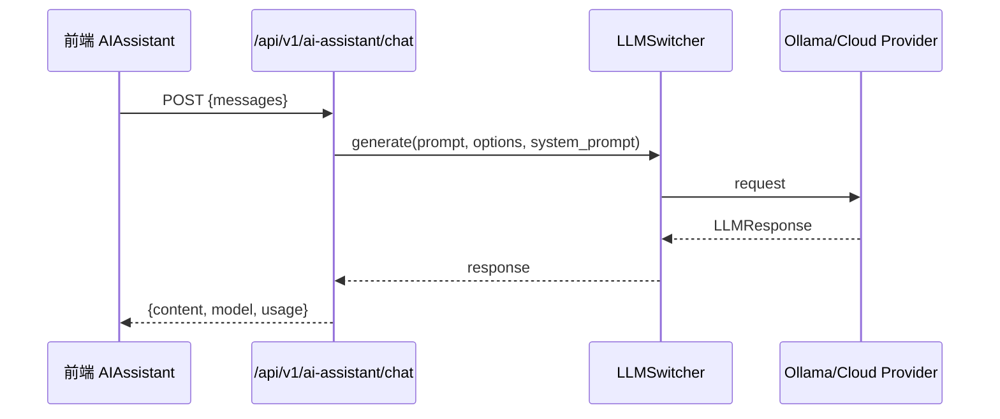

# 设计文档：AI 智能助手后端集成

## 概述

将现有 AI 助手前端页面（`AIAssistant/index.tsx`）从硬编码模拟响应升级为真实的 LLM 后端对接。新增 FastAPI 路由 `src/api/ai_assistant.py`，通过现有 `LLMSwitcher` 基础设施连接 Ollama 或其他 LLM 提供商，支持流式响应（SSE）。前端替换 `generateResponse()` 为真实 API 调用，使用 `EventSource` / `fetch` 实现流式文本渲染。

## 架构



## 时序图

### 流式对话流程



### 非流式对话流程



## 组件与接口

### 组件 1：后端路由 `src/api/ai_assistant.py`

**职责**：提供 AI 助手聊天 API，支持流式和非流式两种模式

```python
# FastAPI Router
router = APIRouter(prefix="/api/v1/ai-assistant", tags=["AI Assistant"])

# POST /chat - 非流式对话
@router.post("/chat", response_model=ChatResponse)
async def chat(request: ChatRequest, current_user = Depends(get_current_user)) -> ChatResponse

# POST /chat/stream - 流式对话 (SSE)
@router.post("/chat/stream")
async def chat_stream(request: ChatRequest, current_user = Depends(get_current_user)) -> StreamingResponse
```

### 组件 2：前端服务 `frontend/src/services/aiAssistantApi.ts`

**职责**：封装 AI 助手 API 调用，处理 SSE 流式响应

```typescript
// 非流式调用
async function sendMessage(messages: ChatMessage[]): Promise<ChatResponse>

// 流式调用 - 使用 fetch + ReadableStream
async function sendMessageStream(
  messages: ChatMessage[],
  onChunk: (content: string) => void,
  onDone: () => void,
  onError: (error: Error) => void
): Promise<AbortController>
```

### 组件 3：前端页面改造 `AIAssistant/index.tsx`

**职责**：替换硬编码 `generateResponse()` 为真实 API 调用，支持流式文本渲染

## 数据模型

### 后端 Schemas

```python
class ChatMessage(BaseModel):
    role: Literal["user", "assistant", "system"]
    content: str

class ChatRequest(BaseModel):
    messages: list[ChatMessage]  # 对话历史
    max_tokens: Optional[int] = Field(None, ge=1, le=4096)
    temperature: Optional[float] = Field(None, ge=0.0, le=2.0)

class ChatResponse(BaseModel):
    content: str
    model: str
    usage: Optional[dict[str, int]] = None
```

### 前端 Types

```typescript
interface ChatMessage {
  role: 'user' | 'assistant' | 'system';
  content: string;
}

interface ChatRequest {
  messages: ChatMessage[];
  max_tokens?: number;
  temperature?: number;
}

interface ChatResponse {
  content: string;
  model: string;
  usage?: { prompt_tokens: number; completion_tokens: number; total_tokens: number };
}

// SSE chunk 格式
interface StreamChunk {
  content: string;
  done: boolean;
}
```


## 关键函数与形式化规约

### 函数 1：chat()

```python
@router.post("/chat")
async def chat(request: ChatRequest, current_user = Depends(get_current_user)) -> ChatResponse
```

**前置条件**：
- `request.messages` 非空，至少包含一条 `role="user"` 的消息
- `current_user` 已通过 JWT 认证
- LLMSwitcher 已初始化且至少有一个可用 provider

**后置条件**：
- 返回 `ChatResponse`，`content` 为 LLM 生成的文本
- 若 LLM 服务不可用，返回 HTTP 503
- 若请求参数无效，返回 HTTP 422

### 函数 2：chat_stream()

```python
@router.post("/chat/stream")
async def chat_stream(request: ChatRequest, current_user = Depends(get_current_user)) -> StreamingResponse
```

**前置条件**：
- 同 `chat()` 的前置条件
- 客户端支持 SSE（text/event-stream）

**后置条件**：
- 返回 `StreamingResponse`，Content-Type 为 `text/event-stream`
- 每个 chunk 格式：`data: {"content": "...", "done": false}\n\n`
- 最后一个 chunk：`data: {"content": "", "done": true}\n\n`
- 异常时发送 `data: {"error": "...", "done": true}\n\n`

### 函数 3：sendMessageStream()（前端）

```typescript
async function sendMessageStream(
  messages: ChatMessage[],
  onChunk: (content: string) => void,
  onDone: () => void,
  onError: (error: Error) => void
): Promise<AbortController>
```

**前置条件**：
- `messages` 数组非空
- 用户已登录（token 存在）

**后置条件**：
- 返回 `AbortController` 用于取消请求
- 每收到一个 chunk 调用 `onChunk(content)`
- 流结束时调用 `onDone()`
- 异常时调用 `onError(error)`

## 算法伪代码

### 后端流式响应算法

```python
async def generate_stream(request, switcher):
    # 1. 构建 prompt：将 messages 数组转为 LLM 可理解的格式
    last_user_msg = request.messages[-1].content
    system_prompt = SYSTEM_PROMPT  # 预定义的系统提示词
    
    # 2. 将历史消息拼接为上下文
    history = format_chat_history(request.messages[:-1])
    prompt = f"{history}\n{last_user_msg}" if history else last_user_msg
    
    # 3. 构建生成选项
    options = GenerateOptions(
        max_tokens=request.max_tokens or 2000,
        temperature=request.temperature or 0.7,
        stream=True
    )
    
    # 4. 流式生成
    try:
        async for chunk in switcher.stream_generate(
            prompt=prompt, options=options, system_prompt=system_prompt
        ):
            yield f"data: {json.dumps({'content': chunk, 'done': False})}\n\n"
        yield f"data: {json.dumps({'content': '', 'done': True})}\n\n"
    except Exception as e:
        yield f"data: {json.dumps({'error': str(e), 'done': True})}\n\n"
```

### 前端流式接收算法

```typescript
async function handleStreamResponse(response: Response, onChunk, onDone, onError) {
    const reader = response.body?.getReader()
    if (!reader) { onError(new Error('No reader')); return }
    
    const decoder = new TextDecoder()
    let buffer = ''
    
    while (true) {
        const { done, value } = await reader.read()
        if (done) break
        
        buffer += decoder.decode(value, { stream: true })
        const lines = buffer.split('\n\n')
        buffer = lines.pop() || ''
        
        for (const line of lines) {
            if (!line.startsWith('data: ')) continue
            const data = JSON.parse(line.slice(6))
            if (data.error) { onError(new Error(data.error)); return }
            if (data.done) { onDone(); return }
            onChunk(data.content)
        }
    }
}
```

## 示例用法

### 后端调用示例

```python
# POST /api/v1/ai-assistant/chat
{
    "messages": [
        {"role": "user", "content": "帮我分析当前数据集的质量"}
    ],
    "temperature": 0.7
}

# Response
{
    "content": "我来帮您分析数据集质量...",
    "model": "qwen2:7b",
    "usage": {"prompt_tokens": 50, "completion_tokens": 200, "total_tokens": 250}
}
```

### 前端调用示例

```typescript
// 流式调用
const abortCtrl = await sendMessageStream(
    [{ role: 'user', content: '帮我分析销售数据' }],
    (chunk) => setMessages(prev => appendToLastMessage(prev, chunk)),
    () => setIsLoading(false),
    (err) => { message.error(err.message); setIsLoading(false); }
)

// 取消请求
abortCtrl.abort()
```

## Correctness Properties

*A property is a characteristic or behavior that should hold true across all valid executions of a system-essentially, a formal statement about what the system should do. Properties serve as the bridge between human-readable specifications and machine-verifiable correctness guarantees.*

### Property 1: 参数校验拒绝越界值

*For any* ChatRequest，当 temperature 不在 [0.0, 2.0] 范围内或 max_tokens 不在 [1, 4096] 范围内时，API 应返回 HTTP 422 且不调用 LLMSwitcher。

**Validates: Requirements 1.3, 1.4**

### Property 2: SSE 流格式一致性

*For any* 流式响应，每个非终止 chunk 必须符合 `data: {"content": "...", "done": false}\n\n` 格式，且最后一个 chunk 必须为 `data: {"content": "", "done": true}\n\n`。

**Validates: Requirements 2.2, 2.3**

### Property 3: 流式错误传播

*For any* LLM 在流式生成过程中抛出的异常，API 必须发送 `data: {"error": "...", "done": true}\n\n` 格式的错误 chunk 并关闭流。

**Validates: Requirement 2.4**

### Property 4: 认证强制性

*For any* 未携带有效 Bearer token 的请求（包括无 token、过期 token、格式错误 token），所有 AI_Assistant_Router 端点应返回 HTTP 401。

**Validates: Requirements 3.1, 3.2**

### Property 5: Prompt 上下文构建

*For any* 包含 N 条消息的 ChatRequest，构建的 prompt 应包含所有历史消息内容且保持原始顺序，同时附带预定义的 system_prompt。

**Validates: Requirements 5.1, 5.2, 5.3**

### Property 6: 前端 SSE 解析正确性

*For any* 合法的 SSE 事件序列，Frontend_Service 应对每个 content chunk 调用 onChunk，对 done=true 调用 onDone，对 error 字段调用 onError，且三种回调互不遗漏。

**Validates: Requirements 6.3, 6.4, 6.5**

### Property 7: 请求可取消

*For any* 进行中的流式请求，调用 AbortController.abort() 后，不再触发后续 onChunk 回调，且已显示的内容保持不变。

**Validates: Requirements 7.3, 7.4**

### Property 8: 消息完整性（流式与非流式等价）

*For any* 相同的 ChatRequest，流式响应中所有 chunk 的 content 拼接结果应等于非流式响应的 content 字段。

**Validates: Requirements 1.1, 2.2, 2.3**

## 错误处理

| 场景 | 条件 | 响应 | 恢复 |
|------|------|------|------|
| 未认证 | 无 token 或 token 过期 | HTTP 401 | 前端跳转登录页 |
| LLM 不可用 | Switcher 无可用 provider | HTTP 503 | 前端显示"AI 服务暂不可用" |
| 请求超时 | LLM 响应超过 60s | HTTP 504 / SSE error | 前端提示重试 |
| 参数无效 | messages 为空 | HTTP 422 | 前端表单校验 |
| 流中断 | 网络断开 | SSE 连接关闭 | 前端检测断开，提示重试 |

## 测试策略

- 单元测试：后端 router 函数的请求校验、prompt 构建逻辑
- 集成测试：完整的 chat 和 chat/stream 端点测试（mock LLMSwitcher）
- 前端测试：`aiAssistantApi.ts` 的流式解析逻辑、错误处理

## 依赖

- 后端：`fastapi`、`pydantic`、`httpx`（已有）、`src.ai.llm_switcher`、`src.api.auth`
- 前端：`axios`（已有）、`fetch` API（原生）、`antd`（已有）
