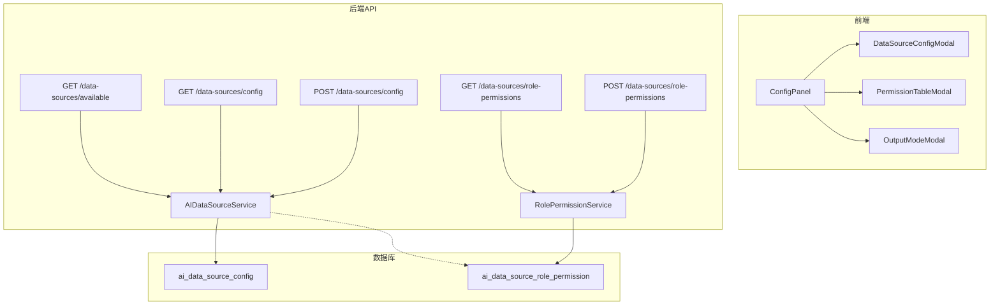

# 设计文档：AI 智能助手配置方式重构

## 概述

将 AI 助手页面的数据源配置从聊天区域工具栏迁移到右侧边栏底部，拆分为三个独立入口：管理员专属的「配置数据源」和「配置权限表」，以及所有用户可用的「输出方式」。后端新增角色权限映射表和对应 API，实现基于角色的数据源访问控制。

核心设计决策：
- 复用现有 `AIDataSourceService` 和 API 端点，仅扩展角色权限部分
- 前端新增 3 个 Modal 组件 + 1 个 ConfigPanel 组件，保持最小改动
- 权限过滤在后端 `get_available_sources` 中完成，前端无需额外逻辑

## 架构



## 组件与接口

### 前端组件

1. **ConfigPanel** (`frontend/src/pages/AIAssistant/components/ConfigPanel.tsx`)
   - 固定在 Right_Sidebar 底部，包含配置按钮
   - Props: `userRole: string`, `onDataSourceSelect: (ids: string[], mode: OutputMode) => void`
   - 根据 `userRole === 'admin'` 决定显示 3 个或 1 个按钮

2. **DataSourceConfigModal** (`components/DataSourceConfigModal.tsx`)
   - 管理员启用/禁用数据源 + 访问模式选择
   - 复用现有 `GET/POST /data-sources/config` API

3. **PermissionTableModal** (`components/PermissionTableModal.tsx`)
   - 角色-数据源权限矩阵表格（行=角色，列=已启用数据源）
   - 调用新增 `GET/POST /data-sources/role-permissions` API

4. **OutputModeModal** (`components/OutputModeModal.tsx`)
   - 数据源多选列表（仅显示当前角色有权访问的）+ 输出方式选择
   - 调用 `GET /data-sources/available`（后端已按角色过滤）

### 后端接口

新增 2 个端点（在 `src/api/ai_assistant.py` 中）：

```python
# 获取角色权限映射
GET /api/v1/ai-assistant/data-sources/role-permissions
Response: { "permissions": [{ "role": str, "source_id": str, "allowed": bool }] }

# 更新角色权限映射（admin only）
POST /api/v1/ai-assistant/data-sources/role-permissions
Body: { "permissions": [{ "role": str, "source_id": str, "allowed": bool }] }
```

修改现有端点：
- `GET /data-sources/available`：增加根据 `current_user.role` 查询权限表过滤逻辑

### 新增服务

**RolePermissionService** (`src/ai/role_permission_service.py`)：
- `get_all_permissions() -> list[dict]`：返回所有角色权限映射
- `get_permissions_by_role(role: str) -> list[str]`：返回指定角色可访问的 source_id 列表
- `update_permissions(permissions: list[dict])`：批量更新权限映射

## 数据模型

### 新增表：`ai_data_source_role_permission`

| 字段 | 类型 | 说明 |
|------|------|------|
| id | Integer, PK | 自增主键 |
| role | String | 角色名（admin/business_expert/annotator/viewer） |
| source_id | String | 数据源 ID（对应 DATA_SOURCE_REGISTRY） |
| allowed | Boolean | 是否允许访问，默认 False |
| updated_at | DateTime | 更新时间 |

唯一约束：`(role, source_id)`

### 现有表无变更

`ai_data_source_config` 表保持不变，继续管理数据源启用/禁用和访问模式。


## 正确性属性

*属性是在系统所有有效执行中都应成立的特征或行为——本质上是关于系统应该做什么的形式化陈述。属性是人类可读规范与机器可验证正确性保证之间的桥梁。*

### 属性 1：角色决定配置按钮可见性

*对于任意*用户角色，ConfigPanel 显示的按钮数量应为：admin 角色显示 3 个（配置数据源、配置权限表、输出方式），非 admin 角色仅显示 1 个（输出方式）。

**Validates: Requirements 2.3, 2.4**

### 属性 2：数据源配置持久化往返

*对于任意*有效的数据源配置（启用/禁用状态 + 访问模式），通过 POST 保存后再通过 GET 读取，应返回与保存时一致的配置状态。

**Validates: Requirements 3.4**

### 属性 3：角色权限映射持久化往返

*对于任意*有效的角色权限映射配置，通过 POST 保存后再通过 GET 读取，应返回与保存时一致的权限映射。

**Validates: Requirements 4.4**

### 属性 4：可用数据源等于已启用与角色授权的交集

*对于任意*用户角色和任意数据源配置状态，`GET /data-sources/available` 返回的数据源列表应恰好等于「已启用的数据源」∩「该角色被授权访问的数据源」。

**Validates: Requirements 5.2, 6.3**

### 属性 5：非管理员访问权限接口返回 403

*对于任意*非 admin 角色用户，调用 `GET/POST /data-sources/role-permissions` 接口时，后端应返回 HTTP 403 状态码。

**Validates: Requirements 6.4**

## 错误处理

| 场景 | 处理方式 |
|------|----------|
| 数据源配置保存失败 | Modal 内显示 `message.error(t('configSaveFailed'))` |
| 权限表保存失败 | Modal 内显示 `message.error(t('permissionSaveFailed'))` |
| 非管理员访问管理接口 | 后端返回 403，前端不渲染对应按钮（双重防护） |
| 数据源列表加载失败 | OutputModeModal 显示空状态提示 |
| 网络超时 | 按钮 loading 状态 + 超时后恢复，显示重试提示 |

## 测试策略

### 单元测试

- ConfigPanel 按钮渲染：验证 admin/非 admin 角色下按钮数量和文本
- Modal 组件：验证打开/关闭、表单提交、错误提示
- 后端 Service：验证 `RolePermissionService` 的 CRUD 操作
- API 端点：验证权限校验（403）、正常响应格式

### 属性测试

使用 `fast-check`（前端）和 `hypothesis`（后端 Python）。

每个属性测试至少运行 100 次迭代，标注格式：

```
// Feature: ai-assistant-config-redesign, Property 1: 角色决定配置按钮可见性
// Feature: ai-assistant-config-redesign, Property 2: 数据源配置持久化往返
// Feature: ai-assistant-config-redesign, Property 3: 角色权限映射持久化往返
// Feature: ai-assistant-config-redesign, Property 4: 可用数据源等于已启用与角色授权的交集
// Feature: ai-assistant-config-redesign, Property 5: 非管理员访问权限接口返回 403
```

属性 1 用 `fast-check` 在前端测试（生成随机角色 → 渲染 ConfigPanel → 断言按钮数量）。
属性 2-5 用 `hypothesis` 在后端测试（生成随机配置/角色/权限组合 → 调用 Service → 断言结果）。
