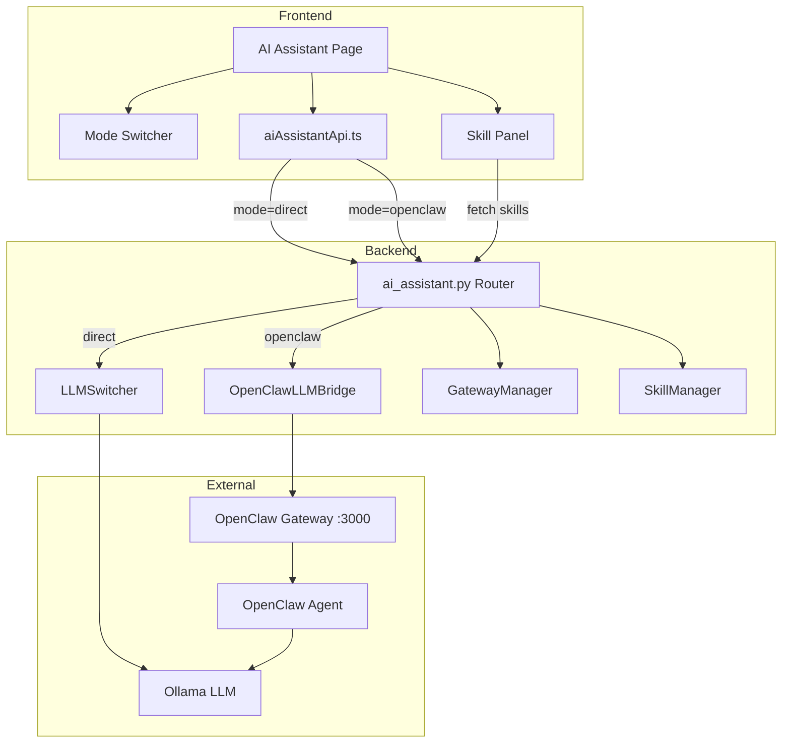
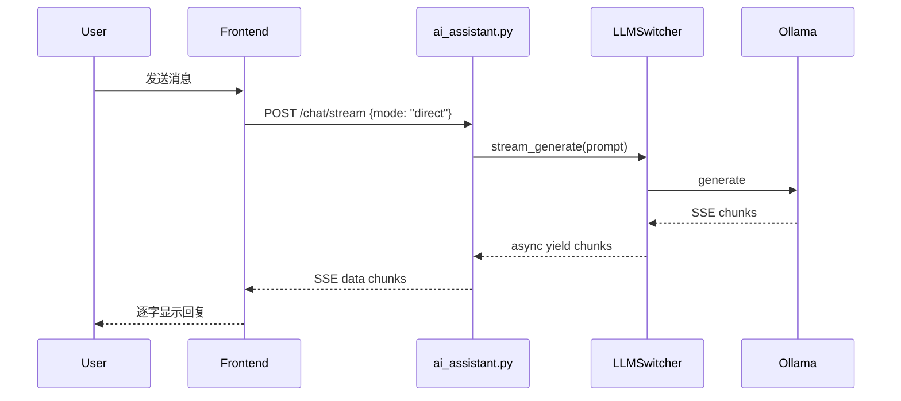
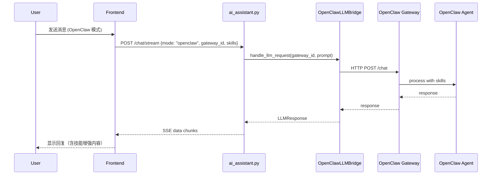
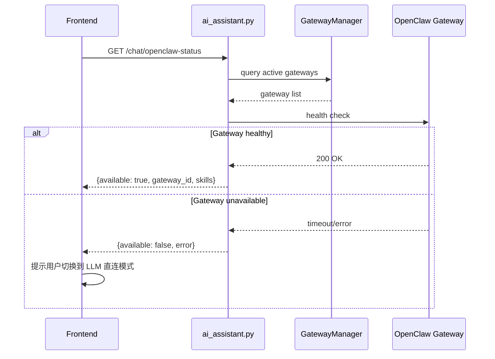

# Design Document: AI Assistant OpenClaw Integration

## Overview

在现有 AI 智能助手页面中集成 OpenClaw 应用服务，让用户可以在两种模式间切换：LLM 直连模式（当前已实现，直接调用 LLMSwitcher → Ollama）和 OpenClaw 模式（通过 OpenClaw 网关调用，支持技能集成）。

核心思路是在后端 AI Assistant API 中新增 `mode` 参数来路由请求，复用已有的 `OpenClawLLMBridge` 和 `GatewayManager` 基础设施。前端通过模式切换器控制请求路由，并在 OpenClaw 模式下展示可用技能列表。

## Architecture



## Sequence Diagrams

### LLM 直连模式（现有流程）



### OpenClaw 模式



### 网关健康检查与降级



## Components and Interfaces

### Component 1: Backend Chat Router (修改 `src/api/ai_assistant.py`)

**Purpose**: 根据 `mode` 参数将聊天请求路由到 LLMSwitcher 或 OpenClawLLMBridge。

**Interface**:
```python
class ChatRequest(BaseModel):
    messages: list[ChatMessage]
    max_tokens: Optional[int] = None
    temperature: Optional[float] = None
    mode: Literal["direct", "openclaw"] = "direct"
    gateway_id: Optional[str] = None
    skill_ids: Optional[list[str]] = None
```

**Responsibilities**:
- 解析 mode 参数，路由到对应的 LLM 后端
- openclaw 模式下验证 gateway_id 存在且 active
- 提供 `/chat/openclaw-status` 端点查询网关可用性和技能列表
- 错误降级：OpenClaw 不可用时返回明确错误码

### Component 2: OpenClaw Chat Service (新增 `src/ai_integration/openclaw_chat_service.py`)

**Purpose**: 封装 OpenClaw 网关的聊天调用逻辑，支持流式和非流式。

**Interface**:
```python
class OpenClawChatService:
    def __init__(self, bridge: OpenClawLLMBridge, db: Session): ...

    async def chat(
        self, gateway_id: str, tenant_id: str,
        prompt: str, options: GenerateOptions,
        system_prompt: str, skill_ids: list[str] | None
    ) -> LLMResponse: ...

    async def stream_chat(
        self, gateway_id: str, tenant_id: str,
        prompt: str, options: GenerateOptions,
        system_prompt: str, skill_ids: list[str] | None
    ) -> AsyncIterator[str]: ...

    async def get_status(self, tenant_id: str) -> OpenClawStatus: ...
```

**Responsibilities**:
- 调用 OpenClawLLMBridge.handle_llm_request 处理非流式请求
- 实现流式响应（通过 OpenClaw Gateway HTTP API）
- 查询可用网关和技能状态
- 网关不可用时抛出明确异常

### Component 3: Frontend Mode Switcher (修改 `frontend/src/pages/AIAssistant/index.tsx`)

**Purpose**: 在聊天页面头部添加模式切换器，控制请求路由。

**Interface**:
```typescript
type ChatMode = 'direct' | 'openclaw';

interface ModeState {
  mode: ChatMode;
  gatewayId: string | null;
  gatewayAvailable: boolean;
  skills: SkillInfo[];
}
```

**Responsibilities**:
- 渲染 Segmented 组件切换 direct/openclaw 模式
- 切换到 openclaw 时自动检查网关状态
- 网关不可用时显示警告并禁用 openclaw 选项
- 将 mode 和 gateway_id 传递给 API 调用

### Component 4: Frontend Skill Panel (修改右侧栏)

**Purpose**: 在 OpenClaw 模式下展示可用技能列表。

**Interface**:
```typescript
interface SkillInfo {
  id: string;
  name: string;
  version: string;
  status: string;
  description?: string;
}

interface SkillPanelProps {
  visible: boolean;
  skills: SkillInfo[];
  selectedSkills: string[];
  onSkillToggle: (skillId: string) => void;
}
```

**Responsibilities**:
- 展示当前网关已部署的技能列表
- 支持勾选/取消技能（选中的技能 ID 随请求发送）
- 技能状态标签（deployed/disabled）

## Data Models

### 前端新增类型 (`frontend/src/types/aiAssistant.ts`)

```typescript
export type ChatMode = 'direct' | 'openclaw';

export interface ChatRequest {
  messages: ChatMessage[];
  max_tokens?: number;
  temperature?: number;
  mode?: ChatMode;
  gateway_id?: string;
  skill_ids?: string[];
}

export interface SkillInfo {
  id: string;
  name: string;
  version: string;
  status: string;
  description?: string;
}

export interface OpenClawStatus {
  available: boolean;
  gateway_id: string | null;
  gateway_name: string | null;
  skills: SkillInfo[];
  error?: string;
}
```

**Validation Rules**:
- `mode` 为 `"openclaw"` 时，`gateway_id` 必须非空
- `skill_ids` 仅在 `mode === "openclaw"` 时有效

### 后端新增模型 (`src/api/ai_assistant.py`)

```python
class ChatRequest(BaseModel):
    messages: list[ChatMessage] = Field(..., min_length=1)
    max_tokens: Optional[int] = Field(None, ge=1, le=4096)
    temperature: Optional[float] = Field(None, ge=0.0, le=2.0)
    mode: Literal["direct", "openclaw"] = "direct"
    gateway_id: Optional[str] = None
    skill_ids: Optional[list[str]] = None

    @model_validator(mode="after")
    def validate_openclaw_fields(self):
        if self.mode == "openclaw" and not self.gateway_id:
            raise ValueError("gateway_id is required for openclaw mode")
        return self

class OpenClawStatusResponse(BaseModel):
    available: bool
    gateway_id: Optional[str] = None
    gateway_name: Optional[str] = None
    skills: list[SkillInfoResponse] = []
    error: Optional[str] = None

class SkillInfoResponse(BaseModel):
    id: str
    name: str
    version: str
    status: str
    description: Optional[str] = None
```

## Key Functions with Formal Specifications

### Function 1: route_chat_request()

```python
async def route_chat_request(
    request: ChatRequest, switcher: LLMSwitcher,
    openclaw_service: OpenClawChatService
) -> Union[LLMResponse, AsyncIterator[str]]:
```

**Preconditions:**
- `request.messages` 非空
- 若 `request.mode == "openclaw"`，则 `request.gateway_id` 非空
- `switcher` 已初始化

**Postconditions:**
- `mode == "direct"` → 调用 `switcher.generate()` 返回 LLMResponse
- `mode == "openclaw"` → 调用 `openclaw_service.chat()` 返回 LLMResponse
- OpenClaw 网关不可用 → 抛出 HTTPException(503)

**Loop Invariants:** N/A

### Function 2: OpenClawChatService.stream_chat()

```python
async def stream_chat(
    self, gateway_id: str, tenant_id: str,
    prompt: str, options: GenerateOptions,
    system_prompt: str, skill_ids: list[str] | None
) -> AsyncIterator[str]:
```

**Preconditions:**
- `gateway_id` 对应的网关存在且 status == "active"
- `tenant_id` 非空
- `prompt` 非空字符串

**Postconditions:**
- 成功时 yield SSE 格式的 JSON 字符串序列，最后一条 `done: true`
- 网关不可用时抛出 `OpenClawUnavailableError`
- 所有 yield 的 chunk 格式为 `{"content": str, "done": bool}`

**Loop Invariants:**
- 每次 yield 的 chunk 都是合法 JSON

### Function 3: get_openclaw_status()

```python
async def get_openclaw_status(tenant_id: str, db: Session) -> OpenClawStatusResponse:
```

**Preconditions:**
- `tenant_id` 非空
- `db` session 有效

**Postconditions:**
- 返回 `OpenClawStatusResponse`
- 若存在 active 的 openclaw 网关 → `available=True`, 包含 skills 列表
- 若无 active 网关 → `available=False`, `error` 包含原因
- 不抛出异常（内部捕获所有错误）

**Loop Invariants:** N/A

## Algorithmic Pseudocode

### 聊天路由算法

```python
async def handle_chat_stream(request: ChatRequest, user, db):
    prompt = format_chat_history(request.messages)
    options = GenerateOptions(
        max_tokens=request.max_tokens or 2000,
        temperature=request.temperature or 0.7,
        stream=True,
    )

    if request.mode == "direct":
        switcher = get_llm_switcher()
        async for chunk in switcher.stream_generate(
            prompt=prompt, options=options, system_prompt=SYSTEM_PROMPT
        ):
            yield sse_chunk(content=chunk, done=False)
        yield sse_chunk(content="", done=True)

    elif request.mode == "openclaw":
        # Guard: validate gateway
        if not request.gateway_id:
            yield sse_chunk(error="gateway_id required", done=True)
            return

        service = get_openclaw_chat_service(db)
        try:
            async for chunk in service.stream_chat(
                gateway_id=request.gateway_id,
                tenant_id=get_tenant_id(user),
                prompt=prompt,
                options=options,
                system_prompt=SYSTEM_PROMPT,
                skill_ids=request.skill_ids,
            ):
                yield chunk
        except OpenClawUnavailableError as e:
            yield sse_chunk(error=str(e), done=True)
```

### OpenClaw 状态查询算法

```python
async def get_openclaw_status(tenant_id: str, db: Session):
    # 查询该租户下 active 的 openclaw 网关
    gateway = db.query(AIGateway).filter(
        AIGateway.tenant_id == tenant_id,
        AIGateway.gateway_type == "openclaw",
        AIGateway.status == "active",
    ).first()

    if not gateway:
        return OpenClawStatusResponse(available=False, error="无可用的 OpenClaw 网关")

    # 查询网关下已部署的技能
    skills = db.query(AISkill).filter(
        AISkill.gateway_id == gateway.id,
        AISkill.status == "deployed",
    ).all()

    return OpenClawStatusResponse(
        available=True,
        gateway_id=gateway.id,
        gateway_name=gateway.name,
        skills=[SkillInfoResponse(
            id=s.id, name=s.name, version=s.version,
            status=s.status, description=s.configuration.get("description"),
        ) for s in skills],
    )
```

## Example Usage

### 前端切换模式并发送消息

```typescript
// 切换到 OpenClaw 模式
const [modeState, setModeState] = useState<ModeState>({
  mode: 'direct',
  gatewayId: null,
  gatewayAvailable: false,
  skills: [],
});

// 切换模式时检查网关状态
const handleModeChange = async (newMode: ChatMode) => {
  if (newMode === 'openclaw') {
    const status = await getOpenClawStatus();
    if (!status.available) {
      message.warning(t('aiAssistant.openclawUnavailable'));
      return;
    }
    setModeState({
      mode: 'openclaw',
      gatewayId: status.gateway_id,
      gatewayAvailable: true,
      skills: status.skills,
    });
  } else {
    setModeState({ mode: 'direct', gatewayId: null, gatewayAvailable: false, skills: [] });
  }
};

// 发送消息时携带模式信息
sendMessageStream({
  messages: apiMessages,
  mode: modeState.mode,
  gateway_id: modeState.gatewayId ?? undefined,
  skill_ids: selectedSkillIds,
}, callbacks);
```

### 后端 OpenClaw 聊天调用

```python
# 在 ai_assistant.py 的 stream endpoint 中
@router.post("/chat/stream")
async def chat_stream(request: ChatRequest, user = Depends(get_current_user)):
    if request.mode == "openclaw":
        service = get_openclaw_chat_service()
        return StreamingResponse(
            openclaw_stream(request, service, user),
            media_type="text/event-stream",
        )
    # 默认 direct 模式
    switcher = get_llm_switcher()
    return StreamingResponse(
        generate_stream(request, switcher),
        media_type="text/event-stream",
    )
```

## Error Handling

### Error Scenario 1: OpenClaw 网关不可用

**Condition**: 用户选择 OpenClaw 模式但网关未部署或已停止
**Response**: 前端切换模式时调用 `/chat/openclaw-status`，返回 `available: false`
**Recovery**: 前端显示警告 toast，阻止切换到 OpenClaw 模式，建议使用 LLM 直连

### Error Scenario 2: OpenClaw 请求超时

**Condition**: OpenClaw 网关响应超时（>60s）
**Response**: 后端捕获 asyncio.TimeoutError，返回 SSE error chunk `{"error": "OpenClaw 网关响应超时", "done": true}`
**Recovery**: 前端显示错误消息，用户可重试或切换模式

### Error Scenario 3: 网关中途断开

**Condition**: 流式响应过程中 OpenClaw 网关连接断开
**Response**: 后端捕获连接异常，yield error chunk
**Recovery**: 前端停止 loading 状态，显示部分已接收内容 + 错误提示

### Error Scenario 4: gateway_id 无效

**Condition**: 请求中的 gateway_id 不存在或已停用
**Response**: 后端返回 HTTP 404 或 SSE error chunk
**Recovery**: 前端重新查询 openclaw-status 刷新网关信息

## Testing Strategy

### Unit Testing Approach

- 测试 `ChatRequest` 的 mode/gateway_id 联合校验
- 测试 `route_chat_request` 在 direct/openclaw 模式下的路由逻辑
- 测试 `get_openclaw_status` 在有/无 active 网关时的返回
- Mock `OpenClawLLMBridge.handle_llm_request` 测试 OpenClawChatService

### Property-Based Testing Approach

**Property Test Library**: hypothesis (Python), fast-check (TypeScript)

- 对任意合法 ChatRequest，mode="direct" 时不访问 OpenClaw 基础设施
- 对任意合法 ChatRequest，mode="openclaw" 且 gateway_id 为空时返回验证错误
- OpenClawStatus 返回的 skills 列表中所有 skill 的 status 都是 "deployed"

### Integration Testing Approach

- 端到端测试：前端切换模式 → 后端路由 → 返回响应
- 网关健康检查集成测试
- 流式响应完整性测试

## Security Considerations

- OpenClaw 网关请求复用现有的 JWT 认证（`get_current_user`）
- gateway_id 需验证属于当前用户的 tenant
- 技能列表按 tenant 隔离，不跨租户泄露
- OpenClaw 网关通信走内部网络，不暴露到公网

## Dependencies

- 现有模块（复用，不修改）：
  - `src/ai_integration/openclaw_llm_bridge.py` — LLM 桥接
  - `src/ai_integration/gateway_manager.py` — 网关管理
  - `src/ai_integration/skill_manager.py` — 技能管理
  - `src/ai/llm_switcher.py` — LLM 统一调用
  - `src/models/ai_integration.py` — 数据库模型
- 修改模块：
  - `src/api/ai_assistant.py` — 新增 mode 路由、openclaw-status 端点
  - `frontend/src/pages/AIAssistant/index.tsx` — 模式切换器、技能面板
  - `frontend/src/services/aiAssistantApi.ts` — 新增 getOpenClawStatus API
  - `frontend/src/types/aiAssistant.ts` — 新增类型定义
- 新增模块：
  - `src/ai_integration/openclaw_chat_service.py` — OpenClaw 聊天服务封装
