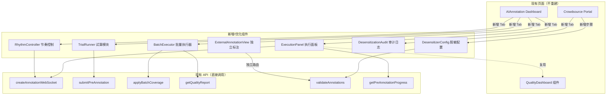

# 设计文档：AI 标注执行增强与众包标注优化

## Overview

在现有 AI 标注模块和众包门户基础上，增强前端执行可视化、新增试算/批量/节奏控制功能，优化众包脱敏分发流程。

设计原则：
- **不重复开发**：复用现有 Dashboard、QualityDashboard、Crowdsource 页面和 API
- **增量扩展**：在现有页面新增 Tab/面板，而非创建独立页面
- **复用 API**：`submitPreAnnotation`、`applyBatchCoverage`、`createAnnotationWebSocket`、`getQualityReport`、`validateAnnotations` 等已有 API 直接调用

## Architecture



## Components and Interfaces

### 1. ExecutionPanel（执行面板 — 优化 Dashboard）

**文件**: `frontend/src/components/AIAnnotation/ExecutionPanel.tsx`

在 Dashboard 新增 `execution` Tab，通过 `createAnnotationWebSocket` 接收实时数据。

```typescript
interface ExecutionPanelProps {
  taskId: string;
}

interface ExecutionState {
  progress: number;          // 0-100
  processed: number;
  remaining: number;
  estimatedTime: number;     // 秒
  confidenceDistribution: { range: string; count: number }[];
  labelDistribution: { label: string; count: number }[];
  errors: ExecutionError[];
  status: 'running' | 'paused' | 'completed' | 'error';
}
```

复用 `QualityDashboard` 的 `ConfidenceDistribution` 组件展示置信度分布。

### 2. TrialRunner（试算模块 — 新增）

**文件**: `frontend/src/components/AIAnnotation/TrialRunner.tsx`

调用 `submitPreAnnotation` API，限制 `max_items: 10-100`。

```typescript
interface TrialConfig {
  sampleSize: number;        // 10-100
  engineId?: string;
  annotationType: string;
  confidenceThreshold: number;
}

interface TrialResult {
  trialId: string;
  config: TrialConfig;
  accuracy: number;
  avgConfidence: number;
  confidenceDistribution: { range: string; count: number }[];
  labelDistribution: { label: string; count: number }[];
  duration: number;          // ms
  timestamp: string;
}
```

### 3. BatchExecutor（批量执行器 — 新增前端）

**文件**: `frontend/src/components/AIAnnotation/BatchExecutor.tsx`

调用 `applyBatchCoverage` + `getQualityReport` API，分批执行并展示质量趋势。

```typescript
interface BatchConfig {
  batchSize: number;         // 默认 100
  intervalSeconds: number;
  qualityThreshold: number;  // 准确率阈值
  autoStop: boolean;
}

interface BatchProgress {
  currentBatch: number;
  totalBatches: number;
  batchResults: BatchResult[];
}

interface BatchResult {
  batchIndex: number;
  accuracy: number;
  processedCount: number;
  status: 'completed' | 'paused' | 'failed';
}
```

### 4. RhythmController（节奏控制 — 新增）

**文件**: `frontend/src/components/AIAnnotation/RhythmController.tsx`

通过 WebSocket 发送速率/优先级调整指令。

```typescript
interface RhythmConfig {
  ratePerMinute: number;
  concurrency: number;
  priorityRules: PriorityRule[];
}

interface PriorityRule {
  field: 'dataType' | 'labelCategory';
  value: string;
  priority: number;          // 1-10
}

interface RhythmStatus {
  currentRate: number;
  queueDepth: number;
  resourceUsage: number;     // 0-100%
}
```

### 5. DesensitizerConfig（脱敏配置 — 优化 Crowdsource）

**文件**: `frontend/src/components/Crowdsource/DesensitizerConfig.tsx`

在众包任务创建流程中新增脱敏步骤。

```typescript
interface DesensitizationRule {
  id: string;
  type: 'name' | 'phone' | 'email' | 'address' | 'regex';
  pattern?: string;          // 自定义正则
  replacement: string;
  enabled: boolean;
}

interface DesensitizationPreview {
  original: string;
  desensitized: string;
}
```

### 6. DesensitizationAudit（审计日志 — 新增）

**文件**: `frontend/src/components/Crowdsource/DesensitizationAudit.tsx`

```typescript
interface AuditLogEntry {
  id: string;
  operator: string;
  timestamp: string;
  rules: DesensitizationRule[];
  affectedCount: number;
  taskId: string;
}

interface AuditFilter {
  dateRange?: [string, string];
  operator?: string;
}
```

### 7. ExternalAnnotationView（独立标注界面 — 新增）

**文件**: `frontend/src/pages/ExternalAnnotation/index.tsx`

独立路由 `/external-annotation/:token`，无需主系统登录。

```typescript
interface ExternalAnnotationProps {
  token: string;             // 加密的任务链接 token
}
```


## Data Models

本次为前端增强，不新增后端数据库表。前端状态管理使用 Zustand store。

### 前端 Store

```typescript
// frontend/src/stores/executionStore.ts
interface ExecutionStore {
  executions: Map<string, ExecutionState>;
  startExecution: (taskId: string) => void;
  pauseExecution: (taskId: string) => void;
  updateProgress: (taskId: string, data: Partial<ExecutionState>) => void;
}

// frontend/src/stores/trialStore.ts
interface TrialStore {
  trials: TrialResult[];
  addTrial: (result: TrialResult) => void;
  clearTrials: () => void;
}

// frontend/src/stores/batchStore.ts
interface BatchStore {
  config: BatchConfig;
  progress: BatchProgress | null;
  setConfig: (config: Partial<BatchConfig>) => void;
  addBatchResult: (result: BatchResult) => void;
}

// frontend/src/stores/rhythmStore.ts
interface RhythmStore {
  config: RhythmConfig;
  status: RhythmStatus;
  updateRate: (rate: number) => void;
  updatePriority: (rules: PriorityRule[]) => void;
}
```

### API 扩展（新增接口，复用现有 aiAnnotationApi.ts）

```typescript
// 在 aiAnnotationApi.ts 中新增
async function getDesensitizationRules(taskId: string): Promise<DesensitizationRule[]>;
async function saveDesensitizationRules(taskId: string, rules: DesensitizationRule[]): Promise<void>;
async function previewDesensitization(taskId: string, rules: DesensitizationRule[]): Promise<DesensitizationPreview[]>;
async function getAuditLogs(filter: AuditFilter): Promise<AuditLogEntry[]>;
async function generateExternalLink(taskId: string): Promise<{ url: string; token: string }>;
async function getExternalTask(token: string): Promise<{ task: AnnotationTask; data: unknown[] }>;
async function submitExternalAnnotation(token: string, annotations: unknown[]): Promise<void>;
async function updateRhythmConfig(config: RhythmConfig): Promise<void>;
async function getRhythmStatus(): Promise<RhythmStatus>;
async function mapBackAnnotations(taskId: string): Promise<{ mappedCount: number }>;
```


## Correctness Properties

*A property is a characteristic or behavior that should hold true across all valid executions of a system — essentially, a formal statement about what the system should do. Properties serve as the bridge between human-readable specifications and machine-verifiable correctness guarantees.*

### Property 1: 执行状态渲染完整性

*For any* ExecutionState（含随机 progress、processed、remaining、labelDistribution、confidenceDistribution），渲染后的执行面板应包含进度条、已处理数、剩余数、预估时间，且标签分布柱状图条目数等于 labelDistribution 长度，置信度直方图桶数等于 confidenceDistribution 长度。

**Validates: Requirements 1.1, 1.3**

### Property 2: WebSocket 消息正确更新状态

*For any* WebSocket 消息序列，每条消息应用后 ExecutionState 的 progress 应单调递增（或不变），processed 应 ≥ 更新前的值。

**Validates: Requirements 1.2**

### Property 3: 暂停保留已完成结果

*For any* ExecutionState（status='running'），执行暂停后 status 应变为 'paused'，且 processed 和 labelDistribution 保持不变。

**Validates: Requirements 1.5**

### Property 4: 试算样本数约束

*For any* 用户输入的样本数量 n，TrialRunner 传递给 `submitPreAnnotation` 的 `max_items` 应满足 10 ≤ max_items ≤ 100。若 n < 10 则 clamp 到 10，若 n > 100 则 clamp 到 100。

**Validates: Requirements 2.1**

### Property 5: 多次试算对比表完整性

*For any* TrialResult 列表（长度 ≥ 1），对比表行数应等于列表长度，且每行包含 config、accuracy、avgConfidence、duration 字段。

**Validates: Requirements 2.2, 2.4**

### Property 6: 低置信度警告

*For any* TrialResult，若 avgConfidence < 0.6 则应触发警告标志为 true，否则为 false。

**Validates: Requirements 2.5**

### Property 7: 批次质量自动暂停

*For any* BatchResult 和用户设定的 qualityThreshold，若 accuracy < qualityThreshold 则批量执行应自动暂停（status='paused'），否则等待用户确认继续。

**Validates: Requirements 3.2, 3.4**

### Property 8: 累计批次进度计算

*For any* BatchResult 列表，累计进度百分比应等于 `sum(processedCount) / totalItems * 100`，且质量趋势数据点数等于已完成批次数。

**Validates: Requirements 3.3**

### Property 9: 脱敏规则正确应用

*For any* 输入字符串和 DesensitizationRule（type 为 phone/email/name/address/regex），应用规则后输出不应包含原始敏感信息，且非敏感部分保持不变。

**Validates: Requirements 4.2**

### Property 10: 脱敏预览最多 5 条

*For any* 数据集（长度 ≥ 0）和脱敏规则，预览结果的长度应 ≤ min(5, 数据集长度)，且每条预览包含 original 和 desensitized 字段。

**Validates: Requirements 4.3**

### Property 11: 脱敏规则完整性校验

*For any* 数据集中检测到的敏感字段集合 S 和配置的脱敏规则覆盖的字段集合 R，若 S ⊄ R（存在未覆盖的敏感字段），则任务创建/分发应被阻止。空规则集是此情况的特例。

**Validates: Requirements 4.4, 6.4**

### Property 12: 优先级排序正确性

*For any* 任务列表和 PriorityRule 集合，按规则排序后的任务队列应满足：高优先级任务排在低优先级任务之前，相同优先级保持原始顺序（稳定排序）。

**Validates: Requirements 5.2, 5.4**

### Property 13: 速率变更更新预估时间

*For any* 剩余任务数 remaining 和新速率 ratePerMinute（> 0），预估完成时间应等于 `remaining / ratePerMinute` 分钟（允许浮点误差 ε < 0.01）。

**Validates: Requirements 5.3**

### Property 14: 审计日志字段完整性

*For any* 脱敏操作，生成的 AuditLogEntry 应包含非空的 operator、timestamp、rules（长度 ≥ 1）、affectedCount（≥ 0）和 taskId。

**Validates: Requirements 6.1**

### Property 15: 审计日志筛选正确性

*For any* AuditLogEntry 列表和 AuditFilter，筛选结果中的每条记录应满足：timestamp 在 dateRange 内（若指定），operator 等于 filter.operator（若指定）。

**Validates: Requirements 6.2**

### Property 16: 脱敏标注映射往返

*For any* 原始数据经脱敏后分发给标注员，标注结果回收后通过映射函数还原，还原后的标注应正确关联到原始数据记录（即 mapBack(desensitize(data)).id === data.id）。

**Validates: Requirements 6.3**

## Error Handling

| 场景 | 处理策略 |
|------|---------|
| WebSocket 断连 | 自动重连（指数退避），显示断连提示，重连后同步最新状态 |
| 试算 API 失败 | 显示错误详情，保留已有试算结果，允许重试 |
| 批次执行中某批失败 | 自动暂停，显示失败批次详情，允许跳过或重试该批 |
| 脱敏预览超时 | 显示超时提示，允许减少预览条数重试 |
| 独立标注链接过期 | 显示过期提示页，引导联系管理员获取新链接 |
| 速率调整 WebSocket 发送失败 | 回滚滑块到上一个值，显示错误提示 |

## Testing Strategy

### 单元测试
- ExecutionState 渲染逻辑（进度计算、分布数据转换）
- TrialRunner 配置校验（样本数 clamp）
- BatchExecutor 状态机（批次完成 → 等待确认 → 下一批）
- 脱敏规则应用（各类型规则的正则匹配和替换）
- 审计日志筛选逻辑
- 优先级排序算法

### 属性测试（Property-Based Testing）

使用 `fast-check` 库，每个属性测试最少 100 次迭代。

```typescript
// Feature: ai-crowdsource-annotation, Property 4: 试算样本数约束
fc.assert(fc.property(fc.integer(), (n) => {
  const clamped = clampSampleSize(n);
  return clamped >= 10 && clamped <= 100;
}), { numRuns: 100 });

// Feature: ai-crowdsource-annotation, Property 7: 批次质量自动暂停
fc.assert(fc.property(
  fc.float({ min: 0, max: 1 }), fc.float({ min: 0, max: 1 }),
  (accuracy, threshold) => {
    const result = checkBatchQuality(accuracy, threshold);
    return accuracy < threshold ? result.shouldPause : !result.shouldPause;
  }
), { numRuns: 100 });

// Feature: ai-crowdsource-annotation, Property 15: 审计日志筛选正确性
fc.assert(fc.property(
  fc.array(arbitraryAuditLog()), arbitraryAuditFilter(),
  (logs, filter) => {
    const filtered = filterAuditLogs(logs, filter);
    return filtered.every(log => matchesFilter(log, filter));
  }
), { numRuns: 100 });
```

### 集成测试
- Dashboard → ExecutionPanel WebSocket 集成
- TrialRunner → BatchExecutor 配置传递
- Crowdsource 任务创建 → 脱敏配置 → 链接生成完整流程
- ExternalAnnotationView 独立访问和提交
