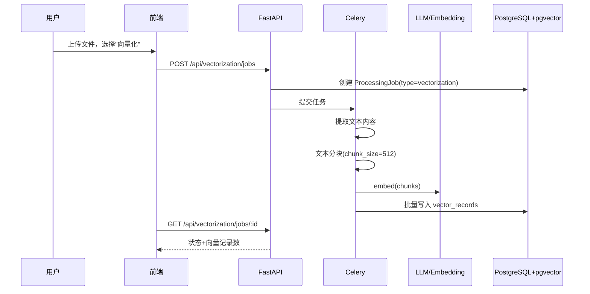

# 设计文档: AI 数据处理（ai-data-structuring）

## 概述

扩展现有 AI 结构化功能，对 PDF、PPT、Word、Excel、CSV、HTML、TXT、视频、音频等非结构化/半结构化数据，提供结构化、向量化、语义化三种处理能力。新增 PPT 提取器和音视频转录器，扩展文件类型支持。在 DataSync 页面新增"AI 数据处理"Tab，包含结构化/向量化/语义化三个子 Tab。复用现有 Celery 管道架构和 LLM Switcher 的 `embed()` 方法。

## 架构

```mermaid
graph TD
    subgraph 前端
        A[DataSync] -->|新 Tab| B[AI 数据处理]
        B --> B1[结构化]
        B --> B2[向量化]
        B --> B3[语义化]
    end

    subgraph 后端 API
        C[/api/structuring/jobs] --> D[Celery]
        E[/api/vectorization/jobs] --> D
        F[/api/semantic/jobs] --> D
    end

    subgraph 处理管道
        D --> P1[内容提取]
        P1 --> P2A[Schema推断→实体提取]
        P1 --> P2B[文本分块→Embedding→pgvector]
        P1 --> P2C[LLM语义分析→实体/关系/摘要]
    end

    subgraph 提取器
        P1 --> EX1[FileExtractor 现有: PDF/DOCX/HTML/TXT]
        P1 --> EX2[TabularParser 现有: CSV/Excel]
        P1 --> EX3[PPTExtractor 新增: PPT/PPTX]
        P1 --> EX4[MediaTranscriber 新增: Video/Audio]
    end
```

## 时序图：向量化流程



## 数据模型扩展

```python
# 扩展 FileType 枚举
class FileType(str, Enum):
    PDF = "pdf"; CSV = "csv"; EXCEL = "excel"
    DOCX = "docx"; HTML = "html"; TXT = "txt"
    PPT = "ppt"      # 新增
    VIDEO = "video"   # 新增
    AUDIO = "audio"   # 新增

# 新增处理类型
class ProcessingType(str, Enum):
    STRUCTURING = "structuring"
    VECTORIZATION = "vectorization"
    SEMANTIC = "semantic"

# StructuringJob 扩展字段
# processing_type: String(20), default="structuring"
# chunk_count: Integer, nullable (向量化用)

# 新增表: vector_records
class VectorRecord(Base):
    __tablename__ = "vector_records"
    id: UUID (PK)
    job_id: UUID (FK → structuring_jobs)
    chunk_index: Integer
    chunk_text: Text
    embedding: Vector(1536)  # pgvector
    metadata_: JSONB
    created_at: DateTime

# 新增表: semantic_records
class SemanticRecord(Base):
    __tablename__ = "semantic_records"
    id: UUID (PK)
    job_id: UUID (FK → structuring_jobs)
    record_type: String  # entity/relationship/summary
    content: JSONB  # {name, type, properties} 或 {source, target, relation} 或 {text}
    confidence: Float
    created_at: DateTime
```

## 关键函数签名

```python
# src/extractors/ppt.py — PPT 提取器
class PPTExtractor:
    def extract(self, file_path: str) -> str:
        """用 python-pptx 提取幻灯片文本，按页拼接"""
        # 前置: file_path 存在且为 .pptx
        # 后置: 返回非空字符串，包含所有幻灯片文本

# src/extractors/media.py — 音视频转录
class MediaTranscriber:
    async def transcribe(self, file_path: str) -> str:
        """用 Whisper API (OpenAI/Ollama) 转录音视频为文本"""
        # 前置: file_path 为支持的音视频格式
        # 后置: 返回转录文本; 视频先用 ffmpeg 提取音轨

# src/services/vectorization_pipeline.py
def run_vectorization_pipeline(job_id: str) -> dict:
    """向量化管道: 提取→分块→embedding→存储"""
    # 步骤: extract_content → chunk_text(512 tokens, 50 overlap)
    #       → LLMSwitcher.embed(chunks) → 批量写入 vector_records

def chunk_text(text: str, size: int = 512, overlap: int = 50) -> list[str]:
    """按 token 数分块，相邻块有 overlap 重叠"""
    # 前置: text 非空, size > overlap > 0
    # 后置: len(result) >= 1, 每块 <= size tokens
    # 循环不变量: 已处理 chunks 覆盖 text[:current_pos]

# src/services/semantic_pipeline.py
def run_semantic_pipeline(job_id: str) -> dict:
    """语义化管道: 提取→LLM分析→存储实体/关系/摘要"""
    # 步骤: extract_content → LLM提取实体和关系
    #       → LLM生成摘要 → 写入 semantic_records
```

## 前端设计

```typescript
// DataSync/index.tsx 新增 Tab
<TabPane tab="AI 数据处理" key="aiProcessing">
  <AIProcessingTab />
</TabPane>

// AIProcessingTab 内部子 Tab
interface AIProcessingTabProps {}
// 子 Tab: 结构化(复用现有) | 向量化 | 语义化
// 每个子 Tab: 上传 → 任务列表 → 结果查看

// stores/vectorizationStore.ts
interface VectorizationJob {
  job_id: string; status: JobStatus;
  file_name: string; chunk_count: number;
}
```

## 正确性属性

*属性是对系统行为的形式化描述，应在所有合法输入上成立。属性连接了人类可读的需求和机器可验证的正确性保证。*

### Property 1: 分块覆盖完整性

*For any* 非空文本和合法的 chunk_size/overlap 参数，chunk_text 返回的所有分块拼接后应覆盖原始文本的全部内容，无遗漏。

**Validates: Requirement 4.1**

### Property 2: 分块大小上限

*For any* 非空文本和合法的 chunk_size 参数，chunk_text 返回的每个分块的 token 数应不超过 chunk_size。

**Validates: Requirements 2.3, 4.2**

### Property 3: 分块重叠正确性

*For any* 非空文本且 chunk_size > overlap > 0 时，chunk_text 返回的相邻分块应有 overlap 个 token 的重叠。

**Validates: Requirement 4.4**

### Property 4: Embedding 维度一致性

*For any* 向量记录，其 embedding 字段的维度应恒等于 1536。

**Validates: Requirements 2.4, 5.5**

### Property 5: 状态机转换合法性

*For any* 当前状态和目标状态的组合，JobStateMachine 应正确判断转换是否合法：仅允许前向路径转换和任意状态到 failed 的转换，拒绝所有其他转换。

**Validates: Requirements 1.7, 5.2**

### Property 6: processing_type 枚举约束

*For any* 处理任务，其 processing_type 字段的值应为 structuring、vectorization 或 semantic 之一。

**Validates: Requirement 5.1**

### Property 7: record_type 枚举约束

*For any* 语义记录，其 record_type 字段的值应为 entity、relationship 或 summary 之一。

**Validates: Requirement 3.3**

### Property 8: 向量记录数据完整性

*For any* 向量记录，其 job_id、chunk_index、chunk_text、embedding 字段应均为非空值。

**Validates: Requirement 5.3**

### Property 9: 语义记录数据完整性

*For any* 语义记录，其 job_id、record_type、content、confidence 字段应均为非空值。

**Validates: Requirement 5.4**

### Property 10: 文件类型路由正确性

*For any* 支持的文件类型，Processing_System 应将其路由到正确的提取器：PDF/DOCX/HTML/TXT → FileExtractor，CSV/Excel → TabularParser，PPT → PPTExtractor，Video/Audio → MediaTranscriber。

**Validates: Requirements 1.1, 1.2, 1.3, 1.4, 1.5, 1.6**

## 依赖

- `python-pptx`: PPT 文本提取
- `openai` Whisper API 或 `faster-whisper`: 音视频转录
- `ffmpeg`: 视频音轨提取
- `pgvector`: PostgreSQL 向量扩展
- `tiktoken`: 文本分块 token 计数
