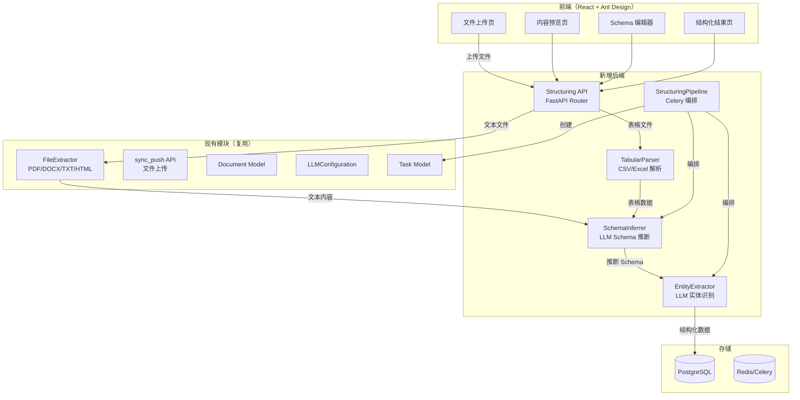
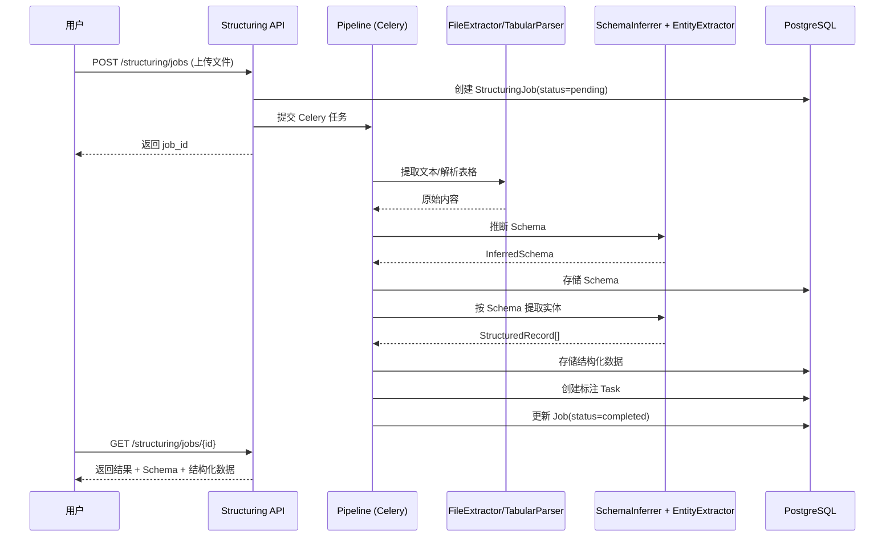

# 设计文档：AI 驱动的结构化数据分析

## Overview

对上传的非结构化文件（PDF/CSV/Excel/Word/HTML）进行 AI 结构化分析，包括文本提取、Schema 推断、字段提取和实体识别，将结构化结果存入 PostgreSQL，并自动创建标注任务。

设计原则：
- **复用现有基础设施**：FileExtractor 处理 PDF/DOCX/TXT/HTML，pandas 处理 CSV/Excel
- **LLM 驱动**：通过 instructor + OpenAI 实现 Schema 推断和实体识别，返回结构化 Pydantic 模型
- **异步管道**：Celery 任务编排，支持大文件异步处理

## Architecture



## 主要数据流



## Components and Interfaces

### 1. TabularParser（表格解析器 — 新增）

**文件**: `src/extractors/tabular.py`

复用 pandas + openpyxl 解析 CSV/Excel，输出统一的 TabularData。

```python
@dataclass
class TabularData:
    headers: list[str]
    rows: list[dict[str, Any]]
    row_count: int
    file_type: str  # "csv" | "excel"
    sheet_name: str | None = None

class TabularParser:
    def parse(self, file_path: str, file_type: str) -> TabularData: ...
    def _parse_csv(self, file_path: str) -> TabularData: ...
    def _parse_excel(self, file_path: str) -> TabularData: ...
```

### 2. SchemaInferrer（Schema 推断器 — 新增）

**文件**: `src/ai/schema_inferrer.py`

通过 instructor + OpenAI 从文本/表格数据推断结构化 Schema。

```python
class FieldType(str, Enum):
    STRING = "string"
    INTEGER = "integer"
    FLOAT = "float"
    BOOLEAN = "boolean"
    DATE = "date"
    ENTITY = "entity"      # 命名实体（人名、地名等）
    LIST = "list"

class SchemaField(BaseModel):
    name: str
    field_type: FieldType
    description: str
    required: bool = True
    entity_type: str | None = None  # PERSON, ORG, LOCATION 等

class InferredSchema(BaseModel):
    fields: list[SchemaField]
    confidence: float          # 0.0-1.0
    source_description: str    # LLM 对数据源的描述

class SchemaInferrer:
    def __init__(self, llm_config: LLMConfiguration): ...
    async def infer_from_text(self, text: str, hint: str | None = None) -> InferredSchema: ...
    async def infer_from_tabular(self, data: TabularData) -> InferredSchema: ...
```

### 3. EntityExtractor（实体提取器 — 新增）

**文件**: `src/ai/entity_extractor.py`

按 Schema 定义从原始内容中提取结构化记录。

```python
class StructuredRecord(BaseModel):
    fields: dict[str, Any]
    confidence: float
    source_span: str | None = None  # 原文片段引用

class ExtractionResult(BaseModel):
    records: list[StructuredRecord]
    total_extracted: int
    avg_confidence: float

class EntityExtractor:
    def __init__(self, llm_config: LLMConfiguration): ...
    async def extract(self, content: str, schema: InferredSchema) -> ExtractionResult: ...
    async def extract_batch(self, contents: list[str], schema: InferredSchema) -> ExtractionResult: ...
```

### 4. StructuringPipeline（管道编排 — 新增）

**文件**: `src/services/structuring_pipeline.py`

Celery 任务，编排完整的结构化流程。

```python
@celery_app.task(bind=True)
def run_structuring_pipeline(self, job_id: str) -> dict:
    """
    管道步骤：
    1. 根据文件类型选择解析器（FileExtractor 或 TabularParser）
    2. 调用 SchemaInferrer 推断 Schema
    3. 用户确认/编辑 Schema（可选，通过 API 轮询）
    4. 调用 EntityExtractor 提取结构化数据
    5. 存储结构化结果到 structured_records 表
    6. 自动创建标注 Task
    """
    ...
```

### 5. Structuring API（API 路由 — 新增）

**文件**: `src/api/structuring.py`

```python
# POST /api/structuring/jobs          — 创建结构化任务（上传文件）
# GET  /api/structuring/jobs/{id}     — 查询任务状态和结果
# PUT  /api/structuring/jobs/{id}/schema — 用户确认/编辑 Schema
# POST /api/structuring/jobs/{id}/extract — 确认 Schema 后执行提取
# GET  /api/structuring/jobs/{id}/records — 获取结构化记录
# POST /api/structuring/jobs/{id}/create-tasks — 创建标注任务
```

## Data Models

### 后端数据库模型（SQLAlchemy）

**文件**: `src/models/structuring.py`

```python
class StructuringJob(Base):
    __tablename__ = "structuring_jobs"
    id: Mapped[str]             # UUID PK
    tenant_id: Mapped[str]      # 租户隔离
    file_name: Mapped[str]
    file_path: Mapped[str]
    file_type: Mapped[str]      # pdf/csv/excel/docx/html/txt
    status: Mapped[str]         # pending/extracting/inferring/confirming/extracting_entities/completed/failed
    raw_content: Mapped[str | None]     # 提取的原始文本（Text）
    inferred_schema: Mapped[dict | None]  # JSONB
    confirmed_schema: Mapped[dict | None] # 用户确认后的 Schema（JSONB）
    record_count: Mapped[int]
    error_message: Mapped[str | None]
    created_at: Mapped[datetime]
    updated_at: Mapped[datetime]

class StructuredRecord(Base):
    __tablename__ = "structured_records"
    id: Mapped[str]             # UUID PK
    job_id: Mapped[str]         # FK → structuring_jobs.id
    fields: Mapped[dict]        # JSONB，按 Schema 提取的字段
    confidence: Mapped[float]
    source_span: Mapped[str | None]
    created_at: Mapped[datetime]
```

### 前端 Store（Zustand）

```typescript
// frontend/src/stores/structuringStore.ts
interface StructuringStore {
  currentJob: StructuringJob | null;
  jobs: StructuringJob[];
  schema: InferredSchema | null;
  records: StructuredRecord[];
  uploadFile: (file: File) => Promise<string>;
  fetchJob: (jobId: string) => Promise<void>;
  confirmSchema: (jobId: string, schema: InferredSchema) => Promise<void>;
  startExtraction: (jobId: string) => Promise<void>;
  createAnnotationTasks: (jobId: string) => Promise<void>;
}
```


## Key Functions with Formal Specifications

### Function 1: TabularParser.parse()

```python
def parse(self, file_path: str, file_type: str) -> TabularData
```

**Preconditions:**
- `file_path` 指向存在的文件
- `file_type` ∈ {"csv", "excel"}
- 文件大小 ≤ 100MB

**Postconditions:**
- 返回 TabularData，headers 非空，rows 中每行的 key 集合 = headers 集合
- row_count = len(rows)
- 不修改原始文件

### Function 2: SchemaInferrer.infer_from_text()

```python
async def infer_from_text(self, text: str, hint: str | None = None) -> InferredSchema
```

**Preconditions:**
- `text` 非空且长度 ≤ 50000 字符（超长文本截断前 50000 字符）
- LLM 配置有效（API key、model 可用）

**Postconditions:**
- 返回 InferredSchema，fields 长度 ≥ 1
- 每个 SchemaField 的 name 唯一
- 0.0 ≤ confidence ≤ 1.0
- LLM 调用失败时抛出 SchemaInferenceError

### Function 3: EntityExtractor.extract()

```python
async def extract(self, content: str, schema: InferredSchema) -> ExtractionResult
```

**Preconditions:**
- `content` 非空
- `schema.fields` 长度 ≥ 1
- 每个 field 的 field_type 是有效的 FieldType 枚举值

**Postconditions:**
- 返回的每条 StructuredRecord.fields 的 key 集合 ⊆ schema.fields 的 name 集合
- required 字段必须存在于每条记录中
- avg_confidence = mean(record.confidence for record in records)
- total_extracted = len(records)

### Function 4: run_structuring_pipeline()

```python
def run_structuring_pipeline(self, job_id: str) -> dict
```

**Preconditions:**
- job_id 对应的 StructuringJob 存在且 status = "pending"

**Postconditions:**
- 成功时：status 变为 "completed"，record_count > 0，创建对应的 Task 记录
- 失败时：status 变为 "failed"，error_message 非空
- 状态转换路径：pending → extracting → inferring → confirming → extracting_entities → completed

**Loop Invariants:**
- 批量提取时：已处理的 chunk 数单调递增，每个 chunk 的结构化结果已持久化

## Correctness Properties

### Property 1: Schema 字段名唯一性

*For any* 输入文本 text，SchemaInferrer.infer_from_text(text) 返回的 InferredSchema 中，所有 field.name 互不相同。

### Property 2: 结构化记录符合 Schema

*For any* InferredSchema schema 和提取结果 ExtractionResult，每条 StructuredRecord 的 fields 中，所有 required=True 的 SchemaField 对应的 key 都存在。

### Property 3: 表格解析行数一致性

*For any* 有效的 CSV/Excel 文件，TabularParser.parse() 返回的 TabularData 满足 row_count == len(rows)，且每行的 key 数量 == len(headers)。

### Property 4: Job 状态机合法转换

*For any* StructuringJob 的状态序列，状态只能按 pending → extracting → inferring → confirming → extracting_entities → completed 顺序转换，或从任意状态转为 failed。

### Property 5: 置信度范围约束

*For any* SchemaInferrer 或 EntityExtractor 返回的 confidence 值，满足 0.0 ≤ confidence ≤ 1.0。

### Property 6: 标注任务自动创建

*For any* status="completed" 的 StructuringJob，数据库中存在至少一条关联的 Task 记录，且 Task.metadata 包含 job_id。

### Property 7: 文件类型路由正确性

*For any* 上传文件，file_type ∈ {csv, excel} 时路由到 TabularParser，file_type ∈ {pdf, docx, txt, html} 时路由到 FileExtractor。

## Error Handling

| 场景 | 处理策略 |
|------|---------|
| 文件格式不支持 | 返回 400，提示支持的格式列表 |
| 文件解析失败（损坏/加密） | Job status → failed，error_message 记录具体原因 |
| LLM API 调用失败 | 重试 3 次（指数退避），仍失败则 Job → failed |
| LLM 返回非法 Schema | 校验失败，记录原始响应，Job → failed |
| Schema 推断置信度 < 0.3 | 标记为低置信度，前端提示用户手动编辑 Schema |
| 实体提取部分失败 | 跳过失败记录，记录到 Job.metadata.skipped_records |
| Celery Worker 崩溃 | 任务自动重试（max_retries=3），超时 30 分钟 |

## Testing Strategy

### 属性测试（fast-check，≥100 次迭代）

```typescript
// Property 3: 表格解析行数一致性
fc.assert(fc.property(
  fc.array(fc.array(fc.string(), { minLength: 1 }), { minLength: 1 }),
  (rows) => {
    const result = parseTabularData(rows);
    return result.rowCount === result.rows.length
      && result.rows.every(r => Object.keys(r).length === result.headers.length);
  }
), { numRuns: 100 });

// Property 5: 置信度范围约束
fc.assert(fc.property(
  fc.float({ min: -100, max: 100 }),
  (raw) => {
    const clamped = clampConfidence(raw);
    return clamped >= 0.0 && clamped <= 1.0;
  }
), { numRuns: 100 });

// Property 4: Job 状态机合法转换
fc.assert(fc.property(
  arbitraryStatusTransition(),
  (transition) => {
    return isValidTransition(transition.from, transition.to)
      || transition.to === 'failed';
  }
), { numRuns: 100 });
```

### 单元测试
- TabularParser：CSV/Excel 解析、空文件、超大文件、编码处理
- SchemaInferrer：Mock LLM 响应、字段去重、置信度校验
- EntityExtractor：Mock LLM 响应、required 字段校验、批量提取
- Pipeline 状态机：合法/非法状态转换

### 集成测试
- 完整管道：上传 CSV → Schema 推断 → 确认 → 提取 → 创建任务
- API 端到端：文件上传 → 轮询状态 → 获取结果
