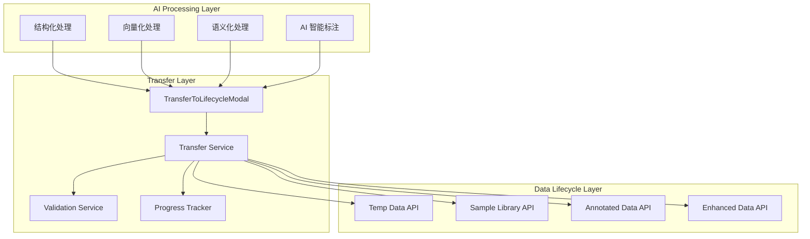
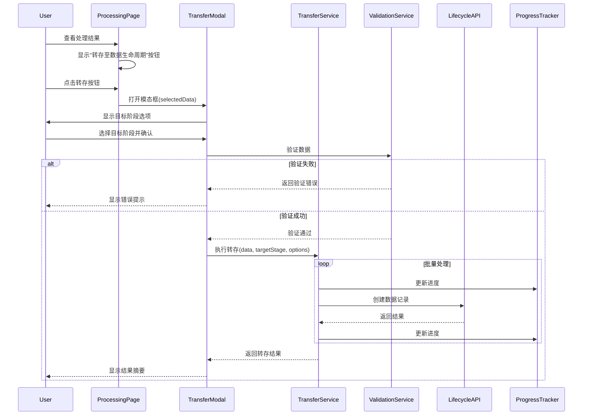
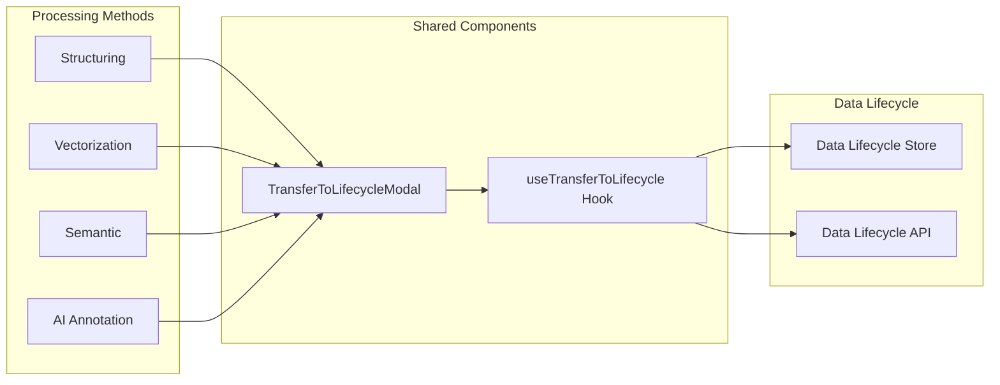
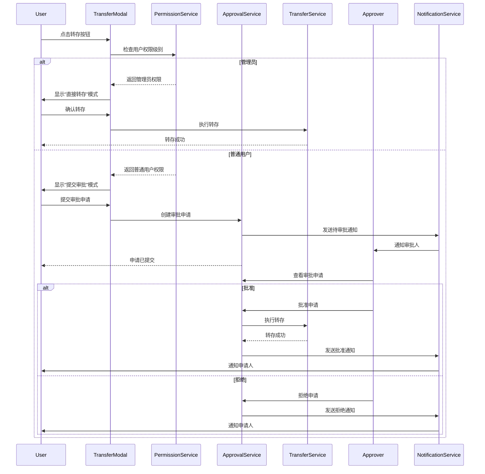

# Design Document: AI 数据处理结果转存到数据生命周期

## Overview

本设计文档定义了"AI 数据处理结果转存到数据生命周期"功能的技术实现方案。该功能在 AI 数据处理页面（/augmentation/ai-processing）的 4 个处理方法（结构化、向量化、语义化、AI 智能标注）中增加"转存至数据生命周期"操作，实现处理结果一键转存到数据生命周期管理系统的指定阶段。

系统采用统一的 TransferToLifecycleModal 组件处理转存逻辑，支持单条和批量转存，提供进度反馈、错误处理和权限控制。转存操作通过调用现有的数据生命周期 API 实现，确保数据流转的一致性和可追溯性。

## Architecture

### System Architecture Overview




### Data Flow Architecture



### Component Integration




## Components and Interfaces

### Component 1: TransferToLifecycleModal

**Purpose**: 统一的转存模态框组件，处理所有处理方法的转存操作

**Interface**:
```typescript
interface TransferToLifecycleModalProps {
  visible: boolean;
  onClose: () => void;
  onSuccess?: () => void;
  sourceType: 'structuring' | 'vectorization' | 'semantic' | 'ai_annotation';
  selectedData: TransferDataItem[];
}

interface TransferDataItem {
  id: string;
  name: string;
  content: Record<string, unknown>;
  metadata?: Record<string, unknown>;
}

interface TransferFormValues {
  targetStage: 'temp_data' | 'sample_library' | 'annotated' | 'enhanced';
  dataType?: 'text' | 'image' | 'audio' | 'video';
  tags?: string[];
  remark?: string;
  qualityThreshold?: number;
}
```

**Responsibilities**:
- 显示目标阶段选择（根据 sourceType 动态调整可选阶段）
- 收集转存配置（数据类型、标签、备注等）
- 显示已选择数据的预览和数量
- 执行数据验证
- 调用转存服务
- 显示进度和结果反馈

### Component 2: useTransferToLifecycle Hook

**Purpose**: 封装转存逻辑的自定义 Hook

**Interface**:
```typescript
interface UseTransferToLifecycleReturn {
  transferData: (params: TransferParams) => Promise<TransferResult>;
  loading: boolean;
  progress: TransferProgress;
  error: string | null;
}

interface TransferParams {
  sourceType: string;
  data: TransferDataItem[];
  targetStage: string;
  options: TransferOptions;
}

interface TransferOptions {
  dataType?: string;
  tags?: string[];
  remark?: string;
  qualityThreshold?: number;
  batchSize?: number;
}

interface TransferProgress {
  total: number;
  completed: number;
  failed: number;
  percentage: number;
}

interface TransferResult {
  success: boolean;
  successCount: number;
  failedCount: number;
  failedItems: Array<{ id: string; reason: string }>;
}
```

**Responsibilities**:
- 批量处理转存请求（分批调用 API）
- 跟踪转存进度
- 处理错误和重试
- 返回转存结果摘要

### Component 3: Transfer Service

**Purpose**: 转存业务逻辑服务

**Interface**:
```typescript
interface ITransferService {
  validateData(data: TransferDataItem[]): ValidationResult;
  mapToLifecycleData(sourceType: string, data: TransferDataItem, options: TransferOptions): LifecycleDataPayload;
  batchTransfer(params: TransferParams): Promise<TransferResult>;
  checkPermissions(userId: string, targetStage: string): Promise<boolean>;
}

interface ValidationResult {
  valid: boolean;
  errors: Array<{ field: string; message: string }>;
}

interface LifecycleDataPayload {
  name: string;
  content: Record<string, unknown>;
  metadata: {
    source: string;
    sourceType: string;
    sourceId: string;
    dataType?: string;
    tags?: string[];
    remark?: string;
  };
}
```

**Responsibilities**:
- 验证数据完整性和有效性
- 将处理结果映射为数据生命周期格式
- 执行批量转存（并发控制）
- 检查用户权限


## Data Models

### Model 1: TransferDataItem

```typescript
interface TransferDataItem {
  id: string;                              // 处理结果 ID
  name: string;                            // 数据名称
  content: Record<string, unknown>;        // 数据内容
  metadata?: {
    processingMethod?: string;             // 处理方法
    processedAt?: string;                  // 处理时间
    qualityScore?: number;                 // 质量分数
    [key: string]: unknown;
  };
}
```

**Validation Rules**:
- id 必须是非空字符串
- name 必须是非空字符串
- content 必须包含有效数据
- qualityScore 如果存在，必须在 0-1 之间

### Model 2: TransferConfig

```typescript
interface TransferConfig {
  sourceType: 'structuring' | 'vectorization' | 'semantic' | 'ai_annotation';
  targetStage: 'temp_data' | 'sample_library' | 'annotated' | 'enhanced';
  dataType?: 'text' | 'image' | 'audio' | 'video';
  tags?: string[];
  remark?: string;
  qualityThreshold?: number;
}
```

**Validation Rules**:
- sourceType 必须是有效的处理方法类型
- targetStage 必须是有效的生命周期阶段
- tags 如果存在，每个标签必须是非空字符串
- qualityThreshold 如果存在，必须在 0-1 之间

### Model 3: TransferResult

```typescript
interface TransferResult {
  success: boolean;
  successCount: number;
  failedCount: number;
  skippedCount: number;
  failedItems: Array<{
    id: string;
    name: string;
    reason: string;
    suggestion?: string;
  }>;
  duration: number;
}
```

**Validation Rules**:
- successCount + failedCount + skippedCount 应等于总数
- failedItems 长度应等于 failedCount
- duration 必须是非负数

## API Design

### API 1: Transfer to Temp Data

**Endpoint**: `POST /api/data-lifecycle/temp-data`

**Request**:
```typescript
{
  name: string;
  content: Record<string, unknown>;
  metadata: {
    source: 'ai_processing';
    sourceType: 'structuring' | 'vectorization' | 'semantic' | 'ai_annotation';
    sourceId: string;
    dataType?: string;
    tags?: string[];
    remark?: string;
  };
}
```

**Response**:
```typescript
{
  id: string;
  name: string;
  state: 'temp_stored';
  createdAt: string;
}
```

### API 2: Transfer to Sample Library

**Endpoint**: `POST /api/data-lifecycle/samples`

**Request**:
```typescript
{
  name: string;
  content: Record<string, unknown>;
  metadata: {
    source: 'ai_processing';
    sourceType: string;
    sourceId: string;
    category?: string;
    quality?: number;
    tags?: string[];
  };
}
```

**Response**:
```typescript
{
  id: string;
  name: string;
  version: number;
  createdAt: string;
}
```

### API 3: Batch Transfer

**Endpoint**: `POST /api/data-lifecycle/batch-transfer`

**Request**:
```typescript
{
  targetStage: string;
  items: Array<{
    name: string;
    content: Record<string, unknown>;
    metadata: Record<string, unknown>;
  }>;
}
```

**Response**:
```typescript
{
  success: boolean;
  results: Array<{
    id: string;
    success: boolean;
    error?: string;
  }>;
  summary: {
    total: number;
    successful: number;
    failed: number;
  };
}
```


## Internationalization (i18n)

### Translation Namespace

使用 `aiProcessing` 命名空间，翻译文件路径：
- 中文：`frontend/src/locales/zh/aiProcessing.json`
- 英文：`frontend/src/locales/en/aiProcessing.json`

### Translation Keys Structure

```json
{
  "transfer": {
    "title": "转存至数据生命周期",
    "button": "转存至数据生命周期",
    "modal": {
      "title": "转存数据到数据生命周期",
      "selectStage": "选择目标阶段",
      "dataType": "数据类型",
      "tags": "标签",
      "remark": "备注",
      "qualityThreshold": "质量阈值",
      "selectedCount": "已选择 {{count}} 条数据",
      "preview": "数据预览"
    },
    "stages": {
      "temp_data": "临时数据",
      "sample_library": "样本库",
      "annotated": "已标注",
      "enhanced": "已增强"
    },
    "dataTypes": {
      "text": "文本",
      "image": "图像",
      "audio": "音频",
      "video": "视频"
    },
    "messages": {
      "transferring": "正在转存...",
      "success": "成功转存 {{count}} 条数据到{{stage}}",
      "partialSuccess": "转存完成：成功 {{success}} 条，失败 {{failed}} 条",
      "failed": "转存失败：{{reason}}",
      "noDataSelected": "请先选择要转存的数据",
      "validationFailed": "数据验证失败",
      "permissionDenied": "权限不足，无法转存到该阶段"
    },
    "progress": {
      "title": "转存进度",
      "processing": "正在处理 {{current}}/{{total}}",
      "estimatedTime": "预计剩余时间：{{time}}",
      "cancel": "取消转存"
    },
    "result": {
      "title": "转存结果",
      "summary": "成功：{{success}} 条，失败：{{failed}} 条，跳过：{{skipped}} 条",
      "failedItems": "失败项目",
      "downloadReport": "下载报告"
    }
  }
}
```

### Usage in Components

```typescript
import { useTranslation } from 'react-i18next';

const TransferToLifecycleModal: React.FC<Props> = ({ visible, onClose }) => {
  const { t } = useTranslation('aiProcessing');
  
  return (
    <Modal
      title={t('transfer.modal.title')}
      open={visible}
      onCancel={onClose}
    >
      <Form.Item label={t('transfer.modal.selectStage')}>
        <Select placeholder={t('transfer.modal.selectStage')}>
          <Option value="temp_data">{t('transfer.stages.temp_data')}</Option>
          <Option value="sample_library">{t('transfer.stages.sample_library')}</Option>
        </Select>
      </Form.Item>
      
      <div>{t('transfer.modal.selectedCount', { count: selectedData.length })}</div>
    </Modal>
  );
};
```


## Correctness Properties

*A property is a characteristic or behavior that should hold true across all valid executions of a system—essentially, a formal statement about what the system should do. Properties serve as the bridge between human-readable specifications and machine-verifiable correctness guarantees.*

### Property 1: Modal Opening on Button Click

*For any* processing method page with transfer button, clicking the button should open the TransferToLifecycleModal with correct source type and selected data.

**Validates: Requirements 1.2, 2.2, 3.2, 4.2**

### Property 2: API Call on Transfer Confirmation

*For any* transfer operation, when user confirms the transfer, the system should call the appropriate data lifecycle API with correctly mapped data payload.

**Validates: Requirements 1.4, 2.4, 3.4, 4.4**

### Property 3: Success Message Display

*For any* successful transfer operation, the system should display a success message containing the target stage name and count of transferred items.

**Validates: Requirements 1.5, 2.5, 3.5, 4.5**

### Property 4: Error Message Display

*For any* failed transfer operation, the system should display an error message containing the failure reason.

**Validates: Requirements 1.6, 2.6, 3.6, 4.6**

### Property 5: Batch Selection Count Display

*For any* batch transfer operation, the modal should display the count of selected items, and this count should match the actual number of selected items.

**Validates: Requirements 2.2, 3.2**

### Property 6: Batch Transfer Result Summary

*For any* batch transfer operation, the result summary should show success count, failed count, and skipped count, where the sum equals the total number of items.

**Validates: Requirements 2.5, 3.5**

### Property 7: Failed Items List Display

*For any* batch transfer with failures, the system should display a list of failed items with their IDs and failure reasons.

**Validates: Requirements 2.6, 3.6**

### Property 8: i18n Text Wrapping

*For all* user-visible text elements in transfer components, the text should be wrapped with t() function and have corresponding keys in both zh and en translation files.

**Validates: Requirements 5.1, 5.2, 5.3, 5.4, 5.5, 5.6**

### Property 9: Transferred Data Visibility

*For any* successful transfer operation, the transferred data should appear in the target stage's data list in the data lifecycle system.

**Validates: Requirements 6.1**

### Property 10: Source Metadata Preservation

*For all* transferred data, the metadata should contain source information including source type (structuring/vectorization/semantic/ai_annotation) and source ID.

**Validates: Requirements 6.2, 6.3**

### Property 11: Permission Check Before Transfer

*For all* transfer operations, the system should check if the user has transfer permission before executing the transfer.

**Validates: Requirements 7.1, 7.2, 7.3**

### Property 12: Permission-Based Stage Filtering

*For any* user viewing the transfer modal, only target stages for which the user has write permission should be enabled.

**Validates: Requirements 7.6**

### Property 13: Required Fields Validation

*For any* transfer attempt, the system should validate that data contains required fields (ID, content, metadata) and reject transfer if any are missing.

**Validates: Requirements 8.1, 8.2**

### Property 14: Data Size Validation

*For any* transfer attempt, if data size exceeds the target stage limit, the system should reject the transfer with an error message suggesting batch transfer.

**Validates: Requirements 8.3, 8.4**

### Property 15: Duplicate ID Handling

*For any* transfer attempt where the target stage already contains data with the same ID, the system should provide options to overwrite or skip.

**Validates: Requirements 8.7, 8.8**

### Property 16: Progress Bar Display

*For any* batch transfer operation, the modal should display a progress bar that updates in real-time as items are processed.

**Validates: Requirements 9.1, 9.2**

### Property 17: Progress Percentage Accuracy

*For any* batch transfer operation, the displayed progress percentage should equal (completed items / total items) * 100.

**Validates: Requirements 9.2**

### Property 18: Cancel Operation Safety

*For any* batch transfer operation, if user cancels mid-transfer, already completed transfers should remain valid and not be rolled back.

**Validates: Requirements 9.6**

### Property 19: Network Error Handling

*For any* transfer operation that fails due to network error, the system should display "网络连接失败，请检查网络后重试" message.

**Validates: Requirements 10.1**

### Property 20: Retry Functionality

*For any* failed transfer operation, the system should provide a retry button that re-executes the transfer with the same parameters.

**Validates: Requirements 10.5, 10.6**

### Property 21: Async Processing Non-Blocking

*For any* batch transfer operation, the API calls should be asynchronous and not block the UI thread.

**Validates: Requirements 12.1**

### Property 22: Batch Size Limit

*For any* large batch transfer, the system should split the operation into batches of maximum 100 items each.

**Validates: Requirements 12.2**

### Property 23: Concurrent Request Limit

*For any* batch transfer operation, the system should process at most 3 batches concurrently.

**Validates: Requirements 12.3**


## Error Handling

### Error Scenario 1: Network Failure

**Condition**: Transfer API call fails due to network connectivity issues
**Response**: Display error message "网络连接失败，请检查网络后重试" with retry button
**Recovery**: User clicks retry button to re-execute the transfer

### Error Scenario 2: Permission Denied

**Condition**: User lacks permission to transfer to target stage
**Response**: Display error message "权限不足，无法转存到该阶段" and disable the target stage option
**Recovery**: User contacts administrator to request permission or selects a different target stage

### Error Scenario 3: Data Validation Failure

**Condition**: Transfer data fails validation (missing required fields, invalid format, size exceeded)
**Response**: Display specific validation error with field names and suggestions
**Recovery**: User fixes the data issues in the source processing page before retrying transfer

### Error Scenario 4: Partial Batch Failure

**Condition**: Some items in batch transfer succeed while others fail
**Response**: Display result summary showing success/failure counts and list of failed items with reasons
**Recovery**: User reviews failed items, addresses issues, and retries transfer for failed items only

### Error Scenario 5: Duplicate ID Conflict

**Condition**: Target stage already contains data with the same ID
**Response**: Display conflict dialog with options to overwrite or skip
**Recovery**: User chooses to overwrite existing data or skip the conflicting item

## Testing Strategy

### Unit Testing Approach

Test each component independently with mocked dependencies:
- TransferToLifecycleModal: Test modal rendering, form validation, user interactions
- useTransferToLifecycle Hook: Test transfer logic, progress tracking, error handling
- Transfer Service: Test data mapping, validation, batch processing

Coverage goal: 80% code coverage for all components

### Property-Based Testing Approach

Use property-based testing to verify system invariants:
- Transfer operations: All successful transfers create records in target stage
- Batch processing: Sum of success/failure/skip counts equals total
- Progress tracking: Progress percentage always between 0-100
- i18n compliance: All text uses t() function

**Property Test Library**: fast-check (TypeScript)
**Test Configuration**: Minimum 100 iterations per property test
**Test Tags**: Format: `Feature: ai-processing-transfer-to-lifecycle, Property {number}: {property_text}`

### Integration Testing Approach

Test complete workflows end-to-end:
- Workflow 1: Structuring result → Transfer to temp data → Verify in lifecycle
- Workflow 2: Vectorization batch → Transfer to sample library → Verify metadata
- Workflow 3: Semantic records → Transfer with tags → Verify filtering
- Workflow 4: AI annotation → Transfer to annotated stage → Verify quality threshold

### Testing Balance

- Unit tests: Focus on specific examples, edge cases (empty data, invalid formats, permission scenarios)
- Property tests: Focus on universal properties across all inputs (batch counts, progress accuracy, metadata preservation)
- Together: Comprehensive coverage where unit tests catch concrete bugs and property tests verify general correctness


## Implementation Details

### Target Stage Mapping by Source Type

不同处理方法支持的目标阶段：

| Source Type | Supported Target Stages |
|-------------|------------------------|
| Structuring | temp_data, sample_library |
| Vectorization | temp_data, sample_library, enhanced |
| Semantic | temp_data, sample_library, enhanced |
| AI Annotation | annotated, sample_library |

### Data Mapping Strategy

#### Structuring → Lifecycle

```typescript
{
  name: structuredData.filename,
  content: structuredData.sections,
  metadata: {
    source: 'ai_processing',
    sourceType: 'structuring',
    sourceId: structuredData.id,
    dataType: formValues.dataType,
    tags: formValues.tags,
    remark: formValues.remark,
    parsedAt: structuredData.parsedAt
  }
}
```

#### Vectorization → Lifecycle

```typescript
{
  name: vectorRecord.text.substring(0, 50),
  content: {
    text: vectorRecord.text,
    vector: vectorRecord.vector,
    dimensions: vectorRecord.dimensions
  },
  metadata: {
    source: 'ai_processing',
    sourceType: 'vectorization',
    sourceId: vectorRecord.id,
    model: vectorRecord.model,
    tags: formValues.tags
  }
}
```

#### Semantic → Lifecycle

```typescript
{
  name: semanticRecord.text.substring(0, 50),
  content: {
    text: semanticRecord.text,
    entities: semanticRecord.entities,
    relations: semanticRecord.relations,
    semanticType: semanticRecord.type
  },
  metadata: {
    source: 'ai_processing',
    sourceType: 'semantic',
    sourceId: semanticRecord.id,
    semanticType: semanticRecord.type,
    tags: formValues.tags
  }
}
```

#### AI Annotation → Lifecycle

```typescript
{
  name: annotationTask.name,
  content: {
    originalData: annotationTask.data,
    annotations: annotationTask.annotations,
    confidence: annotationTask.avgConfidence
  },
  metadata: {
    source: 'ai_processing',
    sourceType: 'ai_annotation',
    sourceId: annotationTask.id,
    taskName: annotationTask.name,
    qualityScore: annotationTask.avgConfidence,
    tags: formValues.tags
  }
}
```

### Batch Processing Strategy

```typescript
async function batchTransfer(items: TransferDataItem[], options: TransferOptions) {
  const BATCH_SIZE = 100;
  const MAX_CONCURRENT = 3;
  
  const batches = chunk(items, BATCH_SIZE);
  const results: TransferResult[] = [];
  
  for (let i = 0; i < batches.length; i += MAX_CONCURRENT) {
    const batchGroup = batches.slice(i, i + MAX_CONCURRENT);
    const batchPromises = batchGroup.map(batch => 
      processBatch(batch, options)
    );
    
    const batchResults = await Promise.allSettled(batchPromises);
    results.push(...batchResults.map(r => r.status === 'fulfilled' ? r.value : createErrorResult(r.reason)));
    
    updateProgress(results.length * BATCH_SIZE, items.length);
  }
  
  return aggregateResults(results);
}
```

### Progress Tracking

```typescript
interface ProgressState {
  total: number;
  completed: number;
  failed: number;
  percentage: number;
  estimatedTimeRemaining: number;
}

function updateProgress(completed: number, total: number, startTime: number): ProgressState {
  const percentage = Math.round((completed / total) * 100);
  const elapsed = Date.now() - startTime;
  const avgTimePerItem = elapsed / completed;
  const remaining = total - completed;
  const estimatedTimeRemaining = Math.round(avgTimePerItem * remaining / 1000); // seconds
  
  return {
    total,
    completed,
    failed: 0, // updated separately
    percentage,
    estimatedTimeRemaining
  };
}
```

### Permission Check Integration

```typescript
async function checkTransferPermission(userId: string, targetStage: string): Promise<boolean> {
  // Reuse existing permission manager from data lifecycle
  const hasTransferPermission = await permissionManager.checkPermission(
    userId,
    { type: 'data_transfer', id: targetStage },
    'create'
  );
  
  return hasTransferPermission;
}
```

## Performance Considerations

- Batch API calls with maximum 100 items per batch
- Concurrent processing with maximum 3 parallel requests
- Debounce progress updates to avoid excessive re-renders (update every 100ms)
- Use React.memo for TransferToLifecycleModal to prevent unnecessary re-renders
- Lazy load transfer modal component (only load when button is clicked)
- Cache permission check results for 5 minutes to reduce API calls

## Security Considerations

- Validate all user inputs before transfer (XSS prevention)
- Check permissions on both frontend and backend
- Sanitize data content before storing in lifecycle system
- Log all transfer operations in audit log with user ID, timestamp, source, target
- Rate limit transfer API to prevent abuse (max 10 transfers per minute per user)
- Encrypt sensitive data in transfer payload

## Dependencies

- Ant Design: Modal, Form, Select, Progress, Table, Button components
- react-i18next: Internationalization
- Data Lifecycle API: Existing API endpoints for creating temp data, samples, etc.
- Data Lifecycle Store: Zustand store for state management
- lodash: chunk function for batch processing


## Approval Workflow Design

### Approval Flow Architecture



### Permission Levels

| Permission Level | Description | Transfer Behavior |
|-----------------|-------------|-------------------|
| Administrator | 管理员，拥有所有权限 | 直接转存，无需审批 |
| Direct Transfer | 有直接转存权限的用户 | 直接转存，无需审批 |
| Approval Required | 需要审批的普通用户 | 提交审批申请，等待审批 |
| No Permission | 无转存权限的用户 | 隐藏转存按钮 |

### Component 4: ApprovalService

**Purpose**: 管理转存审批流程

**Interface**:
```typescript
interface IApprovalService {
  createApprovalRequest(params: CreateApprovalParams): Promise<ApprovalRequest>;
  getApprovalRequests(filters: ApprovalFilters): Promise<ApprovalRequest[]>;
  approveRequest(requestId: string, comment?: string): Promise<void>;
  rejectRequest(requestId: string, reason: string): Promise<void>;
  getApprovalStatus(requestId: string): Promise<ApprovalStatus>;
}

interface CreateApprovalParams {
  userId: string;
  sourceType: string;
  targetStage: string;
  dataItems: TransferDataItem[];
  reason?: string;
}

interface ApprovalRequest {
  id: string;
  userId: string;
  userName: string;
  sourceType: string;
  targetStage: string;
  dataCount: number;
  reason?: string;
  status: 'pending' | 'approved' | 'rejected';
  createdAt: string;
  approvedBy?: string;
  approvedAt?: string;
  comment?: string;
}

interface ApprovalFilters {
  status?: 'pending' | 'approved' | 'rejected';
  userId?: string;
  dateFrom?: string;
  dateTo?: string;
}

interface ApprovalStatus {
  status: 'pending' | 'approved' | 'rejected';
  submittedAt: string;
  processedAt?: string;
  approver?: string;
  comment?: string;
}
```

**Responsibilities**:
- 创建审批申请
- 查询审批申请列表
- 批准/拒绝审批申请
- 查询审批状态
- 发送审批通知

### Component 5: PermissionService

**Purpose**: 管理用户转存权限

**Interface**:
```typescript
interface IPermissionService {
  getUserPermissionLevel(userId: string): Promise<PermissionLevel>;
  getAvailableStages(userId: string, sourceType: string): Promise<string[]>;
  canTransferDirectly(userId: string): Promise<boolean>;
  updateUserPermission(userId: string, permission: UserPermission): Promise<void>;
}

type PermissionLevel = 'administrator' | 'direct_transfer' | 'approval_required' | 'no_permission';

interface UserPermission {
  level: PermissionLevel;
  allowedStages: string[];
  allowedSourceTypes: string[];
}
```

**Responsibilities**:
- 检查用户权限级别
- 获取用户可转存的目标阶段
- 判断用户是否可以直接转存
- 更新用户权限配置

### API Design for Approval

#### API 4: Create Approval Request

**Endpoint**: `POST /api/data-lifecycle/transfer-approval`

**Request**:
```typescript
{
  sourceType: string;
  targetStage: string;
  dataItems: Array<{
    id: string;
    name: string;
    content: Record<string, unknown>;
  }>;
  reason?: string;
}
```

**Response**:
```typescript
{
  requestId: string;
  status: 'pending';
  message: '审批申请已提交，等待审批';
  estimatedApprovalTime: string;
}
```

#### API 5: Get Approval Requests

**Endpoint**: `GET /api/data-lifecycle/transfer-approval`

**Query Parameters**:
- status: 'pending' | 'approved' | 'rejected'
- userId: string (optional)
- page: number
- pageSize: number

**Response**:
```typescript
{
  requests: Array<{
    id: string;
    userId: string;
    userName: string;
    sourceType: string;
    targetStage: string;
    dataCount: number;
    reason?: string;
    status: string;
    createdAt: string;
  }>;
  total: number;
  page: number;
  pageSize: number;
}
```

#### API 6: Approve/Reject Request

**Endpoint**: `POST /api/data-lifecycle/transfer-approval/{requestId}/process`

**Request**:
```typescript
{
  action: 'approve' | 'reject';
  comment?: string;
}
```

**Response**:
```typescript
{
  success: boolean;
  message: string;
  transferResult?: TransferResult; // Only for approve action
}
```

### Internationalization for Approval

添加审批相关的翻译键：

```json
{
  "transfer": {
    "approval": {
      "title": "审批申请",
      "submitApproval": "提交审批",
      "directTransfer": "直接转存",
      "reason": "申请理由",
      "reasonPlaceholder": "请说明转存原因（可选）",
      "status": {
        "pending": "待审批",
        "approved": "已批准",
        "rejected": "已拒绝"
      },
      "messages": {
        "submitted": "审批申请已提交，等待审批",
        "approved": "审批已通过，数据转存成功",
        "rejected": "审批已拒绝：{{reason}}",
        "noPermission": "您没有转存权限"
      },
      "management": {
        "title": "审批管理",
        "pendingCount": "待审批 {{count}} 条",
        "approve": "批准",
        "reject": "拒绝",
        "comment": "审批意见",
        "approver": "审批人",
        "approvedAt": "审批时间"
      },
      "notification": {
        "newRequest": "您有新的转存审批申请",
        "approved": "您的转存申请已批准",
        "rejected": "您的转存申请已拒绝",
        "reminder": "您有 {{count}} 条待审批申请"
      }
    },
    "permission": {
      "level": {
        "administrator": "管理员",
        "directTransfer": "直接转存",
        "approvalRequired": "需要审批",
        "noPermission": "无权限"
      },
      "yourLevel": "您的权限级别：{{level}}"
    }
  }
}
```

### Correctness Properties for Approval

### Property 24: Administrator Direct Transfer

*For any* transfer operation by an administrator, the system should execute the transfer directly without creating an approval request.

**Validates: Requirements 13.2**

### Property 25: Regular User Approval Required

*For any* transfer operation by a regular user, the system should create an approval request instead of executing the transfer directly.

**Validates: Requirements 13.1**

### Property 26: Approval Request Creation

*For any* approval request creation, the request should contain all necessary information (user, source, target, data count, reason, timestamp).

**Validates: Requirements 13.5**

### Property 27: Approval Notification

*For any* approval request submission, the system should send a notification to the approver.

**Validates: Requirements 15.1**

### Property 28: Approval Result Notification

*For any* approval decision (approve/reject), the system should send a notification to the requester.

**Validates: Requirements 15.2**

### Property 29: Permission-Based Stage Filtering

*For any* user with limited stage permissions, the transfer modal should only show stages the user has permission to access.

**Validates: Requirements 14.5**

### Property 30: Permission Check Before Display

*For any* user without transfer permission, the transfer button should be hidden.

**Validates: Requirements 14.4**
