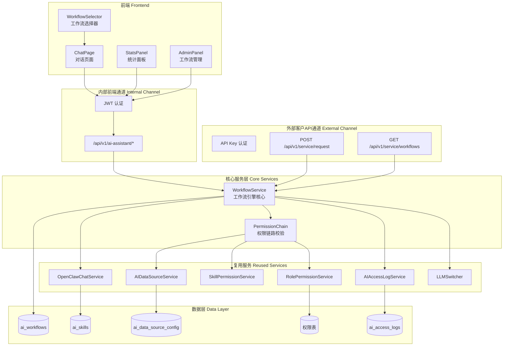
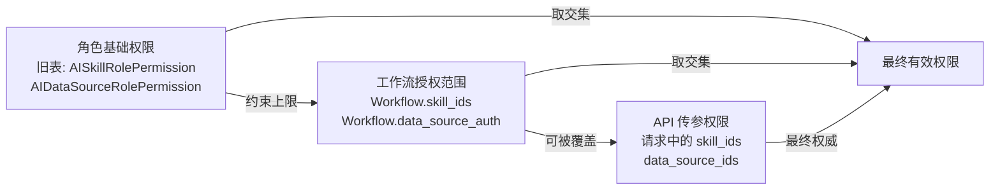
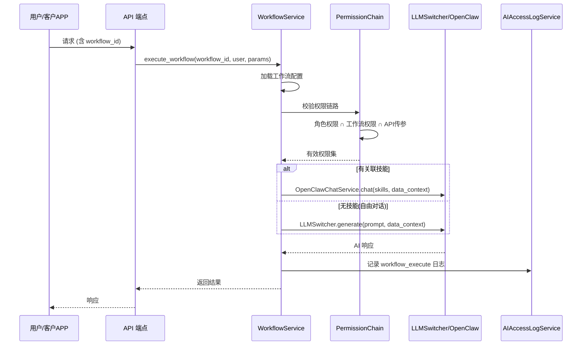

# 设计文档：AI 工作流引擎

## 概述

本设计将 AI 智能助手从"自由对话 + 散落配置"模式升级为"工作流驱动 + 角色权限控制"模式。核心变更是引入 `Workflow` 数据模型和 `WorkflowService` 服务层，将技能、数据源（含数据表级别）、输出方式、角色可见性统一编排到工作流配置中。

### 设计目标

1. **单一入口**：用户通过选择工作流决定所有执行参数，不再手动拼装
2. **权限层叠**：角色基础权限（旧表）→ 工作流授权范围 → API 传参权限（最终权威），三层取交集
3. **双通道共核心**：内部前端（JWT）和外部客户 API（API Key）共享同一个 `WorkflowService`
4. **向后兼容**：旧 API 端点保留，未携带 `workflow_id` 的请求按原有逻辑处理
5. **最小改动**：复用现有服务（`AIDataSourceService`、`RolePermissionService`、`SkillPermissionService`、`AIAccessLogService`、`OpenClawChatService`、`LLMSwitcher`），仅新增工作流编排层

### 关键设计决策

| 决策 | 选择 | 理由 |
|------|------|------|
| 工作流存储 | 新增 `ai_workflows` 表，JSONB 字段存储灵活配置 | 避免多表关联，技能列表/数据源授权/输出方式等结构灵活多变 |
| 权限校验位置 | `WorkflowService` 内部统一校验 | 两个通道共享同一校验逻辑，避免重复 |
| 数据源授权粒度 | 总分结构（数据源 → 数据表列表）存储在 JSONB | 与客户 API 传参授权粒度一致 |
| 自由对话实现 | 不关联技能的工作流，执行时走 `LLMSwitcher` 直连 | 复用现有直连逻辑，无需新增模式 |
| 前端组件策略 | 移除 6 个旧组件，新增 `WorkflowSelector` + 工作流管理页面 | 配置收敛到工作流，旧组件不再需要 |
| Python 兼容性 | 使用 `Optional[List[str]]` 而非 `list[str] \| None` | 项目 Python 3.9.6 限制 |

## 架构

### 整体架构图



### 权限层叠模型



**权限计算规则**：
1. 角色基础权限（`RolePermissionService` / `SkillPermissionService`）定义用户可访问的最大范围
2. 工作流配置（`Workflow.skill_ids` / `Workflow.data_source_auth`）在角色权限范围内进一步收窄
3. API 传参权限（请求中显式传入的参数）为最终权威来源，覆盖工作流配置中的对应项
4. 最终有效权限 = 角色基础权限 ∩ max(工作流配置, API 传参)

### 请求处理流程



## 组件与接口

### 后端组件

#### 1. WorkflowService（新增核心服务）

位置：`src/ai/workflow_service.py`

职责：工作流 CRUD、权限链路校验、执行调度。

```python
class WorkflowService:
    """工作流引擎核心服务。"""
    
    def __init__(self, db: Session):
        self.db = db
        self._ds_service = AIDataSourceService(db)
        self._role_perm_service = RolePermissionService(db)
        self._skill_perm_service = SkillPermissionService(db)
        self._log_service = AIAccessLogService(db)
    
    # --- CRUD ---
    def create_workflow(self, data: WorkflowCreateRequest, creator_id: str) -> Workflow: ...
    def update_workflow(self, workflow_id: str, data: WorkflowUpdateRequest) -> Workflow: ...
    def delete_workflow(self, workflow_id: str) -> None: ...  # 软删除
    def get_workflow(self, workflow_id: str) -> Optional[Workflow]: ...
    def list_workflows(
        self, role: Optional[str] = None, status: Optional[str] = None
    ) -> List[Workflow]: ...
    
    # --- 权限校验 ---
    def check_permission_chain(
        self, workflow: Workflow, user_role: str,
        api_overrides: Optional[dict] = None,
    ) -> EffectivePermissions: ...
    
    # --- 执行 ---
    async def execute_workflow(
        self, workflow_id: str, user: UserModel,
        prompt: str, options: GenerateOptions,
        api_overrides: Optional[dict] = None,
    ) -> LLMResponse: ...
    
    async def stream_execute_workflow(
        self, workflow_id: str, user: UserModel,
        prompt: str, options: GenerateOptions,
        api_overrides: Optional[dict] = None,
    ) -> AsyncIterator[str]: ...
    
    # --- 统计 ---
    def get_workflow_stats(self, workflow_id: str) -> dict: ...
    def get_today_stats(self, user_id: str, user_role: str, tenant_id: str) -> dict: ...
    
    # --- 权限同步 ---
    def sync_permissions(self, permission_list: List[dict]) -> dict: ...
    
    # --- 动态授权请求（预留） ---
    def build_authorization_request(
        self, workflow: Workflow, user_role: str,
        missing_permissions: dict,
    ) -> AuthorizationRequest: ...
    
    # --- 数据迁移 ---
    def generate_default_workflows(self) -> List[Workflow]: ...
```

#### 2. Workflow API 端点（新增）

位置：`src/api/ai_assistant.py`（扩展现有路由）

```python
# --- 工作流 CRUD ---
@router.get("/workflows")           # 查询列表，非管理员自动按角色过滤
@router.post("/workflows")          # 创建（仅管理员）
@router.put("/workflows/{id}")      # 更新（仅管理员）
@router.delete("/workflows/{id}")   # 禁用（仅管理员）

# --- 工作流统计 ---
@router.get("/workflows/{id}/stats")  # 指定工作流执行统计
@router.get("/stats/today")           # 当前用户当日统计

# --- 权限同步 ---
@router.post("/workflows/sync-permissions")  # 批量更新权限配置

# --- 动态授权请求（预留，返回 501） ---
@router.post("/workflows/request-authorization")  # 向客户发起授权请求
```

#### 3. 现有端点扩展

`POST /chat` 和 `POST /chat/stream` 的 `ChatRequest` 新增可选字段：

```python
class ChatRequest(BaseModel):
    # ... 现有字段保留 ...
    workflow_id: Optional[str] = None  # 新增：工作流 ID
```

处理逻辑：当 `workflow_id` 存在时，调用 `WorkflowService.execute_workflow()`；不存在时走原有逻辑。

#### 4. Service Engine 扩展（外部通道）

位置：`src/service_engine/schemas.py`

`ServiceRequest` 新增可选字段：

```python
class ServiceRequest(BaseModel):
    # ... 现有字段保留 ...
    workflow_id: Optional[str] = None  # 新增：工作流 ID
```

位置：`src/service_engine/api.py`

新增端点：

```python
@router.get("/workflows")  # API Key 认证，返回有权访问的工作流列表
```

预留端点（返回 501）：

```python
@router.post("/authorization-callback")  # 接收客户系统的授权回调响应
```

`ChatHandler` 和 `QueryHandler` 扩展：当 `workflow_id` 存在时，委托给 `WorkflowService`。

### 前端组件

#### 1. WorkflowSelector（新增）

位置：`frontend/src/pages/AIAssistant/components/WorkflowSelector.tsx`

职责：替代模式切换 Segmented + 技能面板 + ConfigPanel，在对话输入区域上方以醒目方式展示可用工作流列表。

```typescript
interface WorkflowSelectorProps {
  workflows: WorkflowItem[];
  selectedId: string | null;
  onSelect: (id: string) => void;
  loading?: boolean;
}
```

功能：
- 卡片式展示当前用户有权限的工作流，每张卡片包含名称、简要描述、关联技能数量标签
- 当前选中的工作流以高亮边框 + 主色调背景突出显示
- 支持搜索过滤（按名称/描述模糊匹配）
- 选中后自动附加 `workflow_id` 到聊天请求，并持久化到 `localStorage`（key: `ai_last_workflow_id`）
- 页面加载时自动从 `localStorage` 恢复上一次选择的工作流，若该工作流已禁用或无权限则清除记录
- 未选择且无历史记录时，显示醒目的引导提示（如闪烁边框或提示文字）

#### 2. StatsPanel 增强

位置：`frontend/src/pages/AIAssistant/components/StatsPanel.tsx`

变更：
- 接入后端 `GET /stats/today` API，替代前端硬编码统计
- 支持点击展开明细列表
- 按角色显示不同统计维度

#### 3. WorkflowAdmin（新增管理页面）

位置：`frontend/src/pages/Admin/WorkflowAdmin.tsx`

职责：管理员工作流 CRUD 界面，集成数据源选择（总分结构树形选择）、技能选择、输出方式选择、角色分配。

#### 4. 移除组件

以下组件将从 `AIAssistant/index.tsx` 中移除引用并删除文件：
- `ConfigPanel.tsx`
- `DataSourceConfigModal.tsx`
- `PermissionTableModal.tsx`
- `OutputModeModal.tsx`
- 模式切换 `Segmented`（direct/openclaw）
- 技能勾选面板（skill checkbox panel）

## 数据模型

### 新增：Workflow 模型

位置：`src/models/ai_workflow.py`

```python
class AIWorkflow(Base):
    """AI 工作流配置表。"""
    __tablename__ = "ai_workflows"

    id = Column(String(36), primary_key=True, default=lambda: str(uuid4()))
    name = Column(String(255), nullable=False, unique=True)
    description = Column(Text, nullable=True, default="")
    status = Column(String(20), nullable=False, default="enabled")  # enabled / disabled
    is_preset = Column(Boolean, nullable=False, default=False)

    # JSONB 灵活字段
    skill_ids = Column(JSONB, nullable=False, default=list)        # ["skill-uuid-1", ...]
    data_source_auth = Column(JSONB, nullable=False, default=list) # 总分结构，见下方
    output_modes = Column(JSONB, nullable=False, default=list)     # ["merge", "compare"]
    visible_roles = Column(JSONB, nullable=False, default=list)    # ["admin", "business_expert", ...]
    preset_prompt = Column(Text, nullable=True)                    # 预置工作流的预设提示词

    # i18n 支持：管理员输入的中英文名称/描述
    name_en = Column(String(255), nullable=True)
    description_en = Column(Text, nullable=True)

    # 时间戳
    created_at = Column(DateTime(timezone=True), server_default=func.now())
    updated_at = Column(DateTime(timezone=True), server_default=func.now(), onupdate=func.now())
    created_by = Column(String(100), nullable=True)
```

#### data_source_auth JSONB 结构（总分结构）

```json
[
  {
    "source_id": "tasks",
    "tables": ["task_list", "task_status_summary"]
  },
  {
    "source_id": "annotation_efficiency",
    "tables": ["*"]
  }
]
```

- `tables: ["*"]` 表示授权该数据源下所有数据表
- `tables: ["table_a", "table_b"]` 表示仅授权指定数据表

### Pydantic Schemas

位置：`src/api/ai_assistant.py`（扩展）

```python
class WorkflowCreateRequest(BaseModel):
    name: str = Field(..., min_length=1, max_length=255)
    description: Optional[str] = ""
    skill_ids: Optional[List[str]] = Field(default_factory=list)
    data_source_auth: Optional[List[dict]] = Field(default_factory=list)
    output_modes: Optional[List[str]] = Field(default_factory=list)
    visible_roles: List[str] = Field(..., min_length=1)
    preset_prompt: Optional[str] = None
    name_en: Optional[str] = None
    description_en: Optional[str] = None

class WorkflowUpdateRequest(BaseModel):
    name: Optional[str] = Field(None, min_length=1, max_length=255)
    description: Optional[str] = None
    skill_ids: Optional[List[str]] = None
    data_source_auth: Optional[List[dict]] = None
    output_modes: Optional[List[str]] = None
    visible_roles: Optional[List[str]] = None
    status: Optional[str] = None
    preset_prompt: Optional[str] = None
    name_en: Optional[str] = None
    description_en: Optional[str] = None

class WorkflowResponse(BaseModel):
    id: str
    name: str
    description: Optional[str]
    status: str
    is_preset: bool
    skill_ids: List[str]
    data_source_auth: List[dict]
    output_modes: List[str]
    visible_roles: List[str]
    preset_prompt: Optional[str]
    name_en: Optional[str]
    description_en: Optional[str]
    created_at: str
    updated_at: str

class EffectivePermissions(BaseModel):
    """权限链路校验后的有效权限集。"""
    allowed_skill_ids: List[str]
    allowed_data_sources: List[dict]  # 同 data_source_auth 结构
    allowed_output_modes: List[str]

class AuthorizationRequest(BaseModel):
    """权限不足时返回的动态授权请求结构（预留）。"""
    request_id: str                    # 唯一请求标识（UUID）
    workflow_id: str                   # 触发授权请求的工作流 ID
    missing_permissions: MissingPermissions  # 缺失权限明细
    requested_scope: str               # 请求的授权范围描述（人类可读）
    callback_url: str                  # 授权回调地址模板

class MissingPermissions(BaseModel):
    """缺失权限明细。"""
    skills: Optional[List[str]] = None       # 缺失的技能 ID 列表
    data_sources: Optional[List[str]] = None # 缺失的数据源 ID 列表
    data_tables: Optional[List[dict]] = None # 缺失的数据表 [{source_id, tables}]

class AuthorizationCallback(BaseModel):
    """客户系统授权回调请求格式（预留）。"""
    request_id: str                    # 对应 AuthorizationRequest.request_id
    granted: bool                      # 是否授予
    granted_permissions: Optional[dict] = None  # 授予的具体权限
    expires_at: Optional[str] = None   # 授权有效期（ISO-8601）
    reason: Optional[str] = None       # 拒绝原因（granted=False 时）
```

### 前端 TypeScript 类型

位置：`frontend/src/types/aiAssistant.ts`（扩展）

```typescript
export interface WorkflowItem {
  id: string;
  name: string;
  description?: string;
  status: 'enabled' | 'disabled';
  is_preset: boolean;
  skill_ids: string[];
  data_source_auth: DataSourceAuth[];
  output_modes: string[];
  visible_roles: string[];
  preset_prompt?: string;
  name_en?: string;
  description_en?: string;
  created_at: string;
  updated_at: string;
}

export interface DataSourceAuth {
  source_id: string;
  tables: string[];  // ["*"] = all tables
}

export interface TodayStats {
  chat_count: number;
  workflow_count: number;
  data_source_count: number;
  details?: {
    chats: StatsDetail[];
    workflows: StatsDetail[];
    data_sources: StatsDetail[];
  };
}

export interface StatsDetail {
  id: string;
  name: string;
  timestamp: string;
}
```

### 数据库迁移

使用 Alembic 创建迁移脚本：

```python
# alembic/versions/xxx_add_ai_workflows_table.py
def upgrade():
    op.create_table(
        'ai_workflows',
        sa.Column('id', sa.String(36), primary_key=True),
        sa.Column('name', sa.String(255), nullable=False, unique=True),
        sa.Column('description', sa.Text, nullable=True),
        sa.Column('status', sa.String(20), nullable=False, server_default='enabled'),
        sa.Column('is_preset', sa.Boolean, nullable=False, server_default='false'),
        sa.Column('skill_ids', JSONB, nullable=False, server_default='[]'),
        sa.Column('data_source_auth', JSONB, nullable=False, server_default='[]'),
        sa.Column('output_modes', JSONB, nullable=False, server_default='[]'),
        sa.Column('visible_roles', JSONB, nullable=False, server_default='[]'),
        sa.Column('preset_prompt', sa.Text, nullable=True),
        sa.Column('name_en', sa.String(255), nullable=True),
        sa.Column('description_en', sa.Text, nullable=True),
        sa.Column('created_at', sa.DateTime(timezone=True), server_default=func.now()),
        sa.Column('updated_at', sa.DateTime(timezone=True), server_default=func.now()),
        sa.Column('created_by', sa.String(100), nullable=True),
    )
    op.create_index('idx_workflow_status', 'ai_workflows', ['status'])
    op.create_index('idx_workflow_name', 'ai_workflows', ['name'])

def downgrade():
    op.drop_table('ai_workflows')
```

### 现有模型关系图

```mermaid
erDiagram
    AIWorkflow {
        string id PK
        string name UK
        string description
        string status
        boolean is_preset
        jsonb skill_ids
        jsonb data_source_auth
        jsonb output_modes
        jsonb visible_roles
        string preset_prompt
        string name_en
        string description_en
        datetime created_at
        datetime updated_at
        string created_by
    }

    AISkill {
        string id PK
        string gateway_id FK
        string name
        string version
        string status
    }

    AIDataSourceConfigModel {
        string id PK
        string label
        boolean enabled
        string access_mode
    }

    AISkillRolePermission {
        int id PK
        string role
        string skill_id
        boolean allowed
    }

    AIDataSourceRolePermission {
        int id PK
        string role
        string source_id
        boolean allowed
    }

    AIAccessLog {
        int id PK
        string tenant_id
        string user_id
        string event_type
        jsonb details
    }

    AIWorkflow ||--o{ AISkill : "skill_ids 引用"
    AIWorkflow ||--o{ AIDataSourceConfigModel : "data_source_auth 引用"
    AISkillRolePermission }o--|| AISkill : "skill_id"
    AIDataSourceRolePermission }o--|| AIDataSourceConfigModel : "source_id"
    AIWorkflow ..> AIAccessLog : "workflow_execute 事件"
```

## 正确性属性（Correctness Properties）

*属性（Property）是指在系统所有有效执行中都应成立的特征或行为——本质上是对系统应做什么的形式化陈述。属性是人类可读规格说明与机器可验证正确性保证之间的桥梁。*

### Property 1: 工作流创建后包含所有必需字段

*For any* 有效的工作流创建输入，创建后返回的工作流对象应包含所有必需字段（id、name、description、status、skill_ids、data_source_auth、output_modes、visible_roles、is_preset、created_at、updated_at），且 id 非空、status 为 "enabled"、created_at 和 updated_at 非空。

**Validates: Requirements 1.1**

### Property 2: 创建和更新共享相同的校验规则

*For any* 字段值，如果该值在创建工作流时被校验拒绝（如无效的 skill_id、不存在的 data_source_id、非法的角色值），则在更新工作流时使用相同的值也应被拒绝；反之，创建时接受的值在更新时也应被接受。

**Validates: Requirements 1.2, 1.3**

### Property 3: 软删除保留记录

*For any* 已存在的工作流，执行删除操作后，该工作流的 status 应变为 "disabled"，但记录仍可通过数据库查询获取（不被物理删除）。

**Validates: Requirements 1.4**

### Property 4: 工作流列表过滤正确性

*For any* 工作流集合和任意过滤条件（status、role），返回的工作流列表中每个工作流都应满足所有指定的过滤条件；且满足条件的工作流不应被遗漏。

**Validates: Requirements 1.5**

### Property 5: 角色可见性控制

*For any* 工作流和任意非管理员用户角色，该用户能看到该工作流当且仅当：(1) 用户角色在工作流的 visible_roles 列表中，且 (2) 工作流状态为 "enabled"。管理员角色始终可见所有工作流。此规则同样适用于预置工作流。

**Validates: Requirements 2.1, 2.2, 2.4, 7.3**

### Property 6: 权限链路校验完整性

*For any* 工作流执行请求，WorkflowService 应依次校验：(1) 用户角色对工作流的访问权限（visible_roles），(2) 工作流关联技能在用户角色的 SkillPermission 允许范围内，(3) 工作流数据源授权在用户角色的 DataSourcePermission 允许范围内。任一环节失败应返回 403 错误并包含具体的权限不足信息。最终有效权限为各层取交集的结果。

**Validates: Requirements 2.3, 2.5, 6.2, 11.5**

### Property 7: API 传参权限优先级

*For any* 工作流配置和任意 API 传参权限覆盖（skill_ids、data_source_ids），当 API 传参与工作流配置冲突时，最终有效权限应以 API 传参为准。即：如果 API 传参指定了 skill_ids，则忽略工作流配置中的 skill_ids，使用 API 传参值（仍受角色基础权限约束）。

**Validates: Requirements 2.6, 3.6, 12.4, 12.5**

### Property 8: 数据源总分结构序列化往返

*For any* 有效的 data_source_auth 结构（包含 source_id 和 tables 列表），存储到 JSONB 字段后再读取，应得到与原始输入等价的结构。

**Validates: Requirements 3.1**

### Property 9: 数据表级别访问控制

*For any* 工作流执行中的数据查询请求，实际查询的数据表集合应是工作流 data_source_auth 中授权的数据表集合的子集。未授权的数据表不应被查询。

**Validates: Requirements 3.3**

### Property 10: 数据源授权不超过启用范围

*For any* 工作流创建或更新请求，data_source_auth 中引用的 source_id 必须在 AIDataSourceConfigModel 中存在且 enabled=True；引用不存在或已禁用的数据源应被校验拒绝。

**Validates: Requirements 3.5, 6.1**

### Property 11: 权限同步批量更新正确性

*For any* 权限同步请求（包含角色、数据源、数据表授权列表），同步后所有受影响工作流的 data_source_auth 应反映同步请求中的授权配置。未在同步请求中提及的工作流不应被修改。

**Validates: Requirements 3.7**

### Property 12: 工作流配置参数提取

*For any* 带有 workflow_id 的聊天请求，WorkflowService 应从工作流配置中提取 skill_ids、data_source_auth、output_modes，并用这些值替代请求中的手动配置参数（mode、skill_ids、data_source_ids、output_mode）。

**Validates: Requirements 4.3**

### Property 13: 技能按序执行

*For any* 关联了多个技能的工作流，执行时各技能的调用顺序应与工作流 skill_ids 列表中的顺序一致。

**Validates: Requirements 4.5**

### Property 14: 技能失败不阻断后续执行

*For any* 工作流执行中某个技能调用失败的情况，剩余技能应继续执行，最终响应中应标注失败的技能 ID 和错误信息。

**Validates: Requirements 4.6**

### Property 15: 无技能工作流走 LLM 直连

*For any* skill_ids 为空的工作流，执行时应通过 LLMSwitcher 直连处理请求，而非 OpenClawChatService。同时工作流中配置的 data_source_auth 和 output_modes 仍应被应用。

**Validates: Requirements 5.1, 5.2**

### Property 16: 宽松与严格配置均正确处理

*For any* 工作流，如果 data_source_auth 中某数据源的 tables 为 ["*"]，则该数据源下所有数据表均可访问；如果 tables 为具体列表，则仅列表中的数据表可访问。

**Validates: Requirements 5.3**

### Property 17: 默认工作流迁移保持访问能力

*For any* 系统角色，数据迁移生成的默认工作流的有效权限（技能 + 数据源）应与该角色在迁移前通过 SkillPermission 和 DataSourcePermission 拥有的权限一致。

**Validates: Requirements 6.3**

### Property 18: 今日统计聚合正确性

*For any* 用户和任意日期范围，统计 API 返回的 chat_count 应等于该用户在该日期范围内的 event_type="skill_invoke" 或 "data_access" 的聊天相关日志数量；workflow_count 应等于 event_type="workflow_execute" 的日志数量；data_source_count 应等于去重后的数据源访问数量。

**Validates: Requirements 8.1, 8.3**

### Property 19: 统计数据按角色隔离

*For any* 非管理员用户，统计 API 仅返回该用户自身的统计数据。管理员可查看所有用户的汇总统计。

**Validates: Requirements 8.4**

### Property 20: 翻译键中英文一致性

*For any* 翻译键，如果该键存在于 zh/ 翻译文件中，则必须同时存在于 en/ 翻译文件中，反之亦然。

**Validates: Requirements 10.2**

### Property 21: 错误响应使用错误码

*For any* 工作流相关 API 的错误响应，响应体中应包含 error_code 字段（字符串类型），前端根据 error_code 映射翻译文本，而非直接使用响应中的硬编码文本。

**Validates: Requirements 10.4**

### Property 22: 工作流操作审计日志

*For any* 工作流相关 API 请求（CRUD、执行、权限同步），系统应在 AIAccessLog 中创建一条日志记录，包含 user_id、user_role、event_type、workflow_id、timestamp。两个通道（内部前端 / 外部客户 API）的日志通过 request_type 字段区分来源。

**Validates: Requirements 11.6, 12.7**

### Property 23: 双通道执行结果一致性

*For any* 相同的工作流和相同的输入参数，通过内部前端通道和外部客户 API 通道执行的核心结果数据（AI 响应内容）应一致，仅响应包装格式不同（ChatResponse vs ServiceResponse）。

**Validates: Requirements 12.6**

### Property 24: 向后兼容——无 workflow_id 请求走原有逻辑

*For any* 不携带 workflow_id 的聊天请求，系统应按现有逻辑处理（使用请求中的 mode、skill_ids、data_source_ids 等参数），响应格式和行为与引入工作流引擎前完全一致。

**Validates: Requirements 13.1, 13.2**

### Property 25: 工作流选择持久化与恢复

*For any* 用户选择工作流后，该工作流 ID 应被持久化到 localStorage。页面重新加载后，如果该工作流仍然启用且用户仍有权限，则自动恢复选中状态；如果工作流已禁用或用户已无权限，则清除 localStorage 记录并不自动选中任何工作流。

**Validates: Requirements 4.2, 4.3**

### Property 26: 权限不足时包含授权请求结构

*For any* 工作流执行因权限不足返回 403 错误时，响应的 `details` 中应包含 `authorization_request` 字段，该字段包含非空的 `request_id`、正确的 `workflow_id`、至少一项非空的 `missing_permissions`（skills/data_sources/data_tables）、非空的 `callback_url`。

**Validates: Requirements 14.1, 14.5**

## 错误处理

### 错误码体系

所有工作流相关 API 错误使用统一的错误码格式，前端根据错误码映射 i18n 翻译文本。

| 错误码 | HTTP 状态码 | 说明 |
|--------|------------|------|
| `WORKFLOW_NOT_FOUND` | 404 | 工作流不存在 |
| `WORKFLOW_DISABLED` | 403 | 工作流已禁用 |
| `WORKFLOW_NAME_CONFLICT` | 409 | 工作流名称重复 |
| `WORKFLOW_PERMISSION_DENIED` | 403 | 用户角色无权访问该工作流 |
| `WORKFLOW_SKILL_NOT_FOUND` | 400 | 关联的技能 ID 不存在 |
| `WORKFLOW_DATASOURCE_NOT_FOUND` | 400 | 关联的数据源 ID 不存在 |
| `WORKFLOW_DATASOURCE_DISABLED` | 400 | 关联的数据源已禁用 |
| `WORKFLOW_INVALID_ROLE` | 400 | 可见角色列表中包含无效角色 |
| `WORKFLOW_SKILL_DENIED` | 403 | 技能超出角色权限范围 |
| `WORKFLOW_DATASOURCE_DENIED` | 403 | 数据源超出角色权限范围 |
| `WORKFLOW_TABLE_NOT_FOUND` | 200（警告） | 授权的数据表不存在，跳过并记录警告 |
| `WORKFLOW_EXECUTION_PARTIAL` | 200（部分成功） | 部分技能执行失败，响应中标注失败技能 |
| `WORKFLOW_PRESET_DELETE_DENIED` | 403 | 禁止删除预置工作流 |
| `ADMIN_REQUIRED` | 403 | 需要管理员权限 |
| `AUTHORIZATION_REQUEST_AVAILABLE` | 403 | 权限不足，响应中包含 authorization_request 可用于向客户请求授权 |
| `AUTHORIZATION_NOT_IMPLEMENTED` | 501 | 动态授权请求功能尚未实现（预留端点） |
| `VALIDATION_ERROR` | 400 | 请求参数校验失败 |

### 错误响应格式

```python
class WorkflowErrorResponse(BaseModel):
    success: bool = False
    error_code: str          # 上表中的错误码
    message: str             # 人类可读描述（仅用于调试，前端不直接展示）
    details: Optional[dict]  # 附加信息（如冲突的名称、缺失的 skill_id 等）
```

### 错误处理策略

1. **校验错误（400）**：在 `WorkflowService` 的 CRUD 方法中，使用卫语句提前返回，抛出带有明确错误码的 `HTTPException`
2. **权限错误（403）**：在 `check_permission_chain()` 中逐层校验，第一个失败环节即返回，错误信息包含具体的权限不足原因。同时在响应 `details` 中附加 `authorization_request` 结构，包含缺失权限明细和回调地址模板，供客户系统用于动态授权对接
3. **执行错误（部分失败）**：技能调用失败时捕获异常，记录到 `AIAccessLog`，在响应的 `details` 中标注失败技能，继续执行剩余技能
4. **向后兼容**：无 `workflow_id` 的请求走原有错误处理逻辑，不受工作流错误码影响
5. **数据表不存在**：非致命错误，跳过并在响应 `details.warnings` 中记录

## 测试策略

### 双重测试方法

本功能采用单元测试 + 属性测试（Property-Based Testing）的双重测试策略：

- **单元测试**：验证具体示例、边界情况、错误条件
- **属性测试**：验证跨所有输入的通用属性

两者互补：单元测试捕获具体 bug，属性测试验证通用正确性。

### 属性测试配置

- **测试库**：`hypothesis`（Python，项目已使用，见 `.hypothesis/` 目录）
- **最小迭代次数**：每个属性测试至少 100 次迭代
- **标签格式**：`# Feature: ai-workflow-engine, Property {number}: {property_text}`
- **每个正确性属性对应一个属性测试**

### 单元测试范围

| 测试类别 | 覆盖内容 |
|---------|---------|
| WorkflowService CRUD | 创建、更新、删除、查询的基本功能 |
| 权限链路 | 各层权限校验的具体场景 |
| API 端点 | 各端点的请求/响应格式、认证、错误码 |
| 数据迁移 | 默认工作流生成的具体场景 |
| 预置工作流 | 四个预置工作流的创建和保护 |
| 向后兼容 | 无 workflow_id 请求的回退行为 |
| 边界情况 | 名称重复（409）、管理员默认权限、预置工作流禁止删除、不存在的数据表跳过 |

### 属性测试范围

每个正确性属性（Property 1-24）对应一个 hypothesis 属性测试。关键属性测试：

| 属性 | 测试策略 |
|------|---------|
| Property 2（校验一致性） | 生成随机字段值，验证 create 和 update 的校验结果一致 |
| Property 5（角色可见性） | 生成随机工作流和角色组合，验证可见性规则 |
| Property 6（权限链路） | 生成随机权限配置，验证链路校验结果 |
| Property 7（API 优先级） | 生成随机工作流配置和 API 覆盖参数，验证优先级 |
| Property 8（JSONB 往返） | 生成随机 data_source_auth 结构，验证序列化/反序列化一致性 |
| Property 9（数据表访问控制） | 生成随机授权配置和查询请求，验证访问控制 |
| Property 16（宽松/严格配置） | 生成 `["*"]` 和具体列表的混合配置，验证访问范围 |
| Property 17（迁移保持能力） | 生成随机权限配置，验证迁移后的等价性 |
| Property 24（向后兼容） | 生成不含 workflow_id 的请求，验证行为不变 |

### 测试文件组织

```
tests/
├── test_workflow_service.py          # WorkflowService 单元测试
├── test_workflow_api.py              # API 端点集成测试
├── test_workflow_permissions.py      # 权限链路测试
├── test_workflow_migration.py        # 数据迁移测试
├── test_workflow_properties.py       # 属性测试（hypothesis）
└── test_workflow_backward_compat.py  # 向后兼容测试
```

### 属性测试示例

```python
from hypothesis import given, settings
from hypothesis import strategies as st

# Feature: ai-workflow-engine, Property 5: 角色可见性控制
@settings(max_examples=100)
@given(
    visible_roles=st.lists(
        st.sampled_from(["admin", "business_expert", "annotator", "viewer"]),
        min_size=1, max_size=4, unique=True,
    ),
    user_role=st.sampled_from(["admin", "business_expert", "annotator", "viewer"]),
    status=st.sampled_from(["enabled", "disabled"]),
)
def test_role_visibility(visible_roles, user_role, status):
    """Property 5: 角色可见性控制"""
    workflow = create_test_workflow(visible_roles=visible_roles, status=status)
    is_visible = workflow_service.is_visible_to_role(workflow, user_role)
    
    if user_role == "admin":
        assert is_visible  # 管理员始终可见
    elif status == "disabled":
        assert not is_visible  # 禁用工作流不可见
    else:
        assert is_visible == (user_role in visible_roles)
```
