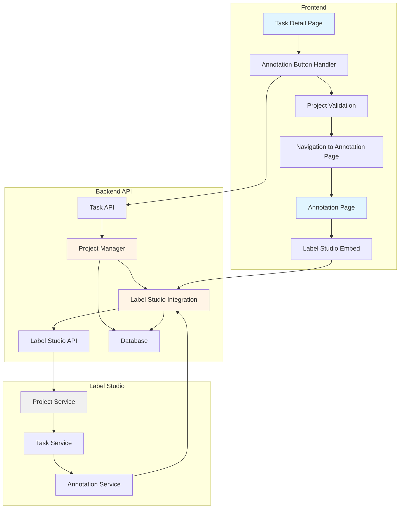
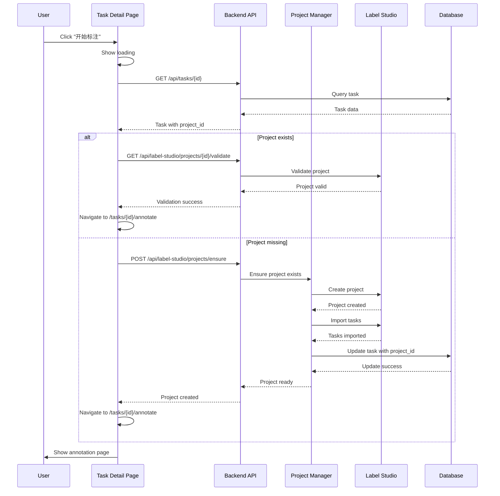
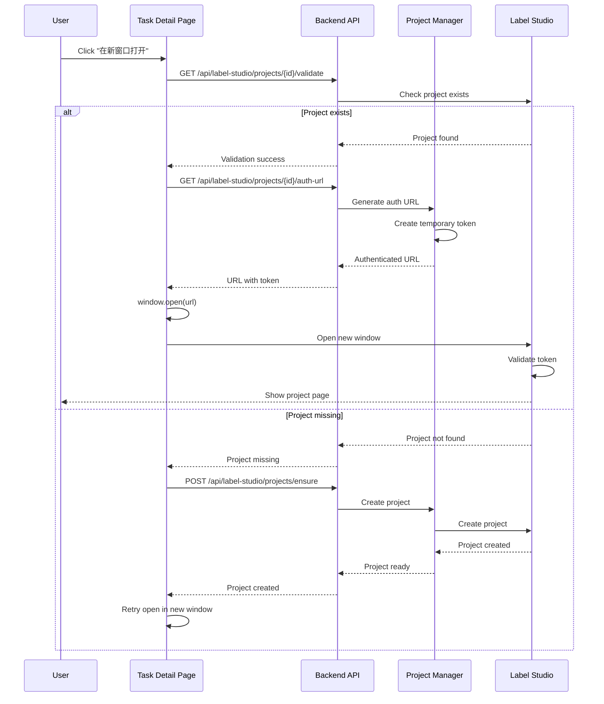
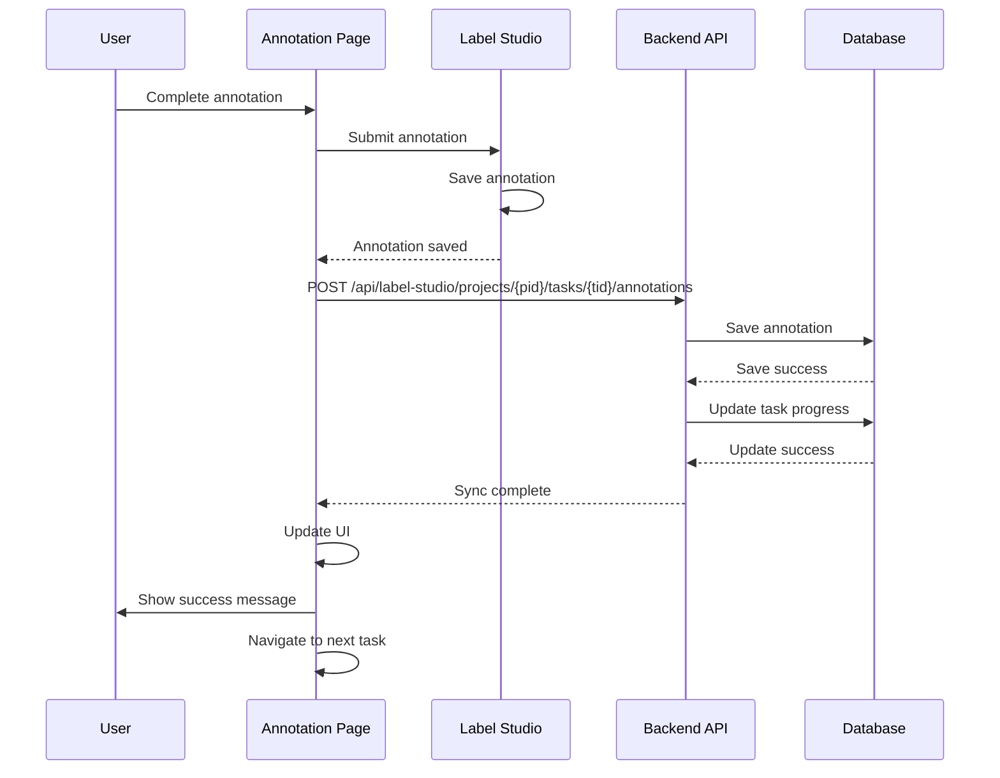

# Annotation Workflow Fix - Design

## 1. Architecture Overview



## 2. Component Design

### 2.1 Frontend Components

#### 2.1.1 Task Detail Page Enhancement

**File**: `frontend/src/pages/Tasks/TaskDetail.tsx`

**Responsibilities**:
- Validate Label Studio project existence before navigation
- Handle project creation if needed
- Show loading states during async operations
- Display clear error messages

**Key Changes**:
```typescript
// Add project validation hook
const { data: projectStatus, isLoading: checkingProject } = useQuery({
  queryKey: ['labelStudioProject', currentTask.label_studio_project_id],
  queryFn: () => checkProjectExists(currentTask.label_studio_project_id),
  enabled: !!currentTask.label_studio_project_id
});

// Handle annotation button click
const handleStartAnnotation = async () => {
  try {
    setLoading(true);
    
    // Check if project exists
    if (!projectStatus?.exists) {
      // Create project automatically
      const project = await createLabelStudioProject({
        taskId: currentTask.id,
        title: currentTask.name,
        annotationType: currentTask.annotation_type
      });
      
      // Update task with project ID
      await updateTask.mutateAsync({
        id: currentTask.id,
        payload: { label_studio_project_id: project.id }
      });
    }
    
    // Navigate to annotation page
    navigate(`/tasks/${id}/annotate`);
  } catch (error) {
    message.error(t('annotate.projectCreationFailed'));
  } finally {
    setLoading(false);
  }
};

// Handle open in new window
const handleOpenInNewWindow = async () => {
  try {
    // Ensure project exists
    if (!projectStatus?.exists) {
      await handleStartAnnotation();
    }
    
    // Generate authenticated URL
    const authUrl = await generateLabelStudioUrl(
      currentTask.label_studio_project_id
    );
    
    // Open in new window
    window.open(authUrl, '_blank', 'noopener,noreferrer');
  } catch (error) {
    message.error(t('annotate.openWindowFailed'));
  }
};
```

#### 2.1.2 Annotation Page Enhancement

**File**: `frontend/src/pages/Tasks/TaskAnnotate.tsx`

**Responsibilities**:
- Validate project and tasks on mount
- Create project if missing
- Handle authentication errors
- Implement retry logic

**Key Changes**:
```typescript
// Enhanced data fetching with validation
const fetchData = useCallback(async () => {
  if (!id || !token) return;

  try {
    setLoading(true);
    
    // Step 1: Validate project exists
    let projectId = taskDetail?.label_studio_project_id;
    
    if (!projectId) {
      // Create project automatically
      const project = await createLabelStudioProject({
        taskId: id,
        title: taskDetail?.name || 'Annotation Project',
        annotationType: taskDetail?.annotation_type || 'text_classification'
      });
      
      projectId = project.id;
      
      // Update task with project ID
      await updateTask.mutateAsync({
        id,
        payload: { label_studio_project_id: projectId }
      });
    }
    
    // Step 2: Fetch project info
    const projectResponse = await apiClient.get(
      `/api/label-studio/projects/${projectId}`,
      { headers: { Authorization: `Bearer ${token}` } }
    );
    setProject(projectResponse.data);
    
    // Step 3: Fetch tasks
    const tasksResponse = await apiClient.get(
      `/api/label-studio/projects/${projectId}/tasks`,
      { headers: { Authorization: `Bearer ${token}` } }
    );
    
    const tasksList = tasksResponse.data.results || [];
    
    // If no tasks, import from SuperInsight
    if (tasksList.length === 0) {
      await importTasksToLabelStudio(projectId, id);
      // Refetch tasks
      const refetchResponse = await apiClient.get(
        `/api/label-studio/projects/${projectId}/tasks`,
        { headers: { Authorization: `Bearer ${token}` } }
      );
      setTasks(refetchResponse.data.results || []);
    } else {
      setTasks(tasksList);
    }
    
    // Find first unlabeled task
    const unlabeledIndex = tasksList.findIndex(
      (task: LabelStudioTask) => !task.is_labeled
    );
    if (unlabeledIndex !== -1) {
      setCurrentTaskIndex(unlabeledIndex);
    }
    
    // Count labeled tasks
    const labeled = tasksList.filter(
      (task: LabelStudioTask) => task.is_labeled
    ).length;
    setAnnotationCount(labeled);
    
  } catch (error) {
    console.error('Failed to fetch data:', error);
    
    // Handle specific errors
    if (error.response?.status === 404) {
      message.error(t('annotate.projectNotFound'));
    } else if (error.response?.status === 401) {
      message.error(t('annotate.authenticationFailed'));
    } else {
      message.error(t('annotate.loadDataFailed'));
    }
  } finally {
    setLoading(false);
  }
}, [id, token, taskDetail, updateTask, t]);
```

### 2.2 Backend Components

#### 2.2.1 Project Manager Service

**File**: `src/label_studio/project_manager.py` (NEW)

**Responsibilities**:
- Manage Label Studio project lifecycle
- Handle automatic project creation
- Validate project existence
- Import tasks to Label Studio

**Interface**:
```python
class LabelStudioProjectManager:
    """Manages Label Studio projects for SuperInsight tasks"""
    
    async def ensure_project_exists(
        self,
        task_id: str,
        task_name: str,
        annotation_type: str,
        db: Session
    ) -> LabelStudioProject:
        """
        Ensure Label Studio project exists for task.
        Creates project if it doesn't exist.
        
        Args:
            task_id: SuperInsight task ID
            task_name: Task name for project title
            annotation_type: Type of annotation
            db: Database session
            
        Returns:
            LabelStudioProject: Project information
        """
        pass
    
    async def create_project_for_task(
        self,
        task_id: str,
        task_name: str,
        annotation_type: str,
        db: Session
    ) -> LabelStudioProject:
        """Create new Label Studio project for task"""
        pass
    
    async def import_task_data(
        self,
        project_id: str,
        task_id: str,
        db: Session
    ) -> ImportResult:
        """Import task data into Label Studio project"""
        pass
    
    async def validate_project(
        self,
        project_id: str
    ) -> ProjectValidationResult:
        """Validate project exists and is accessible"""
        pass
    
    async def generate_authenticated_url(
        self,
        project_id: str,
        user_token: str
    ) -> str:
        """Generate authenticated URL for Label Studio"""
        pass
```

#### 2.2.2 Enhanced API Endpoints

**File**: `src/api/label_studio_api.py`

**New Endpoints**:

```python
@router.post("/projects/ensure")
async def ensure_project_exists(
    task_id: str,
    current_user: UserModel = Depends(get_current_user),
    db: Session = Depends(get_db_session)
):
    """
    Ensure Label Studio project exists for task.
    Creates project if needed.
    
    POST /api/label-studio/projects/ensure
    Body: { "task_id": "uuid" }
    
    Returns:
        {
            "project_id": "123",
            "created": true/false,
            "status": "ready"
        }
    """
    pass

@router.get("/projects/{project_id}/validate")
async def validate_project(
    project_id: str,
    current_user: UserModel = Depends(get_current_user)
):
    """
    Validate project exists and is accessible.
    
    GET /api/label-studio/projects/{project_id}/validate
    
    Returns:
        {
            "exists": true/false,
            "accessible": true/false,
            "task_count": 100,
            "status": "ready"
        }
    """
    pass

@router.post("/projects/{project_id}/import-tasks")
async def import_tasks_to_project(
    project_id: str,
    task_id: str,
    current_user: UserModel = Depends(get_current_user),
    db: Session = Depends(get_db_session)
):
    """
    Import tasks from SuperInsight to Label Studio project.
    
    POST /api/label-studio/projects/{project_id}/import-tasks
    Body: { "task_id": "uuid" }
    
    Returns:
        {
            "imported_count": 100,
            "failed_count": 0,
            "status": "success"
        }
    """
    pass

@router.get("/projects/{project_id}/auth-url")
async def get_authenticated_url(
    project_id: str,
    current_user: UserModel = Depends(get_current_user)
):
    """
    Generate authenticated URL for Label Studio.
    
    GET /api/label-studio/projects/{project_id}/auth-url
    
    Returns:
        {
            "url": "http://label-studio/projects/123?token=xxx",
            "expires_at": "2025-01-26T12:00:00Z"
        }
    """
    pass
```

### 2.3 Database Schema

#### 2.3.1 Task Model Enhancement

**File**: `src/models/task.py`

**Changes**:
```python
class TaskModel(Base):
    __tablename__ = "tasks"
    
    # ... existing fields ...
    
    # Label Studio integration
    label_studio_project_id = Column(String(50), nullable=True, index=True)
    label_studio_project_created_at = Column(DateTime, nullable=True)
    label_studio_sync_status = Column(
        String(20), 
        default="pending",  # pending, synced, failed
        nullable=False
    )
    label_studio_last_sync = Column(DateTime, nullable=True)
    label_studio_task_count = Column(Integer, default=0)
    label_studio_annotation_count = Column(Integer, default=0)
```

## 3. Sequence Diagrams

### 3.1 Start Annotation Flow



### 3.2 Open in New Window Flow



### 3.3 Annotation Sync Flow



## 4. Technical Decisions

### 4.1 Automatic Project Creation

**Decision**: Implement automatic project creation when user starts annotation

**Rationale**:
- Improves user experience (no manual setup)
- Reduces support burden
- Prevents "project not found" errors
- Aligns with user expectations

**Alternatives Considered**:
1. Manual project creation - Rejected (poor UX)
2. Batch project creation - Rejected (resource intensive)
3. Lazy project creation - **Selected** (best UX, efficient)

**Trade-offs**:
- Pros: Seamless UX, automatic recovery
- Cons: Slight delay on first annotation, potential for orphaned projects

### 4.2 Project Validation Strategy

**Decision**: Validate project existence before navigation

**Rationale**:
- Prevents navigation to broken pages
- Allows automatic recovery
- Provides clear error messages
- Improves reliability

**Implementation**:
```typescript
// Frontend validation hook
const useProjectValidation = (projectId: string) => {
  return useQuery({
    queryKey: ['projectValidation', projectId],
    queryFn: async () => {
      const response = await apiClient.get(
        `/api/label-studio/projects/${projectId}/validate`
      );
      return response.data;
    },
    staleTime: 60000, // Cache for 1 minute
    retry: 2
  });
};
```

### 4.3 Authentication for New Window

**Decision**: Generate temporary authenticated URL with language preference

**Rationale**:
- Avoids CORS issues
- Maintains security
- Works with Label Studio's auth system
- Provides seamless experience
- Synchronizes language preference

**Implementation**:
```python
async def generate_authenticated_url(
    self,
    project_id: str,
    user_token: str,
    language: str = "zh"  # User's language preference
) -> str:
    """Generate authenticated URL with temporary token and language"""
    # Create temporary token (expires in 1 hour)
    temp_token = create_temporary_token(
        user_token=user_token,
        project_id=project_id,
        expires_in=3600
    )
    
    # Generate URL with token and language parameter
    # Label Studio supports ?lang=zh or ?lang=en
    url = f"{self.base_url}/projects/{project_id}?token={temp_token}&lang={language}"
    
    return url
```

### 4.4 Language Synchronization Strategy

**Decision**: Pass language preference via URL parameters and project configuration

**Rationale**:
- No modification to Label Studio source code
- Uses Label Studio's native i18n system
- Compatible with future upgrades
- Instant language switching
- Consistent user experience

**Label Studio Language Support**:
Label Studio natively supports multiple languages through:
1. URL parameter: `?lang=zh` or `?lang=en`
2. User profile setting (persisted in Label Studio)
3. Browser language detection (fallback)

**Implementation Approach**:
```typescript
// Frontend - Get user's language preference
const userLanguage = i18n.language; // 'zh' or 'en'

// Pass to authenticated URL generation
const { url } = await generateLabelStudioUrl(projectId, userLanguage);

// URL will be: http://label-studio/projects/123?token=xxx&lang=zh
window.open(url, '_blank');
```

**Language Mapping**:
```typescript
const LANGUAGE_MAP = {
  'zh': 'zh',      // Chinese Simplified
  'zh-CN': 'zh',   // Chinese Simplified
  'en': 'en',      // English
  'en-US': 'en'    // English
};

function getLabelStudioLanguage(superInsightLang: string): string {
  return LANGUAGE_MAP[superInsightLang] || 'zh'; // Default to Chinese
}
```

**Project Configuration**:
```python
# When creating project, set default language
project_data = {
    "title": project_config.title,
    "description": project_config.description,
    "label_config": label_config,
    # ... other settings ...
    "default_language": "zh",  # Default to Chinese
}
```

### 4.4 Error Handling Strategy

**Decision**: Implement multi-level error handling with automatic recovery

**Levels**:
1. **Network errors**: Retry with exponential backoff
2. **404 errors**: Attempt automatic project creation
3. **401 errors**: Prompt for re-authentication
4. **500 errors**: Show error message, log for debugging

**Implementation**:
```typescript
const handleAnnotationError = (error: any) => {
  if (error.response?.status === 404) {
    // Project not found - attempt creation
    return handleProjectCreation();
  } else if (error.response?.status === 401) {
    // Authentication failed - prompt login
    return handleAuthenticationError();
  } else if (error.code === 'ECONNABORTED') {
    // Network timeout - retry
    return handleNetworkRetry();
  } else {
    // Unknown error - show message
    message.error(t('annotate.unexpectedError'));
    logger.error('Annotation error:', error);
  }
};
```

### 4.5 Smooth Navigation Strategy

**Decision**: Implement progressive loading with visual feedback

**Rationale**:
- Improves perceived performance
- Provides clear user feedback
- Reduces user anxiety during loading
- Enables early error detection

**Implementation**:
```typescript
const handleStartAnnotation = async () => {
  // Step 1: Show loading modal
  const loadingModal = Modal.info({
    title: t('annotate.preparing'),
    content: (
      <div>
        <Progress percent={0} status="active" />
        <p>{t('annotate.validatingProject')}</p>
      </div>
    ),
    okButtonProps: { style: { display: 'none' } }
  });
  
  try {
    // Step 2: Validate project (20% progress)
    updateProgress(loadingModal, 20, t('annotate.validatingProject'));
    const projectStatus = await validateProject(projectId);
    
    if (!projectStatus.exists) {
      // Step 3: Create project (40% progress)
      updateProgress(loadingModal, 40, t('annotate.creatingProject'));
      await createProject(taskId);
      
      // Step 4: Import tasks (70% progress)
      updateProgress(loadingModal, 70, t('annotate.importingTasks'));
      await importTasks(projectId, taskId);
    }
    
    // Step 5: Navigate (100% progress)
    updateProgress(loadingModal, 100, t('annotate.ready'));
    
    // Close modal and navigate
    setTimeout(() => {
      loadingModal.destroy();
      navigate(`/tasks/${id}/annotate`);
    }, 500);
    
  } catch (error) {
    loadingModal.destroy();
    handleError(error);
  }
};
```

### 4.5 Task Import Strategy

**Decision**: Import tasks on-demand when annotation starts

**Rationale**:
- Avoids bulk import overhead
- Ensures fresh data
- Reduces Label Studio storage
- Improves performance

**Implementation**:
```python
async def import_task_data(
    self,
    project_id: str,
    task_id: str,
    db: Session
) -> ImportResult:
    """Import task data on-demand"""
    # Get task and related documents
    task = db.query(TaskModel).filter(TaskModel.id == task_id).first()
    documents = db.query(DocumentModel).filter(
        DocumentModel.task_id == task_id
    ).all()
    
    # Convert to Label Studio format
    ls_tasks = []
    for doc in documents:
        ls_tasks.append({
            "data": {
                "text": doc.content,
                "document_id": str(doc.id)
            },
            "meta": {
                "superinsight_task_id": str(task_id),
                "document_id": str(doc.id)
            }
        })
    
    # Import to Label Studio
    result = await self.ls_integration.import_tasks(project_id, ls_tasks)
    
    return result
```

### 4.6 Label Studio i18n Configuration

**Decision**: Use Label Studio's native internationalization without source code modification

**Label Studio i18n Architecture**:
Label Studio supports internationalization through:
1. **Built-in language packs**: Chinese (zh) and English (en) are included
2. **URL parameter**: `?lang=zh` or `?lang=en`
3. **User preference**: Stored in Label Studio user profile
4. **Environment variable**: `LABEL_STUDIO_DEFAULT_LANGUAGE=zh`

**Configuration Approach**:

**1. Docker Environment Configuration**:
```yaml
# docker-compose.yml
services:
  label-studio:
    image: heartexlabs/label-studio:latest
    environment:
      - LABEL_STUDIO_DEFAULT_LANGUAGE=zh  # Default to Chinese
      - LABEL_STUDIO_DISABLE_SIGNUP_WITHOUT_LINK=true
      - LABEL_STUDIO_USERNAME=admin
      - LABEL_STUDIO_PASSWORD=${LABEL_STUDIO_PASSWORD}
    volumes:
      - label-studio-data:/label-studio/data
```

**2. Project Creation with Language**:
```python
async def create_project(self, project_config: ProjectConfig, language: str = "zh") -> LabelStudioProject:
    """Create project with language preference"""
    project_data = {
        "title": project_config.title,
        "description": project_config.description,
        "label_config": label_config,
        # Label Studio will use default language from environment
        # or user preference from URL parameter
    }
    
    # Create project
    async with httpx.AsyncClient(timeout=30.0) as client:
        response = await client.post(
            f"{self.base_url}/api/projects/",
            headers=self.headers,
            json=project_data
        )
    
    return response.json()
```

**3. URL Generation with Language**:
```python
async def generate_authenticated_url(
    self,
    project_id: str,
    user_token: str,
    language: str = "zh"
) -> str:
    """Generate URL with language parameter"""
    temp_token = create_temporary_token(
        user_token=user_token,
        project_id=project_id,
        expires_in=3600
    )
    
    # Add language parameter to URL
    # Label Studio will respect this parameter
    url = f"{self.base_url}/projects/{project_id}?token={temp_token}&lang={language}"
    
    return url
```

**4. Frontend Language Synchronization**:
```typescript
// Get user's current language from i18n
const currentLanguage = i18n.language; // 'zh' or 'en'

// Map to Label Studio language code
const labelStudioLang = currentLanguage.startsWith('zh') ? 'zh' : 'en';

// Pass to URL generation
const { url } = await apiClient.get(
  `/api/label-studio/projects/${projectId}/auth-url`,
  { params: { language: labelStudioLang } }
);

// URL will include language: ?token=xxx&lang=zh
window.open(url, '_blank');
```

**5. Embedded iframe Language**:
```typescript
// For embedded Label Studio in annotation page
<iframe
  src={`${labelStudioUrl}/projects/${projectId}?token=${token}&lang=${labelStudioLang}`}
  style={{ width: '100%', height: '100%', border: 'none' }}
/>
```

**Language Verification**:
```python
# Verify Label Studio language support
async def verify_language_support(self) -> Dict[str, bool]:
    """Verify which languages are supported"""
    try:
        async with httpx.AsyncClient(timeout=10.0) as client:
            # Check if Chinese language pack exists
            response_zh = await client.get(
                f"{self.base_url}/static/js/locale/zh.json",
                headers=self.headers
            )
            
            # Check if English language pack exists
            response_en = await client.get(
                f"{self.base_url}/static/js/locale/en.json",
                headers=self.headers
            )
            
            return {
                "zh": response_zh.status_code == 200,
                "en": response_en.status_code == 200
            }
    except Exception as e:
        logger.warning(f"Failed to verify language support: {e}")
        return {"zh": True, "en": True}  # Assume supported
```

**Fallback Strategy**:
```python
# If language parameter fails, Label Studio will:
# 1. Use environment variable LABEL_STUDIO_DEFAULT_LANGUAGE
# 2. Use user's browser language
# 3. Fall back to English

# Our implementation ensures:
# - Always pass language parameter in URL
# - Set default language in Docker environment
# - Log warning if language not supported
```

**Benefits of This Approach**:
- ✅ No Label Studio source code modification
- ✅ Compatible with future Label Studio versions
- ✅ Uses official Label Studio i18n system
- ✅ Instant language switching
- ✅ Consistent with Label Studio's design
- ✅ Easy to maintain and upgrade

## 5. Data Models

### 5.1 Project Validation Result

```python
class ProjectValidationResult(BaseModel):
    """Result of project validation"""
    exists: bool
    accessible: bool
    task_count: int
    annotation_count: int
    status: str  # ready, creating, error
    error_message: Optional[str] = None
```

### 5.2 Project Creation Request

```python
class ProjectCreationRequest(BaseModel):
    """Request to create Label Studio project"""
    task_id: str
    task_name: str
    annotation_type: str
    description: Optional[str] = None
    label_config: Optional[str] = None
```

### 5.3 Import Result

```python
class ImportResult(BaseModel):
    """Result of task import"""
    success: bool
    imported_count: int
    failed_count: int
    errors: List[str] = []
    project_id: str
    task_ids: List[int] = []
```

## 6. API Specifications

### 6.1 Ensure Project Exists

**Endpoint**: `POST /api/label-studio/projects/ensure`

**Request**:
```json
{
  "task_id": "550e8400-e29b-41d4-a716-446655440000",
  "task_name": "Customer Review Classification",
  "annotation_type": "text_classification"
}
```

**Response** (200 OK):
```json
{
  "project_id": "123",
  "created": true,
  "status": "ready",
  "task_count": 100,
  "message": "Project created successfully"
}
```

**Response** (500 Error):
```json
{
  "error": "project_creation_failed",
  "message": "Failed to create Label Studio project",
  "details": "Connection timeout"
}
```

### 6.2 Validate Project

**Endpoint**: `GET /api/label-studio/projects/{project_id}/validate`

**Response** (200 OK):
```json
{
  "exists": true,
  "accessible": true,
  "task_count": 100,
  "annotation_count": 65,
  "status": "ready"
}
```

**Response** (404 Not Found):
```json
{
  "exists": false,
  "accessible": false,
  "status": "not_found",
  "message": "Project not found in Label Studio"
}
```

### 6.3 Get Authenticated URL

**Endpoint**: `GET /api/label-studio/projects/{project_id}/auth-url`

**Response** (200 OK):
```json
{
  "url": "http://localhost:8080/projects/123?token=eyJ0eXAiOiJKV1QiLCJhbGc...",
  "expires_at": "2025-01-26T12:00:00Z",
  "project_id": "123"
}
```

## 7. Correctness Properties

### 7.1 Property 1: Project Creation Idempotency
**Specification**: Creating a project multiple times with the same task_id should result in the same project

**Test Strategy**:
```python
@given(task_id=st.uuids(), task_name=st.text())
def test_project_creation_idempotent(task_id, task_name):
    # Create project twice
    project1 = await create_project(task_id, task_name)
    project2 = await create_project(task_id, task_name)
    
    # Should return same project
    assert project1.id == project2.id
```

### 7.2 Property 2: Annotation Sync Consistency
**Specification**: All annotations created in Label Studio must be synced to SuperInsight database

**Test Strategy**:
```python
@given(annotations=st.lists(st.builds(Annotation)))
def test_annotation_sync_consistency(annotations):
    # Create annotations in Label Studio
    for ann in annotations:
        await create_annotation_in_ls(ann)
    
    # Sync to database
    await sync_annotations()
    
    # Verify all annotations in database
    db_annotations = await get_annotations_from_db()
    assert len(db_annotations) == len(annotations)
```

### 7.3 Property 3: Task Progress Accuracy
**Specification**: Task progress percentage must accurately reflect annotation completion

**Test Strategy**:
```python
@given(total_tasks=st.integers(min_value=1, max_value=1000),
       completed_tasks=st.integers(min_value=0))
def test_task_progress_accuracy(total_tasks, completed_tasks):
    assume(completed_tasks <= total_tasks)
    
    # Calculate progress
    progress = calculate_progress(completed_tasks, total_tasks)
    
    # Verify accuracy
    expected = (completed_tasks / total_tasks) * 100
    assert abs(progress - expected) < 0.01
```

## 8. Performance Considerations

### 8.1 Caching Strategy
- Cache project validation results for 1 minute
- Cache task lists for 30 seconds
- Invalidate cache on annotation creation

### 8.2 Lazy Loading
- Load tasks on-demand (pagination)
- Import tasks only when needed
- Defer non-critical data fetching

### 8.3 Batch Operations
- Import tasks in batches of 100
- Sync annotations in batches
- Use bulk database operations

## 9. Security Considerations

### 9.1 Authentication
- Validate user token before all operations
- Generate temporary tokens for new windows
- Implement token expiration (1 hour)

### 9.2 Authorization
- Check annotation permissions before project access
- Validate user can access specific project
- Audit all annotation operations

### 9.3 Data Protection
- Encrypt tokens in transit
- Sanitize user input
- Prevent SQL injection in queries

## 10. Monitoring and Logging

### 10.1 Metrics to Track
- Project creation success rate
- Task import success rate
- Annotation sync latency
- Error rates by type

### 10.2 Logging Strategy
- Log all project creation attempts
- Log all API errors with context
- Log authentication failures
- Log sync operations

### 10.3 Alerts
- Alert on project creation failure rate > 5%
- Alert on sync failure rate > 1%
- Alert on Label Studio unavailability
- Alert on authentication failure spike
