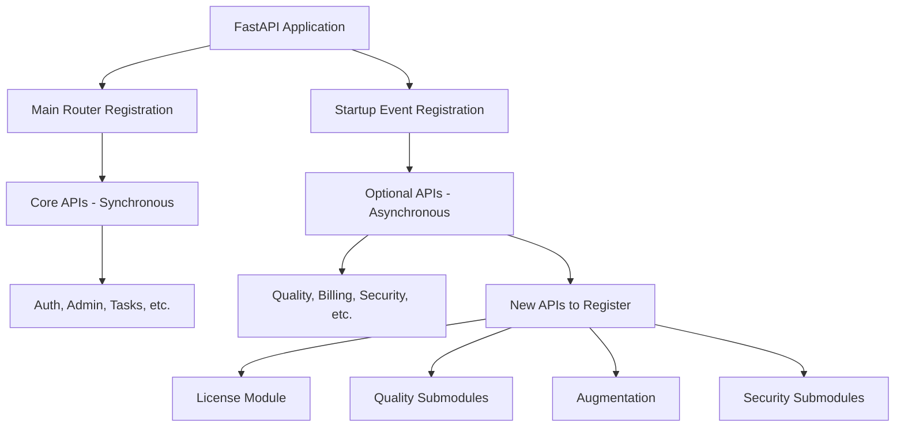
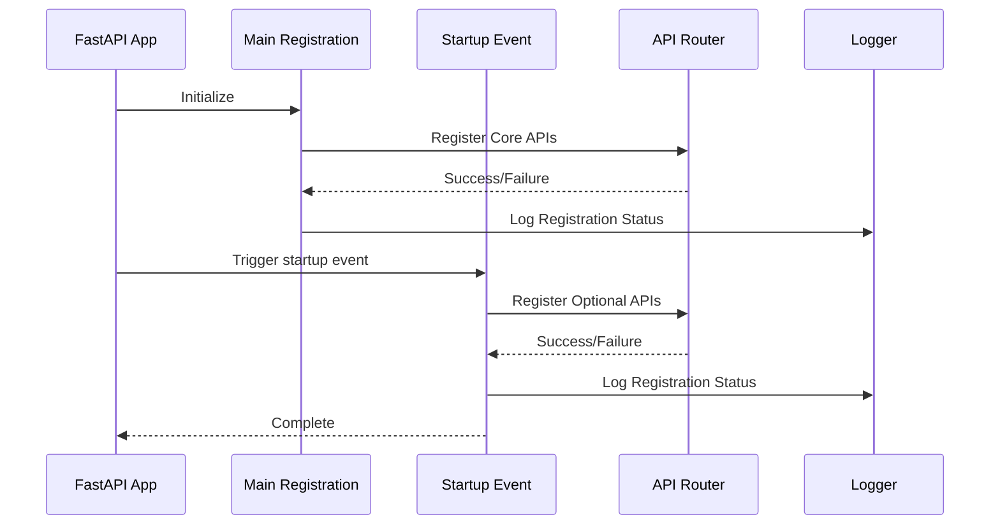

# API 注册修复 - 设计文档

## 1. 架构概览

### 1.1 系统架构



### 1.2 注册流程



## 2. 组件设计

### 2.1 API 注册管理器

**职责**: 统一管理 API 路由注册，提供错误处理和日志记录

**接口**:
```python
class APIRegistrationManager:
    """API 注册管理器"""
    
    def __init__(self, app: FastAPI, logger: Logger):
        self.app = app
        self.logger = logger
        self.registered_apis: List[str] = []
        self.failed_apis: List[Tuple[str, str]] = []
    
    def register_router(
        self,
        module_path: str,
        router_name: str = "router",
        prefix: Optional[str] = None,
        tags: Optional[List[str]] = None,
        required: bool = False
    ) -> bool:
        """
        注册单个 API 路由
        
        Args:
            module_path: 模块路径，如 "src.api.license_router"
            router_name: 路由对象名称，默认 "router"
            prefix: 路由前缀，如 "/api/v1/license"
            tags: API 标签
            required: 是否为必需 API（失败时是否抛出异常）
        
        Returns:
            bool: 注册是否成功
        """
        pass
    
    def register_batch(
        self,
        routers: List[Dict[str, Any]]
    ) -> Tuple[int, int]:
        """
        批量注册 API 路由
        
        Args:
            routers: 路由配置列表
        
        Returns:
            Tuple[成功数量, 失败数量]
        """
        pass
    
    def get_registration_report(self) -> Dict[str, Any]:
        """获取注册报告"""
        pass
```

### 2.2 API 配置定义

**数据模型**:
```python
from pydantic import BaseModel
from typing import Optional, List

class APIRouterConfig(BaseModel):
    """API 路由配置"""
    module_path: str  # 模块路径
    router_name: str = "router"  # 路由对象名称
    prefix: Optional[str] = None  # 路由前缀
    tags: Optional[List[str]] = None  # API 标签
    required: bool = False  # 是否必需
    priority: str = "high"  # 优先级: high, medium, low
    description: str = ""  # 描述
```

### 2.3 高优先级 API 配置

```python
HIGH_PRIORITY_APIS = [
    # License 模块 (3个)
    APIRouterConfig(
        module_path="src.api.license_router",
        prefix="/api/v1/license",
        tags=["license"],
        priority="high",
        description="License management API"
    ),
    APIRouterConfig(
        module_path="src.api.usage_router",
        prefix="/api/v1/license/usage",
        tags=["license", "usage"],
        priority="high",
        description="License usage monitoring API"
    ),
    APIRouterConfig(
        module_path="src.api.activation_router",
        prefix="/api/v1/license/activation",
        tags=["license", "activation"],
        priority="high",
        description="License activation API"
    ),
    
    # Quality 子模块 (3个)
    APIRouterConfig(
        module_path="src.api.quality_rules",
        prefix="/api/v1/quality/rules",
        tags=["quality", "rules"],
        priority="high",
        description="Quality rules management API"
    ),
    APIRouterConfig(
        module_path="src.api.quality_reports",
        prefix="/api/v1/quality/reports",
        tags=["quality", "reports"],
        priority="high",
        description="Quality reports API"
    ),
    APIRouterConfig(
        module_path="src.api.quality_workflow",
        prefix="/api/v1/quality/workflow",
        tags=["quality", "workflow"],
        priority="high",
        description="Quality workflow API"
    ),
    
    # Augmentation 模块 (1个)
    APIRouterConfig(
        module_path="src.api.augmentation",
        prefix="/api/v1/augmentation",
        tags=["augmentation"],
        priority="high",
        description="Data augmentation API"
    ),
    
    # Security 子模块 (4个)
    APIRouterConfig(
        module_path="src.api.sessions",
        prefix="/api/v1/security/sessions",
        tags=["security", "sessions"],
        priority="medium",
        description="Session management API"
    ),
    APIRouterConfig(
        module_path="src.api.sso",
        prefix="/api/v1/security/sso",
        tags=["security", "sso"],
        priority="medium",
        description="SSO configuration API"
    ),
    APIRouterConfig(
        module_path="src.api.rbac",
        prefix="/api/v1/security/rbac",
        tags=["security", "rbac"],
        priority="medium",
        description="RBAC management API"
    ),
    APIRouterConfig(
        module_path="src.api.data_permission_router",
        prefix="/api/v1/security/data-permissions",
        tags=["security", "permissions"],
        priority="medium",
        description="Data permissions API"
    ),
    
    # Versioning (1个)
    APIRouterConfig(
        module_path="src.api.versioning",
        prefix="/api/v1/versioning",
        tags=["versioning"],
        priority="medium",
        description="Data versioning API"
    ),
]
```

## 3. 技术决策

### 3.1 注册策略

**决策**: 使用两阶段注册策略
- **阶段 1**: 主路由注册（同步）- 核心 API
- **阶段 2**: 启动事件注册（异步）- 可选 API

**理由**:
1. 核心 API 必须在应用启动时立即可用
2. 可选 API 可以异步加载，避免阻塞启动
3. 失败的可选 API 不应影响核心功能

**替代方案**:
- 全部同步注册：简单但启动慢，单点失败影响大
- 全部异步注册：启动快但核心 API 可能延迟可用

### 3.2 错误处理策略

**决策**: 使用 try-except 包装每个 API 注册

**模式**:
```python
try:
    from src.api.module_name import router as module_router
    app.include_router(
        module_router,
        prefix="/api/v1/module",
        tags=["module"]
    )
    logger.info(f"✅ Module API registered: /api/v1/module")
    registered_count += 1
except ImportError as e:
    logger.warning(f"⚠️ Module API not available: {e}")
    failed_apis.append(("module", str(e)))
except Exception as e:
    logger.error(f"❌ Module API failed to load: {e}")
    failed_apis.append(("module", str(e)))
```

**理由**:
1. 单个 API 失败不影响其他 API
2. 详细的错误日志便于调试
3. 区分 ImportError（模块不存在）和其他异常

### 3.3 日志记录策略

**决策**: 使用结构化日志记录

**格式**:
```python
# 成功注册
logger.info(f"✅ {api_name} registered: {prefix}")

# 模块不可用（非错误）
logger.warning(f"⚠️ {api_name} not available: {reason}")

# 注册失败（错误）
logger.error(f"❌ {api_name} failed: {error}")

# 注册摘要
logger.info(f"📊 API Registration Summary: {success}/{total} successful, {failed} failed")
```

**理由**:
1. 使用 emoji 提高可读性
2. 区分不同严重级别
3. 提供注册摘要便于快速了解状态

### 3.4 路由前缀规范

**决策**: 统一使用 `/api/v1/{module}` 格式

**规则**:
- 核心模块: `/api/v1/{module}`
- 子模块: `/api/v1/{parent}/{child}`
- 特殊模块: `/api/{module}` (如 `/api/billing`)

**理由**:
1. 保持一致性
2. 便于版本管理
3. 符合 RESTful 规范

## 4. 数据模型

### 4.1 注册状态模型

```python
from enum import Enum
from typing import List, Optional
from pydantic import BaseModel

class RegistrationStatus(str, Enum):
    """注册状态"""
    SUCCESS = "success"
    FAILED = "failed"
    SKIPPED = "skipped"

class APIRegistrationResult(BaseModel):
    """API 注册结果"""
    module_path: str
    prefix: str
    status: RegistrationStatus
    error: Optional[str] = None
    timestamp: str

class RegistrationReport(BaseModel):
    """注册报告"""
    total: int
    successful: int
    failed: int
    skipped: int
    results: List[APIRegistrationResult]
    duration_ms: float
```

## 5. 接口定义

### 5.1 新增 API 端点

#### 5.1.1 获取 API 注册状态

```python
@app.get("/api/info", tags=["system"])
async def get_api_info() -> Dict[str, Any]:
    """
    获取所有已注册的 API 信息
    
    Returns:
        {
            "total": 60,
            "registered": [
                {
                    "path": "/api/v1/license",
                    "name": "License Management",
                    "tags": ["license"],
                    "status": "active"
                },
                ...
            ],
            "failed": [
                {
                    "path": "/api/v1/module",
                    "error": "ImportError: ..."
                }
            ]
        }
    """
    pass
```

### 5.2 更新现有端点

#### 5.2.1 健康检查端点

```python
@app.get("/health", tags=["system"])
async def health_check() -> Dict[str, Any]:
    """
    健康检查端点
    
    新增字段:
        - api_registration_status: API 注册状态
        - registered_apis_count: 已注册 API 数量
    """
    return {
        "status": "healthy",
        "timestamp": datetime.now().isoformat(),
        "api_registration_status": "complete",
        "registered_apis_count": len(registered_apis),
        # ... 其他字段
    }
```

## 6. 实现细节

### 6.1 文件修改清单

#### 6.1.1 src/app.py

**修改内容**:
1. 添加 `APIRegistrationManager` 类
2. 添加 `HIGH_PRIORITY_APIS` 配置
3. 修改 `include_optional_routers()` 函数
4. 添加 `/api/info` 端点
5. 更新 `/health` 端点

**修改位置**:
- 在文件开头添加新的导入
- 在 `create_app()` 函数后添加 `APIRegistrationManager` 类
- 在 `include_optional_routers()` 函数中使用新的注册逻辑
- 在路由定义部分添加新端点

### 6.2 注册顺序

**优先级顺序**:
1. **P0 - 核心 API** (主路由注册)
   - auth, admin, tasks, dashboard
   
2. **P1 - 高优先级 API** (启动事件注册)
   - License 模块 (3个)
   - Quality 子模块 (3个)
   - Augmentation (1个)
   
3. **P2 - 中优先级 API** (启动事件注册)
   - Security 子模块 (4个)
   - Versioning (1个)
   
4. **P3 - 低优先级 API** (启动事件注册)
   - 监控和管理工具

### 6.3 错误恢复机制

**策略**:
1. **优雅降级**: 单个 API 失败不影响其他 API
2. **详细日志**: 记录失败原因便于调试
3. **状态报告**: 提供 `/api/info` 端点查看注册状态
4. **重试机制**: 对于临时失败的 API，提供手动重试接口

## 7. 测试策略

### 7.1 单元测试

**测试范围**:
- `APIRegistrationManager` 类的所有方法
- 错误处理逻辑
- 日志记录功能

**测试用例**:
```python
def test_register_router_success():
    """测试成功注册 API"""
    pass

def test_register_router_import_error():
    """测试模块不存在的情况"""
    pass

def test_register_router_exception():
    """测试注册过程中的异常"""
    pass

def test_register_batch():
    """测试批量注册"""
    pass

def test_get_registration_report():
    """测试获取注册报告"""
    pass
```

### 7.2 集成测试

**测试范围**:
- 应用启动流程
- API 端点可访问性
- 前端页面数据加载

**测试用例**:
```python
@pytest.mark.asyncio
async def test_app_startup():
    """测试应用启动"""
    # 启动应用
    # 检查所有高优先级 API 已注册
    pass

@pytest.mark.asyncio
async def test_license_api_accessible():
    """测试 License API 可访问"""
    response = await client.get("/api/v1/license")
    assert response.status_code in [200, 401]  # 200 或需要认证
    pass

@pytest.mark.asyncio
async def test_quality_rules_api_accessible():
    """测试 Quality Rules API 可访问"""
    pass
```

### 7.3 端到端测试

**测试范围**:
- 前端页面完整流程
- API 调用链路
- 数据一致性

**测试场景**:
1. License 模块完整流程
2. Quality 模块完整流程
3. Augmentation 模块完整流程
4. Security 子模块完整流程

## 8. 部署策略

### 8.1 部署步骤

1. **代码更新**
   ```bash
   git pull origin main
   ```

2. **重启后端容器**
   ```bash
   docker restart superinsight-api
   ```

3. **验证 API 注册**
   ```bash
   curl http://localhost:8000/api/info
   curl http://localhost:8000/health
   ```

4. **测试前端页面**
   - 访问 License 页面
   - 访问 Quality 子页面
   - 访问 Augmentation 页面
   - 访问 Security 子页面

5. **监控日志**
   ```bash
   docker logs -f superinsight-api | grep "API"
   ```

### 8.2 回滚策略

**触发条件**:
- 应用启动失败
- 核心 API 不可用
- 严重性能问题

**回滚步骤**:
1. 恢复到上一个稳定版本
2. 重启容器
3. 验证核心功能
4. 分析失败原因

### 8.3 监控指标

**关键指标**:
- API 注册成功率
- 应用启动时间
- API 响应时间
- 错误率

**告警阈值**:
- API 注册成功率 < 95%
- 应用启动时间 > 30秒
- API 响应时间 > 1秒
- 错误率 > 1%

## 9. 安全考虑

### 9.1 认证和授权

**要求**:
- 所有新注册的 API 必须有适当的认证
- 敏感操作需要额外的权限检查

**实现**:
```python
from src.security.auth import get_current_user, require_permission

@router.get("/api/v1/license")
async def get_license(
    current_user: User = Depends(get_current_user),
    _: None = Depends(require_permission("license:read"))
):
    """获取许可证信息（需要认证和权限）"""
    pass
```

### 9.2 输入验证

**要求**:
- 所有 API 输入必须经过验证
- 使用 Pydantic 模型定义输入格式

### 9.3 错误信息

**要求**:
- 不暴露敏感的系统信息
- 提供有用但安全的错误消息

## 10. 性能优化

### 10.1 启动优化

**策略**:
- 并行加载可选 API
- 延迟加载低优先级 API
- 缓存注册结果

### 10.2 运行时优化

**策略**:
- 使用路由缓存
- 优化依赖注入
- 减少中间件开销

## 11. 文档更新

### 11.1 API 文档

**更新内容**:
- 添加新 API 端点文档
- 更新 OpenAPI 规范
- 添加使用示例

### 11.2 开发文档

**更新内容**:
- 更新 API 注册指南
- 添加故障排查指南
- 更新架构图

## 12. 正确性属性

### 12.1 Property 1: API 注册完整性

**规范**: 所有高优先级 API 必须成功注册

**形式化**:
```
∀ api ∈ HIGH_PRIORITY_APIS:
    api.status = RegistrationStatus.SUCCESS
```

**测试方法**: Property-based testing
```python
@given(api_config=st.sampled_from(HIGH_PRIORITY_APIS))
def test_high_priority_api_registered(api_config):
    """属性测试：所有高优先级 API 必须注册成功"""
    assert api_config.module_path in registered_apis
```

### 12.2 Property 2: 错误隔离

**规范**: 单个 API 注册失败不影响其他 API

**形式化**:
```
∀ api1, api2 ∈ ALL_APIS, api1 ≠ api2:
    api1.status = FAILED ⇒ api2.status ≠ AFFECTED
```

**测试方法**: Unit testing with mocking
```python
def test_api_failure_isolation():
    """测试 API 失败隔离"""
    # Mock 一个 API 失败
    # 验证其他 API 仍然成功注册
    pass
```

### 12.3 Property 3: 路由唯一性

**规范**: 所有 API 路由前缀必须唯一

**形式化**:
```
∀ api1, api2 ∈ REGISTERED_APIS, api1 ≠ api2:
    api1.prefix ≠ api2.prefix
```

**测试方法**: Static analysis
```python
def test_route_uniqueness():
    """测试路由唯一性"""
    prefixes = [api.prefix for api in registered_apis]
    assert len(prefixes) == len(set(prefixes))
```

---

**文档版本**: 1.0  
**创建日期**: 2026-01-19  
**状态**: 待审批
