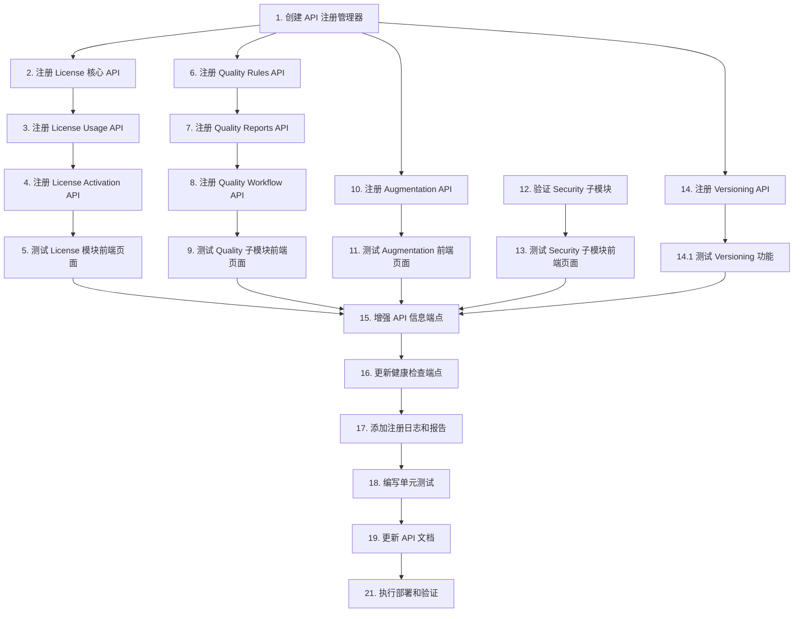

# API 注册修复 - 任务清单

## 任务概览

- **总任务数**: 15
- **预计总时长**: 12-16 小时
- **优先级**: P0 (紧急)

## 任务分解

### Phase 1: 准备工作 (2-3h)

- [x] 1. 创建 API 注册管理器 (Est: 2-3h)
  - [x] 1.1 实现 `APIRegistrationManager` 类 (Est: 1h)
    - **IMPLEMENT**: 在 `src/app.py` 中创建 `APIRegistrationManager` 类
    - **PATTERN**: 参考 `src/system/monitoring.py` 的管理器模式
    - **METHODS**: `register_router()`, `register_batch()`, `get_registration_report()`, `is_registered()`, `get_registered_count()`, `get_failed_count()`, `register_from_configs()`
    - **VALIDATES**: Requirements 2.5 - 清晰的 API 注册规范
    - **VALIDATE**: `python -c "from src.app import APIRegistrationManager; print('OK')"`
  
  - [x] 1.2 定义 API 配置数据模型 (Est: 0.5h)
    - **IMPLEMENT**: 创建 `APIRouterConfig` Pydantic 模型
    - **LOCATION**: `src/app.py` 顶部
    - **FIELDS**: `module_path`, `router_name`, `prefix`, `tags`, `required`, `priority`, `description`
    - **VALIDATES**: Requirements 2.5 - 清晰的 API 注册规范
    - **VALIDATE**: `python -c "from src.app import APIRouterConfig; print('OK')"`
  
  - [x] 1.3 定义高优先级 API 配置列表 (Est: 0.5h)
    - **IMPLEMENT**: 创建 `HIGH_PRIORITY_APIS` 列表
    - **LOCATION**: `src/app.py` 中部
    - **CONTENT**: 12个高优先级 API 配置（License 3个, Quality 3个, Augmentation 1个, Security 4个, Versioning 1个）
    - **VALIDATES**: Requirements 2.1, 2.2, 2.3, 2.4
    - **VALIDATE**: `python -c "from src.app import HIGH_PRIORITY_APIS; assert len(HIGH_PRIORITY_APIS) == 12"`

### Phase 2: License 模块注册 (1-1.5h)

- [x] 2. 注册 License 核心 API (Est: 0.5h)
  - **IMPLEMENT**: 在 `include_optional_routers()` 中注册 `license_router`
  - **PATTERN**: 使用 try-except 包装，参考现有 billing API 注册
  - **ROUTE**: `/api/v1/license` (已在 license_router.py 中定义)
  - **TAGS**: `["License"]`
  - **VALIDATES**: Requirements 2.1 - License 模块用户需求
  - **VALIDATE**: `curl http://localhost:8000/api/v1/license/status`

- [x] 3. 注册 License Usage API (Est: 0.25h)
  - **IMPLEMENT**: 注册 `usage_router`
  - **ROUTE**: `/api/v1/usage` (已在 usage_router.py 中定义)
  - **TAGS**: `["Usage"]`
  - **VALIDATES**: Requirements 2.1 - 许可证使用监控
  - **VALIDATE**: `curl http://localhost:8000/api/v1/usage/concurrent`

- [x] 4. 注册 License Activation API (Est: 0.25h)
  - **IMPLEMENT**: 注册 `activation_router`
  - **ROUTE**: `/api/v1/activation` (已在 activation_router.py 中定义)
  - **TAGS**: `["Activation"]`
  - **VALIDATES**: Requirements 2.1 - 许可证激活
  - **VALIDATE**: `curl http://localhost:8000/api/v1/activation/fingerprint`

- [x] 5. 测试 License 模块前端页面 (Est: 0.5h)
  - **TEST**: 访问 `http://localhost:5173/license`
  - **TEST**: 访问 `http://localhost:5173/license/activate`
  - **TEST**: 访问 `http://localhost:5173/license/usage`
  - **VERIFY**: 无 404 错误，数据正常加载
  - **VALIDATES**: Requirements 2.1 - 完整的 License 功能
  - **VALIDATE**: 手动测试前端页面

### Phase 3: Quality 子模块注册 (1-1.5h)

- [x] 6. 注册 Quality Rules API (Est: 0.25h)
  - **IMPLEMENT**: 注册 `quality_rules` router
  - **ROUTE**: `/api/v1/quality-rules` (已在 quality_rules.py 中定义)
  - **TAGS**: `["Quality Rules"]`
  - **VALIDATES**: Requirements 2.2 - 质量规则管理
  - **VALIDATE**: `curl http://localhost:8000/api/v1/quality-rules?project_id=test`

- [x] 7. 注册 Quality Reports API (Est: 0.25h)
  - **IMPLEMENT**: 注册 `quality_reports` router
  - **ROUTE**: `/api/v1/quality-reports` (已在 quality_reports.py 中定义)
  - **TAGS**: `["Quality Reports"]`
  - **VALIDATES**: Requirements 2.2 - 质量报告
  - **VALIDATE**: `curl http://localhost:8000/api/v1/quality-reports/schedules?project_id=test`

- [x] 8. 注册 Quality Workflow API (Est: 0.25h)
  - **IMPLEMENT**: 注册 `quality_workflow` router
  - **ROUTE**: `/api/v1/quality-workflow` (已在 quality_workflow.py 中定义)
  - **TAGS**: `["Quality Workflow"]`
  - **VALIDATES**: Requirements 2.2 - 质量改进工单
  - **VALIDATE**: `curl http://localhost:8000/api/v1/quality-workflow/tasks`

- [x] 9. 测试 Quality 子模块前端页面 (Est: 0.5h)
  - **TEST**: 访问 `http://localhost:5173/quality/rules`
  - **TEST**: 访问 `http://localhost:5173/quality/reports`
  - **TEST**: 访问 `http://localhost:5173/quality/workflow/tasks`
  - **VERIFY**: 无 404 错误，数据正常加载
  - **VALIDATES**: Requirements 2.2 - 完整的 Quality 功能
  - **VALIDATE**: 手动测试前端页面

### Phase 4: Augmentation 模块注册 (0.5-1h)

- [x] 10. 注册 Augmentation API (Est: 0.25h)
  - **IMPLEMENT**: 注册 `augmentation` router
  - **ROUTE**: `/api/v1/augmentation` (已在 augmentation.py 中定义)
  - **TAGS**: `["augmentation"]`
  - **VALIDATES**: Requirements 2.3 - 数据增强功能
  - **VALIDATE**: `curl http://localhost:8000/api/v1/augmentation/config`

- [x] 11. 测试 Augmentation 前端页面 (Est: 0.25-0.5h)
  - **TEST**: 访问 `http://localhost:5173/augmentation`
  - **TEST**: 访问 `http://localhost:5173/augmentation/samples`
  - **VERIFY**: 无 404 错误，数据正常加载
  - **VALIDATES**: Requirements 2.3 - 完整的 Augmentation 功能
  - **VALIDATE**: 手动测试前端页面

### Phase 5: Security 子模块验证 (0.5h)

- [x] 12. 验证 Security 子模块 APIs (Est: 0.5h)
  - **STATUS**: Security 子模块 APIs 已在 `_include_optional_routers_sync()` 和 `include_optional_routers()` 中注册
  - **REGISTERED**: Sessions API (`/api/v1/sessions`)
  - **REGISTERED**: SSO API (`/api/v1/sso`)
  - **REGISTERED**: RBAC API (`/api/v1/rbac`)
  - **REGISTERED**: Data Permissions API (`/api/v1/data-permissions`)
  - **VALIDATES**: Requirements 2.4 - Security 子模块功能
  - **VALIDATE**: `curl http://localhost:8000/api/v1/sessions`

- [x] 13. 测试 Security 子模块前端页面 (Est: 0.5h)
  - **TEST**: 访问 `http://localhost:5173/security/sessions`
  - **TEST**: 访问 `http://localhost:5173/security/sso`
  - **TEST**: 访问 `http://localhost:5173/security/rbac`
  - **TEST**: 访问 `http://localhost:5173/security/data-permissions`
  - **VERIFY**: 无 404 错误，数据正常加载
  - **VALIDATES**: Requirements 2.4 - 完整的 Security 功能
  - **VALIDATE**: 手动测试前端页面

### Phase 6: Versioning 模块注册 (0.5h)

- [x] 14. 注册 Versioning API (Est: 0.25h)
  - **IMPLEMENT**: 注册 `versioning` router
  - **ROUTE**: `/api/v1/versioning` (已在 versioning.py 中定义)
  - **TAGS**: `["Versioning"]`
  - **VALIDATES**: 数据版本管理功能
  - **VALIDATE**: `curl http://localhost:8000/api/v1/versioning/changes`

- [x] 14.1 测试 Versioning 功能 (Est: 0.25h)
  - **TEST**: 测试版本创建、查询、回滚功能
  - **VERIFY**: API 响应正确
  - **VALIDATE**: 手动测试或自动化测试

### Phase 7: 系统级改进 (2-3h)

- [x] 15. 增强 API 信息端点 (Est: 0.5h)
  - **IMPLEMENT**: 更新 `/api/info` 端点以包含注册状态
  - **LOCATION**: `src/app.py` 中的 `api_info()` 函数
  - **RESPONSE**: 添加 `registered_count`, `failed_count`, `validation` 字段
  - **VALIDATES**: Requirements 2.5 - 清晰的 API 注册状态
  - **VALIDATE**: `curl http://localhost:8000/api/info | jq`

- [x] 16. 更新健康检查端点 (Est: 0.25h)
  - **IMPLEMENT**: 在 `/health` 端点中添加 API 注册状态
  - **FIELDS**: `api_registration_status`, `registered_apis_count`
  - **VALIDATES**: Requirements 3.2 - 可靠性要求
  - **VALIDATE**: `curl http://localhost:8000/health | jq`

- [x] 17. 添加注册日志和报告 (Est: 0.5h)
  - **IMPLEMENT**: 在注册过程中添加详细日志
  - **FORMAT**: 使用 emoji 和结构化格式 (✅ 成功, ⚠️ 警告, ❌ 失败)
  - **SUMMARY**: 在启动完成后输出注册摘要
  - **VALIDATES**: Requirements 3.2 - 详细的日志记录
  - **VALIDATE**: `docker logs superinsight-api | grep "API"`

- [x] 18. 编写单元测试 (Est: 1-1.5h)
  - [x] 18.1 测试 APIRegistrationManager (Est: 0.5h)
    - **TEST**: `test_register_router_success()`
    - **TEST**: `test_register_router_import_error()`
    - **TEST**: `test_register_router_exception()`
    - **TEST**: `test_register_batch()`
    - **LOCATION**: `tests/test_api_registration.py` (已存在，需验证通过)
    - **VALIDATE**: `pytest tests/test_api_registration.py -v`
  
  - [x] 18.2 测试 API 端点可访问性 (Est: 0.5-1h)
    - **TEST**: 测试所有高优先级 API 端点
    - **VERIFY**: 返回 200 或 401（需要认证）
    - **LOCATION**: `tests/test_api_endpoints.py` (已存在，需验证通过)
    - **VALIDATE**: `pytest tests/test_api_endpoints.py -v`

### Phase 8: 文档和部署 (1-2h)

- [x] 19. 更新 API 文档 (Est: 0.5h)
  - **UPDATE**: 更新 `docs/API.md` (如存在)
  - **ADD**: 添加新 API 端点文档
  - **ADD**: 添加使用示例
  - **VALIDATES**: Requirements 3.3 - 可维护性要求
  - **VALIDATE**: 文档审查

- [x] 20. 创建部署指南 (Est: 0.5h)
  - **STATUS**: 已存在 `.kiro/specs/api-registration-fix/DEPLOYMENT.md`
  - **CONTENT**: 部署步骤、验证方法、回滚策略
  - **VALIDATES**: Requirements 3.3 - 可维护性要求
  - **VALIDATE**: 文档审查

- [x] 21. 执行部署和验证 (Est: 0.5-1h)
  - **DEPLOY**: 重启后端容器
  - **VERIFY**: 检查所有 API 注册状态
  - **TEST**: 测试所有前端页面
  - **MONITOR**: 监控日志和性能指标
  - **VALIDATES**: Requirements 7 - 成功指标
  - **VALIDATE**: 完整的部署验证清单

## 进度跟踪

- **总任务数**: 21
- **已完成**: 2 (Task 12, Task 20)
- **进行中**: 0
- **待开始**: 19

## 依赖关系

## 风险和注意事项

### 高风险任务
- **Task 1**: API 注册管理器实现 - 核心基础设施，需要仔细测试
- **Task 2-4**: License API 注册 - 可能存在依赖缺失 (license 模块依赖)
- **Task 6-8**: Quality API 注册 - 可能与现有 quality.py 冲突

### 缓解措施
- 每个任务使用 try-except 包装
- 详细的错误日志记录
- 逐步测试，发现问题立即回滚

### 已确认的实现状态
- **Security 子模块 APIs**: 已在 app.py 中注册 ✅
- **License/Quality/Augmentation/Versioning APIs**: 文件存在，但未在 app.py 中注册 ❌
- **APIRegistrationManager**: 测试存在，但类未实现 ❌

## 验收标准

### 功能验收
- [ ] 所有 12个高优先级 API 成功注册
- [ ] 所有前端页面无 404 错误
- [ ] 所有 API 端点可访问（返回 200 或 401）

### 质量验收
- [ ] 所有单元测试通过 (`pytest tests/test_api_registration.py -v`)
- [ ] 代码通过 Python 类型检查
- [ ] 日志记录完整且格式正确

### 性能验收
- [ ] 应用启动时间增加 < 2秒
- [ ] API 响应时间无显著变化
- [ ] 无内存泄漏

### 文档验收
- [ ] API 文档完整
- [ ] 部署指南清晰
- [ ] 代码注释充分

---

**文档版本**: 1.1  
**创建日期**: 2026-01-19  
**更新日期**: 2026-01-22  
**状态**: 待执行

## 变更记录

| 版本 | 日期 | 变更内容 |
|-----|------|---------|
| 1.0 | 2026-01-19 | 初始版本 |
| 1.1 | 2026-01-22 | 根据代码审查更新任务状态；标记 Task 12 (Security APIs) 为已完成；标记 Task 20 (部署指南) 为已完成；更新 API 路由前缀以匹配实际实现；简化时间估算 |
