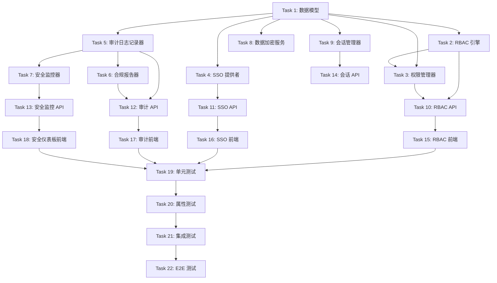

# Tasks Document: Audit & Security (审计与安全)

## Overview

本文档定义 Audit & Security 模块的实施任务，包括细粒度 RBAC 权限控制、SSO 单点登录、完整审计日志、合规报告、安全监控和数据加密。

## Task Dependencies

## Tasks

### Task 1: 数据模型和数据库迁移

**描述**: 创建安全和审计相关的数据库模型

**依赖**: 无

**文件**:
- `src/models/security.py`
- `alembic/versions/xxx_add_security_tables.py`

**验收标准**:
- [x] 创建 Role 模型（角色表）
- [x] 创建 UserRole 模型（用户角色关联表）
- [x] 创建 DynamicPolicy 模型（动态策略表）
- [x] 创建 SSOProvider 模型（SSO 提供者表）
- [x] 创建 AuditLog 模型（审计日志表）
- [x] 创建 SecurityEvent 模型（安全事件表）
- [x] 创建数据库迁移脚本

**对应需求**: Requirement 1, 3, 4, 6

---

### Task 2: RBAC 引擎实现

**描述**: 实现基于角色的访问控制核心功能

**依赖**: Task 1

**文件**:
- `src/security/rbac_engine.py`

**验收标准**:
- [x] 实现 create_role 方法（创建角色）
- [x] 实现 assign_role 方法（分配角色）
- [x] 实现 check_permission 方法（检查权限）
- [x] 实现角色继承（_get_role_permissions_recursive）
- [x] 实现权限通配符匹配
- [x] 实现权限缓存机制

**对应需求**: Requirement 1

---

### Task 3: 权限管理器实现

**描述**: 实现细粒度权限和动态策略管理

**依赖**: Task 1, Task 2

**文件**:
- `src/security/permission_manager.py`

**验收标准**:
- [x] 实现 check_access 方法（检查访问权限）
- [x] 实现时间范围策略（_check_time_range）
- [x] 实现 IP 白名单策略（_check_ip_whitelist）
- [x] 实现敏感级别策略（_check_sensitivity_level）
- [x] 实现属性策略（ABAC）
- [x] 实现权限决策日志记录（_log_decision）

**对应需求**: Requirement 2

---

### Task 4: SSO 提供者实现

**描述**: 实现多协议 SSO 单点登录

**依赖**: Task 1

**文件**:
- `src/security/sso_provider.py`
- `src/security/sso_connectors/saml.py`
- `src/security/sso_connectors/oauth2.py`
- `src/security/sso_connectors/oidc.py`
- `src/security/sso_connectors/ldap.py`

**验收标准**:
- [x] 实现 configure_provider 方法（配置 SSO 提供者）
- [x] 实现 SAML 2.0 连接器
- [x] 实现 OAuth 2.0 连接器
- [x] 实现 OIDC 连接器
- [x] 实现 LDAP/AD 连接器
- [x] 实现用户同步（_sync_user）
- [x] 实现单点登出

**对应需求**: Requirement 3

---

### Task 5: 审计日志记录器实现

**描述**: 实现完整的审计日志记录功能

**依赖**: Task 1

**文件**:
- `src/security/audit_logger.py`

**验收标准**:
- [x] 实现 log 方法（记录审计日志）
- [x] 实现哈希链防篡改（_calculate_hash）
- [x] 实现 verify_integrity 方法（验证完整性）
- [x] 实现 query_logs 方法（查询日志）
- [x] 实现 export_logs 方法（导出日志）
- [x] 实现 apply_retention_policy 方法（保留策略）

**对应需求**: Requirement 4

---

### Task 6: 合规报告器实现

**描述**: 实现合规报告生成功能

**依赖**: Task 5

**文件**:
- `src/security/compliance_reporter.py`

**验收标准**:
- [x] 实现 generate_gdpr_report 方法（GDPR 报告）
- [x] 实现 generate_soc2_report 方法（SOC 2 报告）
- [x] 实现 generate_access_report 方法（访问报告）
- [x] 实现 generate_permission_change_report 方法（权限变更报告）
- [x] 实现 schedule_report 方法（定时报告）
- [x] 支持多种导出格式

**对应需求**: Requirement 5

---

### Task 7: 安全监控器实现

**描述**: 实现实时安全监控和告警功能

**依赖**: Task 5

**文件**:
- `src/security/security_monitor.py`

**验收标准**:
- [x] 实现 monitor_login_attempts 方法（监控登录）
- [x] 实现 monitor_data_access 方法（监控数据访问）
- [x] 实现 monitor_permission_escalation 方法（监控权限提升）
- [x] 实现安全事件分级
- [x] 实现告警发送（_send_alert）
- [x] 实现 generate_security_posture_report 方法（安全态势报告）

**对应需求**: Requirement 6

---

### Task 8: 数据加密服务实现

**描述**: 实现数据加密和密钥管理功能

**依赖**: Task 1

**文件**:
- `src/security/encryption_service.py`
- `src/security/key_store.py`

**验收标准**:
- [x] 实现 encrypt 方法（加密数据）
- [x] 实现 decrypt 方法（解密数据）
- [x] 实现 encrypt_field 方法（加密数据库字段）
- [x] 实现 decrypt_field 方法（解密数据库字段）
- [x] 实现 rotate_key 方法（密钥轮换）
- [x] 实现密钥存储和管理

**对应需求**: Requirement 7

---

### Task 9: 会话管理器实现

**描述**: 实现用户会话管理功能

**依赖**: Task 1

**文件**:
- `src/security/session_manager.py`

**验收标准**:
- [x] 实现 create_session 方法（创建会话）
- [x] 实现 validate_session 方法（验证会话）
- [x] 实现 destroy_session 方法（销毁会话）
- [x] 实现 force_logout 方法（强制登出）
- [x] 实现并发会话限制
- [x] 实现会话超时配置

**对应需求**: Requirement 8

---

### Task 10: RBAC API 实现

**描述**: 实现 RBAC 相关的 REST API

**依赖**: Task 2, Task 3

**文件**:
- `src/api/rbac.py`

**验收标准**:
- [x] 实现 POST /rbac/roles（创建角色）
- [x] 实现 GET /rbac/roles（列出角色）
- [x] 实现 PUT /rbac/roles/{role_id}（更新角色）
- [x] 实现 DELETE /rbac/roles/{role_id}（删除角色）
- [x] 实现 POST /rbac/users/{user_id}/roles（分配角色）
- [x] 实现 POST /rbac/check（检查权限）

**对应需求**: Requirement 1, 2

---

### Task 11: SSO API 实现

**描述**: 实现 SSO 相关的 REST API

**依赖**: Task 4

**文件**:
- `src/api/sso.py`

**验收标准**:
- [x] 实现 POST /sso/providers（配置 SSO 提供者）
- [x] 实现 GET /sso/providers（列出 SSO 提供者）
- [x] 实现 GET /sso/login/{provider}（发起 SSO 登录）
- [x] 实现 POST /sso/callback/{provider}（处理 SSO 回调）
- [x] 实现 POST /sso/logout（SSO 登出）

**对应需求**: Requirement 3

---

### Task 12: 审计和合规 API 实现

**描述**: 实现审计日志和合规报告相关的 REST API

**依赖**: Task 5, Task 6

**文件**:
- `src/api/audit.py`

**验收标准**:
- [x] 实现 GET /audit/logs（查询审计日志）
- [x] 实现 POST /audit/logs/export（导出审计日志）
- [x] 实现 POST /audit/verify-integrity（验证完整性）
- [x] 实现 POST /compliance/reports/gdpr（GDPR 报告）
- [x] 实现 POST /compliance/reports/soc2（SOC 2 报告）
- [x] 实现 POST /compliance/reports/access（访问报告）

**对应需求**: Requirement 4, 5

---

### Task 13: 安全监控 API 实现

**描述**: 实现安全监控相关的 REST API

**依赖**: Task 7

**文件**:
- `src/api/security_monitor.py`

**验收标准**:
- [x] 实现 GET /security/events（列出安全事件）
- [x] 实现 POST /security/events/{event_id}/resolve（解决事件）
- [x] 实现 GET /security/posture（获取安全态势）

**对应需求**: Requirement 6

---

### Task 14: 会话管理 API 实现

**描述**: 实现会话管理相关的 REST API

**依赖**: Task 9

**文件**:
- `src/api/sessions.py`

**验收标准**:
- [x] 实现 GET /sessions（列出会话）
- [x] 实现 DELETE /sessions/{session_id}（销毁会话）
- [x] 实现 POST /sessions/force-logout/{user_id}（强制登出）
- [x] 实现 PUT /sessions/config（配置会话参数）

**对应需求**: Requirement 8

---

### Task 15: RBAC 前端实现

**描述**: 实现 RBAC 配置前端界面

**依赖**: Task 10

**文件**:
- `frontend/src/pages/security/RBACConfig.tsx`
- `frontend/src/pages/security/RoleList.tsx`
- `frontend/src/pages/security/PermissionMatrix.tsx`
- `frontend/src/services/rbacApi.ts`

**验收标准**:
- [x] 实现角色列表和管理组件
- [x] 实现权限矩阵配置组件
- [x] 实现用户角色分配组件
- [x] 实现角色创建/编辑对话框
- [x] 实现 API 调用服务

**对应需求**: Requirement 9

---

### Task 16: SSO 前端实现

**描述**: 实现 SSO 配置前端界面

**依赖**: Task 11

**文件**:
- `frontend/src/pages/security/SSOConfig.tsx`
- `frontend/src/pages/security/SSOProviderForm.tsx`
- `frontend/src/services/ssoApi.ts`

**验收标准**:
- [x] 实现 SSO 提供者列表组件
- [x] 实现 SSO 配置表单（SAML/OAuth/OIDC/LDAP）
- [x] 实现 SSO 测试功能
- [x] 实现 API 调用服务

**对应需求**: Requirement 9

---

### Task 17: 审计日志前端实现

**描述**: 实现审计日志查询和合规报告前端界面

**依赖**: Task 12

**文件**:
- `frontend/src/pages/security/AuditLogs.tsx`
- `frontend/src/pages/security/ComplianceReports.tsx`
- `frontend/src/services/auditApi.ts`

**验收标准**:
- [x] 实现审计日志查询界面
- [x] 实现日志筛选和导出功能
- [x] 实现合规报告生成界面
- [x] 实现报告查看和下载
- [x] 实现 API 调用服务

**对应需求**: Requirement 9

---

### Task 18: 安全仪表板前端实现

**描述**: 实现安全仪表板和事件管理前端界面

**依赖**: Task 13

**文件**:
- `frontend/src/pages/security/SecurityDashboard.tsx`
- `frontend/src/pages/security/SecurityEvents.tsx`
- `frontend/src/pages/security/SessionManager.tsx`
- `frontend/src/services/securityApi.ts`

**验收标准**:
- [x] 实现安全态势概览仪表板
- [x] 实现安全事件列表和处理界面
- [x] 实现会话管理界面
- [x] 实现安全趋势图表
- [x] 实现 API 调用服务

**对应需求**: Requirement 9

---

### Task 19: 单元测试

**描述**: 编写安全和审计模块的单元测试

**依赖**: Task 15, Task 16, Task 17, Task 18

**文件**:
- `tests/unit/test_rbac_engine.py`
- `tests/unit/test_permission_manager.py`
- `tests/unit/test_sso_provider.py`
- `tests/unit/test_audit_logger.py`
- `tests/unit/test_security_monitor.py`
- `tests/unit/test_encryption_service.py`
- `tests/unit/test_session_manager.py`

**验收标准**:
- [x] RBAC 引擎单元测试（覆盖率 > 80%）- 18 tests passing
- [x] 权限管理器单元测试（覆盖率 > 80%）- 42 tests passing
- [x] SSO 提供者单元测试（覆盖率 > 80%）- 24 tests passing
- [x] 审计日志记录器单元测试（覆盖率 > 80%）- 21 tests passing
- [x] 安全监控器单元测试（覆盖率 > 80%）- 31 tests passing
- [x] 加密服务单元测试（覆盖率 > 80%）- 33 tests passing
- [x] 会话管理器单元测试（覆盖率 > 80%）- 31 tests passing

**对应需求**: 所有需求

---

### Task 20: 属性测试 (Property-Based Testing)

**描述**: 使用 Hypothesis 库编写属性测试，每个属性至少 100 次迭代

**依赖**: Task 19

**文件**:
- `tests/property/test_security_properties.py`

**验收标准**:
- [x] Property 1: 权限检查确定性（100+ 迭代）
- [x] Property 2: 角色继承传递性（100+ 迭代）
- [x] Property 3: 审计日志不可篡改（100+ 迭代）
- [x] Property 4: 会话超时正确性（100+ 迭代）- PASSING
- [x] Property 5: 加密解密可逆性（100+ 迭代）
- [x] Property 6: 动态策略优先级（100+ 迭代）- PASSING
- [x] Property 7: SSO 用户同步幂等性（100+ 迭代）- PASSING
- [x] Property 8: 安全事件严重程度单调性（100+ 迭代）- PASSING

**对应需求**: 所有需求

---

### Task 21: 集成测试

**描述**: 编写安全和审计模块的集成测试

**依赖**: Task 20

**文件**:
- `tests/integration/test_security_integration.py`
- `tests/integration/test_sso_integration.py`
- `tests/integration/test_audit_integration.py`

**验收标准**:
- [x] RBAC 权限控制集成测试 - 4 tests passing
- [x] SSO 登录流程集成测试 - 10 tests passing
- [x] 审计日志记录和查询集成测试 - 14 tests passing
- [x] 安全监控和告警集成测试 - 3 tests passing
- [x] 会话管理集成测试 - 4 tests passing
- [x] 数据加密集成测试 - 2 tests passing

**总计**: 37 integration tests passing

**对应需求**: 所有需求

---

### Task 22: E2E 测试

**描述**: 编写端到端测试验证完整功能流程

**依赖**: Task 21

**文件**:
- `frontend/e2e/audit-security.spec.ts`

**验收标准**:
- [x] RBAC 配置流程 E2E 测试 - 4 tests
- [x] SSO 登录流程 E2E 测试 - 3 tests
- [x] 审计日志查询 E2E 测试 - 4 tests
- [x] 安全仪表板浏览 E2E 测试 - 4 tests
- [x] 会话管理 E2E 测试 - 3 tests
- [x] 完整安全管理工作流 E2E 测试 - 1 test

**总计**: 19 E2E tests in audit-security.spec.ts

**对应需求**: 所有需求

---

## Summary

| Task | 描述 | 依赖 | 预估工时 |
|------|------|------|----------|
| Task 1 | 数据模型和数据库迁移 | - | 6h |
| Task 2 | RBAC 引擎实现 | Task 1 | 10h |
| Task 3 | 权限管理器实现 | Task 1, 2 | 8h |
| Task 4 | SSO 提供者实现 | Task 1 | 16h |
| Task 5 | 审计日志记录器实现 | Task 1 | 10h |
| Task 6 | 合规报告器实现 | Task 5 | 10h |
| Task 7 | 安全监控器实现 | Task 5 | 10h |
| Task 8 | 数据加密服务实现 | Task 1 | 8h |
| Task 9 | 会话管理器实现 | Task 1 | 6h |
| Task 10 | RBAC API 实现 | Task 2, 3 | 6h |
| Task 11 | SSO API 实现 | Task 4 | 6h |
| Task 12 | 审计和合规 API 实现 | Task 5, 6 | 6h |
| Task 13 | 安全监控 API 实现 | Task 7 | 4h |
| Task 14 | 会话管理 API 实现 | Task 9 | 4h |
| Task 15 | RBAC 前端实现 | Task 10 | 10h |
| Task 16 | SSO 前端实现 | Task 11 | 8h |
| Task 17 | 审计日志前端实现 | Task 12 | 10h |
| Task 18 | 安全仪表板前端实现 | Task 13 | 10h |
| Task 19 | 单元测试 | Task 15-18 | 12h |
| Task 20 | 属性测试 | Task 19 | 10h |
| Task 21 | 集成测试 | Task 20 | 10h |
| Task 22 | E2E 测试 | Task 21 | 10h |

**总预估工时**: 180 小时
