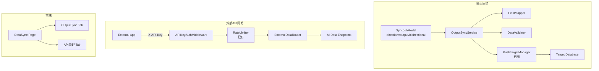

# 设计文档：双向同步与外部 API 访问

## 概述

在现有同步引擎（`src/sync/`）基础上扩展两项能力：

1. **输出同步**：复用 `src/sync/push/` 推送基础设施，扩展 `SyncJobModel` 支持输出/双向方向，新增 `OutputSyncService` 处理字段映射、格式验证和断点续传
2. **外部 API 网关**：扩展 `src/sync/gateway/` 的认证和限流机制，新增 API 密钥管理模型和 REST 数据读取端点

设计原则：最小改动，复用现有组件（`SyncRateLimiter`、`SyncAuthHandler`、`PushTargetManager`），保持架构一致性。

## 架构

## 组件与接口

### 后端组件

**OutputSyncService** (`src/sync/push/output_sync_service.py`)
- `execute_output_sync(job_id) -> SyncResult`：执行输出同步，支持全量/增量
- `validate_output_data(data, mapping) -> ValidationResult`：写入前格式验证
- `resume_from_checkpoint(job_id) -> SyncResult`：断点续传
- 复用 `IncrementalPushService` 的推送和重试逻辑

**FieldMapper** (`src/sync/transformer/field_mapper.py`)
- `apply_mapping(data, rules) -> MappedData`：字段名映射 + 类型转换
- `validate_mapping(source_schema, target_schema, rules) -> List[Error]`

**APIKeyService** (`src/sync/gateway/api_key_service.py`)
- `create_key(config) -> APIKeyResponse`：生成密钥，仅返回一次完整值
- `revoke_key(key_id)`、`enable_key(key_id)`、`disable_key(key_id)`
- `validate_key(raw_key) -> APIKeyModel | None`：验证并检查权限范围
- 密钥存储：哈希后存储，前缀明文保存用于标识

**ExternalDataRouter** (`src/sync/gateway/external_data_router.py`)
- `GET /api/v1/external/annotations`：标注结果
- `GET /api/v1/external/augmented-data`：增强数据
- `GET /api/v1/external/quality-reports`：质量报告
- `GET /api/v1/external/experiments`：AI 试验结果
- 统一分页参数：`page`、`page_size`、`sort_by`、`fields`（字段筛选）

### 前端组件

**OutputSyncConfig** (`frontend/src/pages/DataSync/OutputSync/`)
- 同步方向选择器（输入/输出/双向）
- 目标数据源选择 + 字段映射配置界面
- 复用现有 `SyncTaskConfig` 的调度配置

**APIManagement** (`frontend/src/pages/DataSync/APIManagement/`)
- 密钥列表（创建、启用/禁用、吊销）
- 用量统计图表（Ant Design Charts）
- API 在线测试面板

## 数据模型

### 新增表

**api_keys**（API 密钥表）

| 字段 | 类型 | 说明 |
|------|------|------|
| id | UUID | 主键 |
| tenant_id | UUID | 租户隔离 |
| name | String(200) | 密钥名称 |
| description | Text | 描述 |
| key_prefix | String(16) | 密钥前缀（明文） |
| key_hash | String(128) | 密钥哈希（SHA-256） |
| scopes | JSONB | 可访问数据范围 |
| rate_limit_per_minute | Integer | 每分钟配额 |
| rate_limit_per_day | Integer | 每日配额 |
| status | Enum | active/disabled/revoked |
| expires_at | DateTime | 过期时间 |
| last_used_at | DateTime | 最近调用时间 |
| total_calls | BigInteger | 累计调用次数 |
| created_at | DateTime | 创建时间 |

**api_call_logs**（API 调用日志表）

| 字段 | 类型 | 说明 |
|------|------|------|
| id | UUID | 主键 |
| key_id | UUID | FK → api_keys |
| endpoint | String(200) | 请求端点 |
| status_code | Integer | 响应状态码 |
| response_time_ms | Float | 响应耗时 |
| called_at | DateTime | 调用时间 |

### 扩展现有表

**sync_jobs（SyncJobModel）**：新增字段
- `target_source_id: UUID FK`：输出目标数据源
- `field_mapping_rules: JSONB`：字段映射规则
- `output_sync_strategy: String`：full/incremental
- `output_checkpoint: JSONB`：输出断点信息

**sync_history（SyncExecutionModel）**：新增字段
- `sync_direction: String`：本次执行的同步方向
- `rows_written: Integer`：写入目标的行数
- `write_errors: JSONB`：写入错误详情

## 正确性属性

*属性是系统在所有有效执行中都应保持为真的特征或行为——本质上是关于系统应该做什么的形式化陈述。属性是人类可读规范与机器可验证正确性保证之间的桥梁。*

### Property 1: 字段映射往返一致性

*For any* 有效的字段映射规则和输入数据记录，对数据应用正向映射后再应用逆向映射，应得到与原始数据等价的结果（字段名和类型均还原）。

**Validates: Requirements 1.3**

### Property 2: 输出/双向任务配置不变量

*For any* 同步任务，若方向为输出则 target_source_id 必须非空；若方向为双向则输入和输出的字段映射规则必须同时存在且相互独立。

**Validates: Requirements 1.2, 1.4**

### Property 3: 连接失败错误信息完整性

*For any* 无效的目标数据源连接配置，执行连接测试应返回包含错误消息和排查建议两个字段的错误响应。

**Validates: Requirements 1.5**

### Property 4: 增量同步仅含新记录

*For any* 增量输出同步执行，同步的记录集应仅包含 checkpoint 之后变更的记录，且记录数不超过源数据中变更记录的总数。

**Validates: Requirements 2.2**

### Property 5: 写入前数据验证拦截

*For any* 数据批次和目标 schema，若数据中存在类型不匹配的字段，验证步骤应拒绝该批次并返回具体的字段级错误信息。

**Validates: Requirements 2.3**

### Property 6: 断点续传完整性

*For any* 中途失败的输出同步任务，恢复执行后处理的总记录数（失败前已处理 + 恢复后处理）应等于数据集总记录数。

**Validates: Requirements 2.4**

### Property 7: 执行历史记录完整性

*For any* 已完成的输出同步执行，历史记录必须包含 rows_written、duration_ms、status 和 error_details 字段。

**Validates: Requirements 2.5, 3.3**

### Property 8: 失败率告警触发

*For any* 同步任务，当 failed_executions / total_executions 超过配置阈值时，系统应触发告警通知。

**Validates: Requirements 3.2**

### Property 9: API 密钥创建仅一次可见

*For any* 新创建的 API 密钥，创建响应应包含完整的 raw_key 字段；后续的查询/列表响应应仅包含 key_prefix，不包含完整密钥。

**Validates: Requirements 4.2**

### Property 10: API 密钥状态机正确性

*For any* API 密钥，状态转换应遵循：active↔disabled 可双向切换，active/disabled→revoked 为单向终态，revoked 状态不可恢复。

**Validates: Requirements 4.4**

### Property 11: 过期/吊销密钥拒绝访问

*For any* 已过期或已吊销的 API 密钥，使用该密钥的所有 API 请求应返回 401 状态码。

**Validates: Requirements 4.6**

### Property 12: API 密钥调用计数递增

*For any* 有效 API 密钥的成功调用，密钥的 total_calls 应递增 1，且 last_used_at 应更新为当前时间。

**Validates: Requirements 4.5**

### Property 13: API 认证强制执行

*For any* 不携带 X-API-Key 请求头的外部 API 请求，系统应返回 401 状态码。

**Validates: Requirements 5.2**

### Property 14: API 响应分页正确性

*For any* 带有 page 和 page_size 参数的 API 请求，响应应为 JSON 格式，包含 total、page、page_size、items 字段，且 items 长度不超过 page_size。

**Validates: Requirements 5.3, 5.4**

### Property 15: 权限范围强制执行

*For any* 具有限定 scopes 的 API 密钥，请求超出其 scopes 的数据端点应返回 403 状态码。

**Validates: Requirements 5.5**

### Property 16: 速率限制强制执行

*For any* 设置了速率限制的 API 密钥，在配额耗尽后的请求应返回 429 状态码，且响应包含 Retry-After 头。

**Validates: Requirements 6.1, 6.2**

### Property 17: API 调用日志完整性

*For any* 外部 API 调用，系统应创建包含 key_id、endpoint、status_code、response_time_ms、called_at 的日志记录。

**Validates: Requirements 6.3**

## 错误处理

| 场景 | 处理策略 |
|------|----------|
| 目标数据库连接失败 | 返回错误详情 + 排查建议，自动暂停任务 |
| 输出同步写入失败 | 记录失败行，保存 checkpoint，支持断点续传 |
| 字段映射类型不匹配 | 写入前验证拦截，返回字段级错误 |
| API 密钥无效/过期 | 返回 401，记录拒绝日志 |
| 权限不足 | 返回 403 + 权限说明 |
| 速率超限 | 返回 429 + Retry-After 头 |
| 同步任务失败率超阈值 | 触发告警通知管理员 |

## 测试策略

**属性测试**：使用 `hypothesis`（Python）库，每个属性至少 100 次迭代
- 每个 Property 对应一个属性测试，注释格式：`# Feature: bidirectional-sync-and-external-api, Property N: {title}`
- 重点覆盖：字段映射往返、分页正确性、密钥状态机、权限/速率限制

**单元测试**：使用 `pytest`，覆盖具体示例和边界情况
- API 端点存在性验证（需求 5.1）
- 空数据集输出同步
- 密钥创建参数校验
- RBAC 权限过滤（需求 7.4）

**集成测试**：
- 输出同步端到端流程（创建任务→执行→验证目标数据）
- API 密钥全生命周期（创建→使用→禁用→吊销）
