# Design Document: Comprehensive E2E Testing

## Overview

This design extends the existing SuperInsight E2E test infrastructure (35+ Playwright spec files, `fixtures.ts`, `test-helpers.ts`) to achieve comprehensive coverage across all 16 requirement areas. The approach builds on the established patterns — localStorage-based auth mocking, Playwright route interception for API simulation, and Ant Design-aware selectors — while adding structured role-based test matrices, data lifecycle flow orchestration, security vulnerability scanning, performance benchmarking with Web Vitals, and deployment health checks.

The design prioritizes incremental additions over rewrites (per the 85% progress constraint). New test files follow the existing `frontend/e2e/*.spec.ts` convention and import from the shared `fixtures.ts` and `test-helpers.ts` modules. Property-based tests for backend logic use Hypothesis (Python) and fast-check (TypeScript/Vitest) to validate invariants that E2E tests alone cannot efficiently cover.

### Key Design Decisions

1. **Mock-first E2E strategy**: All frontend E2E tests use Playwright route interception (`page.route()`) to mock backend APIs. This isolates frontend behavior from backend state and enables deterministic, parallelizable tests.
2. **Role matrix via parameterized fixtures**: Rather than duplicating test logic per role, a parameterized `roleFixture` generates authenticated pages for each of the 4 roles (`admin`, `data_manager`, `data_analyst`, `annotator`) with correct permissions.
3. **Existing infrastructure reuse**: The `setupAuth()`, `mockApiResponses()`, `measurePerformance()`, `testAccessibility()`, and `simulateNetworkConditions()` helpers from `test-helpers.ts` are extended, not replaced.
4. **Deployment tests as a separate Playwright project**: Infrastructure health checks run against real services (not mocked) using a dedicated Playwright config project with longer timeouts and no auth setup.

## Architecture

### Test Organization

```
frontend/e2e/
├── fixtures.ts                    # Extended: role-parameterized fixtures
├── test-helpers.ts                # Extended: new mock factories, assertion helpers
├── helpers/
│   ├── mock-api-factory.ts        # Centralized mock API response generators
│   ├── role-permissions.ts        # Role → permission mapping + route access matrix
│   └── form-interaction.ts        # Generic form fill/validate/submit helpers
├── role-workflows/
│   ├── admin-workflow.spec.ts     # Admin full workflow E2E
│   ├── data-manager-workflow.spec.ts
│   ├── data-analyst-workflow.spec.ts
│   └── annotator-workflow.spec.ts
├── data-lifecycle/
│   ├── acquisition-to-export.spec.ts  # Full pipeline E2E
│   └── data-count-consistency.spec.ts
├── interactions/
│   ├── button-interactions.spec.ts
│   ├── form-validation.spec.ts
│   ├── table-operations.spec.ts
│   └── modal-crud.spec.ts
├── admin-modules/
│   ├── admin-console.spec.ts
│   ├── admin-tenants.spec.ts
│   ├── admin-users.spec.ts
│   ├── admin-permissions.spec.ts
│   ├── admin-quotas.spec.ts
│   ├── admin-billing.spec.ts
│   └── admin-config.spec.ts
├── ai-integration/
│   ├── ai-annotation.spec.ts
│   ├── ai-processing.spec.ts
│   └── ai-assistant.spec.ts
├── datasync/
│   ├── sources-crud.spec.ts
│   ├── scheduler.spec.ts
│   ├── datalake-browser.spec.ts
│   └── export-flow.spec.ts
├── i18n/
│   └── language-completeness.spec.ts
├── error-handling/
│   └── error-scenarios.spec.ts
├── deployment/
│   └── health-checks.spec.ts
├── auth.spec.ts                   # Existing (enhanced)
├── security.spec.ts               # Existing (enhanced)
├── performance.spec.ts            # Existing (enhanced)
├── permissions.spec.ts            # Existing (enhanced)
├── responsive-design.spec.ts      # Existing (enhanced)
└── ...                            # Other existing specs unchanged
```

### Architecture Diagram

```mermaid
graph TB
    subgraph "Test Runner (Playwright)"
        PW[playwright.config.ts]
        PW --> P1[chromium]
        PW --> P2[firefox]
        PW --> P3[webkit]
        PW --> P4[Mobile Chrome]
        PW --> P5[Mobile Safari]
        PW --> P6[deployment - no mock]
    end

    subgraph "Shared Infrastructure"
        FIX[fixtures.ts<br/>roleFixture, consoleLogs, screenshot]
        TH[test-helpers.ts<br/>setupAuth, mockApi, perf, a11y]
        MAF[mock-api-factory.ts<br/>typed response generators]
        RP[role-permissions.ts<br/>role→routes matrix]
        FI[form-interaction.ts<br/>fill, validate, submit]
    end

    subgraph "Test Suites"
        RW[Role Workflows<br/>4 roles × full pipeline]
        DL[Data Lifecycle<br/>acquisition→export]
        INT[Interactions<br/>buttons, forms, tables]
        ADM[Admin Modules<br/>10 sub-pages]
        SEC[Security<br/>XSS, CSRF, injection]
        PERF[Performance<br/>Web Vitals, memory]
        I18N[i18n<br/>zh/en completeness]
        ERR[Error Handling<br/>4xx, 5xx, offline]
        A11Y[Accessibility<br/>keyboard, ARIA, contrast]
        RESP[Responsive<br/>375/768/1280]
        AI[AI Integration<br/>annotation, processing]
        DS[DataSync/Datalake<br/>sources, schema, export]
        DEP[Deployment<br/>health checks]
    end

    FIX --> RW
    FIX --> DL
    TH --> INT
    MAF --> RW
    MAF --> DL
    RP --> RW
    FI --> INT
    FI --> ADM

    subgraph "Frontend App (localhost:3000)"
        APP[React 19 + Vite 7]
        APP --> AUTH[Auth Store<br/>Zustand + localStorage]
        APP --> ROUTER[React Router<br/>ProtectedRoute]
        APP --> ANTD[Ant Design 5+]
    end

    P1 --> APP
    P6 -->|real HTTP| BACKEND[Backend Services]
```



## Components and Interfaces

### 1. Role Permissions Matrix (`helpers/role-permissions.ts`)

Defines the authoritative mapping of roles to accessible routes and denied routes, used by parameterized role workflow tests.

```typescript
export interface RoleConfig {
  role: string
  permissions: string[]
  accessibleRoutes: string[]
  deniedRoutes: string[]
  tenantId: string
}

export const ROLE_CONFIGS: Record<string, RoleConfig> = {
  admin: {
    role: 'admin',
    permissions: ['read:all', 'write:all', 'manage:all'],
    accessibleRoutes: [
      '/dashboard', '/tasks', '/quality', '/security', '/admin',
      '/data-sync', '/augmentation', '/license', '/data-lifecycle',
      '/billing', '/settings', '/ai-annotation', '/ai-assistant',
    ],
    deniedRoutes: [],
    tenantId: 'tenant-1',
  },
  data_manager: {
    role: 'data_manager',
    permissions: ['read:data', 'write:data', 'manage:sync', 'read:tasks', 'write:tasks'],
    accessibleRoutes: [
      '/dashboard', '/data-sync', '/data-lifecycle', '/augmentation', '/tasks',
    ],
    deniedRoutes: ['/admin', '/security/rbac', '/billing'],
    tenantId: 'tenant-1',
  },
  data_analyst: {
    role: 'data_analyst',
    permissions: ['read:dashboard', 'read:quality', 'read:billing', 'read:license'],
    accessibleRoutes: [
      '/dashboard', '/quality/reports', '/billing/overview', '/license/usage',
    ],
    deniedRoutes: ['/admin', '/data-sync/sources', '/tasks'],
    tenantId: 'tenant-1',
  },
  annotator: {
    role: 'annotator',
    permissions: ['read:tasks', 'write:annotations'],
    accessibleRoutes: ['/tasks', '/tasks/1/annotate'],
    deniedRoutes: [
      '/admin', '/quality/rules', '/security', '/data-sync', '/billing',
    ],
    tenantId: 'tenant-1',
  },
}
```

### 2. Mock API Factory (`helpers/mock-api-factory.ts`)

Centralized, typed mock response generators that ensure schema consistency across all test files.

```typescript
export interface MockOptions {
  count?: number
  status?: string
  tenantId?: string
  delay?: number
}

export function mockTasksApi(page: Page, options?: MockOptions): Promise<void>
export function mockBillingApi(page: Page, options?: MockOptions): Promise<void>
export function mockDashboardApi(page: Page): Promise<void>
export function mockDataSyncApi(page: Page, options?: MockOptions): Promise<void>
export function mockQualityApi(page: Page): Promise<void>
export function mockAdminApi(page: Page): Promise<void>
export function mockAIApi(page: Page): Promise<void>
export function mockAllApis(page: Page, options?: MockOptions): Promise<void>
```

### 3. Form Interaction Helpers (`helpers/form-interaction.ts`)

Generic utilities for testing Ant Design form components.

```typescript
export async function fillAntForm(page: Page, fields: FormField[]): Promise<void>
export async function submitAntForm(page: Page, buttonText?: RegExp): Promise<void>
export async function verifyFormValidation(page: Page, expectedErrors: number): Promise<void>
export async function fillAndSubmitModal(page: Page, fields: FormField[], triggerSelector: string): Promise<boolean>
export async function verifyTablePagination(page: Page, expectedPageSize: number): Promise<void>
export async function verifyTableSort(page: Page, columnHeader: string): Promise<void>
export async function verifyDropdownSelect(page: Page, selector: string, optionText: string): Promise<void>
```

### 4. Extended Fixtures (`fixtures.ts` additions)

```typescript
// New fixture: authenticated page parameterized by role
export interface RoleTestFixtures {
  rolePage: Page  // Page authenticated as the current test role
  roleConfig: RoleConfig
}

// Usage: test.describe for each role
// test('admin workflow', async ({ rolePage, roleConfig }) => { ... })
```

### 5. Deployment Health Check Client (`deployment/health-checks.spec.ts`)

Runs against real services (no mocking). Uses a separate Playwright project with `baseURL` pointing to the deployed backend.

```typescript
// Checks: frontend HTTP 200, backend /health, PostgreSQL ping,
// Redis PING, Neo4j Cypher query, env var validation, service restart recovery
```

### 6. Playwright Config Extension

Add a `deployment` project to `playwright.config.ts`:

```typescript
{
  name: 'deployment',
  testDir: './e2e/deployment',
  use: {
    baseURL: process.env.DEPLOY_URL || 'http://localhost:8000',
  },
  timeout: 120000,
}
```

## Data Models

### Mock Data Schemas

All mock API responses follow the actual backend response schemas. Key models:

```typescript
// Task
interface MockTask {
  id: string
  name: string
  status: 'pending' | 'in_progress' | 'completed' | 'cancelled'
  assignee: string
  progress: number
  tenant_id: string
  createdAt: string
  updatedAt: string
}

// Billing Record
interface MockBillingRecord {
  id: string
  period: string       // YYYY-MM
  amount: number
  status: 'pending' | 'paid' | 'overdue'
  tenant_id: string
}

// Data Source
interface MockDataSource {
  id: string
  name: string
  type: 'postgresql' | 'mysql' | 'mongodb' | 'api'
  status: 'connected' | 'disconnected' | 'error'
  lastSyncAt: string
  rowCount: number
}

// Quality Metric
interface MockQualityMetric {
  totalAnnotations: number
  qualityScore: number    // 0.0 - 1.0
  passRate: number        // 0.0 - 1.0
  issueCount: number
}

// User (for admin management)
interface MockUser {
  id: string
  username: string
  email: string
  role: 'admin' | 'data_manager' | 'data_analyst' | 'annotator'
  is_active: boolean
  tenant_id: string
}

// Annotation
interface MockAnnotation {
  id: string
  taskId: string
  data: Record<string, unknown>
  status: 'draft' | 'submitted' | 'reviewed'
  annotatorId: string
  createdAt: string
}
```

### Role-Permission Matrix Data

```typescript
// Route access expectations per role (used in parameterized tests)
interface RouteAccessExpectation {
  route: string
  admin: 'allow' | 'deny'
  data_manager: 'allow' | 'deny'
  data_analyst: 'allow' | 'deny'
  annotator: 'allow' | 'deny'
}
```

### Performance Thresholds

```typescript
interface PerformanceThresholds {
  loginPageLoad: 2000       // ms
  dashboardPageLoad: 3000   // ms
  genericPageLoad: 5000     // ms
  lcp: 2500                 // ms
  fcp: 1800                 // ms
  cls: 0.1                  // score
  ttfb: 600                 // ms
  tableRender1000Rows: 3000 // ms
  memoryGrowth5Pages: 200   // percent
  memoryGrowthModalRepeat: 50 // percent
}
```


## Correctness Properties

*A property is a characteristic or behavior that should hold true across all valid executions of a system — essentially, a formal statement about what the system should do. Properties serve as the bridge between human-readable specifications and machine-verifiable correctness guarantees.*

### Property 1: Role-Route Access Matrix

*For any* role in {admin, data_manager, data_analyst, annotator} and *for any* route in the application, when that role navigates to that route, the access result (page renders vs redirect to 403/dashboard) must match the predefined role-permission matrix.

**Validates: Requirements 1.1, 1.2, 1.3, 1.4, 1.6, 5.5**

### Property 2: Empty Required Fields Trigger Validation

*For any* form with required fields in the application, submitting the form with all required fields empty shall cause Ant Design validation error messages (`.ant-form-item-explain-error`) to appear for each required field, and the form shall not be submitted.

**Validates: Requirements 2.3**

### Property 3: Invalid Constrained Input Triggers Field-Level Errors

*For any* form field with input constraints (email format, password strength, numeric range), submitting an invalid value shall produce a field-level validation error message, and the form shall not be submitted.

**Validates: Requirements 2.4**

### Property 4: Modal Lifecycle Correctness

*For any* modal triggered by a create or edit button, the modal shall render with the expected form fields, accept valid input, and close when the cancel button is clicked or when submission succeeds.

**Validates: Requirements 2.5**

### Property 5: Delete Confirmation Flow

*For any* deletable item in a list/table, clicking the delete button shall display a confirmation dialog, and confirming the deletion shall remove the item from the displayed list.

**Validates: Requirements 2.6**

### Property 6: Table Pagination Consistency

*For any* paginated table, navigating to page N shall display rows only for that page, and the visible row count shall not exceed the selected page size.

**Validates: Requirements 2.7**

### Property 7: Table Sort and Filter Correctness

*For any* sortable table column, toggling the sort shall reorder the visible rows in ascending or descending order. *For any* filterable column, applying a filter shall reduce the visible rows to only those matching the filter criteria.

**Validates: Requirements 2.8**

### Property 8: Dropdown Select Round-Trip

*For any* dropdown/select component, opening the dropdown, selecting an option, and closing it shall result in the selected value being displayed in the select trigger element.

**Validates: Requirements 2.9**

### Property 9: File Upload Type Validation

*For any* file upload component, uploading a file with a valid type shall be accepted, and uploading a file with an invalid or dangerous type (.exe, .php, .sh) shall be rejected with a validation error message.

**Validates: Requirements 2.10, 5.9**

### Property 10: Data Lifecycle Count Invariant

*For any* dataset flowing through the data lifecycle pipeline, the record count at acquisition shall equal the annotation task item count, which shall equal the export record count (assuming no explicit filtering or deletion steps).

**Validates: Requirements 3.6**

### Property 11: Post-Logout Protected Route Redirect

*For any* protected route, after the user logs out (Auth_Store cleared), navigating to that route shall redirect to the login page.

**Validates: Requirements 4.5**

### Property 12: Tenant Switch Context Update

*For any* tenant switch operation, the Auth_Store `currentTenant` shall update to the new tenant, and all subsequently displayed data (Dashboard, Tasks, Billing) shall belong exclusively to the new tenant.

**Validates: Requirements 4.7, 7.2**

### Property 13: XSS Input Sanitization

*For any* text input field in the application, entering a string containing `<script>`, `onerror=`, `javascript:`, or other XSS vectors shall result in the content being sanitized in the rendered DOM — the script shall not execute and the raw HTML tags shall not appear unescaped.

**Validates: Requirements 5.1**

### Property 14: Malicious API Response Escaping

*For any* API response containing HTML tags, script tags, or event handler attributes, the rendered DOM shall escape or strip the malicious content rather than executing it.

**Validates: Requirements 5.2**

### Property 15: SQL Injection Input Escaping

*For any* search or filter input, entering SQL injection payloads (e.g., `'; DROP TABLE --`, `1 OR 1=1`) shall result in the payload being treated as literal text — no unexpected query behavior or error responses indicating raw SQL execution.

**Validates: Requirements 5.4**

### Property 16: Tenant Data Isolation

*For any* authenticated user in tenant A, no UI element, table row, or API response visible in the browser shall contain data with a `tenant_id` belonging to tenant B, even if the user manipulates URL parameters or request headers.

**Validates: Requirements 7.1, 5.6, 7.5**

### Property 17: Password Field Security Attributes

*For any* password input field in the application, the field shall have `type="password"` (masking input), and shall not expose the password value in the DOM after navigation away from the page.

**Validates: Requirements 5.8**

### Property 18: API Error Response Safety

*For any* API error response (4xx or 5xx), the response body shall not contain stack traces, internal file paths, database table/column names, or framework-specific debug information.

**Validates: Requirements 5.10**

### Property 19: Page Load Time Threshold

*For any* Page_Module in the application, the initial page load (from navigation start to `networkidle`) shall complete within 5000 milliseconds.

**Validates: Requirements 6.3**

### Property 20: Language Switch Text Update

*For any* page and *for any* language switch direction (zh→en or en→zh), after switching, all visible text elements shall be in the target language, and no page reload shall occur.

**Validates: Requirements 8.1, 8.2**

### Property 21: No Raw Translation Keys Displayed

*For any* page in *any* language setting, no visible text element shall match the raw translation key pattern `[a-z]+\.[a-z]+\.[a-z]+` (e.g., `common.button.submit`).

**Validates: Requirements 8.3**

### Property 22: Language Preference Persistence

*For any* selected language, after navigating to a different page and performing a browser refresh, the language setting shall remain the same as the previously selected language.

**Validates: Requirements 8.4**

### Property 23: Validation Messages in Active Language

*For any* form validation error triggered while a specific language is active, the error message text shall be in that active language (Chinese characters for zh, Latin characters for en).

**Validates: Requirements 8.5**

### Property 24: API 500 Graceful Degradation

*For any* page where the primary API returns a 500 status, the application shall display a user-friendly error message or error component, and the page shall not be blank (the `#root` container shall have visible child content).

**Validates: Requirements 9.1**

### Property 25: Form Data Preservation on Network Error

*For any* form with filled-in data, if form submission fails due to a network error, the form field values shall remain populated (not cleared), allowing the user to retry.

**Validates: Requirements 9.5**

### Property 26: Empty State Display

*For any* data-driven page (Tasks, Billing, Quality, DataSync) when the API returns an empty dataset, the page shall display an empty state component (`.ant-empty` or equivalent) with a descriptive message, not a blank area.

**Validates: Requirements 9.8**

### Property 27: Tab Focus Order

*For any* page, pressing Tab repeatedly shall move focus through interactive elements (inputs, buttons, links) in a logical DOM order without skipping or getting stuck.

**Validates: Requirements 10.1**

### Property 28: Visible Focus Indicators

*For any* interactive element that receives keyboard focus, the element shall display a visible focus indicator (non-zero `outline-width`, non-`none` `outline`, or non-`none` `box-shadow`).

**Validates: Requirements 10.2**

### Property 29: Modal Focus Trap and Restore

*For any* open modal dialog, Tab navigation shall cycle only through elements within the modal. When the modal closes, focus shall return to the element that triggered the modal.

**Validates: Requirements 10.3**

### Property 30: Form Input Label Association

*For any* form input element (`input`, `select`, `textarea`), the element shall have either an associated `<label>` element (via `for`/`id` or wrapping), an `aria-label` attribute, or an `aria-labelledby` attribute.

**Validates: Requirements 10.4**

### Property 31: Escape Key Closes Overlays

*For any* open overlay (modal, dropdown menu, popover), pressing the Escape key shall close the overlay.

**Validates: Requirements 10.5**

### Property 32: No Horizontal Overflow Across Viewports

*For any* page at viewport widths of 375px, 768px, and 1280px, the `document.documentElement.scrollWidth` shall not exceed `document.documentElement.clientWidth` (no horizontal scrollbar).

**Validates: Requirements 11.1**

### Property 33: Touch Target Minimum Size

*For any* interactive element (button, link, input) on a mobile viewport (375px), the element's bounding box shall be at least 44×44 CSS pixels.

**Validates: Requirements 11.4, 11.5**

### Property 34: Auth Fixture Role Correctness

*For any* role passed to the `setupAuth` helper, the resulting `auth-storage` in localStorage shall contain a user object with the correct role, matching permissions array, and `isAuthenticated: true`.

**Validates: Requirements 16.1**

### Property 35: Mock API Schema Validity

*For any* endpoint handled by the mock API factory, the response body shall be valid JSON, contain the expected top-level fields (`data`, `total` for list endpoints; specific fields for detail endpoints), and use correct data types.

**Validates: Requirements 16.2**

### Property 36: Console Error Filtering

*For any* console error message matching the known-issues exclusion list (`Failed to fetch`, `Network request failed`, `DEPRECATION WARNING`, `React does not recognize`, `Warning:`), the `filterConsoleErrors` function shall exclude it from the filtered output.

**Validates: Requirements 16.4**


## Error Handling

### E2E Test Error Handling Strategy

1. **Graceful selector fallbacks**: All tests use the existing `safeClick()` and `elementExists()` helpers from `test-helpers.ts` to handle elements that may not render in the mock environment. Tests should not fail due to missing non-critical UI elements.

2. **Timeout management**: 
   - Action timeout: 10s (from playwright.config.ts)
   - Navigation timeout: 30s
   - Global test timeout: 60s
   - Deployment health checks: 120s
   - Use `waitForPageReady()` helper which falls back from `networkidle` to `domcontentloaded`

3. **Network error simulation**: Tests that simulate network failures (`simulateNetworkConditions('offline')`) must restore network state in `afterEach` to prevent cascading failures.

4. **Mock API error responses**: The mock API factory provides error response generators for each HTTP status code (400, 401, 403, 404, 429, 500). Tests verify the frontend handles each error code with appropriate UI feedback.

5. **Console error collection**: The `collectConsoleLogs` fixture captures console errors during each test. The `filterConsoleErrors` function excludes known test-environment noise. Critical unexpected errors are reported in test output.

6. **Screenshot on failure**: Playwright captures screenshots automatically on test failure (configured in `playwright.config.ts`). The `takeScreenshot` fixture allows manual capture at specific test points.

7. **Retry strategy**: CI runs retry failed tests up to 2 times (`retries: process.env.CI ? 2 : 0`). Flaky tests due to timing should use explicit waits rather than `waitForTimeout`.

### Error Categories and Handling

| Error Category | Test Behavior | Recovery |
|---|---|---|
| Element not found | `safeClick` returns false, test logs warning | Skip interaction, continue test |
| API mock mismatch | Route handler returns 404 | Test asserts error UI is shown |
| Auth state invalid | `setupAuth` fails silently | Test redirects to login (expected for some tests) |
| Performance threshold exceeded | `expect(loadTime).toBeLessThan(X)` fails | Test fails with measured value in output |
| Accessibility violation | Property assertion fails | Test fails with specific element details |
| Deployment service down | Health check HTTP fails | Test fails with service name and error |

## Testing Strategy

### Dual Testing Approach

This feature requires both unit/property-based tests and E2E tests working together:

- **E2E tests (Playwright)**: Validate user-facing workflows, UI interactions, visual rendering, responsive behavior, and integration between frontend components. These are the primary deliverable of this spec.
- **Property-based tests**: Validate universal invariants that hold across many inputs — role-permission correctness, input sanitization, data schema validity, i18n completeness. These complement E2E tests by covering input spaces that manual example selection cannot.
- **Unit tests (Vitest)**: Validate specific examples, edge cases, and error conditions for helper functions, mock factories, and utility modules.

### Property-Based Testing Configuration

- **Frontend (TypeScript)**: Use `fast-check` library with Vitest for property tests on helper functions, mock factories, and permission logic.
- **Backend (Python)**: Use `Hypothesis` library with pytest for property tests on API response schemas, permission enforcement, and data validation.
- **Minimum iterations**: 100 per property test.
- **Each property test must reference its design document property** with a tag comment:
  ```
  // Feature: comprehensive-e2e-testing, Property 1: Role-Route Access Matrix
  ```

### Test Distribution

| Category | Test Type | Framework | Count (est.) |
|---|---|---|---|
| Role workflows (Req 1) | E2E | Playwright | 4 spec files, ~24 tests |
| Button/form interactions (Req 2) | E2E | Playwright | 4 spec files, ~40 tests |
| Data lifecycle (Req 3) | E2E | Playwright | 2 spec files, ~12 tests |
| Auth/session (Req 4) | E2E | Playwright | Enhanced existing, ~8 new tests |
| Security (Req 5) | E2E + Property | Playwright + fast-check | Enhanced existing + 5 property tests |
| Performance (Req 6) | E2E | Playwright | Enhanced existing, ~6 new tests |
| Multi-tenant (Req 7) | E2E + Property | Playwright + fast-check | Enhanced existing + 2 property tests |
| i18n (Req 8) | E2E + Property | Playwright + fast-check | 1 spec file + 4 property tests |
| Error handling (Req 9) | E2E | Playwright | 1 spec file, ~8 tests |
| Accessibility (Req 10) | E2E | Playwright | Enhanced existing, ~10 new tests |
| Responsive (Req 11) | E2E | Playwright | Enhanced existing, ~8 new tests |
| Admin modules (Req 12) | E2E | Playwright | 7 spec files, ~30 tests |
| Deployment (Req 13) | E2E (no mock) | Playwright | 1 spec file, ~8 tests |
| DataSync/Datalake (Req 14) | E2E | Playwright | 4 spec files, ~14 tests |
| AI integration (Req 15) | E2E | Playwright | 3 spec files, ~10 tests |
| Test infrastructure (Req 16) | Unit + Property | Vitest + fast-check | 1 test file, ~10 tests |

### Property-Based Test Implementation Plan

Each correctness property from the design maps to a single property-based test:

| Property | Test File | Library | Notes |
|---|---|---|---|
| P1: Role-Route Access | `frontend/src/__tests__/role-permissions.property.test.ts` | fast-check | Enumerate roles × routes |
| P13: XSS Sanitization | `frontend/src/__tests__/xss-sanitization.property.test.ts` | fast-check | Generate random XSS payloads |
| P15: SQL Injection | `frontend/src/__tests__/sql-injection.property.test.ts` | fast-check | Generate random SQL payloads |
| P16: Tenant Isolation | `frontend/src/__tests__/tenant-isolation.property.test.ts` | fast-check | Generate random tenant pairs |
| P21: No Raw Keys | `frontend/src/__tests__/i18n-keys.property.test.ts` | fast-check | Generate random page paths |
| P34: Auth Fixture | `frontend/src/__tests__/auth-fixture.property.test.ts` | fast-check | Enumerate roles |
| P35: Mock Schema | `frontend/src/__tests__/mock-schema.property.test.ts` | fast-check | Enumerate endpoints |
| P36: Console Filter | `frontend/src/__tests__/console-filter.property.test.ts` | fast-check | Generate random error strings |
| P18: API Error Safety | `tests/test_security/test_error_response.py` | Hypothesis | Generate random error payloads |

### E2E Test Execution

```bash
# Run all E2E tests (excluding deployment)
cd frontend && npx playwright test --ignore-pattern='**/deployment/**'

# Run specific requirement area
cd frontend && npx playwright test e2e/role-workflows/
cd frontend && npx playwright test e2e/interactions/
cd frontend && npx playwright test e2e/admin-modules/

# Run deployment health checks (requires running services)
cd frontend && npx playwright test e2e/deployment/ --project=deployment

# Run property-based tests
cd frontend && npx vitest --run src/__tests__/*.property.test.ts

# Run all with reporting
cd frontend && npx playwright test --reporter=html,json
```

### Integration with Existing Infrastructure

- **fixtures.ts**: Extended with `rolePage` fixture (parameterized by role). Existing `authenticatedPage`, `collectConsoleLogs`, `takeScreenshot` fixtures unchanged.
- **test-helpers.ts**: Extended with new mock factory imports and form interaction helpers. Existing `setupAuth`, `waitForPageReady`, `mockApiResponses`, `measurePerformance`, `testAccessibility`, `simulateNetworkConditions` functions unchanged.
- **playwright.config.ts**: Add `deployment` project. Existing browser projects (chromium, firefox, webkit, mobile) unchanged.
- **Existing spec files**: Enhanced in-place with additional test cases. No existing tests removed or rewritten.
