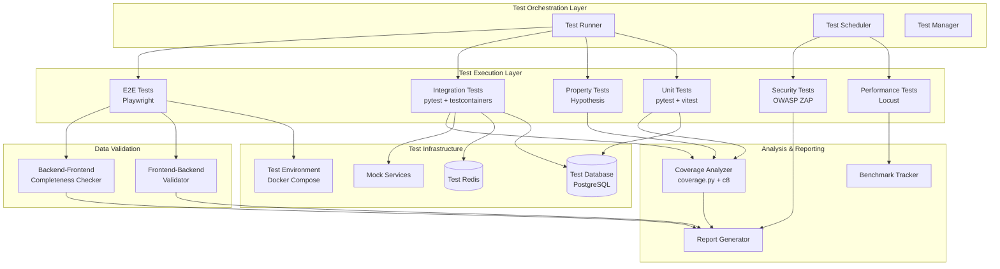

# Design Document: Comprehensive Testing and QA System

## Overview

This design document outlines the architecture and implementation strategy for a comprehensive testing and quality assurance system for the SuperInsight platform. The system provides multi-layered testing coverage including unit tests, property-based tests, integration tests, end-to-end tests, performance tests, and security tests.

The testing system is designed to:
- Validate individual components in isolation (unit tests)
- Verify universal properties across input ranges (property-based tests with Hypothesis)
- Ensure components work together correctly (integration tests)
- Validate complete user workflows (E2E tests with Playwright)
- Identify performance bottlenecks and security vulnerabilities
- Provide comprehensive coverage analysis and reporting
- Validate frontend-backend data flow completeness

The system integrates with CI/CD pipelines for automated test execution and provides detailed reporting for quality assessment.

## Architecture

### High-Level Architecture



### Component Responsibilities

**Test Orchestration Layer**:
- **Test Runner**: Executes tests based on triggers (commit, PR, schedule)
- **Test Scheduler**: Manages scheduled test execution (daily performance, weekly security)
- **Test Manager**: Coordinates test execution, manages test environments, collects results

**Test Execution Layer**:
- **Unit Tests**: Isolated component testing using pytest (backend) and vitest (frontend)
- **Property Tests**: Hypothesis-based property verification for parsers, serializers, invariants
- **Integration Tests**: Multi-component interaction testing with real databases
- **E2E Tests**: Complete workflow testing using Playwright
- **Performance Tests**: Load and stress testing using Locust
- **Security Tests**: Vulnerability scanning using OWASP ZAP and dependency scanners

**Test Infrastructure**:
- **Test Database**: Isolated PostgreSQL instance for test data
- **Test Redis**: Isolated Redis instance for cache testing
- **Test Environment**: Docker Compose orchestration for service dependencies
- **Mock Services**: Simulated external services for integration testing

**Analysis & Reporting**:
- **Coverage Analyzer**: Measures code coverage using coverage.py and c8
- **Report Generator**: Produces HTML and JSON test reports
- **Benchmark Tracker**: Stores and compares performance metrics over time

**Data Validation**:
- **Frontend-Backend Validator**: Verifies all frontend inputs persist to database
- **Backend-Frontend Completeness Checker**: Ensures all backend operations have UI support

### Design Decisions

1. **Multi-Layer Testing Strategy**: Implements testing pyramid with unit tests at base, integration in middle, E2E at top
2. **Property-Based Testing**: Uses Hypothesis for comprehensive input coverage and automatic shrinking
3. **Isolated Test Environments**: Each test category uses isolated databases and services to prevent interference
4. **Containerized Testing**: Uses Docker for consistent test environments across local and CI
5. **Parallel Execution**: Tests run in parallel where possible to minimize execution time
6. **Fail-Fast for Critical Tests**: Unit and integration tests fail immediately to provide quick feedback
7. **Scheduled Heavy Tests**: Performance and security tests run on schedule to avoid blocking development

## Components and Interfaces

### Test Runner Component

**Purpose**: Orchestrates test execution based on triggers and manages test lifecycle

**Interface**:
```python
class TestRunner:
    def run_unit_tests(self, module: str = None) -> TestResult
    def run_property_tests(self, module: str = None) -> TestResult
    def run_integration_tests(self, suite: str = None) -> TestResult
    def run_e2e_tests(self, workflow: str = None) -> TestResult
    def run_all_tests(self, categories: List[str]) -> TestReport
```

**Dependencies**: pytest, vitest, Playwright, test configuration

### Property Test Framework

**Purpose**: Provides Hypothesis-based property testing infrastructure

**Interface**:
```python
class PropertyTestFramework:
    def test_round_trip_property(self, serialize_fn, deserialize_fn, generator)
    def test_invariant_property(self, operation_fn, invariant_fn, generator)
    def test_idempotent_property(self, operation_fn, generator)
    def test_metamorphic_property(self, operation_fn, relation_fn, generator)
```

**Key Properties**:
- Minimum 100 iterations per test
- Automatic shrinking to minimal failing examples
- Configurable generators for domain-specific data

### Integration Test Manager

**Purpose**: Manages integration test execution with database and service dependencies

**Interface**:
```python
class IntegrationTestManager:
    def setup_test_database(self) -> DatabaseConnection
    def setup_test_redis(self) -> RedisConnection
    def setup_mock_services(self) -> MockServiceRegistry
    def cleanup_test_data(self)
    def run_with_isolation(self, test_fn: Callable) -> TestResult
```

**Isolation Strategy**:
- Transaction-based rollback for database tests
- Separate Redis keyspace for cache tests
- Mock external HTTP services

### E2E Test Framework

**Purpose**: Executes end-to-end tests using Playwright

**Interface**:
```typescript
class E2ETestFramework {
  async testAuthenticationWorkflow(): Promise<TestResult>
  async testDataAnnotationWorkflow(): Promise<TestResult>
  async testExportWorkflow(): Promise<TestResult>
  async captureScreenshotOnFailure(testName: string): Promise<void>
  async getBrowserLogs(): Promise<string[]>
}
```

**Configuration**:
- Headless mode by default
- Screenshot capture on failure
- Browser console log collection
- Configurable timeouts and retries

### Performance Test Suite

**Purpose**: Executes load and stress tests to identify bottlenecks

**Interface**:
```python
class PerformanceTestSuite:
    def run_load_test(self, concurrent_users: int, duration: int) -> PerformanceMetrics
    def run_stress_test(self, ramp_up_rate: int) -> PerformanceMetrics
    def measure_endpoint_latency(self, endpoint: str) -> LatencyMetrics
    def generate_performance_report(self) -> PerformanceReport
```

**Metrics Collected**:
- Response time percentiles (p50, p95, p99)
- Throughput (requests per second)
- Error rate
- Database query performance

### Security Test Scanner

**Purpose**: Identifies security vulnerabilities through automated scanning

**Interface**:
```python
class SecurityTestScanner:
    def scan_sql_injection(self) -> List[Vulnerability]
    def scan_xss(self) -> List[Vulnerability]
    def scan_auth_bypass(self) -> List[Vulnerability]
    def scan_dependencies(self) -> List[Vulnerability]
    def categorize_by_severity(self, vulnerabilities: List[Vulnerability]) -> Dict[str, List[Vulnerability]]
```

**Scanning Tools**:
- OWASP ZAP for web vulnerability scanning
- safety for Python dependency vulnerabilities
- npm audit for JavaScript dependency vulnerabilities

### Coverage Analyzer

**Purpose**: Measures and reports code coverage metrics

**Interface**:
```python
class CoverageAnalyzer:
    def measure_statement_coverage(self) -> float
    def measure_branch_coverage(self) -> float
    def measure_function_coverage(self) -> float
    def generate_html_report(self, output_dir: str)
    def identify_untested_paths(self) -> List[CodePath]
    def check_coverage_threshold(self, threshold: float) -> bool
```

**Coverage Tools**:
- coverage.py for Python backend
- c8 for TypeScript frontend
- Combined reporting for full-stack coverage

### Frontend-Backend Validator

**Purpose**: Verifies all frontend inputs successfully persist to database

**Interface**:
```python
class FrontendBackendValidator:
    def discover_input_forms(self) -> List[FormDefinition]
    def test_form_submission(self, form: FormDefinition) -> ValidationResult
    def verify_data_persistence(self, submitted_data: Dict, db_connection: DatabaseConnection) -> bool
    def compare_data_integrity(self, submitted: Dict, stored: Dict) -> IntegrityResult
    def generate_persistence_report(self) -> PersistenceReport
```

**Validation Process**:
1. Discover all frontend forms and input points
2. Generate test data for each form
3. Submit data through E2E test
4. Query database to verify persistence
5. Compare submitted vs stored data for integrity

### Backend-Frontend Completeness Checker

**Purpose**: Ensures all backend operations have corresponding frontend UI

**Interface**:
```python
class BackendFrontendCompletenessChecker:
    def discover_backend_endpoints(self) -> List[EndpointDefinition]
    def discover_frontend_components(self) -> List[ComponentDefinition]
    def map_endpoints_to_ui(self) -> Dict[EndpointDefinition, Optional[ComponentDefinition]]
    def identify_missing_ui(self) -> List[EndpointDefinition]
    def verify_crud_completeness(self) -> CRUDCompletenessReport
    def generate_completeness_report(self) -> CompletenessReport
```

**Mapping Strategy**:
- Parse OpenAPI spec for backend endpoints
- Analyze React components for API calls
- Match endpoints to UI components
- Identify gaps in UI coverage

### Test Data Factory

**Purpose**: Provides factory functions for creating test data

**Interface**:
```python
class TestDataFactory:
    def create_user(self, **overrides) -> User
    def create_task(self, **overrides) -> Task
    def create_annotation(self, **overrides) -> Annotation
    def create_dataset(self, **overrides) -> Dataset
    def create_with_relationships(self, entity_type: str, **overrides) -> Any
    def create_invalid_state(self, entity_type: str, error_type: str) -> Any
```

**Features**:
- Sensible defaults for all fields
- Override mechanism for specific test scenarios
- Relationship management (foreign keys, associations)
- Invalid state generation for error testing

### Report Generator

**Purpose**: Produces comprehensive test reports in multiple formats

**Interface**:
```python
class ReportGenerator:
    def generate_test_report(self, results: TestResults) -> TestReport
    def add_coverage_metrics(self, coverage: CoverageMetrics)
    def add_performance_metrics(self, performance: PerformanceMetrics)
    def add_security_findings(self, vulnerabilities: List[Vulnerability])
    def add_recommendations(self, recommendations: List[str])
    def export_html(self, output_path: str)
    def export_json(self, output_path: str)
```

**Report Contents**:
- Overall pass/fail status
- Test execution times by category
- Code coverage percentages by module
- Performance metrics with trends
- Security vulnerability summary
- Quality improvement recommendations

## Data Models

### TestResult

```python
@dataclass
class TestResult:
    test_name: str
    category: TestCategory  # unit, integration, e2e, performance, security
    status: TestStatus  # passed, failed, skipped, error
    duration: float  # seconds
    error_message: Optional[str]
    stack_trace: Optional[str]
    artifacts: List[str]  # screenshots, logs, etc.
    timestamp: datetime
```

### TestReport

```python
@dataclass
class TestReport:
    overall_status: TestStatus
    total_tests: int
    passed: int
    failed: int
    skipped: int
    execution_time: float
    coverage_metrics: CoverageMetrics
    performance_metrics: Optional[PerformanceMetrics]
    security_findings: List[Vulnerability]
    recommendations: List[str]
    generated_at: datetime
```

### CoverageMetrics

```python
@dataclass
class CoverageMetrics:
    statement_coverage: float  # percentage
    branch_coverage: float  # percentage
    function_coverage: float  # percentage
    line_coverage: float  # percentage
    untested_paths: List[CodePath]
    coverage_by_module: Dict[str, float]
```

### PerformanceMetrics

```python
@dataclass
class PerformanceMetrics:
    endpoint: str
    concurrent_users: int
    total_requests: int
    successful_requests: int
    failed_requests: int
    response_time_p50: float  # milliseconds
    response_time_p95: float  # milliseconds
    response_time_p99: float  # milliseconds
    throughput: float  # requests per second
    error_rate: float  # percentage
    timestamp: datetime
```

### Vulnerability

```python
@dataclass
class Vulnerability:
    vulnerability_id: str
    title: str
    description: str
    severity: Severity  # critical, high, medium, low
    category: VulnerabilityCategory  # sql_injection, xss, auth_bypass, etc.
    affected_component: str
    remediation: str
    cve_id: Optional[str]
    discovered_at: datetime
```

### FormDefinition

```python
@dataclass
class FormDefinition:
    form_id: str
    form_name: str
    route: str
    fields: List[FieldDefinition]
    submit_endpoint: str
    expected_table: str
```

### FieldDefinition

```python
@dataclass
class FieldDefinition:
    field_name: str
    field_type: FieldType  # text, number, date, file, select
    required: bool
    validation_rules: List[str]
    db_column: str
```

### EndpointDefinition

```python
@dataclass
class EndpointDefinition:
    endpoint_path: str
    http_method: str
    operation_id: str
    description: str
    parameters: List[ParameterDefinition]
    request_body: Optional[Dict]
    response_schema: Dict
```

### ComponentDefinition

```python
@dataclass
class ComponentDefinition:
    component_name: str
    component_path: str
    api_calls: List[str]  # endpoints called by this component
    route: Optional[str]  # frontend route
```

### PersistenceReport

```python
@dataclass
class PersistenceReport:
    total_forms: int
    tested_forms: int
    successful_persistence: int
    failed_persistence: int
    failures: List[PersistenceFailure]
    generated_at: datetime
```

### PersistenceFailure

```python
@dataclass
class PersistenceFailure:
    form_id: str
    field_name: str
    submitted_value: Any
    stored_value: Any
    error_message: str
```

### CompletenessReport

```python
@dataclass
class CompletenessReport:
    total_endpoints: int
    endpoints_with_ui: int
    endpoints_without_ui: int
    missing_ui_components: List[EndpointDefinition]
    crud_completeness: CRUDCompletenessReport
    generated_at: datetime
```

### CRUDCompletenessReport

```python
@dataclass
class CRUDCompletenessReport:
    create_operations: OperationCoverage
    read_operations: OperationCoverage
    update_operations: OperationCoverage
    delete_operations: OperationCoverage
```

### OperationCoverage

```python
@dataclass
class OperationCoverage:
    total: int
    with_ui: int
    without_ui: int
    missing: List[str]  # operation IDs
```


## Correctness Properties

*A property is a characteristic or behavior that should hold true across all valid executions of a system—essentially, a formal statement about what the system should do. Properties serve as the bridge between human-readable specifications and machine-verifiable correctness guarantees.*

### Property 1: Test Failure Error Details

*For any* test execution that results in a failure, the test result SHALL include both a complete error message and a full stack trace.

**Validates: Requirements 1.3, 9.1**

### Property 2: Unit Test Execution Time Constraint

*For any* unit test execution run, the total execution time SHALL be less than or equal to 5 minutes (300 seconds).

**Validates: Requirements 1.4**

### Property 3: Unit Test Coverage Threshold

*For any* unit test execution run, the measured code coverage percentage SHALL be greater than or equal to 80%.

**Validates: Requirements 1.5**

### Property 4: Serialization Round-Trip Property

*For any* valid data structure in the system, serializing it and then deserializing the result SHALL produce a value equivalent to the original data structure.

**Validates: Requirements 2.1**

### Property 5: Data Transformation Invariant Preservation

*For any* data transformation operation and its associated invariants, applying the transformation SHALL preserve all specified invariants.

**Validates: Requirements 2.2**

### Property 6: Idempotent Operation Property

*For any* operation marked as idempotent, applying the operation once SHALL produce the same result as applying it multiple times consecutively.

**Validates: Requirements 2.3**

### Property 7: Metamorphic Relationship Property

*For any* operation with defined metamorphic relationships, those relationships SHALL hold across all valid inputs.

**Validates: Requirements 2.4**

### Property 8: Property Test Minimal Failing Example

*For any* property-based test execution that fails, the test result SHALL include a minimal failing example that has been shrunk by the property testing framework.

**Validates: Requirements 2.5, 9.4**

### Property 9: Property Test Iteration Count

*For any* property-based test execution, the test SHALL generate and evaluate at least 100 test cases.

**Validates: Requirements 2.6**

### Property 10: Integration Test Database Isolation

*For any* integration test execution, the test SHALL use a database instance that is separate from production and other test runs.

**Validates: Requirements 3.5, 12.1**

### Property 11: Test Data Cleanup

*For any* test execution that creates test data, the test environment SHALL be in a clean state (no test data remaining) after the test completes.

**Validates: Requirements 3.6, 11.7**

### Property 12: E2E Test Failure Artifacts

*For any* end-to-end test execution that fails, the test result SHALL include both screenshot artifacts and browser console log output.

**Validates: Requirements 4.5, 9.3**

### Property 13: E2E Headless Browser Mode

*For any* end-to-end test execution with default configuration, the browser SHALL run in headless mode.

**Validates: Requirements 4.6**

### Property 14: Performance Test Response Time Metrics

*For any* performance test execution, the test results SHALL include response time measurements for all API endpoints that were tested.

**Validates: Requirements 5.3, 13.2**

### Property 15: Performance Test Database Query Metrics

*For any* performance test execution, the test results SHALL include database query performance measurements.

**Validates: Requirements 5.4, 13.3**

### Property 16: Performance Report Percentile Metrics

*For any* performance test execution, the generated report SHALL include p50, p95, and p99 percentile metrics for response times.

**Validates: Requirements 5.5**

### Property 17: Performance Test Critical Endpoint Threshold

*For any* performance test execution on a critical endpoint, if the p95 response time exceeds 500 milliseconds, the test SHALL fail.

**Validates: Requirements 5.6**

### Property 18: Security Vulnerability Severity Categorization

*For any* detected security vulnerability, the vulnerability SHALL be assigned a severity category from the set {critical, high, medium, low}.

**Validates: Requirements 6.6**

### Property 19: Coverage Threshold Build Failure

*For any* test execution where overall code coverage falls below 80%, the build SHALL fail.

**Validates: Requirements 7.6**

### Property 20: Coverage Report Untested Paths

*For any* coverage analysis execution, the generated report SHALL include a list of all untested code paths.

**Validates: Requirements 7.7**

### Property 21: Deployment Test Service Accessibility

*For any* deployment test execution, all services in the deployment SHALL be verified as accessible and responsive.

**Validates: Requirements 8.6**

### Property 22: Deployment Test Execution Time Constraint

*For any* deployment test execution, the total execution time SHALL be less than or equal to 2 minutes (120 seconds).

**Validates: Requirements 8.7**

### Property 23: Test Failure Log Capture

*For any* test execution that results in a failure, the test result SHALL include relevant log output from the system under test.

**Validates: Requirements 9.2**

### Property 24: Test Failure Summary Report

*For any* test execution run that contains one or more failures, a summary report of all failures SHALL be generated.

**Validates: Requirements 9.5**

### Property 25: Test Failure Type Categorization

*For any* test failure, the failure SHALL be categorized by type from the set {unit, integration, e2e, performance, security}.

**Validates: Requirements 9.6**

### Property 26: Test Data Relationship Validity

*For any* test data created with relationships using factory functions, all foreign key relationships and associations SHALL be valid and satisfy database constraints.

**Validates: Requirements 11.5**

### Property 27: Redis Test Instance Isolation

*For any* test execution that uses Redis, the test SHALL use a separate Redis instance or keyspace that is isolated from production and other test runs.

**Validates: Requirements 12.3**

### Property 28: External Service Mocking

*For any* integration test execution that involves external service calls, those calls SHALL be intercepted and handled by mock services rather than reaching actual external systems.

**Validates: Requirements 12.4**

### Property 29: Test Environment Reset Between Runs

*For any* two consecutive test executions, the test environment state SHALL be reset between them to ensure isolation.

**Validates: Requirements 12.5**

### Property 30: Production Database Access Prevention

*For any* test execution, no database connections SHALL be established to production database instances.

**Validates: Requirements 12.6**

### Property 31: Frontend Page Load Time Measurement

*For any* performance test execution that includes frontend testing, the test results SHALL include page load time measurements for tested pages.

**Validates: Requirements 13.4**

### Property 32: Performance Baseline Comparison

*For any* performance test execution, the generated report SHALL include a comparison of current performance metrics against established baseline metrics.

**Validates: Requirements 13.5**

### Property 33: Performance Degradation Threshold

*For any* performance test execution, if current performance degrades by more than 20% compared to baseline, the test SHALL fail.

**Validates: Requirements 13.6**

### Property 34: Test Report Overall Status

*For any* test execution run, the generated test report SHALL include an overall pass/fail status.

**Validates: Requirements 14.1**

### Property 35: Test Report Execution Times by Category

*For any* test execution run, the generated test report SHALL include execution time measurements for each test category that was executed.

**Validates: Requirements 14.2**

### Property 36: Test Report Coverage by Module

*For any* test execution run, the generated test report SHALL include code coverage percentages broken down by module.

**Validates: Requirements 14.3**

### Property 37: Test Report Performance Trends

*For any* test execution run that includes performance tests, the generated report SHALL include performance metrics with trend analysis comparing to historical data.

**Validates: Requirements 14.4**

### Property 38: Test Report Security Vulnerability Summary

*For any* test execution run that includes security scans, the generated report SHALL include a summary of detected vulnerabilities.

**Validates: Requirements 14.5**

### Property 39: Test Report Quality Recommendations

*For any* test execution run, the generated test report SHALL include recommendations for quality improvements based on the test results.

**Validates: Requirements 14.6**

### Property 40: Test Report Export Formats

*For any* generated test report, the report SHALL be exportable in both HTML and JSON formats.

**Validates: Requirements 14.7**

### Property 41: Frontend Data Persistence Verification

*For any* frontend form submission in an E2E test, the submitted data SHALL be verifiable in the database and SHALL match the submitted values with correct data integrity.

**Validates: Requirements 15.3, 15.4**

### Property 42: Persistence Failure Detailed Reporting

*For any* data persistence failure detected during testing, the failure report SHALL identify the specific form and field that failed to persist correctly.

**Validates: Requirements 15.7**

### Property 43: Backend-Frontend Completeness Mapping

*For any* backend API endpoint or functional operation, there SHALL exist a corresponding frontend UI component that provides access to that operation, including all CRUD operations and business logic operations.

**Validates: Requirements 16.2, 16.4, 16.5, 16.6**

### Property 44: Completeness Report Generation

*For any* backend-frontend completeness check execution, a completeness report SHALL be generated that maps backend operations to frontend UI components and identifies any gaps.

**Validates: Requirements 16.7**

## Error Handling

### Test Execution Errors

**Scenario**: Test execution fails due to infrastructure issues (database unavailable, network timeout, etc.)

**Handling Strategy**:
- Distinguish between test failures (code issues) and execution errors (infrastructure issues)
- Retry transient failures up to 3 times with exponential backoff
- Mark tests as "error" status rather than "failed" for infrastructure issues
- Include detailed error context in test results
- Alert DevOps team for persistent infrastructure issues

### Test Data Generation Errors

**Scenario**: Factory functions fail to generate valid test data

**Handling Strategy**:
- Validate generated data against schema before use
- Provide clear error messages indicating which constraint was violated
- Fall back to minimal valid data if generation fails
- Log generation failures for debugging
- Fail fast to prevent cascading failures

### Coverage Analysis Errors

**Scenario**: Coverage measurement fails or produces invalid results

**Handling Strategy**:
- Verify coverage tool installation and configuration
- Check for file system permissions issues
- Validate coverage data file integrity
- Provide warning rather than failing build if coverage measurement fails
- Include coverage measurement status in test report

### Performance Test Errors

**Scenario**: Performance tests fail to complete due to system overload or timeout

**Handling Strategy**:
- Implement circuit breaker pattern to prevent system damage
- Gracefully degrade test load if system becomes unresponsive
- Capture partial results if test cannot complete
- Include system resource metrics in error report
- Distinguish between performance failures and test execution errors

### Security Scan Errors

**Scenario**: Security scanning tools fail or produce false positives

**Handling Strategy**:
- Validate scanner configuration and credentials
- Implement false positive filtering based on known patterns
- Allow manual review and suppression of false positives
- Continue with other tests if one scanner fails
- Include scanner status and confidence levels in report

### E2E Test Errors

**Scenario**: Browser automation fails due to timing issues or element not found

**Handling Strategy**:
- Implement smart waiting strategies (wait for element, wait for network idle)
- Retry failed interactions up to 3 times
- Capture full page state on failure (screenshot, HTML, console logs)
- Distinguish between application bugs and test flakiness
- Mark flaky tests for review and stabilization

### Database Isolation Errors

**Scenario**: Test database connection fails or data leaks between tests

**Handling Strategy**:
- Verify test database is running and accessible before test execution
- Use database transactions with rollback for isolation
- Implement cleanup hooks that run even if tests fail
- Detect and report data leakage between tests
- Fail entire test suite if isolation cannot be guaranteed

### Report Generation Errors

**Scenario**: Report generation fails due to missing data or formatting issues

**Handling Strategy**:
- Validate all required data is present before generation
- Use default values for optional missing data
- Generate partial report if some sections fail
- Include error section in report describing what failed
- Export raw test results as JSON fallback

## Testing Strategy

### Dual Testing Approach

The testing strategy employs both unit tests and property-based tests as complementary approaches:

**Unit Tests**:
- Verify specific examples and edge cases
- Test integration points between components
- Validate error conditions and boundary cases
- Focus on concrete scenarios that demonstrate correct behavior
- Quick execution for fast feedback

**Property-Based Tests**:
- Verify universal properties across all inputs
- Use Hypothesis for Python backend testing
- Generate minimum 100 test cases per property
- Automatically shrink failing examples to minimal cases
- Cover comprehensive input ranges that would be impractical to test manually

Both approaches are necessary for comprehensive coverage. Unit tests catch concrete bugs and validate specific scenarios, while property tests verify general correctness across the input space.

### Test Execution Layers

**Layer 1: Unit Tests** (Run on every commit)
- Backend: pytest with coverage.py
- Frontend: vitest with c8 coverage
- Execution time: < 5 minutes
- Coverage requirement: ≥ 80%
- Isolation: Mocked dependencies

**Layer 2: Property-Based Tests** (Run on every commit)
- Framework: Hypothesis for Python
- Minimum iterations: 100 per property
- Focus areas: Parsers, serializers, invariants, idempotent operations
- Automatic shrinking of failing examples

**Layer 3: Integration Tests** (Run on pull requests)
- Backend: pytest with testcontainers
- Database: Isolated PostgreSQL instance
- Cache: Isolated Redis instance
- External services: Mocked
- Cleanup: Automatic after each test

**Layer 4: End-to-End Tests** (Run on merge to main)
- Framework: Playwright
- Browser: Headless Chrome by default
- Workflows: Authentication, data annotation, export, multi-language
- Artifacts: Screenshots and logs on failure
- Environment: Docker Compose orchestrated

**Layer 5: Performance Tests** (Run daily on schedule)
- Framework: Locust
- Load: 100 concurrent users
- Metrics: p50, p95, p99 response times
- Threshold: p95 < 500ms for critical endpoints
- Degradation limit: 20% from baseline

**Layer 6: Security Tests** (Run weekly on schedule)
- Tools: OWASP ZAP, safety, npm audit
- Scans: SQL injection, XSS, auth bypass, dependency vulnerabilities
- Categorization: Critical, high, medium, low severity
- Blocking: Critical vulnerabilities block deployment

### Property-Based Testing Configuration

**Framework**: Hypothesis (Python)

**Configuration**:
```python
from hypothesis import settings, HealthCheck

@settings(
    max_examples=100,  # Minimum 100 iterations
    deadline=None,     # No per-test deadline
    suppress_health_check=[HealthCheck.too_slow]
)
```

**Test Tagging**:
Each property test must include a comment tag referencing the design document property:

```python
# Feature: comprehensive-testing-qa-system, Property 4: Serialization Round-Trip Property
@given(st.from_type(MyDataStructure))
def test_serialization_round_trip(data):
    assert deserialize(serialize(data)) == data
```

**Property Test Categories**:

1. **Round-Trip Properties** (Property 4):
   - Serialization/deserialization
   - Encoding/decoding
   - Format conversion

2. **Invariant Properties** (Property 5):
   - Data structure invariants after transformations
   - Business rule preservation
   - Constraint maintenance

3. **Idempotence Properties** (Property 6):
   - Operations that should have same effect when repeated
   - State normalization operations
   - Cleanup operations

4. **Metamorphic Properties** (Property 7):
   - Relationships between different operations
   - Equivalence of different approaches
   - Order independence

### Test Environment Configuration

**Local Development**:
```yaml
test_database:
  host: localhost
  port: 5433  # Different from dev port 5432
  database: test_db
  
test_redis:
  host: localhost
  port: 6380  # Different from dev port 6379
  
mock_services:
  enabled: true
```

**CI Environment**:
```yaml
test_database:
  host: postgres-test
  port: 5432
  database: test_db
  
test_redis:
  host: redis-test
  port: 6379
  
parallel_execution:
  enabled: true
  workers: 4
```

**Staging Environment**:
```yaml
test_database:
  host: staging-db.internal
  port: 5432
  database: staging_test_db
  
test_redis:
  host: staging-redis.internal
  port: 6379
  
e2e_base_url: https://staging.superinsight.com
```

### Test Data Management

**Factory Pattern**:
```python
class TestDataFactory:
    @staticmethod
    def create_user(**overrides):
        defaults = {
            'username': f'test_user_{uuid.uuid4().hex[:8]}',
            'email': f'test_{uuid.uuid4().hex[:8]}@example.com',
            'role': 'annotator',
            'is_active': True
        }
        return User(**{**defaults, **overrides})
```

**Cleanup Strategy**:
- Use database transactions with rollback for unit and integration tests
- Implement teardown hooks for E2E tests
- Track created resources and clean up in reverse order
- Use unique identifiers (UUIDs) to prevent conflicts

### Coverage Requirements

**Overall Coverage**: ≥ 80% (enforced by CI)

**Per-Module Coverage Targets**:
- Core business logic: ≥ 90%
- API endpoints: ≥ 85%
- Data models: ≥ 80%
- Utilities: ≥ 75%
- UI components: ≥ 70%

**Coverage Measurement**:
- Backend: coverage.py with branch coverage
- Frontend: c8 with line coverage
- Combined reporting in HTML and JSON formats
- Untested paths highlighted in reports

### Continuous Integration Pipeline

**On Commit**:
1. Run unit tests (backend + frontend)
2. Run property-based tests
3. Measure code coverage
4. Fail if coverage < 80%
5. Execution time limit: 10 minutes

**On Pull Request**:
1. Run all commit checks
2. Run integration tests
3. Run security dependency scans
4. Generate test report
5. Block merge if critical tests fail

**On Merge to Main**:
1. Run all PR checks
2. Run E2E tests
3. Run deployment tests
4. Generate comprehensive test report
5. Deploy to staging if all tests pass

**Scheduled**:
- Daily: Performance tests with baseline comparison
- Weekly: Full security scans with OWASP ZAP
- Monthly: Full regression test suite

### Frontend-Backend Validation Strategy

**Data Persistence Validation** (Requirement 15):

1. **Discovery Phase**:
   - Parse React components to identify all forms
   - Extract form fields and validation rules
   - Map forms to backend API endpoints

2. **Test Generation Phase**:
   - Generate E2E tests for each form
   - Create valid test data for all field types
   - Include edge cases (empty, max length, special characters)

3. **Execution Phase**:
   - Submit form data through Playwright
   - Wait for API response
   - Query database directly to verify persistence
   - Compare submitted vs stored data

4. **Reporting Phase**:
   - Report success rate per form
   - Identify specific fields that fail to persist
   - Include data integrity violations

**Backend-Frontend Completeness Validation** (Requirement 16):

1. **Backend Discovery**:
   - Parse OpenAPI/Swagger specification
   - Extract all endpoints and operations
   - Categorize by CRUD operation type
   - Identify business logic operations

2. **Frontend Discovery**:
   - Analyze React components and routes
   - Extract API calls from components
   - Map UI components to API endpoints
   - Identify navigation paths

3. **Mapping Phase**:
   - Match backend endpoints to frontend components
   - Verify all CRUD operations have UI support
   - Check business logic operations are exposed
   - Identify orphaned endpoints (no UI)

4. **E2E Validation**:
   - Execute complete workflows from UI to backend
   - Verify data flows correctly through all layers
   - Test all user roles and permissions

5. **Reporting Phase**:
   - Generate completeness matrix
   - List endpoints without UI support
   - Provide recommendations for missing UI
   - Track completeness percentage over time

### Test Failure Analysis and Reporting

**Failure Categorization**:
- Unit test failures: Code logic issues
- Integration test failures: Component interaction issues
- E2E test failures: User workflow issues
- Performance test failures: Scalability issues
- Security test failures: Vulnerability issues

**Failure Report Contents**:
- Error message and stack trace
- Relevant log output
- Screenshots (for E2E tests)
- Browser console logs (for E2E tests)
- Minimal failing example (for property tests)
- System state at time of failure
- Reproduction steps

**Notification Strategy**:
- Critical failures: Immediate notification to team
- Non-critical failures: Included in daily summary
- Flaky tests: Tracked separately for stabilization
- Security vulnerabilities: Escalated based on severity

### Quality Metrics and Reporting

**Test Report Structure**:

```json
{
  "overall_status": "passed|failed",
  "execution_time": "HH:MM:SS",
  "summary": {
    "total_tests": 1234,
    "passed": 1200,
    "failed": 30,
    "skipped": 4
  },
  "coverage": {
    "overall": 85.5,
    "by_module": {...}
  },
  "performance": {
    "baseline_comparison": {...},
    "degradation_detected": false
  },
  "security": {
    "vulnerabilities": {
      "critical": 0,
      "high": 2,
      "medium": 5,
      "low": 10
    }
  },
  "completeness": {
    "frontend_backend_persistence": "95%",
    "backend_frontend_coverage": "92%"
  },
  "recommendations": [...]
}
```

**Export Formats**:
- HTML: Interactive report with charts and drill-down
- JSON: Machine-readable for CI/CD integration
- PDF: Executive summary for stakeholders (optional)

This comprehensive testing strategy ensures the SuperInsight platform is production-ready with high confidence in quality, performance, security, and completeness.
