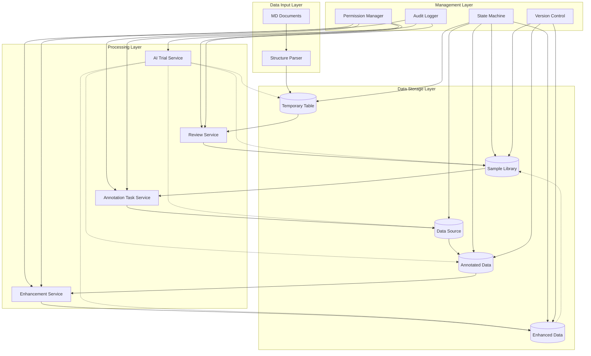
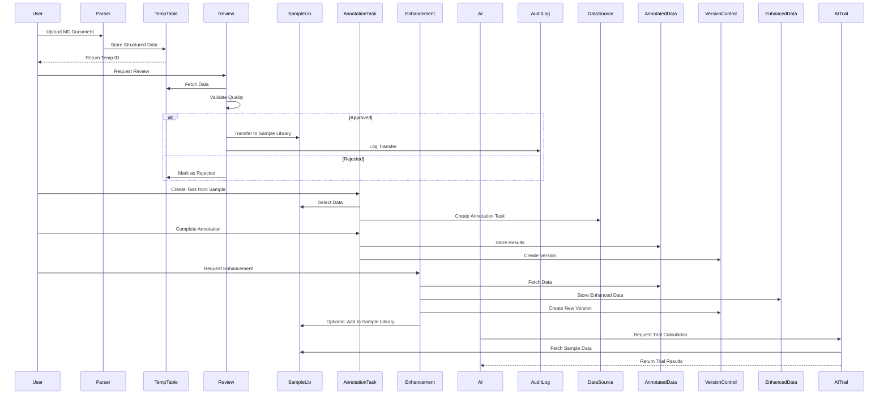
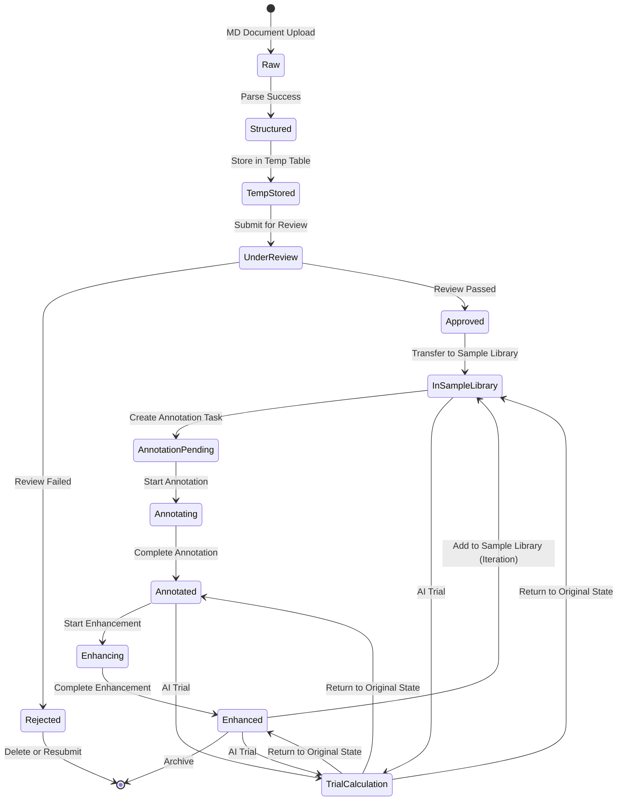

# Design Document: Data Lifecycle Management System

## Overview

The Data Lifecycle Management System is a comprehensive data flow management solution for the AI annotation platform (问视盘). It establishes a complete data transformation pipeline from raw MD documents through structured conversion, temporary storage, sample library management, annotation tasks, enhancement processing, and iterative optimization. The system provides state management, version control, permission management, and audit logging to ensure data quality and traceability throughout the entire lifecycle.

The system enables AI assistants to perform "trial calculations" by accessing data at various stages to validate data quality before committing to full-scale processing. This design supports the platform's existing React + TypeScript frontend and Python FastAPI backend architecture, with PostgreSQL as the primary data store.

## Architecture

### System Architecture Overview



### Data Flow Architecture



### State Machine Model



## Components and Interfaces

### Component 1: Structure Parser Service

**Purpose**: Parse MD documents and convert them into structured data format

**Interface**:
```typescript
interface IStructureParser {
  parseDocument(document: MDDocument): Promise<StructuredData>
  validateStructure(data: StructuredData): ValidationResult
  extractMetadata(document: MDDocument): Metadata
}

interface MDDocument {
  id: string
  content: string
  filename: string
  uploadedBy: string
  uploadedAt: Date
}

interface StructuredData {
  id: string
  sourceDocumentId: string
  sections: Section[]
  metadata: Metadata
  parsedAt: Date
}

interface Section {
  title: string
  content: string
  level: number
  order: number
}
```

**Responsibilities**:
- Parse MD format documents into structured sections
- Extract metadata (title, author, tags, etc.)
- Validate structure integrity
- Handle parsing errors gracefully

### Component 2: Data State Manager

**Purpose**: Manage data state transitions throughout the lifecycle

**Interface**:
```typescript
interface IDataStateManager {
  getCurrentState(dataId: string): Promise<DataState>
  transitionState(dataId: string, targetState: DataState, context: TransitionContext): Promise<StateTransitionResult>
  validateTransition(currentState: DataState, targetState: DataState): boolean
  getStateHistory(dataId: string): Promise<StateHistory[]>
}

enum DataState {
  RAW = 'raw',
  STRUCTURED = 'structured',
  TEMP_STORED = 'temp_stored',
  UNDER_REVIEW = 'under_review',
  REJECTED = 'rejected',
  APPROVED = 'approved',
  IN_SAMPLE_LIBRARY = 'in_sample_library',
  ANNOTATION_PENDING = 'annotation_pending',
  ANNOTATING = 'annotating',
  ANNOTATED = 'annotated',
  ENHANCING = 'enhancing',
  ENHANCED = 'enhanced',
  TRIAL_CALCULATION = 'trial_calculation',
  ARCHIVED = 'archived'
}

interface TransitionContext {
  userId: string
  reason?: string
  metadata?: Record<string, any>
}

interface StateTransitionResult {
  success: boolean
  previousState: DataState
  currentState: DataState
  transitionedAt: Date
  error?: string
}
```

**Responsibilities**:
- Enforce valid state transitions
- Track state history
- Validate transition permissions
- Emit state change events

### Component 3: Review Service

**Purpose**: Handle data review and approval workflow

**Interface**:
```typescript
interface IReviewService {
  submitForReview(dataId: string, submitterId: string): Promise<ReviewRequest>
  assignReviewer(reviewId: string, reviewerId: string): Promise<void>
  approveData(reviewId: string, reviewerId: string, comments?: string): Promise<ApprovalResult>
  rejectData(reviewId: string, reviewerId: string, reason: string): Promise<RejectionResult>
  getReviewStatus(reviewId: string): Promise<ReviewStatus>
}

interface ReviewRequest {
  id: string
  dataId: string
  submitterId: string
  reviewerId?: string
  status: ReviewStatus
  submittedAt: Date
}

enum ReviewStatus {
  PENDING = 'pending',
  IN_PROGRESS = 'in_progress',
  APPROVED = 'approved',
  REJECTED = 'rejected'
}

interface ApprovalResult {
  reviewId: string
  approvedAt: Date
  approvedBy: string
  transferredToSampleLibrary: boolean
}
```

**Responsibilities**:
- Manage review workflow
- Assign reviewers
- Process approval/rejection decisions
- Transfer approved data to sample library
- Notify stakeholders of review outcomes

### Component 4: Sample Library Manager

**Purpose**: Manage the sample library storage and retrieval

**Interface**:
```typescript
interface ISampleLibraryManager {
  addSample(data: StructuredData, metadata: SampleMetadata): Promise<Sample>
  getSample(sampleId: string): Promise<Sample>
  searchSamples(criteria: SearchCriteria): Promise<Sample[]>
  updateSample(sampleId: string, updates: Partial<Sample>): Promise<Sample>
  deleteSample(sampleId: string): Promise<void>
  getSamplesByTag(tags: string[]): Promise<Sample[]>
}

interface Sample {
  id: string
  dataId: string
  content: StructuredData
  metadata: SampleMetadata
  version: number
  createdAt: Date
  updatedAt: Date
  tags: string[]
}

interface SampleMetadata {
  source: string
  quality: QualityScore
  category: string
  difficulty?: string
  language?: string
}

interface SearchCriteria {
  tags?: string[]
  category?: string
  quality?: QualityScore
  dateRange?: DateRange
  limit?: number
  offset?: number
}
```

**Responsibilities**:
- Store approved samples
- Provide search and filtering capabilities
- Manage sample metadata
- Support tagging and categorization
- Handle sample versioning

### Component 5: Annotation Task Service

**Purpose**: Create and manage annotation tasks

**Interface**:
```typescript
interface IAnnotationTaskService {
  createTask(config: TaskConfig): Promise<AnnotationTask>
  assignAnnotator(taskId: string, annotatorId: string): Promise<void>
  getTask(taskId: string): Promise<AnnotationTask>
  submitAnnotation(taskId: string, annotation: Annotation): Promise<AnnotationResult>
  getTaskProgress(taskId: string): Promise<TaskProgress>
  completeTask(taskId: string): Promise<void>
}

interface TaskConfig {
  name: string
  description: string
  sampleIds: string[]
  annotationType: AnnotationType
  instructions: string
  deadline?: Date
  assignedTo?: string[]
}

interface AnnotationTask {
  id: string
  config: TaskConfig
  status: TaskStatus
  createdBy: string
  createdAt: Date
  completedAt?: Date
  progress: TaskProgress
}

enum TaskStatus {
  CREATED = 'created',
  IN_PROGRESS = 'in_progress',
  COMPLETED = 'completed',
  CANCELLED = 'cancelled'
}

interface Annotation {
  taskId: string
  sampleId: string
  annotatorId: string
  labels: Label[]
  comments?: string
  confidence?: number
}

interface TaskProgress {
  total: number
  completed: number
  inProgress: number
  percentage: number
}
```

**Responsibilities**:
- Create annotation tasks from sample library
- Assign tasks to annotators
- Track annotation progress
- Store annotation results
- Validate annotation quality

### Component 6: Enhancement Service

**Purpose**: Process and enhance annotated data

**Interface**:
```typescript
interface IEnhancementService {
  createEnhancementJob(config: EnhancementConfig): Promise<EnhancementJob>
  getJobStatus(jobId: string): Promise<JobStatus>
  applyEnhancement(jobId: string): Promise<EnhancedData>
  validateEnhancement(enhancedData: EnhancedData): Promise<ValidationResult>
  rollbackEnhancement(jobId: string): Promise<void>
}

interface EnhancementConfig {
  dataId: string
  enhancementType: EnhancementType
  parameters: Record<string, any>
  targetQuality?: QualityScore
}

enum EnhancementType {
  DATA_AUGMENTATION = 'data_augmentation',
  QUALITY_IMPROVEMENT = 'quality_improvement',
  NOISE_REDUCTION = 'noise_reduction',
  FEATURE_EXTRACTION = 'feature_extraction',
  NORMALIZATION = 'normalization'
}

interface EnhancementJob {
  id: string
  config: EnhancementConfig
  status: JobStatus
  startedAt: Date
  completedAt?: Date
  result?: EnhancedData
  error?: string
}

enum JobStatus {
  QUEUED = 'queued',
  RUNNING = 'running',
  COMPLETED = 'completed',
  FAILED = 'failed',
  CANCELLED = 'cancelled'
}

interface EnhancedData {
  id: string
  originalDataId: string
  enhancementJobId: string
  content: any
  metadata: EnhancementMetadata
  version: number
  createdAt: Date
}

interface EnhancementMetadata {
  enhancementType: EnhancementType
  qualityImprovement: number
  parameters: Record<string, any>
}
```

**Responsibilities**:
- Apply various enhancement algorithms
- Track enhancement jobs
- Validate enhancement results
- Support rollback operations
- Generate enhancement metrics

### Component 7: AI Trial Service

**Purpose**: Enable AI assistants to perform trial calculations on data

**Interface**:
```typescript
interface IAITrialService {
  createTrial(config: TrialConfig): Promise<Trial>
  executeTrial(trialId: string): Promise<TrialResult>
  getTrialResult(trialId: string): Promise<TrialResult>
  compareTrial(trialIds: string[]): Promise<ComparisonResult>
  cancelTrial(trialId: string): Promise<void>
}

interface TrialConfig {
  name: string
  dataSource: DataSourceConfig
  aiModel: string
  parameters: Record<string, any>
  sampleSize?: number
}

interface DataSourceConfig {
  stage: DataStage
  filters?: Record<string, any>
  sampleIds?: string[]
}

enum DataStage {
  TEMP_TABLE = 'temp_table',
  SAMPLE_LIBRARY = 'sample_library',
  DATA_SOURCE = 'data_source',
  ANNOTATED = 'annotated',
  ENHANCED = 'enhanced'
}

interface Trial {
  id: string
  config: TrialConfig
  status: TrialStatus
  createdBy: string
  createdAt: Date
  executedAt?: Date
}

enum TrialStatus {
  CREATED = 'created',
  RUNNING = 'running',
  COMPLETED = 'completed',
  FAILED = 'failed'
}

interface TrialResult {
  trialId: string
  metrics: TrialMetrics
  predictions: any[]
  accuracy?: number
  executionTime: number
  dataQualityScore: number
}

interface TrialMetrics {
  precision?: number
  recall?: number
  f1Score?: number
  customMetrics?: Record<string, number>
}
```

**Responsibilities**:
- Provide data access for AI trial calculations
- Execute AI model predictions
- Calculate performance metrics
- Compare results across different data stages
- Ensure trial operations don't affect production data

### Component 8: Version Control Manager

**Purpose**: Manage data versioning throughout the lifecycle

**Interface**:
```typescript
interface IVersionControlManager {
  createVersion(dataId: string, content: any, metadata: VersionMetadata): Promise<Version>
  getVersion(versionId: string): Promise<Version>
  getVersionHistory(dataId: string): Promise<Version[]>
  compareVersions(versionId1: string, versionId2: string): Promise<VersionDiff>
  rollbackToVersion(dataId: string, versionId: string): Promise<void>
  tagVersion(versionId: string, tag: string): Promise<void>
}

interface Version {
  id: string
  dataId: string
  versionNumber: number
  content: any
  metadata: VersionMetadata
  createdBy: string
  createdAt: Date
  tags: string[]
}

interface VersionMetadata {
  changeType: ChangeType
  description?: string
  parentVersionId?: string
  checksum: string
}

enum ChangeType {
  INITIAL = 'initial',
  ANNOTATION = 'annotation',
  ENHANCEMENT = 'enhancement',
  CORRECTION = 'correction',
  MERGE = 'merge'
}

interface VersionDiff {
  versionId1: string
  versionId2: string
  changes: Change[]
  summary: DiffSummary
}
```

**Responsibilities**:
- Create version snapshots
- Track version history
- Support version comparison
- Enable rollback operations
- Manage version tags

### Component 9: Permission Manager

**Purpose**: Control access to data and operations

**Interface**:
```typescript
interface IPermissionManager {
  checkPermission(userId: string, resource: Resource, action: Action): Promise<boolean>
  grantPermission(userId: string, resource: Resource, actions: Action[]): Promise<void>
  revokePermission(userId: string, resource: Resource, actions: Action[]): Promise<void>
  getUserPermissions(userId: string): Promise<Permission[]>
  getResourcePermissions(resource: Resource): Promise<Permission[]>
}

interface Resource {
  type: ResourceType
  id: string
}

enum ResourceType {
  TEMP_DATA = 'temp_data',
  SAMPLE = 'sample',
  ANNOTATION_TASK = 'annotation_task',
  ANNOTATED_DATA = 'annotated_data',
  ENHANCED_DATA = 'enhanced_data',
  TRIAL = 'trial'
}

enum Action {
  VIEW = 'view',
  EDIT = 'edit',
  DELETE = 'delete',
  TRANSFER = 'transfer',
  REVIEW = 'review',
  ANNOTATE = 'annotate',
  ENHANCE = 'enhance',
  TRIAL = 'trial'
}

interface Permission {
  userId: string
  resource: Resource
  actions: Action[]
  grantedBy: string
  grantedAt: Date
  expiresAt?: Date
}
```

**Responsibilities**:
- Enforce access control policies
- Manage user permissions
- Support role-based access control (RBAC)
- Validate operation permissions
- Audit permission changes

### Component 10: Audit Logger

**Purpose**: Record all data operations for compliance and traceability

**Interface**:
```typescript
interface IAuditLogger {
  logOperation(operation: AuditOperation): Promise<void>
  getAuditLog(filters: AuditFilters): Promise<AuditLog[]>
  getDataHistory(dataId: string): Promise<AuditLog[]>
  getUserActivity(userId: string, dateRange: DateRange): Promise<AuditLog[]>
  exportAuditLog(filters: AuditFilters, format: ExportFormat): Promise<string>
}

interface AuditOperation {
  operationType: OperationType
  userId: string
  resource: Resource
  action: Action
  timestamp: Date
  details?: Record<string, any>
  ipAddress?: string
  userAgent?: string
}

enum OperationType {
  CREATE = 'create',
  READ = 'read',
  UPDATE = 'update',
  DELETE = 'delete',
  TRANSFER = 'transfer',
  STATE_CHANGE = 'state_change'
}

interface AuditLog {
  id: string
  operation: AuditOperation
  result: OperationResult
  duration: number
  error?: string
}

enum OperationResult {
  SUCCESS = 'success',
  FAILURE = 'failure',
  PARTIAL = 'partial'
}

interface AuditFilters {
  userId?: string
  resourceType?: ResourceType
  operationType?: OperationType
  dateRange?: DateRange
  result?: OperationResult
}
```

**Responsibilities**:
- Log all data operations
- Provide audit trail
- Support compliance reporting
- Enable forensic analysis
- Export audit logs

## Data Models

### Model 1: TempData

```typescript
interface TempData {
  id: string
  sourceDocumentId: string
  content: StructuredData
  state: DataState
  uploadedBy: string
  uploadedAt: Date
  reviewStatus?: ReviewStatus
  reviewedBy?: string
  reviewedAt?: Date
  rejectionReason?: string
  metadata: Record<string, any>
}
```

**Validation Rules**:
- id must be unique UUID
- sourceDocumentId must reference valid MD document
- content must pass structure validation
- uploadedBy must be valid user ID
- state must be valid DataState enum value

### Model 2: Sample

```typescript
interface Sample {
  id: string
  dataId: string
  content: StructuredData
  metadata: SampleMetadata
  version: number
  createdAt: Date
  updatedAt: Date
  tags: string[]
  qualityScore: QualityScore
  usageCount: number
  lastUsedAt?: Date
}

interface QualityScore {
  overall: number
  completeness: number
  accuracy: number
  consistency: number
}
```

**Validation Rules**:
- id must be unique UUID
- dataId must reference valid data
- version must be positive integer
- qualityScore values must be between 0 and 1
- tags must be non-empty strings

### Model 3: AnnotationTask

```typescript
interface AnnotationTask {
  id: string
  name: string
  description: string
  sampleIds: string[]
  annotationType: AnnotationType
  instructions: string
  status: TaskStatus
  createdBy: string
  createdAt: Date
  assignedTo: string[]
  deadline?: Date
  completedAt?: Date
  progress: TaskProgress
  annotations: Annotation[]
}

enum AnnotationType {
  CLASSIFICATION = 'classification',
  ENTITY_RECOGNITION = 'entity_recognition',
  RELATION_EXTRACTION = 'relation_extraction',
  SENTIMENT_ANALYSIS = 'sentiment_analysis',
  CUSTOM = 'custom'
}
```

**Validation Rules**:
- id must be unique UUID
- name must be non-empty string
- sampleIds must reference valid samples
- assignedTo must contain valid user IDs
- deadline must be future date if specified
- progress.completed must not exceed progress.total

### Model 4: EnhancedData

```typescript
interface EnhancedData {
  id: string
  originalDataId: string
  enhancementJobId: string
  content: any
  metadata: EnhancementMetadata
  version: number
  qualityScore: QualityScore
  createdAt: Date
}
```

**Validation Rules**:
- id must be unique UUID
- originalDataId must reference valid annotated data
- version must be positive integer
- qualityScore must be higher than original data

### Model 5: AuditLog

```typescript
interface AuditLog {
  id: string
  operation: AuditOperation
  result: OperationResult
  duration: number
  timestamp: Date
  error?: string
}
```

**Validation Rules**:
- id must be unique UUID
- timestamp must be valid date
- duration must be non-negative
- result must be valid OperationResult enum

## Correctness Properties

*A property is a characteristic or behavior that should hold true across all valid executions of a system—essentially, a formal statement about what the system should do. Properties serve as the bridge between human-readable specifications and machine-verifiable correctness guarantees.*

### Property 1: Document Parsing Round-Trip

For any valid MD document, parsing it into structured data and then storing and retrieving it should preserve the content and metadata.

**Validates: Requirements 1.1, 1.2, 1.3**

### Property 2: State Transition Validity

For all data items, only valid state transitions according to the state machine definition should succeed, and invalid transitions should be rejected with valid next state options.

**Validates: Requirements 2.1, 2.2**

### Property 3: State History Completeness

For all data items, every successful state transition must be recorded in the state history with timestamp and user information.

**Validates: Requirements 2.3**

### Property 4: Permission-Gated State Transitions

For all state transition attempts, the operation should only succeed if the user has the required permissions for that transition.

**Validates: Requirements 2.4, 9.1**

### Property 5: Review Workflow Integrity

For any temporary data submitted for review, approving it should transfer it to the sample library and update its state, while rejecting it should mark it as rejected with the reason recorded.

**Validates: Requirements 3.1, 3.2, 3.3**

### Property 6: Audit Logging Completeness

For all state-changing operations (review actions, state transitions, enhancements), an audit log entry must be created with timestamp, user, operation details, and result.

**Validates: Requirements 3.6, 10.1, 10.2**

### Property 7: Sample Library Search Correctness

For any search criteria (tags, category, quality score, date range), all returned samples should match the criteria, and results should be properly paginated.

**Validates: Requirements 4.2, 4.3, 23.4**

### Property 8: Sample Usage Tracking

For any sample, using it in an annotation task should increment its usage count and update the last used timestamp.

**Validates: Requirements 4.4**

### Property 9: Version Creation on Modification

For all data modifications (sample updates, annotations, enhancements), a new version must be created with incremented version number and metadata.

**Validates: Requirements 4.6, 6.6, 8.1**

### Property 10: Version Monotonicity

For all data items, version numbers must strictly increase with each modification, and newer versions must have later creation timestamps.

**Validates: Requirements 8.2, 20.6**

### Property 11: Task Progress Consistency

For any annotation task, the sum of completed and in-progress annotations must not exceed the total number of assigned samples, and progress percentage must be calculated correctly.

**Validates: Requirements 5.4**

### Property 12: Task Completion Validation

For any annotation task, marking it as complete should only succeed if all assigned samples have been annotated.

**Validates: Requirements 5.6**

### Property 13: Enhancement Failure Safety

For any enhancement job that fails, the original data must remain unchanged and the error must be logged.

**Validates: Requirements 6.4**

### Property 14: Enhancement Rollback

For any enhancement operation, rolling it back should restore the data to its pre-enhancement state.

**Validates: Requirements 6.5**

### Property 15: AI Trial Data Immutability

For any AI trial execution, the source data at any lifecycle stage must remain unchanged after the trial completes.

**Validates: Requirements 7.1, 7.5**

### Property 16: Trial Result Completeness

For any completed AI trial, the result must include all required metrics: accuracy, precision, recall, and execution time.

**Validates: Requirements 7.6**

### Property 17: Version Comparison Correctness

For any two versions of the same data item, comparing them should return a diff showing all changes between the versions.

**Validates: Requirements 8.3**

### Property 18: Version Rollback

For any data item with version history, rolling back to a previous version should restore the data to that version's state.

**Validates: Requirements 8.4**

### Property 19: Version Checksum Integrity

For any version created, a checksum must be calculated and stored, and verifying the checksum should confirm data integrity.

**Validates: Requirements 8.5**

### Property 20: Permission Enforcement

For all operations, execution should only proceed if the user has the required permissions, otherwise a 403 Forbidden error should be returned.

**Validates: Requirements 9.1, 9.3**

### Property 21: Permission Grant Tracking

For any permission granted or revoked, the system must record who performed the action and when.

**Validates: Requirements 9.5**

### Property 22: Permission Expiration

For any permission with an expiration date, the permission should not be honored after the expiration date.

**Validates: Requirements 9.6**

### Property 23: Audit Log Filtering

For any audit log query with filters (user, resource type, operation type, date range, result), all returned logs should match the filter criteria.

**Validates: Requirements 10.3**

### Property 24: Audit Log Export Format

For any audit log export request, the generated CSV file should contain all required columns and properly formatted data.

**Validates: Requirements 10.4**

### Property 25: Audit Log Immutability

For any audit log entry, attempts to modify or delete it should be prevented.

**Validates: Requirements 10.6**

### Property 26: Internationalization Completeness

For all UI components, every user-visible text element must use the t() function with valid translation keys, and both Chinese and English translation files must have identical key structures.

**Validates: Requirements 11.5, 19.2, 19.3, 19.4, 19.5, 19.6**

### Property 27: Rejection Reason Requirement

For any data rejection operation, the operation should only succeed if a non-empty rejection reason is provided.

**Validates: Requirements 12.5**

### Property 28: State Transition Button Validity

For any data item displayed in the UI, only valid next state transitions should be shown as enabled buttons, and invalid transitions should be disabled.

**Validates: Requirements 18.2, 18.6**

### Property 29: Data Validation

For any data storage or modification operation, the data must pass all validation rules (UUID format, foreign key references, quality score range, version number format) or be rejected with descriptive error messages.

**Validates: Requirements 20.1, 20.2, 20.3, 20.4, 20.5**

### Property 30: Iterative Enhancement Traceability

For any enhanced data added back to the sample library, the new sample must be linked to the original data, preserve version history, and increment the iteration count.

**Validates: Requirements 21.2, 21.3, 21.4, 21.6**

### Property 31: Concurrent Modification Detection

For any concurrent modifications to the same data item, version conflicts must be detected and a 409 Conflict error returned with conflicting version information.

**Validates: Requirements 22.1, 22.2, 22.3**

### Property 32: State Transition Atomicity

For any state transition operation, either the entire transition succeeds (state updated, history recorded, audit logged) or the entire operation fails with no partial changes.

**Validates: Requirements 22.5**

### Property 33: Data Encryption at Rest

For any sensitive data stored in the system, the stored representation must be encrypted.

**Validates: Requirements 24.2**

### Property 34: Input Sanitization

For any user input, malicious content (SQL injection, XSS attempts) must be sanitized before processing.

**Validates: Requirements 24.3**

### Property 35: Rate Limiting

For any API endpoint, making requests exceeding the rate limit should result in rate limit errors.

**Validates: Requirements 24.4**

### Property 36: Token Expiration

For any authentication token, using an expired token should result in authentication failure.

**Validates: Requirements 24.5**

### Property 37: Error Message Informativeness

For any operation failure (invalid transition, permission denial, validation failure), the error message must include specific information to help resolve the issue.

**Validates: Requirements 25.2, 25.6**

## Error Handling

### Error Scenario 1: Invalid State Transition

**Condition**: User attempts to transition data to an invalid state
**Response**: Return error with valid transition options
**Recovery**: Suggest valid next states based on current state

### Error Scenario 2: Permission Denied

**Condition**: User lacks required permissions for operation
**Response**: Return 403 Forbidden with required permissions
**Recovery**: Request permission from administrator or resource owner

### Error Scenario 3: Version Conflict

**Condition**: Concurrent modifications create version conflict
**Response**: Return 409 Conflict with conflicting versions
**Recovery**: Merge changes or choose one version

### Error Scenario 4: Data Validation Failure

**Condition**: Data fails validation rules during processing
**Response**: Return 400 Bad Request with validation errors
**Recovery**: Fix validation errors and resubmit

### Error Scenario 5: Enhancement Job Failure

**Condition**: Enhancement processing fails due to algorithm error
**Response**: Mark job as failed, preserve original data
**Recovery**: Retry with different parameters or rollback

## Testing Strategy

### Unit Testing Approach

Test each component independently with mocked dependencies:
- State Manager: Test all valid and invalid state transitions
- Permission Manager: Test permission checks and RBAC rules
- Version Control: Test version creation and comparison
- Audit Logger: Test log creation and retrieval

Coverage goal: 80% code coverage for all components

### Property-Based Testing Approach

Use property-based testing to verify system invariants:
- State machine properties: No invalid transitions possible
- Version ordering: Versions always increase monotonically
- Permission consistency: Permissions are always checked
- Audit completeness: All operations are logged

**Property Test Library**: fast-check (TypeScript), hypothesis (Python)

### Integration Testing Approach

Test complete workflows end-to-end:
- Workflow 1: MD upload → Review → Sample Library
- Workflow 2: Sample → Annotation → Enhancement → Iteration
- Workflow 3: AI Trial across all data stages
- Workflow 4: Permission enforcement across operations

## Performance Considerations

- Database indexing on frequently queried fields (state, userId, createdAt)
- Caching for sample library searches and permission checks
- Async processing for enhancement jobs to avoid blocking
- Pagination for large result sets (samples, audit logs)
- Connection pooling for database connections

## Security Considerations

- Row-level security for data access control
- Encrypted storage for sensitive data content
- Audit logging for all security-relevant operations
- Rate limiting for API endpoints
- Input validation and sanitization for all user inputs
- JWT-based authentication with short expiration times

## Frontend UI Design

### Admin Dashboard Overview

The admin dashboard provides end-to-end visualization and management of the data lifecycle with quick action buttons for common operations. All UI components follow the project's i18n standards and support flexible data flow without enforcing strict sequential processing.

#### Dashboard Layout

```
┌─────────────────────────────────────────────────────────────┐
│  Header: {t('dataLifecycle.title')}                    [中/EN]│
├─────────────────────────────────────────────────────────────┤
│  ┌─────────────┐  ┌──────────────────────────────────────┐ │
│  │  Sidebar    │  │  Main Content Area                   │ │
│  │             │  │                                      │ │
│  │  - Overview │  │  [Data Flow Visualization]           │ │
│  │  - Temp     │  │                                      │ │
│  │  - Samples  │  │  [Quick Actions - 6 buttons]         │ │
│  │  - Tasks    │  │                                      │ │
│  │  - Enhanced │  │  [Statistics Cards]                  │ │
│  │  - AI Trial │  │                                      │ │
│  │  - Audit    │  │  [Recent Activities]                 │ │
│  └─────────────┘  └──────────────────────────────────────┘ │
└─────────────────────────────────────────────────────────────┘
```

#### Quick Actions Component

**Purpose**: Provide quick access to common operations with flexible data flow support

**Component Structure**:
```typescript
interface QuickActionsProps {
  onRefresh: () => void
}

const QuickActions: React.FC<QuickActionsProps> = ({ onRefresh }) => {
  const { t } = useTranslation('dataLifecycle')
  
  // Modal visibility state
  const [createTempDataVisible, setCreateTempDataVisible] = useState(false)
  const [addToLibraryVisible, setAddToLibraryVisible] = useState(false)
  const [submitReviewVisible, setSubmitReviewVisible] = useState(false)
  const [createTaskVisible, setCreateTaskVisible] = useState(false)
  const [createEnhancementVisible, setCreateEnhancementVisible] = useState(false)
  const [createTrialVisible, setCreateTrialVisible] = useState(false)
  
  const handleAction = (key: string) => {
    switch (key) {
      case 'createTempData':
        setCreateTempDataVisible(true)
        break
      case 'addToLibrary':
        setAddToLibraryVisible(true)
        break
      case 'submitReview':
        setSubmitReviewVisible(true)
        break
      case 'createTask':
        setCreateTaskVisible(true)
        break
      case 'createEnhancement':
        setCreateEnhancementVisible(true)
        break
      case 'createTrial':
        setCreateTrialVisible(true)
        break
    }
  }
  
  return (
    <div className="quick-actions">
      <h3>{t('quickActions.title')}</h3>
      <Space wrap>
        <Button 
          icon={<PlusOutlined />}
          onClick={() => handleAction('createTempData')}
        >
          {t('quickActions.createTempData')}
        </Button>
        <Button 
          icon={<DatabaseOutlined />}
          onClick={() => handleAction('addToLibrary')}
        >
          {t('quickActions.addToLibrary')}
        </Button>
        <Button 
          icon={<CheckCircleOutlined />}
          onClick={() => handleAction('submitReview')}
        >
          {t('quickActions.submitReview')}
        </Button>
        <Button 
          icon={<CheckSquareOutlined />}
          onClick={() => handleAction('createTask')}
        >
          {t('quickActions.createTask')}
        </Button>
        <Button 
          icon={<ThunderboltOutlined />}
          onClick={() => handleAction('createEnhancement')}
        >
          {t('quickActions.createEnhancement')}
        </Button>
        <Button 
          icon={<ExperimentOutlined />}
          onClick={() => handleAction('createTrial')}
        >
          {t('quickActions.createTrial')}
        </Button>
      </Space>
      
      {/* Modal Components */}
      <CreateTempDataModal
        visible={createTempDataVisible}
        onCancel={() => setCreateTempDataVisible(false)}
        onSuccess={() => {
          setCreateTempDataVisible(false)
          onRefresh()
        }}
      />
      <AddToLibraryModal
        visible={addToLibraryVisible}
        onCancel={() => setAddToLibraryVisible(false)}
        onSuccess={() => {
          setAddToLibraryVisible(false)
          onRefresh()
        }}
      />
      <SubmitReviewModal
        visible={submitReviewVisible}
        onCancel={() => setSubmitReviewVisible(false)}
        onSuccess={() => {
          setSubmitReviewVisible(false)
          onRefresh()
        }}
      />
      <CreateTaskModal
        visible={createTaskVisible}
        onCancel={() => setCreateTaskVisible(false)}
        onSuccess={() => {
          setCreateTaskVisible(false)
          onRefresh()
        }}
      />
      <CreateEnhancementModal
        visible={createEnhancementVisible}
        onCancel={() => setCreateEnhancementVisible(false)}
        onSuccess={() => {
          setCreateEnhancementVisible(false)
          onRefresh()
        }}
      />
      <CreateTrialModal
        visible={createTrialVisible}
        onCancel={() => setCreateTrialVisible(false)}
        onSuccess={() => {
          setCreateTrialVisible(false)
          onRefresh()
        }}
      />
    </div>
  )
}
```

**i18n Keys**:
```json
{
  "quickActions": {
    "title": "快速操作",
    "createTempData": "创建临时数据",
    "addToLibrary": "添加到样本库",
    "submitReview": "提交审核",
    "createTask": "创建标注任务",
    "createEnhancement": "创建增强任务",
    "createTrial": "创建AI试算"
  }
}
```

### UI Component 1: Data Flow Visualization

**Purpose**: Visual representation of data moving through lifecycle stages

**Component Structure**:
```typescript
interface DataFlowVisualizationProps {
  onStageClick: (stage: DataStage) => void
}

// i18n namespace: 'dataLifecycle'
const DataFlowVisualization: React.FC<DataFlowVisualizationProps> = () => {
  const { t } = useTranslation('dataLifecycle')
  
  return (
    <div className="data-flow-container">
      <h2>{t('visualization.title')}</h2>
      {/* Mermaid diagram or custom SVG visualization */}
      <StageNode 
        label={t('stages.tempTable')}
        count={tempDataCount}
        onClick={() => onStageClick('temp_table')}
      />
      {/* ... other stages */}
    </div>
  )
}
```

**i18n Keys** (frontend/src/locales/zh/dataLifecycle.json):
```json
{
  "visualization": {
    "title": "数据流转可视化",
    "stages": {
      "tempTable": "临时表",
      "sampleLibrary": "样本库",
      "annotation": "标注中",
      "annotated": "已标注",
      "enhanced": "已增强"
    }
  }
}
```

### UI Component 2: Temporary Data Management

**Purpose**: Manage data in temporary storage awaiting review

**Component Structure**:
```typescript
interface TempDataTableProps {
  data: TempData[]
  onReview: (id: string) => void
  onDelete: (id: string) => void
}

const TempDataTable: React.FC<TempDataTableProps> = ({ data, onReview, onDelete }) => {
  const { t } = useTranslation('dataLifecycle')
  
  return (
    <Table
      columns={[
        { title: t('tempData.columns.id'), dataIndex: 'id' },
        { title: t('tempData.columns.uploadedBy'), dataIndex: 'uploadedBy' },
        { title: t('tempData.columns.uploadedAt'), dataIndex: 'uploadedAt' },
        { title: t('tempData.columns.state'), dataIndex: 'state' },
        { 
          title: t('tempData.columns.actions'), 
          render: (record) => (
            <>
              <Button onClick={() => onReview(record.id)}>
                {t('tempData.actions.review')}
              </Button>
              <Button onClick={() => onDelete(record.id)}>
                {t('tempData.actions.delete')}
              </Button>
            </>
          )
        }
      ]}
      dataSource={data}
    />
  )
}
```

**i18n Keys**:
```json
{
  "tempData": {
    "title": "临时数据管理",
    "columns": {
      "id": "数据ID",
      "uploadedBy": "上传者",
      "uploadedAt": "上传时间",
      "state": "状态"
    },
    "actions": {
      "review": "审核",
      "delete": "删除",
      "approve": "批准",
      "reject": "拒绝"
    }
  }
}
```

### UI Component 3: Review Modal

**Purpose**: Review and approve/reject temporary data

**Component Structure**:
```typescript
interface ReviewModalProps {
  visible: boolean
  data: TempData
  onApprove: (id: string, comments?: string) => void
  onReject: (id: string, reason: string) => void
  onCancel: () => void
}

const ReviewModal: React.FC<ReviewModalProps> = ({ 
  visible, data, onApprove, onReject, onCancel 
}) => {
  const { t } = useTranslation('dataLifecycle')
  const [comments, setComments] = useState('')
  const [rejectionReason, setRejectionReason] = useState('')
  
  return (
    <Modal
      title={t('review.modalTitle')}
      visible={visible}
      onCancel={onCancel}
      footer={null}
    >
      <div className="review-content">
        <h3>{t('review.dataPreview')}</h3>
        <pre>{JSON.stringify(data.content, null, 2)}</pre>
        
        <Form>
          <Form.Item label={t('review.comments')}>
            <TextArea 
              value={comments}
              onChange={(e) => setComments(e.target.value)}
              placeholder={t('review.commentsPlaceholder')}
            />
          </Form.Item>
          
          <Form.Item>
            <Button type="primary" onClick={() => onApprove(data.id, comments)}>
              {t('review.approveButton')}
            </Button>
            <Button danger onClick={() => {
              if (rejectionReason) onReject(data.id, rejectionReason)
            }}>
              {t('review.rejectButton')}
            </Button>
          </Form.Item>
        </Form>
      </div>
    </Modal>
  )
}
```

**i18n Keys**:
```json
{
  "review": {
    "modalTitle": "数据审核",
    "dataPreview": "数据预览",
    "comments": "审核意见",
    "commentsPlaceholder": "请输入审核意见（可选）",
    "rejectionReason": "拒绝原因",
    "rejectionReasonPlaceholder": "请输入拒绝原因（必填）",
    "approveButton": "批准并转入样本库",
    "rejectButton": "拒绝"
  }
}
```

### UI Component 4: Sample Library Management

**Purpose**: Browse, search, and manage samples in the library

**Component Structure**:
```typescript
interface SampleLibraryProps {
  samples: Sample[]
  onCreateTask: (sampleIds: string[]) => void
  onDelete: (id: string) => void
}

const SampleLibrary: React.FC<SampleLibraryProps> = ({ 
  samples, onCreateTask, onDelete 
}) => {
  const { t } = useTranslation('dataLifecycle')
  const [selectedSamples, setSelectedSamples] = useState<string[]>([])
  const [searchCriteria, setSearchCriteria] = useState<SearchCriteria>({})
  
  return (
    <div className="sample-library">
      <div className="header">
        <h2>{t('sampleLibrary.title')}</h2>
        <Button 
          type="primary" 
          disabled={selectedSamples.length === 0}
          onClick={() => onCreateTask(selectedSamples)}
        >
          {t('sampleLibrary.createTask')}
        </Button>
      </div>
      
      <SearchFilters
        onSearch={setSearchCriteria}
        labels={{
          tags: t('sampleLibrary.filters.tags'),
          category: t('sampleLibrary.filters.category'),
          quality: t('sampleLibrary.filters.quality'),
          dateRange: t('sampleLibrary.filters.dateRange')
        }}
      />
      
      <Table
        rowSelection={{
          selectedRowKeys: selectedSamples,
          onChange: setSelectedSamples
        }}
        columns={[
          { title: t('sampleLibrary.columns.id'), dataIndex: 'id' },
          { title: t('sampleLibrary.columns.category'), dataIndex: ['metadata', 'category'] },
          { title: t('sampleLibrary.columns.quality'), dataIndex: ['qualityScore', 'overall'] },
          { title: t('sampleLibrary.columns.tags'), dataIndex: 'tags', render: (tags) => tags.join(', ') },
          { title: t('sampleLibrary.columns.createdAt'), dataIndex: 'createdAt' }
        ]}
        dataSource={samples}
      />
    </div>
  )
}
```

**i18n Keys**:
```json
{
  "sampleLibrary": {
    "title": "样本库管理",
    "createTask": "创建标注任务",
    "filters": {
      "tags": "标签",
      "category": "分类",
      "quality": "质量分数",
      "dateRange": "日期范围"
    },
    "columns": {
      "id": "样本ID",
      "category": "分类",
      "quality": "质量分数",
      "tags": "标签",
      "createdAt": "创建时间"
    }
  }
}
```

### UI Component 5: Annotation Task Management

**Purpose**: Create, assign, and monitor annotation tasks

**Component Structure**:
```typescript
interface TaskManagementProps {
  tasks: AnnotationTask[]
  onCreateTask: (config: TaskConfig) => void
  onAssign: (taskId: string, annotatorId: string) => void
}

const TaskManagement: React.FC<TaskManagementProps> = ({ 
  tasks, onCreateTask, onAssign 
}) => {
  const { t } = useTranslation('dataLifecycle')
  const [createModalVisible, setCreateModalVisible] = useState(false)
  
  return (
    <div className="task-management">
      <div className="header">
        <h2>{t('tasks.title')}</h2>
        <Button type="primary" onClick={() => setCreateModalVisible(true)}>
          {t('tasks.createNew')}
        </Button>
      </div>
      
      <Table
        columns={[
          { title: t('tasks.columns.name'), dataIndex: 'name' },
          { title: t('tasks.columns.status'), dataIndex: 'status' },
          { 
            title: t('tasks.columns.progress'), 
            render: (record) => (
              <Progress 
                percent={record.progress.percentage} 
                format={() => `${record.progress.completed}/${record.progress.total}`}
              />
            )
          },
          { title: t('tasks.columns.assignedTo'), dataIndex: 'assignedTo', render: (users) => users.join(', ') },
          { title: t('tasks.columns.deadline'), dataIndex: 'deadline' }
        ]}
        dataSource={tasks}
        expandable={{
          expandedRowRender: (record) => (
            <TaskDetails task={record} onAssign={onAssign} />
          )
        }}
      />
      
      <CreateTaskModal
        visible={createModalVisible}
        onCancel={() => setCreateModalVisible(false)}
        onCreate={onCreateTask}
      />
    </div>
  )
}
```

**i18n Keys**:
```json
{
  "tasks": {
    "title": "标注任务管理",
    "createNew": "创建新任务",
    "columns": {
      "name": "任务名称",
      "status": "状态",
      "progress": "进度",
      "assignedTo": "分配给",
      "deadline": "截止日期"
    },
    "create": {
      "modalTitle": "创建标注任务",
      "name": "任务名称",
      "description": "任务描述",
      "annotationType": "标注类型",
      "instructions": "标注说明",
      "deadline": "截止日期",
      "assignTo": "分配给"
    }
  }
}
```

### UI Component 6: Enhancement Management

**Purpose**: Configure and monitor data enhancement jobs

**Component Structure**:
```typescript
interface EnhancementManagementProps {
  jobs: EnhancementJob[]
  onCreateJob: (config: EnhancementConfig) => void
  onCancel: (jobId: string) => void
}

const EnhancementManagement: React.FC<EnhancementManagementProps> = ({ 
  jobs, onCreateJob, onCancel 
}) => {
  const { t } = useTranslation('dataLifecycle')
  
  return (
    <div className="enhancement-management">
      <div className="header">
        <h2>{t('enhancement.title')}</h2>
        <Button type="primary" onClick={() => setCreateModalVisible(true)}>
          {t('enhancement.createNew')}
        </Button>
      </div>
      
      <Table
        columns={[
          { title: t('enhancement.columns.id'), dataIndex: 'id' },
          { title: t('enhancement.columns.type'), dataIndex: ['config', 'enhancementType'] },
          { 
            title: t('enhancement.columns.status'), 
            dataIndex: 'status',
            render: (status) => (
              <Tag color={getStatusColor(status)}>
                {t(`enhancement.statuses.${status}`)}
              </Tag>
            )
          },
          { title: t('enhancement.columns.startedAt'), dataIndex: 'startedAt' },
          { title: t('enhancement.columns.completedAt'), dataIndex: 'completedAt' },
          {
            title: t('enhancement.columns.actions'),
            render: (record) => (
              record.status === 'running' && (
                <Button danger onClick={() => onCancel(record.id)}>
                  {t('enhancement.actions.cancel')}
                </Button>
              )
            )
          }
        ]}
        dataSource={jobs}
      />
    </div>
  )
}
```

**i18n Keys**:
```json
{
  "enhancement": {
    "title": "数据增强管理",
    "createNew": "创建增强任务",
    "columns": {
      "id": "任务ID",
      "type": "增强类型",
      "status": "状态",
      "startedAt": "开始时间",
      "completedAt": "完成时间",
      "actions": "操作"
    },
    "statuses": {
      "queued": "排队中",
      "running": "运行中",
      "completed": "已完成",
      "failed": "失败",
      "cancelled": "已取消"
    },
    "types": {
      "data_augmentation": "数据扩充",
      "quality_improvement": "质量提升",
      "noise_reduction": "噪声消除",
      "feature_extraction": "特征提取",
      "normalization": "标准化"
    },
    "actions": {
      "cancel": "取消"
    }
  }
}
```

### UI Component 7: AI Trial Dashboard

**Purpose**: Configure and run AI trial calculations on different data stages

**Component Structure**:
```typescript
interface AITrialDashboardProps {
  trials: Trial[]
  onCreateTrial: (config: TrialConfig) => void
  onExecute: (trialId: string) => void
  onCompare: (trialIds: string[]) => void
}

const AITrialDashboard: React.FC<AITrialDashboardProps> = ({ 
  trials, onCreateTrial, onExecute, onCompare 
}) => {
  const { t } = useTranslation('dataLifecycle')
  const [selectedTrials, setSelectedTrials] = useState<string[]>([])
  
  return (
    <div className="ai-trial-dashboard">
      <div className="header">
        <h2>{t('aiTrial.title')}</h2>
        <Space>
          <Button type="primary" onClick={() => setCreateModalVisible(true)}>
            {t('aiTrial.createNew')}
          </Button>
          <Button 
            disabled={selectedTrials.length < 2}
            onClick={() => onCompare(selectedTrials)}
          >
            {t('aiTrial.compare')}
          </Button>
        </Space>
      </div>
      
      <Table
        rowSelection={{
          selectedRowKeys: selectedTrials,
          onChange: setSelectedTrials
        }}
        columns={[
          { title: t('aiTrial.columns.name'), dataIndex: 'name' },
          { title: t('aiTrial.columns.dataStage'), dataIndex: ['config', 'dataSource', 'stage'] },
          { title: t('aiTrial.columns.aiModel'), dataIndex: ['config', 'aiModel'] },
          { title: t('aiTrial.columns.status'), dataIndex: 'status' },
          { title: t('aiTrial.columns.createdAt'), dataIndex: 'createdAt' },
          {
            title: t('aiTrial.columns.actions'),
            render: (record) => (
              <Space>
                {record.status === 'created' && (
                  <Button onClick={() => onExecute(record.id)}>
                    {t('aiTrial.actions.execute')}
                  </Button>
                )}
                {record.status === 'completed' && (
                  <Button onClick={() => viewResults(record.id)}>
                    {t('aiTrial.actions.viewResults')}
                  </Button>
                )}
              </Space>
            )
          }
        ]}
        dataSource={trials}
      />
    </div>
  )
}
```

**i18n Keys**:
```json
{
  "aiTrial": {
    "title": "AI试算管理",
    "createNew": "创建试算任务",
    "compare": "对比结果",
    "columns": {
      "name": "试算名称",
      "dataStage": "数据阶段",
      "aiModel": "AI模型",
      "status": "状态",
      "createdAt": "创建时间",
      "actions": "操作"
    },
    "dataStages": {
      "temp_table": "临时表",
      "sample_library": "样本库",
      "data_source": "数据源",
      "annotated": "已标注",
      "enhanced": "已增强"
    },
    "actions": {
      "execute": "执行",
      "viewResults": "查看结果",
      "cancel": "取消"
    }
  }
}
```

### UI Component 8: Audit Log Viewer

**Purpose**: View and search audit logs for compliance and debugging

**Component Structure**:
```typescript
interface AuditLogViewerProps {
  logs: AuditLog[]
  onExport: (filters: AuditFilters, format: ExportFormat) => void
}

const AuditLogViewer: React.FC<AuditLogViewerProps> = ({ logs, onExport }) => {
  const { t } = useTranslation('dataLifecycle')
  const [filters, setFilters] = useState<AuditFilters>({})
  
  return (
    <div className="audit-log-viewer">
      <div className="header">
        <h2>{t('audit.title')}</h2>
        <Button onClick={() => onExport(filters, 'csv')}>
          {t('audit.export')}
        </Button>
      </div>
      
      <FilterPanel
        onFilter={setFilters}
        labels={{
          userId: t('audit.filters.userId'),
          resourceType: t('audit.filters.resourceType'),
          operationType: t('audit.filters.operationType'),
          dateRange: t('audit.filters.dateRange'),
          result: t('audit.filters.result')
        }}
      />
      
      <Table
        columns={[
          { title: t('audit.columns.timestamp'), dataIndex: 'timestamp' },
          { title: t('audit.columns.userId'), dataIndex: ['operation', 'userId'] },
          { title: t('audit.columns.operationType'), dataIndex: ['operation', 'operationType'] },
          { title: t('audit.columns.resourceType'), dataIndex: ['operation', 'resource', 'type'] },
          { title: t('audit.columns.action'), dataIndex: ['operation', 'action'] },
          { title: t('audit.columns.result'), dataIndex: 'result' },
          { title: t('audit.columns.duration'), dataIndex: 'duration', render: (ms) => `${ms}ms` }
        ]}
        dataSource={logs}
        expandable={{
          expandedRowRender: (record) => (
            <pre>{JSON.stringify(record.operation.details, null, 2)}</pre>
          )
        }}
      />
    </div>
  )
}
```

**i18n Keys**:
```json
{
  "audit": {
    "title": "审计日志",
    "export": "导出日志",
    "filters": {
      "userId": "用户ID",
      "resourceType": "资源类型",
      "operationType": "操作类型",
      "dateRange": "日期范围",
      "result": "结果"
    },
    "columns": {
      "timestamp": "时间戳",
      "userId": "用户ID",
      "operationType": "操作类型",
      "resourceType": "资源类型",
      "action": "动作",
      "result": "结果",
      "duration": "耗时"
    }
  }
}
```

### UI Component 9: Data State Transition Visualizer

**Purpose**: Show current state and available transitions for a data item

**Component Structure**:
```typescript
interface StateTransitionVisualizerProps {
  dataId: string
  currentState: DataState
  stateHistory: StateHistory[]
  onTransition: (targetState: DataState) => void
}

const StateTransitionVisualizer: React.FC<StateTransitionVisualizerProps> = ({ 
  dataId, currentState, stateHistory, onTransition 
}) => {
  const { t } = useTranslation('dataLifecycle')
  const validTransitions = getValidTransitions(currentState)
  
  return (
    <div className="state-transition-visualizer">
      <h3>{t('stateTransition.title')}</h3>
      
      <div className="current-state">
        <Tag color="blue">{t(`states.${currentState}`)}</Tag>
      </div>
      
      <div className="available-transitions">
        <h4>{t('stateTransition.availableTransitions')}</h4>
        {validTransitions.map(state => (
          <Button 
            key={state}
            onClick={() => onTransition(state)}
          >
            {t(`stateTransition.transitionTo`)} {t(`states.${state}`)}
          </Button>
        ))}
      </div>
      
      <div className="state-history">
        <h4>{t('stateTransition.history')}</h4>
        <Timeline>
          {stateHistory.map(history => (
            <Timeline.Item key={history.id}>
              {t(`states.${history.state}`)} - {history.transitionedAt}
            </Timeline.Item>
          ))}
        </Timeline>
      </div>
    </div>
  )
}
```

**i18n Keys**:
```json
{
  "stateTransition": {
    "title": "数据状态管理",
    "availableTransitions": "可用的状态转换",
    "transitionTo": "转换到",
    "history": "状态历史"
  },
  "states": {
    "raw": "原始",
    "structured": "已结构化",
    "temp_stored": "临时存储",
    "under_review": "审核中",
    "rejected": "已拒绝",
    "approved": "已批准",
    "in_sample_library": "样本库中",
    "annotation_pending": "待标注",
    "annotating": "标注中",
    "annotated": "已标注",
    "enhancing": "增强中",
    "enhanced": "已增强",
    "trial_calculation": "试算中",
    "archived": "已归档"
  }
}
```

### i18n Implementation Guidelines

**File Structure**:
```
frontend/src/locales/
├── zh/
│   └── dataLifecycle.json  (Chinese translations)
└── en/
    └── dataLifecycle.json  (English translations)
```

**Usage in Components**:
```typescript
import { useTranslation } from 'react-i18next'

const MyComponent = () => {
  const { t } = useTranslation('dataLifecycle')
  
  // String attribute
  return <Button title={t('button.save')}>...</Button>
  
  // JSX child element
  return <Button>{t('button.save')}</Button>
  
  // NOT: <Button>t('button.save')</Button>  // Wrong!
}
```

**Translation Key Naming Convention**:
- Use dot notation for nested keys: `section.subsection.key`
- Use camelCase for key names: `createNew`, `viewResults`
- Group related keys under common parent: `columns.*`, `actions.*`, `filters.*`

**Validation**:
- All user-visible text must use `t()` function
- No hardcoded Chinese or English strings in JSX
- Both zh and en JSON files must have identical key structure
- Check for duplicate keys before committing

## Dependencies

- PostgreSQL: Primary data store with JSONB support
- Redis: Caching layer for permissions and sessions
- Celery: Async task queue for enhancement jobs
- FastAPI: Backend API framework
- React + TypeScript: Frontend framework
- Ant Design: UI component library
- react-i18next: Internationalization framework
- Mermaid: Diagram generation
