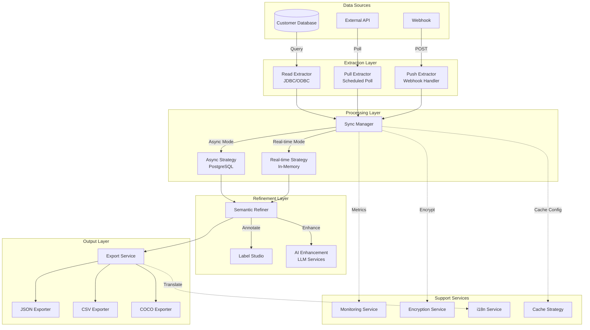
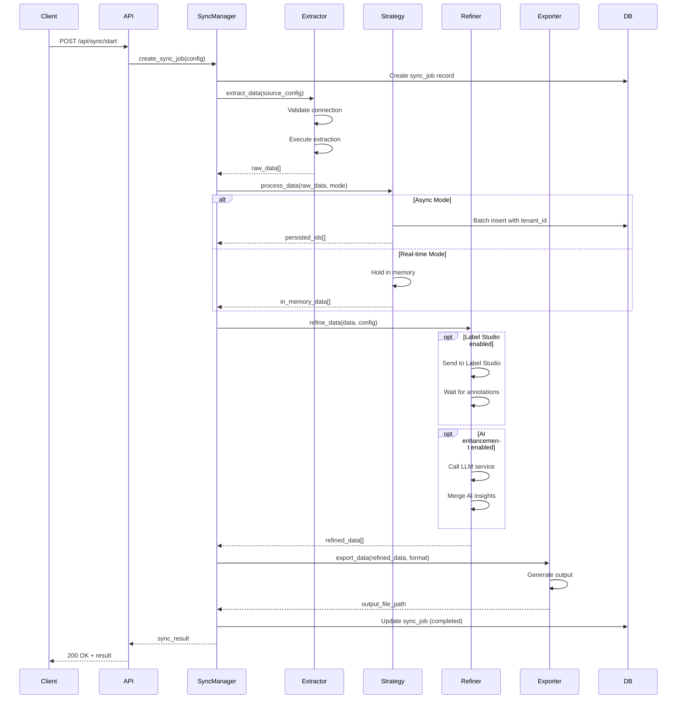

# Design Document - Data Sync Pipeline

## Overview

The Data Sync Pipeline is a comprehensive data integration system that extracts data from customer sources, processes it through configurable strategies, refines it with business logic and AI enhancement, and outputs it in AI-friendly formats. The system supports three acquisition methods (Read, Pull, Push), two processing modes (Async, Real-time), and multiple output formats (JSON, CSV, COCO).

### Key Design Goals

1. **Flexibility**: Support multiple data sources and acquisition methods
2. **Security**: Encrypt credentials, validate connections, enforce read-only access
3. **Scalability**: Handle large data volumes with batch processing and connection pooling
4. **Multi-tenancy**: Complete data isolation between tenants
5. **Observability**: Comprehensive monitoring, logging, and alerting
6. **AI-Readiness**: Standardized output formats optimized for AI/ML workflows

## Architecture

### High-Level Architecture



### Component Interaction Flow



## Components and Interfaces

### 1. Extractor Components

#### 1.1 Base Extractor Interface

```python
from abc import ABC, abstractmethod
from typing import List, Dict, Any, Optional
from pydantic import BaseModel

class ExtractionConfig(BaseModel):
    """Configuration for data extraction"""
    tenant_id: str
    source_id: str
    source_type: str  # "database", "api", "webhook"
    connection_params: Dict[str, Any]
    extraction_params: Dict[str, Any]
    
class ExtractionResult(BaseModel):
    """Result of data extraction"""
    success: bool
    record_count: int
    data: List[Dict[str, Any]]
    metadata: Dict[str, Any]
    errors: Optional[List[str]] = None

class BaseExtractor(ABC):
    """Base class for all extractors"""
    
    @abstractmethod
    async def validate_connection(self, config: ExtractionConfig) -> bool:
        """Validate connection to data source"""
        pass
    
    @abstractmethod
    async def extract(self, config: ExtractionConfig) -> ExtractionResult:
        """Extract data from source"""
        pass
    
    @abstractmethod
    async def test_connection(self, config: ExtractionConfig) -> Dict[str, Any]:
        """Test connection and return diagnostics"""
        pass
```

#### 1.2 Read Extractor (JDBC/ODBC)

```python
class ReadExtractor(BaseExtractor):
    """Direct database query extractor"""
    
    def __init__(self, encryption_service, connection_pool):
        self.encryption_service = encryption_service
        self.connection_pool = connection_pool
    
    async def validate_connection(self, config: ExtractionConfig) -> bool:
        """Validate database connection with encrypted credentials"""
        decrypted_params = await self.encryption_service.decrypt_dict(
            config.connection_params
        )
        # Test connection with read-only user
        # Return True if successful
        pass
    
    async def extract(self, config: ExtractionConfig) -> ExtractionResult:
        """Execute SQL query and return results"""
        # Use prepared statements
        # Enforce read-only mode
        # Apply row limits
        pass
```

#### 1.3 Pull Extractor (Scheduled Polling)

```python
class PullExtractor(BaseExtractor):
    """Scheduled polling extractor"""
    
    def __init__(self, scheduler, state_manager):
        self.scheduler = scheduler
        self.state_manager = state_manager
    
    async def schedule_pull(
        self, 
        config: ExtractionConfig, 
        cron_expression: str
    ) -> str:
        """Schedule periodic data pull"""
        # Create scheduled job
        # Store last_sync_timestamp
        # Return job_id
        pass
    
    async def extract(self, config: ExtractionConfig) -> ExtractionResult:
        """Pull data since last sync"""
        last_sync = await self.state_manager.get_last_sync(
            config.tenant_id, 
            config.source_id
        )
        # Query data where modified_at > last_sync
        # Update last_sync_timestamp
        pass
```

#### 1.4 Push Extractor (Webhook Handler)

```python
class PushExtractor(BaseExtractor):
    """Webhook-based push extractor"""
    
    def __init__(self, signature_validator):
        self.signature_validator = signature_validator
    
    async def validate_webhook(
        self, 
        payload: Dict[str, Any], 
        signature: str,
        config: ExtractionConfig
    ) -> bool:
        """Validate webhook signature"""
        # Verify HMAC signature
        # Check timestamp freshness
        pass
    
    async def extract(self, config: ExtractionConfig) -> ExtractionResult:
        """Process webhook payload"""
        # Validate payload schema
        # Extract incremental data
        # Return normalized result
        pass
```

### 2. Sync Manager

```python
class SyncMode(str, Enum):
    ASYNC = "async"
    REALTIME = "realtime"
    HYBRID = "hybrid"

class SyncConfig(BaseModel):
    tenant_id: str
    source_id: str
    mode: SyncMode
    extraction_config: ExtractionConfig
    processing_rules: Optional[Dict[str, Any]] = None
    refinement_config: Optional[Dict[str, Any]] = None
    output_format: str = "json"

class SyncManager:
    """Orchestrates the entire sync pipeline"""
    
    def __init__(
        self,
        extractors: Dict[str, BaseExtractor],
        async_strategy: AsyncStrategy,
        realtime_strategy: RealtimeStrategy,
        semantic_refiner: SemanticRefiner,
        export_service: ExportService,
        db_session: AsyncSession
    ):
        self.extractors = extractors
        self.async_strategy = async_strategy
        self.realtime_strategy = realtime_strategy
        self.semantic_refiner = semantic_refiner
        self.export_service = export_service
        self.db = db_session
    
    async def create_sync_job(self, config: SyncConfig) -> str:
        """Create and start a sync job"""
        # 1. Create sync_job record
        # 2. Select appropriate extractor
        # 3. Extract data
        # 4. Route to processing strategy
        # 5. Refine data
        # 6. Export output
        # 7. Update sync_job status
        # 8. Return job_id
        pass
    
    async def get_sync_status(self, job_id: str, tenant_id: str) -> Dict[str, Any]:
        """Get sync job status"""
        pass
    
    async def cancel_sync_job(self, job_id: str, tenant_id: str) -> bool:
        """Cancel running sync job"""
        pass
```

### 3. Processing Strategies

#### 3.1 Async Strategy

```python
class AsyncStrategy:
    """Persist data to PostgreSQL for async processing"""
    
    def __init__(self, db_session: AsyncSession, batch_size: int = 1000):
        self.db = db_session
        self.batch_size = batch_size
    
    async def process(
        self, 
        data: List[Dict[str, Any]], 
        tenant_id: str,
        metadata: Dict[str, Any]
    ) -> List[str]:
        """Persist data with tenant isolation"""
        # Batch insert into sync_data table
        # Include tenant_id, source_id, sync_timestamp
        # Return list of record IDs
        pass
    
    async def retrieve(
        self, 
        record_ids: List[str], 
        tenant_id: str
    ) -> List[Dict[str, Any]]:
        """Retrieve persisted data"""
        # Query with tenant_id filter
        # Apply row-level security
        pass
```

#### 3.2 Real-time Strategy

```python
class RealtimeStrategy:
    """Process data in memory without persistence"""
    
    def __init__(self, max_memory_mb: int = 100):
        self.max_memory_mb = max_memory_mb
        self._memory_cache: Dict[str, List[Dict[str, Any]]] = {}
    
    async def process(
        self, 
        data: List[Dict[str, Any]], 
        tenant_id: str,
        metadata: Dict[str, Any]
    ) -> str:
        """Hold data in memory temporarily"""
        # Check memory limit
        # Store in memory with TTL
        # Return cache_key
        pass
    
    async def retrieve(self, cache_key: str, tenant_id: str) -> List[Dict[str, Any]]:
        """Retrieve from memory cache"""
        pass
    
    async def clear(self, cache_key: str):
        """Clear memory after processing"""
        pass
```

### 4. Semantic Refiner

```python
class RefinementConfig(BaseModel):
    enable_label_studio: bool = False
    label_studio_project_id: Optional[str] = None
    enable_ai_enhancement: bool = False
    ai_model: Optional[str] = None
    business_rules: Optional[List[Dict[str, Any]]] = None

class SemanticRefiner:
    """Refine data with business logic and AI"""
    
    def __init__(
        self,
        label_studio_client,
        ai_service,
        rule_engine
    ):
        self.label_studio = label_studio_client
        self.ai_service = ai_service
        self.rule_engine = rule_engine
    
    async def refine(
        self, 
        data: List[Dict[str, Any]], 
        config: RefinementConfig
    ) -> List[Dict[str, Any]]:
        """Apply refinement pipeline"""
        refined = data
        
        # Step 1: Apply business rules
        if config.business_rules:
            refined = await self.rule_engine.apply_rules(
                refined, 
                config.business_rules
            )
        
        # Step 2: Label Studio annotation
        if config.enable_label_studio:
            refined = await self._annotate_with_label_studio(
                refined, 
                config.label_studio_project_id
            )
        
        # Step 3: AI enhancement
        if config.enable_ai_enhancement:
            refined = await self._enhance_with_ai(
                refined, 
                config.ai_model
            )
        
        return refined
    
    async def _annotate_with_label_studio(
        self, 
        data: List[Dict[str, Any]], 
        project_id: str
    ) -> List[Dict[str, Any]]:
        """Send to Label Studio and merge annotations"""
        # Create tasks in Label Studio
        # Wait for completion or timeout
        # Merge annotations back to data
        pass
    
    async def _enhance_with_ai(
        self, 
        data: List[Dict[str, Any]], 
        model: str
    ) -> List[Dict[str, Any]]:
        """Add AI-generated semantic context"""
        # Call LLM service for each record
        # Add semantic fields (summary, entities, sentiment, etc.)
        pass
```

### 5. Export Service

```python
class ExportFormat(str, Enum):
    JSON = "json"
    CSV = "csv"
    COCO = "coco"

class ExportConfig(BaseModel):
    format: ExportFormat
    include_metadata: bool = True
    include_original: bool = True
    include_enhanced: bool = True
    pagination: Optional[Dict[str, int]] = None

class ExportService:
    """Generate AI-friendly output formats"""
    
    def __init__(self, i18n_service, storage_service):
        self.i18n = i18n_service
        self.storage = storage_service
    
    async def export(
        self, 
        data: List[Dict[str, Any]], 
        config: ExportConfig,
        tenant_id: str
    ) -> str:
        """Export data in specified format"""
        if config.format == ExportFormat.JSON:
            return await self._export_json(data, config, tenant_id)
        elif config.format == ExportFormat.CSV:
            return await self._export_csv(data, config, tenant_id)
        elif config.format == ExportFormat.COCO:
            return await self._export_coco(data, config, tenant_id)
    
    async def _export_json(
        self, 
        data: List[Dict[str, Any]], 
        config: ExportConfig,
        tenant_id: str
    ) -> str:
        """Generate JSON output"""
        # Create consistent schema
        # Apply pagination if configured
        # Save to storage
        # Return file path
        pass
    
    async def _export_csv(
        self, 
        data: List[Dict[str, Any]], 
        config: ExportConfig,
        tenant_id: str
    ) -> str:
        """Generate CSV output"""
        # Flatten nested structures
        # Escape special characters
        # Add headers
        pass
    
    async def _export_coco(
        self, 
        data: List[Dict[str, Any]], 
        config: ExportConfig,
        tenant_id: str
    ) -> str:
        """Generate COCO format for image annotations"""
        # Validate image annotation data
        # Generate COCO JSON structure
        # Include images, annotations, categories
        pass
```

## Data Models

### Database Schema

```python
from sqlalchemy import Column, String, Integer, DateTime, JSON, Text, Enum, Index
from sqlalchemy.dialects.postgresql import UUID
from src.database import Base
import uuid
from datetime import datetime

class SyncJob(Base):
    """Sync job tracking"""
    __tablename__ = "sync_jobs"
    
    id = Column(UUID(as_uuid=True), primary_key=True, default=uuid.uuid4)
    tenant_id = Column(String(255), nullable=False, index=True)
    source_id = Column(String(255), nullable=False)
    source_type = Column(String(50), nullable=False)  # read, pull, push
    mode = Column(String(20), nullable=False)  # async, realtime, hybrid
    status = Column(String(20), nullable=False)  # running, completed, failed
    
    record_count = Column(Integer, default=0)
    error_count = Column(Integer, default=0)
    
    config = Column(JSON, nullable=False)
    result = Column(JSON)
    error_details = Column(Text)
    
    started_at = Column(DateTime, default=datetime.utcnow)
    completed_at = Column(DateTime)
    
    created_by = Column(String(255))
    
    __table_args__ = (
        Index('idx_sync_jobs_tenant_status', 'tenant_id', 'status'),
        Index('idx_sync_jobs_tenant_source', 'tenant_id', 'source_id'),
    )

class SyncData(Base):
    """Async data storage"""
    __tablename__ = "sync_data"
    
    id = Column(UUID(as_uuid=True), primary_key=True, default=uuid.uuid4)
    tenant_id = Column(String(255), nullable=False, index=True)
    job_id = Column(UUID(as_uuid=True), nullable=False)
    source_id = Column(String(255), nullable=False)
    
    raw_data = Column(JSON, nullable=False)
    refined_data = Column(JSON)
    metadata = Column(JSON)
    
    sync_timestamp = Column(DateTime, default=datetime.utcnow)
    processed_at = Column(DateTime)
    
    __table_args__ = (
        Index('idx_sync_data_tenant_job', 'tenant_id', 'job_id'),
        Index('idx_sync_data_tenant_source', 'tenant_id', 'source_id'),
    )

class SyncState(Base):
    """Track sync state for incremental sync"""
    __tablename__ = "sync_state"
    
    id = Column(UUID(as_uuid=True), primary_key=True, default=uuid.uuid4)
    tenant_id = Column(String(255), nullable=False)
    source_id = Column(String(255), nullable=False)
    
    last_sync_timestamp = Column(DateTime, nullable=False)
    last_sync_job_id = Column(UUID(as_uuid=True))
    last_record_id = Column(String(255))
    
    state_data = Column(JSON)  # Additional state info
    
    updated_at = Column(DateTime, default=datetime.utcnow, onupdate=datetime.utcnow)
    
    __table_args__ = (
        Index('idx_sync_state_tenant_source', 'tenant_id', 'source_id', unique=True),
    )

class DataSourceConfig(Base):
    """Data source configuration"""
    __tablename__ = "data_source_configs"
    
    id = Column(UUID(as_uuid=True), primary_key=True, default=uuid.uuid4)
    tenant_id = Column(String(255), nullable=False, index=True)
    source_id = Column(String(255), nullable=False)
    source_name = Column(String(255), nullable=False)
    source_type = Column(String(50), nullable=False)
    
    connection_params = Column(JSON, nullable=False)  # Encrypted
    extraction_params = Column(JSON)
    
    is_active = Column(Boolean, default=True)
    
    created_at = Column(DateTime, default=datetime.utcnow)
    updated_at = Column(DateTime, default=datetime.utcnow, onupdate=datetime.utcnow)
    created_by = Column(String(255))
    
    __table_args__ = (
        Index('idx_data_source_tenant_id', 'tenant_id', 'source_id', unique=True),
    )
```

## Correctness Properties

*A property is a characteristic or behavior that should hold true across all valid executions of a system—essentially, a formal statement about what the system should do. Properties serve as the bridge between human-readable specifications and machine-verifiable correctness guarantees.*


### Property Reflection

After analyzing all 50 acceptance criteria, I've identified the following consolidations to eliminate redundancy:

**Consolidation 1**: Properties 1.1, 1.2, 1.3 (connection establishment for Read/Pull/Push) can be combined into a single property about extractor connection validation across all types.

**Consolidation 2**: Properties 2.1, 2.2, 2.4 (credential encryption, validation, re-validation) can be combined into a comprehensive security property about credential handling.

**Consolidation 3**: Properties 6.1, 6.2, 6.3 (job status tracking for running/completed/failed) can be combined into a single property about job lifecycle tracking.

**Consolidation 4**: Properties 8.1, 8.2, 8.3, 8.4, 8.5 (tenant isolation in extraction, storage, processing, output, listing) can be combined into a comprehensive tenant isolation property.

**Consolidation 5**: Properties 9.1, 9.2, 9.3, 9.4 (i18n in responses, errors, labels, logs) can be combined into a single i18n property.

**Consolidation 6**: Properties 10.1, 10.3 (batching and connection pooling) are both database optimization techniques and can be combined.

After consolidation, we have **38 unique properties** instead of 50.

### Correctness Properties

Property 1: Extractor Connection Validation
*For any* data source configuration (Read/Pull/Push mode), when a connection is attempted, the system should validate the connection parameters and successfully establish a connection if parameters are valid, or return a specific error if invalid.
**Validates: Requirements 1.1, 1.2, 1.3**

Property 2: Concurrent Extractor Operation
*For any* tenant with multiple configured data sources, running extractors concurrently should not cause data corruption, conflicts, or failures in any individual extractor.
**Validates: Requirements 1.4**

Property 3: Connection Failure Retry
*For any* connection failure, the system should log the error with a correlation ID and retry according to the configured retry policy (exponential backoff, max attempts).
**Validates: Requirements 1.5**

Property 4: Credential Security Round-Trip
*For any* database credentials, encrypting then decrypting should produce equivalent credentials, and stored credentials should never be readable in plaintext from the database.
**Validates: Requirements 2.1, 2.2, 2.4**

Property 5: Webhook Signature Verification
*For any* webhook payload, if the signature is invalid or missing, the system should reject the request with a 401 error, and if valid, should process the payload.
**Validates: Requirements 2.3**

Property 6: Read-Only Database Enforcement
*For any* database connection, attempting to execute write operations (INSERT, UPDATE, DELETE, DROP) should fail with a permission error.
**Validates: Requirements 2.5**

Property 7: Async Data Persistence
*For any* data processed in async mode, the data should be persisted to PostgreSQL with tenant_id, and querying by that tenant_id should retrieve the same data.
**Validates: Requirements 3.1, 3.5**

Property 8: Real-Time Memory Processing
*For any* data processed in real-time mode, the data should never be written to PostgreSQL, and should be cleared from memory after export.
**Validates: Requirements 3.2**

Property 9: Hybrid Mode Routing
*For any* data processed in hybrid mode with routing rules, each record should be routed to either async or real-time strategy based on the rule evaluation, and no record should be lost or duplicated.
**Validates: Requirements 3.3**

Property 10: Memory Limit Enforcement
*For any* real-time data that exceeds the configured memory limit, the system should reject the request before processing and return a clear error message indicating the limit.
**Validates: Requirements 3.4** (edge case)

Property 11: Label Studio Integration
*For any* data with Label Studio enabled, the data should be sent to Label Studio, and when annotations are completed, the merged result should contain both original data and annotations.
**Validates: Requirements 4.1, 4.2**

Property 12: AI Enhancement Integration
*For any* data with AI enhancement enabled, the system should invoke the configured LLM service, and the result should contain both original data and AI-generated semantic fields.
**Validates: Requirements 4.3**

Property 13: Business Rule Application
*For any* data with business rules defined, applying the rules should transform the data according to the rule definitions, and invalid data should be rejected with specific error messages.
**Validates: Requirements 4.4**

Property 14: Refinement Error Preservation
*For any* refinement operation that fails, the original data should remain unchanged and accessible, and the error should be logged with full details.
**Validates: Requirements 4.5**

Property 15: JSON Export Round-Trip
*For any* data exported to JSON format, parsing the JSON output should produce a valid data structure with consistent schema, and all UTF-8 characters should be preserved.
**Validates: Requirements 5.1**

Property 16: CSV Export Format Validation
*For any* data exported to CSV format, the output should have headers, properly escaped values, and be parseable by standard CSV libraries.
**Validates: Requirements 5.2**

Property 17: COCO Format Validation
*For any* image annotation data exported to COCO format, the output should conform to the COCO JSON schema with valid images, annotations, and categories sections.
**Validates: Requirements 5.3**

Property 18: Enhanced Data Completeness
*For any* data with semantic enhancement applied, the export output should contain both original fields and enhanced fields, and no original data should be lost.
**Validates: Requirements 5.4**

Property 19: Export Pagination
*For any* large dataset export, the system should support pagination with configurable page size, and iterating through all pages should return all records exactly once.
**Validates: Requirements 5.5**

Property 20: Sync Job Lifecycle Tracking
*For any* sync job, the job record should transition through states (running → completed/failed), and the final state should include record count, duration, and error details if failed.
**Validates: Requirements 6.1, 6.2, 6.3**

Property 21: Tenant-Isolated Metrics
*For any* tenant requesting sync metrics, the returned statistics should only include data from that tenant's sync jobs, and should accurately reflect success rate, average duration, and error rate.
**Validates: Requirements 6.4**

Property 22: Alert Threshold Triggering
*For any* sync error rate that exceeds the configured threshold within a time window, the system should trigger an alert via the monitoring service exactly once per threshold breach.
**Validates: Requirements 6.5**

Property 23: Incremental Sync State Tracking
*For any* incremental sync operation, the system should update the last_sync_timestamp after successful completion, and the next incremental sync should only retrieve records modified after that timestamp.
**Validates: Requirements 7.1, 7.5**

Property 24: Full Sync Completeness
*For any* full sync operation, the system should retrieve all records from the source regardless of sync state, and the record count should match the source record count.
**Validates: Requirements 7.2**

Property 25: Change Tracking Optimization
*For any* data source that supports change tracking (CDC, triggers), the system should use it for incremental sync instead of timestamp-based queries.
**Validates: Requirements 7.3**

Property 26: Sync Gap Detection
*For any* incremental sync that detects a gap (missing records between syncs), the system should log a warning and optionally trigger a full sync based on configuration.
**Validates: Requirements 7.4**

Property 27: Comprehensive Tenant Isolation
*For any* operation (extraction, storage, processing, export, listing), all data should be tagged with tenant_id, and cross-tenant data access should be impossible through any API or query.
**Validates: Requirements 8.1, 8.2, 8.3, 8.4, 8.5**

Property 28: Internationalization Consistency
*For any* user-facing message (API response, error, label), the system should use i18n keys and return localized text in the user's preferred language (zh-CN or en-US).
**Validates: Requirements 9.1, 9.2, 9.3, 9.4**

Property 29: Language Extensibility
*For any* new language file added to the i18n system, the system should support that language without code changes, and all i18n keys should be translatable.
**Validates: Requirements 9.5**

Property 30: Batch Processing Optimization
*For any* dataset larger than the batch size, the system should process it in batches, and the total processed count should equal the input count with no data loss.
**Validates: Requirements 10.1**

Property 31: Concurrent Job Limiting
*For any* tenant attempting to run more than the configured maximum concurrent jobs, the system should queue or reject additional jobs until running jobs complete.
**Validates: Requirements 10.2**

Property 32: Database Connection Optimization
*For any* database operation, the system should use connection pooling and prepared statements, and connections should be reused across operations.
**Validates: Requirements 10.3**

Property 33: Data Compression
*For any* data transfer with compression enabled, the compressed size should be smaller than the original size, and decompressing should produce the original data.
**Validates: Requirements 10.4**

Property 34: Timeout Enforcement
*For any* sync operation that exceeds the configured timeout, the system should cancel the operation, release resources, and return a timeout error.
**Validates: Requirements 10.5**

## Error Handling

### Error Categories

1. **Connection Errors**: Database unreachable, invalid credentials, network timeout
2. **Validation Errors**: Invalid configuration, malformed data, schema mismatch
3. **Processing Errors**: Memory limit exceeded, refinement failure, export failure
4. **Security Errors**: Unauthorized access, signature verification failure, tenant isolation violation
5. **Resource Errors**: Concurrent job limit exceeded, timeout, disk space full

### Error Response Format

```python
class SyncError(BaseModel):
    """Standardized error response"""
    error_code: str  # e.g., "SYNC_001"
    error_type: str  # e.g., "ConnectionError"
    message: str  # i18n key
    message_params: Dict[str, Any]  # Parameters for i18n
    details: Optional[Dict[str, Any]] = None
    correlation_id: str
    timestamp: datetime
    tenant_id: str
```

### Error Handling Strategy

1. **Transient Errors**: Retry with exponential backoff (connection failures, timeouts)
2. **Permanent Errors**: Fail immediately and log (invalid credentials, schema mismatch)
3. **Partial Failures**: Continue processing remaining records, log failures
4. **Critical Errors**: Stop processing, rollback if possible, alert administrators

### Retry Policy

```python
class RetryPolicy(BaseModel):
    max_attempts: int = 3
    initial_delay_seconds: int = 1
    max_delay_seconds: int = 60
    exponential_base: float = 2.0
    jitter: bool = True
```

## Testing Strategy

### Dual Testing Approach

The Data Sync Pipeline requires both unit tests and property-based tests for comprehensive coverage:

**Unit Tests** focus on:
- Specific examples of valid and invalid configurations
- Edge cases (empty data, null values, special characters)
- Error conditions (connection failures, timeouts, validation errors)
- Integration points (Label Studio, LLM services, database)

**Property-Based Tests** focus on:
- Universal properties across all inputs (tenant isolation, data integrity)
- Round-trip properties (encryption/decryption, export/import)
- Invariants (batch processing preserves count, pagination returns all records)
- Metamorphic properties (incremental + incremental = full sync)

### Property-Based Testing Configuration

- **Library**: Hypothesis for Python
- **Iterations**: Minimum 100 per property test
- **Tagging**: Each test references its design property
- **Tag Format**: `# Feature: data-sync-pipeline, Property {N}: {property_text}`

### Test Data Generators

```python
from hypothesis import given, strategies as st

# Generate random tenant IDs
tenant_ids = st.text(min_size=1, max_size=255, alphabet=st.characters(blacklist_characters='\x00'))

# Generate random sync configurations
sync_configs = st.builds(
    SyncConfig,
    tenant_id=tenant_ids,
    source_id=st.text(min_size=1, max_size=255),
    mode=st.sampled_from([SyncMode.ASYNC, SyncMode.REALTIME, SyncMode.HYBRID]),
    # ... other fields
)

# Generate random data records
data_records = st.lists(
    st.dictionaries(
        keys=st.text(min_size=1, max_size=50),
        values=st.one_of(st.text(), st.integers(), st.floats(), st.booleans())
    ),
    min_size=0,
    max_size=1000
)
```

### Integration Testing

Integration tests should cover:
1. End-to-end sync pipeline (extract → process → refine → export)
2. Multi-tenant scenarios with concurrent operations
3. Label Studio integration with real annotation workflows
4. LLM service integration with mock responses
5. Database persistence and retrieval with PostgreSQL
6. Export format validation with real parsers

### Performance Testing

Performance tests should validate:
1. Batch processing handles 10,000+ records efficiently
2. Concurrent jobs don't cause resource exhaustion
3. Memory usage stays within limits for real-time mode
4. Database queries use indexes and complete within SLA
5. Export generation completes within timeout thresholds

## Deployment Considerations

### Environment Variables

```bash
# Data Sync Configuration
SYNC_MAX_CONCURRENT_JOBS_PER_TENANT=5
SYNC_DEFAULT_BATCH_SIZE=1000
SYNC_REALTIME_MAX_MEMORY_MB=100
SYNC_DEFAULT_TIMEOUT_SECONDS=300

# Retry Configuration
SYNC_RETRY_MAX_ATTEMPTS=3
SYNC_RETRY_INITIAL_DELAY_SECONDS=1
SYNC_RETRY_MAX_DELAY_SECONDS=60

# Label Studio Integration
LABEL_STUDIO_URL=http://label-studio:8080
LABEL_STUDIO_API_KEY=${LABEL_STUDIO_API_KEY}

# LLM Service Configuration
AI_ENHANCEMENT_ENABLED=true
AI_ENHANCEMENT_MODEL=gpt-4
AI_ENHANCEMENT_TIMEOUT_SECONDS=30
```

### Database Migrations

Required Alembic migrations:
1. Create `sync_jobs` table with indexes
2. Create `sync_data` table with tenant isolation
3. Create `sync_state` table for incremental sync tracking
4. Create `data_source_configs` table with encrypted credentials
5. Add row-level security policies for tenant isolation

### Monitoring and Alerting

Key metrics to monitor:
- Sync job success rate (target: >95%)
- Average sync duration (target: <5 minutes)
- Error rate by error type
- Concurrent jobs per tenant
- Memory usage for real-time mode
- Database connection pool utilization

Alert conditions:
- Error rate exceeds 10% in 5-minute window
- Sync duration exceeds 15 minutes
- Memory usage exceeds 80% of limit
- Database connection pool exhausted
- Tenant isolation violation detected

## Security Considerations

### Data Protection

1. **Encryption at Rest**: All credentials encrypted using AES-256
2. **Encryption in Transit**: TLS 1.3 for all external connections
3. **Credential Rotation**: Support for credential updates without downtime
4. **Audit Logging**: All sync operations logged with correlation IDs

### Access Control

1. **API Authentication**: JWT tokens with tenant claims
2. **Row-Level Security**: PostgreSQL RLS policies enforce tenant isolation
3. **Read-Only Enforcement**: Database users have SELECT-only permissions
4. **Webhook Validation**: HMAC signature verification for push mode

### Compliance

1. **GDPR**: Support for data deletion and export
2. **SOC 2**: Comprehensive audit trails
3. **HIPAA**: Encryption and access controls for healthcare data
4. **Data Residency**: Support for region-specific data storage

## Future Enhancements

1. **Streaming Support**: Real-time streaming for high-volume data sources
2. **Schema Evolution**: Automatic schema detection and adaptation
3. **Data Quality**: Built-in data quality checks and validation rules
4. **ML Integration**: Automatic feature extraction for ML pipelines
5. **Multi-Region**: Cross-region data replication and sync
6. **GraphQL Support**: GraphQL API for flexible data queries
7. **Data Lineage**: Track data provenance and transformations
8. **Cost Optimization**: Intelligent caching and query optimization
