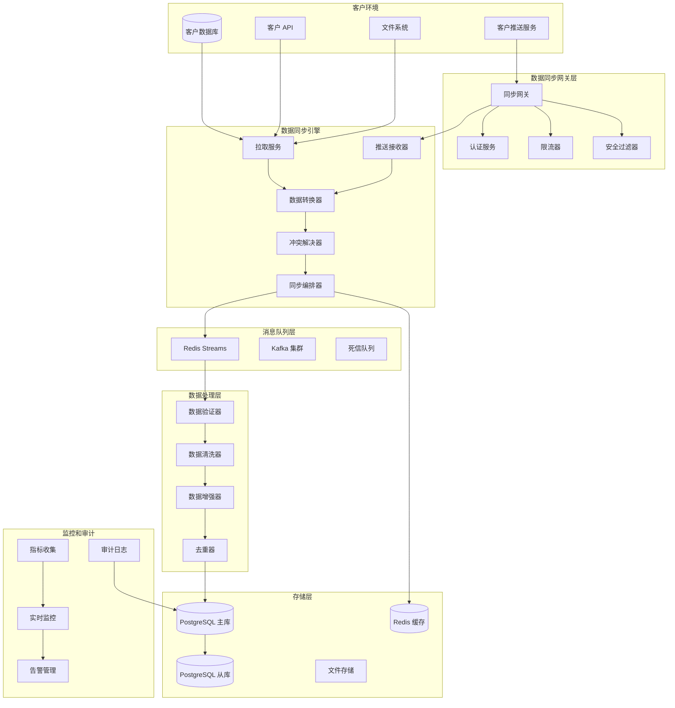
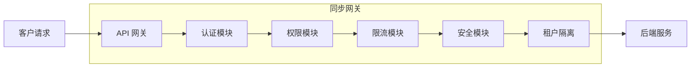
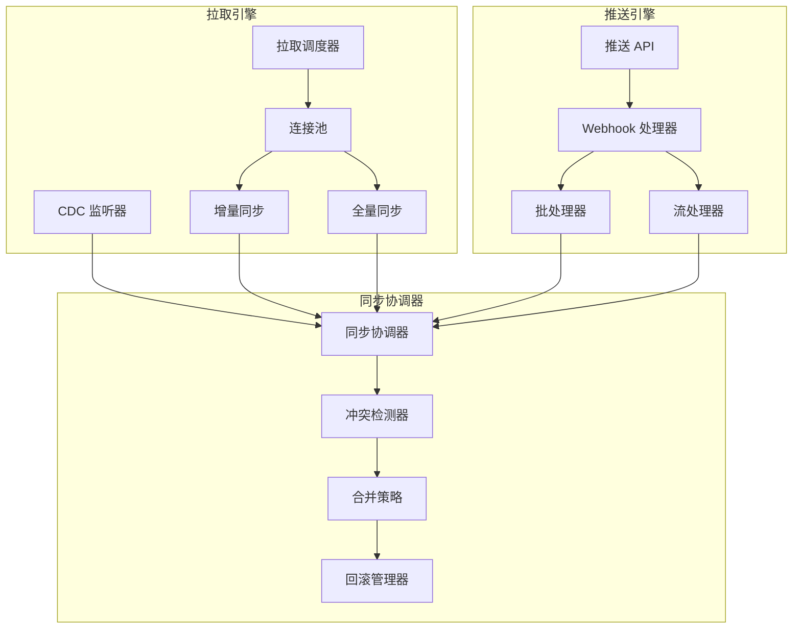
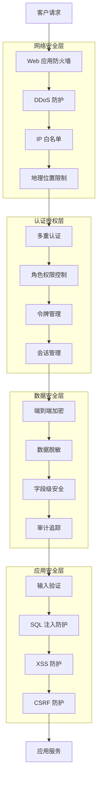

# SuperInsight 数据同步系统 - 设计文档

## 概述

SuperInsight 数据同步系统采用"拉推并举"的双向同步架构，支持主动拉取和被动接收两种数据流模式。系统基于微服务架构设计，提供高可用、高性能、高安全的企业级数据同步解决方案，确保数据在客户系统和 SuperInsight 平台之间的安全、实时、可靠传输。

## 架构设计

### 整体架构



### 核心组件架构

#### 1. 数据同步网关 (Sync Gateway)



#### 2. 双向同步引擎



## 组件和接口

### 1. 数据同步网关 (Sync Gateway)

**职责**: 统一数据同步入口，提供认证、授权、限流、安全控制

**接口设计**:
```python
class SyncGateway:
    def authenticate_request(self, request: SyncRequest) -> AuthResult
    def authorize_operation(self, user: User, operation: Operation) -> bool
    def apply_rate_limit(self, tenant_id: str, endpoint: str) -> RateLimitResult
    def validate_security(self, request: SyncRequest) -> SecurityResult
    def route_request(self, request: SyncRequest) -> ServiceResponse
```

**核心功能**:
- 多重认证（API Key + JWT Token + OAuth 2.0）
- 细粒度权限控制（租户、表、字段、行级别）
- 智能限流（基于租户、用户、操作类型）
- 安全防护（DDoS 防护、SQL 注入检测、XSS 防护）

### 2. 主动拉取服务 (Pull Service)

**职责**: 主动从客户系统拉取数据，支持多种数据源和同步模式

**接口设计**:
```python
class PullService:
    def create_pull_job(self, config: PullConfig) -> PullJob
    def execute_full_sync(self, job_id: str) -> SyncResult
    def execute_incremental_sync(self, job_id: str) -> SyncResult
    def setup_cdc_listener(self, config: CDCConfig) -> CDCListener
    def get_sync_status(self, job_id: str) -> SyncStatus
    def pause_sync_job(self, job_id: str) -> bool
    def resume_sync_job(self, job_id: str) -> bool
```

**数据源连接器**:
```python
# 数据库连接器
class DatabaseConnector:
    def connect_mysql(self, config: MySQLConfig) -> MySQLConnection
    def connect_postgresql(self, config: PostgreSQLConfig) -> PostgreSQLConnection
    def connect_oracle(self, config: OracleConfig) -> OracleConnection
    def connect_mongodb(self, config: MongoDBConfig) -> MongoDBConnection

# API 连接器
class APIConnector:
    def connect_rest_api(self, config: RESTConfig) -> RESTConnection
    def connect_graphql_api(self, config: GraphQLConfig) -> GraphQLConnection
    def connect_soap_api(self, config: SOAPConfig) -> SOAPConnection

# 文件连接器
class FileConnector:
    def connect_ftp(self, config: FTPConfig) -> FTPConnection
    def connect_sftp(self, config: SFTPConfig) -> SFTPConnection
    def connect_s3(self, config: S3Config) -> S3Connection
    def connect_local_fs(self, config: LocalFSConfig) -> LocalFSConnection
```

### 3. 推送接收服务 (Push Receiver)

**职责**: 接收客户推送的数据，支持多种推送方式和数据格式

**接口设计**:
```python
class PushReceiver:
    def receive_batch_data(self, data: BatchData) -> ReceiveResult
    def receive_stream_data(self, stream: DataStream) -> ReceiveResult
    def receive_webhook_data(self, webhook: WebhookData) -> ReceiveResult
    def receive_file_upload(self, file: FileUpload) -> ReceiveResult
    def validate_push_data(self, data: PushData) -> ValidationResult
    def acknowledge_receipt(self, receipt_id: str) -> AckResult
```

**推送 API 端点**:
```python
# REST API 端点
@app.post("/api/v1/sync/push/batch")
async def push_batch_data(data: BatchPushRequest) -> BatchPushResponse

@app.post("/api/v1/sync/push/stream")
async def push_stream_data(stream: StreamPushRequest) -> StreamPushResponse

@app.post("/api/v1/sync/push/webhook")
async def receive_webhook(webhook: WebhookRequest) -> WebhookResponse

@app.post("/api/v1/sync/push/file")
async def upload_file(file: UploadFile) -> FileUploadResponse

# WebSocket 端点
@app.websocket("/ws/sync/push/realtime")
async def realtime_push(websocket: WebSocket) -> None
```

### 4. 数据转换器 (Data Transformer)

**职责**: 处理数据格式转换、清洗、验证和标准化

**接口设计**:
```python
class DataTransformer:
    def transform_format(self, data: RawData, target_format: DataFormat) -> TransformedData
    def clean_data(self, data: RawData, rules: CleaningRules) -> CleanedData
    def validate_schema(self, data: RawData, schema: DataSchema) -> ValidationResult
    def apply_mapping(self, data: RawData, mapping: FieldMapping) -> MappedData
    def enrich_data(self, data: RawData, enrichment: EnrichmentRules) -> EnrichedData
```

**转换规则引擎**:
```python
class TransformationEngine:
    def create_rule(self, rule_config: RuleConfig) -> TransformationRule
    def apply_rules(self, data: RawData, rules: List[TransformationRule]) -> TransformedData
    def validate_rule(self, rule: TransformationRule, sample_data: RawData) -> RuleValidationResult
    def optimize_rules(self, rules: List[TransformationRule]) -> OptimizedRules
```

### 5. 冲突解决器 (Conflict Resolver)

**职责**: 检测和解决数据冲突，确保数据一致性

**接口设计**:
```python
class ConflictResolver:
    def detect_conflicts(self, new_data: Data, existing_data: Data) -> List[Conflict]
    def resolve_conflict(self, conflict: Conflict, strategy: ResolutionStrategy) -> Resolution
    def apply_resolution(self, resolution: Resolution) -> ResolutionResult
    def create_merge_plan(self, conflicts: List[Conflict]) -> MergePlan
    def execute_merge(self, merge_plan: MergePlan) -> MergeResult
```

**冲突解决策略**:
```python
class ResolutionStrategy:
    TIMESTAMP_PRIORITY = "timestamp_priority"  # 时间戳优先
    SOURCE_PRIORITY = "source_priority"        # 数据源优先
    BUSINESS_RULE = "business_rule"            # 业务规则优先
    MANUAL_REVIEW = "manual_review"            # 人工审核
    MERGE_FIELDS = "merge_fields"              # 字段合并
    KEEP_BOTH = "keep_both"                    # 保留双方
```

### 6. 实时监控器 (Real-Time Monitor)

**职责**: 实时监控同步状态、性能指标和系统健康

**接口设计**:
```python
class RealTimeMonitor:
    def get_sync_metrics(self, tenant_id: str) -> SyncMetrics
    def get_performance_stats(self, time_range: TimeRange) -> PerformanceStats
    def get_error_statistics(self, filters: ErrorFilters) -> ErrorStats
    def create_alert_rule(self, rule: AlertRule) -> AlertRuleResult
    def get_system_health(self) -> SystemHealth
```

**监控指标**:
```python
@dataclass
class SyncMetrics:
    total_records_synced: int
    sync_throughput: float  # records/second
    sync_latency: float     # milliseconds
    error_rate: float       # percentage
    active_connections: int
    queue_depth: int
    memory_usage: float
    cpu_usage: float
```

## 数据模型

### 核心数据结构

```python
# 同步作业配置
@dataclass
class SyncJobConfig:
    job_id: str
    tenant_id: str
    job_name: str
    job_type: SyncJobType  # PULL, PUSH, BIDIRECTIONAL
    source_config: SourceConfig
    target_config: TargetConfig
    sync_mode: SyncMode    # FULL, INCREMENTAL, REALTIME
    schedule: ScheduleConfig
    transformation_rules: List[TransformationRule]
    conflict_resolution: ConflictResolutionConfig
    security_config: SecurityConfig
    created_at: datetime
    updated_at: datetime

# 数据源配置
@dataclass
class SourceConfig:
    source_type: SourceType  # DATABASE, API, FILE, WEBHOOK
    connection_config: ConnectionConfig
    data_selection: DataSelectionConfig
    authentication: AuthConfig
    encryption: EncryptionConfig

# 同步结果
@dataclass
class SyncResult:
    job_id: str
    execution_id: str
    status: SyncStatus  # SUCCESS, FAILED, PARTIAL, CANCELLED
    start_time: datetime
    end_time: datetime
    records_processed: int
    records_succeeded: int
    records_failed: int
    errors: List[SyncError]
    performance_metrics: PerformanceMetrics
```

### 数据库设计

```sql
-- 同步作业表
CREATE TABLE sync_jobs (
    id UUID PRIMARY KEY DEFAULT gen_random_uuid(),
    tenant_id VARCHAR(100) NOT NULL,
    job_name VARCHAR(200) NOT NULL,
    job_type VARCHAR(50) NOT NULL,
    job_config JSONB NOT NULL,
    status VARCHAR(50) DEFAULT 'ACTIVE',
    created_at TIMESTAMP DEFAULT NOW(),
    updated_at TIMESTAMP DEFAULT NOW()
);

-- 同步执行记录表
CREATE TABLE sync_executions (
    id UUID PRIMARY KEY DEFAULT gen_random_uuid(),
    job_id UUID REFERENCES sync_jobs(id),
    execution_type VARCHAR(50) NOT NULL,
    status VARCHAR(50) NOT NULL,
    start_time TIMESTAMP NOT NULL,
    end_time TIMESTAMP,
    records_processed INTEGER DEFAULT 0,
    records_succeeded INTEGER DEFAULT 0,
    records_failed INTEGER DEFAULT 0,
    error_details JSONB,
    performance_metrics JSONB,
    created_at TIMESTAMP DEFAULT NOW()
);

-- 数据冲突记录表
CREATE TABLE data_conflicts (
    id UUID PRIMARY KEY DEFAULT gen_random_uuid(),
    job_id UUID REFERENCES sync_jobs(id),
    execution_id UUID REFERENCES sync_executions(id),
    conflict_type VARCHAR(50) NOT NULL,
    conflict_data JSONB NOT NULL,
    resolution_strategy VARCHAR(50),
    resolution_result JSONB,
    status VARCHAR(50) DEFAULT 'PENDING',
    created_at TIMESTAMP DEFAULT NOW(),
    resolved_at TIMESTAMP
);

-- 同步审计日志表
CREATE TABLE sync_audit_logs (
    id UUID PRIMARY KEY DEFAULT gen_random_uuid(),
    tenant_id VARCHAR(100) NOT NULL,
    job_id UUID,
    operation_type VARCHAR(50) NOT NULL,
    operation_details JSONB NOT NULL,
    user_id VARCHAR(100),
    ip_address INET,
    user_agent TEXT,
    result VARCHAR(50) NOT NULL,
    created_at TIMESTAMP DEFAULT NOW()
);

-- 创建索引优化查询
CREATE INDEX idx_sync_jobs_tenant ON sync_jobs(tenant_id);
CREATE INDEX idx_sync_executions_job ON sync_executions(job_id);
CREATE INDEX idx_sync_executions_status ON sync_executions(status);
CREATE INDEX idx_data_conflicts_job ON data_conflicts(job_id);
CREATE INDEX idx_sync_audit_tenant_time ON sync_audit_logs(tenant_id, created_at);
```

## 安全设计

### 1. 多层安全架构



### 2. 权限控制矩阵

```python
class PermissionMatrix:
    """权限控制矩阵"""
    
    # 租户级权限
    TENANT_ADMIN = "tenant:admin"
    TENANT_READ = "tenant:read"
    TENANT_WRITE = "tenant:write"
    
    # 同步作业权限
    SYNC_JOB_CREATE = "sync_job:create"
    SYNC_JOB_READ = "sync_job:read"
    SYNC_JOB_UPDATE = "sync_job:update"
    SYNC_JOB_DELETE = "sync_job:delete"
    SYNC_JOB_EXECUTE = "sync_job:execute"
    
    # 数据权限
    DATA_READ = "data:read"
    DATA_WRITE = "data:write"
    DATA_DELETE = "data:delete"
    DATA_EXPORT = "data:export"
    
    # 系统权限
    SYSTEM_MONITOR = "system:monitor"
    SYSTEM_CONFIG = "system:config"
    SYSTEM_AUDIT = "system:audit"
```

### 3. 数据加密策略

```python
class EncryptionManager:
    """数据加密管理器"""
    
    def encrypt_in_transit(self, data: bytes) -> bytes:
        """传输加密 (TLS 1.3)"""
        pass
    
    def encrypt_at_rest(self, data: bytes, key_id: str) -> bytes:
        """存储加密 (AES-256-GCM)"""
        pass
    
    def encrypt_field_level(self, field_value: str, field_type: str) -> str:
        """字段级加密"""
        pass
    
    def apply_data_masking(self, data: dict, masking_rules: List[MaskingRule]) -> dict:
        """数据脱敏"""
        pass
```

## 错误处理和恢复

### 1. 错误分类和处理策略

```python
class SyncErrorHandler:
    """同步错误处理器"""
    
    def handle_connection_error(self, error: ConnectionError) -> RecoveryAction:
        """连接错误处理"""
        return RecoveryAction(
            action_type="RETRY_WITH_BACKOFF",
            max_retries=3,
            backoff_strategy="EXPONENTIAL",
            fallback_action="ALERT_ADMIN"
        )
    
    def handle_data_validation_error(self, error: ValidationError) -> RecoveryAction:
        """数据验证错误处理"""
        return RecoveryAction(
            action_type="QUARANTINE_DATA",
            quarantine_location="error_queue",
            notification_required=True
        )
    
    def handle_conflict_error(self, error: ConflictError) -> RecoveryAction:
        """数据冲突错误处理"""
        return RecoveryAction(
            action_type="APPLY_RESOLUTION_STRATEGY",
            strategy=error.resolution_strategy,
            manual_review_required=error.requires_manual_review
        )
    
    def handle_security_error(self, error: SecurityError) -> RecoveryAction:
        """安全错误处理"""
        return RecoveryAction(
            action_type="BLOCK_AND_ALERT",
            block_duration="1h",
            alert_level="CRITICAL",
            audit_log_required=True
        )
```

### 2. 自动恢复机制

```python
class AutoRecoverySystem:
    """自动恢复系统"""
    
    def setup_circuit_breaker(self, service: str, config: CircuitBreakerConfig) -> None:
        """设置断路器"""
        pass
    
    def implement_retry_logic(self, operation: Operation, retry_config: RetryConfig) -> None:
        """实现重试逻辑"""
        pass
    
    def setup_fallback_mechanism(self, primary_service: str, fallback_service: str) -> None:
        """设置降级机制"""
        pass
    
    def implement_health_check(self, service: str, health_check_config: HealthCheckConfig) -> None:
        """实现健康检查"""
        pass
```

## 性能优化

### 1. 同步性能优化策略

```python
class PerformanceOptimizer:
    """性能优化器"""
    
    def optimize_batch_size(self, job_config: SyncJobConfig) -> int:
        """优化批处理大小"""
        pass
    
    def implement_parallel_processing(self, job_config: SyncJobConfig) -> ParallelConfig:
        """实现并行处理"""
        pass
    
    def setup_connection_pooling(self, source_config: SourceConfig) -> ConnectionPool:
        """设置连接池"""
        pass
    
    def implement_data_compression(self, data: bytes) -> bytes:
        """实现数据压缩"""
        pass
    
    def setup_caching_strategy(self, cache_config: CacheConfig) -> CacheManager:
        """设置缓存策略"""
        pass
```

### 2. 监控和调优

```python
class PerformanceMonitor:
    """性能监控器"""
    
    def collect_metrics(self) -> PerformanceMetrics:
        """收集性能指标"""
        pass
    
    def analyze_bottlenecks(self, metrics: PerformanceMetrics) -> List[Bottleneck]:
        """分析性能瓶颈"""
        pass
    
    def generate_optimization_recommendations(self, bottlenecks: List[Bottleneck]) -> List[Recommendation]:
        """生成优化建议"""
        pass
    
    def auto_tune_parameters(self, job_id: str, metrics: PerformanceMetrics) -> TuningResult:
        """自动调优参数"""
        pass
```

## 部署架构

### 1. 微服务部署

```yaml
# docker-compose.yml
version: '3.8'
services:
  sync-gateway:
    image: superinsight/sync-gateway:latest
    ports:
      - "8080:8080"
    environment:
      - REDIS_URL=redis://redis:6379
      - POSTGRES_URL=postgresql://postgres:5432/superinsight
    depends_on:
      - redis
      - postgres
  
  pull-service:
    image: superinsight/pull-service:latest
    environment:
      - REDIS_URL=redis://redis:6379
      - POSTGRES_URL=postgresql://postgres:5432/superinsight
    depends_on:
      - redis
      - postgres
  
  push-receiver:
    image: superinsight/push-receiver:latest
    ports:
      - "8081:8081"
    environment:
      - REDIS_URL=redis://redis:6379
      - POSTGRES_URL=postgresql://postgres:5432/superinsight
    depends_on:
      - redis
      - postgres
  
  data-transformer:
    image: superinsight/data-transformer:latest
    environment:
      - REDIS_URL=redis://redis:6379
      - POSTGRES_URL=postgresql://postgres:5432/superinsight
    depends_on:
      - redis
      - postgres
  
  conflict-resolver:
    image: superinsight/conflict-resolver:latest
    environment:
      - REDIS_URL=redis://redis:6379
      - POSTGRES_URL=postgresql://postgres:5432/superinsight
    depends_on:
      - redis
      - postgres
  
  real-time-monitor:
    image: superinsight/real-time-monitor:latest
    ports:
      - "8082:8082"
    environment:
      - REDIS_URL=redis://redis:6379
      - POSTGRES_URL=postgresql://postgres:5432/superinsight
    depends_on:
      - redis
      - postgres
  
  redis:
    image: redis:7-alpine
    ports:
      - "6379:6379"
  
  postgres:
    image: postgres:15
    environment:
      - POSTGRES_DB=superinsight
      - POSTGRES_USER=postgres
      - POSTGRES_PASSWORD=password
    ports:
      - "5432:5432"
    volumes:
      - postgres_data:/var/lib/postgresql/data

volumes:
  postgres_data:
```

### 2. Kubernetes 部署

```yaml
# k8s-deployment.yaml
apiVersion: apps/v1
kind: Deployment
metadata:
  name: sync-gateway
spec:
  replicas: 3
  selector:
    matchLabels:
      app: sync-gateway
  template:
    metadata:
      labels:
        app: sync-gateway
    spec:
      containers:
      - name: sync-gateway
        image: superinsight/sync-gateway:latest
        ports:
        - containerPort: 8080
        env:
        - name: REDIS_URL
          value: "redis://redis-service:6379"
        - name: POSTGRES_URL
          value: "postgresql://postgres-service:5432/superinsight"
        resources:
          requests:
            memory: "256Mi"
            cpu: "250m"
          limits:
            memory: "512Mi"
            cpu: "500m"
        livenessProbe:
          httpGet:
            path: /health
            port: 8080
          initialDelaySeconds: 30
          periodSeconds: 10
        readinessProbe:
          httpGet:
            path: /ready
            port: 8080
          initialDelaySeconds: 5
          periodSeconds: 5
```

## 测试策略

### 单元测试

**测试范围**:
- 各个服务组件的核心逻辑
- 数据转换和验证算法
- 冲突检测和解决策略
- 安全控制和权限验证

### 集成测试

**测试场景**:
- 端到端数据同步流程
- 多数据源连接和同步
- 冲突解决和数据合并
- 安全认证和权限控制

### 性能测试

**测试指标**:
- 同步吞吐量: > 10,000 records/second
- 同步延迟: < 5 seconds (实时同步)
- 并发连接: > 1,000 concurrent connections
- 系统可用性: > 99.9%

### 安全测试

**测试内容**:
- 认证和授权机制
- 数据加密和脱敏
- SQL 注入和 XSS 防护
- DDoS 攻击防护