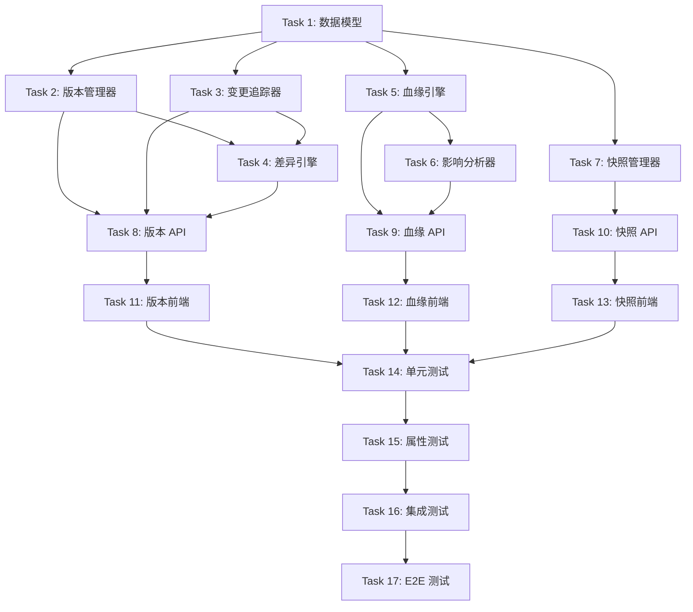

# Tasks Document: Data Version & Lineage (数据版本与血缘)

## Overview

本文档定义 Data Version & Lineage 模块的实施任务，包括数据版本控制、变更追踪、血缘追踪、影响分析、快照管理和差异比较功能。

## Task Dependencies

## Tasks

- [x] 1. 数据模型和数据库迁移
  - 创建版本控制和血缘追踪相关的数据库模型
  - 文件: `src/models/versioning.py`, `alembic/versions/xxx_add_versioning_tables.py`
  - [x] 1.1 创建 DataVersion 模型（版本表）
  - [x] 1.2 创建 ChangeRecord 模型（变更记录表）
  - [x] 1.3 创建 Snapshot 模型（快照表）
  - [x] 1.4 创建 SnapshotSchedule 模型（快照调度表）
  - [x] 1.5 创建数据库迁移脚本
  - [x] 1.6 创建必要的索引和约束
  - _Requirements: 1, 2, 5_

- [x] 2. 版本管理器实现
  - 实现数据版本控制核心功能
  - 依赖: Task 1
  - 文件: `src/versioning/version_manager.py`
  - [x] 2.1 实现 create_version 方法（创建新版本）
  - [x] 2.2 实现语义化版本号计算（major.minor.patch）
  - [x] 2.3 实现 get_version 方法（获取指定版本）
  - [x] 2.4 实现 get_version_history 方法（获取版本历史）
  - [x] 2.5 实现 add_tag 方法（添加版本标签）
  - [x] 2.6 实现 rollback 方法（版本回滚）
  - _Requirements: 1_

- [x] 3. 变更追踪器实现
  - 实现数据变更追踪功能
  - 依赖: Task 1
  - 文件: `src/versioning/change_tracker.py`
  - [x] 3.1 实现 track_change 方法（记录变更）
  - [x] 3.2 实现变更类型识别（创建/更新/删除）
  - [x] 3.3 实现变更前后数据快照存储
  - [x] 3.4 实现 get_changes 方法（查询变更历史）
  - [x] 3.5 实现 get_entity_timeline 方法（获取实体时间线）
  - [x] 3.6 实现差异计算（_compute_diff）
  - _Requirements: 2_

- [x] 4. 差异引擎实现
  - 实现版本差异计算和合并功能
  - 依赖: Task 2, Task 3
  - 文件: `src/versioning/diff_engine.py`
  - [x] 4.1 实现 compute_diff 方法（计算差异）
  - [x] 4.2 实现字段级差异（_field_diff）
  - [x] 4.3 实现行级差异（_line_diff）
  - [x] 4.4 实现 three_way_merge 方法（三方合并）
  - [x] 4.5 实现冲突检测和标记
  - [x] 4.6 实现 resolve_conflict 方法（解决冲突）
  - _Requirements: 6_

- [x] 5. 血缘引擎实现
  - 实现数据血缘追踪功能（基于 Neo4j）
  - 依赖: Task 1
  - 文件: `src/versioning/lineage_engine.py`
  - [x] 5.1 实现 add_lineage 方法（添加血缘关系）
  - [x] 5.2 实现 get_upstream 方法（获取上游血缘）
  - [x] 5.3 实现 get_downstream 方法（获取下游血缘）
  - [x] 5.4 实现 get_full_lineage 方法（获取完整血缘图谱）
  - [x] 5.5 实现 find_path 方法（查找血缘路径）
  - [x] 5.6 实现多级血缘追踪（N 级上下游）
  - _Requirements: 3_

- [x] 6. 影响分析器实现
  - 实现数据变更影响分析功能
  - 依赖: Task 5
  - 文件: `src/versioning/impact_analyzer.py`
  - [x] 6.1 实现 analyze_impact 方法（分析变更影响）
  - [x] 6.2 实现影响范围评估（_assess_node_impact）
  - [x] 6.3 实现影响数据量估算（_estimate_affected_records）
  - [x] 6.4 实现风险等级计算（_calculate_risk_level）
  - [x] 6.5 实现 send_impact_alert 方法（发送影响预警）
  - [x] 6.6 实现 visualize_impact 方法（生成可视化数据）
  - _Requirements: 4_

- [x] 7. 快照管理器实现
  - 实现数据快照管理功能
  - 依赖: Task 1
  - 文件: `src/versioning/snapshot_manager.py`
  - [x] 7.1 实现 create_snapshot 方法（创建快照）
  - [x] 7.2 实现全量快照和增量快照
  - [x] 7.3 实现 create_scheduled_snapshot 方法（定时快照）
  - [x] 7.4 实现 restore_from_snapshot 方法（从快照恢复）
  - [x] 7.5 实现 list_snapshots 方法（列出快照）
  - [x] 7.6 实现 apply_retention_policy 方法（保留策略）
  - _Requirements: 5_

- [x] 8. 版本管理 API 实现
  - 实现版本管理相关的 REST API
  - 依赖: Task 2, Task 3, Task 4
  - 文件: `src/api/versioning.py`
  - [x] 8.1 实现 POST /versions/{entity_type}/{entity_id}（创建版本）
  - [x] 8.2 实现 GET /versions/{entity_type}/{entity_id}（获取版本历史）
  - [x] 8.3 实现 GET /versions/{entity_type}/{entity_id}/{version}（获取指定版本）
  - [x] 8.4 实现 POST /versions/{entity_type}/{entity_id}/rollback（回滚版本）
  - [x] 8.5 实现 GET /changes（查询变更历史）
  - [x] 8.6 实现 POST /diff（计算差异）
  - [x] 8.7 实现 POST /merge（三方合并）
  - _Requirements: 1, 2, 6_

- [x] 9. 血缘追踪 API 实现
  - 实现血缘追踪和影响分析相关的 REST API
  - 依赖: Task 5, Task 6
  - 文件: `src/api/lineage.py`
  - [x] 9.1 实现 POST /lineage（添加血缘关系）
  - [x] 9.2 实现 GET /lineage/{entity_type}/{entity_id}/upstream（获取上游血缘）
  - [x] 9.3 实现 GET /lineage/{entity_type}/{entity_id}/downstream（获取下游血缘）
  - [x] 9.4 实现 GET /lineage/{entity_type}/{entity_id}/full（获取完整血缘）
  - [x] 9.5 实现 POST /impact/{entity_type}/{entity_id}/analyze（影响分析）
  - _Requirements: 3, 4_

- [x] 10. 快照管理 API 实现
  - 实现快照管理相关的 REST API
  - 依赖: Task 7
  - 文件: `src/api/snapshots.py`
  - [x] 10.1 实现 POST /snapshots/{entity_type}/{entity_id}（创建快照）
  - [x] 10.2 实现 GET /snapshots（列出快照）
  - [x] 10.3 实现 POST /snapshots/{snapshot_id}/restore（从快照恢复）
  - [x] 10.4 实现 DELETE /snapshots/{snapshot_id}（删除快照）
  - [x] 10.5 实现 POST /snapshots/schedules（创建定时快照）
  - _Requirements: 5_

- [x] 11. 版本管理前端实现
  - 实现版本管理前端界面
  - 依赖: Task 8
  - 文件: `frontend/src/pages/versioning/VersionTimeline.tsx`, `frontend/src/pages/versioning/DiffViewer.tsx`, `frontend/src/services/versioningApi.ts`
  - [x] 11.1 实现版本历史时间线组件
  - [x] 11.2 实现版本对比差异查看组件
  - [x] 11.3 实现版本回滚确认对话框
  - [x] 11.4 实现版本标签管理
  - [x] 11.5 实现版本搜索和筛选
  - [x] 11.6 实现 API 调用服务
  - _Requirements: 7_

- [x] 12. 血缘图谱前端实现
  - 实现血缘图谱可视化前端界面
  - 依赖: Task 9
  - 文件: `frontend/src/pages/versioning/LineageGraph.tsx`, `frontend/src/pages/versioning/ImpactAnalysis.tsx`, `frontend/src/services/lineageApi.ts`
  - [x] 12.1 实现交互式血缘图谱组件（使用 G6 或 AntV）
  - [x] 12.2 实现血缘路径高亮和筛选
  - [x] 12.3 实现影响分析面板
  - [x] 12.4 实现影响范围可视化
  - [x] 12.5 实现图谱导出功能
  - [x] 12.6 实现 API 调用服务
  - _Requirements: 7_

- [x] 13. 快照管理前端实现
  - 实现快照管理前端界面
  - 依赖: Task 10
  - 文件: `frontend/src/pages/versioning/SnapshotManager.tsx`, `frontend/src/services/snapshotApi.ts`
  - [x] 13.1 实现快照列表组件
  - [x] 13.2 实现创建快照对话框
  - [x] 13.3 实现快照恢复确认对话框
  - [x] 13.4 实现定时快照配置界面
  - [x] 13.5 实现保留策略配置
  - [x] 13.6 实现 API 调用服务
  - _Requirements: 7_

- [x] 14. 单元测试
  - 编写版本控制和血缘追踪模块的单元测试
  - 依赖: Task 11, Task 12, Task 13
  - 文件: `tests/unit/test_version_manager.py`, `tests/unit/test_change_tracker.py`, `tests/unit/test_lineage_engine.py`, `tests/unit/test_impact_analyzer.py`, `tests/unit/test_snapshot_manager.py`, `tests/unit/test_diff_engine.py`
  - [x] 14.1 版本管理器单元测试（覆盖率 > 80%）
  - [x] 14.2 变更追踪器单元测试（覆盖率 > 80%）
  - [x] 14.3 血缘引擎单元测试（覆盖率 > 80%）
  - [x] 14.4 影响分析器单元测试（覆盖率 > 80%）
  - [x] 14.5 快照管理器单元测试（覆盖率 > 80%）
  - [x] 14.6 差异引擎单元测试（覆盖率 > 80%）
  - _Requirements: All_

- [x] 15. 属性测试 (Property-Based Testing)
  - 使用 Hypothesis 库编写属性测试，每个属性至少 100 次迭代
  - 依赖: Task 14
  - 文件: `tests/property/test_versioning_properties.py`
  - [x] 15.1 Property 1: 版本号单调递增（100+ 迭代）
  - [x] 15.2 Property 2: 变更追踪完整性（100+ 迭代）
  - [x] 15.3 Property 3: 血缘图谱一致性（100+ 迭代）
  - [x] 15.4 Property 4: 快照恢复幂等性（100+ 迭代）
  - [x] 15.5 Property 5: 差异计算可逆性（100+ 迭代）
  - [x] 15.6 Property 6: 三方合并确定性（100+ 迭代）
  - [x] 15.7 Property 7: 影响分析传递性（100+ 迭代）
  - [x] 15.8 Property 8: 版本回滚正确性（100+ 迭代）
  - _Requirements: All_

- [x] 16. 集成测试
  - 编写版本控制和血缘追踪模块的集成测试
  - 依赖: Task 15
  - 文件: `tests/integration/test_versioning_integration.py`, `tests/integration/test_lineage_integration.py`
  - [x] 16.1 版本创建和回滚集成测试
  - [x] 16.2 变更追踪和查询集成测试
  - [x] 16.3 血缘追踪和查询集成测试
  - [x] 16.4 影响分析集成测试
  - [x] 16.5 快照创建和恢复集成测试
  - [x] 16.6 差异计算和合并集成测试
  - _Requirements: All_

- [x] 17. E2E 测试
  - 编写端到端测试验证完整功能流程
  - 依赖: Task 16
  - 文件: `frontend/e2e/versioning.spec.ts`
  - [x] 17.1 版本历史查看和回滚 E2E 测试
  - [x] 17.2 版本对比和差异查看 E2E 测试
  - [x] 17.3 血缘图谱浏览和交互 E2E 测试
  - [x] 17.4 影响分析流程 E2E 测试
  - [x] 17.5 快照创建和恢复 E2E 测试
  - [x] 17.6 完整工作流 E2E 测试
  - _Requirements: All_

---

## Summary

| Task | 描述 | 依赖 | 预估工时 |
|------|------|------|----------|
| Task 1 | 数据模型和数据库迁移 | - | 4h |
| Task 2 | 版本管理器实现 | Task 1 | 8h |
| Task 3 | 变更追踪器实现 | Task 1 | 6h |
| Task 4 | 差异引擎实现 | Task 2, 3 | 8h |
| Task 5 | 血缘引擎实现 | Task 1 | 10h |
| Task 6 | 影响分析器实现 | Task 5 | 8h |
| Task 7 | 快照管理器实现 | Task 1 | 8h |
| Task 8 | 版本管理 API 实现 | Task 2, 3, 4 | 6h |
| Task 9 | 血缘追踪 API 实现 | Task 5, 6 | 6h |
| Task 10 | 快照管理 API 实现 | Task 7 | 4h |
| Task 11 | 版本管理前端实现 | Task 8 | 10h |
| Task 12 | 血缘图谱前端实现 | Task 9 | 12h |
| Task 13 | 快照管理前端实现 | Task 10 | 8h |
| Task 14 | 单元测试 | Task 11, 12, 13 | 10h |
| Task 15 | 属性测试 | Task 14 | 8h |
| Task 16 | 集成测试 | Task 15 | 8h |
| Task 17 | E2E 测试 | Task 16 | 8h |

**总预估工时**: 122 小时
