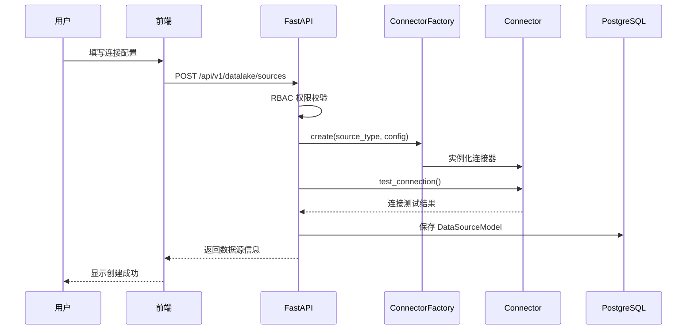
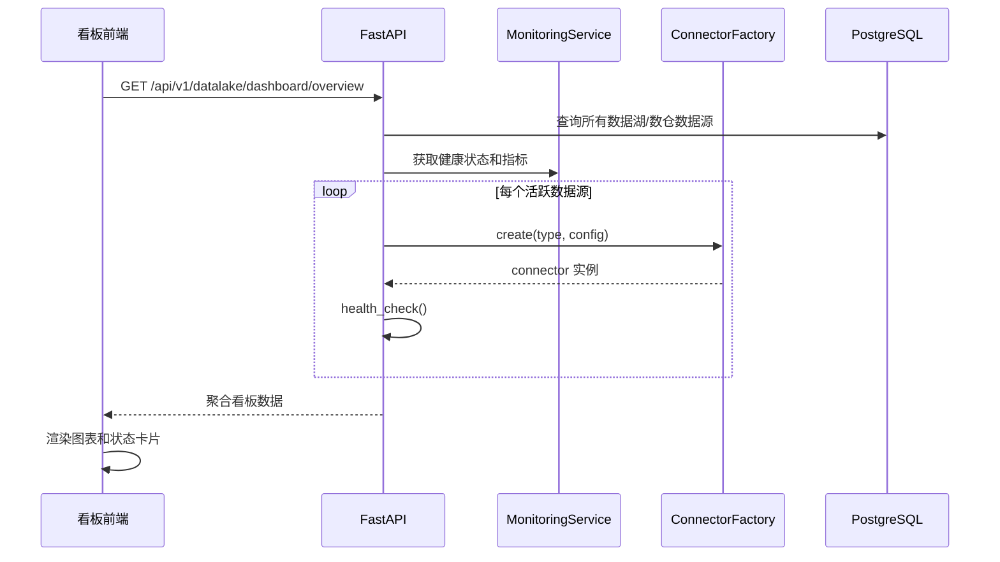

# 设计文档：数据湖/数仓集成与可视化

## 概述

本功能为现有数据同步模块（DataSync）扩展数据湖/数仓连接能力，新增 Hive、ClickHouse、Doris/StarRocks、Spark SQL、Presto/Trino、Delta Lake、Apache Iceberg 等连接器类型，并提供专用的可视化看板用于监控连接状态、数据量趋势、查询性能和数据流向。

后端基于现有 `ConnectorFactory` 工厂模式扩展新连接器，前端在 DataSync 模块下新增数据湖/数仓管理页面和可视化看板。RBAC 权限复用现有安全模型，确保 ADMIN 和 TECHNICAL_EXPERT 角色可管理，所有认证用户可查看看板。

## 架构

```mermaid
graph TD
    subgraph 前端 React/TypeScript
        DLPage[数据湖/数仓管理页]
        Dashboard[可视化看板]
        SchemaBrowser[Schema 浏览器]
    end

    subgraph API层 FastAPI
        DLRouter[/api/v1/datalake/*]
        DashRouter[/api/v1/datalake/dashboard/*]
    end

    subgraph 连接器层
        CF[ConnectorFactory]
        HC[HiveConnector]
        CKC[ClickHouseConnector]
        DC[DorisConnector]
        SPC[SparkSQLConnector]
        PTC[PrestoTrinoConnector]
        DLC[DeltaLakeConnector]
        IC[IcebergConnector]
    end

    subgraph 数据层
        PG[(PostgreSQL)]
        Monitor[MonitoringService]
    end

    DLPage --> DLRouter
    Dashboard --> DashRouter
    SchemaBrowser --> DLRouter
    DLRouter --> CF
    DashRouter --> Monitor
    CF --> HC & CKC & DC & SPC & PTC & DLC & IC
    DLRouter --> PG
    Monitor --> PG
```

## 主要工作流时序图

### 连接器创建与测试



### 看板数据查询



## 组件与接口

### 组件 1：DataSourceType 枚举扩展

**目的**：在现有枚举中新增数据湖/数仓类型

```python
# 新增到 src/sync/models.py 的 DataSourceType 枚举
class DataSourceType(str, enum.Enum):
    # ... 现有类型保持不变 ...
    HIVE = "hive"
    CLICKHOUSE = "clickhouse"
    DORIS = "doris"           # 兼容 StarRocks
    SPARK_SQL = "spark_sql"
    PRESTO_TRINO = "presto_trino"
    DELTA_LAKE = "delta_lake"
    ICEBERG = "iceberg"
```

### 组件 2：数据湖/数仓连接器基类

**目的**：为数据湖/数仓连接器提供公共抽象，继承 `BaseConnector`

```python
# src/sync/connectors/datalake/base.py
class DatalakeConnectorConfig(ConnectorConfig):
    """数据湖/数仓连接器通用配置"""
    host: str
    port: int
    database: str
    username: str
    password: str
    use_ssl: bool = False
    query_timeout: int = 300       # 查询超时（秒）
    max_query_rows: int = 100000   # 单次查询最大行数

class DatalakeBaseConnector(BaseConnector):
    """数据湖/数仓连接器基类，扩展 BaseConnector"""

    async def fetch_databases(self) -> List[str]:
        """获取可用数据库列表"""
        ...

    async def fetch_tables(self, database: str) -> List[Dict[str, Any]]:
        """获取指定数据库的表列表，含行数和大小估算"""
        ...

    async def fetch_table_preview(
        self, database: str, table: str, limit: int = 100
    ) -> DataBatch:
        """预览表数据"""
        ...

    async def execute_query(self, sql: str) -> DataBatch:
        """执行自定义 SQL 查询"""
        ...

    async def get_query_metrics(self) -> Dict[str, Any]:
        """获取查询性能指标"""
        ...
```

**职责**：
- 提供数据湖/数仓通用的数据库/表浏览能力
- 统一查询超时和行数限制
- 收集查询性能指标

### 组件 3：具体连接器实现

**目的**：各数据湖/数仓的具体连接器

```python
# src/sync/connectors/datalake/clickhouse.py
class ClickHouseConfig(DatalakeConnectorConfig):
    port: int = 9000
    http_port: int = 8123
    use_http: bool = True    # 默认使用 HTTP 接口
    cluster: Optional[str] = None

class ClickHouseConnector(DatalakeBaseConnector):
    """ClickHouse 连接器，支持 HTTP 和 Native 协议"""
    ...

# src/sync/connectors/datalake/hive.py
class HiveConfig(DatalakeConnectorConfig):
    port: int = 10000
    auth_mechanism: str = "PLAIN"  # PLAIN, KERBEROS, NOSASL
    kerberos_service_name: Optional[str] = None

class HiveConnector(DatalakeBaseConnector):
    """Hive 连接器，支持 HiveServer2 Thrift 协议"""
    ...

# src/sync/connectors/datalake/doris.py
class DorisConfig(DatalakeConnectorConfig):
    port: int = 9030          # FE query port
    http_port: int = 8030     # FE HTTP port
    backend_port: int = 8040  # BE HTTP port
    compatible_mode: str = "doris"  # doris | starrocks

class DorisConnector(DatalakeBaseConnector):
    """Doris/StarRocks 连接器，兼容 MySQL 协议"""
    ...
```

每个连接器在模块末尾注册到工厂：
```python
ConnectorFactory.register("clickhouse", ClickHouseConnector)
ConnectorFactory.register("hive", HiveConnector)
ConnectorFactory.register("doris", DorisConnector)
```

### 组件 4：REST API 路由

**目的**：提供数据湖/数仓管理和看板数据的 API 端点

```python
# src/sync/connectors/datalake/router.py
from fastapi import APIRouter, Depends

router = APIRouter(prefix="/api/v1/datalake", tags=["datalake"])

# --- 数据源管理 ---
@router.post("/sources")
async def create_datalake_source(config: DatalakeSourceCreate) -> DatalakeSourceResponse:
    """创建数据湖/数仓数据源"""

@router.get("/sources")
async def list_datalake_sources() -> List[DatalakeSourceResponse]:
    """列出所有数据湖/数仓数据源"""

@router.get("/sources/{source_id}")
async def get_datalake_source(source_id: UUID) -> DatalakeSourceResponse:
    """获取单个数据源详情"""

@router.put("/sources/{source_id}")
async def update_datalake_source(source_id: UUID, config: DatalakeSourceUpdate) -> DatalakeSourceResponse:
    """更新数据源配置"""

@router.delete("/sources/{source_id}")
async def delete_datalake_source(source_id: UUID) -> None:
    """删除数据源"""

@router.post("/sources/{source_id}/test")
async def test_datalake_connection(source_id: UUID) -> ConnectionTestResult:
    """测试数据源连接"""

# --- Schema 浏览 ---
@router.get("/sources/{source_id}/databases")
async def list_databases(source_id: UUID) -> List[str]:
    """获取数据库列表"""

@router.get("/sources/{source_id}/tables")
async def list_tables(source_id: UUID, database: str) -> List[TableInfo]:
    """获取表列表"""

@router.get("/sources/{source_id}/schema")
async def get_table_schema(source_id: UUID, database: str, table: str) -> TableSchema:
    """获取表结构"""

@router.get("/sources/{source_id}/preview")
async def preview_table_data(source_id: UUID, database: str, table: str, limit: int = 100) -> DataPreview:
    """预览表数据"""

# --- 看板数据 ---
@router.get("/dashboard/overview")
async def get_dashboard_overview() -> DashboardOverview:
    """获取看板概览数据"""

@router.get("/dashboard/health")
async def get_health_status() -> List[SourceHealthStatus]:
    """获取所有数据源健康状态"""

@router.get("/dashboard/volume-trends")
async def get_volume_trends(period: str = "7d") -> VolumeTrendData:
    """获取数据量趋势"""

@router.get("/dashboard/query-performance")
async def get_query_performance(source_id: Optional[UUID] = None) -> QueryPerformanceData:
    """获取查询性能指标"""

@router.get("/dashboard/data-flow")
async def get_data_flow() -> DataFlowGraph:
    """获取数据流向图"""
```

### 组件 5：RBAC 权限集成

**目的**：为数据湖/数仓功能添加权限控制

```python
# 扩展 SyncResourceType 枚举
class SyncResourceType(str, enum.Enum):
    # ... 现有类型 ...
    DATALAKE_SOURCE = "datalake_source"
    DATALAKE_DASHBOARD = "datalake_dashboard"

# 权限规则：
# ADMIN, TECHNICAL_EXPERT → 完全管理权限（CRUD + 执行查询）
# BUSINESS_EXPERT → 只读 + 看板查看
# VIEWER → 仅看板查看
```

### 组件 6：前端页面结构

**目的**：新增数据湖/数仓管理和可视化页面

```
frontend/src/pages/DataSync/Datalake/
├── index.tsx              # 数据湖/数仓管理主页
├── Sources/
│   └── index.tsx          # 数据源列表与管理
├── Dashboard/
│   └── index.tsx          # 可视化看板
└── SchemaBrowser/
    └── index.tsx          # Schema/表浏览器
```

## 数据模型

### DatalakeMetricsModel（新增）

```python
# src/sync/connectors/datalake/models.py
class DatalakeMetricsModel(Base):
    """数据湖/数仓指标记录表"""
    __tablename__ = "datalake_metrics"

    id: Mapped[UUID] = mapped_column(UUID(as_uuid=True), primary_key=True, default=uuid4)
    source_id: Mapped[UUID] = mapped_column(UUID(as_uuid=True), ForeignKey("data_sources.id"))
    tenant_id: Mapped[str] = mapped_column(String(100), nullable=False, index=True)

    # 指标数据
    metric_type: Mapped[str] = mapped_column(String(50), nullable=False)  # health, volume, query_perf
    metric_data: Mapped[dict] = mapped_column(JSONB, nullable=False)

    # 时间戳
    recorded_at: Mapped[datetime] = mapped_column(DateTime(timezone=True), server_default=func.now(), index=True)
```

**验证规则**：
- `source_id` 必须引用有效的 `data_sources.id`
- `metric_type` 限定为 `health`、`volume`、`query_perf`
- `metric_data` 结构根据 `metric_type` 不同而不同

### API 请求/响应模型

```python
# Pydantic schemas
class DatalakeSourceCreate(BaseModel):
    name: str = Field(..., min_length=1, max_length=200)
    description: Optional[str] = None
    source_type: DataSourceType  # 限定为数据湖/数仓类型
    connection_config: Dict[str, Any]

class DatalakeSourceResponse(BaseModel):
    id: UUID
    name: str
    source_type: DataSourceType
    status: DataSourceStatus
    health_check_status: Optional[str]
    last_health_check: Optional[datetime]
    created_at: datetime

class DashboardOverview(BaseModel):
    total_sources: int
    active_sources: int
    error_sources: int
    total_data_volume_gb: float
    avg_query_latency_ms: float
    sources: List[SourceSummary]

class SourceHealthStatus(BaseModel):
    source_id: UUID
    source_name: str
    source_type: DataSourceType
    status: str  # healthy, degraded, down
    latency_ms: float
    last_check: datetime
    error_message: Optional[str] = None

class VolumeTrendData(BaseModel):
    period: str
    data_points: List[VolumeDataPoint]

class VolumeDataPoint(BaseModel):
    timestamp: datetime
    source_id: UUID
    source_name: str
    volume_gb: float
    row_count: int

class QueryPerformanceData(BaseModel):
    avg_latency_ms: float
    p95_latency_ms: float
    p99_latency_ms: float
    total_queries: int
    failed_queries: int
    queries_by_source: List[SourceQueryStats]

class DataFlowGraph(BaseModel):
    nodes: List[FlowNode]
    edges: List[FlowEdge]

class FlowNode(BaseModel):
    id: str
    label: str
    type: str  # source, warehouse, lake
    status: str

class FlowEdge(BaseModel):
    source: str
    target: str
    volume_gb: float
    sync_status: str
```

## 算法伪代码

### 看板数据聚合算法

```python
async def aggregate_dashboard_data(tenant_id: str) -> DashboardOverview:
    """
    聚合看板概览数据
    
    前置条件：
    - tenant_id 非空
    - 数据库连接可用
    
    后置条件：
    - 返回完整的 DashboardOverview
    - total_sources = active_sources + error_sources + inactive_sources
    - avg_query_latency_ms >= 0
    """
    # Step 1: 查询所有数据湖/数仓类型的数据源
    DATALAKE_TYPES = {
        DataSourceType.HIVE, DataSourceType.CLICKHOUSE,
        DataSourceType.DORIS, DataSourceType.SPARK_SQL,
        DataSourceType.PRESTO_TRINO, DataSourceType.DELTA_LAKE,
        DataSourceType.ICEBERG,
    }
    sources = await db.query(DataSourceModel).filter(
        tenant_id=tenant_id,
        source_type__in=DATALAKE_TYPES
    ).all()

    # Step 2: 并发检查每个数据源的健康状态
    health_results = []
    for source in sources:
        connector = ConnectorFactory.create(source.source_type, source.connection_config)
        health = await connector.test_connection()
        health_results.append((source, health))

    # Step 3: 聚合指标
    active = sum(1 for _, h in health_results if h["status"] == "connected")
    error = sum(1 for _, h in health_results if h["status"] == "error")

    # Step 4: 查询最近的指标数据
    recent_metrics = await db.query(DatalakeMetricsModel).filter(
        tenant_id=tenant_id,
        recorded_at__gte=now() - timedelta(hours=24)
    ).all()

    volume = sum(m.metric_data.get("volume_gb", 0) for m in recent_metrics if m.metric_type == "volume")
    latencies = [m.metric_data.get("latency_ms", 0) for m in recent_metrics if m.metric_type == "query_perf"]
    avg_latency = mean(latencies) if latencies else 0

    return DashboardOverview(
        total_sources=len(sources),
        active_sources=active,
        error_sources=error,
        total_data_volume_gb=volume,
        avg_query_latency_ms=avg_latency,
        sources=[build_summary(s, h) for s, h in health_results]
    )
```

**循环不变量**：
- `health_results` 中每个元素都包含有效的 `(source, health_dict)` 对
- 聚合计数 `active + error + inactive = len(sources)`

### 连接器创建与注册算法

```python
def register_datalake_connectors():
    """
    注册所有数据湖/数仓连接器到工厂
    
    前置条件：
    - ConnectorFactory 已初始化
    
    后置条件：
    - 所有数据湖/数仓连接器类型已注册
    - ConnectorFactory.list_types() 包含所有新类型
    """
    DATALAKE_CONNECTORS = {
        "hive": HiveConnector,
        "clickhouse": ClickHouseConnector,
        "doris": DorisConnector,
        "spark_sql": SparkSQLConnector,
        "presto_trino": PrestoTrinoConnector,
        "delta_lake": DeltaLakeConnector,
        "iceberg": IcebergConnector,
    }
    for type_name, connector_class in DATALAKE_CONNECTORS.items():
        ConnectorFactory.register(type_name, connector_class)
```

## 示例用法

### 后端：创建并测试 ClickHouse 连接

```python
# 创建 ClickHouse 连接器
config = ClickHouseConfig(
    host="clickhouse.example.com",
    port=9000,
    http_port=8123,
    database="analytics",
    username="reader",
    password="secret",
    use_http=True,
)

async with ClickHouseConnector(config) as conn:
    # 测试连接
    result = await conn.test_connection()
    assert result["status"] == "connected"

    # 浏览 schema
    databases = await conn.fetch_databases()
    tables = await conn.fetch_tables("analytics")

    # 预览数据
    preview = await conn.fetch_table_preview("analytics", "events", limit=50)

    # 获取性能指标
    metrics = await conn.get_query_metrics()
```

### 前端：看板组件

```typescript
// frontend/src/pages/DataSync/Datalake/Dashboard/index.tsx
import { useQuery } from '@tanstack/react-query';
import { Card, Row, Col, Statistic } from 'antd';
import { useTranslation } from 'react-i18next';

const DatalakeDashboard: React.FC = () => {
  const { t } = useTranslation('dataSync');
  const { data: overview } = useQuery({
    queryKey: ['datalake', 'dashboard', 'overview'],
    queryFn: () => api.get('/api/v1/datalake/dashboard/overview'),
  });

  return (
    <Row gutter={[16, 16]}>
      <Col span={6}>
        <Card>
          <Statistic title={t('datalake.totalSources')} value={overview?.total_sources} />
        </Card>
      </Col>
      <Col span={6}>
        <Card>
          <Statistic title={t('datalake.activeSources')} value={overview?.active_sources} />
        </Card>
      </Col>
      <Col span={6}>
        <Card>
          <Statistic title={t('datalake.dataVolume')} value={overview?.total_data_volume_gb} suffix="GB" />
        </Card>
      </Col>
      <Col span={6}>
        <Card>
          <Statistic title={t('datalake.avgLatency')} value={overview?.avg_query_latency_ms} suffix="ms" />
        </Card>
      </Col>
    </Row>
  );
};
```

## Correctness Properties

*A property is a characteristic or behavior that should hold true across all valid executions of a system—essentially, a formal statement about what the system should do. Properties serve as the bridge between human-readable specifications and machine-verifiable correctness guarantees.*

### Property 1: Connector factory completeness

*For any* data source type in DATALAKE_TYPES and any valid configuration for that type, ConnectorFactory.create() should return a connector instance of the correct class that exposes test_connection, fetch_databases, fetch_tables, fetch_table_preview, and execute_query methods.

**Validates: Requirements 1.1, 1.2, 1.4**

### Property 2: Invalid type rejection

*For any* string that is not a registered connector type, ConnectorFactory.create() should raise a type error.

**Validates: Requirement 1.3**

### Property 3: Data source validation round-trip

*For any* valid DatalakeSourceCreate payload, creating a data source via the API and then retrieving it should return an equivalent record. *For any* invalid payload (missing required fields or wrong format), the API should return a 422 error.

**Validates: Requirements 2.1, 2.2**

### Property 4: Tenant isolation

*For any* two tenants A and B, data sources created by tenant A should never appear in tenant B's list results, and tenant B should receive 403 or empty results when accessing tenant A's resources.

**Validates: Requirements 2.3, 7.5**

### Property 5: Cascade deletion

*For any* data source with associated metric records, deleting the data source should also remove all its associated DatalakeMetricsModel records.

**Validates: Requirement 2.5**

### Property 6: Connection test status consistency

*For any* connector, test_connection() should return a result containing a status field (connected or error) and a latency_ms field. When the status is error, the result should also contain a non-empty error detail. After test completion, the DataSourceModel's health_check_status and last_health_check fields should be updated.

**Validates: Requirements 3.1, 3.2, 3.4**

### Property 7: Row limit enforcement

*For any* query result or table preview request, the number of returned rows should not exceed min(requested_limit, max_query_rows) and the preview limit should not exceed 1000.

**Validates: Requirements 4.3, 5.3**

### Property 8: Query timeout protection

*For any* query where execution time exceeds the configured query_timeout value, the connector should cancel the query and return a timeout error.

**Validates: Requirement 5.2**

### Property 9: Dashboard overview numerical invariant

*For any* DashboardOverview, total_sources should equal active_sources + error_sources + remaining inactive sources, and avg_query_latency_ms should be non-negative.

**Validates: Requirements 6.1, 6.2**

### Property 10: Query performance statistics correctness

*For any* set of query latency measurements, the computed avg_latency_ms should equal the arithmetic mean, p95_latency_ms should equal the 95th percentile, and p99_latency_ms should equal the 99th percentile of the input data.

**Validates: Requirement 6.4**

### Property 11: RBAC permission matrix

*For any* combination of user role (ADMIN, TECHNICAL_EXPERT, BUSINESS_EXPERT, VIEWER) and API endpoint, access should be granted if and only if the role has the required permission level. Unauthorized access should return 403.

**Validates: Requirements 7.1, 7.2, 7.3, 7.4**

### Property 12: Sensitive data protection

*For any* data source with password or secret key fields, the stored value in the database should be encrypted (not plaintext), and any API response should contain masked values for these fields.

**Validates: Requirements 8.1, 8.2**

### Property 13: Metrics recording completeness

*For any* completed query execution, the MonitoringService should create a DatalakeMetricsModel record containing query latency and status.

**Validates: Requirement 5.4**

## 错误处理

### 场景 1：连接失败

**条件**：数据湖/数仓服务不可达或认证失败
**响应**：返回 `ConnectionStatus.ERROR`，记录错误详情到 `last_error`
**恢复**：自动重试（最多 3 次，指数退避），更新 `DataSourceModel.status` 为 `ERROR`

### 场景 2：查询超时

**条件**：SQL 查询执行时间超过 `query_timeout`
**响应**：取消查询，返回 408 超时错误
**恢复**：建议用户优化查询或增加超时时间

### 场景 3：数据源配置无效

**条件**：用户提交的连接配置缺少必填字段或格式错误
**响应**：返回 422 验证错误，包含具体字段错误信息
**恢复**：前端表单高亮错误字段

### 场景 4：权限不足

**条件**：用户角色无权执行请求的操作
**响应**：返回 403 Forbidden
**恢复**：前端隐藏无权限的操作按钮，提示联系管理员

## 测试策略

### 单元测试

- 每个连接器的 `connect()`、`disconnect()`、`health_check()`、`fetch_schema()` 方法
- `DatalakeSourceCreate` / `DatalakeSourceResponse` 的 Pydantic 验证
- 看板数据聚合逻辑的边界情况（0 个数据源、全部异常等）

### 属性测试

**属性测试库**：Hypothesis (Python)

- 连接器工厂对所有注册类型都能正确创建实例
- 任意有效配置创建的连接器都能正确序列化/反序列化
- 看板聚合结果的数值一致性（总数 = 各状态之和）

### 集成测试

- API 端点的 RBAC 权限校验（不同角色访问不同端点）
- 连接器与真实数据库的连接测试（使用 Docker 容器）
- 前端页面的 E2E 测试（创建数据源 → 测试连接 → 查看看板）

## 性能考虑

- 健康检查并发执行，使用 `asyncio.gather()` 避免串行等待
- 看板数据缓存 30 秒，避免频繁查询
- Schema 信息缓存到连接器实例，减少元数据查询
- 大表预览限制默认 100 行，最大 1000 行
- 查询性能指标异步写入，不阻塞主请求

## 安全考虑

- 连接配置中的密码字段加密存储（复用现有 `connection_config` 加密机制）
- SQL 查询执行使用参数化查询，防止注入
- Schema 浏览和数据预览受租户隔离约束
- 敏感字段（密码、密钥）在 API 响应中脱敏
- Kerberos 认证支持（Hive 场景）

## 依赖

### 后端 Python 包

| 包名 | 用途 |
|------|------|
| `clickhouse-driver` / `clickhouse-connect` | ClickHouse Native/HTTP 连接 |
| `pyhive` + `thrift` | Hive 连接 |
| `pymysql` / `aiomysql` | Doris/StarRocks MySQL 协议连接 |
| `pyspark` (可选) | Spark SQL 连接 |
| `trino` | Presto/Trino 连接 |
| `deltalake` | Delta Lake 读写 |
| `pyiceberg` | Apache Iceberg 读写 |

### 前端 npm 包

| 包名 | 用途 |
|------|------|
| `@ant-design/charts` | 看板图表（趋势图、流向图） |
| `@ant-design/pro-components` | ProTable 用于 Schema 浏览 |
