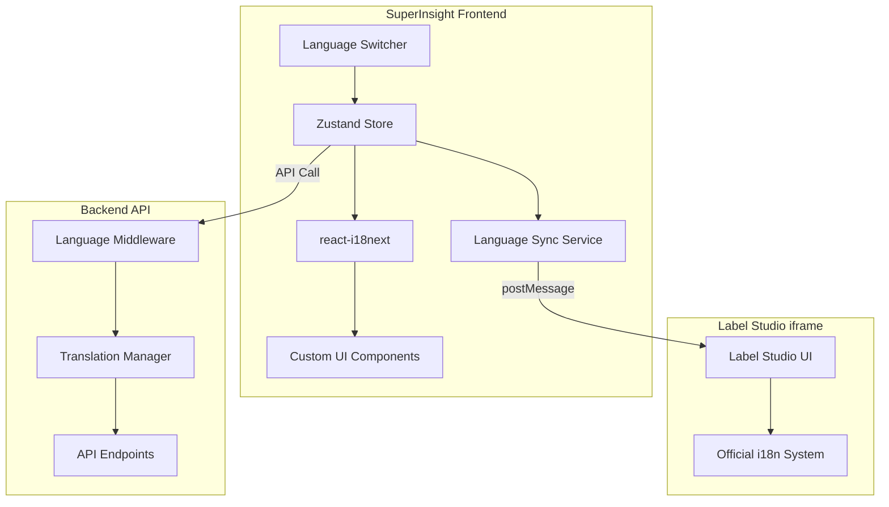

# Design Document

## Overview

The i18n (internationalization) system for SuperInsight platform provides comprehensive multi-language support with dynamic language switching capabilities. The system is designed to support Chinese and English languages with Chinese as the default, providing seamless translation services across all API endpoints and user interfaces.

The architecture follows a modular approach with clear separation of concerns: translation storage, language management, API integration, middleware processing, and **Label Studio integration**. The system is built for high performance, thread safety, and easy extensibility.

### Key Design Principles

1. **项目前端用自己的 i18n 切换** - SuperInsight 前端使用 react-i18next 管理自定义 UI 翻译
2. **Label Studio 用官方语言切换** - Label Studio 使用其内置的官方中文界面，无需额外汉化
3. **全局状态管理同步** - 使用 Zustand 同步语言状态，通过 postMessage 与 Label Studio iframe 通信
4. **最小干扰原则** - 配置驱动 + iframe postMessage，无需修改 Label Studio 代码
5. **支持升级** - 官方镜像升级后，语言设置自动生效

## Architecture

The i18n system consists of five main architectural layers:

### 1. Translation Storage Layer
- **Translation Dictionary**: Centralized storage for all translation key-value pairs
- **Language Registry**: Maintains list of supported languages and their metadata
- **Fallback Mechanism**: Handles missing translations and unsupported languages

### 2. Translation Management Layer
- **Translation Manager**: High-level interface for translation operations
- **Language Context**: Per-request language state management using context variables
- **Validation Engine**: Ensures translation completeness and consistency

### 3. API Integration Layer
- **Language Middleware**: Automatic language detection and context setting
- **API Endpoints**: RESTful endpoints for language management
- **Response Translation**: Automatic translation of API responses

### 4. Client Interface Layer
- **React i18n**: react-i18next for frontend translation management
- **Zustand Store**: Global language state management
- **Language Switcher Component**: UI component for language switching

### 5. Label Studio Integration Layer (NEW)
- **iframe Communication**: postMessage API for cross-origin communication
- **Language Sync Service**: Synchronizes language between SuperInsight and Label Studio
- **Official Chinese Support**: Leverages Label Studio's built-in Chinese localization



## Label Studio Language Integration

### Design Rationale

Label Studio 官方已提供成熟的中文界面支持，准确性和体验可达 95%+。因此，我们采用以下策略：

1. **不修改 Label Studio 代码** - 保持官方镜像的完整性，便于升级
2. **配置驱动** - 通过环境变量和 API 配置语言
3. **iframe postMessage** - 实现跨域语言同步
4. **自定义 UI 翻译** - 仅翻译 SuperInsight 自定义的 UI 元素

### Language Sync Architecture

```typescript
// Frontend Language Sync Service
interface LanguageSyncService {
  // 切换语言并同步到所有组件
  changeLanguage(lang: 'zh' | 'en'): Promise<void>;
  
  // 同步语言到 Label Studio iframe
  syncToLabelStudio(lang: 'zh' | 'en'): void;
  
  // 监听 Label Studio 语言变化
  listenToLabelStudio(): void;
}
```

### Implementation Details

#### 1. Zustand Language Store

```typescript
// stores/languageStore.ts
interface LanguageState {
  language: 'zh' | 'en';
  setLanguage: (lang: 'zh' | 'en') => void;
  syncToLabelStudio: () => void;
}

export const useLanguageStore = create<LanguageState>()(
  persist(
    (set, get) => ({
      language: 'zh',
      
      setLanguage: (lang) => {
        // 1. 更新 Zustand 状态
        set({ language: lang });
        
        // 2. 更新 react-i18next
        i18n.changeLanguage(lang);
        
        // 3. 保存到 localStorage
        localStorage.setItem('lang', lang);
        
        // 4. 同步到 Label Studio
        get().syncToLabelStudio();
        
        // 5. 通知后端 API
        api.post('/api/settings/language', { language: lang });
      },
      
      syncToLabelStudio: () => {
        const { language } = get();
        const iframe = document.querySelector<HTMLIFrameElement>('iframe[data-label-studio]');
        if (iframe?.contentWindow) {
          iframe.contentWindow.postMessage(
            { type: 'setLanguage', lang: language },
            '*'
          );
        }
      },
    }),
    {
      name: 'language-storage',
    }
  )
);
```

#### 2. Label Studio iframe Integration

```typescript
// components/LabelStudioEmbed.tsx
const LabelStudioEmbed: React.FC<Props> = ({ projectId }) => {
  const { language, syncToLabelStudio } = useLanguageStore();
  const iframeRef = useRef<HTMLIFrameElement>(null);
  
  // 监听 iframe 加载完成后同步语言
  useEffect(() => {
    const handleLoad = () => {
      syncToLabelStudio();
    };
    
    const iframe = iframeRef.current;
    iframe?.addEventListener('load', handleLoad);
    
    return () => iframe?.removeEventListener('load', handleLoad);
  }, [syncToLabelStudio]);
  
  // 监听来自 Label Studio 的消息
  useEffect(() => {
    const handleMessage = (event: MessageEvent) => {
      if (event.data.type === 'languageChanged') {
        // Label Studio 语言变化时同步回来
        useLanguageStore.getState().setLanguage(event.data.lang);
      }
    };
    
    window.addEventListener('message', handleMessage);
    return () => window.removeEventListener('message', handleMessage);
  }, []);
  
  return (
    <iframe
      ref={iframeRef}
      data-label-studio
      src={`${LABEL_STUDIO_URL}/projects/${projectId}?lang=${language}`}
      style={{ width: '100%', height: '100%', border: 'none' }}
    />
  );
};
```

#### 3. Language Switcher Component

```typescript
// components/LanguageSwitcher.tsx
const LanguageSwitcher: React.FC = () => {
  const { language, setLanguage } = useLanguageStore();
  const { t } = useTranslation();
  
  const handleChange = (value: 'zh' | 'en') => {
    setLanguage(value);
  };
  
  return (
    <Select value={language} onChange={handleChange}>
      <Select.Option value="zh">中文</Select.Option>
      <Select.Option value="en">English</Select.Option>
    </Select>
  );
};
```

### Label Studio Configuration

Label Studio 支持通过以下方式配置语言：

1. **环境变量** (docker-compose.yml):
```yaml
label-studio:
  environment:
    LABEL_STUDIO_LOCAL_FILES_SERVING_ENABLED: "true"
    LABEL_STUDIO_LANGUAGE: "zh"  # 默认中文
```

2. **URL 参数**:
```
http://label-studio:8080/projects/1?lang=zh
```

3. **用户设置**:
Label Studio 用户可以在个人设置中切换语言，这个设置会被保存。

### Label Studio 语言切换策略

由于 Label Studio 使用 Django 的 i18n 系统，语言切换需要页面重新加载才能生效。因此，我们采用以下策略：

#### 1. iframe 重新加载策略

当用户在 SuperInsight 中切换语言时：

```typescript
// LabelStudioEmbed.tsx
const LabelStudioEmbed: React.FC<Props> = ({ projectId }) => {
  const { language } = useLanguageStore();
  const prevLanguageRef = useRef(language);
  const iframeRef = useRef<HTMLIFrameElement>(null);
  
  // 监听语言变化，重新加载 iframe
  useEffect(() => {
    if (prevLanguageRef.current !== language && connectionStatus === 'connected') {
      console.log(`Language changed from ${prevLanguageRef.current} to ${language}`);
      prevLanguageRef.current = language;
      
      // 显示加载状态
      setLoading(true);
      setConnectionStatus('connecting');
      
      // 重新加载 iframe 以应用新语言
      if (iframeRef.current) {
        iframeRef.current.src = getLabelStudioUrl();
      }
      
      // 显示语言切换提示
      message.info(t('labelStudio.languageChanging'));
    }
  }, [language, connectionStatus]);
  
  return (
    <iframe
      ref={iframeRef}
      data-label-studio
      src={getLabelStudioUrl()}
      // ...
    />
  );
};
```

#### 2. 语言切换用户体验

为了提供良好的用户体验，语言切换时：

1. **显示加载指示器** - 在 iframe 重新加载期间显示 Spin 组件
2. **显示提示消息** - 使用 message.info 告知用户正在切换语言
3. **保持连接状态** - 更新 connectionStatus 为 'connecting'
4. **完成后恢复** - iframe 加载完成后恢复正常状态

#### 3. 翻译键定义

为语言切换功能添加以下翻译键：

```json
// zh/common.json
{
  "labelStudio": {
    "languageChanging": "正在切换 Label Studio 语言...",
    "languageChanged": "Label Studio 语言已切换",
    "languageNote": "Label Studio 使用内置中文界面，语言切换需要重新加载"
  }
}

// en/common.json
{
  "labelStudio": {
    "languageChanging": "Switching Label Studio language...",
    "languageChanged": "Label Studio language switched",
    "languageNote": "Label Studio uses built-in localization, language switch requires reload"
  }
}
```

#### 4. 设计考量

- **为什么不使用 postMessage？** - Label Studio 的 Django i18n 系统不支持运行时语言切换，必须重新加载页面
- **为什么不修改 Label Studio 代码？** - 保持官方镜像完整性，便于升级维护
- **性能影响** - iframe 重新加载会有短暂延迟（约 1-3 秒），但这是不可避免的
- **状态保持** - 重新加载后，Label Studio 会恢复到当前项目/任务，用户工作不会丢失

## Components and Interfaces

### Translation Manager (`TranslationManager`)

The core component responsible for translation operations and language management.

**Interface:**
```python
class TranslationManager:
    def __init__(self, default_language: str = 'zh')
    def set_language(self, language: str) -> None
    def get_language(self) -> str
    def translate(self, key: str, language: Optional[str] = None, **kwargs) -> str
    def t(self, key: str, language: Optional[str] = None, **kwargs) -> str  # shorthand
    def get_all(self, language: Optional[str] = None) -> Dict[str, str]
    def get_supported_languages(self) -> List[str]
    def translate_dict(self, data: Dict, language: Optional[str] = None) -> Dict
    def translate_list(self, items: List[str], language: Optional[str] = None) -> List[str]
```

### Translation Functions

Core functions for translation operations.

**Interface:**
```python
def set_language(language: str) -> None
def get_current_language() -> str
def get_translation(key: str, language: Optional[str] = None, **kwargs) -> str
def get_all_translations(language: Optional[str] = None) -> Dict[str, str]
def get_supported_languages() -> List[str]
```

### Language Middleware

FastAPI middleware for automatic language processing.

**Interface:**
```python
@app.middleware("http")
async def language_middleware(request: Request, call_next: Callable) -> Response
```

**Processing Flow:**
1. Extract language from query parameters (`?language=en`)
2. Extract language from Accept-Language header
3. Validate language code against supported languages
4. Set language context for current request
5. Process request with language context
6. Add Content-Language header to response

### API Endpoints

RESTful endpoints for language management.

**Endpoints:**
- `GET /api/settings/language` - Get current language settings
- `POST /api/settings/language` - Set current language
- `GET /api/i18n/translations` - Get all translations for a language
- `GET /api/i18n/translations?language={code}` - Get translations for specific language

## Data Models

### Translation Dictionary Structure

```python
TRANSLATIONS: Dict[str, Dict[str, str]] = {
    'zh': {
        'app_name': 'SuperInsight 平台',
        'login': '登录',
        'logout': '登出',
        # ... 90+ translation keys
    },
    'en': {
        'app_name': 'SuperInsight Platform',
        'login': 'Login',
        'logout': 'Logout',
        # ... 90+ translation keys
    }
}
```

### Language Context Model

```python
# Context variable for per-request language state
_current_language: ContextVar[str] = ContextVar('language', default='zh')
```

### API Response Models

```python
class LanguageSettingsResponse(BaseModel):
    current_language: str
    supported_languages: List[str]
    language_names: Dict[str, str]

class LanguageChangeResponse(BaseModel):
    message: str
    current_language: str

class TranslationsResponse(BaseModel):
    language: str
    translations: Dict[str, str]
```

## Correctness Properties

*A property is a characteristic or behavior that should hold true across all valid executions of a system-essentially, a formal statement about what the system should do. Properties serve as the bridge between human-readable specifications and machine-verifiable correctness guarantees.*

Based on the prework analysis, the following properties have been identified for testing:

### Property 1: Language Support Consistency
*For any* supported language code, the translation system should return translations and include the language in the supported languages list.
**Validates: Requirements 1.1**

### Property 2: Translation Dictionary Completeness
*For any* translation key that exists in one supported language, the same key should exist in all other supported languages.
**Validates: Requirements 1.4, 1.5**

### Property 3: Language Switching Immediacy
*For any* valid language code, when the language is changed, all subsequent translation requests should use the new language immediately.
**Validates: Requirements 2.1**

### Property 4: Invalid Language Validation
*For any* invalid language code, the system should reject the language change request and maintain the current language setting.
**Validates: Requirements 2.2, 2.3**

### Property 5: Multi-method Language Setting
*For any* valid language code, the system should accept language changes through query parameters, headers, and direct API calls with consistent results.
**Validates: Requirements 2.4**

### Property 6: Language Persistence
*For any* language change, all subsequent API responses should use the new language until changed again.
**Validates: Requirements 2.5**

### Property 7: Automatic Language Detection
*For any* request containing language preferences in query parameters or headers, the system should detect and apply the preferred language.
**Validates: Requirements 3.1**

### Property 8: Response Translation Consistency
*For any* API response containing translatable text, the response should be translated according to the current language setting.
**Validates: Requirements 3.2**

### Property 9: Content-Language Header Inclusion
*For any* API response, the response should include a Content-Language header matching the current language.
**Validates: Requirements 3.3, 9.3**

### Property 10: Default Language Fallback
*For any* request without explicit language specification, the system should use Chinese as the default language.
**Validates: Requirements 3.5**

### Property 11: Translation Query Functionality
*For any* valid translation key and language combination, the translation manager should return the appropriate translation.
**Validates: Requirements 4.1**

### Property 12: Batch Translation Consistency
*For any* list of translation keys, batch translation should return the same results as individual translations for each key.
**Validates: Requirements 4.2**

### Property 13: Complete Translation Retrieval
*For any* supported language, requesting all translations should return a complete dictionary of all available translation keys.
**Validates: Requirements 4.4**

### Property 14: Missing Key Fallback
*For any* non-existent translation key, the system should return the key itself as fallback text.
**Validates: Requirements 4.5, 5.1**

### Property 15: Unsupported Language Fallback
*For any* unsupported language code, the system should fallback to Chinese for translations.
**Validates: Requirements 5.2**

### Property 16: Translation Completeness Validation
*For any* supported language, the system should be able to detect if any translation keys are missing compared to other languages.
**Validates: Requirements 7.4**

### Property 17: HTTP Status Code Appropriateness
*For any* language management API request, the system should return appropriate HTTP status codes (200 for success, 400 for bad requests, etc.).
**Validates: Requirements 8.5**

### Property 18: Middleware Language Detection
*For any* request with language indicators, the middleware should correctly detect and set the language context.
**Validates: Requirements 9.1, 9.2**

### Property 19: Detection Method Priority
*For any* request containing both query parameters and headers with different languages, query parameters should take precedence.
**Validates: Requirements 9.5**

### Property 20: Translation Coverage Completeness
*For any* major functional category (authentication, system status, etc.), translations should exist for all relevant text.
**Validates: Requirements 10.1, 10.2**

### Property 21: Translation Consistency Across Modules
*For any* common concept used across different modules, the same translation should be used consistently.
**Validates: Requirements 10.3**

### Property 22: Parameterized Translation Support
*For any* translation with formatting parameters, the system should correctly substitute the parameters in the translated text.
**Validates: Requirements 11.3**

### Property 23: Text Metadata Provision
*For any* translation, the system should be able to provide metadata about text characteristics when requested.
**Validates: Requirements 11.5**

### Property 24: Label Studio Language Sync
*For any* language change in SuperInsight, the system should synchronize the language setting to Label Studio iframe via postMessage.
**Validates: Requirements 12.1**

### Property 25: Cross-Origin Message Security
*For any* postMessage communication with Label Studio, the system should validate message origin and type before processing.
**Validates: Requirements 12.2**

### Property 26: Language State Consistency
*For any* language change, the language state should be consistent across Zustand store, localStorage, react-i18next, and Label Studio.
**Validates: Requirements 12.3**

## Error Handling

### Translation Errors
- **Missing Translation Keys**: Return the key itself as fallback text
- **Invalid Language Codes**: Fallback to Chinese and log warning
- **Malformed Translation Requests**: Return appropriate HTTP error codes

### API Errors
- **Invalid Language in Request**: HTTP 400 with descriptive error message
- **Missing Required Parameters**: HTTP 400 with parameter validation errors
- **Internal Translation Errors**: HTTP 500 with generic error message (detailed errors logged)

### Middleware Errors
- **Language Detection Failures**: Fallback to Chinese silently
- **Context Setting Errors**: Continue with default language
- **Response Header Errors**: Continue without Content-Language header

## Testing Strategy

The testing strategy employs a dual approach combining unit tests for specific scenarios and property-based tests for comprehensive validation.

### Unit Testing
Unit tests focus on:
- **Specific Examples**: Test known translation key-value pairs
- **Edge Cases**: Empty strings, special characters, boundary conditions
- **Error Conditions**: Invalid inputs, missing resources, network failures
- **Integration Points**: API endpoints, middleware integration, database connections

### Property-Based Testing
Property-based tests validate universal properties using the fast-check library for JavaScript/TypeScript or Hypothesis for Python:

- **Minimum 100 iterations** per property test to ensure comprehensive coverage
- **Random input generation** for translation keys, language codes, and API parameters
- **Property validation** across all generated inputs
- **Shrinking** to find minimal failing examples when properties fail

Each property test is tagged with the format: **Feature: i18n-support, Property {number}: {property_text}**

### Test Configuration
- **Framework**: pytest for Python unit tests, fast-check/Hypothesis for property tests
- **Coverage Target**: 95% code coverage minimum
- **Performance Tests**: Translation lookup performance validation
- **Load Tests**: Concurrent access and thread safety validation
- **Integration Tests**: End-to-end API workflow testing

### Test Data Management
- **Translation Fixtures**: Predefined translation sets for consistent testing
- **Language Code Generators**: Valid and invalid language code generation
- **API Request Generators**: Comprehensive API request scenario generation
- **Mock Services**: External service mocking for isolated testing