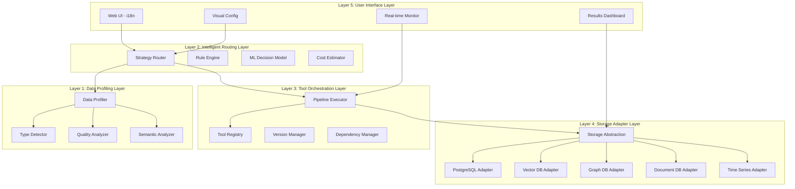
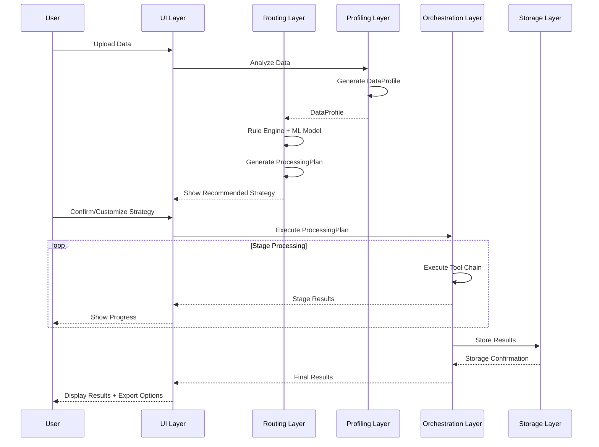
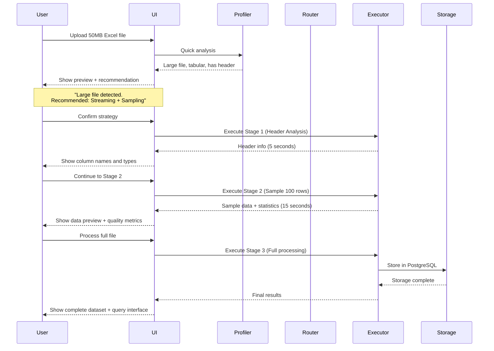
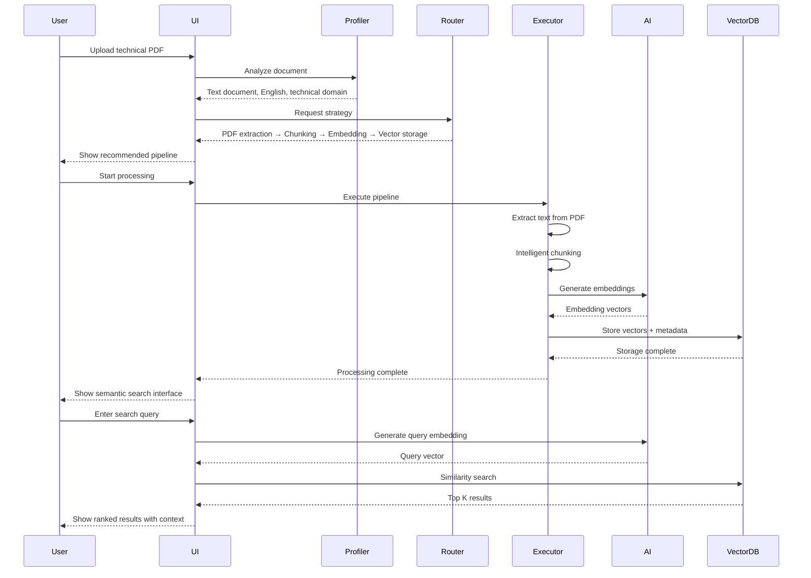

# Design Document: Intelligent Data Processing Toolkit Framework

## Overview

The Intelligent Data Processing Toolkit Framework is a foundational capability layer that provides an extensible, plugin-based ecosystem for intelligent data processing. It automatically analyzes data characteristics, selects optimal processing strategies, and orchestrates tool chains to handle diverse data types. The framework is designed to adapt to evolving AI technologies while providing a seamless end-to-end user experience with complete internationalization support.

This framework introduces a five-layer architecture that separates concerns: data profiling, intelligent routing, tool orchestration, storage adaptation, and user interaction. Each layer is designed for extensibility and future evolution, supporting hot-pluggable tools, multiple storage backends, and AI model abstraction.

## Architecture

The system follows a five-layer architecture with clear separation of concerns and well-defined interfaces between layers.




## Main Data Flow



## Components and Interfaces

### Layer 1: Data Profiling Layer

**Purpose**: Automatically analyze data characteristics and generate comprehensive data profiles.

**Core Components**:

#### DataProfiler
```pascal
INTERFACE DataProfiler
  METHOD analyzeData(dataSource: DataSource, options: ProfilingOptions): DataProfile
  METHOD generateFingerprint(dataSource: DataSource): DataFingerprint
  METHOD estimateProcessingCost(profile: DataProfile): CostEstimate
END INTERFACE
```

**Responsibilities**:
- Detect data type, format, size, and structure
- Analyze data quality (completeness, consistency, accuracy)
- Extract semantic information (language, domain, entities)
- Generate unique data fingerprint for caching
- Estimate processing resource requirements

#### TypeDetector
```pascal
INTERFACE TypeDetector
  METHOD detectFileType(dataSource: DataSource): FileType
  METHOD detectDataStructure(content: ByteStream): DataStructure
  METHOD detectEncoding(content: ByteStream): Encoding
  METHOD detectSchema(structuredData: StructuredData): Schema
END INTERFACE
```

#### QualityAnalyzer
```pascal
INTERFACE QualityAnalyzer
  METHOD analyzeCompleteness(data: Dataset): CompletenessScore
  METHOD analyzeConsistency(data: Dataset): ConsistencyReport
  METHOD detectAnomalies(data: Dataset): AnomalyList
  METHOD assessDataQuality(data: Dataset): QualityMetrics
END INTERFACE
```

#### SemanticAnalyzer
```pascal
INTERFACE SemanticAnalyzer
  METHOD detectLanguage(textData: TextData): Language
  METHOD detectDomain(content: Content): Domain
  METHOD extractEntities(textData: TextData): EntityList
  METHOD inferSemanticType(column: Column): SemanticType
END INTERFACE
```


### Layer 2: Intelligent Routing Layer

**Purpose**: Select optimal processing strategies based on data profiles, business requirements, and resource constraints.

**Core Components**:

#### StrategyRouter
```pascal
INTERFACE StrategyRouter
  METHOD selectStrategy(profile: DataProfile, requirements: Requirements): ProcessingPlan
  METHOD evaluateStrategies(profile: DataProfile, candidates: StrategyList): RankedStrategies
  METHOD optimizePlan(plan: ProcessingPlan, constraints: Constraints): OptimizedPlan
END INTERFACE
```

**Responsibilities**:
- Combine rule-based and ML-based decision making
- Consider data characteristics, business needs, and resource limits
- Generate executable processing plans with tool chains
- Optimize for cost, speed, or quality based on priorities
- Provide explainable recommendations

#### RuleEngine
```pascal
INTERFACE RuleEngine
  METHOD evaluateRules(profile: DataProfile, ruleSet: RuleSet): RuleMatchList
  METHOD applyRule(rule: Rule, context: Context): Action
  METHOD registerRule(rule: Rule): RuleID
  METHOD updateRulePriority(ruleID: RuleID, priority: Priority): Boolean
END INTERFACE
```

**Rule Examples**:
- IF fileSize > 50MB AND fileType = Excel THEN use StreamingProcessor
- IF textLanguage = Chinese AND task = NER THEN use ChineseNERModel
- IF dataQuality < 0.7 THEN add DataCleaningTool to pipeline

#### MLDecisionModel
```pascal
INTERFACE MLDecisionModel
  METHOD predictOptimalStrategy(profile: DataProfile, history: HistoryData): Strategy
  METHOD learnFromFeedback(execution: ExecutionRecord, feedback: UserFeedback): Void
  METHOD explainDecision(profile: DataProfile, decision: Strategy): Explanation
END INTERFACE
```

#### CostEstimator
```pascal
INTERFACE CostEstimator
  METHOD estimateTime(plan: ProcessingPlan, profile: DataProfile): TimeEstimate
  METHOD estimateMemory(plan: ProcessingPlan, profile: DataProfile): MemoryEstimate
  METHOD estimateMonetary(plan: ProcessingPlan, profile: DataProfile): MonetaryCost
  METHOD compareStrategies(strategies: StrategyList, profile: DataProfile): CostComparison
END INTERFACE
```


### Layer 3: Tool Orchestration Layer

**Purpose**: Manage tool lifecycle, orchestrate tool chains, and execute processing pipelines.

**Core Components**:

#### ToolRegistry
```pascal
INTERFACE ToolRegistry
  METHOD registerTool(tool: Tool, metadata: ToolMetadata): ToolID
  METHOD unregisterTool(toolID: ToolID): Boolean
  METHOD findTools(criteria: SearchCriteria): ToolList
  METHOD getToolMetadata(toolID: ToolID): ToolMetadata
  METHOD updateToolVersion(toolID: ToolID, version: Version): Boolean
  METHOD checkDependencies(toolID: ToolID): DependencyStatus
END INTERFACE
```

**Responsibilities**:
- Maintain catalog of all available tools
- Support tool hot-plugging and version management
- Track tool capabilities, performance metrics, and dependencies
- Enable tool discovery and selection
- Validate tool compatibility

#### PipelineExecutor
```pascal
INTERFACE PipelineExecutor
  METHOD executePipeline(plan: ProcessingPlan, data: DataSource): ExecutionResult
  METHOD executeStage(stage: ProcessingStage, input: StageInput): StageOutput
  METHOD pauseExecution(executionID: ExecutionID): Boolean
  METHOD resumeExecution(executionID: ExecutionID): Boolean
  METHOD cancelExecution(executionID: ExecutionID): Boolean
  METHOD getExecutionStatus(executionID: ExecutionID): ExecutionStatus
END INTERFACE
```

**Responsibilities**:
- Execute tool chains in correct order
- Handle data flow between tools
- Support staged execution with pause/resume
- Provide real-time progress monitoring
- Handle errors and retries
- Cache intermediate results

#### ToolMetadata Structure
```pascal
STRUCTURE ToolMetadata
  id: ToolID
  name: String
  version: Version
  category: ToolCategory
  capabilities: CapabilityList
  inputFormats: FormatList
  outputFormats: FormatList
  performanceMetrics: PerformanceMetrics
  dependencies: DependencyList
  costModel: CostModel
  documentation: Documentation
END STRUCTURE
```

**Tool Categories**:
- Analyzers: Data profiling, quality assessment, schema detection
- Transformers: Format conversion, data cleaning, normalization
- AI Models: Text generation, embedding, classification, NER
- Visualizers: Chart generation, report creation, dashboard
- Storage Adapters: Database connectors, file system handlers


### Layer 4: Storage Adapter Layer

**Purpose**: Provide unified interface to multiple storage backends and enable intelligent storage selection.

**Core Components**:

#### StorageAbstraction
```pascal
INTERFACE StorageAbstraction
  METHOD selectStorage(dataProfile: DataProfile, requirements: StorageRequirements): StorageAdapter
  METHOD storeData(data: ProcessedData, adapter: StorageAdapter): StorageResult
  METHOD queryData(query: UnifiedQuery, adapter: StorageAdapter): QueryResult
  METHOD trackLineage(dataID: DataID): LineageGraph
END INTERFACE
```

**Responsibilities**:
- Abstract storage backend differences
- Route data to appropriate storage based on characteristics
- Provide unified query interface across storage types
- Track data lineage and transformations
- Support multi-storage scenarios

#### Storage Adapters

**PostgreSQLAdapter**
```pascal
INTERFACE PostgreSQLAdapter EXTENDS StorageAdapter
  METHOD storeStructuredData(data: StructuredData, schema: Schema): TableReference
  METHOD createIndex(table: TableReference, columns: ColumnList): IndexReference
  METHOD executeSQL(query: SQLQuery): ResultSet
END INTERFACE
```

**Use Cases**: Structured tabular data, relational data, transactional data

**VectorDBAdapter**
```pascal
INTERFACE VectorDBAdapter EXTENDS StorageAdapter
  METHOD storeEmbeddings(embeddings: EmbeddingList, metadata: MetadataList): VectorCollection
  METHOD similaritySearch(queryVector: Vector, topK: Integer): SearchResults
  METHOD hybridSearch(queryVector: Vector, filters: FilterList): SearchResults
END INTERFACE
```

**Use Cases**: Text embeddings, semantic search, similarity matching, RAG systems

**GraphDBAdapter**
```pascal
INTERFACE GraphDBAdapter EXTENDS StorageAdapter
  METHOD storeGraph(nodes: NodeList, edges: EdgeList): GraphReference
  METHOD traverseGraph(startNode: NodeID, pattern: TraversalPattern): PathList
  METHOD findShortestPath(source: NodeID, target: NodeID): Path
END INTERFACE
```

**Use Cases**: Entity relationships, knowledge graphs, network analysis

**DocumentDBAdapter**
```pascal
INTERFACE DocumentDBAdapter EXTENDS StorageAdapter
  METHOD storeDocuments(documents: DocumentList): DocumentIDs
  METHOD fullTextSearch(query: TextQuery): DocumentList
  METHOD aggregateDocuments(pipeline: AggregationPipeline): AggregationResult
END INTERFACE
```

**Use Cases**: Semi-structured data, JSON documents, flexible schemas, full-text search

**TimeSeriesAdapter**
```pascal
INTERFACE TimeSeriesAdapter EXTENDS StorageAdapter
  METHOD storeTimeSeries(data: TimeSeriesData, tags: TagList): SeriesReference
  METHOD queryTimeRange(series: SeriesReference, start: Timestamp, end: Timestamp): TimeSeriesData
  METHOD downsample(series: SeriesReference, interval: Duration): TimeSeriesData
END INTERFACE
```

**Use Cases**: Time-stamped data, metrics, logs, sensor data


### Layer 5: User Interface Layer

**Purpose**: Provide intuitive, fully internationalized interface for configuration, monitoring, and results visualization.

**Core Components**:

#### DataUploadInterface
```pascal
INTERFACE DataUploadInterface
  METHOD uploadFile(file: File): UploadSession
  METHOD validateUpload(session: UploadSession): ValidationResult
  METHOD showPreview(session: UploadSession): DataPreview
  METHOD suggestStrategy(session: UploadSession): StrategySuggestion
END INTERFACE
```

**Features**:
- Drag-and-drop file upload with progress tracking
- Real-time validation and error feedback
- Automatic data preview generation
- Smart strategy recommendations with explanations

#### ConfigurationInterface
```pascal
INTERFACE ConfigurationInterface
  METHOD showRecommendedStrategy(plan: ProcessingPlan): StrategyView
  METHOD customizeStrategy(plan: ProcessingPlan): CustomizationPanel
  METHOD selectTemplate(category: Category): TemplateList
  METHOD estimateCost(plan: ProcessingPlan): CostBreakdown
END INTERFACE
```

**Features**:
- Visual strategy configuration with drag-and-drop tool chains
- Pre-built templates for common scenarios
- Real-time cost estimation (time, memory, money)
- Side-by-side strategy comparison

#### MonitoringInterface
```pascal
INTERFACE MonitoringInterface
  METHOD showProgress(executionID: ExecutionID): ProgressView
  METHOD showStageResults(stageID: StageID): StageResultView
  METHOD pauseExecution(executionID: ExecutionID): Boolean
  METHOD showLogs(executionID: ExecutionID, level: LogLevel): LogView
END INTERFACE
```

**Features**:
- Real-time progress tracking with stage breakdown
- Intermediate results preview at each stage
- Pause/resume/cancel controls
- Detailed execution logs with filtering

#### ResultsInterface
```pascal
INTERFACE ResultsInterface
  METHOD showResults(executionID: ExecutionID): ResultsView
  METHOD generateVisualization(data: ProcessedData, type: VisualizationType): Visualization
  METHOD exportResults(data: ProcessedData, format: ExportFormat): ExportFile
  METHOD generateReport(execution: ExecutionRecord): Report
END INTERFACE
```

**Features**:
- Multi-dimensional results display (tables, charts, graphs)
- Interactive data exploration
- Multiple export formats (CSV, JSON, Excel, PDF)
- Automated report generation with insights


## Data Models

### DataProfile
```pascal
STRUCTURE DataProfile
  fingerprint: DataFingerprint
  basicInfo: BasicInfo
  qualityMetrics: QualityMetrics
  structureInfo: StructureInfo
  semanticInfo: SemanticInfo
  computationalCharacteristics: ComputationalCharacteristics
END STRUCTURE

STRUCTURE BasicInfo
  fileType: FileType
  fileSize: Integer
  encoding: Encoding
  recordCount: Integer
  columnCount: Integer
END STRUCTURE

STRUCTURE QualityMetrics
  completenessScore: Float
  consistencyScore: Float
  accuracyScore: Float
  anomalyCount: Integer
  missingValueRatio: Float
END STRUCTURE

STRUCTURE StructureInfo
  schema: Schema
  dataTypes: DataTypeList
  relationships: RelationshipList
  hierarchyDepth: Integer
END STRUCTURE

STRUCTURE SemanticInfo
  language: Language
  domain: Domain
  entities: EntityList
  semanticTypes: SemanticTypeList
END STRUCTURE

STRUCTURE ComputationalCharacteristics
  estimatedMemory: Integer
  estimatedProcessingTime: Integer
  parallelizability: Float
  cacheable: Boolean
END STRUCTURE
```

### ProcessingPlan
```pascal
STRUCTURE ProcessingPlan
  planID: PlanID
  dataProfile: DataProfile
  stages: StageList
  storageStrategy: StorageStrategy
  estimatedCost: CostEstimate
  explanation: Explanation
END STRUCTURE

STRUCTURE ProcessingStage
  stageID: StageID
  stageName: String
  toolChain: ToolList
  inputFormat: Format
  outputFormat: Format
  parameters: ParameterMap
  dependencies: StageIDList
END STRUCTURE

STRUCTURE StorageStrategy
  primaryStorage: StorageAdapter
  secondaryStorages: StorageAdapterList
  indexingStrategy: IndexingStrategy
  retentionPolicy: RetentionPolicy
END STRUCTURE
```

### Tool Registration Standard
```pascal
STRUCTURE Tool
  metadata: ToolMetadata
  implementation: ToolImplementation
  performanceProfile: PerformanceProfile
END STRUCTURE

STRUCTURE ToolMetadata
  id: ToolID
  name: String
  version: Version
  category: ToolCategory
  capabilities: CapabilityList
  inputFormats: FormatList
  outputFormats: FormatList
  dependencies: DependencyList
  documentation: Documentation
END STRUCTURE

STRUCTURE ToolImplementation
  entryPoint: FunctionReference
  configSchema: JSONSchema
  validateInput: ValidationFunction
  execute: ExecutionFunction
  cleanup: CleanupFunction
END STRUCTURE

STRUCTURE PerformanceProfile
  avgProcessingSpeed: Float
  memoryUsage: MemoryUsage
  cpuUsage: CPUUsage
  costPerUnit: MonetaryCost
  scalability: ScalabilityMetrics
END STRUCTURE
```


## Core Algorithms

### Algorithm 1: Data Profiling

```pascal
ALGORITHM generateDataProfile(dataSource, options)
INPUT: dataSource of type DataSource, options of type ProfilingOptions
OUTPUT: profile of type DataProfile

BEGIN
  // Stage 1: Quick Analysis (< 10 seconds)
  basicInfo ← analyzeBasicInfo(dataSource)
  structureInfo ← analyzeStructure(dataSource, sampleSize = 1000)
  
  IF options.quickMode = true THEN
    RETURN createPartialProfile(basicInfo, structureInfo)
  END IF
  
  // Stage 2: Sampling Analysis (< 30 seconds)
  sampleData ← extractSample(dataSource, sampleSize = 10000)
  qualityMetrics ← analyzeQuality(sampleData)
  semanticInfo ← analyzeSemantics(sampleData)
  
  IF options.samplingMode = true THEN
    RETURN createSampledProfile(basicInfo, structureInfo, qualityMetrics, semanticInfo)
  END IF
  
  // Stage 3: Full Analysis (on-demand)
  fullData ← loadFullData(dataSource)
  completeQuality ← analyzeQualityFull(fullData)
  completeSemantics ← analyzeSemanticsFull(fullData)
  computationalChar ← estimateComputationalCharacteristics(fullData)
  
  fingerprint ← generateFingerprint(basicInfo, structureInfo, qualityMetrics)
  
  profile ← DataProfile{
    fingerprint: fingerprint,
    basicInfo: basicInfo,
    qualityMetrics: completeQuality,
    structureInfo: structureInfo,
    semanticInfo: completeSemantics,
    computationalCharacteristics: computationalChar
  }
  
  RETURN profile
END
```

### Algorithm 2: Intelligent Strategy Selection

```pascal
ALGORITHM selectOptimalStrategy(profile, requirements, constraints)
INPUT: profile of type DataProfile, requirements of type Requirements, constraints of type Constraints
OUTPUT: plan of type ProcessingPlan

BEGIN
  // Step 1: Rule-based filtering
  candidateStrategies ← getAllStrategies()
  ruleMatches ← ruleEngine.evaluate(profile, candidateStrategies)
  filteredStrategies ← filterByRules(candidateStrategies, ruleMatches)
  
  IF filteredStrategies.isEmpty() THEN
    RETURN createDefaultStrategy(profile)
  END IF
  
  // Step 2: ML-based ranking
  rankedStrategies ← mlModel.rankStrategies(profile, filteredStrategies)
  
  // Step 3: Cost-based optimization
  FOR each strategy IN rankedStrategies DO
    costEstimate ← estimateCost(strategy, profile, constraints)
    strategy.estimatedCost ← costEstimate
    
    IF costEstimate.exceedsConstraints(constraints) THEN
      CONTINUE
    END IF
    
    IF strategy.score > bestScore THEN
      bestStrategy ← strategy
      bestScore ← strategy.score
    END IF
  END FOR
  
  // Step 4: Generate processing plan
  plan ← generateProcessingPlan(bestStrategy, profile)
  plan.explanation ← explainDecision(profile, bestStrategy, rankedStrategies)
  
  RETURN plan
END
```

### Algorithm 3: Pipeline Execution

```pascal
ALGORITHM executePipeline(plan, dataSource)
INPUT: plan of type ProcessingPlan, dataSource of type DataSource
OUTPUT: result of type ExecutionResult

BEGIN
  executionID ← generateExecutionID()
  executionState ← initializeExecutionState(executionID, plan)
  
  // Execute stages in dependency order
  FOR each stage IN plan.stages DO
    // Check for pause/cancel requests
    IF executionState.isPaused() THEN
      WAIT_UNTIL executionState.isResumed() OR executionState.isCancelled()
    END IF
    
    IF executionState.isCancelled() THEN
      RETURN createCancelledResult(executionID, executionState)
    END IF
    
    // Prepare stage input
    IF stage.dependencies.isEmpty() THEN
      stageInput ← dataSource
    ELSE
      stageInput ← collectDependencyOutputs(stage.dependencies, executionState)
    END IF
    
    // Execute tool chain
    stageOutput ← executeStage(stage, stageInput, executionState)
    
    // Cache intermediate results
    cacheStageOutput(executionID, stage.stageID, stageOutput)
    
    // Update execution state
    executionState.markStageComplete(stage.stageID, stageOutput)
    
    // Notify UI of progress
    notifyProgress(executionID, stage.stageID, stageOutput)
  END FOR
  
  // Store final results
  storageResult ← storeResults(plan.storageStrategy, executionState.finalOutput)
  
  result ← ExecutionResult{
    executionID: executionID,
    status: "completed",
    output: executionState.finalOutput,
    storageReference: storageResult.reference,
    metrics: executionState.metrics
  }
  
  RETURN result
END
```


### Algorithm 4: Storage Selection

```pascal
ALGORITHM selectOptimalStorage(dataProfile, processedData, requirements)
INPUT: dataProfile of type DataProfile, processedData of type ProcessedData, requirements of type StorageRequirements
OUTPUT: storageStrategy of type StorageStrategy

BEGIN
  storageScores ← emptyMap()
  
  // Score each storage type based on data characteristics
  IF dataProfile.structureInfo.isTabular() AND dataProfile.structureInfo.hasSchema() THEN
    storageScores["postgresql"] ← 0.9
  END IF
  
  IF processedData.hasEmbeddings() OR requirements.needsSemanticSearch THEN
    storageScores["vectordb"] ← 0.95
  END IF
  
  IF dataProfile.structureInfo.hasRelationships() OR requirements.needsGraphTraversal THEN
    storageScores["graphdb"] ← 0.9
  END IF
  
  IF dataProfile.structureInfo.isSemiStructured() OR requirements.needsFlexibleSchema THEN
    storageScores["documentdb"] ← 0.85
  END IF
  
  IF dataProfile.structureInfo.isTimeSeries() OR requirements.needsTimeRangeQueries THEN
    storageScores["timeseriesdb"] ← 0.95
  END IF
  
  // Select primary storage (highest score)
  primaryStorage ← getStorageWithMaxScore(storageScores)
  
  // Select secondary storages for multi-storage scenarios
  secondaryStorages ← emptyList()
  
  IF storageScores.size() > 1 THEN
    FOR each storage, score IN storageScores DO
      IF storage ≠ primaryStorage AND score > 0.7 THEN
        secondaryStorages.add(storage)
      END IF
    END FOR
  END IF
  
  // Determine indexing strategy
  indexingStrategy ← determineIndexingStrategy(dataProfile, primaryStorage)
  
  // Set retention policy
  retentionPolicy ← determineRetentionPolicy(requirements)
  
  storageStrategy ← StorageStrategy{
    primaryStorage: primaryStorage,
    secondaryStorages: secondaryStorages,
    indexingStrategy: indexingStrategy,
    retentionPolicy: retentionPolicy
  }
  
  RETURN storageStrategy
END
```

## End-to-End User Journey

### Journey 1: Excel File Processing



### Journey 2: PDF Document Semantic Search




## Tool Registration Examples

### Example 1: Excel Streaming Processor

```pascal
STRUCTURE ExcelStreamingProcessor IMPLEMENTS Tool
  metadata: ToolMetadata{
    id: "excel-streaming-processor-v1",
    name: "Excel Streaming Processor",
    version: "1.0.0",
    category: "transformer",
    capabilities: ["stream-processing", "large-file-handling", "excel-parsing"],
    inputFormats: ["xlsx", "xls"],
    outputFormats: ["json-stream", "csv-stream"],
    dependencies: ["openpyxl>=3.0.0", "pandas>=1.5.0"],
    documentation: "Processes large Excel files using streaming to minimize memory usage"
  }
  
  implementation: ToolImplementation{
    entryPoint: processExcelStream,
    configSchema: {
      "chunkSize": {"type": "integer", "default": 1000},
      "skipRows": {"type": "integer", "default": 0},
      "sheetName": {"type": "string", "optional": true}
    },
    validateInput: validateExcelFile,
    execute: executeStreamProcessing,
    cleanup: closeFileHandles
  }
  
  performanceProfile: PerformanceProfile{
    avgProcessingSpeed: 10000, // rows per second
    memoryUsage: {"base": "50MB", "perChunk": "10MB"},
    cpuUsage: "medium",
    costPerUnit: 0.001, // per 1000 rows
    scalability: {"horizontal": true, "vertical": true}
  }
END STRUCTURE
```

### Example 2: Text Embedding Generator

```pascal
STRUCTURE TextEmbeddingGenerator IMPLEMENTS Tool
  metadata: ToolMetadata{
    id: "text-embedding-openai-v1",
    name: "OpenAI Text Embedding Generator",
    version: "1.0.0",
    category: "ai-model",
    capabilities: ["text-embedding", "semantic-encoding", "multilingual"],
    inputFormats: ["text", "json"],
    outputFormats: ["vector", "embedding-json"],
    dependencies: ["openai>=1.0.0"],
    documentation: "Generates text embeddings using OpenAI's embedding models"
  }
  
  implementation: ToolImplementation{
    entryPoint: generateEmbeddings,
    configSchema: {
      "model": {"type": "string", "default": "text-embedding-3-small"},
      "batchSize": {"type": "integer", "default": 100},
      "dimensions": {"type": "integer", "optional": true}
    },
    validateInput: validateTextInput,
    execute: executeEmbeddingGeneration,
    cleanup: closeAPIConnection
  }
  
  performanceProfile: PerformanceProfile{
    avgProcessingSpeed: 1000, // tokens per second
    memoryUsage: {"base": "100MB", "perBatch": "50MB"},
    cpuUsage: "low",
    costPerUnit: 0.00002, // per 1000 tokens
    scalability: {"horizontal": true, "vertical": false}
  }
END STRUCTURE
```

## Intelligent Routing Decision Rules

### Rule Set 1: File Size Based Routing

```pascal
RULE LargeFileStreamingRule
  CONDITION: profile.basicInfo.fileSize > 50MB
  ACTION: addTool("streaming-processor")
  PRIORITY: high
  EXPLANATION: "Large files require streaming to avoid memory issues"
END RULE

RULE SmallFileInMemoryRule
  CONDITION: profile.basicInfo.fileSize < 10MB
  ACTION: addTool("in-memory-processor")
  PRIORITY: medium
  EXPLANATION: "Small files can be processed entirely in memory for speed"
END RULE
```

### Rule Set 2: Data Type Based Routing

```pascal
RULE TabularDataRule
  CONDITION: profile.structureInfo.isTabular() = true
  ACTION: selectStorage("postgresql")
  PRIORITY: high
  EXPLANATION: "Tabular data with schema fits relational databases"
END RULE

RULE TextDataEmbeddingRule
  CONDITION: profile.semanticInfo.contentType = "text" AND requirements.needsSemanticSearch = true
  ACTION: addToolChain(["text-chunker", "embedding-generator", "vector-storage"])
  PRIORITY: high
  EXPLANATION: "Text data for semantic search requires embedding generation"
END RULE

RULE GraphDataRule
  CONDITION: profile.structureInfo.hasRelationships() = true AND profile.structureInfo.relationshipDensity > 0.3
  ACTION: selectStorage("graphdb")
  PRIORITY: high
  EXPLANATION: "Data with many relationships benefits from graph database"
END RULE
```

### Rule Set 3: Quality Based Routing

```pascal
RULE LowQualityDataRule
  CONDITION: profile.qualityMetrics.completenessScore < 0.7
  ACTION: addTool("data-cleaning-tool", position = "first")
  PRIORITY: critical
  EXPLANATION: "Low quality data needs cleaning before processing"
END RULE

RULE HighAnomalyRule
  CONDITION: profile.qualityMetrics.anomalyCount > 100
  ACTION: addTool("anomaly-detector")
  PRIORITY: medium
  EXPLANATION: "High anomaly count suggests need for anomaly analysis"
END RULE
```


## AI Model Abstraction

### Model Capability Registry

```pascal
STRUCTURE AIModelCapability
  capabilityType: CapabilityType // "text-generation", "embedding", "classification", "ner", etc.
  providers: ProviderList // ["openai", "anthropic", "local", etc.]
  models: ModelList
  selectionCriteria: SelectionCriteria
END STRUCTURE

STRUCTURE ModelInfo
  modelID: String
  provider: String
  capabilityType: CapabilityType
  languages: LanguageList
  maxTokens: Integer
  costPerToken: Float
  latency: Float
  qualityScore: Float
END STRUCTURE
```

### Dynamic Model Selection

```pascal
ALGORITHM selectOptimalModel(task, requirements, constraints)
INPUT: task of type AITask, requirements of type Requirements, constraints of type Constraints
OUTPUT: model of type ModelInfo

BEGIN
  // Get all models supporting the task capability
  candidateModels ← modelRegistry.findByCapability(task.capabilityType)
  
  // Filter by language support
  IF task.language IS NOT NULL THEN
    candidateModels ← filterByLanguage(candidateModels, task.language)
  END IF
  
  // Filter by constraints
  candidateModels ← filterByCost(candidateModels, constraints.maxCost)
  candidateModels ← filterByLatency(candidateModels, constraints.maxLatency)
  
  // Score models based on requirements
  FOR each model IN candidateModels DO
    score ← 0.0
    
    IF requirements.prioritize = "quality" THEN
      score ← model.qualityScore * 0.7 + (1.0 / model.costPerToken) * 0.3
    ELSE IF requirements.prioritize = "cost" THEN
      score ← (1.0 / model.costPerToken) * 0.7 + model.qualityScore * 0.3
    ELSE IF requirements.prioritize = "speed" THEN
      score ← (1.0 / model.latency) * 0.7 + model.qualityScore * 0.3
    END IF
    
    model.selectionScore ← score
  END FOR
  
  // Select model with highest score
  selectedModel ← getModelWithMaxScore(candidateModels)
  
  RETURN selectedModel
END
```

## Internationalization (i18n) Strategy

### Frontend i18n Structure

```pascal
STRUCTURE I18nNamespaces
  common: CommonTranslations // Shared UI elements
  dataUpload: DataUploadTranslations
  strategyConfig: StrategyConfigTranslations
  monitoring: MonitoringTranslations
  results: ResultsTranslations
  errors: ErrorTranslations
END STRUCTURE

STRUCTURE DataUploadTranslations
  uploadTitle: String // "Upload Data" / "上传数据"
  dragDropHint: String // "Drag and drop files here" / "拖拽文件到此处"
  fileValidation: ValidationMessages
  previewTitle: String // "Data Preview" / "数据预览"
  strategyRecommendation: String // "Recommended Strategy" / "推荐策略"
END STRUCTURE
```

### Backend i18n for Error Messages

```pascal
ALGORITHM getLocalizedErrorMessage(errorCode, language, context)
INPUT: errorCode of type String, language of type Language, context of type ErrorContext
OUTPUT: message of type String

BEGIN
  messageTemplate ← errorMessageRegistry.get(errorCode, language)
  
  IF messageTemplate IS NULL THEN
    messageTemplate ← errorMessageRegistry.get(errorCode, "en") // Fallback to English
  END IF
  
  localizedMessage ← interpolateTemplate(messageTemplate, context)
  
  RETURN localizedMessage
END
```

## Extensibility and Future Evolution

### Plugin Architecture

**Hot-Pluggable Tools**:
- Tools can be registered/unregistered at runtime
- Version management supports multiple versions of same tool
- Dependency resolution ensures compatibility
- Graceful degradation when tools are unavailable

**Tool Discovery**:
- Automatic discovery of new tools in plugin directories
- Tool marketplace for community-contributed tools
- Automated testing and validation of new tools
- Semantic versioning for backward compatibility

### AI Technology Adaptation

**Model Abstraction Benefits**:
- New AI providers can be added without code changes
- Model upgrades are transparent to users
- A/B testing of different models for same task
- Automatic fallback to alternative models on failure

**Future AI Capabilities**:
- Multimodal processing (text + image + audio)
- Reinforcement learning for strategy optimization
- Federated learning for privacy-preserving analytics
- Explainable AI for decision transparency

### Storage Evolution

**New Storage Backends**:
- Plugin interface allows adding new storage types
- Unified query abstraction shields applications from changes
- Migration tools for moving data between storage types
- Hybrid storage strategies for complex requirements

**Emerging Technologies**:
- Lakehouse architectures (Delta Lake, Apache Iceberg)
- Streaming databases (Apache Kafka, Apache Pulsar)
- Blockchain-based immutable storage
- Quantum-resistant encryption for sensitive data


## Error Handling

### Error Scenario 1: Tool Execution Failure

**Condition**: A tool in the pipeline fails during execution
**Response**: 
- Capture error details and context
- Check if alternative tool is available
- Attempt retry with exponential backoff
- If all retries fail, mark stage as failed
**Recovery**: 
- Preserve intermediate results from successful stages
- Allow user to modify strategy and resume from failed stage
- Provide detailed error explanation and suggested fixes

### Error Scenario 2: Storage Connection Failure

**Condition**: Cannot connect to selected storage backend
**Response**:
- Attempt connection retry with timeout
- Check if secondary storage is available
- Cache results temporarily in local storage
**Recovery**:
- Notify user of storage issue
- Offer alternative storage options
- Automatically sync when connection restored

### Error Scenario 3: Insufficient Resources

**Condition**: Processing requires more memory/CPU than available
**Response**:
- Pause execution immediately
- Estimate required resources
- Suggest strategy modifications (e.g., increase chunking, reduce batch size)
**Recovery**:
- Allow user to adjust resource allocation
- Offer cloud-based processing option
- Provide cost estimate for cloud resources

### Error Scenario 4: Data Quality Issues

**Condition**: Data quality below acceptable threshold
**Response**:
- Generate detailed quality report
- Identify specific quality issues (missing values, inconsistencies, anomalies)
- Recommend data cleaning tools
**Recovery**:
- Offer automatic data cleaning with preview
- Allow manual data correction
- Provide option to proceed with warnings

## Testing Strategy

### Unit Testing Approach

**Layer 1 (Data Profiling)**:
- Test type detection with various file formats
- Test quality analysis with known datasets
- Test semantic analysis with multilingual text
- Verify fingerprint uniqueness and consistency

**Layer 2 (Intelligent Routing)**:
- Test rule engine with various data profiles
- Test ML model predictions with historical data
- Test cost estimation accuracy
- Verify strategy explanations are clear

**Layer 3 (Tool Orchestration)**:
- Test tool registration and discovery
- Test pipeline execution with mock tools
- Test pause/resume/cancel functionality
- Verify dependency resolution

**Layer 4 (Storage Adaptation)**:
- Test each storage adapter independently
- Test unified query interface across storage types
- Test data lineage tracking
- Verify storage selection logic

**Layer 5 (User Interface)**:
- Test all UI components with i18n
- Test real-time updates and progress tracking
- Test error display and user feedback
- Verify accessibility compliance

### Property-Based Testing Approach

**Property Test Library**: Hypothesis (Python) / fast-check (TypeScript)

**Key Properties**:

1. **Data Profile Consistency**: For any valid data source, generateDataProfile should produce consistent fingerprints across multiple runs
2. **Strategy Determinism**: Given same DataProfile and Requirements, selectOptimalStrategy should return same ProcessingPlan
3. **Pipeline Idempotency**: Executing same ProcessingPlan twice should produce equivalent results
4. **Storage Round-Trip**: Data stored and retrieved from any storage adapter should be equivalent to original
5. **Cost Estimation Accuracy**: Estimated costs should be within 20% of actual costs for completed executions

### Integration Testing Approach

**End-to-End Scenarios**:
- Upload → Profile → Route → Execute → Store → Query (complete flow)
- Multi-stage processing with intermediate caching
- Error recovery and retry mechanisms
- Multi-storage scenarios with data synchronization

**Performance Testing**:
- Large file processing (100MB+)
- High concurrency (multiple simultaneous executions)
- Long-running pipelines (hours)
- Resource usage monitoring

**Compatibility Testing**:
- Multiple file formats and encodings
- Different AI model providers
- Various storage backends
- Multiple languages and locales


## Performance Considerations

### Staged Processing Benefits

**Stage 1 (Quick Analysis)**:
- Provides immediate feedback to users (< 10 seconds)
- Enables early validation and error detection
- Allows users to make informed decisions before full processing
- Minimal resource consumption

**Stage 2 (Sampling Analysis)**:
- Balances speed and accuracy
- Provides representative insights without full processing
- Enables strategy refinement based on sample results
- Predictable resource usage

**Stage 3 (Full Processing)**:
- Only executed when necessary
- User has full context and expectations
- Can be scheduled for off-peak hours
- Results are cached for reuse

### Caching Strategy

**Data Profile Caching**:
- Cache profiles by data fingerprint
- Reuse profiles for identical or similar data
- Invalidate cache when data changes
- Reduces redundant analysis

**Intermediate Results Caching**:
- Cache output of each pipeline stage
- Enable resume from any stage on failure
- Support iterative refinement without reprocessing
- Configurable retention period

**Model Output Caching**:
- Cache AI model outputs (embeddings, classifications)
- Significant cost savings for repeated queries
- Semantic similarity matching for cache hits
- Configurable cache size and eviction policy

### Parallel Processing

**Data Parallelism**:
- Split large datasets into chunks
- Process chunks in parallel
- Merge results efficiently
- Automatic load balancing

**Pipeline Parallelism**:
- Execute independent stages concurrently
- Optimize resource utilization
- Reduce total processing time
- Handle dependencies correctly

## Security Considerations

### Data Privacy

**Sensitive Data Detection**:
- Automatic detection of PII (names, emails, phone numbers, addresses)
- Configurable sensitivity levels
- Masking and anonymization options
- Audit trail for data access

**Encryption**:
- Encryption at rest for all stored data
- Encryption in transit for all data transfers
- Key management and rotation
- Compliance with data protection regulations (GDPR, CCPA)

### Access Control

**Role-Based Access Control (RBAC)**:
- User roles: Admin, Data Scientist, Analyst, Viewer
- Granular permissions for each operation
- Data-level access control
- Audit logging for all actions

**API Security**:
- Authentication via API keys or OAuth
- Rate limiting to prevent abuse
- Input validation and sanitization
- Protection against injection attacks

### AI Model Security

**Model Integrity**:
- Verify model checksums before use
- Detect model poisoning attempts
- Sandbox model execution
- Monitor for adversarial inputs

**Prompt Injection Prevention**:
- Input sanitization for AI prompts
- Separate user input from system prompts
- Output validation and filtering
- Rate limiting for AI API calls

## Dependencies

### Core Dependencies

**Backend**:
- Python 3.10+ (primary language)
- FastAPI (web framework)
- SQLAlchemy (database ORM)
- Celery (task queue for async processing)
- Redis (caching and message broker)

**Frontend**:
- React 18+ (UI framework)
- TypeScript (type safety)
- react-i18next (internationalization)
- Ant Design (UI components)
- Recharts (data visualization)

**Data Processing**:
- Pandas (tabular data)
- NumPy (numerical operations)
- Apache Arrow (efficient data interchange)
- DuckDB (in-process SQL analytics)

**AI/ML**:
- OpenAI SDK (AI model access)
- Transformers (Hugging Face models)
- Sentence-Transformers (text embeddings)
- Scikit-learn (ML utilities)

### Storage Dependencies

**Relational**:
- PostgreSQL 14+ (primary relational database)
- psycopg3 (PostgreSQL adapter)

**Vector**:
- pgvector (PostgreSQL extension for vectors)
- OR Milvus (dedicated vector database)

**Graph**:
- Neo4j 5+ (graph database)
- neo4j-driver (Python driver)

**Document**:
- MongoDB 6+ OR Elasticsearch 8+
- pymongo OR elasticsearch-py

**Time Series**:
- TimescaleDB (PostgreSQL extension)
- OR InfluxDB 2+

### External Services

**AI Providers**:
- OpenAI API (GPT models, embeddings)
- Anthropic API (Claude models)
- Local model hosting (Ollama, vLLM)

**Cloud Services** (optional):
- AWS S3 (file storage)
- AWS Lambda (serverless processing)
- Google Cloud Storage
- Azure Blob Storage

## Correctness Properties

*A property is a characteristic or behavior that should hold true across all valid executions of a system — essentially, a formal statement about what the system should do. Properties serve as the bridge between human-readable specifications and machine-verifiable correctness guarantees.*

### Property 1: Data Profile Completeness

*For any* valid data source, the generated DataProfile SHALL contain non-null basic info (file type, encoding, structure) and quality metrics (completeness score, consistency score, anomaly count).

**Validates: Requirements 1.1, 1.2**

### Property 2: Fingerprint Determinism

*For any* data source, profiling it multiple times SHALL produce identical fingerprint values.

**Validates: Requirement 1.4**

### Property 3: Semantic Detection for Text

*For any* data source containing textual content, the DataProfiler SHALL return a non-null language and domain in the semantic info.

**Validates: Requirement 1.3**

### Property 4: Processing Plan Completeness

*For any* valid DataProfile and requirements, the StrategyRouter SHALL return a ProcessingPlan containing a non-empty ranked strategy list, a non-empty explanation, and cost estimates with time, memory, and monetary fields.

**Validates: Requirements 2.1, 2.3, 2.5, 7.1**

### Property 5: Strategy Determinism

*For any* DataProfile and requirements pair, calling selectStrategy twice with the same inputs SHALL produce equivalent ProcessingPlans.

**Validates: Requirement 2.2**

### Property 6: Tool Registration Round-Trip

*For any* tool with valid metadata, after registering it with the ToolRegistry, searching by that tool's capabilities SHALL return the registered tool.

**Validates: Requirement 3.1**

### Property 7: Pipeline Dependency Ordering

*For any* ProcessingPlan with stage dependencies, the PipelineExecutor SHALL execute stages in a valid topological order — no stage runs before its dependencies complete.

**Validates: Requirement 3.3**

### Property 8: Storage Selection Correctness

*For any* DataProfile, the StorageAdapter SHALL select PostgreSQL when data is tabular with schema, vector DB when embeddings or semantic search are needed, and graph DB when dense entity relationships exist.

**Validates: Requirements 4.1, 4.2, 4.3**

### Property 9: Storage Round-Trip

*For any* valid processed data, storing it via a StorageAdapter and then retrieving it SHALL yield data semantically equivalent to the original.

**Validates: Requirement 4.4**

### Property 10: Lineage Completeness

*For any* processed data, the lineage graph SHALL trace back to the original data source and include every transformation stage in the pipeline.

**Validates: Requirement 4.5**

### Property 11: Pipeline Execution Invariants

*For any* successfully completed pipeline, every stage SHALL have emitted a progress event, produced a valid non-null output, and cached its intermediate result.

**Validates: Requirements 5.1, 5.2, 5.3**

### Property 12: Cost Estimation Accuracy

*For any* completed execution, the estimated cost SHALL be within 20% of the actual measured cost.

**Validates: Requirement 7.2**

### Property 13: PII Detection

*For any* data source containing PII patterns (emails, phone numbers, addresses), the DataProfiler SHALL flag the corresponding fields as sensitive.

**Validates: Requirement 8.2**

### Property 14: Audit Trail Completeness

*For any* data operation performed by a user, the system SHALL create a corresponding audit log entry containing the user, operation type, and timestamp.

**Validates: Requirement 8.3**
