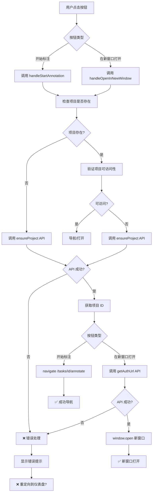

# Label Studio 标注导航修复 - 设计文档

**版本**: 1.0  
**创建日期**: 2026-01-28  
**状态**: 设计阶段

## 1. 问题分析

### 1.1 问题流程图



### 1.2 根本原因

根据代码分析，问题可能出现在以下几个环节：

1. **API 调用失败** - `ensureProject` 或 `getAuthUrl` 返回错误
2. **错误处理不当** - 错误被捕获但处理逻辑导致重定向
3. **认证问题** - 后端 API 返回 401，前端重定向到登录
4. **路由配置** - 路由守卫或中间件导致重定向

### 1.3 调查清单

**前端调查**:
- [ ] 浏览器控制台是否有 JavaScript 错误
- [ ] 网络标签中 API 请求的状态码是什么
- [ ] API 响应内容是什么
- [ ] `navigate()` 是否被调用
- [ ] 是否有其他代码导致重定向

**后端调查**:
- [ ] API 端点是否正确实现
- [ ] 是否返回正确的响应格式
- [ ] 认证中间件是否正常工作
- [ ] 是否有异常或错误日志

## 2. 解决方案设计

### 2.1 前端修复

#### 2.1.1 改进错误处理

**问题**: 当前错误处理可能不够详细，无法准确定位问题

**解决方案**:
```typescript
// 改进的错误处理
const handleError = (error: unknown, context: string) => {
  console.error(`[${context}] Error:`, error);
  
  if (error && typeof error === 'object' && 'response' in error) {
    const axiosError = error as AxiosError;
    const status = axiosError.response?.status;
    const data = axiosError.response?.data as any;
    
    // 记录详细的错误信息
    console.error(`Status: ${status}`);
    console.error(`Data:`, data);
    
    // 根据状态码显示不同的错误提示
    switch (status) {
      case 401:
        message.error(t('annotate.authenticationFailed'));
        // 重定向到登录页
        navigate('/login');
        break;
      case 403:
        message.error(t('annotate.permissionDenied'));
        break;
      case 404:
        message.error(t('annotate.projectNotFound'));
        break;
      case 503:
        message.error(t('annotate.serviceUnavailable'));
        break;
      default:
        message.error(data?.detail || t('annotate.operationFailed'));
    }
  } else {
    message.error(t('annotate.operationFailed'));
  }
};
```

#### 2.1.2 添加调试日志

**问题**: 无法追踪执行流程

**解决方案**:
```typescript
const handleStartAnnotation = async () => {
  if (!id) return;
  
  try {
    setAnnotationLoading(true);
    console.log('[handleStartAnnotation] Starting...', { taskId: id });
    
    const projectId = currentTask.label_studio_project_id;
    console.log('[handleStartAnnotation] Current project ID:', projectId);
    
    if (projectId) {
      console.log('[handleStartAnnotation] Validating project...');
      const validation = await labelStudioService.validateProject(projectId);
      console.log('[handleStartAnnotation] Validation result:', validation);
      
      if (validation.exists && validation.accessible) {
        console.log('[handleStartAnnotation] Project valid, navigating...');
        navigate(`/tasks/${id}/annotate`);
        return;
      }
    }
    
    console.log('[handleStartAnnotation] Creating project...');
    const result = await labelStudioService.ensureProject({
      task_id: id,
      task_name: currentTask.name,
      annotation_type: currentTask.annotation_type,
    });
    console.log('[handleStartAnnotation] Ensure project result:', result);
    
    if (result.status === 'ready') {
      if (result.created && result.project_id !== projectId) {
        console.log('[handleStartAnnotation] Updating task with new project ID...');
        await updateTask.mutateAsync({
          id,
          payload: { label_studio_project_id: result.project_id },
        });
      }
      
      console.log('[handleStartAnnotation] Navigating to annotate page...');
      navigate(`/tasks/${id}/annotate`);
    } else {
      console.error('[handleStartAnnotation] Project creation failed:', result);
      message.error(t('annotate.projectCreationFailed'));
    }
  } catch (error) {
    console.error('[handleStartAnnotation] Exception:', error);
    handleError(error, 'handleStartAnnotation');
  } finally {
    setAnnotationLoading(false);
  }
};
```

#### 2.1.3 验证路由配置

**问题**: 路由可能配置不正确

**解决方案**:
- 检查 `/tasks/{id}/annotate` 路由是否正确配置
- 检查路由守卫是否正常工作
- 检查是否有其他中间件导致重定向

### 2.2 后端修复

#### 2.2.1 验证 API 端点

**检查清单**:
- [ ] `/api/label-studio/projects/ensure` 端点是否正确实现
- [ ] `/api/label-studio/projects/{id}/validate` 端点是否正确实现
- [ ] `/api/label-studio/projects/{id}/auth-url` 端点是否正确实现
- [ ] 所有端点是否返回正确的响应格式
- [ ] 认证中间件是否正常工作

#### 2.2.2 改进错误响应

**问题**: 错误响应可能不够清晰

**解决方案**:
```python
# 改进的错误响应格式
@router.post("/projects/ensure", response_model=EnsureProjectResponse)
async def ensure_project_exists(
    request: EnsureProjectRequest = Body(...),
    current_user: UserModel = Depends(get_current_user),
    db: Session = Depends(get_db_session)
):
    """Ensure Label Studio project exists for task."""
    try:
        logger.info(f"[ensure_project] Starting for task {request.task_id}")
        
        ls = get_label_studio()
        
        # ... 项目创建逻辑 ...
        
        logger.info(f"[ensure_project] Success: project_id={project.id}, created={created}")
        
        return EnsureProjectResponse(
            project_id=str(project.id),
            created=created,
            status="ready",
            task_count=task_count,
            message=message
        )
        
    except LabelStudioIntegrationError as e:
        logger.error(f"[ensure_project] Integration error: {e}")
        raise HTTPException(
            status_code=status.HTTP_500_INTERNAL_SERVER_ERROR,
            detail={
                "error": "project_creation_failed",
                "message": "Failed to create Label Studio project",
                "details": str(e)
            }
        )
    except Exception as e:
        logger.error(f"[ensure_project] Unexpected error: {e}", exc_info=True)
        raise HTTPException(
            status_code=status.HTTP_500_INTERNAL_SERVER_ERROR,
            detail={
                "error": "internal_error",
                "message": "An unexpected error occurred",
                "details": str(e)
            }
        )
```

#### 2.2.3 添加健康检查

**问题**: 无法快速判断 Label Studio 服务是否可用

**解决方案**:
```python
@router.get("/health")
async def check_label_studio_health(
    current_user: UserModel = Depends(get_current_user)
):
    """Check Label Studio service health."""
    try:
        ls = get_label_studio()
        
        # 尝试列出项目作为健康检查
        projects = ls.list_projects()
        
        return {
            "status": "healthy",
            "message": "Label Studio is accessible",
            "timestamp": datetime.now().isoformat()
        }
    except Exception as e:
        logger.error(f"[health_check] Label Studio health check failed: {e}")
        return {
            "status": "unhealthy",
            "message": "Label Studio is not accessible",
            "error": str(e),
            "timestamp": datetime.now().isoformat()
        }
```

### 2.3 集成测试

#### 2.3.1 前端测试

```typescript
describe('TaskDetail - Annotation Navigation', () => {
  describe('开始标注 button', () => {
    it('should navigate to annotate page when project exists', async () => {
      // Mock API responses
      mockValidateProject.mockResolvedValue({
        exists: true,
        accessible: true,
        task_count: 100,
        annotation_count: 50,
        status: 'ready'
      });
      
      // Render component
      render(<TaskDetail />);
      
      // Click button
      const button = screen.getByText('开始标注');
      fireEvent.click(button);
      
      // Wait for navigation
      await waitFor(() => {
        expect(mockNavigate).toHaveBeenCalledWith('/tasks/123/annotate');
      });
    });
    
    it('should create project and navigate when project does not exist', async () => {
      // Mock API responses
      mockValidateProject.mockResolvedValue({
        exists: false,
        accessible: false,
        task_count: 0,
        annotation_count: 0,
        status: 'not_found'
      });
      
      mockEnsureProject.mockResolvedValue({
        project_id: '456',
        created: true,
        status: 'ready',
        task_count: 0,
        message: 'Project created successfully'
      });
      
      // Render component
      render(<TaskDetail />);
      
      // Click button
      const button = screen.getByText('开始标注');
      fireEvent.click(button);
      
      // Wait for project creation and navigation
      await waitFor(() => {
        expect(mockEnsureProject).toHaveBeenCalled();
        expect(mockNavigate).toHaveBeenCalledWith('/tasks/123/annotate');
      });
    });
  });
  
  describe('在新窗口打开 button', () => {
    it('should open Label Studio in new window with auth URL', async () => {
      // Mock API responses
      mockGetAuthUrl.mockResolvedValue({
        url: 'http://localhost:8080/projects/456?token=xyz&lang=zh',
        expires_at: '2026-01-28T12:00:00Z',
        project_id: '456',
        language: 'zh'
      });
      
      // Mock window.open
      const mockOpen = vi.fn();
      window.open = mockOpen;
      
      // Render component
      render(<TaskDetail />);
      
      // Click button
      const button = screen.getByText('在新窗口打开');
      fireEvent.click(button);
      
      // Wait for window.open call
      await waitFor(() => {
        expect(mockOpen).toHaveBeenCalledWith(
          'http://localhost:8080/projects/456?token=xyz&lang=zh',
          '_blank',
          'noopener,noreferrer'
        );
      });
    });
  });
});
```

#### 2.3.2 后端测试

```python
@pytest.mark.asyncio
async def test_ensure_project_success(client, db_session):
    """Test successful project creation."""
    response = await client.post(
        "/api/label-studio/projects/ensure",
        json={
            "task_id": "550e8400-e29b-41d4-a716-446655440000",
            "task_name": "Test Project",
            "annotation_type": "text_classification"
        }
    )
    
    assert response.status_code == 200
    data = response.json()
    assert data["status"] == "ready"
    assert data["project_id"] is not None
    assert isinstance(data["created"], bool)


@pytest.mark.asyncio
async def test_validate_project_success(client):
    """Test project validation."""
    response = await client.get(
        "/api/label-studio/projects/123/validate"
    )
    
    assert response.status_code == 200
    data = response.json()
    assert "exists" in data
    assert "accessible" in data
    assert "status" in data


@pytest.mark.asyncio
async def test_get_auth_url_success(client):
    """Test authenticated URL generation."""
    response = await client.get(
        "/api/label-studio/projects/123/auth-url",
        params={"language": "zh"}
    )
    
    assert response.status_code == 200
    data = response.json()
    assert "url" in data
    assert "expires_at" in data
    assert "project_id" in data
    assert "lang=zh" in data["url"]
```

## 3. 实施步骤

### 3.1 前端修复

1. **改进错误处理** - 添加详细的错误日志和处理
2. **添加调试日志** - 追踪执行流程
3. **验证路由配置** - 确保路由正确配置
4. **测试所有场景** - 包括成功和失败场景

### 3.2 后端修复

1. **验证 API 端点** - 确保所有端点正确实现
2. **改进错误响应** - 返回清晰的错误信息
3. **添加健康检查** - 快速判断服务可用性
4. **添加日志** - 便于问题排查

### 3.3 集成测试

1. **前端单元测试** - 测试按钮点击处理
2. **后端单元测试** - 测试 API 端点
3. **集成测试** - 测试完整流程
4. **E2E 测试** - 测试用户操作

## 4. 正确性属性

### 属性 1: 导航一致性
**对于任何** 用户点击"开始标注"按钮的操作，系统应该**导航到** `/tasks/{id}/annotate` 页面

**验证**: 需求 2.1

### 属性 2: 新窗口打开
**对于任何** 用户点击"在新窗口打开"按钮的操作，系统应该**在新窗口打开** Label Studio 项目

**验证**: 需求 2.2

### 属性 3: 项目自动创建
**对于任何** 项目不存在的情况，系统应该**自动创建**项目后再导航或打开

**验证**: 需求 2.1, 2.2

### 属性 4: 错误处理
**对于任何** API 错误，系统应该**显示清晰的错误提示**而不是重定向

**验证**: 需求 3

## 5. 风险缓解

### 5.1 认证失败
- **风险**: 后端返回 401，导致重定向到登录
- **缓解**: 改进错误处理，显示清晰的错误提示

### 5.2 API 不可用
- **风险**: Label Studio 服务不可用
- **缓解**: 添加健康检查，显示服务不可用提示

### 5.3 路由配置错误
- **风险**: 路由配置不正确导致重定向
- **缓解**: 验证路由配置，添加调试日志

---

**下一步**: 创建任务分解文档 (tasks.md)
