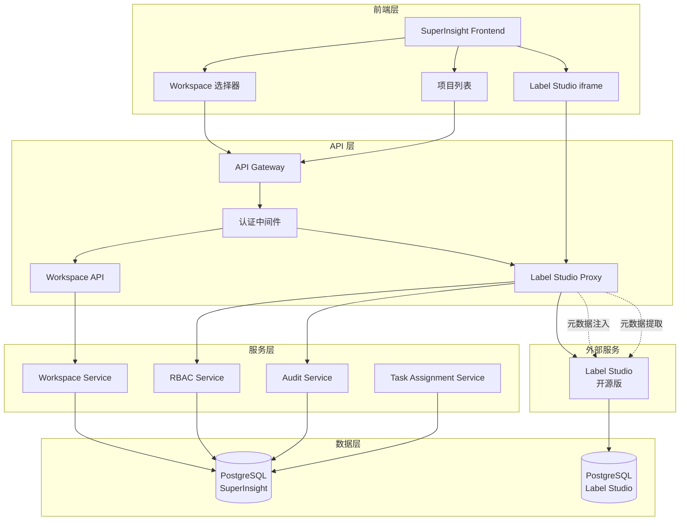

# Label Studio 企业版 Workspace 扩展 - 设计文档

**版本**: 1.0  
**创建日期**: 2026-01-26  
**状态**: 设计中  
**基于**: Label Studio 企业版功能分析

## 1. 概述

### 1.1 设计目标

本设计旨在通过**外部代理层 + 元数据注入**的架构模式，在不修改 Label Studio 开源版源码的前提下，实现企业版的核心功能，特别是 Workspace 组织结构和 RBAC 权限控制。

**核心设计原则**:
1. **零侵入性** - Label Studio 源码零修改
2. **完全可升级** - 支持 Label Studio 任意版本升级
3. **功能完整** - 实现企业版 P0 核心功能
4. **性能优秀** - 代理层延迟 < 200ms
5. **有机集成** - 与现有 iframe 集成和 API 深度结合
6. **完整 i18n** - 所有 UI 组件支持中英文切换

### 1.2 与现有功能的集成

#### 1.2.1 与现有 Label Studio API 集成

**现有实现** (`src/api/label_studio_api.py`):
- ✅ 项目列表查询 (`/api/label-studio/projects`)
- ✅ 项目详情查询 (`/api/label-studio/projects/{project_id}`)
- ✅ 任务列表查询 (`/api/label-studio/projects/{project_id}/tasks`)
- ✅ 健康检查 (`/api/label-studio/health`)

**集成策略**:
1. **扩展现有 API** - 在现有端点中添加 Workspace 过滤参数
2. **保持向后兼容** - 不破坏现有 API 接口
3. **统一错误处理** - 使用相同的错误处理机制
4. **共享认证** - 使用相同的 JWT 认证

**具体集成点**:
```python
# 扩展项目列表 API，添加 workspace_id 过滤
@router.get("/projects", response_model=LabelStudioProjectList)
def list_projects(
    workspace_id: Optional[str] = Query(None, description="Workspace ID filter"),
    page: int = Query(1, ge=1),
    page_size: int = Query(10, ge=1, le=100),
    current_user: UserModel = Depends(get_current_user),
    db: Session = Depends(get_db_session)
):
    """Get list of Label Studio projects, optionally filtered by workspace."""
    # 如果提供了 workspace_id，验证用户权限并过滤项目
    if workspace_id:
        # 验证用户是否是 workspace 成员
        # 只返回该 workspace 的项目
        pass
    # 否则返回所有用户可访问的项目
```

#### 1.2.2 与现有 Label Studio Integration 集成

**现有实现** (`src/label_studio/integration.py`):
- ✅ 项目创建 (`create_project`)
- ✅ 任务导入 (`import_tasks`)
- ✅ 标注导出 (`export_annotations`)
- ✅ Webhook 配置 (`setup_webhooks`)
- ✅ ML 后端配置 (`configure_ml_backend`)

**集成策略**:
1. **扩展 LabelStudioIntegration 类** - 添加 Workspace 支持
2. **元数据注入** - 在项目创建时自动注入 Workspace 信息
3. **数据同步增强** - 同步时关联 Workspace 数据
4. **保持接口一致** - 不改变现有方法签名

**具体集成点**:
```python
class LabelStudioIntegration:
    """扩展现有集成类，添加 Workspace 支持"""
    
    async def create_project(
        self, 
        project_config: ProjectConfig,
        workspace_id: Optional[str] = None  # 新增参数
    ) -> LabelStudioProject:
        """创建项目，支持 Workspace 关联"""
        # 如果提供了 workspace_id，注入元数据
        if workspace_id:
            # 获取 workspace 信息
            workspace = await workspace_service.get_workspace(workspace_id)
            
            # 编码元数据到 description
            metadata = {
                "workspace_id": workspace_id,
                "workspace_name": workspace.name,
                "created_at": datetime.now().isoformat()
            }
            project_config.description = MetadataCodec.encode(
                project_config.description,
                metadata
            )
        
        # 调用原有逻辑
        return await super().create_project(project_config)
```

#### 1.2.3 与现有 iframe 集成深度结合

**现有实现** (`.kiro/specs/label-studio-iframe-integration/`):
- ✅ iframe 容器管理 (`IframeManager`)
- ✅ PostMessage 通信 (`PostMessageBridge`)
- ✅ 权限和上下文传递 (`ContextManager`)
- ✅ 数据同步 (`SyncManager`)
- ✅ 事件处理 (`EventEmitter`)
- ✅ UI 协调 (`UICoordinator`)

**集成策略**:
1. **扩展 AnnotationContext** - 添加 Workspace 信息
2. **增强权限验证** - 基于 Workspace 角色验证
3. **统一上下文管理** - Workspace 上下文与标注上下文统一
4. **保持通信协议** - 使用相同的 PostMessage 协议

**具体集成点**:
```typescript
// 扩展标注上下文，添加 Workspace 信息
interface AnnotationContext {
  user: UserInfo;
  project: ProjectInfo;
  task: TaskInfo;
  permissions: Permission[];
  timestamp: number;
  // 新增 Workspace 信息
  workspace?: {
    id: string;
    name: string;
    role: string;  // owner, admin, manager, reviewer, annotator
    permissions: string[];
  };
}

// 在 iframe 加载时传递完整上下文
bridgeRef.current.send({
  type: 'ANNOTATION_CONTEXT',
  payload: {
    ...annotationContext,
    workspace: {
      id: currentWorkspace,
      name: workspace.name,
      role: userRole,
      permissions: workspacePermissions
    }
  }
});
```

### 1.2 架构对比

#### 企业版架构 (官方)
```
用户 → Label Studio Enterprise → 内置 Workspace/RBAC → PostgreSQL
```

#### 我们的架构 (代理模式)
```
用户 → SuperInsight Frontend → API 代理层 → Label Studio 开源版
                ↓                    ↓
         Workspace Service    元数据注入/提取
                ↓                    ↓
         PostgreSQL (扩展表)   PostgreSQL (Label Studio)
```

**优势**:
- ✅ Label Studio 可以随时升级
- ✅ 不依赖企业版许可
- ✅ 可以自定义扩展功能
- ✅ 与 SuperInsight 深度集成

## 2. 整体架构设计

### 2.1 系统架构图



### 2.2 核心组件说明

| 组件 | 职责 | 技术栈 |
|------|------|--------|
| **Workspace Service** | Workspace CRUD、成员管理 | Python + FastAPI |
| **RBAC Service** | 角色权限验证 | Python + FastAPI |
| **Label Studio Proxy** | API 拦截、元数据注入/提取 | Python + httpx |
| **Task Assignment Service** | 任务自动分配 | Python + Celery |
| **Audit Service** | 审计日志记录 | Python + FastAPI |
| **Workspace Selector** | Workspace 选择 UI | React + TypeScript |
| **Project List** | 项目列表（按 Workspace 过滤） | React + TypeScript |

## 3. 数据模型设计

### 3.1 数据库扩展表

```sql
-- ============================================
-- Workspace 核心表
-- ============================================

-- Workspace 表
CREATE TABLE workspaces (
    id UUID PRIMARY KEY DEFAULT gen_random_uuid(),
    name VARCHAR(255) NOT NULL UNIQUE,
    description TEXT,
    owner_id UUID NOT NULL REFERENCES users(id) ON DELETE RESTRICT,
    
    -- 设置
    settings JSONB DEFAULT '{}'::jsonb,
    
    -- 状态
    is_active BOOLEAN DEFAULT TRUE,
    is_deleted BOOLEAN DEFAULT FALSE,
    
    -- 时间戳
    created_at TIMESTAMP DEFAULT CURRENT_TIMESTAMP,
    updated_at TIMESTAMP DEFAULT CURRENT_TIMESTAMP,
    deleted_at TIMESTAMP,
    
    -- 索引
    CONSTRAINT workspace_name_not_empty CHECK (length(trim(name)) > 0)
);

CREATE INDEX idx_workspaces_owner ON workspaces(owner_id);
CREATE INDEX idx_workspaces_active ON workspaces(is_active) WHERE is_active = TRUE;
CREATE INDEX idx_workspaces_name ON workspaces(name) WHERE is_deleted = FALSE;

-- ============================================
-- 成员和角色表
-- ============================================

-- Workspace 成员表
CREATE TABLE workspace_members (
    id UUID PRIMARY KEY DEFAULT gen_random_uuid(),
    workspace_id UUID NOT NULL REFERENCES workspaces(id) ON DELETE CASCADE,
    user_id UUID NOT NULL REFERENCES users(id) ON DELETE CASCADE,
    
    -- 角色: owner, admin, manager, reviewer, annotator
    role VARCHAR(50) NOT NULL CHECK (role IN ('owner', 'admin', 'manager', 'reviewer', 'annotator')),
    
    -- 状态
    is_active BOOLEAN DEFAULT TRUE,
    
    -- 时间戳
    joined_at TIMESTAMP DEFAULT CURRENT_TIMESTAMP,
    updated_at TIMESTAMP DEFAULT CURRENT_TIMESTAMP,
    
    -- 唯一约束
    CONSTRAINT workspace_member_unique UNIQUE (workspace_id, user_id)
);

CREATE INDEX idx_workspace_members_user ON workspace_members(user_id);
CREATE INDEX idx_workspace_members_workspace ON workspace_members(workspace_id);
CREATE INDEX idx_workspace_members_role ON workspace_members(workspace_id, role);

-- ============================================
-- 项目关联表
-- ============================================

-- Workspace 项目映射表
CREATE TABLE workspace_projects (
    id UUID PRIMARY KEY DEFAULT gen_random_uuid(),
    workspace_id UUID NOT NULL REFERENCES workspaces(id) ON DELETE CASCADE,
    
    -- Label Studio 项目 ID
    label_studio_project_id INTEGER NOT NULL,
    
    -- SuperInsight 内部项目 ID (可选)
    superinsight_project_id UUID REFERENCES tasks(id),
    
    -- 元数据
    metadata JSONB DEFAULT '{}'::jsonb,
    
    -- 时间戳
    created_at TIMESTAMP DEFAULT CURRENT_TIMESTAMP,
    updated_at TIMESTAMP DEFAULT CURRENT_TIMESTAMP,
    
    -- 唯一约束
    CONSTRAINT workspace_project_unique UNIQUE (workspace_id, label_studio_project_id)
);

CREATE INDEX idx_workspace_projects_workspace ON workspace_projects(workspace_id);
CREATE INDEX idx_workspace_projects_ls_project ON workspace_projects(label_studio_project_id);
CREATE INDEX idx_workspace_projects_si_project ON workspace_projects(superinsight_project_id);

-- ============================================
-- 项目成员表 (项目级角色)
-- ============================================

-- 项目成员表
CREATE TABLE project_members (
    id UUID PRIMARY KEY DEFAULT gen_random_uuid(),
    workspace_project_id UUID NOT NULL REFERENCES workspace_projects(id) ON DELETE CASCADE,
    user_id UUID NOT NULL REFERENCES users(id) ON DELETE CASCADE,
    
    -- 项目级角色: annotator, reviewer
    project_role VARCHAR(50) NOT NULL CHECK (project_role IN ('annotator', 'reviewer')),
    
    -- 状态
    is_active BOOLEAN DEFAULT TRUE,
    
    -- 时间戳
    assigned_at TIMESTAMP DEFAULT CURRENT_TIMESTAMP,
    updated_at TIMESTAMP DEFAULT CURRENT_TIMESTAMP,
    
    -- 唯一约束
    CONSTRAINT project_member_unique UNIQUE (workspace_project_id, user_id)
);

CREATE INDEX idx_project_members_user ON project_members(user_id);
CREATE INDEX idx_project_members_project ON project_members(workspace_project_id);
CREATE INDEX idx_project_members_role ON project_members(workspace_project_id, project_role);
```


### 3.2 角色权限矩阵

基于 [Label Studio 企业版 RBAC](https://labelstud.io/guide/enterprise_features#role-hierarchy-and-permissions)：

| 角色 | 作用域 | Workspace 管理 | 项目管理 | 成员管理 | 标注 | 审核 | 数据导出 |
|------|--------|---------------|---------|---------|------|------|---------|
| **Owner** | Organization | ✅ 完全控制 | ✅ 所有项目 | ✅ 完全控制 | ✅ | ✅ | ✅ |
| **Admin** | Organization | ✅ 查看/编辑 | ✅ 所有项目 | ✅ 添加/移除 | ✅ | ✅ | ✅ |
| **Manager** | Workspace | ✅ 查看 | ✅ 创建/编辑 | ✅ 项目级 | ✅ | ✅ | ✅ |
| **Reviewer** | Project | ❌ | ❌ 只读 | ❌ | ✅ | ✅ | ✅ |
| **Annotator** | Project | ❌ | ❌ 只读 | ❌ | ✅ | ❌ | ❌ |

**权限继承规则**:
- Owner 和 Admin 可以访问所有 Workspace
- Manager 只能访问分配的 Workspace
- Reviewer 和 Annotator 只能访问分配的项目
- 项目级角色独立于 Workspace 角色

### 3.3 元数据编码方案

为了在不修改 Label Studio 的情况下存储 Workspace 信息，我们使用**元数据编码**方案：

#### 编码格式

```python
# 原始项目描述
original_description = "这是一个文本分类项目"

# Workspace 元数据
workspace_meta = {
    "workspace_id": "uuid-here",
    "workspace_name": "研发部门",
    "created_by": "user-id",
    "version": "1.0"
}

# 编码后的描述
encoded_description = "[SUPERINSIGHT_META:eyJ3b3Jrc3BhY2VfaWQiOi4uLn0=]这是一个文本分类项目"
```

#### 编码/解码实现

```python
import json
import base64
import re

class MetadataCodec:
    """元数据编码/解码器"""
    
    PREFIX = "[SUPERINSIGHT_META:"
    SUFFIX = "]"
    VERSION = "1.0"
    
    @classmethod
    def encode(cls, original_text: str, metadata: dict) -> str:
        """编码元数据到文本中"""
        # 添加版本号
        metadata["_version"] = cls.VERSION
        metadata["_original"] = original_text
        
        # JSON 序列化 + Base64 编码
        meta_json = json.dumps(metadata, ensure_ascii=False)
        meta_b64 = base64.b64encode(meta_json.encode('utf-8')).decode('ascii')
        
        # 拼接格式
        return f"{cls.PREFIX}{meta_b64}{cls.SUFFIX}{original_text}"
    
    @classmethod
    def decode(cls, encoded_text: str) -> tuple[str, dict]:
        """从文本中解码元数据"""
        # 匹配模式
        pattern = rf'{re.escape(cls.PREFIX)}([A-Za-z0-9+/=]+){re.escape(cls.SUFFIX)}'
        match = re.match(pattern, encoded_text)
        
        if not match:
            return encoded_text, {}
        
        try:
            # Base64 解码 + JSON 反序列化
            meta_b64 = match.group(1)
            meta_json = base64.b64decode(meta_b64).decode('utf-8')
            metadata = json.loads(meta_json)
            
            # 提取原始文本
            original_text = metadata.pop("_original", "")
            metadata.pop("_version", None)
            
            return original_text, metadata
        except Exception as e:
            logger.warning(f"Failed to decode metadata: {e}")
            return encoded_text, {}
    
    @classmethod
    def has_metadata(cls, text: str) -> bool:
        """检查文本是否包含元数据"""
        return text.startswith(cls.PREFIX)
```

## 4. 核心服务设计

### 4.1 Workspace Service

```python
# src/label_studio/workspace_service.py
"""
Workspace 管理服务
"""

from typing import List, Optional
from uuid import UUID
from sqlalchemy import select, and_
from sqlalchemy.orm import Session

from src.database.connection import get_db_session
from src.database.models import WorkspaceModel, WorkspaceMemberModel


class WorkspaceService:
    """Workspace 管理服务"""
    
    async def create_workspace(
        self,
        name: str,
        description: str,
        owner_id: str,
        settings: Optional[dict] = None
    ) -> WorkspaceModel:
        """
        创建 Workspace
        
        Args:
            name: Workspace 名称（唯一）
            description: 描述
            owner_id: 所有者用户 ID
            settings: 自定义设置
            
        Returns:
            创建的 Workspace 对象
            
        Raises:
            ValueError: 名称已存在
        """
        with get_db_session() as db:
            # 检查名称唯一性
            existing = db.execute(
                select(WorkspaceModel).where(
                    and_(
                        WorkspaceModel.name == name,
                        WorkspaceModel.is_deleted == False
                    )
                )
            ).scalar_one_or_none()
            
            if existing:
                raise ValueError(f"Workspace '{name}' already exists")
            
            # 创建 Workspace
            workspace = WorkspaceModel(
                name=name,
                description=description,
                owner_id=UUID(owner_id),
                settings=settings or {}
            )
            
            db.add(workspace)
            db.commit()
            db.refresh(workspace)
            
            # 自动添加创建者为 Owner
            await self.add_member(
                workspace_id=str(workspace.id),
                user_id=owner_id,
                role="owner"
            )
            
            logger.info(f"Created workspace: {workspace.id} by {owner_id}")
            return workspace
    
    async def get_workspace(self, workspace_id: str) -> Optional[WorkspaceModel]:
        """获取 Workspace"""
        with get_db_session() as db:
            return db.execute(
                select(WorkspaceModel).where(
                    and_(
                        WorkspaceModel.id == UUID(workspace_id),
                        WorkspaceModel.is_deleted == False
                    )
                )
            ).scalar_one_or_none()
    
    async def list_user_workspaces(self, user_id: str) -> List[WorkspaceModel]:
        """列出用户可访问的所有 Workspaces"""
        with get_db_session() as db:
            # 查询用户是成员的所有 workspaces
            stmt = select(WorkspaceModel).join(
                WorkspaceMemberModel,
                WorkspaceModel.id == WorkspaceMemberModel.workspace_id
            ).where(
                and_(
                    WorkspaceMemberModel.user_id == UUID(user_id),
                    WorkspaceMemberModel.is_active == True,
                    WorkspaceModel.is_active == True,
                    WorkspaceModel.is_deleted == False
                )
            ).order_by(WorkspaceModel.created_at.desc())
            
            return db.execute(stmt).scalars().all()
    
    async def add_member(
        self,
        workspace_id: str,
        user_id: str,
        role: str = "member"
    ) -> WorkspaceMemberModel:
        """
        添加成员到 Workspace
        
        Args:
            workspace_id: Workspace ID
            user_id: 用户 ID
            role: 角色 (owner/admin/manager/reviewer/annotator)
            
        Returns:
            创建的成员对象
        """
        with get_db_session() as db:
            # 检查是否已存在
            existing = db.execute(
                select(WorkspaceMemberModel).where(
                    and_(
                        WorkspaceMemberModel.workspace_id == UUID(workspace_id),
                        WorkspaceMemberModel.user_id == UUID(user_id)
                    )
                )
            ).scalar_one_or_none()
            
            if existing:
                # 更新角色
                existing.role = role
                existing.is_active = True
                db.commit()
                db.refresh(existing)
                return existing
            
            # 创建新成员
            member = WorkspaceMemberModel(
                workspace_id=UUID(workspace_id),
                user_id=UUID(user_id),
                role=role
            )
            
            db.add(member)
            db.commit()
            db.refresh(member)
            
            logger.info(f"Added member {user_id} to workspace {workspace_id} as {role}")
            return member
    
    async def remove_member(self, workspace_id: str, user_id: str) -> bool:
        """从 Workspace 移除成员"""
        with get_db_session() as db:
            member = db.execute(
                select(WorkspaceMemberModel).where(
                    and_(
                        WorkspaceMemberModel.workspace_id == UUID(workspace_id),
                        WorkspaceMemberModel.user_id == UUID(user_id)
                    )
                )
            ).scalar_one_or_none()
            
            if not member:
                return False
            
            # 软删除（设置为不活跃）
            member.is_active = False
            db.commit()
            
            logger.info(f"Removed member {user_id} from workspace {workspace_id}")
            return True
    
    async def get_member_role(
        self,
        workspace_id: str,
        user_id: str
    ) -> Optional[str]:
        """获取用户在 Workspace 中的角色"""
        with get_db_session() as db:
            member = db.execute(
                select(WorkspaceMemberModel).where(
                    and_(
                        WorkspaceMemberModel.workspace_id == UUID(workspace_id),
                        WorkspaceMemberModel.user_id == UUID(user_id),
                        WorkspaceMemberModel.is_active == True
                    )
                )
            ).scalar_one_or_none()
            
            return member.role if member else None
    
    async def is_member(self, workspace_id: str, user_id: str) -> bool:
        """检查用户是否是 Workspace 成员"""
        role = await self.get_member_role(workspace_id, user_id)
        return role is not None
```

### 4.2 RBAC Service

```python
# src/label_studio/rbac_service.py
"""
基于角色的访问控制服务
"""

from typing import List, Optional
from enum import Enum


class Permission(str, Enum):
    """权限枚举"""
    # Workspace 权限
    WORKSPACE_VIEW = "workspace.view"
    WORKSPACE_EDIT = "workspace.edit"
    WORKSPACE_DELETE = "workspace.delete"
    WORKSPACE_MANAGE_MEMBERS = "workspace.manage_members"
    
    # 项目权限
    PROJECT_VIEW = "project.view"
    PROJECT_CREATE = "project.create"
    PROJECT_EDIT = "project.edit"
    PROJECT_DELETE = "project.delete"
    PROJECT_MANAGE_MEMBERS = "project.manage_members"
    
    # 任务权限
    TASK_VIEW = "task.view"
    TASK_ANNOTATE = "task.annotate"
    TASK_REVIEW = "task.review"
    TASK_ASSIGN = "task.assign"
    
    # 数据权限
    DATA_EXPORT = "data.export"
    DATA_IMPORT = "data.import"


class RBACService:
    """RBAC 服务"""
    
    # 角色权限映射
    ROLE_PERMISSIONS = {
        "owner": [
            # 所有权限
            Permission.WORKSPACE_VIEW,
            Permission.WORKSPACE_EDIT,
            Permission.WORKSPACE_DELETE,
            Permission.WORKSPACE_MANAGE_MEMBERS,
            Permission.PROJECT_VIEW,
            Permission.PROJECT_CREATE,
            Permission.PROJECT_EDIT,
            Permission.PROJECT_DELETE,
            Permission.PROJECT_MANAGE_MEMBERS,
            Permission.TASK_VIEW,
            Permission.TASK_ANNOTATE,
            Permission.TASK_REVIEW,
            Permission.TASK_ASSIGN,
            Permission.DATA_EXPORT,
            Permission.DATA_IMPORT,
        ],
        "admin": [
            # 除删除 Workspace 外的所有权限
            Permission.WORKSPACE_VIEW,
            Permission.WORKSPACE_EDIT,
            Permission.WORKSPACE_MANAGE_MEMBERS,
            Permission.PROJECT_VIEW,
            Permission.PROJECT_CREATE,
            Permission.PROJECT_EDIT,
            Permission.PROJECT_DELETE,
            Permission.PROJECT_MANAGE_MEMBERS,
            Permission.TASK_VIEW,
            Permission.TASK_ANNOTATE,
            Permission.TASK_REVIEW,
            Permission.TASK_ASSIGN,
            Permission.DATA_EXPORT,
            Permission.DATA_IMPORT,
        ],
        "manager": [
            # Workspace 查看 + 项目管理
            Permission.WORKSPACE_VIEW,
            Permission.PROJECT_VIEW,
            Permission.PROJECT_CREATE,
            Permission.PROJECT_EDIT,
            Permission.PROJECT_MANAGE_MEMBERS,
            Permission.TASK_VIEW,
            Permission.TASK_ANNOTATE,
            Permission.TASK_REVIEW,
            Permission.TASK_ASSIGN,
            Permission.DATA_EXPORT,
            Permission.DATA_IMPORT,
        ],
        "reviewer": [
            # 项目查看 + 审核
            Permission.PROJECT_VIEW,
            Permission.TASK_VIEW,
            Permission.TASK_ANNOTATE,
            Permission.TASK_REVIEW,
            Permission.DATA_EXPORT,
        ],
        "annotator": [
            # 项目查看 + 标注
            Permission.PROJECT_VIEW,
            Permission.TASK_VIEW,
            Permission.TASK_ANNOTATE,
        ],
    }
    
    def __init__(self, workspace_service):
        self.workspace_service = workspace_service
    
    async def check_permission(
        self,
        user_id: str,
        workspace_id: str,
        permission: Permission
    ) -> bool:
        """
        检查用户是否有指定权限
        
        Args:
            user_id: 用户 ID
            workspace_id: Workspace ID
            permission: 权限
            
        Returns:
            是否有权限
        """
        # 获取用户角色
        role = await self.workspace_service.get_member_role(workspace_id, user_id)
        
        if not role:
            return False
        
        # 检查角色权限
        role_permissions = self.ROLE_PERMISSIONS.get(role, [])
        return permission in role_permissions
    
    async def get_user_permissions(
        self,
        user_id: str,
        workspace_id: str
    ) -> List[Permission]:
        """获取用户在 Workspace 中的所有权限"""
        role = await self.workspace_service.get_member_role(workspace_id, user_id)
        
        if not role:
            return []
        
        return self.ROLE_PERMISSIONS.get(role, [])
    
    async def can_access_project(
        self,
        user_id: str,
        workspace_id: str,
        project_id: int
    ) -> bool:
        """检查用户是否可以访问项目"""
        # 检查是否是 Workspace 成员
        is_member = await self.workspace_service.is_member(workspace_id, user_id)
        
        if not is_member:
            return False
        
        # 检查项目查看权限
        return await self.check_permission(
            user_id,
            workspace_id,
            Permission.PROJECT_VIEW
        )
```


### 4.3 Label Studio Proxy

```python
# src/label_studio/proxy.py
"""
Label Studio API 代理层
拦截、增强和转发 API 请求
"""

import logging
from typing import Dict, Any, Optional
import httpx
from fastapi import HTTPException, status

from src.label_studio.workspace_service import WorkspaceService
from src.label_studio.rbac_service import RBACService, Permission
from src.label_studio.metadata_codec import MetadataCodec


logger = logging.getLogger(__name__)


class LabelStudioProxy:
    """Label Studio API 代理"""
    
    def __init__(
        self,
        label_studio_url: str,
        label_studio_token: str,
        workspace_service: WorkspaceService,
        rbac_service: RBACService
    ):
        self.ls_url = label_studio_url.rstrip('/')
        self.ls_token = label_studio_token
        self.workspace_service = workspace_service
        self.rbac_service = rbac_service
        
        self.headers = {
            'Authorization': f'Token {self.ls_token}',
            'Content-Type': 'application/json'
        }
    
    async def proxy_request(
        self,
        method: str,
        path: str,
        user_id: str,
        workspace_id: Optional[str] = None,
        body: Optional[Dict[str, Any]] = None,
        params: Optional[Dict[str, Any]] = None
    ) -> Dict[str, Any]:
        """
        代理请求到 Label Studio
        
        流程:
        1. 权限验证
        2. 请求预处理（元数据注入）
        3. 转发到 Label Studio
        4. 响应后处理（元数据提取）
        5. 审计日志
        """
        try:
            # 1. 权限验证
            await self._verify_permissions(method, path, user_id, workspace_id)
            
            # 2. 请求预处理
            body = await self._preprocess_request(
                method, path, user_id, workspace_id, body
            )
            
            # 3. 转发请求
            async with httpx.AsyncClient(timeout=60.0) as client:
                url = f"{self.ls_url}{path}"
                
                response = await client.request(
                    method=method,
                    url=url,
                    headers=self.headers,
                    json=body if body else None,
                    params=params
                )
                
                if response.status_code >= 400:
                    raise HTTPException(
                        status_code=response.status_code,
                        detail=f"Label Studio error: {response.text}"
                    )
                
                result = response.json() if response.text else {}
            
            # 4. 响应后处理
            result = await self._postprocess_response(
                method, path, user_id, workspace_id, result
            )
            
            # 5. 审计日志（异步）
            # await self.audit_service.log_action(...)
            
            return result
            
        except HTTPException:
            raise
        except Exception as e:
            logger.error(f"Proxy request error: {str(e)}")
            raise HTTPException(
                status_code=status.HTTP_500_INTERNAL_SERVER_ERROR,
                detail=f"Proxy error: {str(e)}"
            )
    
    async def _verify_permissions(
        self,
        method: str,
        path: str,
        user_id: str,
        workspace_id: Optional[str]
    ) -> None:
        """验证用户权限"""
        if not workspace_id:
            return  # 无 workspace 上下文，跳过验证
        
        # 检查是否是 workspace 成员
        is_member = await self.workspace_service.is_member(workspace_id, user_id)
        if not is_member:
            raise HTTPException(
                status_code=status.HTTP_403_FORBIDDEN,
                detail="You are not a member of this workspace"
            )
        
        # 检查操作权限
        required_permission = self._get_required_permission(method, path)
        has_permission = await self.rbac_service.check_permission(
            user_id, workspace_id, required_permission
        )
        
        if not has_permission:
            raise HTTPException(
                status_code=status.HTTP_403_FORBIDDEN,
                detail=f"Insufficient permissions for {required_permission}"
            )
    
    async def _preprocess_request(
        self,
        method: str,
        path: str,
        user_id: str,
        workspace_id: Optional[str],
        body: Optional[Dict[str, Any]]
    ) -> Optional[Dict[str, Any]]:
        """请求预处理：注入 Workspace 元数据"""
        if not body or not workspace_id:
            return body
        
        # 创建项目时注入 workspace 信息
        if method == "POST" and "/api/projects" in path:
            workspace = await self.workspace_service.get_workspace(workspace_id)
            
            if workspace:
                # 准备元数据
                workspace_meta = {
                    "workspace_id": workspace_id,
                    "workspace_name": workspace.name,
                    "created_by": user_id,
                    "created_at": datetime.now().isoformat()
                }
                
                # 编码到 description
                original_desc = body.get("description", "")
                body["description"] = MetadataCodec.encode(
                    original_desc,
                    workspace_meta
                )
                
                logger.info(f"Injected workspace metadata: {workspace_id}")
        
        return body
    
    async def _postprocess_response(
        self,
        method: str,
        path: str,
        user_id: str,
        workspace_id: Optional[str],
        result: Dict[str, Any]
    ) -> Dict[str, Any]:
        """响应后处理：提取和增强 Workspace 信息"""
        # 列出项目时，添加 workspace 信息
        if method == "GET" and "/api/projects" in path:
            if isinstance(result, list):
                for project in result:
                    await self._enhance_project(project)
            elif isinstance(result, dict):
                if "results" in result:
                    for project in result["results"]:
                        await self._enhance_project(project)
                elif "id" in result:
                    await self._enhance_project(result)
        
        return result
    
    async def _enhance_project(self, project: Dict[str, Any]) -> None:
        """增强项目数据，添加 workspace 信息"""
        try:
            description = project.get("description", "")
            
            if MetadataCodec.has_metadata(description):
                # 解码元数据
                original_desc, workspace_meta = MetadataCodec.decode(description)
                
                # 恢复原始描述
                project["description"] = original_desc
                
                # 添加 workspace 信息
                project["workspace"] = workspace_meta
                
                # 获取完整 workspace 信息
                workspace_id = workspace_meta.get("workspace_id")
                if workspace_id:
                    workspace = await self.workspace_service.get_workspace(workspace_id)
                    if workspace:
                        project["workspace"]["name"] = workspace.name
                        project["workspace"]["owner_id"] = str(workspace.owner_id)
        except Exception as e:
            logger.warning(f"Failed to enhance project: {str(e)}")
    
    def _get_required_permission(self, method: str, path: str) -> Permission:
        """根据请求类型获取所需权限"""
        if method == "GET":
            return Permission.PROJECT_VIEW
        elif method == "POST":
            if "/api/projects" in path:
                return Permission.PROJECT_CREATE
            return Permission.PROJECT_EDIT
        elif method in ["PUT", "PATCH"]:
            return Permission.PROJECT_EDIT
        elif method == "DELETE":
            return Permission.PROJECT_DELETE
        else:
            return Permission.PROJECT_VIEW
```

## 5. i18n 国际化设计

### 5.1 翻译文件结构

**文件位置**:
- 中文: `frontend/src/locales/zh/workspace.json`
- 英文: `frontend/src/locales/en/workspace.json`

**翻译键结构** (遵循 `.kiro/steering/i18n-translation-rules.md`):
```json
{
  "workspace": {
    "title": "工作空间",
    "name": "工作空间名称",
    "members": {
      "title": "成员管理",
      "add": "添加成员",
      "role": "角色"
    },
    "roles": {
      "owner": "所有者",
      "admin": "管理员",
      "descriptions": {
        "owner": "拥有工作空间的完全控制权"
      }
    }
  }
}
```

**关键规则**:
1. **对象类型键** - 使用嵌套对象组织翻译
2. **避免重复键** - 每个键在同一文件中只定义一次
3. **结构一致性** - 中英文文件保持相同的键结构
4. **命名规范** - 使用 camelCase 命名

### 5.2 翻译覆盖范围

**必须翻译的组件**:
- ✅ Workspace 选择器 (`WorkspaceSelector`)
- ✅ Workspace 列表页 (`WorkspaceList`)
- ✅ Workspace 创建/编辑表单 (`WorkspaceForm`)
- ✅ 成员管理页面 (`MemberManagement`)
- ✅ 项目列表（Workspace 过滤）(`ProjectList`)
- ✅ 权限说明 (`PermissionDetails`)
- ✅ 审计日志 (`AuditLog`)
- ✅ 设置页面 (`WorkspaceSettings`)
- ✅ 错误提示 (`ErrorMessages`)
- ✅ 确认对话框 (`ConfirmDialogs`)

**翻译使用示例**:
```typescript
import { useTranslation } from 'react-i18next';

const WorkspaceSelector: React.FC = () => {
  const { t } = useTranslation();
  
  return (
    <Select
      placeholder={t('workspace.selector.placeholder')}
      // 使用对象类型键的子键
    >
      {workspaces?.map((workspace) => (
        <Select.Option key={workspace.id} value={workspace.id}>
          {workspace.name}
        </Select.Option>
      ))}
    </Select>
  );
};
```

### 5.3 动态翻译

**带参数的翻译**:
```typescript
// 翻译文件
{
  "workspace": {
    "messages": {
      "deleteConfirm": "确定要删除工作空间 \"{{name}}\" 吗？",
      "switchSuccess": "已切换到工作空间 \"{{name}}\""
    }
  }
}

// 使用
const message = t('workspace.messages.deleteConfirm', { name: workspace.name });
const success = t('workspace.messages.switchSuccess', { name: workspace.name });
```

**复数形式**:
```typescript
// 翻译文件
{
  "workspace": {
    "members": {
      "count": "{{count}} 名成员",
      "count_plural": "{{count}} 名成员"
    }
  }
}

// 使用
const memberCount = t('workspace.members.count', { count: members.length });
```

### 5.4 i18n 验证清单

**开发阶段**:
- [ ] 所有 UI 文本使用 `t()` 函数
- [ ] 翻译键使用正确的对象路径
- [ ] 中英文文件结构一致
- [ ] 无重复翻译键
- [ ] 动态文本使用参数化翻译

**测试阶段**:
- [ ] 切换语言后所有文本正确显示
- [ ] 无 "returned an object instead of string" 错误
- [ ] 无缺失翻译键警告
- [ ] 动态参数正确替换
- [ ] 复数形式正确显示

**代码审查**:
- [ ] 检查翻译键类型（对象 vs 字符串）
- [ ] 验证无硬编码文本
- [ ] 确认所有语言文件已更新
- [ ] 检查翻译文本的准确性

## 6. 前端集成设计

### 6.1 Workspace 选择器组件

```typescript
// frontend/src/components/WorkspaceSelector/index.tsx
import React, { useState, useEffect } from 'react';
import { Select, Space, Typography } from 'antd';
import { FolderOutlined } from '@ant-design/icons';
import { useWorkspaces } from '@/hooks/useWorkspaces';

const { Text } = Typography;

interface WorkspaceSelectorProps {
  value?: string;
  onChange?: (workspaceId: string) => void;
  style?: React.CSSProperties;
}

export const WorkspaceSelector: React.FC<WorkspaceSelectorProps> = ({
  value,
  onChange,
  style
}) => {
  const { data: workspaces, isLoading } = useWorkspaces();
  const [selectedWorkspace, setSelectedWorkspace] = useState<string | undefined>(value);
  
  useEffect(() => {
    // 如果没有选中的 workspace，自动选择第一个
    if (!selectedWorkspace && workspaces && workspaces.length > 0) {
      const firstWorkspace = workspaces[0].id;
      setSelectedWorkspace(firstWorkspace);
      onChange?.(firstWorkspace);
    }
  }, [workspaces, selectedWorkspace, onChange]);
  
  const handleChange = (workspaceId: string) => {
    setSelectedWorkspace(workspaceId);
    onChange?.(workspaceId);
    
    // 保存到 localStorage
    localStorage.setItem('current_workspace', workspaceId);
  };
  
  return (
    <Select
      value={selectedWorkspace}
      onChange={handleChange}
      loading={isLoading}
      style={{ minWidth: 200, ...style }}
      placeholder="选择工作空间"
      optionLabelProp="label"
    >
      {workspaces?.map((workspace) => (
        <Select.Option
          key={workspace.id}
          value={workspace.id}
          label={
            <Space>
              <FolderOutlined />
              <Text>{workspace.name}</Text>
            </Space>
          }
        >
          <Space direction="vertical" size={0}>
            <Text strong>{workspace.name}</Text>
            <Text type="secondary" style={{ fontSize: 12 }}>
              {workspace.description}
            </Text>
          </Space>
        </Select.Option>
      ))}
    </Select>
  );
};
```

### 5.2 项目列表（按 Workspace 过滤）

```typescript
// frontend/src/pages/Projects/index.tsx
import React, { useState } from 'react';
import { Card, Table, Button, Space } from 'antd';
import { PlusOutlined } from '@ant-design/icons';
import { WorkspaceSelector } from '@/components/WorkspaceSelector';
import { useProjects } from '@/hooks/useProjects';

export const ProjectsPage: React.FC = () => {
  const [currentWorkspace, setCurrentWorkspace] = useState<string>();
  
  // 根据 workspace 过滤项目
  const { data: projects, isLoading } = useProjects({
    workspace_id: currentWorkspace
  });
  
  const columns = [
    {
      title: '项目名称',
      dataIndex: 'title',
      key: 'title',
    },
    {
      title: '工作空间',
      dataIndex: ['workspace', 'name'],
      key: 'workspace',
    },
    {
      title: '任务数',
      dataIndex: 'task_count',
      key: 'task_count',
    },
    {
      title: '标注数',
      dataIndex: 'annotation_count',
      key: 'annotation_count',
    },
    {
      title: '创建时间',
      dataIndex: 'created_at',
      key: 'created_at',
    },
    {
      title: '操作',
      key: 'actions',
      render: (_, record) => (
        <Space>
          <Button type="link">查看</Button>
          <Button type="link">编辑</Button>
        </Space>
      ),
    },
  ];
  
  return (
    <Card
      title="项目管理"
      extra={
        <Space>
          <WorkspaceSelector
            value={currentWorkspace}
            onChange={setCurrentWorkspace}
          />
          <Button type="primary" icon={<PlusOutlined />}>
            创建项目
          </Button>
        </Space>
      }
    >
      <Table
        columns={columns}
        dataSource={projects}
        loading={isLoading}
        rowKey="id"
      />
    </Card>
  );
};
```

### 5.3 iframe 集成中的 Workspace 上下文

```typescript
// frontend/src/components/LabelStudioIframe/index.tsx
import React, { useEffect, useRef } from 'react';
import { useWorkspaceContext } from '@/hooks/useWorkspaceContext';
import { PostMessageBridge } from '@/utils/postMessageBridge';

interface LabelStudioIframeProps {
  projectId: number;
  workspaceId: string;
  onAnnotationComplete?: (data: any) => void;
}

export const LabelStudioIframe: React.FC<LabelStudioIframeProps> = ({
  projectId,
  workspaceId,
  onAnnotationComplete
}) => {
  const iframeRef = useRef<HTMLIFrameElement>(null);
  const bridgeRef = useRef<PostMessageBridge>();
  
  // 获取 workspace 上下文
  const { workspace, userRole, permissions } = useWorkspaceContext(workspaceId);
  
  useEffect(() => {
    if (!iframeRef.current || !workspace) return;
    
    // 初始化 PostMessage 桥梁
    bridgeRef.current = new PostMessageBridge(iframeRef.current);
    
    // 发送 workspace 上下文到 iframe
    bridgeRef.current.send({
      type: 'WORKSPACE_CONTEXT',
      payload: {
        workspace_id: workspaceId,
        workspace_name: workspace.name,
        user_role: userRole,
        permissions: permissions,
        project_id: projectId
      }
    });
    
    // 监听标注完成事件
    bridgeRef.current.on('ANNOTATION_COMPLETE', (data) => {
      onAnnotationComplete?.(data);
    });
    
    return () => {
      bridgeRef.current?.cleanup();
    };
  }, [workspace, workspaceId, projectId, userRole, permissions]);
  
  return (
    <iframe
      ref={iframeRef}
      src={`/label-studio/projects/${projectId}`}
      style={{
        width: '100%',
        height: '100vh',
        border: 'none'
      }}
      title="Label Studio"
    />
  );
};
```

## 6. API 端点设计

### 6.1 Workspace API

```python
# src/api/workspace.py
"""
Workspace API 端点
"""

from fastapi import APIRouter, Depends, HTTPException, status
from pydantic import BaseModel
from typing import List, Optional

from src.api.auth import get_current_user
from src.security.models import UserModel
from src.label_studio.workspace_service import WorkspaceService


router = APIRouter(prefix="/api/workspaces", tags=["Workspaces"])


# Request/Response Models
class WorkspaceCreate(BaseModel):
    name: str
    description: Optional[str] = None
    settings: Optional[dict] = None


class WorkspaceResponse(BaseModel):
    id: str
    name: str
    description: Optional[str]
    owner_id: str
    is_active: bool
    created_at: str
    updated_at: str


class MemberAdd(BaseModel):
    user_id: str
    role: str  # owner, admin, manager, reviewer, annotator


# Endpoints
@router.post("/", response_model=WorkspaceResponse)
async def create_workspace(
    data: WorkspaceCreate,
    current_user: UserModel = Depends(get_current_user),
    workspace_service: WorkspaceService = Depends()
):
    """创建 Workspace"""
    workspace = await workspace_service.create_workspace(
        name=data.name,
        description=data.description or "",
        owner_id=str(current_user.id),
        settings=data.settings
    )
    
    return WorkspaceResponse(
        id=str(workspace.id),
        name=workspace.name,
        description=workspace.description,
        owner_id=str(workspace.owner_id),
        is_active=workspace.is_active,
        created_at=workspace.created_at.isoformat(),
        updated_at=workspace.updated_at.isoformat()
    )


@router.get("/", response_model=List[WorkspaceResponse])
async def list_workspaces(
    current_user: UserModel = Depends(get_current_user),
    workspace_service: WorkspaceService = Depends()
):
    """列出用户可访问的 Workspaces"""
    workspaces = await workspace_service.list_user_workspaces(str(current_user.id))
    
    return [
        WorkspaceResponse(
            id=str(ws.id),
            name=ws.name,
            description=ws.description,
            owner_id=str(ws.owner_id),
            is_active=ws.is_active,
            created_at=ws.created_at.isoformat(),
            updated_at=ws.updated_at.isoformat()
        )
        for ws in workspaces
    ]


@router.post("/{workspace_id}/members")
async def add_member(
    workspace_id: str,
    data: MemberAdd,
    current_user: UserModel = Depends(get_current_user),
    workspace_service: WorkspaceService = Depends()
):
    """添加成员到 Workspace"""
    # 验证权限（需要是 owner 或 admin）
    user_role = await workspace_service.get_member_role(workspace_id, str(current_user.id))
    
    if user_role not in ["owner", "admin"]:
        raise HTTPException(
            status_code=status.HTTP_403_FORBIDDEN,
            detail="Only owners and admins can add members"
        )
    
    member = await workspace_service.add_member(
        workspace_id=workspace_id,
        user_id=data.user_id,
        role=data.role
    )
    
    return {"success": True, "member_id": str(member.id)}
```

## 7. 正确性属性

### 属性 1: Workspace 数据隔离
**对于任何** 用户查询项目列表的操作，系统应该**只返回**其有权访问的 Workspace 中的项目

**验证**: 需求 8

### 属性 2: 权限一致性
**对于任何** 用户操作，系统应该确保权限检查的结果在 SuperInsight 和 Label Studio 中**保持一致**

**验证**: 需求 4

### 属性 3: 元数据完整性
**对于任何** 项目创建操作，系统应该确保 Workspace 元数据被**正确编码和存储**

**验证**: 需求 7

### 属性 4: 角色权限映射
**对于任何** 角色，系统应该确保其权限集合与企业版**完全一致**

**验证**: 需求 4

### 属性 5: 升级兼容性
**对于任何** Label Studio 版本升级，系统应该确保 Workspace 功能**继续正常工作**

**验证**: 需求 10

## 8. 测试策略

### 8.1 单元测试

**测试范围**:
- Workspace Service CRUD 操作
- RBAC Service 权限验证
- Metadata Codec 编码/解码
- Label Studio Proxy 请求处理

**测试工具**: pytest + pytest-asyncio

### 8.2 集成测试

**测试场景**:
1. 创建 Workspace → 添加成员 → 创建项目 → 验证权限
2. 用户 A 创建项目 → 用户 B 尝试访问 → 验证隔离
3. 升级 Label Studio → 验证功能正常

### 8.3 性能测试

**测试指标**:
- 代理层延迟: < 200ms
- 元数据编码: < 10ms
- 权限验证: < 50ms
- 并发用户: > 1000

## 9. 实施计划

### Phase 1: 数据库和基础服务 (3-5 天)
- [ ] 创建数据库表和迁移脚本
- [ ] 实现 Workspace Service
- [ ] 实现 RBAC Service
- [ ] 实现 Metadata Codec
- [ ] 单元测试

### Phase 2: API 代理层 (3-5 天)
- [ ] 实现 Label Studio Proxy
- [ ] 实现请求拦截和增强
- [ ] 实现元数据注入/提取
- [ ] 集成测试

### Phase 3: API 端点 (2-3 天)
- [ ] 实现 Workspace API
- [ ] 实现权限中间件
- [ ] API 文档

### Phase 4: 前端集成 (3-5 天)
- [ ] Workspace 选择器组件
- [ ] 项目列表（按 Workspace 过滤）
- [ ] iframe 集成中的上下文传递
- [ ] E2E 测试

### Phase 5: 测试和优化 (2-3 天)
- [ ] 性能测试和优化
- [ ] 安全测试
- [ ] 文档编写
- [ ] 部署验证

**总计**: 13-21 天

---

**下一步**: 创建任务分解文档 (tasks.md)
