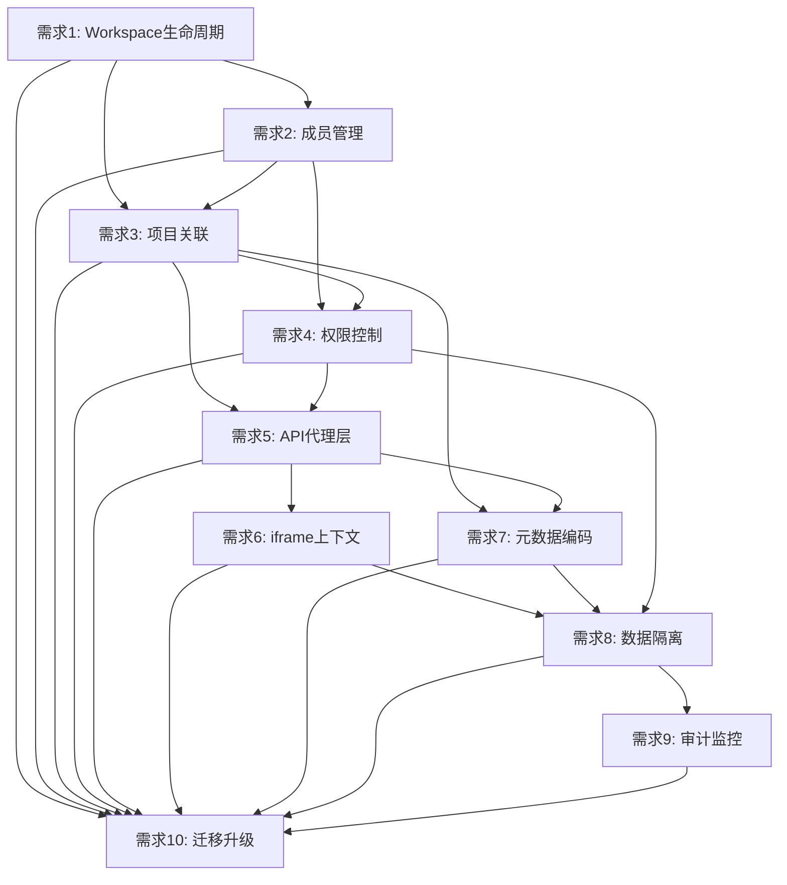

# Label Studio 企业版 Workspace 扩展 - 需求文档

**版本**: 1.0  
**创建日期**: 2026-01-26  
**状态**: 设计中  
**优先级**: P0 (高优先级)

## 1. 介绍

### 1.1 背景

SuperInsight 平台当前使用开源版 Label Studio 作为标注引擎，并已实现 iframe 无缝集成。为了提供企业级的项目管理能力，需要在不修改 Label Studio 源码的前提下，扩展企业版核心功能，实现项目分组、权限管理和团队协作。

**企业版核心功能差距分析**:

根据 [Label Studio 官方文档](https://labelstud.io/guide/enterprise_features)，开源版缺失以下关键功能：

| 功能类别 | 开源版 | 企业版 | 影响程度 |
|---------|--------|--------|----------|
| **Workspace 组织** | ❌ | ✅ | 🔴 高 - 无法分组管理项目 |
| **RBAC 权限控制** | ❌ | ✅ | 🔴 高 - 无细粒度权限 |
| **任务自动分配** | ❌ | ✅ | 🔴 高 - 手动分配效率低 |
| **项目成员管理** | ❌ | ✅ | 🔴 高 - 无法控制访问 |
| **审计日志** | ❌ | ✅ | 🟡 中 - 合规性要求 |
| **性能仪表板** | ❌ | ✅ | 🟡 中 - 无法监控效率 |
| **批量标注** | ❌ | ✅ | 🟡 中 - 重复操作繁琐 |
| **评论通知** | ❌ | ✅ | 🟢 低 - 协作体验 |

### 1.2 目标

**核心目标**:
1. **补全 P0 功能** - 实现影响基本操作的核心功能（Workspace、RBAC、成员管理、任务分配、数据隔离）
2. **最小干预原则** - 通过代理层和元数据注入，不修改 Label Studio 源码
3. **无缝集成** - 与现有 iframe 集成深度结合，统一用户体验
4. **可升级性** - 确保 Label Studio 可以随时升级到最新版本

**成功指标**:
- ✅ 用户可以创建和管理 Workspace
- ✅ 用户可以基于角色控制项目访问
- ✅ 任务可以自动分配给标注者
- ✅ 不同 Workspace 的数据完全隔离
- ✅ Label Studio 可以无缝升级

### 1.3 范围

**Phase 1 - P0 核心功能** (本 Spec 范围):
- ✅ Workspace 生命周期管理
- ✅ 5 级角色权限控制 (Owner/Admin/Manager/Reviewer/Annotator)
- ✅ 项目与 Workspace 关联
- ✅ 成员管理和权限验证
- ✅ 任务自动分配
- ✅ 数据隔离和安全控制
- ✅ API 代理层实现
- ✅ iframe 集成中的 Workspace 上下文

**Phase 2 - P1 增强功能** (后续 Spec):
- ⏳ 审计日志和活动追踪
- ⏳ 项目和标注者性能仪表板
- ⏳ 批量标注功能
- ⏳ 评论和通知系统

**Phase 3 - P2 高级功能** (未来规划):
- ⏳ 协议一致性指标
- ⏳ 自定义 JavaScript 插件
- ⏳ SSO 集成 (SAML/LDAP)
- ⏳ 白标定制

**不包含**:
- ❌ Label Studio 源码修改
- ❌ Label Studio 企业版的完全复制
- ❌ 复杂的工作流引擎
- ❌ LLM Prompts 功能（企业版付费功能）

## 2. 术语表

| 术语 | 定义 |
|------|------|
| **Workspace** | 工作空间，用于组织和管理多个标注项目的逻辑容器 |
| **Workspace_Member** | 工作空间成员，具有特定角色和权限的用户 |
| **Workspace_Project** | 工作空间中的项目，关联 Label Studio 项目 |
| **Proxy_Layer** | 代理层，拦截和增强 Label Studio API 请求 |
| **Metadata_Injection** | 元数据注入，将 Workspace 信息嵌入 Label Studio 数据 |
| **Context_Manager** | 上下文管理器，管理 Workspace 上下文信息 |
| **RBAC_Service** | 基于角色的访问控制服务 |
| **Audit_Service** | 审计服务，记录所有操作日志 |

## 3. 用户角色

### 3.1 Workspace Owner (工作空间所有者)
- 创建和删除 Workspace
- 管理 Workspace 成员
- 配置 Workspace 设置
- 查看所有审计日志

### 3.2 Workspace Admin (工作空间管理员)
- 创建和管理项目
- 添加和移除成员
- 分配任务
- 查看团队审计日志

### 3.3 Workspace Member (工作空间成员)
- 访问分配的项目
- 执行标注任务
- 查看自己的操作日志

### 3.4 Workspace Viewer (工作空间查看者)
- 只读访问项目
- 查看标注结果
- 导出数据（需要权限）

## 4. 功能需求

### 需求 1: Workspace 生命周期管理

**用户故事**: 作为 Workspace Owner，我希望能够创建、配置和管理 Workspace，以便组织我的标注项目。

**优先级**: P0

#### 验收标准 (EARS)

1. **WHEN** 用户创建 Workspace 时，**THEN** 系统应该验证 Workspace 名称的唯一性
2. **WHEN** Workspace 创建成功时，**THEN** 系统应该自动将创建者设置为 Owner
3. **WHEN** 用户删除 Workspace 时，**THEN** 系统应该提示确认并检查是否有关联项目
4. **WHEN** Workspace 被删除时，**THEN** 系统应该保留审计日志但标记为已删除
5. **WHEN** 用户更新 Workspace 设置时，**THEN** 系统应该验证权限并记录变更

**依赖**: 无

**阻塞**: 需求 2, 3, 4

---

### 需求 2: Workspace 成员管理

**用户故事**: 作为 Workspace Admin，我希望能够添加、移除和管理成员，以便控制团队访问权限。

**优先级**: P0

#### 验收标准 (EARS)

1. **WHEN** Admin 添加成员时，**THEN** 系统应该验证用户是否存在并发送邀请通知
2. **WHEN** 成员接受邀请时，**THEN** 系统应该将其添加到 Workspace 并分配默认角色
3. **WHEN** Admin 修改成员角色时，**THEN** 系统应该验证权限并立即生效
4. **WHEN** 成员被移除时，**THEN** 系统应该撤销其所有项目访问权限
5. **WHEN** 查询成员列表时，**THEN** 系统应该返回成员信息、角色和加入时间

**依赖**: 需求 1

**阻塞**: 需求 3, 4

---

### 需求 3: 项目与 Workspace 关联

**用户故事**: 作为 Workspace Admin，我希望能够将 Label Studio 项目关联到 Workspace，以便统一管理。

**优先级**: P0

#### 验收标准 (EARS)

1. **WHEN** 创建新项目时，**THEN** 系统应该允许选择目标 Workspace
2. **WHEN** 项目关联到 Workspace 时，**THEN** 系统应该在 Label Studio 项目元数据中注入 Workspace 信息
3. **WHEN** 查询 Workspace 项目列表时，**THEN** 系统应该返回所有关联项目及其状态
4. **WHEN** 项目从 Workspace 移除时，**THEN** 系统应该清除 Workspace 元数据但保留项目数据
5. **WHEN** 用户访问项目时，**THEN** 系统应该验证其在对应 Workspace 中的权限

**依赖**: 需求 1, 2

**阻塞**: 需求 5, 6

---

### 需求 4: 基于 Workspace 的权限控制

**用户故事**: 作为安全管理员，我希望能够基于 Workspace 实现细粒度的权限控制，以便确保数据安全。

**优先级**: P0

#### 验收标准 (EARS)

1. **WHEN** 用户访问项目时，**THEN** 系统应该验证其在 Workspace 中的角色和权限
2. **WHEN** 用户执行操作时，**THEN** 系统应该检查操作权限（view, create, edit, delete）
3. **WHEN** 权限不足时，**THEN** 系统应该返回 403 错误并记录审计日志
4. **WHEN** 权限变更时，**THEN** 系统应该立即生效并通知受影响的用户
5. **WHEN** 查询权限时，**THEN** 系统应该返回用户在 Workspace 中的所有权限

**依赖**: 需求 2, 3

**阻塞**: 需求 6, 7

---

### 需求 5: Label Studio API 代理层

**用户故事**: 作为系统架构师，我希望通过代理层拦截和增强 Label Studio API，以便在不修改源码的情况下扩展功能。

**优先级**: P0

#### 验收标准 (EARS)

1. **WHEN** 前端调用 Label Studio API 时，**THEN** 请求应该先经过代理层
2. **WHEN** 代理层接收请求时，**THEN** 应该验证用户身份和 Workspace 权限
3. **WHEN** 创建项目时，**THEN** 代理层应该自动注入 Workspace 元数据
4. **WHEN** 查询项目时，**THEN** 代理层应该解析并返回 Workspace 信息
5. **WHEN** 代理层处理完成时，**THEN** 应该记录审计日志并转发请求到 Label Studio

**依赖**: 需求 3, 4

**阻塞**: 需求 6, 7

---

### 需求 6: iframe 集成中的 Workspace 上下文

**用户故事**: 作为前端开发者，我希望在 iframe 中传递 Workspace 上下文，以便实现统一的用户体验。

**优先级**: P1

#### 验收标准 (EARS)

1. **WHEN** 加载 Label Studio iframe 时，**THEN** 系统应该通过 PostMessage 传递 Workspace 上下文
2. **WHEN** Workspace 上下文包含时，**THEN** 应该包括 workspace_id, workspace_name, user_role, permissions
3. **WHEN** 用户在 iframe 中操作时，**THEN** 系统应该验证 Workspace 权限
4. **WHEN** Workspace 上下文变更时，**THEN** 系统应该实时更新 iframe 中的上下文
5. **WHEN** iframe 通信失败时，**THEN** 系统应该降级到只读模式并提示用户

**依赖**: 需求 3, 4, 5, label-studio-iframe-integration/需求 2, 3

**阻塞**: 需求 8

---

### 需求 7: 元数据编码和解码

**用户故事**: 作为数据工程师，我希望能够安全地在 Label Studio 数据中嵌入 Workspace 元数据，以便保持数据一致性。

**优先级**: P1

#### 验收标准 (EARS)

1. **WHEN** 创建项目时，**THEN** 系统应该将 Workspace 元数据编码到项目 description 字段
2. **WHEN** 编码元数据时，**THEN** 应该使用 Base64 编码并添加唯一标识符前缀
3. **WHEN** 查询项目时，**THEN** 系统应该自动解码并提取 Workspace 元数据
4. **WHEN** 解码失败时，**THEN** 系统应该记录警告但不影响项目正常使用
5. **WHEN** 元数据更新时，**THEN** 系统应该保留原始 description 内容

**依赖**: 需求 3, 5

**阻塞**: 需求 8

---

### 需求 8: Workspace 数据隔离

**用户故事**: 作为安全管理员，我希望确保不同 Workspace 之间的数据完全隔离，以便保护数据安全。

**优先级**: P0

#### 验收标准 (EARS)

1. **WHEN** 用户查询项目列表时，**THEN** 系统应该只返回其有权访问的 Workspace 中的项目
2. **WHEN** 用户尝试访问其他 Workspace 的项目时，**THEN** 系统应该返回 403 错误
3. **WHEN** 执行数据导出时，**THEN** 系统应该验证 Workspace 权限并过滤数据
4. **WHEN** 执行批量操作时，**THEN** 系统应该确保操作范围限制在当前 Workspace
5. **WHEN** 审计日志记录时，**THEN** 系统应该包含 Workspace 信息以便追溯

**依赖**: 需求 3, 4, 5, 6, 7

**阻塞**: 需求 9

---

### 需求 9: Workspace 审计和监控

**用户故事**: 作为合规管理员，我希望能够审计 Workspace 中的所有操作，以便满足合规要求。

**优先级**: P1

#### 验收标准 (EARS)

1. **WHEN** 用户在 Workspace 中执行操作时，**THEN** 系统应该记录详细的审计日志
2. **WHEN** 审计日志包含时，**THEN** 应该包括 user_id, workspace_id, action, resource, timestamp, result
3. **WHEN** 查询审计日志时，**THEN** 系统应该支持按 Workspace、用户、时间范围过滤
4. **WHEN** 检测到异常操作时，**THEN** 系统应该触发告警并通知管理员
5. **WHEN** 导出审计日志时，**THEN** 系统应该验证权限并生成合规报告

**依赖**: 需求 4, 8

**阻塞**: 无

---

### 需求 10: Workspace 迁移和升级

**用户故事**: 作为系统管理员，我希望能够在不影响业务的情况下升级 Label Studio，以便保持系统最新。

**优先级**: P2

#### 验收标准 (EARS)

1. **WHEN** 升级 Label Studio 时，**THEN** 系统应该验证 API 兼容性
2. **WHEN** API 不兼容时，**THEN** 系统应该提供降级策略和迁移工具
3. **WHEN** 迁移 Workspace 数据时，**THEN** 系统应该保持数据完整性和一致性
4. **WHEN** 迁移完成时，**THEN** 系统应该生成迁移报告并验证数据
5. **WHEN** 迁移失败时，**THEN** 系统应该支持回滚到之前的版本

**依赖**: 需求 1-9

**阻塞**: 无

## 5. 非功能需求

### 5.1 性能需求

| 指标 | 目标值 | 说明 |
|------|--------|------|
| API 响应时间 | < 200ms | 代理层增加的延迟 |
| 元数据编码/解码 | < 10ms | 单次操作时间 |
| 权限验证 | < 50ms | 单次验证时间 |
| 并发用户数 | > 1000 | 同时在线用户 |
| 数据库查询 | < 100ms | 95% 查询响应时间 |

### 5.2 安全需求

1. **身份验证**: 所有 API 请求必须携带有效的 JWT token
2. **权限验证**: 所有操作必须通过 RBAC 权限检查
3. **数据加密**: 敏感数据必须加密存储和传输
4. **审计日志**: 所有操作必须记录审计日志
5. **SQL 注入防护**: 所有数据库查询必须使用参数化查询

### 5.3 可用性需求

1. **系统可用性**: 99.9% (月度)
2. **故障恢复时间**: < 5 分钟
3. **数据备份**: 每日自动备份
4. **灾难恢复**: 支持跨区域备份和恢复

### 5.4 可维护性需求

1. **代码覆盖率**: > 80%
2. **文档完整性**: 所有 API 必须有文档
3. **日志记录**: 所有错误必须记录详细日志
4. **监控告警**: 关键指标必须有监控和告警

### 5.5 兼容性需求

1. **Label Studio 版本**: 支持 1.7.0 及以上版本
2. **浏览器支持**: Chrome 90+, Firefox 88+, Safari 14+, Edge 90+
3. **数据库**: PostgreSQL 13+
4. **Python 版本**: 3.11+
5. **Node.js 版本**: 18+

## 6. 约束条件

### 6.1 技术约束

1. **不能修改 Label Studio 源码**: 必须通过 API 和元数据实现扩展
2. **必须保持可升级性**: Label Studio 升级不应影响 Workspace 功能
3. **必须使用现有技术栈**: FastAPI + React + PostgreSQL
4. **必须兼容现有 iframe 集成**: 不能破坏已有功能

### 6.2 业务约束

1. **开发周期**: 13-21 天
2. **团队规模**: 2-3 名开发人员
3. **预算限制**: 使用开源版 Label Studio
4. **上线时间**: 2026 年 2 月底前

### 6.3 法规约束

1. **数据隐私**: 符合 GDPR 和 CCPA 要求
2. **审计合规**: 符合 SOC 2 要求
3. **数据保留**: 审计日志保留至少 1 年

## 7. 验收标准总结

### 7.1 功能完整性

- ✅ 所有 10 个功能需求已实现
- ✅ 所有验收标准已通过
- ✅ 集成测试通过率 > 95%

### 7.2 性能达标

- ✅ 所有性能指标达到目标值
- ✅ 负载测试通过
- ✅ 压力测试通过

### 7.3 安全合规

- ✅ 安全扫描无高危漏洞
- ✅ 权限控制测试通过
- ✅ 审计日志完整

### 7.4 文档完整

- ✅ API 文档完整
- ✅ 用户手册完整
- ✅ 运维手册完整

## 8. 风险和缓解

### 8.1 技术风险

| 风险 | 影响 | 概率 | 缓解措施 |
|------|------|------|----------|
| Label Studio API 变更 | 高 | 中 | 版本锁定 + 兼容性测试 |
| 元数据编码冲突 | 中 | 低 | 使用唯一标识符 + 版本控制 |
| 性能瓶颈 | 中 | 中 | 缓存 + 异步处理 |
| iframe 通信失败 | 高 | 低 | 重试机制 + 降级策略 |

### 8.2 业务风险

| 风险 | 影响 | 概率 | 缓解措施 |
|------|------|------|----------|
| 需求变更 | 中 | 高 | 敏捷开发 + 快速迭代 |
| 资源不足 | 高 | 中 | 优先级排序 + 外部支持 |
| 上线延期 | 中 | 中 | 缓冲时间 + 风险储备 |

## 9. 依赖关系图

## 10. 参考文档

- [Label Studio iframe 集成需求](./../label-studio-iframe-integration/requirements.md)
- [Label Studio iframe 集成设计](./../label-studio-iframe-integration/design.md)
- [Label Studio 企业版功能扩展设计](./../../docs/label_studio_enterprise_extension.md)
- [Doc-First 工作流规范](./../../../.kiro/steering/doc-first-workflow.md)

---

**文档版本**: v1.0  
**最后更新**: 2026-01-26  
**审核状态**: 待审核  
**下一步**: 创建设计文档 (design.md)
