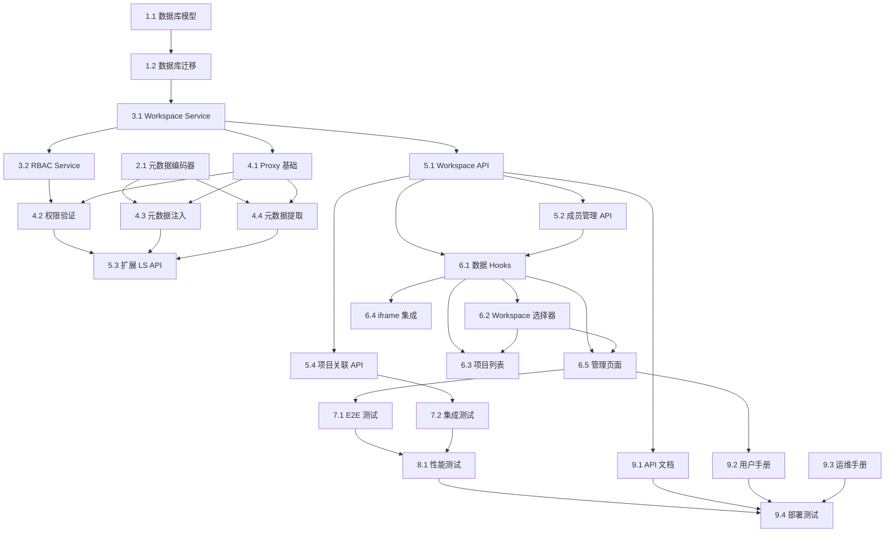

# Label Studio 企业版 Workspace 扩展 - 任务分解

**版本**: 1.0  
**创建日期**: 2026-01-26  
**状态**: 待执行  
**预计工期**: 13-21 天

## 任务概览

本文档将 Workspace 扩展功能分解为可执行的任务，遵循 Phase 1 实施计划。每个任务包含：
- 任务描述和目标
- 预计时间
- 依赖关系
- 验证要求
- 需要创建/修改的文件

## 任务状态说明

- `[ ]` - 未开始
- `[~]` - 已排队
- `[-]` - 进行中
- `[x]` - 已完成
- `[ ]*` - 可选任务

## Phase 1: 数据库和基础服务 (3-5 天)

### 1. 数据库模型和迁移

#### 1.1 创建 Workspace 数据库模型
- [ ] 1.1 创建 Workspace 数据库模型 (Est: 2h)

**目标**: 创建 Workspace 相关的 SQLAlchemy 模型

**文件**:
- 创建: `src/database/models/workspace.py`
- 修改: `src/database/models/__init__.py`

**任务详情**:
1. 创建 `WorkspaceModel` 类
   - 字段: id, name, description, owner_id, settings, is_active, is_deleted, created_at, updated_at, deleted_at
   - 关系: owner (User), members (WorkspaceMember), projects (WorkspaceProject)
   - 约束: name 唯一且非空

2. 创建 `WorkspaceMemberModel` 类
   - 字段: id, workspace_id, user_id, role, is_active, joined_at, updated_at
   - 关系: workspace (Workspace), user (User)
   - 约束: (workspace_id, user_id) 唯一
   - 角色枚举: owner, admin, manager, reviewer, annotator

3. 创建 `WorkspaceProjectModel` 类
   - 字段: id, workspace_id, label_studio_project_id, superinsight_project_id, metadata, created_at, updated_at
   - 关系: workspace (Workspace)
   - 约束: (workspace_id, label_studio_project_id) 唯一

4. 创建 `ProjectMemberModel` 类
   - 字段: id, workspace_project_id, user_id, project_role, is_active, assigned_at, updated_at
   - 关系: workspace_project (WorkspaceProject), user (User)
   - 约束: (workspace_project_id, user_id) 唯一
   - 角色枚举: annotator, reviewer

**验证**:
```bash
python -c "from src.database.models.workspace import WorkspaceModel, WorkspaceMemberModel, WorkspaceProjectModel, ProjectMemberModel; print('Models imported successfully')"
```

**依赖**: 无

**验证需求**: 需求 1, 2, 3

---

#### 1.2 创建数据库迁移脚本
- [ ] 1.2 创建数据库迁移脚本 (Est: 1h)

**目标**: 使用 Alembic 创建数据库迁移脚本

**文件**:
- 创建: `alembic/versions/xxxx_add_workspace_tables.py`

**任务详情**:
1. 生成迁移脚本
   ```bash
   alembic revision --autogenerate -m "Add workspace tables"
   ```

2. 检查生成的迁移脚本
   - 验证所有表和索引都已包含
   - 验证外键约束正确
   - 验证唯一约束正确

3. 测试迁移
   ```bash
   alembic upgrade head
   alembic downgrade -1
   alembic upgrade head
   ```

**验证**:
```bash
# 检查表是否创建
psql -d superinsight -c "\dt workspaces"
psql -d superinsight -c "\dt workspace_members"
psql -d superinsight -c "\dt workspace_projects"
psql -d superinsight -c "\dt project_members"
```

**依赖**: 任务 1.1

**验证需求**: 需求 1, 2, 3

---

### 2. 元数据编码服务

#### 2.1 实现元数据编码/解码器
- [ ] 2.1 实现元数据编码/解码器 (Est: 2h)

**目标**: 实现 Workspace 元数据的编码和解码功能

**文件**:
- 创建: `src/label_studio/metadata_codec.py`
- 创建: `tests/label_studio/test_metadata_codec.py`

**任务详情**:
1. 实现 `MetadataCodec` 类
   - `encode(original_text: str, metadata: dict) -> str` - 编码元数据到文本
   - `decode(encoded_text: str) -> tuple[str, dict]` - 从文本解码元数据
   - `has_metadata(text: str) -> bool` - 检查文本是否包含元数据

2. 编码格式
   - 前缀: `[SUPERINSIGHT_META:`
   - 后缀: `]`
   - 编码: Base64(JSON(metadata))
   - 示例: `[SUPERINSIGHT_META:eyJ3b3Jrc3BhY2VfaWQiOi4uLn0=]原始描述`

3. 元数据结构
   ```python
   {
       "workspace_id": "uuid",
       "workspace_name": "研发部门",
       "created_by": "user-id",
       "created_at": "2026-01-26T10:00:00",
       "_version": "1.0"
   }
   ```

4. 编写单元测试
   - 测试编码功能
   - 测试解码功能
   - 测试边界情况（空文本、无元数据、损坏的元数据）
   - 测试中文字符处理

**验证**:
```bash
pytest tests/label_studio/test_metadata_codec.py -v
```

**依赖**: 无

**验证需求**: 需求 7

---

### 3. Workspace 核心服务

#### 3.1 实现 Workspace Service
- [ ] 3.1 实现 Workspace Service (Est: 4h)

**目标**: 实现 Workspace 的 CRUD 和成员管理功能

**文件**:
- 创建: `src/label_studio/workspace_service.py`
- 创建: `tests/label_studio/test_workspace_service.py`

**任务详情**:
1. 实现 `WorkspaceService` 类
   - `create_workspace(name, description, owner_id, settings)` - 创建 Workspace
   - `get_workspace(workspace_id)` - 获取 Workspace
   - `list_user_workspaces(user_id)` - 列出用户的 Workspaces
   - `update_workspace(workspace_id, data)` - 更新 Workspace
   - `delete_workspace(workspace_id)` - 删除 Workspace（软删除）
   - `add_member(workspace_id, user_id, role)` - 添加成员
   - `remove_member(workspace_id, user_id)` - 移除成员
   - `update_member_role(workspace_id, user_id, role)` - 更新成员角色
   - `get_member_role(workspace_id, user_id)` - 获取成员角色
   - `list_members(workspace_id)` - 列出成员
   - `is_member(workspace_id, user_id)` - 检查是否是成员

2. 实现业务逻辑
   - 创建 Workspace 时自动添加创建者为 Owner
   - 检查名称唯一性
   - 删除 Workspace 时检查是否有关联项目
   - 软删除（设置 is_deleted=True）

3. 使用 async/await 模式
   - 所有方法都是异步的
   - 使用 `asyncio.Lock()` 而不是 `threading.Lock()`
   - 遵循 `.kiro/steering/async-sync-safety.md` 规范

4. 编写单元测试
   - 测试 Workspace CRUD 操作
   - 测试成员管理操作
   - 测试权限验证
   - 测试边界情况

**验证**:
```bash
pytest tests/label_studio/test_workspace_service.py -v --cov=src/label_studio/workspace_service
```

**依赖**: 任务 1.1, 1.2

**验证需求**: 需求 1, 2

---

#### 3.2 实现 RBAC Service
- [ ] 3.2 实现 RBAC Service (Est: 3h)

**目标**: 实现基于角色的访问控制服务

**文件**:
- 创建: `src/label_studio/rbac_service.py`
- 创建: `tests/label_studio/test_rbac_service.py`

**任务详情**:
1. 定义权限枚举 `Permission`
   - Workspace 权限: view, edit, delete, manage_members
   - 项目权限: view, create, edit, delete, manage_members
   - 任务权限: view, annotate, review, assign
   - 数据权限: export, import

2. 实现 `RBACService` 类
   - `check_permission(user_id, workspace_id, permission)` - 检查权限
   - `get_user_permissions(user_id, workspace_id)` - 获取用户权限列表
   - `can_access_project(user_id, workspace_id, project_id)` - 检查项目访问权限
   - `can_perform_action(user_id, workspace_id, action)` - 检查操作权限

3. 定义角色权限矩阵 `ROLE_PERMISSIONS`
   - Owner: 所有权限
   - Admin: 除删除 Workspace 外的所有权限
   - Manager: Workspace 查看 + 项目管理
   - Reviewer: 项目查看 + 审核
   - Annotator: 项目查看 + 标注

4. 编写单元测试
   - 测试每个角色的权限
   - 测试权限继承
   - 测试权限验证逻辑
   - 测试边界情况

**验证**:
```bash
pytest tests/label_studio/test_rbac_service.py -v --cov=src/label_studio/rbac_service
```

**依赖**: 任务 3.1

**验证需求**: 需求 4

---

## Phase 2: API 代理层 (3-5 天)

### 4. Label Studio 代理实现

#### 4.1 实现 Label Studio Proxy 基础框架
- [ ] 4.1 实现 Label Studio Proxy 基础框架 (Est: 3h)

**目标**: 实现 API 代理的基础框架和请求转发

**文件**:
- 创建: `src/label_studio/proxy.py`
- 创建: `tests/label_studio/test_proxy.py`

**任务详情**:
1. 实现 `LabelStudioProxy` 类
   - 初始化: Label Studio URL, Token, Services
   - `proxy_request(method, path, user_id, workspace_id, body, params)` - 代理请求

2. 实现请求转发逻辑
   - 使用 `httpx.AsyncClient` 进行异步请求
   - 设置超时时间（60秒）
   - 处理 HTTP 错误
   - 记录请求日志

3. 实现基础错误处理
   - 捕获网络错误
   - 捕获 Label Studio API 错误
   - 返回统一的错误格式

4. 编写单元测试
   - 测试请求转发
   - 测试错误处理
   - 使用 mock 模拟 Label Studio 响应

**验证**:
```bash
pytest tests/label_studio/test_proxy.py::test_proxy_request -v
```

**依赖**: 任务 3.1, 3.2

**验证需求**: 需求 5

---

#### 4.2 实现权限验证中间件
- [ ] 4.2 实现权限验证中间件 (Est: 2h)

**目标**: 在代理层实现权限验证

**文件**:
- 修改: `src/label_studio/proxy.py`
- 修改: `tests/label_studio/test_proxy.py`

**任务详情**:
1. 实现 `_verify_permissions` 方法
   - 检查用户是否是 Workspace 成员
   - 根据请求类型确定所需权限
   - 调用 RBAC Service 验证权限
   - 权限不足时抛出 403 错误

2. 实现 `_get_required_permission` 方法
   - GET → PROJECT_VIEW
   - POST /api/projects → PROJECT_CREATE
   - POST → PROJECT_EDIT
   - PUT/PATCH → PROJECT_EDIT
   - DELETE → PROJECT_DELETE

3. 编写单元测试
   - 测试权限验证逻辑
   - 测试不同角色的访问控制
   - 测试 403 错误处理

**验证**:
```bash
pytest tests/label_studio/test_proxy.py::test_permission_verification -v
```

**依赖**: 任务 4.1

**验证需求**: 需求 4, 5

---

#### 4.3 实现元数据注入功能
- [ ] 4.3 实现元数据注入功能 (Est: 2h)

**目标**: 在创建项目时自动注入 Workspace 元数据

**文件**:
- 修改: `src/label_studio/proxy.py`
- 修改: `tests/label_studio/test_proxy.py`

**任务详情**:
1. 实现 `_preprocess_request` 方法
   - 检测 POST /api/projects 请求
   - 获取 Workspace 信息
   - 准备元数据（workspace_id, workspace_name, created_by, created_at）
   - 使用 MetadataCodec 编码到 description 字段
   - 记录注入日志

2. 处理边界情况
   - 无 workspace_id 时跳过注入
   - description 为空时正确处理
   - 保留原始 description 内容

3. 编写单元测试
   - 测试元数据注入
   - 测试无 workspace_id 的情况
   - 测试空 description 的情况
   - 验证编码后的格式

**验证**:
```bash
pytest tests/label_studio/test_proxy.py::test_metadata_injection -v
```

**依赖**: 任务 2.1, 4.1

**验证需求**: 需求 5, 7

---

#### 4.4 实现元数据提取功能
- [ ] 4.4 实现元数据提取功能 (Est: 2h)

**目标**: 在查询项目时自动提取和增强 Workspace 信息

**文件**:
- 修改: `src/label_studio/proxy.py`
- 修改: `tests/label_studio/test_proxy.py`

**任务详情**:
1. 实现 `_postprocess_response` 方法
   - 检测 GET /api/projects 响应
   - 处理列表和单个项目两种情况
   - 调用 `_enhance_project` 增强每个项目

2. 实现 `_enhance_project` 方法
   - 检查 description 是否包含元数据
   - 使用 MetadataCodec 解码元数据
   - 恢复原始 description
   - 添加 workspace 字段到响应
   - 获取完整 Workspace 信息（name, owner_id）

3. 处理边界情况
   - 无元数据时跳过
   - 解码失败时记录警告但不影响响应
   - Workspace 不存在时处理

4. 编写单元测试
   - 测试元数据提取
   - 测试项目增强
   - 测试边界情况

**验证**:
```bash
pytest tests/label_studio/test_proxy.py::test_metadata_extraction -v
```

**依赖**: 任务 2.1, 4.1

**验证需求**: 需求 5, 7

---

#### 4.5 实现审计日志记录
- [ ] 4.5 实现审计日志记录 (Est: 2h)*

**目标**: 记录所有通过代理的操作（可选）

**文件**:
- 修改: `src/label_studio/proxy.py`
- 创建: `src/label_studio/audit_service.py`
- 创建: `tests/label_studio/test_audit_service.py`

**任务详情**:
1. 实现 `AuditService` 类
   - `log_action(user_id, workspace_id, action, resource, result)` - 记录操作
   - `get_audit_logs(workspace_id, filters)` - 查询审计日志

2. 在 Proxy 中集成审计日志
   - 在 `proxy_request` 结束时记录日志
   - 异步记录，不阻塞请求
   - 记录关键信息：user_id, workspace_id, method, path, status_code, timestamp

3. 编写单元测试
   - 测试日志记录
   - 测试日志查询
   - 测试异步记录

**验证**:
```bash
pytest tests/label_studio/test_audit_service.py -v
```

**依赖**: 任务 4.1

**验证需求**: 需求 9

---

## Phase 3: API 端点 (2-3 天)

### 5. Workspace API 端点

#### 5.1 实现 Workspace CRUD API
- [ ] 5.1 实现 Workspace CRUD API (Est: 3h)

**目标**: 实现 Workspace 的创建、查询、更新、删除 API

**文件**:
- 创建: `src/api/workspace.py`
- 修改: `src/api/__init__.py`
- 创建: `tests/api/test_workspace.py`

**任务详情**:
1. 定义 Pydantic 模型
   - `WorkspaceCreate` - 创建请求
   - `WorkspaceUpdate` - 更新请求
   - `WorkspaceResponse` - 响应模型
   - `WorkspaceListResponse` - 列表响应

2. 实现 API 端点
   - `POST /api/workspaces` - 创建 Workspace
   - `GET /api/workspaces` - 列出用户的 Workspaces
   - `GET /api/workspaces/{workspace_id}` - 获取 Workspace 详情
   - `PUT /api/workspaces/{workspace_id}` - 更新 Workspace
   - `DELETE /api/workspaces/{workspace_id}` - 删除 Workspace

3. 实现权限验证
   - 使用 `get_current_user` 依赖
   - 验证用户是否有权限操作 Workspace
   - 只有 Owner 可以删除 Workspace

4. 编写 API 测试
   - 测试创建 Workspace
   - 测试查询 Workspace
   - 测试更新 Workspace
   - 测试删除 Workspace
   - 测试权限验证

**验证**:
```bash
pytest tests/api/test_workspace.py::test_workspace_crud -v
```

**依赖**: 任务 3.1

**验证需求**: 需求 1

---

#### 5.2 实现成员管理 API
- [ ] 5.2 实现成员管理 API (Est: 2h)

**目标**: 实现 Workspace 成员的添加、移除、角色管理 API

**文件**:
- 修改: `src/api/workspace.py`
- 修改: `tests/api/test_workspace.py`

**任务详情**:
1. 定义 Pydantic 模型
   - `MemberAdd` - 添加成员请求
   - `MemberUpdate` - 更新成员请求
   - `MemberResponse` - 成员响应模型
   - `MemberListResponse` - 成员列表响应

2. 实现 API 端点
   - `POST /api/workspaces/{workspace_id}/members` - 添加成员
   - `GET /api/workspaces/{workspace_id}/members` - 列出成员
   - `PUT /api/workspaces/{workspace_id}/members/{user_id}` - 更新成员角色
   - `DELETE /api/workspaces/{workspace_id}/members/{user_id}` - 移除成员

3. 实现权限验证
   - 只有 Owner 和 Admin 可以添加/移除成员
   - 只有 Owner 可以修改 Admin 角色
   - 不能移除最后一个 Owner

4. 编写 API 测试
   - 测试添加成员
   - 测试列出成员
   - 测试更新角色
   - 测试移除成员
   - 测试权限验证

**验证**:
```bash
pytest tests/api/test_workspace.py::test_member_management -v
```

**依赖**: 任务 3.1, 5.1

**验证需求**: 需求 2

---

#### 5.3 扩展现有 Label Studio API
- [ ] 5.3 扩展现有 Label Studio API (Est: 2h)

**目标**: 在现有 Label Studio API 中添加 Workspace 过滤支持

**文件**:
- 修改: `src/api/label_studio_api.py`
- 修改: `tests/api/test_label_studio_api.py`

**任务详情**:
1. 修改项目列表 API
   - 添加 `workspace_id` 查询参数（可选）
   - 如果提供 workspace_id，验证用户权限并过滤项目
   - 保持向后兼容（无 workspace_id 时返回所有可访问项目）

2. 修改项目详情 API
   - 添加 Workspace 信息到响应
   - 验证用户是否有权访问该项目所属的 Workspace

3. 集成 Proxy
   - 使用 LabelStudioProxy 转发请求
   - 自动注入/提取元数据

4. 编写 API 测试
   - 测试 Workspace 过滤
   - 测试权限验证
   - 测试向后兼容性

**验证**:
```bash
pytest tests/api/test_label_studio_api.py::test_workspace_filter -v
```

**依赖**: 任务 4.1-4.4

**验证需求**: 需求 3, 5

---

#### 5.4 实现项目关联 API
- [ ] 5.4 实现项目关联 API (Est: 2h)

**目标**: 实现项目与 Workspace 的关联管理

**文件**:
- 修改: `src/api/workspace.py`
- 修改: `tests/api/test_workspace.py`

**任务详情**:
1. 定义 Pydantic 模型
   - `ProjectAssociate` - 关联项目请求
   - `ProjectResponse` - 项目响应模型

2. 实现 API 端点
   - `POST /api/workspaces/{workspace_id}/projects` - 关联项目到 Workspace
   - `GET /api/workspaces/{workspace_id}/projects` - 列出 Workspace 的项目
   - `DELETE /api/workspaces/{workspace_id}/projects/{project_id}` - 取消关联

3. 实现业务逻辑
   - 关联时在数据库中创建 WorkspaceProject 记录
   - 验证项目是否已关联到其他 Workspace
   - 取消关联时清除元数据

4. 编写 API 测试
   - 测试项目关联
   - 测试项目列表
   - 测试取消关联
   - 测试重复关联

**验证**:
```bash
pytest tests/api/test_workspace.py::test_project_association -v
```

**依赖**: 任务 3.1, 5.1

**验证需求**: 需求 3

---

## Phase 4: 前端集成 (3-5 天)

### 6. 前端组件开发

#### 6.1 创建 Workspace 数据 Hooks
- [ ] 6.1 创建 Workspace 数据 Hooks (Est: 2h)

**目标**: 使用 TanStack Query 创建数据获取 Hooks

**文件**:
- 创建: `frontend/src/hooks/useWorkspaces.ts`
- 创建: `frontend/src/hooks/useWorkspaceMembers.ts`
- 创建: `frontend/src/hooks/useWorkspaceContext.ts`
- 修改: `frontend/src/hooks/index.ts`

**任务详情**:
1. 实现 `useWorkspaces` Hook
   - 获取用户的 Workspaces 列表
   - 支持缓存和自动刷新
   - 错误处理

2. 实现 `useWorkspace` Hook
   - 获取单个 Workspace 详情
   - 支持缓存

3. 实现 `useCreateWorkspace` Mutation
   - 创建 Workspace
   - 自动刷新列表

4. 实现 `useWorkspaceMembers` Hook
   - 获取 Workspace 成员列表
   - 支持缓存

5. 实现 `useWorkspaceContext` Hook
   - 获取当前 Workspace 上下文
   - 包含 workspace, userRole, permissions

6. 遵循 TypeScript 导出规范
   - 使用正确的导出名称
   - 避免重复导出
   - 在 index.ts 中正确导出

**验证**:
```bash
cd frontend
npm run typecheck
npm run test -- useWorkspaces
```

**依赖**: 任务 5.1, 5.2

**验证需求**: 需求 1, 2

---

#### 6.2 创建 Workspace 选择器组件
- [ ] 6.2 创建 Workspace 选择器组件 (Est: 3h)

**目标**: 创建 Workspace 选择器 UI 组件

**文件**:
- 创建: `frontend/src/components/WorkspaceSelector/index.tsx`
- 创建: `frontend/src/components/WorkspaceSelector/WorkspaceSelector.test.tsx`
- 修改: `frontend/src/components/index.ts`

**任务详情**:
1. 实现 WorkspaceSelector 组件
   - 使用 Ant Design Select 组件
   - 显示 Workspace 名称和描述
   - 支持搜索和过滤
   - 自动选择第一个 Workspace
   - 保存选择到 localStorage

2. 实现 i18n 支持
   - 使用 `useTranslation` Hook
   - 所有文本使用翻译键
   - 支持中英文切换
   - 遵循 i18n 翻译规范

3. 实现状态管理
   - 使用 useWorkspaces Hook 获取数据
   - 处理加载状态
   - 处理错误状态

4. 编写组件测试
   - 测试组件渲染
   - 测试选择功能
   - 测试 i18n
   - 测试错误处理

**验证**:
```bash
cd frontend
npm run test -- WorkspaceSelector
npm run typecheck
```

**依赖**: 任务 6.1

**验证需求**: 需求 1, 6

---

#### 6.3 扩展项目列表组件
- [ ] 6.3 扩展项目列表组件 (Est: 3h)

**目标**: 在项目列表中添加 Workspace 过滤功能

**文件**:
- 修改: `frontend/src/pages/Projects/index.tsx`
- 修改: `frontend/src/hooks/useProjects.ts`
- 创建: `frontend/src/pages/Projects/Projects.test.tsx`

**任务详情**:
1. 修改 useProjects Hook
   - 添加 `workspace_id` 过滤参数
   - 支持按 Workspace 过滤项目

2. 修改项目列表页面
   - 添加 WorkspaceSelector 组件
   - 根据选中的 Workspace 过滤项目
   - 显示 Workspace 信息列

3. 实现 i18n 支持
   - 所有新增文本使用翻译键
   - 支持中英文切换

4. 编写组件测试
   - 测试 Workspace 过滤
   - 测试项目列表显示
   - 测试 i18n

**验证**:
```bash
cd frontend
npm run test -- Projects
npm run typecheck
```

**依赖**: 任务 6.1, 6.2

**验证需求**: 需求 3, 6

---

#### 6.4 扩展 iframe 集成组件
- [ ] 6.4 扩展 iframe 集成组件 (Est: 3h)

**目标**: 在 iframe 中传递 Workspace 上下文

**文件**:
- 修改: `frontend/src/components/LabelStudioIframe/index.tsx`
- 修改: `frontend/src/utils/postMessageBridge.ts`
- 修改: `frontend/src/types/annotation.ts`

**任务详情**:
1. 扩展 AnnotationContext 接口
   - 添加 workspace 字段
   - 包含 id, name, role, permissions

2. 修改 LabelStudioIframe 组件
   - 接收 workspaceId 参数
   - 使用 useWorkspaceContext 获取上下文
   - 通过 PostMessage 传递 Workspace 上下文

3. 修改 PostMessageBridge
   - 添加 WORKSPACE_CONTEXT 消息类型
   - 处理 Workspace 上下文传递

4. 实现 i18n 支持
   - 所有新增文本使用翻译键

5. 编写组件测试
   - 测试上下文传递
   - 测试 PostMessage 通信
   - 测试错误处理

**验证**:
```bash
cd frontend
npm run test -- LabelStudioIframe
npm run typecheck
```

**依赖**: 任务 6.1

**验证需求**: 需求 6

---

#### 6.5 创建 Workspace 管理页面
- [ ] 6.5 创建 Workspace 管理页面 (Est: 4h)

**目标**: 创建 Workspace 管理界面

**文件**:
- 创建: `frontend/src/pages/Workspaces/index.tsx`
- 创建: `frontend/src/pages/Workspaces/WorkspaceForm.tsx`
- 创建: `frontend/src/pages/Workspaces/MemberManagement.tsx`
- 创建: `frontend/src/pages/Workspaces/Workspaces.test.tsx`

**任务详情**:
1. 实现 Workspace 列表页面
   - 显示用户的所有 Workspaces
   - 支持创建、编辑、删除
   - 显示成员数、项目数统计

2. 实现 WorkspaceForm 组件
   - 创建/编辑 Workspace 表单
   - 表单验证
   - 错误处理

3. 实现 MemberManagement 组件
   - 显示成员列表
   - 添加/移除成员
   - 修改成员角色
   - 显示角色权限说明

4. 实现完整 i18n 支持
   - 所有文本使用翻译键
   - 支持中英文切换
   - 动态翻译（带参数）

5. 编写组件测试
   - 测试列表显示
   - 测试表单提交
   - 测试成员管理
   - 测试 i18n

**验证**:
```bash
cd frontend
npm run test -- Workspaces
npm run typecheck
```

**依赖**: 任务 6.1, 6.2

**验证需求**: 需求 1, 2

---

#### 6.6 创建权限说明组件
- [ ] 6.6 创建权限说明组件 (Est: 2h)*

**目标**: 创建角色权限说明组件（可选）

**文件**:
- 创建: `frontend/src/components/PermissionDetails/index.tsx`
- 创建: `frontend/src/components/PermissionDetails/PermissionDetails.test.tsx`

**任务详情**:
1. 实现 PermissionDetails 组件
   - 显示角色权限矩阵
   - 显示每个角色的权限详情
   - 支持展开/折叠

2. 实现 i18n 支持
   - 所有文本使用翻译键
   - 角色和权限描述都有翻译

3. 编写组件测试
   - 测试组件渲染
   - 测试 i18n

**验证**:
```bash
cd frontend
npm run test -- PermissionDetails
```

**依赖**: 无

**验证需求**: 需求 4

---

## Phase 5: 测试和优化 (2-3 天)

### 7. 集成测试

#### 7.1 编写端到端测试
- [ ] 7.1 编写端到端测试 (Est: 4h)

**目标**: 使用 Playwright 编写 E2E 测试

**文件**:
- 创建: `frontend/e2e/workspace.spec.ts`
- 创建: `frontend/e2e/workspace-permissions.spec.ts`

**任务详情**:
1. 测试 Workspace 生命周期
   - 创建 Workspace
   - 添加成员
   - 创建项目并关联到 Workspace
   - 切换 Workspace
   - 删除 Workspace

2. 测试权限控制
   - 不同角色的访问权限
   - 权限不足时的错误提示
   - 数据隔离

3. 测试 iframe 集成
   - Workspace 上下文传递
   - 标注操作
   - 数据同步

4. 测试 i18n
   - 语言切换
   - 所有文本正确显示

**验证**:
```bash
cd frontend
npm run test:e2e -- workspace
```

**依赖**: 所有前端任务

**验证需求**: 需求 1-8

---

#### 7.2 编写集成测试
- [ ] 7.2 编写集成测试 (Est: 3h)

**目标**: 编写后端集成测试

**文件**:
- 创建: `tests/integration/test_workspace_flow.py`
- 创建: `tests/integration/test_permission_flow.py`

**任务详情**:
1. 测试完整工作流
   - 用户 A 创建 Workspace
   - 用户 A 添加用户 B 为 Annotator
   - 用户 A 创建项目并关联到 Workspace
   - 用户 B 访问项目（应该成功）
   - 用户 C 访问项目（应该失败）

2. 测试权限流程
   - 测试每个角色的权限
   - 测试权限继承
   - 测试权限变更

3. 测试数据隔离
   - 创建多个 Workspaces
   - 验证数据隔离
   - 验证跨 Workspace 访问被阻止

**验证**:
```bash
pytest tests/integration/ -v
```

**依赖**: 所有后端任务

**验证需求**: 需求 1-8

---

### 8. 性能优化

#### 8.1 性能测试和优化
- [ ] 8.1 性能测试和优化 (Est: 3h)

**目标**: 测试和优化系统性能

**文件**:
- 创建: `tests/performance/test_proxy_performance.py`
- 创建: `tests/performance/test_query_performance.py`

**任务详情**:
1. 测试代理层性能
   - 测量代理层延迟
   - 目标: < 200ms
   - 优化瓶颈

2. 测试数据库查询性能
   - 测量查询响应时间
   - 目标: < 100ms (95%)
   - 添加必要的索引

3. 测试元数据编码/解码性能
   - 测量编码时间
   - 目标: < 10ms
   - 优化算法

4. 测试并发性能
   - 模拟 100+ 并发用户
   - 测量响应时间
   - 识别性能瓶颈

5. 实施优化
   - 添加缓存（Redis）
   - 优化数据库查询
   - 使用连接池
   - 异步处理

**验证**:
```bash
pytest tests/performance/ -v
```

**依赖**: 所有后端任务

**验证需求**: 非功能需求 5.1

---

#### 8.2 添加缓存层
- [ ] 8.2 添加缓存层 (Est: 2h)*

**目标**: 使用 Redis 缓存频繁访问的数据（可选）

**文件**:
- 创建: `src/label_studio/cache_service.py`
- 修改: `src/label_studio/workspace_service.py`

**任务详情**:
1. 实现 CacheService
   - 缓存 Workspace 信息
   - 缓存用户权限
   - 缓存成员列表
   - 设置合理的过期时间

2. 集成到 WorkspaceService
   - 查询前先检查缓存
   - 更新时清除缓存
   - 删除时清除缓存

3. 编写测试
   - 测试缓存命中
   - 测试缓存失效
   - 测试缓存更新

**验证**:
```bash
pytest tests/label_studio/test_cache_service.py -v
```

**依赖**: 任务 3.1

**验证需求**: 非功能需求 5.1

---

### 9. 文档和部署

#### 9.1 编写 API 文档
- [ ] 9.1 编写 API 文档 (Est: 2h)

**目标**: 完善 API 文档

**文件**:
- 创建: `docs/workspace_api.md`
- 修改: FastAPI 自动生成的文档

**任务详情**:
1. 编写 API 文档
   - Workspace API 端点
   - 成员管理 API 端点
   - 项目关联 API 端点
   - 请求/响应示例
   - 错误代码说明

2. 完善 OpenAPI 文档
   - 添加详细的描述
   - 添加示例
   - 添加标签和分组

3. 编写使用指南
   - 快速开始
   - 常见场景
   - 最佳实践

**验证**:
- 访问 `/docs` 查看 API 文档
- 确保所有端点都有文档

**依赖**: 所有 API 任务

**验证需求**: 非功能需求 5.4

---

#### 9.2 编写用户手册
- [ ] 9.2 编写用户手册 (Est: 2h)

**目标**: 编写用户使用手册

**文件**:
- 创建: `docs/workspace_user_guide.md`
- 创建: `docs/workspace_user_guide_en.md`

**任务详情**:
1. 编写中文用户手册
   - Workspace 概念介绍
   - 创建和管理 Workspace
   - 成员管理
   - 项目管理
   - 权限说明
   - 常见问题

2. 编写英文用户手册
   - 翻译中文手册
   - 确保术语一致

3. 添加截图和示例
   - UI 截图
   - 操作步骤
   - 示例场景

**验证**:
- 让其他人阅读并提供反馈

**依赖**: 所有前端任务

**验证需求**: 非功能需求 5.4

---

#### 9.3 编写运维手册
- [ ] 9.3 编写运维手册 (Est: 2h)

**目标**: 编写运维部署手册

**文件**:
- 创建: `docs/workspace_deployment.md`

**任务详情**:
1. 编写部署指南
   - 环境要求
   - 数据库迁移步骤
   - 配置说明
   - 启动步骤

2. 编写监控指南
   - 关键指标
   - 告警配置
   - 日志查看

3. 编写故障排查指南
   - 常见问题
   - 排查步骤
   - 解决方案

**验证**:
- 在测试环境执行部署步骤

**依赖**: 所有任务

**验证需求**: 非功能需求 5.4

---

#### 9.4 部署到测试环境
- [ ] 9.4 部署到测试环境 (Est: 2h)

**目标**: 在测试环境部署和验证

**任务详情**:
1. 执行数据库迁移
   ```bash
   alembic upgrade head
   ```

2. 部署后端服务
   - 更新代码
   - 重启服务
   - 验证健康检查

3. 部署前端应用
   - 构建生产版本
   - 部署到服务器
   - 验证访问

4. 执行冒烟测试
   - 创建 Workspace
   - 添加成员
   - 创建项目
   - 验证权限

5. 监控系统指标
   - CPU 使用率
   - 内存使用率
   - 响应时间
   - 错误率

**验证**:
- 所有功能正常工作
- 性能指标达标
- 无错误日志

**依赖**: 所有任务

**验证需求**: 所有需求

---

## 任务依赖关系图



## 任务统计

### 按阶段统计

| 阶段 | 必需任务 | 可选任务 | 预计时间 |
|------|---------|---------|---------|
| Phase 1: 数据库和基础服务 | 5 | 0 | 14h (2-3天) |
| Phase 2: API 代理层 | 4 | 1 | 11h (2-3天) |
| Phase 3: API 端点 | 4 | 0 | 9h (2天) |
| Phase 4: 前端集成 | 5 | 1 | 17h (3-4天) |
| Phase 5: 测试和优化 | 6 | 1 | 18h (3-4天) |
| **总计** | **24** | **3** | **69h (13-17天)** |

### 按优先级统计

| 优先级 | 任务数 | 说明 |
|--------|--------|------|
| P0 (必需) | 24 | 核心功能，必须完成 |
| P1 (可选) | 3 | 增强功能，建议完成 |

## 验收标准

### 功能完整性
- [ ] 所有 P0 任务已完成
- [ ] 所有单元测试通过（覆盖率 > 80%）
- [ ] 所有集成测试通过
- [ ] E2E 测试通过

### 性能达标
- [ ] 代理层延迟 < 200ms
- [ ] 数据库查询 < 100ms (95%)
- [ ] 元数据编码/解码 < 10ms
- [ ] 支持 100+ 并发用户

### 安全合规
- [ ] 所有 API 需要认证
- [ ] 权限验证正确
- [ ] 数据隔离有效
- [ ] 审计日志完整

### 文档完整
- [ ] API 文档完整
- [ ] 用户手册完整
- [ ] 运维手册完整
- [ ] 代码注释充分

### i18n 完整
- [ ] 所有 UI 文本已翻译
- [ ] 中英文切换正常
- [ ] 无翻译键错误
- [ ] 动态翻译正确

## 风险和缓解

| 风险 | 影响 | 概率 | 缓解措施 |
|------|------|------|----------|
| Label Studio API 变更 | 高 | 中 | 版本锁定 + 兼容性测试 |
| 性能不达标 | 中 | 中 | 提前性能测试 + 优化 |
| 时间不足 | 高 | 中 | 优先 P0 任务 + 延后 P1 |
| 集成问题 | 中 | 低 | 提前集成测试 |

## 下一步

1. **立即开始**: Phase 1 任务 1.1 - 创建数据库模型
2. **每日站会**: 同步进度和问题
3. **每周回顾**: 检查进度和调整计划
4. **持续集成**: 每完成一个任务就运行测试

---

**文档版本**: v1.0  
**最后更新**: 2026-01-26  
**状态**: 待执行  
**预计完成**: 2026-02-16

