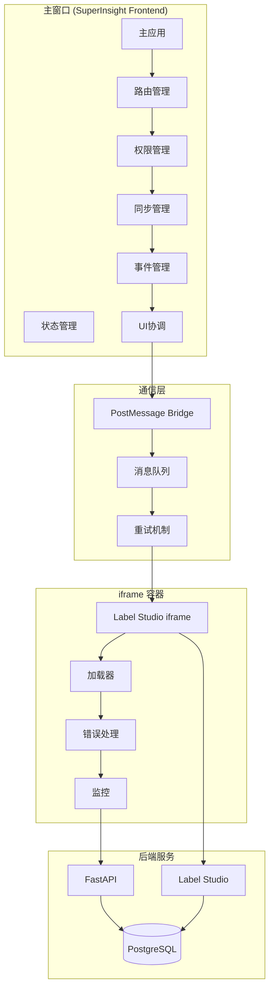

# Label Studio iframe 无缝集成 - 设计文档

## 概述

Label Studio iframe 无缝集成设计旨在通过 iframe 和 PostMessage 通信机制，将 Label Studio 标注界面无缝嵌入到 SuperInsight 前端管理系统中。设计采用模块化架构，支持权限控制、实时同步、事件处理和性能优化，确保标注与管理的统一体验。

## 架构设计

### 整体架构



### 模块设计

#### 1. iframe 容器管理 (IframeManager)

**职责**: 管理 Label Studio iframe 的生命周期

**接口设计**:
```typescript
interface IframeManager {
  // 创建 iframe
  create(config: IframeConfig): Promise<HTMLIFrameElement>;
  
  // 销毁 iframe
  destroy(): Promise<void>;
  
  // 刷新 iframe
  refresh(): Promise<void>;
  
  // 获取 iframe 状态
  getStatus(): IframeStatus;
  
  // 监听 iframe 事件
  on(event: string, callback: Function): void;
  off(event: string, callback: Function): void;
}

interface IframeConfig {
  url: string;
  projectId: string;
  taskId: string;
  userId: string;
  token: string;
  permissions: Permission[];
  theme?: 'light' | 'dark';
  fullscreen?: boolean;
}

enum IframeStatus {
  LOADING = 'loading',
  READY = 'ready',
  ERROR = 'error',
  DESTROYED = 'destroyed'
}
```

#### 2. PostMessage 通信桥梁 (PostMessageBridge)

**职责**: 管理 iframe 与主窗口的通信

**接口设计**:
```typescript
interface PostMessageBridge {
  // 发送消息到 iframe
  send(message: Message): Promise<Response>;
  
  // 接收来自 iframe 的消息
  on(type: string, handler: MessageHandler): void;
  
  // 移除消息处理器
  off(type: string, handler: MessageHandler): void;
  
  // 获取通信状态
  getStatus(): BridgeStatus;
  
  // 清理资源
  cleanup(): void;
}

interface Message {
  id: string;
  type: string;
  payload: any;
  timestamp: number;
  signature?: string;
}

interface Response {
  id: string;
  success: boolean;
  data?: any;
  error?: string;
}

enum BridgeStatus {
  CONNECTED = 'connected',
  DISCONNECTED = 'disconnected',
  ERROR = 'error'
}
```

#### 3. 权限和上下文管理 (ContextManager)

**职责**: 管理标注上下文和权限信息

**接口设计**:
```typescript
interface ContextManager {
  // 设置标注上下文
  setContext(context: AnnotationContext): void;
  
  // 获取标注上下文
  getContext(): AnnotationContext;
  
  // 验证权限
  checkPermission(action: string): boolean;
  
  // 更新权限
  updatePermissions(permissions: Permission[]): void;
  
  // 获取加密的上下文
  getEncryptedContext(): string;
}

interface AnnotationContext {
  user: UserInfo;
  project: ProjectInfo;
  task: TaskInfo;
  permissions: Permission[];
  timestamp: number;
}

interface Permission {
  action: string;
  resource: string;
  allowed: boolean;
}
```

#### 4. 数据同步管理 (SyncManager)

**职责**: 管理标注数据的同步

**接口设计**:
```typescript
interface SyncManager {
  // 启动同步
  start(): void;
  
  // 停止同步
  stop(): void;
  
  // 手动同步
  sync(): Promise<SyncResult>;
  
  // 获取同步状态
  getStatus(): SyncStatus;
  
  // 监听同步事件
  on(event: string, callback: Function): void;
}

interface SyncResult {
  success: boolean;
  itemsSynced: number;
  itemsFailed: number;
  duration: number;
  errors?: Error[];
}

enum SyncStatus {
  IDLE = 'idle',
  SYNCING = 'syncing',
  ERROR = 'error',
  PAUSED = 'paused'
}
```

#### 5. 事件处理 (EventEmitter)

**职责**: 处理标注相关的事件

**接口设计**:
```typescript
interface EventEmitter {
  // 监听事件
  on(event: string, handler: EventHandler): void;
  
  // 监听一次事件
  once(event: string, handler: EventHandler): void;
  
  // 移除事件监听
  off(event: string, handler: EventHandler): void;
  
  // 发射事件
  emit(event: string, data: any): void;
  
  // 获取事件历史
  getHistory(event?: string): EventRecord[];
}

interface EventRecord {
  event: string;
  data: any;
  timestamp: number;
  source: 'iframe' | 'main';
}

enum AnnotationEvent {
  STARTED = 'annotation:started',
  UPDATED = 'annotation:updated',
  COMPLETED = 'annotation:completed',
  SAVED = 'annotation:saved',
  ERROR = 'annotation:error'
}
```

#### 6. UI 协调 (UICoordinator)

**职责**: 协调 iframe 与主窗口的 UI 交互

**接口设计**:
```typescript
interface UICoordinator {
  // 设置全屏模式
  setFullscreen(enabled: boolean): void;
  
  // 调整 iframe 大小
  resize(width: number, height: number): void;
  
  // 显示/隐藏加载指示器
  setLoading(loading: boolean): void;
  
  // 显示错误提示
  showError(message: string): void;
  
  // 隐藏主窗口导航
  hideNavigation(): void;
  
  // 显示主窗口导航
  showNavigation(): void;
}
```

## 数据模型

### iframe 配置模型
```python
class IframeConfig:
    url: str  # Label Studio URL
    project_id: str  # 项目ID
    task_id: str  # 任务ID
    user_id: str  # 用户ID
    token: str  # JWT token
    permissions: List[Permission]  # 权限列表
    theme: str = 'light'  # 主题
    fullscreen: bool = False  # 全屏模式
    created_at: datetime = Field(default_factory=datetime.now)
```

### 通信消息模型
```python
class Message:
    id: str  # 消息ID
    type: str  # 消息类型
    payload: dict  # 消息内容
    timestamp: int  # 时间戳
    signature: Optional[str] = None  # 签名
    
class Response:
    id: str  # 响应ID
    success: bool  # 是否成功
    data: Optional[dict] = None  # 响应数据
    error: Optional[str] = None  # 错误信息
```

### 标注上下文模型
```python
class AnnotationContext:
    user: UserInfo  # 用户信息
    project: ProjectInfo  # 项目信息
    task: TaskInfo  # 任务信息
    permissions: List[Permission]  # 权限列表
    timestamp: int  # 时间戳
    
class UserInfo:
    id: str
    name: str
    email: str
    role: str
    
class ProjectInfo:
    id: str
    name: str
    description: str
    
class TaskInfo:
    id: str
    name: str
    status: str
    progress: float
```

## 正确性属性

*属性是一个特征或行为，应该在系统的所有有效执行中保持为真。*

### 属性 1: 消息传递可靠性
*对于任何*发送到 iframe 的消息，系统应该确保消息被正确接收或在失败时进行重试
**验证: 需求 2.2, 2.3**

### 属性 2: 权限一致性
*对于任何*用户操作，系统应该确保权限检查的结果在主窗口和 iframe 中保持一致
**验证: 需求 3.3, 3.4**

### 属性 3: 数据同步完整性
*对于任何*标注操作，系统应该确保数据被完整地同步到后端
**验证: 需求 4.1, 4.2**

### 属性 4: 事件顺序保证
*对于任何*标注事件序列，系统应该确保事件按照发生的顺序被处理
**验证: 需求 5.1, 5.2**

### 属性 5: UI 状态一致性
*对于任何*UI 操作，系统应该确保 iframe 和主窗口的 UI 状态保持同步
**验证: 需求 6.1, 6.2**

### 属性 6: 错误恢复能力
*对于任何*错误情况，系统应该能够自动恢复或提供清晰的恢复指导
**验证: 需求 8.1, 8.2**

### 属性 7: 性能指标稳定性
*对于任何*长时间运行的 iframe，系统应该确保性能指标保持在可接受的范围内
**验证: 需求 9.2, 9.3**

### 属性 8: 安全边界隔离
*对于任何*来自 iframe 的消息，系统应该验证消息来源和内容的合法性
**验证: 需求 10.1, 10.2**

## 错误处理

### 错误分类

1. **加载错误**
   - iframe 加载超时
   - 网络连接失败
   - 资源加载失败

2. **通信错误**
   - 消息发送失败
   - 消息接收超时
   - 消息格式错误

3. **权限错误**
   - 权限不足
   - 权限过期
   - 权限冲突

4. **数据错误**
   - 数据格式错误
   - 数据验证失败
   - 数据同步冲突

5. **系统错误**
   - iframe 崩溃
   - 内存溢出
   - 资源耗尽

### 错误恢复策略

```python
class ErrorRecoveryStrategy:
    def handle_loading_error(self, error: Exception) -> RecoveryAction:
        """处理加载错误"""
        if isinstance(error, TimeoutError):
            return RecoveryAction.RETRY_WITH_BACKOFF
        elif isinstance(error, NetworkError):
            return RecoveryAction.WAIT_AND_RETRY
        else:
            return RecoveryAction.SHOW_ERROR_AND_RELOAD
    
    def handle_communication_error(self, error: Exception) -> RecoveryAction:
        """处理通信错误"""
        if isinstance(error, MessageTimeoutError):
            return RecoveryAction.RETRY_MESSAGE
        else:
            return RecoveryAction.RECONNECT_BRIDGE
    
    def handle_permission_error(self, error: Exception) -> RecoveryAction:
        """处理权限错误"""
        return RecoveryAction.REFRESH_PERMISSIONS
```

## 测试策略

### 单元测试

**测试范围**:
- iframe 容器管理的各种操作
- PostMessage 通信的消息发送和接收
- 权限检查和上下文管理
- 数据同步的增量和全量模式
- 事件处理和回调

**测试工具**: Vitest + React Testing Library

### 属性测试

**测试库**: fast-check (TypeScript)

**测试配置**: 每个属性测试运行最少 100 次迭代

**属性测试用例**:
- 消息传递可靠性: 验证所有消息都被正确处理
- 权限一致性: 验证权限检查结果一致
- 数据同步完整性: 验证数据完整性
- 事件顺序保证: 验证事件顺序
- UI 状态一致性: 验证 UI 状态同步
- 错误恢复能力: 验证错误恢复
- 性能指标稳定性: 验证性能指标
- 安全边界隔离: 验证安全隔离

### 集成测试

**测试场景**:
- iframe 加载和初始化
- 权限验证和上下文传递
- 标注数据同步
- 事件处理和回调
- 错误处理和恢复
- 性能监控

**测试环境**: Docker Compose 测试环境

### 性能测试

**测试指标**:
- iframe 加载时间: < 2 秒
- 消息传递延迟: < 100ms
- 数据同步速度: > 1000 条/秒
- 内存占用: < 100MB
- CPU 使用率: < 20%

**测试工具**: Lighthouse + Web Vitals
