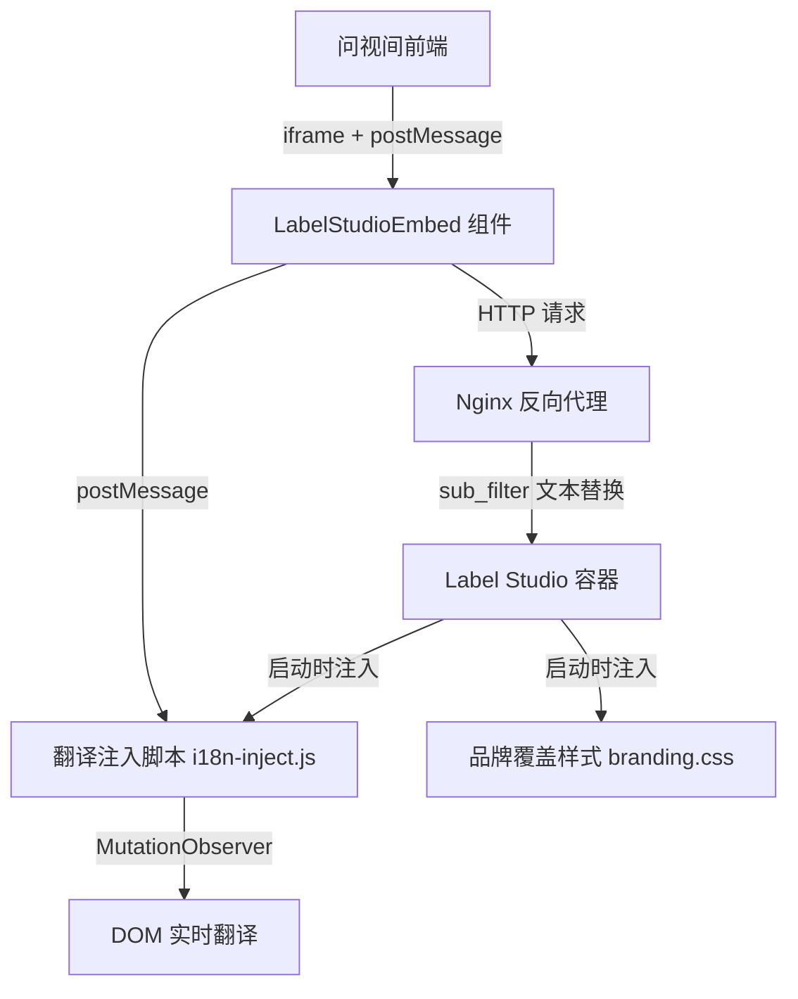

# 技术设计文档：Label Studio 集成增强

## 概述

本设计采用分层外部覆盖架构，在不修改 Label Studio 源码的前提下实现中文翻译、品牌白标化和平滑跳转体验。核心思路：nginx 层做文本替换，容器启动脚本注入自定义 CSS/JS，前端组件增强加载体验。

## 架构



三层覆盖策略：
1. **Nginx 层**：`sub_filter` 替换 HTML/JS 响应中的 "Label Studio" → "问视间"
2. **容器启动层**：`entrypoint-sso.sh` 扩展，注入 JS/CSS 文件到 LS 静态目录，修改 Django 模板引入自定义资源
3. **前端层**：`LabelStudioEmbed` 组件增加骨架屏、淡入动画、预热机制、超时处理

## 组件与接口

### 1. 翻译注入脚本 (`deploy/label-studio/i18n-inject.js`)

运行在 Label Studio iframe 内部的独立 JS 文件。

```typescript
interface TranslationConfig {
  translations: Record<string, string>;  // en → zh 映射表
  currentLang: 'zh' | 'en';
}

// postMessage 接口
interface LanguageSyncMessage {
  type: 'setLanguage';
  lang: 'zh' | 'en';
  source: 'superinsight';
}
```

职责：
- 维护英中翻译词典（导航、按钮、表单、提示、表头、工具栏）
- MutationObserver 监听 DOM 变化，翻译新增文本节点
- 监听 postMessage 接收语言切换指令，500ms 内完成切换
- 将 "Label Studio" 文本节点替换为 "问视间"
- 加载失败时静默降级，不影响标注功能

### 2. 品牌覆盖样式 (`deploy/label-studio/branding.css`)

```css
/* 隐藏原始 Logo，替换为问视间 Logo */
/* 调整主题色为问视间品牌色 */
/* 加载失败时不影响功能 */
```

### 3. 启动脚本扩展 (`entrypoint-sso.sh` 新增部分)

沿用现有标记检测模式（`grep` 检查标记字符串），新增：
- 复制 `i18n-inject.js` 和 `branding.css` 到 LS 静态目录
- 复制问视间 Favicon 替换原始 Favicon
- 修改 Django 模板注入 `<script>` 和 `<link>` 标签
- 修改 `<title>` 标签内容
- 补丁失败时输出明确错误日志

### 4. Nginx 配置增强

```nginx
location /label-studio/ {
    # 禁用压缩以支持 sub_filter
    proxy_set_header Accept-Encoding "";
    
    # 文本替换
    sub_filter 'Label Studio' '问视间';
    sub_filter_types text/html application/javascript;
    sub_filter_once off;
    
    # 现有代理配置保持不变...
}
```

### 5. LabelStudioEmbed 组件增强

新增功能：
- **骨架屏**：匹配 LS 布局的 Skeleton 组件，替代当前 Spin
- **淡入动画**：iframe 加载完成后 300ms opacity 过渡
- **预热机制**：在任务列表页后台创建隐藏 iframe 预加载 LS
- **超时处理**：15 秒超时显示友好提示 + 重试按钮
- **进度指示**：显示"正在连接标注系统"等状态文本
- **语言缓存**：iframe 未加载完成时缓存语言设置，加载后立即同步

```typescript
// 新增 props
interface LabelStudioEmbedProps {
  // ...现有 props
  preWarm?: boolean;        // 是否启用预热
  showSkeleton?: boolean;   // 是否显示骨架屏
}
```

## 数据模型

### 翻译词典结构

```typescript
const translations: Record<string, string> = {
  // 导航菜单
  "Projects": "项目",
  "Data Manager": "数据管理",
  "Settings": "设置",
  // 按钮标签
  "Submit": "提交",
  "Skip": "跳过",
  "Update": "更新",
  // ... 核心 UI 元素翻译
};
```

翻译词典内嵌在 `i18n-inject.js` 中，无需外部数据存储。翻译匹配采用精确文本匹配，避免误替换。

### 语言同步状态

复用现有 `languageStore.ts` 的 Zustand 状态，新增 `pendingLanguage` 字段用于缓存未同步的语言设置：

```typescript
interface LanguageState {
  // ...现有字段
  pendingLanguage: SupportedLanguage | null;  // iframe 未就绪时缓存
}
```


## 正确性属性

*属性是在系统所有有效执行中都应成立的特征或行为——本质上是关于系统应该做什么的形式化陈述。属性是人类可读规范与机器可验证正确性保证之间的桥梁。*

### 属性 1：翻译函数语言正确性

*For any* 翻译词典中的条目和任意支持的语言设置，当 lang=zh 时翻译函数应返回对应中文文本（包括 "Label Studio" → "问视间"），当 lang=en 时应返回原始英文文本不变。

**Validates: Requirements 1.1, 1.2, 4.4**

### 属性 2：语言切换消息发送

*For any* 支持的语言值，当调用 setLanguage 时，组件应通过 postMessage 发送包含正确语言值的 `{type: 'setLanguage', lang, source: 'superinsight'}` 消息。

**Validates: Requirements 2.1**

### 属性 3：URL 包含语言参数

*For any* 支持的语言和任意 projectId，构建的 Label Studio URL 应包含 `lang=` 参数且值与当前语言设置一致。

**Validates: Requirements 2.3**

### 属性 4：语言缓存与同步

*For any* 语言设置，若在 iframe 未就绪时设置语言，该语言应被缓存为 pendingLanguage；当 iframe 就绪事件触发后，pendingLanguage 应被同步并清空。

**Validates: Requirements 2.4**

### 属性 5：补丁脚本幂等性

*For any* 补丁目标文件，连续执行两次补丁操作的结果应与执行一次的结果完全相同（标记检测机制确保不重复应用）。

**Validates: Requirements 6.2**

## 错误处理

| 场景 | 处理方式 |
|------|---------|
| 翻译脚本加载失败 | 静默降级，显示原始英文，不影响标注功能 |
| 品牌 CSS 加载失败 | 显示原始 LS 界面，功能不受影响 |
| iframe 15 秒超时 | 显示超时提示 + 重试按钮 |
| postMessage 发送失败 | catch 忽略跨域错误，记录日志 |
| 补丁目标文件不存在 | 输出错误日志指明具体补丁名，继续执行其他补丁 |
| sub_filter 未生效 | 翻译脚本兜底处理残留文本 |

## 测试策略

### 属性测试（Property-Based Testing）

使用 `fast-check` 库，每个属性测试最少 100 次迭代。

- **Property 1**：生成随机词典条目，验证翻译函数在 zh/en 下的输出正确性
  - Tag: `Feature: label-studio-integration-enhancement, Property 1: 翻译函数语言正确性`
- **Property 2**：生成随机语言值，验证 postMessage 调用参数
  - Tag: `Feature: label-studio-integration-enhancement, Property 2: 语言切换消息发送`
- **Property 3**：生成随机 projectId 和语言，验证 URL 构建结果
  - Tag: `Feature: label-studio-integration-enhancement, Property 3: URL 包含语言参数`
- **Property 4**：生成随机语言序列，验证缓存→同步→清空流程
  - Tag: `Feature: label-studio-integration-enhancement, Property 4: 语言缓存与同步`
- **Property 5**：模拟补丁目标文件，验证双次执行幂等性
  - Tag: `Feature: label-studio-integration-enhancement, Property 5: 补丁脚本幂等性`

### 单元测试

- 骨架屏在 loading 状态下正确渲染
- 15 秒超时后显示重试按钮
- 翻译脚本加载失败时的降级行为
- 补丁目标文件缺失时的错误日志输出
- 预热机制创建隐藏 iframe
