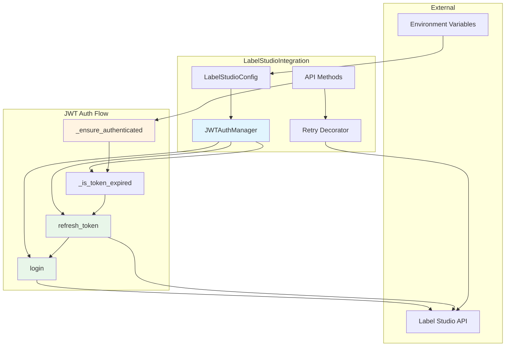
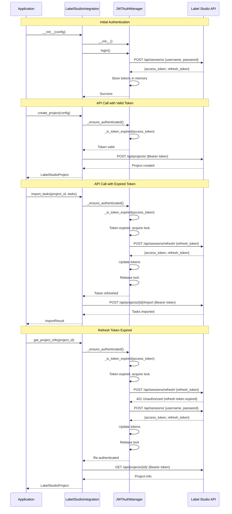
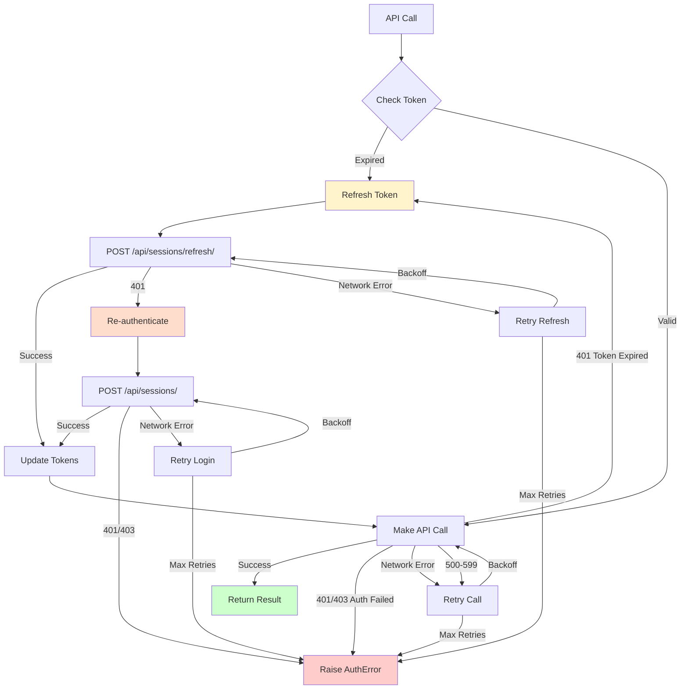

# Design Document - Label Studio JWT Authentication

## Overview

This document describes the design for implementing JWT-based authentication support for Label Studio 1.22.0+. The design extends the existing `LabelStudioIntegration` class with JWT authentication capabilities while maintaining backward compatibility with API token authentication.

### Design Goals

1. **JWT Authentication**: Support username/password authentication via `/api/sessions/` endpoint
2. **Automatic Token Refresh**: Transparently refresh expired access tokens using refresh tokens
3. **Backward Compatibility**: Maintain support for legacy API token authentication
4. **Thread Safety**: Use `asyncio.Lock()` for thread-safe token management
5. **Error Handling**: Distinguish between authentication errors (no retry) and network errors (retry)
6. **Seamless Integration**: Work with all existing methods without breaking changes

### Key Design Decisions

| Decision | Rationale | Alternatives Considered |
|----------|-----------|------------------------|
| Store tokens in memory only | Security best practice, tokens should not persist | Store in Redis (rejected: adds complexity) |
| Use `asyncio.Lock()` for token refresh | Async-safe, prevents deadlocks | `threading.Lock()` (rejected: causes deadlocks in async) |
| Auto-detect authentication method | Seamless configuration-based switching | Explicit method selection (rejected: less user-friendly) |
| Refresh before expiration | Proactive refresh prevents API call failures | Reactive refresh on 401 (rejected: causes unnecessary failures) |
| Reuse existing retry decorator | Consistent error handling across codebase | New retry logic (rejected: code duplication) |

## Architecture

### Component Diagram




### Authentication Flow Diagram




## Components and Interfaces

### 1. JWTAuthManager Class

New class to manage JWT authentication state and operations.

```python
class JWTAuthManager:
    """
    Manages JWT authentication for Label Studio.
    
    Responsibilities:
    - Authenticate with username/password
    - Store access and refresh tokens in memory
    - Refresh expired access tokens
    - Provide thread-safe token access
    - Detect token expiration
    """
    
    def __init__(
        self,
        base_url: str,
        username: Optional[str] = None,
        password: Optional[str] = None
    ):
        """
        Initialize JWT auth manager.
        
        Args:
            base_url: Label Studio base URL
            username: Username for authentication
            password: Password for authentication
        """
        self.base_url = base_url.rstrip('/')
        self.username = username
        self.password = password
        
        # Token storage (in-memory only)
        self._access_token: Optional[str] = None
        self._refresh_token: Optional[str] = None
        self._token_expires_at: Optional[datetime] = None
        
        # Thread safety
        self._lock = asyncio.Lock()
        
        # Authentication state
        self._is_authenticated = False
    
    async def login(self) -> bool:
        """
        Authenticate with Label Studio using username/password.
        
        Makes POST request to /api/sessions/ endpoint with credentials.
        Stores access_token and refresh_token in memory.
        
        Returns:
            bool: True if authentication successful
            
        Raises:
            LabelStudioAuthenticationError: If authentication fails
        """
        pass
    
    async def refresh_token(self) -> bool:
        """
        Refresh access token using refresh token.
        
        Makes POST request to /api/sessions/refresh/ endpoint.
        Updates access_token and refresh_token in memory.
        Falls back to login() if refresh token is expired.
        
        Returns:
            bool: True if refresh successful
            
        Raises:
            LabelStudioAuthenticationError: If refresh and re-auth both fail
        """
        pass
    
    async def _ensure_authenticated(self) -> None:
        """
        Ensure valid authentication before API calls.
        
        Checks if token is expired and refreshes if needed.
        Thread-safe using asyncio.Lock().
        
        Raises:
            LabelStudioAuthenticationError: If authentication fails
        """
        pass
    
    def _is_token_expired(self, buffer_seconds: int = 60) -> bool:
        """
        Check if access token is expired or will expire soon.
        
        Args:
            buffer_seconds: Refresh token this many seconds before expiration
            
        Returns:
            bool: True if token is expired or will expire soon
        """
        pass
    
    def _parse_token_expiration(self, token: str) -> Optional[datetime]:
        """
        Parse JWT token to extract expiration time.
        
        Args:
            token: JWT token string
            
        Returns:
            datetime: Token expiration time, or None if parsing fails
        """
        pass
    
    def get_auth_header(self) -> Dict[str, str]:
        """
        Get authentication header for API requests.
        
        Returns:
            Dict with Authorization header using Bearer token
        """
        pass
    
    @property
    def is_authenticated(self) -> bool:
        """Check if currently authenticated."""
        return self._is_authenticated and self._access_token is not None
```


### 2. Extended LabelStudioConfig Class

Extend existing configuration class to support JWT credentials.

```python
class LabelStudioConfig:
    """Extended Label Studio configuration with JWT support."""
    
    def __init__(self):
        self.base_url = settings.label_studio.label_studio_url
        self.api_token = settings.label_studio.label_studio_api_token
        self.project_id = settings.label_studio.label_studio_project_id
        
        # New JWT credentials
        self.username = getattr(settings.label_studio, 'label_studio_username', None)
        self.password = getattr(settings.label_studio, 'label_studio_password', None)
    
    def get_auth_method(self) -> str:
        """
        Determine which authentication method to use.
        
        Priority:
        1. JWT (if username and password are configured)
        2. API Token (if api_token is configured)
        3. None (raise error)
        
        Returns:
            str: 'jwt' or 'api_token'
            
        Raises:
            LabelStudioIntegrationError: If no auth method is configured
        """
        if self.username and self.password:
            return 'jwt'
        elif self.api_token:
            return 'api_token'
        else:
            raise LabelStudioIntegrationError(
                "No authentication method configured. "
                "Please set either LABEL_STUDIO_USERNAME/PASSWORD or LABEL_STUDIO_API_TOKEN"
            )
    
    def validate_config(self) -> bool:
        """Validate configuration with JWT support."""
        if not self.base_url:
            logger.error("Label Studio URL is not configured")
            return False
        
        # Check if at least one auth method is configured
        has_jwt = self.username and self.password
        has_token = self.api_token
        
        if not has_jwt and not has_token:
            logger.error("No authentication method configured")
            return False
        
        # Log which method will be used
        auth_method = self.get_auth_method()
        logger.info(f"Using {auth_method} authentication for Label Studio")
        
        return True
```

### 3. Extended LabelStudioIntegration Class

Extend existing integration class to support JWT authentication.

```python
class LabelStudioIntegration:
    """Extended Label Studio integration with JWT support."""
    
    def __init__(self, config: Optional[LabelStudioConfig] = None):
        """Initialize with JWT support."""
        self.config = config or LabelStudioConfig()
        self.base_url = self.config.base_url.rstrip('/')
        
        # Determine authentication method
        self.auth_method = self.config.get_auth_method()
        
        # Initialize appropriate auth manager
        if self.auth_method == 'jwt':
            self.jwt_auth = JWTAuthManager(
                base_url=self.base_url,
                username=self.config.username,
                password=self.config.password
            )
            self.api_token = None
        else:
            self.jwt_auth = None
            self.api_token = self.config.api_token
        
        # Validate configuration
        if not self.config.validate_config():
            raise LabelStudioIntegrationError("Invalid Label Studio configuration")
    
    async def _get_headers(self) -> Dict[str, str]:
        """
        Get authentication headers for API requests.
        
        Handles both JWT and API token authentication.
        For JWT, ensures token is valid before returning headers.
        
        Returns:
            Dict with appropriate Authorization header
        """
        headers = {'Content-Type': 'application/json'}
        
        if self.auth_method == 'jwt':
            # Ensure we have valid JWT token
            await self.jwt_auth._ensure_authenticated()
            headers.update(self.jwt_auth.get_auth_header())
        else:
            # Use API token
            headers['Authorization'] = f'Token {self.api_token}'
        
        return headers
    
    @property
    def headers(self) -> Dict[str, str]:
        """
        Synchronous property for backward compatibility.
        
        Note: This should not be used for new code.
        Use _get_headers() instead for async-safe header retrieval.
        """
        if self.auth_method == 'jwt':
            # For JWT, we need async context
            # This property is kept for backward compatibility
            # but should be avoided in new code
            logger.warning(
                "Using synchronous headers property with JWT auth. "
                "Use _get_headers() instead."
            )
            return {'Content-Type': 'application/json'}
        else:
            return {
                'Authorization': f'Token {self.api_token}',
                'Content-Type': 'application/json'
            }
```


## Data Models

### JWT Token Response

```python
@dataclass
class JWTTokenResponse:
    """Response from Label Studio JWT authentication."""
    access_token: str
    refresh_token: str
    token_type: str = "Bearer"
    expires_in: Optional[int] = None  # Seconds until expiration
    
    @classmethod
    def from_dict(cls, data: Dict[str, Any]) -> 'JWTTokenResponse':
        """Create from API response dictionary."""
        return cls(
            access_token=data['access_token'],
            refresh_token=data['refresh_token'],
            token_type=data.get('token_type', 'Bearer'),
            expires_in=data.get('expires_in')
        )
```

### Authentication State

```python
@dataclass
class AuthenticationState:
    """Current authentication state."""
    method: str  # 'jwt' or 'api_token'
    is_authenticated: bool
    access_token: Optional[str] = None
    refresh_token: Optional[str] = None
    expires_at: Optional[datetime] = None
    last_refresh: Optional[datetime] = None
    
    def is_token_expired(self, buffer_seconds: int = 60) -> bool:
        """Check if token is expired or will expire soon."""
        if not self.expires_at:
            return False
        
        now = datetime.utcnow()
        buffer = timedelta(seconds=buffer_seconds)
        return now >= (self.expires_at - buffer)
    
    def to_dict(self) -> Dict[str, Any]:
        """Convert to dictionary for logging (without sensitive data)."""
        return {
            "method": self.method,
            "is_authenticated": self.is_authenticated,
            "has_access_token": self.access_token is not None,
            "has_refresh_token": self.refresh_token is not None,
            "expires_at": self.expires_at.isoformat() if self.expires_at else None,
            "last_refresh": self.last_refresh.isoformat() if self.last_refresh else None,
        }
```

### Environment Configuration

New environment variables in `.env`:

```bash
# JWT Authentication (Label Studio 1.22.0+)
LABEL_STUDIO_USERNAME=admin
LABEL_STUDIO_PASSWORD=your_password_here

# Legacy API Token Authentication (backward compatibility)
LABEL_STUDIO_API_TOKEN=your_token_here

# Label Studio URL (required for both methods)
LABEL_STUDIO_URL=http://label-studio:8080
```

### Settings Extension

```python
# src/config/settings.py

class LabelStudioSettings(BaseSettings):
    """Label Studio configuration settings."""
    
    label_studio_url: str = Field(
        default="http://localhost:8080",
        description="Label Studio base URL"
    )
    
    label_studio_api_token: Optional[str] = Field(
        default=None,
        description="Label Studio API token (legacy authentication)"
    )
    
    label_studio_username: Optional[str] = Field(
        default=None,
        description="Label Studio username (JWT authentication)"
    )
    
    label_studio_password: Optional[str] = Field(
        default=None,
        description="Label Studio password (JWT authentication)"
    )
    
    label_studio_project_id: Optional[str] = Field(
        default=None,
        description="Default Label Studio project ID"
    )
    
    class Config:
        env_prefix = "LABEL_STUDIO_"
        case_sensitive = False
```


## Correctness Properties

*A property is a characteristic or behavior that should hold true across all valid executions of a system—essentially, a formal statement about what the system should do. Properties serve as the bridge between human-readable specifications and machine-verifiable correctness guarantees.*

### Property 1: Authentication Method Selection

*For any* configuration state, the system should select JWT authentication if username and password are provided, otherwise fall back to API token authentication, and raise an error if neither is available.

**Validates: Requirements 1.1, 3.1, 3.2, 6.3, 6.4**

### Property 2: Token Storage After Authentication

*For any* successful authentication or token refresh operation, both access token and refresh token should be stored in memory and accessible for subsequent API calls.

**Validates: Requirements 1.2, 2.3**

### Property 3: Authentication Header Format

*For any* API request, the Authorization header should use "Bearer <token>" format when JWT authentication is configured, and "Token <token>" format when API token authentication is configured.

**Validates: Requirements 1.4, 3.3, 7.1, 7.2, 7.5**

### Property 4: Authentication Error Non-Retryability

*For any* API call that returns 401 or 403 status code with authentication failure (not token expiration), the system should raise `LabelStudioAuthenticationError` and NOT retry the operation.

**Validates: Requirements 1.3, 5.1, 5.5**

### Property 5: Token Refresh on Expiration

*For any* API call with an expired access token, the system should automatically refresh the token using the `/api/sessions/refresh/` endpoint and retry the original API call with the new token.

**Validates: Requirements 2.1, 2.2, 2.5, 8.1, 8.2**

### Property 6: Fallback to Re-authentication

*For any* token refresh operation that fails due to expired refresh token, the system should automatically re-authenticate using username/password and retry the original API call.

**Validates: Requirements 2.4, 5.4, 8.3**

### Property 7: Concurrent Refresh Mutual Exclusion

*For any* set of concurrent API calls that require token refresh, only one refresh operation should execute, and all waiting calls should use the refreshed token or receive the same error if refresh fails.

**Validates: Requirements 4.1, 4.2, 4.4, 4.5**

### Property 8: Network Error Retryability

*For any* API call that fails with a network error (timeout, connection error), the system should retry the operation with exponential backoff up to the maximum retry attempts.

**Validates: Requirements 5.2**

### Property 9: Token Expiration Detection

*For any* JWT access token, the system should correctly parse the `exp` claim and determine if the token is expired or will expire within the buffer period (60 seconds).

**Validates: Requirements 8.5**

### Property 10: Sensitive Data Protection

*For any* logging operation during authentication, the system should NOT include access tokens, refresh tokens, or passwords in log messages.

**Validates: Requirements 10.2**

### Property 11: HTTPS for Token URLs

*For any* authenticated URL generated for external access (iframe, new window), the URL should use HTTPS protocol when passing JWT tokens.

**Validates: Requirements 10.3**

### Property 12: Token Cleanup on Expiration

*For any* expired token that is replaced by a new token, the old token should be cleared from memory and not reused.

**Validates: Requirements 10.4**


## Error Handling

### Error Classification

| Error Type | HTTP Status | Retry? | Action |
|------------|-------------|--------|--------|
| Invalid Credentials | 401 | No | Raise `LabelStudioAuthenticationError` |
| Insufficient Permissions | 403 | No | Raise `LabelStudioAuthenticationError` |
| Token Expired | 401 (with specific message) | Yes | Refresh token and retry |
| Refresh Token Expired | 401 (on refresh endpoint) | Yes | Re-authenticate and retry |
| Network Timeout | Timeout | Yes | Retry with exponential backoff |
| Connection Error | Connection Error | Yes | Retry with exponential backoff |
| Server Error | 500-599 | Yes | Retry with exponential backoff |

### Error Handling Flow



### Exception Hierarchy

```python
class LabelStudioIntegrationError(Exception):
    """Base exception for Label Studio integration errors."""
    pass

class LabelStudioAuthenticationError(LabelStudioIntegrationError):
    """
    Authentication failure exception.
    
    Raised when:
    - Invalid username/password
    - Invalid API token
    - Insufficient permissions
    - Authentication cannot be established after retries
    
    This exception should NOT be retried.
    """
    def __init__(self, message: str, status_code: int = 401):
        super().__init__(message)
        self.status_code = status_code
        self.message = message

class LabelStudioNetworkError(LabelStudioIntegrationError):
    """
    Network error exception.
    
    Raised when:
    - Connection timeout
    - Connection refused
    - Network unreachable
    
    This exception SHOULD be retried with exponential backoff.
    """
    def __init__(self, message: str, original_error: Optional[Exception] = None):
        super().__init__(message)
        self.original_error = original_error

class LabelStudioTokenExpiredError(LabelStudioIntegrationError):
    """
    Token expiration exception.
    
    Raised when:
    - Access token has expired
    - Refresh token has expired
    
    This exception triggers automatic token refresh.
    """
    def __init__(self, message: str, token_type: str = "access"):
        super().__init__(message)
        self.token_type = token_type  # 'access' or 'refresh'
```


## Testing Strategy

### Dual Testing Approach

This feature requires both unit tests and property-based tests for comprehensive coverage:

- **Unit tests**: Verify specific examples, edge cases, and error conditions
- **Property tests**: Verify universal properties across all inputs

Together, they provide comprehensive coverage where unit tests catch concrete bugs and property tests verify general correctness.

### Unit Testing

Unit tests should focus on:

1. **Specific Examples**:
   - Successful authentication with valid credentials
   - Failed authentication with invalid credentials
   - Successful token refresh
   - Failed token refresh with expired refresh token

2. **Edge Cases**:
   - Empty username or password
   - Malformed JWT tokens
   - Token expiration at exact boundary
   - Concurrent refresh requests

3. **Integration Points**:
   - Integration with existing `create_project()` method
   - Integration with existing `import_tasks()` method
   - Integration with existing `validate_project()` method
   - Integration with iframe authentication

4. **Error Conditions**:
   - Network timeout during authentication
   - Network timeout during token refresh
   - 401 error with authentication failure
   - 401 error with token expiration
   - 403 error with insufficient permissions

### Property-Based Testing

Property tests should verify universal properties using a property-based testing library (e.g., Hypothesis for Python).

**Configuration**: Each property test must run minimum 100 iterations due to randomization.

**Test Tags**: Each property test must include a comment referencing the design document property:
```python
# Feature: label-studio-jwt-authentication, Property 1: Authentication Method Selection
```

#### Property Test 1: Authentication Method Selection

```python
@given(
    has_username=st.booleans(),
    has_password=st.booleans(),
    has_api_token=st.booleans()
)
@settings(max_examples=100)
def test_auth_method_selection(has_username, has_password, has_api_token):
    """
    Feature: label-studio-jwt-authentication, Property 1: Authentication Method Selection
    
    For any configuration state, the system should select JWT authentication
    if username and password are provided, otherwise fall back to API token
    authentication, and raise an error if neither is available.
    """
    config = create_config(
        username="user" if has_username else None,
        password="pass" if has_password else None,
        api_token="token" if has_api_token else None
    )
    
    if has_username and has_password:
        assert config.get_auth_method() == 'jwt'
    elif has_api_token:
        assert config.get_auth_method() == 'api_token'
    else:
        with pytest.raises(LabelStudioIntegrationError):
            config.get_auth_method()
```

#### Property Test 2: Token Storage After Authentication

```python
@given(
    username=st.text(min_size=1, max_size=50),
    password=st.text(min_size=1, max_size=50)
)
@settings(max_examples=100)
async def test_token_storage_after_auth(username, password):
    """
    Feature: label-studio-jwt-authentication, Property 2: Token Storage After Authentication
    
    For any successful authentication or token refresh operation, both access
    token and refresh token should be stored in memory and accessible for
    subsequent API calls.
    """
    auth_manager = JWTAuthManager(base_url="http://test", username=username, password=password)
    
    # Mock successful authentication
    with mock_auth_response(access_token="access123", refresh_token="refresh456"):
        await auth_manager.login()
    
    # Verify both tokens are stored
    assert auth_manager._access_token is not None
    assert auth_manager._refresh_token is not None
    assert auth_manager.is_authenticated is True
```

#### Property Test 3: Authentication Header Format

```python
@given(
    auth_method=st.sampled_from(['jwt', 'api_token']),
    token=st.text(min_size=10, max_size=100)
)
@settings(max_examples=100)
async def test_auth_header_format(auth_method, token):
    """
    Feature: label-studio-jwt-authentication, Property 3: Authentication Header Format
    
    For any API request, the Authorization header should use "Bearer <token>"
    format when JWT authentication is configured, and "Token <token>" format
    when API token authentication is configured.
    """
    if auth_method == 'jwt':
        auth_manager = JWTAuthManager(base_url="http://test", username="user", password="pass")
        auth_manager._access_token = token
        auth_manager._is_authenticated = True
        header = auth_manager.get_auth_header()
        assert header['Authorization'] == f'Bearer {token}'
    else:
        integration = LabelStudioIntegration(config=create_api_token_config(token))
        headers = integration.headers
        assert headers['Authorization'] == f'Token {token}'
```

#### Property Test 4: Concurrent Refresh Mutual Exclusion

```python
@given(
    num_concurrent_calls=st.integers(min_value=2, max_value=10)
)
@settings(max_examples=100)
async def test_concurrent_refresh_mutual_exclusion(num_concurrent_calls):
    """
    Feature: label-studio-jwt-authentication, Property 7: Concurrent Refresh Mutual Exclusion
    
    For any set of concurrent API calls that require token refresh, only one
    refresh operation should execute, and all waiting calls should use the
    refreshed token or receive the same error if refresh fails.
    """
    auth_manager = JWTAuthManager(base_url="http://test", username="user", password="pass")
    
    # Set up expired token
    auth_manager._access_token = "expired_token"
    auth_manager._refresh_token = "refresh_token"
    auth_manager._token_expires_at = datetime.utcnow() - timedelta(hours=1)
    auth_manager._is_authenticated = True
    
    refresh_count = 0
    
    async def mock_refresh():
        nonlocal refresh_count
        refresh_count += 1
        await asyncio.sleep(0.1)  # Simulate API call
        return {"access_token": "new_token", "refresh_token": "new_refresh"}
    
    # Make concurrent calls that trigger refresh
    tasks = [auth_manager._ensure_authenticated() for _ in range(num_concurrent_calls)]
    await asyncio.gather(*tasks)
    
    # Verify only one refresh occurred
    assert refresh_count == 1
    # Verify all calls got the new token
    assert auth_manager._access_token == "new_token"
```


#### Property Test 5: Token Expiration Detection

```python
@given(
    exp_offset_seconds=st.integers(min_value=-3600, max_value=3600),
    buffer_seconds=st.integers(min_value=0, max_value=300)
)
@settings(max_examples=100)
def test_token_expiration_detection(exp_offset_seconds, buffer_seconds):
    """
    Feature: label-studio-jwt-authentication, Property 9: Token Expiration Detection
    
    For any JWT access token, the system should correctly parse the exp claim
    and determine if the token is expired or will expire within the buffer period.
    """
    # Create token with specific expiration
    exp_time = datetime.utcnow() + timedelta(seconds=exp_offset_seconds)
    token = create_jwt_token(exp=exp_time)
    
    auth_manager = JWTAuthManager(base_url="http://test", username="user", password="pass")
    auth_manager._access_token = token
    auth_manager._token_expires_at = exp_time
    
    is_expired = auth_manager._is_token_expired(buffer_seconds=buffer_seconds)
    
    # Token should be considered expired if:
    # - exp_time is in the past (exp_offset_seconds < 0)
    # - exp_time is within buffer period (exp_offset_seconds < buffer_seconds)
    expected_expired = exp_offset_seconds < buffer_seconds
    
    assert is_expired == expected_expired
```

#### Property Test 6: Sensitive Data Protection

```python
@given(
    access_token=st.text(min_size=20, max_size=100),
    refresh_token=st.text(min_size=20, max_size=100),
    password=st.text(min_size=8, max_size=50)
)
@settings(max_examples=100)
def test_sensitive_data_protection(access_token, refresh_token, password):
    """
    Feature: label-studio-jwt-authentication, Property 10: Sensitive Data Protection
    
    For any logging operation during authentication, the system should NOT
    include access tokens, refresh tokens, or passwords in log messages.
    """
    with capture_logs() as log_capture:
        auth_manager = JWTAuthManager(
            base_url="http://test",
            username="user",
            password=password
        )
        auth_manager._access_token = access_token
        auth_manager._refresh_token = refresh_token
        
        # Trigger logging
        logger.info(f"Authentication state: {auth_manager.get_auth_state()}")
    
    logs = log_capture.get_logs()
    
    # Verify sensitive data is not in logs
    assert access_token not in logs
    assert refresh_token not in logs
    assert password not in logs
```

### Integration Testing

Integration tests should verify:

1. **End-to-End Authentication Flow**:
   - Complete flow from login to API call
   - Token refresh during API call
   - Re-authentication after refresh token expiration

2. **Backward Compatibility**:
   - Existing code works with JWT authentication
   - Existing code works with API token authentication
   - Switching between methods doesn't break functionality

3. **Error Recovery**:
   - Recovery from network errors
   - Recovery from token expiration
   - Recovery from authentication failures

4. **Performance**:
   - Token refresh completes within 2 seconds
   - Authentication completes within 5 seconds
   - Concurrent calls don't cause deadlocks

### Test Coverage Goals

- **Line Coverage**: > 90%
- **Branch Coverage**: > 85%
- **Property Test Iterations**: 100 per property
- **Integration Test Scenarios**: All critical paths covered


## Implementation Details

### Token Refresh Strategy

**Proactive Refresh**: Refresh tokens before they expire to prevent API call failures.

```python
# Refresh token 60 seconds before expiration
REFRESH_BUFFER_SECONDS = 60

async def _ensure_authenticated(self) -> None:
    """Ensure valid authentication before API calls."""
    async with self._lock:
        # Check if we need to authenticate
        if not self._is_authenticated:
            await self.login()
            return
        
        # Check if token is expired or will expire soon
        if self._is_token_expired(buffer_seconds=REFRESH_BUFFER_SECONDS):
            logger.info("Access token expired or expiring soon, refreshing...")
            try:
                await self.refresh_token()
            except LabelStudioAuthenticationError as e:
                logger.warning(f"Token refresh failed: {e}, re-authenticating...")
                await self.login()
```

### Thread Safety Implementation

**Use asyncio.Lock() for async-safe synchronization**:

```python
class JWTAuthManager:
    def __init__(self, ...):
        # CRITICAL: Use asyncio.Lock(), NOT threading.Lock()
        # threading.Lock() causes deadlocks in async context
        self._lock = asyncio.Lock()
    
    async def _ensure_authenticated(self) -> None:
        """Thread-safe authentication check."""
        async with self._lock:
            # Only one coroutine can execute this block at a time
            # Other coroutines wait for the lock to be released
            if self._is_token_expired():
                await self.refresh_token()
```

### API Method Updates

All existing API methods need to use `_get_headers()` instead of `self.headers`:

```python
@label_studio_retry(max_attempts=3, base_delay=1.0, operation_name="create_project")
async def create_project(self, project_config: ProjectConfig) -> LabelStudioProject:
    """Create a new Label Studio project with JWT support."""
    # Prepare project data
    label_config = project_config.label_config or self.config.get_default_label_config(...)
    project_data = {...}
    
    # Get headers (handles JWT token refresh if needed)
    headers = await self._get_headers()
    
    # Make API request
    async with httpx.AsyncClient(timeout=30.0) as client:
        response = await client.post(
            f"{self.base_url}/api/projects/",
            headers=headers,  # Use dynamic headers
            json=project_data
        )
        
        # Handle authentication errors (should not be retried)
        if response.status_code == 401:
            error_msg = "Invalid credentials or token expired"
            logger.error(f"[Label Studio] Authentication failed: {error_msg}")
            raise LabelStudioAuthenticationError(error_msg, status_code=401)
        
        # ... rest of the method
```

### JWT Token Parsing

```python
import jwt
from datetime import datetime, timedelta

def _parse_token_expiration(self, token: str) -> Optional[datetime]:
    """Parse JWT token to extract expiration time."""
    try:
        # Decode without verification (we just need the exp claim)
        decoded = jwt.decode(token, options={"verify_signature": False})
        
        # Extract exp claim (Unix timestamp)
        exp_timestamp = decoded.get('exp')
        if not exp_timestamp:
            logger.warning("JWT token missing exp claim")
            return None
        
        # Convert to datetime
        exp_datetime = datetime.utcfromtimestamp(exp_timestamp)
        return exp_datetime
        
    except jwt.DecodeError as e:
        logger.error(f"Failed to decode JWT token: {e}")
        return None
    except Exception as e:
        logger.error(f"Unexpected error parsing JWT token: {e}")
        return None
```

### Logging Best Practices

```python
# ✅ GOOD: Log without sensitive data
logger.info("JWT authentication successful")
logger.info(f"Token expires at: {self._token_expires_at.isoformat()}")
logger.info(f"Using {self.auth_method} authentication")

# ❌ BAD: Log with sensitive data
logger.info(f"Access token: {self._access_token}")  # NEVER DO THIS
logger.info(f"Password: {self.password}")  # NEVER DO THIS
logger.debug(f"Refresh token: {self._refresh_token}")  # NEVER DO THIS

# ✅ GOOD: Log authentication state without tokens
def get_auth_state(self) -> Dict[str, Any]:
    """Get authentication state for logging (without sensitive data)."""
    return {
        "method": self.auth_method,
        "is_authenticated": self._is_authenticated,
        "has_access_token": self._access_token is not None,
        "has_refresh_token": self._refresh_token is not None,
        "token_expires_at": self._token_expires_at.isoformat() if self._token_expires_at else None,
    }
```

### Error Message Guidelines

```python
# ✅ GOOD: Clear, actionable error messages
raise LabelStudioAuthenticationError(
    "Authentication failed: Invalid username or password. "
    "Please check your LABEL_STUDIO_USERNAME and LABEL_STUDIO_PASSWORD settings.",
    status_code=401
)

raise LabelStudioAuthenticationError(
    "Authentication failed: Access forbidden. "
    "The user account may not have sufficient permissions.",
    status_code=403
)

# ❌ BAD: Vague error messages
raise LabelStudioAuthenticationError("Auth failed")
raise LabelStudioAuthenticationError("Error 401")
```


## Integration with Existing Features

### 1. Integration with Annotation Workflow

The annotation workflow uses `ensure_project_exists()` and `generate_authenticated_url()` methods. Both need to work seamlessly with JWT authentication.

**Changes Required**:
- `ensure_project_exists()`: Already uses `create_project()` which will be updated to use JWT
- `generate_authenticated_url()`: Needs to include JWT token in URL for iframe authentication

```python
async def generate_authenticated_url(
    self,
    project_id: str,
    user_id: str,
    language: str = "zh",
    expires_in: int = 3600
) -> Dict[str, Any]:
    """Generate authenticated URL with JWT token support."""
    try:
        # Ensure we have valid authentication
        if self.auth_method == 'jwt':
            await self.jwt_auth._ensure_authenticated()
            token = self.jwt_auth._access_token
        else:
            token = self.api_token
        
        # Construct authenticated URL
        authenticated_url = (
            f"{self.base_url}/projects/{project_id}"
            f"?token={token}&lang={language}"
        )
        
        return {
            "url": authenticated_url,
            "token": token,
            "expires_at": self.jwt_auth._token_expires_at.isoformat() if self.auth_method == 'jwt' else None,
            "project_id": project_id,
            "language": language
        }
    except Exception as e:
        error_msg = f"Failed to generate authenticated URL: {str(e)}"
        logger.error(error_msg)
        raise LabelStudioIntegrationError(error_msg)
```

### 2. Integration with iframe Integration

The iframe integration passes authentication context to the iframe. This needs to include JWT token information.

**Changes Required**:
- Update `AnnotationContext` interface to include JWT token
- Pass JWT token expiration time to iframe for proactive refresh
- Handle token refresh in iframe communication

```typescript
// frontend/src/types/annotation.ts
interface AnnotationContext {
  user: UserInfo;
  project: ProjectInfo;
  task: TaskInfo;
  permissions: Permission[];
  timestamp: number;
  // JWT authentication info
  auth?: {
    method: 'jwt' | 'api_token';
    token: string;
    expiresAt?: string;  // ISO datetime
  };
}
```

### 3. Integration with Existing API Methods

All existing API methods need to be updated to use `_get_headers()`:

**Methods to Update**:
- `create_project()` ✅ (already shown above)
- `import_tasks()` - Update to use `_get_headers()`
- `export_annotations()` - Update to use `_get_headers()`
- `setup_webhooks()` - Update to use `_get_headers()`
- `configure_ml_backend()` - Update to use `_get_headers()`
- `get_project_info()` - Update to use `_get_headers()`
- `validate_project()` - Update to use `_get_headers()`
- `delete_project()` - Update to use `_get_headers()`

**Pattern for Updates**:
```python
# Before (using self.headers property)
async with httpx.AsyncClient(timeout=30.0) as client:
    response = await client.get(
        f"{self.base_url}/api/projects/{project_id}/",
        headers=self.headers  # ❌ Static headers
    )

# After (using _get_headers() method)
headers = await self._get_headers()  # ✅ Dynamic headers with JWT support
async with httpx.AsyncClient(timeout=30.0) as client:
    response = await client.get(
        f"{self.base_url}/api/projects/{project_id}/",
        headers=headers
    )
```

### 4. Integration with Retry Decorator

The existing `@label_studio_retry` decorator should work seamlessly with JWT authentication. No changes needed to the decorator itself.

**How it works**:
1. API method decorated with `@label_studio_retry` calls `_get_headers()`
2. `_get_headers()` calls `_ensure_authenticated()` which refreshes token if needed
3. If token refresh fails with network error, it's retried by the decorator
4. If token refresh fails with auth error, it raises `LabelStudioAuthenticationError` (not retried)

### 5. Integration with Workspace Extension

The workspace extension (if implemented) should use JWT authentication for all Label Studio API calls.

**Considerations**:
- Workspace metadata injection should work with JWT authentication
- Project filtering by workspace should use JWT-authenticated API calls
- RBAC checks should work with JWT authentication


## Security Considerations

### 1. Token Storage

**Decision**: Store tokens in memory only, not in persistent storage.

**Rationale**:
- Tokens are short-lived (access token: 1 hour, refresh token: 7 days)
- Persistent storage increases attack surface
- Application restart requires re-authentication (acceptable trade-off)

**Implementation**:
```python
class JWTAuthManager:
    def __init__(self, ...):
        # Store in instance variables (memory only)
        self._access_token: Optional[str] = None
        self._refresh_token: Optional[str] = None
        # NOT stored in database, Redis, or files
```

### 2. Token Transmission

**Decision**: Use HTTPS for all token transmission.

**Rationale**:
- Prevents token interception via man-in-the-middle attacks
- Required for production deployments
- Development can use HTTP with warning

**Implementation**:
```python
def generate_authenticated_url(self, ...) -> Dict[str, Any]:
    """Generate authenticated URL with HTTPS enforcement."""
    # Check if URL uses HTTPS in production
    if not self.base_url.startswith('https://') and not settings.is_development:
        logger.warning(
            "Label Studio URL does not use HTTPS. "
            "Tokens may be exposed in production."
        )
    
    # Generate URL with token
    authenticated_url = f"{self.base_url}/projects/{project_id}?token={token}"
    return {"url": authenticated_url, ...}
```

### 3. Logging Sanitization

**Decision**: Never log tokens, passwords, or other sensitive data.

**Rationale**:
- Logs may be stored in insecure locations
- Logs may be accessible to unauthorized users
- Compliance requirements (GDPR, HIPAA, etc.)

**Implementation**:
```python
# Use sanitized logging
logger.info(f"Authentication state: {self.get_auth_state()}")  # ✅ Safe

# Never log sensitive data
logger.debug(f"Token: {self._access_token}")  # ❌ NEVER DO THIS
```

### 4. Token Expiration

**Decision**: Refresh tokens proactively before expiration.

**Rationale**:
- Prevents API call failures due to expired tokens
- Reduces user-facing errors
- Improves user experience

**Implementation**:
```python
# Refresh 60 seconds before expiration
REFRESH_BUFFER_SECONDS = 60

if self._is_token_expired(buffer_seconds=REFRESH_BUFFER_SECONDS):
    await self.refresh_token()
```

### 5. Concurrent Access

**Decision**: Use `asyncio.Lock()` for thread-safe token refresh.

**Rationale**:
- Prevents race conditions during token refresh
- Ensures only one refresh operation at a time
- Async-safe (doesn't cause deadlocks)

**Implementation**:
```python
async def _ensure_authenticated(self) -> None:
    """Thread-safe authentication check."""
    async with self._lock:  # Only one coroutine at a time
        if self._is_token_expired():
            await self.refresh_token()
```

### 6. Error Information Disclosure

**Decision**: Provide clear error messages without exposing sensitive information.

**Rationale**:
- Users need actionable error messages
- Should not expose system internals
- Should not expose valid usernames or other sensitive data

**Implementation**:
```python
# ✅ GOOD: Clear but not revealing
raise LabelStudioAuthenticationError(
    "Authentication failed: Invalid credentials. "
    "Please check your username and password."
)

# ❌ BAD: Reveals too much information
raise LabelStudioAuthenticationError(
    f"User '{username}' not found in database"
)
```

### 7. Token Cleanup

**Decision**: Clear expired tokens from memory.

**Rationale**:
- Reduces memory footprint
- Prevents accidental use of expired tokens
- Security best practice

**Implementation**:
```python
async def refresh_token(self) -> bool:
    """Refresh access token and clear old token."""
    old_token = self._access_token
    
    # Get new tokens
    response = await self._make_refresh_request()
    
    # Update tokens
    self._access_token = response['access_token']
    self._refresh_token = response['refresh_token']
    
    # Clear old token (security best practice)
    old_token = None
    
    return True
```

## Performance Considerations

### 1. Token Refresh Overhead

**Target**: Token refresh should complete within 2 seconds.

**Optimization Strategies**:
- Use connection pooling for HTTP requests
- Implement timeout for refresh requests (5 seconds max)
- Cache token expiration time to avoid repeated parsing

### 2. Concurrent Request Handling

**Target**: Support 100+ concurrent API calls without deadlocks.

**Optimization Strategies**:
- Use `asyncio.Lock()` for minimal lock contention
- Refresh token proactively to avoid refresh during API calls
- Implement lock timeout to prevent indefinite waiting

### 3. Memory Usage

**Target**: JWT auth manager should use < 1MB memory.

**Optimization Strategies**:
- Store only essential token data
- Clear expired tokens promptly
- Avoid caching unnecessary data

### 4. Startup Time

**Target**: Initial authentication should complete within 5 seconds.

**Optimization Strategies**:
- Authenticate lazily (on first API call) if possible
- Use connection pooling
- Implement timeout for authentication requests


## Migration Guide

### For Existing Deployments

#### Step 1: Update Environment Variables

Add JWT credentials to `.env` file:

```bash
# Add these new variables
LABEL_STUDIO_USERNAME=your_username
LABEL_STUDIO_PASSWORD=your_password

# Keep existing API token for backward compatibility (optional)
LABEL_STUDIO_API_TOKEN=your_existing_token
```

#### Step 2: Update Label Studio

Upgrade Label Studio to version 1.22.0 or later:

```bash
# Using Docker
docker pull heartexlabs/label-studio:latest

# Or using pip
pip install --upgrade label-studio
```

#### Step 3: Test Authentication

Test JWT authentication before deploying:

```python
# Test script
from src.label_studio.integration import LabelStudioIntegration

async def test_jwt_auth():
    integration = LabelStudioIntegration()
    
    # This should use JWT authentication
    result = await integration.test_connection()
    print(f"Connection test: {'✅ Success' if result else '❌ Failed'}")
    
    # Check authentication method
    print(f"Auth method: {integration.auth_method}")

# Run test
import asyncio
asyncio.run(test_jwt_auth())
```

#### Step 4: Monitor Logs

Check logs for authentication method:

```bash
# Should see this log message
[INFO] Using jwt authentication for Label Studio

# Or this for backward compatibility
[INFO] Using api_token authentication for Label Studio
```

#### Step 5: Gradual Rollout

1. Deploy to staging environment first
2. Monitor for authentication errors
3. Verify all features work correctly
4. Deploy to production

### For New Deployments

New deployments should use JWT authentication from the start:

1. Set `LABEL_STUDIO_USERNAME` and `LABEL_STUDIO_PASSWORD` in `.env`
2. Do NOT set `LABEL_STUDIO_API_TOKEN`
3. Deploy application
4. Verify JWT authentication is used

### Rollback Plan

If JWT authentication causes issues:

1. Remove `LABEL_STUDIO_USERNAME` and `LABEL_STUDIO_PASSWORD` from `.env`
2. Ensure `LABEL_STUDIO_API_TOKEN` is set
3. Restart application
4. System will fall back to API token authentication

## Monitoring and Observability

### Metrics to Track

1. **Authentication Success Rate**:
   - Metric: `label_studio_auth_success_total` / `label_studio_auth_attempts_total`
   - Target: > 99%

2. **Token Refresh Success Rate**:
   - Metric: `label_studio_token_refresh_success_total` / `label_studio_token_refresh_attempts_total`
   - Target: > 99%

3. **Authentication Latency**:
   - Metric: `label_studio_auth_duration_seconds`
   - Target: p95 < 5 seconds

4. **Token Refresh Latency**:
   - Metric: `label_studio_token_refresh_duration_seconds`
   - Target: p95 < 2 seconds

5. **Concurrent Refresh Contention**:
   - Metric: `label_studio_concurrent_refresh_wait_seconds`
   - Target: p95 < 1 second

### Log Messages to Monitor

```python
# Success messages
"JWT authentication successful"
"Token refresh successful"
"Using jwt authentication for Label Studio"

# Warning messages
"Access token expired or expiring soon, refreshing..."
"Token refresh failed: {error}, re-authenticating..."
"Label Studio URL does not use HTTPS"

# Error messages
"Authentication failed: Invalid credentials"
"Authentication failed: Access forbidden"
"Failed to refresh token after {attempts} attempts"
```

### Alerts to Configure

1. **Authentication Failure Rate > 5%**:
   - Severity: High
   - Action: Check Label Studio availability and credentials

2. **Token Refresh Failure Rate > 5%**:
   - Severity: Medium
   - Action: Check Label Studio API availability

3. **Authentication Latency > 10 seconds**:
   - Severity: Medium
   - Action: Check network connectivity to Label Studio

4. **Concurrent Refresh Wait Time > 5 seconds**:
   - Severity: Low
   - Action: Investigate lock contention

## Future Enhancements

### 1. Token Caching

Cache tokens in Redis for multi-instance deployments:

```python
class RedisTokenCache:
    """Cache JWT tokens in Redis for multi-instance support."""
    
    async def get_token(self, key: str) -> Optional[str]:
        """Get token from Redis cache."""
        pass
    
    async def set_token(self, key: str, token: str, expires_in: int):
        """Store token in Redis cache with expiration."""
        pass
```

### 2. Token Revocation

Implement token revocation for security:

```python
async def revoke_token(self, token: str) -> bool:
    """Revoke a JWT token."""
    # Add token to revocation list
    # Check revocation list before using token
    pass
```

### 3. Multi-User Support

Support multiple Label Studio users:

```python
class MultiUserJWTAuthManager:
    """Manage JWT authentication for multiple users."""
    
    def __init__(self):
        self._user_tokens: Dict[str, JWTAuthManager] = {}
    
    async def get_auth_manager(self, user_id: str) -> JWTAuthManager:
        """Get or create auth manager for user."""
        pass
```

### 4. OAuth2 Support

Add OAuth2 authentication support:

```python
class OAuth2AuthManager:
    """OAuth2 authentication for Label Studio."""
    
    async def authorize(self, code: str) -> bool:
        """Exchange authorization code for tokens."""
        pass
```

## References

- [Label Studio API Documentation](https://labelstud.io/api)
- [JWT RFC 7519](https://tools.ietf.org/html/rfc7519)
- [OAuth 2.0 RFC 6749](https://tools.ietf.org/html/rfc6749)
- [Python asyncio Documentation](https://docs.python.org/3/library/asyncio.html)
- [httpx Documentation](https://www.python-httpx.org/)
- [PyJWT Documentation](https://pyjwt.readthedocs.io/)

## Appendix

### A. Label Studio API Endpoints

| Endpoint | Method | Purpose | Auth Required |
|----------|--------|---------|---------------|
| `/api/sessions/` | POST | Login with username/password | No |
| `/api/sessions/refresh/` | POST | Refresh access token | Yes (refresh token) |
| `/api/current-user/whoami/` | GET | Get current user info | Yes |
| `/api/projects/` | GET/POST | List/create projects | Yes |
| `/api/projects/{id}/` | GET/PUT/DELETE | Project operations | Yes |
| `/api/projects/{id}/import` | POST | Import tasks | Yes |
| `/api/projects/{id}/export` | GET | Export annotations | Yes |

### B. JWT Token Structure

```json
{
  "header": {
    "alg": "HS256",
    "typ": "JWT"
  },
  "payload": {
    "sub": "user_id",
    "exp": 1234567890,
    "iat": 1234567800,
    "jti": "unique_token_id"
  },
  "signature": "..."
}
```

### C. Error Response Examples

```json
// Invalid credentials
{
  "detail": "Invalid username or password",
  "status_code": 401
}

// Token expired
{
  "detail": "Token has expired",
  "status_code": 401
}

// Insufficient permissions
{
  "detail": "You do not have permission to perform this action",
  "status_code": 403
}
```

---

**Document Version**: 1.0  
**Last Updated**: 2026-01-26  
**Status**: Ready for Review
