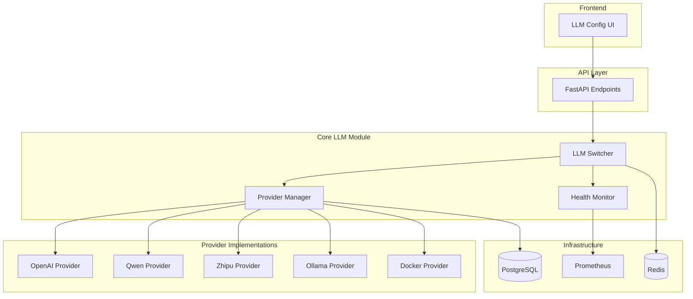
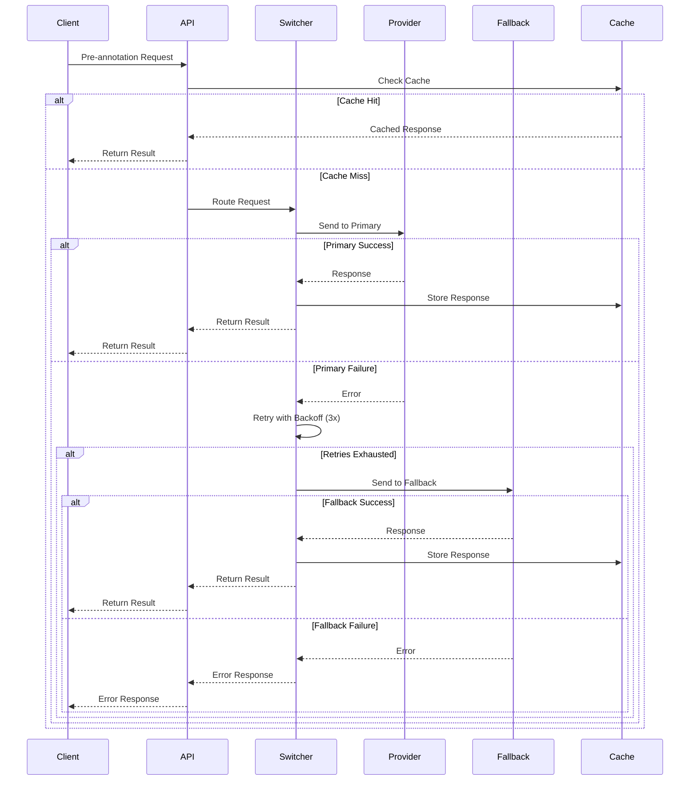

# Design Document - LLM Integration

## 1. Overview

The LLM Integration module provides a unified, extensible architecture for integrating multiple Large Language Model providers into the SuperInsight platform. The design emphasizes flexibility, reliability, and security while supporting both global and Chinese AI services across local and cloud deployment modes.

### Key Design Goals

1. **Provider Agnostic**: Abstract provider-specific implementations behind a common interface
2. **Fault Tolerant**: Automatic failover, retry mechanisms, and graceful degradation
3. **Secure**: Encrypted credential storage, audit logging, and role-based access control
4. **Observable**: Comprehensive health monitoring, metrics, and alerting
5. **Performant**: Connection pooling, response caching, and request batching
6. **Maintainable**: Plugin architecture for easy provider addition

### Architecture Principles

- **Separation of Concerns**: Provider management, request routing, and health monitoring are independent modules
- **Async-First**: All I/O operations use async/await to prevent event loop blocking
- **Configuration-Driven**: Runtime behavior controlled by database configuration, not code changes
- **Fail-Safe**: System remains operational even when individual providers fail

## 2. Architecture

### High-Level Architecture




### Request Flow Sequence



## 3. Components and Interfaces

### 3.1 Provider Base Class

Abstract base class defining the interface all providers must implement.

```python
from abc import ABC, abstractmethod
from typing import Dict, Any, Optional
from enum import Enum

class ProviderType(Enum):
    OPENAI = "openai"
    GROQ = "groq"
    ANTHROPIC = "anthropic"
    QWEN = "qwen"
    ZHIPU = "zhipu"
    BAIDU = "baidu"
    TENCENT = "tencent"
    OLLAMA = "ollama"
    DOCKER = "docker"

class DeploymentMode(Enum):
    LOCAL = "local"
    CLOUD = "cloud"

class LLMProvider(ABC):
    """Base class for all LLM providers"""
    
    def __init__(self, config: Dict[str, Any]):
        self.config = config
        self.provider_type = config["type"]
        self.deployment_mode = config["deployment_mode"]
    
    @abstractmethod
    async def generate(self, prompt: str, **kwargs) -> Dict[str, Any]:
        """Generate completion from prompt"""
        pass
    
    @abstractmethod
    async def health_check(self) -> bool:
        """Check if provider is healthy"""
        pass
    
    @abstractmethod
    async def validate_config(self) -> bool:
        """Validate provider configuration"""
        pass
    
    @abstractmethod
    async def get_metadata(self) -> Dict[str, Any]:
        """Get provider metadata"""
        pass
```


### 3.2 Provider Manager

Manages provider lifecycle, configuration, and registration.

```python
class ProviderManager:
    """Manages LLM provider instances and configurations"""
    
    def __init__(self, db_session):
        self.db = db_session
        self.providers: Dict[str, LLMProvider] = {}
        self._lock = asyncio.Lock()
    
    async def register_provider(self, provider_id: str, config: Dict[str, Any]) -> None:
        """Register a new provider"""
        async with self._lock:
            # Validate configuration
            provider_class = self._get_provider_class(config["type"])
            provider = provider_class(config)
            
            if not await provider.validate_config():
                raise ValueError(f"Invalid configuration for provider {provider_id}")
            
            # Encrypt and store API key if present
            if "api_key" in config:
                config["api_key"] = await self._encrypt_api_key(config["api_key"])
            
            # Store in database
            await self._store_config(provider_id, config)
            
            # Initialize provider
            self.providers[provider_id] = provider
    
    async def get_provider(self, provider_id: str) -> Optional[LLMProvider]:
        """Get provider instance by ID"""
        async with self._lock:
            if provider_id not in self.providers:
                # Load from database
                config = await self._load_config(provider_id)
                if config:
                    provider_class = self._get_provider_class(config["type"])
                    self.providers[provider_id] = provider_class(config)
            
            return self.providers.get(provider_id)
    
    async def list_providers(self) -> List[Dict[str, Any]]:
        """List all configured providers with metadata"""
        providers = await self._load_all_configs()
        return [
            {
                "id": p["id"],
                "name": p["name"],
                "type": p["type"],
                "deployment_mode": p["deployment_mode"],
                "status": await self._get_provider_status(p["id"])
            }
            for p in providers
        ]
    
    async def update_provider(self, provider_id: str, config: Dict[str, Any]) -> None:
        """Update provider configuration"""
        async with self._lock:
            # Validate new configuration
            provider_class = self._get_provider_class(config["type"])
            provider = provider_class(config)
            
            if not await provider.validate_config():
                raise ValueError(f"Invalid configuration for provider {provider_id}")
            
            # Update database
            await self._update_config(provider_id, config)
            
            # Reload provider
            self.providers[provider_id] = provider
    
    async def delete_provider(self, provider_id: str) -> None:
        """Delete provider configuration"""
        async with self._lock:
            # Check if provider is active
            active_provider = await self._get_active_provider_id()
            if provider_id == active_provider:
                raise ValueError("Cannot delete active provider")
            
            # Remove from database
            await self._delete_config(provider_id)
            
            # Remove from memory
            if provider_id in self.providers:
                del self.providers[provider_id]
```


### 3.3 LLM Switcher

Handles provider selection, failover, and request routing.

```python
class LLMSwitcher:
    """Manages provider switching and failover logic"""
    
    def __init__(self, provider_manager: ProviderManager, cache_client):
        self.manager = provider_manager
        self.cache = cache_client
        self.active_provider_id: Optional[str] = None
        self.fallback_provider_id: Optional[str] = None
        self.stats: Dict[str, int] = defaultdict(int)
        self._lock = asyncio.Lock()
    
    async def set_active_provider(self, provider_id: str) -> None:
        """Set the active provider"""
        async with self._lock:
            provider = await self.manager.get_provider(provider_id)
            if not provider:
                raise ValueError(f"Provider {provider_id} not found")
            
            if not await provider.health_check():
                raise ValueError(f"Provider {provider_id} is unhealthy")
            
            self.active_provider_id = provider_id
            await self._store_active_provider(provider_id)
    
    async def set_fallback_provider(self, provider_id: str) -> None:
        """Set the fallback provider"""
        async with self._lock:
            self.fallback_provider_id = provider_id
            await self._store_fallback_provider(provider_id)
    
    async def generate(self, prompt: str, **kwargs) -> Dict[str, Any]:
        """Generate completion with automatic failover"""
        # Check cache first
        cache_key = self._generate_cache_key(prompt, kwargs)
        cached_response = await self.cache.get(cache_key)
        if cached_response:
            return cached_response
        
        # Try primary provider with retries
        try:
            response = await self._generate_with_retry(
                self.active_provider_id, prompt, **kwargs
            )
            
            # Cache successful response
            await self.cache.setex(cache_key, 3600, response)
            
            # Track usage
            async with self._lock:
                self.stats[self.active_provider_id] += 1
            
            return response
            
        except Exception as primary_error:
            logger.warning(f"Primary provider failed: {primary_error}")
            
            # Try fallback provider
            if self.fallback_provider_id:
                try:
                    response = await self._generate_with_retry(
                        self.fallback_provider_id, prompt, **kwargs
                    )
                    
                    # Cache successful response
                    await self.cache.setex(cache_key, 3600, response)
                    
                    # Track usage
                    async with self._lock:
                        self.stats[self.fallback_provider_id] += 1
                    
                    return response
                    
                except Exception as fallback_error:
                    logger.error(f"Fallback provider failed: {fallback_error}")
                    raise Exception(
                        f"Both primary and fallback providers failed. "
                        f"Primary: {primary_error}, Fallback: {fallback_error}"
                    )
            else:
                raise primary_error
    
    async def _generate_with_retry(
        self, provider_id: str, prompt: str, max_retries: int = 3, **kwargs
    ) -> Dict[str, Any]:
        """Generate with exponential backoff retry"""
        provider = await self.manager.get_provider(provider_id)
        if not provider:
            raise ValueError(f"Provider {provider_id} not found")
        
        last_error = None
        for attempt in range(max_retries):
            try:
                # Set timeout
                async with asyncio.timeout(30.0):
                    return await provider.generate(prompt, **kwargs)
                    
            except asyncio.TimeoutError:
                last_error = "Request timeout after 30 seconds"
                logger.warning(f"Timeout on attempt {attempt + 1}/{max_retries}")
                
            except Exception as e:
                last_error = str(e)
                logger.warning(f"Error on attempt {attempt + 1}/{max_retries}: {e}")
                
                # Check for rate limit
                if "rate_limit" in str(e).lower():
                    retry_after = self._extract_retry_after(e)
                    await asyncio.sleep(retry_after)
                    continue
            
            # Exponential backoff
            if attempt < max_retries - 1:
                backoff = 2 ** attempt
                await asyncio.sleep(backoff)
        
        raise Exception(f"Max retries exceeded. Last error: {last_error}")
    
    async def get_usage_stats(self) -> Dict[str, int]:
        """Get provider usage statistics"""
        async with self._lock:
            return dict(self.stats)
```


### 3.4 Health Monitor

Monitors provider health and triggers alerts.

```python
class HealthMonitor:
    """Monitors LLM provider health"""
    
    def __init__(self, provider_manager: ProviderManager, metrics_collector):
        self.manager = provider_manager
        self.metrics = metrics_collector
        self.health_status: Dict[str, bool] = {}
        self._lock = asyncio.Lock()
        self._monitor_task: Optional[asyncio.Task] = None
    
    async def start(self) -> None:
        """Start health monitoring"""
        self._monitor_task = asyncio.create_task(self._monitor_loop())
    
    async def stop(self) -> None:
        """Stop health monitoring"""
        if self._monitor_task:
            self._monitor_task.cancel()
            try:
                await self._monitor_task
            except asyncio.CancelledError:
                pass
    
    async def _monitor_loop(self) -> None:
        """Background health check loop"""
        while True:
            try:
                providers = await self.manager.list_providers()
                
                for provider_info in providers:
                    provider_id = provider_info["id"]
                    provider = await self.manager.get_provider(provider_id)
                    
                    if provider:
                        try:
                            is_healthy = await provider.health_check()
                            await self._update_health_status(provider_id, is_healthy)
                            
                            # Update metrics
                            self.metrics.set_provider_health(provider_id, 1 if is_healthy else 0)
                            
                        except Exception as e:
                            logger.error(f"Health check failed for {provider_id}: {e}")
                            await self._update_health_status(provider_id, False)
                            self.metrics.set_provider_health(provider_id, 0)
                
                await asyncio.sleep(60)  # Check every 60 seconds
                
            except Exception as e:
                logger.error(f"Error in health monitor loop: {e}")
                await asyncio.sleep(60)
    
    async def _update_health_status(self, provider_id: str, is_healthy: bool) -> None:
        """Update provider health status"""
        async with self._lock:
            previous_status = self.health_status.get(provider_id)
            self.health_status[provider_id] = is_healthy
            
            # Trigger alerts on status change
            if previous_status is not None and previous_status != is_healthy:
                if is_healthy:
                    logger.info(f"Provider {provider_id} recovered")
                    await self._send_alert(provider_id, "recovered")
                else:
                    logger.warning(f"Provider {provider_id} became unhealthy")
                    await self._send_alert(provider_id, "unhealthy")
    
    async def get_health_status(self, provider_id: str) -> bool:
        """Get current health status of a provider"""
        async with self._lock:
            return self.health_status.get(provider_id, False)
    
    async def get_healthy_providers(self) -> List[str]:
        """Get list of healthy provider IDs"""
        async with self._lock:
            return [
                provider_id 
                for provider_id, is_healthy in self.health_status.items() 
                if is_healthy
            ]
```


### 3.5 Provider Implementations

#### OpenAI Provider

```python
class OpenAIProvider(LLMProvider):
    """OpenAI API provider implementation"""
    
    def __init__(self, config: Dict[str, Any]):
        super().__init__(config)
        self.client = AsyncOpenAI(api_key=config["api_key"])
        self.model = config.get("model", "gpt-4")
    
    async def generate(self, prompt: str, **kwargs) -> Dict[str, Any]:
        response = await self.client.chat.completions.create(
            model=self.model,
            messages=[{"role": "user", "content": prompt}],
            **kwargs
        )
        return {
            "text": response.choices[0].message.content,
            "model": self.model,
            "usage": response.usage.dict()
        }
    
    async def health_check(self) -> bool:
        try:
            await self.client.models.list()
            return True
        except Exception:
            return False
    
    async def validate_config(self) -> bool:
        return "api_key" in self.config and "model" in self.config
    
    async def get_metadata(self) -> Dict[str, Any]:
        return {
            "type": "openai",
            "deployment_mode": "cloud",
            "model": self.model
        }
```

#### Qwen Provider (通义千问)

```python
class QwenProvider(LLMProvider):
    """Alibaba Qwen (通义千问) provider implementation"""
    
    def __init__(self, config: Dict[str, Any]):
        super().__init__(config)
        dashscope.api_key = config["api_key"]
        self.model = config.get("model", "qwen-turbo")
    
    async def generate(self, prompt: str, **kwargs) -> Dict[str, Any]:
        response = await asyncio.get_event_loop().run_in_executor(
            None,
            lambda: dashscope.Generation.call(
                model=self.model,
                prompt=prompt,
                **kwargs
            )
        )
        
        if response.status_code == 200:
            return {
                "text": response.output.text,
                "model": self.model,
                "usage": response.usage
            }
        else:
            raise Exception(f"Qwen API error: {response.message}")
    
    async def health_check(self) -> bool:
        try:
            response = await self.generate("test", max_tokens=5)
            return True
        except Exception:
            return False
    
    async def validate_config(self) -> bool:
        return "api_key" in self.config
    
    async def get_metadata(self) -> Dict[str, Any]:
        return {
            "type": "qwen",
            "deployment_mode": "cloud",
            "model": self.model,
            "region": "china"
        }
```

#### Ollama Provider (Local)

```python
class OllamaProvider(LLMProvider):
    """Ollama local deployment provider"""
    
    def __init__(self, config: Dict[str, Any]):
        super().__init__(config)
        self.client = ollama.AsyncClient(host=config.get("host", "http://localhost:11434"))
        self.model = config.get("model", "llama2")
    
    async def generate(self, prompt: str, **kwargs) -> Dict[str, Any]:
        response = await self.client.generate(
            model=self.model,
            prompt=prompt,
            **kwargs
        )
        return {
            "text": response["response"],
            "model": self.model,
            "context": response.get("context")
        }
    
    async def health_check(self) -> bool:
        try:
            await self.client.list()
            return True
        except Exception:
            return False
    
    async def validate_config(self) -> bool:
        return "model" in self.config
    
    async def get_metadata(self) -> Dict[str, Any]:
        return {
            "type": "ollama",
            "deployment_mode": "local",
            "model": self.model,
            "host": self.client._client.base_url
        }
```


## 4. Data Models

### 4.1 Database Schema

```python
from sqlalchemy import Column, String, JSON, Boolean, DateTime, Enum
from sqlalchemy.dialects.postgresql import UUID
import uuid

class LLMProviderConfig(Base):
    """LLM provider configuration table"""
    __tablename__ = "llm_provider_configs"
    
    id = Column(UUID(as_uuid=True), primary_key=True, default=uuid.uuid4)
    tenant_id = Column(UUID(as_uuid=True), nullable=False, index=True)
    name = Column(String(100), nullable=False)
    provider_type = Column(String(50), nullable=False)  # openai, qwen, etc.
    deployment_mode = Column(String(20), nullable=False)  # local, cloud
    config = Column(JSON, nullable=False)  # Encrypted API keys, endpoints, etc.
    is_active = Column(Boolean, default=False)
    is_fallback = Column(Boolean, default=False)
    created_at = Column(DateTime, nullable=False)
    updated_at = Column(DateTime, nullable=False)
    created_by = Column(UUID(as_uuid=True), nullable=False)
    
    __table_args__ = (
        Index('idx_tenant_provider', 'tenant_id', 'provider_type'),
        Index('idx_tenant_active', 'tenant_id', 'is_active'),
    )

class LLMRequestLog(Base):
    """LLM request logging table"""
    __tablename__ = "llm_request_logs"
    
    id = Column(UUID(as_uuid=True), primary_key=True, default=uuid.uuid4)
    tenant_id = Column(UUID(as_uuid=True), nullable=False, index=True)
    provider_id = Column(UUID(as_uuid=True), nullable=False)
    request_type = Column(String(50), nullable=False)  # pre_annotation, etc.
    prompt_hash = Column(String(64), nullable=False)  # SHA256 of prompt
    response_status = Column(String(20), nullable=False)  # success, error, timeout
    latency_ms = Column(Integer, nullable=False)
    token_usage = Column(JSON)  # {prompt_tokens, completion_tokens, total_tokens}
    error_message = Column(String(500))
    created_at = Column(DateTime, nullable=False, index=True)
    
    __table_args__ = (
        Index('idx_tenant_provider_status', 'tenant_id', 'provider_id', 'response_status'),
        Index('idx_created_at', 'created_at'),
    )

class LLMHealthStatus(Base):
    """LLM provider health status table"""
    __tablename__ = "llm_health_status"
    
    id = Column(UUID(as_uuid=True), primary_key=True, default=uuid.uuid4)
    provider_id = Column(UUID(as_uuid=True), nullable=False, unique=True)
    is_healthy = Column(Boolean, nullable=False)
    last_check_at = Column(DateTime, nullable=False)
    last_error = Column(String(500))
    consecutive_failures = Column(Integer, default=0)
    updated_at = Column(DateTime, nullable=False)
```

### 4.2 API Schemas

```python
from pydantic import BaseModel, Field
from typing import Optional, Dict, Any, List
from datetime import datetime

class ProviderConfigCreate(BaseModel):
    """Schema for creating provider configuration"""
    name: str = Field(..., min_length=1, max_length=100)
    provider_type: str = Field(..., regex="^(openai|groq|anthropic|qwen|zhipu|baidu|tencent|ollama|docker)$")
    deployment_mode: str = Field(..., regex="^(local|cloud)$")
    config: Dict[str, Any] = Field(..., description="Provider-specific configuration")
    is_fallback: bool = Field(default=False)

class ProviderConfigUpdate(BaseModel):
    """Schema for updating provider configuration"""
    name: Optional[str] = Field(None, min_length=1, max_length=100)
    config: Optional[Dict[str, Any]] = None
    is_fallback: Optional[bool] = None

class ProviderConfigResponse(BaseModel):
    """Schema for provider configuration response"""
    id: str
    name: str
    provider_type: str
    deployment_mode: str
    is_active: bool
    is_fallback: bool
    status: str  # healthy, unhealthy, unknown
    created_at: datetime
    updated_at: datetime
    
    class Config:
        from_attributes = True

class GenerateRequest(BaseModel):
    """Schema for LLM generation request"""
    prompt: str = Field(..., min_length=1)
    max_tokens: Optional[int] = Field(None, ge=1, le=4096)
    temperature: Optional[float] = Field(None, ge=0.0, le=2.0)
    top_p: Optional[float] = Field(None, ge=0.0, le=1.0)
    provider_id: Optional[str] = Field(None, description="Override active provider")

class GenerateResponse(BaseModel):
    """Schema for LLM generation response"""
    text: str
    model: str
    provider_id: str
    usage: Optional[Dict[str, int]] = None
    cached: bool = False

class HealthCheckResponse(BaseModel):
    """Schema for health check response"""
    provider_id: str
    is_healthy: bool
    last_check_at: datetime
    last_error: Optional[str] = None
```


## 5. Correctness Properties

*A property is a characteristic or behavior that should hold true across all valid executions of a system—essentially, a formal statement about what the system should do. Properties serve as the bridge between human-readable specifications and machine-verifiable correctness guarantees.*

### Property 1: Provider Type Support

*For any* provider configuration with type in {openai, groq, anthropic, qwen, zhipu, baidu, tencent, ollama, docker}, the system should accept and successfully register the provider.

**Validates: Requirements 1.1, 1.2**

### Property 2: Configuration Validation

*For any* provider configuration, if the configuration is invalid (missing required fields or invalid values), the system should reject it with a descriptive error message.

**Validates: Requirements 1.3, 6.4**

### Property 3: Provider Metadata Completeness

*For any* registered provider, listing providers should return metadata containing all required fields: id, name, type, deployment_mode, and status.

**Validates: Requirements 1.4**

### Property 4: API Key Encryption Round-Trip

*For any* API key string, storing it then retrieving it should produce the original plaintext value, but the stored value in the database should be encrypted and different from the plaintext.

**Validates: Requirements 1.5, 9.1**

### Property 5: Deployment Mode Preservation

*For any* provider configuration, switching deployment modes should preserve all other configuration fields unchanged.

**Validates: Requirements 2.4**

### Property 6: Provider Switching Validation

*For any* provider switch request, if the target provider is unavailable or unhealthy, the switch should be rejected and the current provider should remain active.

**Validates: Requirements 3.2**

### Property 7: Automatic Failover

*For any* LLM request, if the primary provider fails after all retries, the system should automatically attempt the fallback provider and return a successful response if the fallback succeeds.

**Validates: Requirements 3.3, 4.2**

### Property 8: Request Context Preservation

*For any* LLM request that triggers a provider switch, the request prompt and parameters should be identical when sent to the fallback provider.

**Validates: Requirements 3.4**

### Property 9: Usage Statistics Tracking

*For any* successful LLM request, the provider usage counter should increment by exactly 1.

**Validates: Requirements 3.5**

### Property 10: Exponential Backoff Retry

*For any* failed LLM request, the system should retry up to 3 times with exponentially increasing delays (1s, 2s, 4s) before attempting the fallback provider.

**Validates: Requirements 4.1**

### Property 11: Comprehensive Error Reporting

*For any* LLM request where both primary and fallback providers fail, the error response should contain failure details from both providers.

**Validates: Requirements 4.3**

### Property 12: Timeout Enforcement

*For any* LLM request, if the provider does not respond within 30 seconds, the request should be cancelled and a timeout error should be logged.

**Validates: Requirements 4.4**

### Property 13: Rate Limit Handling

*For any* LLM request that receives a rate limit error, the system should wait for the retry-after period before retrying, not immediately.

**Validates: Requirements 4.5**

### Property 14: Health Check Scheduling

*For any* 60-second time window, the system should perform exactly one health check for each configured provider.

**Validates: Requirements 5.1**

### Property 15: Health Status Management

*For any* provider, when a health check fails, the provider should be marked as unhealthy and excluded from request routing; when it recovers, it should be marked as healthy and included in routing.

**Validates: Requirements 5.2, 5.3, 5.4**

### Property 16: Active Provider Deletion Prevention

*For any* provider that is currently set as the active provider, deletion attempts should be rejected with an error.

**Validates: Requirements 6.5**

### Property 17: Pre-Annotation Routing

*For any* pre-annotation request, the request should be sent to the currently active provider, not to any other provider.

**Validates: Requirements 7.1**

### Property 18: Response Schema Compliance

*For any* successful LLM response, parsing the response should produce a valid annotation object that conforms to the annotation schema.

**Validates: Requirements 7.2**

### Property 19: Pre-Annotation Error Isolation

*For any* pre-annotation request that fails, the failure should be logged but should not prevent manual annotation from proceeding.

**Validates: Requirements 7.3**

### Property 20: Confidence Score Storage

*For any* successful pre-annotation, the stored annotation should include a confidence score field with a value between 0.0 and 1.0.

**Validates: Requirements 7.4**

### Property 21: Internationalization Completeness

*For any* UI string key, translations should exist for both zh-CN and en-US locales.

**Validates: Requirements 8.1**

### Property 22: Error Message Localization

*For any* error message displayed to users, the message should use an i18n key rather than a hardcoded string.

**Validates: Requirements 8.2**

### Property 23: Language Preference Persistence

*For any* user language preference change, the preference should be stored and restored in subsequent sessions.

**Validates: Requirements 8.4**

### Property 24: Log Sanitization

*For any* log entry related to LLM requests, the log should not contain API keys, passwords, or PII patterns.

**Validates: Requirements 9.2**

### Property 25: Authorization Enforcement

*For any* API key access attempt by a non-administrator user, the request should be rejected with a 403 Forbidden error.

**Validates: Requirements 9.3**

### Property 26: Configuration Audit Logging

*For any* provider configuration change (create, update, delete), an audit log entry should be created with user ID, timestamp, and change details.

**Validates: Requirements 9.4**

### Property 27: Request Batching

*For any* set of compatible LLM requests to the same provider, if batching is enabled, the requests should be grouped and sent as a single batch request.

**Validates: Requirements 10.1**

### Property 28: Response Caching Round-Trip

*For any* LLM request, if the same request (identical prompt and parameters) is made within 1 hour, the second request should return a cached response without calling the provider.

**Validates: Requirements 10.2**

### Property 29: Rate Limiting

*For any* time window, the number of requests sent to a provider should not exceed the configured rate limit for that provider.

**Validates: Requirements 10.3**

### Property 30: Async Progress Tracking

*For any* large batch of LLM requests processed asynchronously, the system should provide progress updates showing completed/total requests.

**Validates: Requirements 10.5**


## 6. Error Handling

### Error Categories

1. **Configuration Errors**
   - Invalid provider type
   - Missing required fields
   - Invalid API credentials
   - Malformed configuration JSON

2. **Runtime Errors**
   - Provider unavailable
   - Network timeout
   - Rate limit exceeded
   - Authentication failure
   - Invalid response format

3. **System Errors**
   - Database connection failure
   - Cache unavailable
   - Encryption/decryption failure
   - Resource exhaustion

### Error Handling Strategy

```python
class LLMError(Exception):
    """Base exception for LLM module"""
    def __init__(self, message: str, error_code: str, details: Dict[str, Any] = None):
        self.message = message
        self.error_code = error_code
        self.details = details or {}
        super().__init__(self.message)

class ProviderConfigError(LLMError):
    """Provider configuration error"""
    pass

class ProviderUnavailableError(LLMError):
    """Provider is unavailable"""
    pass

class RateLimitError(LLMError):
    """Rate limit exceeded"""
    def __init__(self, message: str, retry_after: int):
        super().__init__(message, "RATE_LIMIT_EXCEEDED", {"retry_after": retry_after})
        self.retry_after = retry_after

class TimeoutError(LLMError):
    """Request timeout"""
    pass

# Error handling in API endpoints
@router.post("/generate")
async def generate_completion(request: GenerateRequest):
    try:
        response = await llm_switcher.generate(request.prompt, **request.dict(exclude={"prompt"}))
        return response
    except ProviderUnavailableError as e:
        raise HTTPException(
            status_code=503,
            detail={
                "error_code": e.error_code,
                "message": i18n.t("errors.provider_unavailable"),
                "details": e.details
            }
        )
    except RateLimitError as e:
        raise HTTPException(
            status_code=429,
            detail={
                "error_code": e.error_code,
                "message": i18n.t("errors.rate_limit_exceeded"),
                "retry_after": e.retry_after
            }
        )
    except TimeoutError as e:
        raise HTTPException(
            status_code=504,
            detail={
                "error_code": e.error_code,
                "message": i18n.t("errors.request_timeout")
            }
        )
    except Exception as e:
        logger.error(f"Unexpected error in generate_completion: {e}", exc_info=True)
        raise HTTPException(
            status_code=500,
            detail={
                "error_code": "INTERNAL_ERROR",
                "message": i18n.t("errors.internal_server_error")
            }
        )
```

### Retry Logic

```python
async def retry_with_backoff(
    func: Callable,
    max_retries: int = 3,
    base_delay: float = 1.0,
    max_delay: float = 60.0,
    exponential_base: float = 2.0
) -> Any:
    """Generic retry with exponential backoff"""
    last_exception = None
    
    for attempt in range(max_retries):
        try:
            return await func()
        except RateLimitError as e:
            # Honor rate limit retry-after
            await asyncio.sleep(e.retry_after)
            last_exception = e
        except (ProviderUnavailableError, TimeoutError) as e:
            last_exception = e
            if attempt < max_retries - 1:
                delay = min(base_delay * (exponential_base ** attempt), max_delay)
                logger.warning(f"Retry attempt {attempt + 1}/{max_retries} after {delay}s")
                await asyncio.sleep(delay)
        except Exception as e:
            # Non-retryable error
            raise
    
    raise last_exception
```

## 7. Testing Strategy

### Unit Testing

Unit tests focus on individual components in isolation:

- **Provider Implementations**: Test each provider's generate, health_check, and validate_config methods
- **Provider Manager**: Test registration, retrieval, update, and deletion logic
- **LLM Switcher**: Test provider selection, failover logic, and cache integration
- **Health Monitor**: Test health check scheduling and status updates
- **Error Handling**: Test error classification and retry logic

### Property-Based Testing

Property tests verify universal correctness properties across all inputs:

- **Configuration**: 100+ random provider configurations to test validation
- **Encryption**: 100+ random API keys to test encryption round-trip
- **Failover**: 100+ simulated failures to test automatic failover
- **Retry Logic**: 100+ failure scenarios to test exponential backoff
- **Caching**: 100+ request patterns to test cache hit/miss behavior

**Configuration**: Each property test must run minimum 100 iterations and reference its design property:

```python
@pytest.mark.property
def test_property_4_api_key_encryption_round_trip():
    """
    Feature: llm-integration, Property 4: API Key Encryption Round-Trip
    For any API key string, storing it then retrieving it should produce 
    the original plaintext value, but the stored value in the database 
    should be encrypted and different from the plaintext.
    """
    # Test implementation with 100+ iterations
```

### Integration Testing

Integration tests verify component interactions:

- **End-to-End Flow**: Test complete request flow from API to provider and back
- **Database Integration**: Test configuration persistence and retrieval
- **Cache Integration**: Test Redis caching behavior
- **Health Monitoring**: Test health check integration with metrics
- **Multi-Provider**: Test switching between multiple providers

### Testing Tools

- **Unit Tests**: pytest with async support
- **Property Tests**: Hypothesis for property-based testing
- **Mocking**: pytest-mock for external service mocking
- **Coverage**: pytest-cov for code coverage (target: >80%)
- **Load Testing**: locust for performance testing

### Test Data

- **Mock Providers**: In-memory mock providers for testing without external dependencies
- **Test Configurations**: Pre-defined valid and invalid configurations
- **Sample Prompts**: Diverse prompts for testing different scenarios
- **Error Scenarios**: Simulated network errors, timeouts, rate limits

