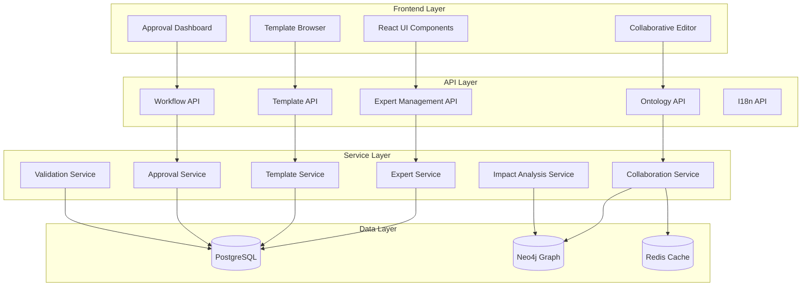
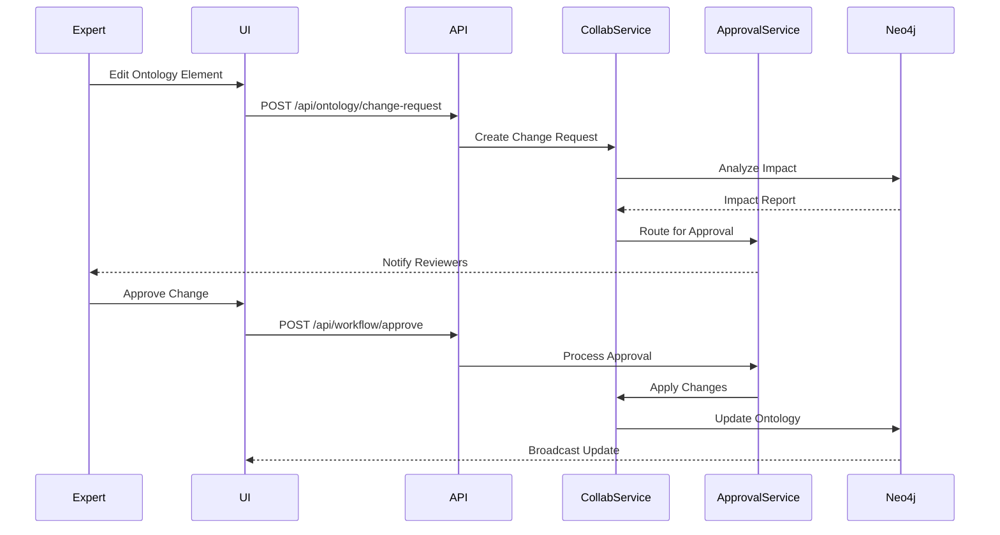

# Design Document: Ontology Expert Collaboration

## Overview

The Ontology Expert Collaboration feature extends SuperInsight's existing ontology system to enable effective collaboration between industry experts, ontology engineers, and business analysts. The design focuses on three key pillars:

1. **Expert Collaboration Infrastructure**: Real-time collaborative editing, approval workflows, and knowledge capture
2. **Local Operability (本土落地可操作性)**: Industry-specific templates, Chinese regulatory compliance, and localized validation
3. **Comprehensive Internationalization**: Multi-language support beyond display names, including definitions, validation rules, and help text

The system integrates with existing components (`src/ontology/enterprise_ontology.py`, `src/knowledge_graph/`, `src/i18n/`) while adding new modules for expert management, template libraries, and collaborative workflows.

## Architecture

### High-Level Architecture



### Component Interaction Flow




## Components and Interfaces

### 1. Expert Management Service

**Responsibility**: Manage expert profiles, expertise areas, and recommendation algorithms

**Core Classes**:
```python
class ExpertProfile:
    id: str
    name: str
    email: str
    expertise_areas: List[str]  # e.g., ["金融", "医疗"]
    certifications: List[Certification]
    language_preferences: List[str]  # e.g., ["zh-CN", "en-US"]
    contribution_score: float
    availability_status: AvailabilityStatus
    created_at: datetime
    updated_at: datetime

class ExpertService:
    async def create_expert(self, profile: ExpertProfile) -> ExpertProfile
    async def get_expert(self, expert_id: str) -> ExpertProfile
    async def update_expertise(self, expert_id: str, areas: List[str]) -> ExpertProfile
    async def recommend_experts(self, ontology_area: str, limit: int = 5) -> List[ExpertProfile]
    async def get_contribution_metrics(self, expert_id: str) -> ContributionMetrics
```

**API Endpoints**:
- `POST /api/v1/experts` - Create expert profile
- `GET /api/v1/experts/{expert_id}` - Get expert details
- `PUT /api/v1/experts/{expert_id}` - Update expert profile
- `GET /api/v1/experts/recommend` - Get expert recommendations
- `GET /api/v1/experts/{expert_id}/metrics` - Get contribution metrics

### 2. Template Service

**Responsibility**: Manage industry-specific ontology templates and customizations

**Core Classes**:
```python
class OntologyTemplate:
    id: str
    name: str
    industry: str  # "金融", "医疗", "制造", etc.
    version: str
    entity_types: List[EntityTypeDefinition]
    relation_types: List[RelationTypeDefinition]
    validation_rules: List[ValidationRule]
    i18n_keys: Dict[str, Dict[str, str]]  # {key: {lang: translation}}
    metadata: TemplateMetadata
    parent_template_id: Optional[str]  # For derived templates

class TemplateService:
    async def get_template(self, template_id: str) -> OntologyTemplate
    async def list_templates(self, industry: Optional[str] = None) -> List[OntologyTemplate]
    async def instantiate_template(self, template_id: str, project_id: str) -> OntologyInstance
    async def customize_template(self, template_id: str, customizations: Dict) -> OntologyTemplate
    async def export_template(self, template_id: str) -> bytes
    async def import_template(self, template_data: bytes) -> OntologyTemplate
```

**API Endpoints**:
- `GET /api/v1/templates` - List available templates
- `GET /api/v1/templates/{template_id}` - Get template details
- `POST /api/v1/templates/{template_id}/instantiate` - Create ontology from template
- `POST /api/v1/templates/{template_id}/customize` - Create customized template
- `POST /api/v1/templates/import` - Import template
- `GET /api/v1/templates/{template_id}/export` - Export template

### 3. Collaboration Service

**Responsibility**: Enable real-time collaborative ontology editing with conflict resolution

**Core Classes**:
```python
class CollaborationSession:
    id: str
    ontology_id: str
    participants: List[str]  # expert_ids
    active_locks: Dict[str, ElementLock]  # {element_id: lock}
    created_at: datetime
    last_activity: datetime

class ChangeRequest:
    id: str
    ontology_id: str
    requester_id: str
    change_type: ChangeType  # ADD, MODIFY, DELETE
    target_element: str
    proposed_changes: Dict
    impact_analysis: ImpactReport
    status: ChangeStatus  # PENDING, APPROVED, REJECTED
    approval_chain: List[ApprovalLevel]
    created_at: datetime

class CollaborationService:
    async def create_session(self, ontology_id: str, expert_id: str) -> CollaborationSession
    async def join_session(self, session_id: str, expert_id: str) -> CollaborationSession
    async def lock_element(self, session_id: str, element_id: str, expert_id: str) -> ElementLock
    async def unlock_element(self, session_id: str, element_id: str) -> None
    async def broadcast_change(self, session_id: str, change: OntologyChange) -> None
    async def create_change_request(self, change: ChangeRequest) -> ChangeRequest
    async def resolve_conflict(self, conflict: EditConflict, resolution: ConflictResolution) -> None
```

**API Endpoints**:
- `POST /api/v1/collaboration/sessions` - Create collaboration session
- `POST /api/v1/collaboration/sessions/{session_id}/join` - Join session
- `POST /api/v1/collaboration/sessions/{session_id}/lock` - Lock element
- `DELETE /api/v1/collaboration/sessions/{session_id}/lock/{element_id}` - Unlock element
- `WS /api/v1/collaboration/sessions/{session_id}/ws` - WebSocket for real-time updates
- `POST /api/v1/collaboration/change-requests` - Create change request
- `POST /api/v1/collaboration/conflicts/{conflict_id}/resolve` - Resolve conflict


### 4. Approval Workflow Service

**Responsibility**: Manage multi-level approval workflows for ontology changes

**Core Classes**:
```python
class ApprovalChain:
    id: str
    name: str
    levels: List[ApprovalLevel]
    ontology_area: str
    created_by: str
    created_at: datetime

class ApprovalLevel:
    level_number: int
    approvers: List[str]  # expert_ids or role_ids
    approval_type: ApprovalType  # PARALLEL, SEQUENTIAL
    deadline_hours: int
    escalation_policy: EscalationPolicy

class ApprovalService:
    async def create_approval_chain(self, chain: ApprovalChain) -> ApprovalChain
    async def route_change_request(self, change_request_id: str) -> None
    async def approve(self, change_request_id: str, expert_id: str, comments: str) -> ApprovalResult
    async def reject(self, change_request_id: str, expert_id: str, reason: str) -> ApprovalResult
    async def request_changes(self, change_request_id: str, expert_id: str, feedback: str) -> None
    async def escalate(self, change_request_id: str, level: int) -> None
    async def get_pending_approvals(self, expert_id: str) -> List[ChangeRequest]
```

**API Endpoints**:
- `POST /api/v1/workflow/approval-chains` - Create approval chain
- `GET /api/v1/workflow/approval-chains` - List approval chains
- `POST /api/v1/workflow/change-requests/{id}/approve` - Approve change
- `POST /api/v1/workflow/change-requests/{id}/reject` - Reject change
- `POST /api/v1/workflow/change-requests/{id}/request-changes` - Request modifications
- `GET /api/v1/workflow/pending-approvals` - Get pending approvals for expert

### 5. Validation Service

**Responsibility**: Provide localized validation rules for different regions and industries

**Core Classes**:
```python
class ValidationRule:
    id: str
    name: str
    rule_type: RuleType  # FORMAT, RANGE, REQUIRED, CUSTOM
    target_entity_type: str
    target_field: str
    validation_logic: str  # Python expression or regex
    error_message_key: str  # i18n key
    region: str  # "CN", "HK", "TW", "INTL"
    industry: Optional[str]

class LocalizedValidator:
    region: str
    industry: str
    rules: List[ValidationRule]
    
    async def validate_entity(self, entity: Dict) -> ValidationResult
    async def validate_relation(self, relation: Dict) -> ValidationResult
    async def get_error_message(self, rule_id: str, lang: str) -> str

class ValidationService:
    async def get_rules(self, entity_type: str, region: str, industry: str) -> List[ValidationRule]
    async def create_rule(self, rule: ValidationRule) -> ValidationRule
    async def validate(self, entity: Dict, region: str, industry: str) -> ValidationResult
    async def get_chinese_business_validators(self) -> List[ValidationRule]
```

**API Endpoints**:
- `GET /api/v1/validation/rules` - List validation rules
- `POST /api/v1/validation/rules` - Create validation rule
- `POST /api/v1/validation/validate` - Validate entity or relation
- `GET /api/v1/validation/chinese-business` - Get Chinese business validators

### 6. Impact Analysis Service

**Responsibility**: Analyze the impact of proposed ontology changes on existing data

**Core Classes**:
```python
class ImpactReport:
    change_request_id: str
    affected_entity_count: int
    affected_relation_count: int
    affected_projects: List[str]
    migration_complexity: ComplexityLevel  # LOW, MEDIUM, HIGH
    estimated_migration_hours: float
    breaking_changes: List[BreakingChange]
    recommendations: List[str]
    generated_at: datetime

class ImpactAnalysisService:
    async def analyze_change(self, change_request: ChangeRequest) -> ImpactReport
    async def count_affected_entities(self, entity_type: str) -> int
    async def count_affected_relations(self, relation_type: str) -> int
    async def identify_breaking_changes(self, change: OntologyChange) -> List[BreakingChange]
    async def estimate_migration_effort(self, impact: ImpactReport) -> float
```

**API Endpoints**:
- `POST /api/v1/impact/analyze` - Analyze change impact
- `GET /api/v1/impact/reports/{change_request_id}` - Get impact report
- `GET /api/v1/impact/affected-entities` - Count affected entities
- `GET /api/v1/impact/affected-relations` - Count affected relations


### 7. Internationalization (i18n) Service Extension

**Responsibility**: Extend existing i18n service to support ontology-specific multi-language content

**Core Classes**:
```python
class OntologyI18n:
    ontology_id: str
    element_id: str
    element_type: str  # "entity_type", "relation_type", "validation_rule"
    translations: Dict[str, OntologyTranslation]  # {lang: translation}
    
class OntologyTranslation:
    language: str  # "zh-CN", "en-US", "ja-JP", etc.
    name: str
    description: str
    help_text: str
    validation_error_messages: Dict[str, str]
    examples: List[str]

class OntologyI18nService:
    async def add_translation(self, element_id: str, lang: str, translation: OntologyTranslation) -> None
    async def get_translation(self, element_id: str, lang: str) -> OntologyTranslation
    async def get_missing_translations(self, ontology_id: str, lang: str) -> List[str]
    async def export_translations(self, ontology_id: str, lang: str) -> Dict
    async def import_translations(self, ontology_id: str, lang: str, translations: Dict) -> None
```

**API Endpoints**:
- `POST /api/v1/i18n/ontology/{element_id}/translations` - Add translation
- `GET /api/v1/i18n/ontology/{element_id}/translations/{lang}` - Get translation
- `GET /api/v1/i18n/ontology/{ontology_id}/missing/{lang}` - Get missing translations
- `GET /api/v1/i18n/ontology/{ontology_id}/export/{lang}` - Export translations
- `POST /api/v1/i18n/ontology/{ontology_id}/import/{lang}` - Import translations

## Data Models

### Database Schema (PostgreSQL)

```sql
-- Expert profiles
CREATE TABLE expert_profiles (
    id UUID PRIMARY KEY,
    name VARCHAR(255) NOT NULL,
    email VARCHAR(255) UNIQUE NOT NULL,
    expertise_areas TEXT[] NOT NULL,
    certifications JSONB,
    language_preferences TEXT[],
    contribution_score FLOAT DEFAULT 0.0,
    availability_status VARCHAR(50),
    created_at TIMESTAMP DEFAULT NOW(),
    updated_at TIMESTAMP DEFAULT NOW()
);

-- Ontology templates
CREATE TABLE ontology_templates (
    id UUID PRIMARY KEY,
    name VARCHAR(255) NOT NULL,
    industry VARCHAR(100) NOT NULL,
    version VARCHAR(50) NOT NULL,
    entity_types JSONB NOT NULL,
    relation_types JSONB NOT NULL,
    validation_rules JSONB NOT NULL,
    i18n_keys JSONB NOT NULL,
    metadata JSONB,
    parent_template_id UUID REFERENCES ontology_templates(id),
    created_by UUID REFERENCES expert_profiles(id),
    created_at TIMESTAMP DEFAULT NOW(),
    updated_at TIMESTAMP DEFAULT NOW()
);

-- Change requests
CREATE TABLE change_requests (
    id UUID PRIMARY KEY,
    ontology_id UUID NOT NULL,
    requester_id UUID REFERENCES expert_profiles(id),
    change_type VARCHAR(50) NOT NULL,
    target_element VARCHAR(255) NOT NULL,
    proposed_changes JSONB NOT NULL,
    impact_analysis JSONB,
    status VARCHAR(50) DEFAULT 'PENDING',
    approval_chain_id UUID REFERENCES approval_chains(id),
    created_at TIMESTAMP DEFAULT NOW(),
    updated_at TIMESTAMP DEFAULT NOW()
);

-- Approval chains
CREATE TABLE approval_chains (
    id UUID PRIMARY KEY,
    name VARCHAR(255) NOT NULL,
    levels JSONB NOT NULL,
    ontology_area VARCHAR(255),
    created_by UUID REFERENCES expert_profiles(id),
    created_at TIMESTAMP DEFAULT NOW()
);

-- Approval records
CREATE TABLE approval_records (
    id UUID PRIMARY KEY,
    change_request_id UUID REFERENCES change_requests(id),
    approver_id UUID REFERENCES expert_profiles(id),
    level_number INT NOT NULL,
    action VARCHAR(50) NOT NULL,  -- APPROVED, REJECTED, REQUESTED_CHANGES
    comments TEXT,
    created_at TIMESTAMP DEFAULT NOW()
);

-- Validation rules
CREATE TABLE validation_rules (
    id UUID PRIMARY KEY,
    name VARCHAR(255) NOT NULL,
    rule_type VARCHAR(50) NOT NULL,
    target_entity_type VARCHAR(255) NOT NULL,
    target_field VARCHAR(255),
    validation_logic TEXT NOT NULL,
    error_message_key VARCHAR(255) NOT NULL,
    region VARCHAR(10) NOT NULL,
    industry VARCHAR(100),
    created_by UUID REFERENCES expert_profiles(id),
    created_at TIMESTAMP DEFAULT NOW()
);

-- Knowledge contributions
CREATE TABLE knowledge_contributions (
    id UUID PRIMARY KEY,
    expert_id UUID REFERENCES expert_profiles(id),
    contribution_type VARCHAR(50) NOT NULL,
    ontology_element_id VARCHAR(255) NOT NULL,
    content JSONB NOT NULL,
    status VARCHAR(50) DEFAULT 'PENDING',
    reviewed_by UUID REFERENCES expert_profiles(id),
    created_at TIMESTAMP DEFAULT NOW()
);

-- Ontology i18n
CREATE TABLE ontology_i18n (
    id UUID PRIMARY KEY,
    ontology_id UUID NOT NULL,
    element_id VARCHAR(255) NOT NULL,
    element_type VARCHAR(50) NOT NULL,
    language VARCHAR(10) NOT NULL,
    name VARCHAR(255) NOT NULL,
    description TEXT,
    help_text TEXT,
    validation_error_messages JSONB,
    examples TEXT[],
    created_at TIMESTAMP DEFAULT NOW(),
    updated_at TIMESTAMP DEFAULT NOW(),
    UNIQUE(element_id, language)
);

-- Audit logs
CREATE TABLE ontology_audit_logs (
    id UUID PRIMARY KEY,
    ontology_id UUID NOT NULL,
    user_id UUID REFERENCES expert_profiles(id),
    action VARCHAR(50) NOT NULL,
    target_element VARCHAR(255),
    changes JSONB NOT NULL,
    ip_address INET,
    user_agent TEXT,
    created_at TIMESTAMP DEFAULT NOW()
);

-- Indexes
CREATE INDEX idx_expert_expertise ON expert_profiles USING GIN(expertise_areas);
CREATE INDEX idx_template_industry ON ontology_templates(industry);
CREATE INDEX idx_change_request_status ON change_requests(status);
CREATE INDEX idx_validation_rules_region ON validation_rules(region, industry);
CREATE INDEX idx_i18n_element ON ontology_i18n(element_id, language);
CREATE INDEX idx_audit_logs_ontology ON ontology_audit_logs(ontology_id, created_at);
```


### Graph Database Schema (Neo4j)

```cypher
// Ontology element nodes
CREATE (e:EntityType {
    id: 'entity-001',
    name: '部门',
    name_en: 'Department',
    template_id: 'template-finance',
    industry: '金融',
    created_by: 'expert-001',
    created_at: datetime()
})

CREATE (r:RelationType {
    id: 'relation-001',
    name: '汇报给',
    name_en: 'Reports To',
    template_id: 'template-finance',
    industry: '金融',
    created_by: 'expert-001',
    created_at: datetime()
})

// Expert contribution tracking
CREATE (e:Expert {
    id: 'expert-001',
    name: '张三',
    expertise_areas: ['金融', '医疗']
})

CREATE (e)-[:CONTRIBUTED_TO {
    contribution_type: 'CREATED',
    timestamp: datetime()
}]->(entity:EntityType)

// Template lineage
CREATE (base:Template {
    id: 'template-finance-base',
    name: '金融行业基础模板',
    version: '1.0.0'
})

CREATE (derived:Template {
    id: 'template-finance-custom',
    name: '某银行定制模板',
    version: '1.0.0'
})-[:DERIVED_FROM]->(base)

// Change impact relationships
CREATE (entity:EntityType)-[:USED_BY]->(project:Project)
CREATE (entity)-[:DEPENDS_ON]->(other:EntityType)
CREATE (relation:RelationType)-[:CONNECTS]->(source:EntityType)
CREATE (relation)-[:CONNECTS]->(target:EntityType)
```

### Redis Cache Schema

```python
# Collaboration session cache
collaboration:session:{session_id} = {
    "ontology_id": "ont-001",
    "participants": ["expert-001", "expert-002"],
    "active_locks": {
        "element-001": {
            "locked_by": "expert-001",
            "locked_at": "2026-01-19T10:00:00Z",
            "expires_at": "2026-01-19T10:05:00Z"
        }
    },
    "last_activity": "2026-01-19T10:02:00Z"
}
# TTL: 1 hour

# Expert presence cache
expert:presence:{expert_id} = {
    "status": "online",
    "current_session": "session-001",
    "last_seen": "2026-01-19T10:02:00Z"
}
# TTL: 5 minutes

# Template cache
template:cache:{template_id} = {
    "template_data": {...},
    "cached_at": "2026-01-19T10:00:00Z"
}
# TTL: 1 hour

# Validation rules cache
validation:rules:{region}:{industry} = [
    {"rule_id": "rule-001", "rule_data": {...}},
    {"rule_id": "rule-002", "rule_data": {...}}
]
# TTL: 30 minutes
```

## Technical Decisions

### Decision 1: Use WebSocket for Real-Time Collaboration

**Rationale**: 
- Real-time updates are critical for collaborative editing
- WebSocket provides low-latency bidirectional communication
- Reduces polling overhead compared to HTTP long-polling
- Native browser support without additional libraries

**Alternatives Considered**:
- Server-Sent Events (SSE): One-way communication only
- HTTP polling: High latency and server load
- gRPC streaming: Requires additional client libraries

**Implementation**: Use FastAPI's WebSocket support with Redis pub/sub for multi-instance broadcasting

### Decision 2: Store Templates in PostgreSQL with JSONB

**Rationale**:
- Templates have flexible schema that varies by industry
- JSONB provides efficient querying and indexing
- Easier to version and extend templates without schema migrations
- PostgreSQL JSONB operators support complex queries

**Alternatives Considered**:
- Separate tables for each template component: Too rigid, complex joins
- MongoDB: Adds another database dependency
- File-based storage: No transactional guarantees, harder to query

### Decision 3: Use asyncio.Lock for Collaboration Locks

**Rationale**:
- All FastAPI endpoints are async
- threading.Lock causes deadlocks in async context (see async-sync-safety.md)
- asyncio.Lock is designed for async/await patterns
- Prevents event loop blocking

**Alternatives Considered**:
- threading.Lock: FORBIDDEN - causes deadlocks in async context
- Database-level locks: Too slow for real-time collaboration
- Redis distributed locks: Adds complexity, network latency

### Decision 4: Separate Validation Rules by Region and Industry

**Rationale**:
- Chinese business rules differ significantly from international
- Industry-specific rules improve accuracy and relevance
- Allows gradual expansion to new regions/industries
- Supports compliance with local regulations

**Alternatives Considered**:
- Single global validation: Too generic, misses local requirements
- Hardcoded rules: Not extensible, requires code changes
- External validation service: Adds latency and complexity

### Decision 5: Use Neo4j for Impact Analysis

**Rationale**:
- Ontology relationships form a natural graph structure
- Graph queries efficiently find all dependent elements
- Cypher queries are more intuitive for relationship traversal
- Existing knowledge graph infrastructure can be reused

**Alternatives Considered**:
- PostgreSQL recursive CTEs: Slower for deep hierarchies
- In-memory graph: Doesn't persist, limited scalability
- Separate graph database: Neo4j already in stack


## Correctness Properties

*A property is a characteristic or behavior that should hold true across all valid executions of a system—essentially, a formal statement about what the system should do. Properties serve as the bridge between human-readable specifications and machine-verifiable correctness guarantees.*

### Property Reflection

After analyzing all 75 acceptance criteria, I identified several areas where properties can be consolidated:

**Consolidation 1**: Properties 1.1, 6.1, and 14.1 all test that data is stored with complete metadata (timestamps, user attribution). These can be combined into a single comprehensive property about metadata completeness.

**Consolidation 2**: Properties 3.2, 3.3, and 5.5 all test language-specific display behavior. These can be combined into a property about i18n display correctness.

**Consolidation 3**: Properties 4.3, 13.2, and 13.3 all test approval workflow progression. These can be combined into a comprehensive workflow state machine property.

**Consolidation 4**: Properties 7.1, 7.2, and 7.4 all test real-time collaboration features. These can be combined into a property about collaboration session consistency.

**Consolidation 5**: Properties 10.1, 10.2, and 10.3 all test impact analysis completeness. These can be combined into a single property about dependency graph traversal.

After consolidation, we have 45 unique properties that provide comprehensive coverage without redundancy.

### Core Properties

**Property 1: Expert Profile Data Integrity**
*For any* expert profile creation or update operation, all required fields (name, email, expertise areas, certifications, language preferences) should be stored and retrievable with complete audit metadata (timestamp, modifier, action type).
**Validates: Requirements 1.1, 1.5, 6.1, 14.1**

**Property 2: Expertise Area Validation**
*For any* expertise area assignment, the system should accept only values from the defined industry categories (金融, 医疗, 制造, 政务, 法律, 教育) and reject all other values.
**Validates: Requirements 1.2**

**Property 3: Expertise-Based Filtering**
*For any* expert with defined expertise areas, the system should display only ontology areas that match at least one of their expertise areas.
**Validates: Requirements 1.3**

**Property 4: Concurrent Edit Conflict Detection**
*For any* two experts modifying the same ontology element simultaneously, the system should detect the conflict and prevent data loss by requiring manual resolution.
**Validates: Requirements 1.4, 7.3**

**Property 5: Template Instantiation Completeness**
*For any* industry template instantiation, all entity types, relation types, and validation rules defined in the template should be created in the target ontology.
**Validates: Requirements 2.2**

**Property 6: Template Core Structure Preservation**
*For any* template customization, the core entity types and relations marked as required in the template should remain unchanged and unremovable.
**Validates: Requirements 2.3, 12.1**

**Property 7: Template Metadata Completeness**
*For any* template, the system should provide version, author, last updated date, and usage count in the template metadata.
**Validates: Requirements 2.4**

**Property 8: Template Version Upgrade**
*For any* ontology instance derived from template version V1, upgrading to version V2 should preserve all custom additions while applying V2 changes to core elements.
**Validates: Requirements 2.5**

**Property 9: Bilingual Definition Requirement**
*For any* ontology element creation, the system should require both zh-CN and en-US definitions and reject submissions missing either language.
**Validates: Requirements 3.1**

**Property 10: I18n Display Consistency**
*For any* language preference switch, all ontology names, descriptions, help text, and error messages should display in the selected language, with fallback to default language for missing translations and a warning displayed.
**Validates: Requirements 3.2, 3.3, 5.5**

**Property 11: Language Extensibility**
*For any* new language added to the i18n system, ontology elements should support translations in that language without code changes.
**Validates: Requirements 3.4**

**Property 12: Language-Specific Validation**
*For any* ontology data validation, the system should apply validation rules matching the data's language context (e.g., Chinese ID format for zh-CN data).
**Validates: Requirements 3.5**

**Property 13: Change Request Routing**
*For any* change request submitted, the system should route it to all experts whose expertise areas match the affected ontology area.
**Validates: Requirements 4.1**

**Property 14: Change Comparison Generation**
*For any* change request, the system should generate a before/after comparison showing all modified fields with old and new values.
**Validates: Requirements 4.2**

**Property 15: Approval Workflow State Machine**
*For any* change request in a multi-level approval chain, approvals should advance the request through levels sequentially, rejections should require reasons and notify requesters, and final approval should apply changes and notify stakeholders.
**Validates: Requirements 4.3, 4.4, 4.5, 13.2, 13.3, 13.4**

**Property 16: Chinese Business Identifier Validation**
*For any* entity with Chinese business identifiers (统一社会信用代码, 组织机构代码, 营业执照号), the system should validate format according to Chinese standards.
**Validates: Requirements 5.1, 5.2**

**Property 17: Seal Usage Validation**
*For any* seal usage entity, the system should enforce Chinese seal management regulations including seal type, authorization process, and usage recording.
**Validates: Requirements 5.3**

**Property 18: Regional Validation Configuration**
*For any* region (CN, HK, TW, INTL), the system should support configurable validation rule sets that apply only to entities in that region.
**Validates: Requirements 5.4**

**Property 19: Knowledge Contribution Tracking**
*For any* expert contribution (comment, suggestion, discussion), the system should create a record with expert attribution, timestamp, contribution type, and content.
**Validates: Requirements 6.2, 6.3**

**Property 20: Document Attachment Support**
*For any* ontology element, the system should support attaching reference documents (PDF, images, links) and retrieving them.
**Validates: Requirements 6.4**

**Property 21: Contribution Metric Updates**
*For any* accepted expert contribution, the system should increment the expert's contribution count and update their recognition score based on contribution quality.
**Validates: Requirements 6.5**

**Property 22: Real-Time Collaboration Session Consistency**
*For any* collaboration session with multiple active experts, the system should maintain consistent presence indicators, broadcast changes within 2 seconds, and enforce element locks to prevent concurrent modifications.
**Validates: Requirements 7.1, 7.2, 7.4**

**Property 23: Version History Completeness**
*For any* ontology modification, the system should create a version entry with complete change details, and support viewing and restoring any previous version.
**Validates: Requirements 7.5**

**Property 24: Compliance Template Classification**
*For any* compliance template application, the system should automatically classify all entities according to data sensitivity levels (一般数据, 重要数据, 核心数据) based on Chinese data security law.
**Validates: Requirements 8.2**

**Property 25: PIPL Requirement Enforcement**
*For any* personal information entity, the system should enforce PIPL requirements for consent, purpose limitation, and data minimization through validation rules.
**Validates: Requirements 8.3**

**Property 26: Cross-Border Transfer Validation**
*For any* cross-border data transfer entity, the system should validate that required security assessments and approvals are documented.
**Validates: Requirements 8.4**

**Property 27: Compliance Report Mapping**
*For any* compliance report generation, the system should map each ontology element to specific regulatory requirements with citation references.
**Validates: Requirements 8.5**

**Property 28: Expert Recommendation Relevance**
*For any* ontology area requiring expert input, the system should recommend experts ranked by expertise area matching, past contribution quality, availability, and response time history.
**Validates: Requirements 9.1, 9.2**

**Property 29: Recommendation Score Adjustment**
*For any* expert with consistent high-quality contributions, the system should increase their recommendation score for similar ontology areas.
**Validates: Requirements 9.3**

**Property 30: Expert Search Filtering**
*For any* expert search with filters (industry, language, certification, availability), the system should return only experts matching all specified filters.
**Validates: Requirements 9.4**

**Property 31: Fallback Expert Recommendations**
*For any* ontology area with no exact expert matches, the system should suggest experts from related areas based on expertise similarity.
**Validates: Requirements 9.5**

**Property 32: Dependency Graph Traversal**
*For any* change request, the system should analyze and report all dependent entity types, relation types, validation rules, knowledge graph nodes, and affected relationships through complete graph traversal.
**Validates: Requirements 10.1, 10.2, 10.3**

**Property 33: Impact Report Completeness**
*For any* change request impact analysis, the report should include affected entity count, affected relation count, affected projects, migration complexity, estimated hours, and breaking changes.
**Validates: Requirements 10.4**

**Property 34: High-Impact Approval Escalation**
*For any* change request affecting more than 1000 entities, the system should require additional approval from senior ontology engineers.
**Validates: Requirements 10.5**

**Property 35: Best Practice Display Completeness**
*For any* best practice in the library, the system should display pattern description, example implementation, and applicable scenarios.
**Validates: Requirements 11.2**

**Property 36: Best Practice Application Guidance**
*For any* best practice application, the system should provide step-by-step configuration guidance with validation at each step.
**Validates: Requirements 11.3**

**Property 37: Best Practice Contribution Workflow**
*For any* new best practice submission by an expert, the system should create a contribution record and route it for peer review before publication.
**Validates: Requirements 11.4**

**Property 38: Usage-Based Best Practice Promotion**
*For any* best practice with usage count exceeding the 75th percentile, the system should promote it in recommendations and search results.
**Validates: Requirements 11.5**

**Property 39: Template Extension Conflict Detection**
*For any* template extension, the system should validate that new entity types and relations don't conflict with template constraints and reject conflicting extensions.
**Validates: Requirements 12.2**

**Property 40: Template Lineage Tracking**
*For any* customized template, the system should maintain lineage to the parent template and support querying the derivation chain.
**Validates: Requirements 12.3**

**Property 41: Template Export/Import Round Trip**
*For any* customized template, exporting then importing should produce an equivalent template with all entity types, relations, and validation rules preserved.
**Validates: Requirements 12.4**

**Property 42: Base Template Update Notification**
*For any* base template update, the system should notify all users of derived templates and provide upgrade options.
**Validates: Requirements 12.5**

**Property 43: Approval Chain Configuration Validation**
*For any* approval chain configuration, the system should validate that it has 1-5 levels, each level has assigned approvers, and approval type is either PARALLEL or SEQUENTIAL.
**Validates: Requirements 13.1, 13.5**

**Property 44: Audit Log Filtering**
*For any* audit log query with filters (date range, user, change type, ontology area), the system should return only log entries matching all specified filters.
**Validates: Requirements 14.2**

**Property 45: Rollback Version Creation**
*For any* rollback execution, the system should create a new version (not delete history), apply the revert changes, and notify all affected users.
**Validates: Requirements 14.3, 14.4**

**Property 46: Audit Log Integrity**
*For any* audit log entry, the system should protect it from modification using cryptographic hashing, and detect any tampering attempts.
**Validates: Requirements 14.5**

**Property 47: Onboarding Checklist Personalization**
*For any* new expert account with specified expertise areas, the system should generate an onboarding checklist containing tutorials and tasks relevant to those expertise areas.
**Validates: Requirements 15.2**

**Property 48: Tutorial Progress Tracking**
*For any* tutorial completion by an expert, the system should update their progress and unlock the next set of features or tutorials.
**Validates: Requirements 15.3**

**Property 49: Context-Sensitive Help Availability**
*For any* UI screen or component, the system should provide context-sensitive help with links to relevant documentation.
**Validates: Requirements 15.4**

**Property 50: Mentor Matching**
*For any* assistance request from an expert, the system should match them with mentors who have expertise in the same domain and high contribution scores.
**Validates: Requirements 15.5**


## Error Handling

### Error Categories

**1. Validation Errors**
- Invalid expertise area assignment
- Missing required translations
- Invalid Chinese business identifier format
- Template constraint violations
- Approval chain configuration errors

**Error Response Format**:
```json
{
  "error_type": "ValidationError",
  "error_code": "INVALID_EXPERTISE_AREA",
  "message_key": "errors.validation.invalid_expertise_area",
  "message": "Invalid expertise area: '金融科技'. Valid areas are: 金融, 医疗, 制造, 政务, 法律, 教育",
  "field": "expertise_areas",
  "invalid_value": "金融科技",
  "valid_values": ["金融", "医疗", "制造", "政务", "法律", "教育"]
}
```

**2. Conflict Errors**
- Concurrent edit conflicts
- Element lock conflicts
- Template extension conflicts
- Approval chain conflicts

**Error Response Format**:
```json
{
  "error_type": "ConflictError",
  "error_code": "CONCURRENT_EDIT_CONFLICT",
  "message_key": "errors.conflict.concurrent_edit",
  "message": "Element '部门' was modified by another expert. Please review changes and retry.",
  "element_id": "entity-001",
  "conflicting_expert": "expert-002",
  "conflicting_change": {...},
  "resolution_options": ["accept_theirs", "accept_mine", "manual_merge"]
}
```

**3. Authorization Errors**
- Insufficient expertise for ontology area
- Missing approval permissions
- Unauthorized template modification

**Error Response Format**:
```json
{
  "error_type": "AuthorizationError",
  "error_code": "INSUFFICIENT_EXPERTISE",
  "message_key": "errors.auth.insufficient_expertise",
  "message": "You don't have expertise in '医疗' to edit this ontology area.",
  "required_expertise": ["医疗"],
  "user_expertise": ["金融", "制造"]
}
```

**4. Not Found Errors**
- Expert not found
- Template not found
- Change request not found
- Ontology element not found

**Error Response Format**:
```json
{
  "error_type": "NotFoundError",
  "error_code": "TEMPLATE_NOT_FOUND",
  "message_key": "errors.not_found.template",
  "message": "Template 'template-finance-v2' not found.",
  "resource_type": "OntologyTemplate",
  "resource_id": "template-finance-v2"
}
```

**5. Business Logic Errors**
- High-impact change without senior approval
- Approval deadline exceeded
- Template version incompatibility
- Rollback to non-existent version

**Error Response Format**:
```json
{
  "error_type": "BusinessLogicError",
  "error_code": "HIGH_IMPACT_REQUIRES_SENIOR_APPROVAL",
  "message_key": "errors.business.high_impact_approval",
  "message": "This change affects 1500 entities and requires senior ontology engineer approval.",
  "affected_entity_count": 1500,
  "threshold": 1000,
  "required_approver_role": "senior_ontology_engineer"
}
```

### Error Handling Strategies

**1. Async Operation Error Handling**
```python
async def create_change_request(self, change: ChangeRequest) -> ChangeRequest:
    try:
        # Validate change request
        await self._validate_change_request(change)
        
        # Analyze impact
        impact = await self.impact_service.analyze_change(change)
        change.impact_analysis = impact
        
        # Route for approval
        await self.approval_service.route_change_request(change.id)
        
        return change
    except ValidationError as e:
        logger.error(f"Validation failed for change request: {e}")
        raise
    except asyncio.TimeoutError:
        logger.error("Impact analysis timed out")
        raise BusinessLogicError("IMPACT_ANALYSIS_TIMEOUT", "Impact analysis took too long")
    except Exception as e:
        logger.exception(f"Unexpected error creating change request: {e}")
        raise
```

**2. WebSocket Error Handling**
```python
async def handle_websocket_message(self, websocket: WebSocket, message: dict):
    try:
        message_type = message.get("type")
        
        if message_type == "lock_element":
            await self._handle_lock_element(websocket, message)
        elif message_type == "edit_element":
            await self._handle_edit_element(websocket, message)
        else:
            await websocket.send_json({
                "type": "error",
                "error": "UNKNOWN_MESSAGE_TYPE",
                "message": f"Unknown message type: {message_type}"
            })
    except ElementLockError as e:
        await websocket.send_json({
            "type": "error",
            "error": "ELEMENT_LOCKED",
            "message": str(e),
            "locked_by": e.locked_by,
            "locked_until": e.locked_until.isoformat()
        })
    except Exception as e:
        logger.exception(f"WebSocket error: {e}")
        await websocket.send_json({
            "type": "error",
            "error": "INTERNAL_ERROR",
            "message": "An unexpected error occurred"
        })
```

**3. Transaction Rollback**
```python
async def apply_change_request(self, change_request_id: str) -> None:
    async with self.db.begin() as transaction:
        try:
            # Get change request
            change_request = await self._get_change_request(change_request_id)
            
            # Apply changes to ontology
            await self._apply_ontology_changes(change_request)
            
            # Update change request status
            change_request.status = ChangeStatus.APPLIED
            await self.db.commit()
            
            # Broadcast to collaborators (outside transaction)
            await self._broadcast_changes(change_request)
        except Exception as e:
            await transaction.rollback()
            logger.exception(f"Failed to apply change request {change_request_id}: {e}")
            raise
```

**4. Retry Logic for Transient Failures**
```python
from tenacity import retry, stop_after_attempt, wait_exponential

@retry(
    stop=stop_after_attempt(3),
    wait=wait_exponential(multiplier=1, min=2, max=10)
)
async def broadcast_change(self, session_id: str, change: OntologyChange) -> None:
    """Broadcast change to all session participants with retry"""
    try:
        await self.redis.publish(
            f"collaboration:session:{session_id}",
            json.dumps(change.dict())
        )
    except redis.ConnectionError as e:
        logger.warning(f"Redis connection error, retrying: {e}")
        raise  # Retry
    except Exception as e:
        logger.error(f"Failed to broadcast change: {e}")
        raise  # Don't retry for other errors
```

## Testing Strategy

### Dual Testing Approach

The testing strategy combines **unit tests** for specific examples and edge cases with **property-based tests** for universal properties across all inputs. Both are complementary and necessary for comprehensive coverage.

### Unit Testing

**Focus Areas**:
- Specific examples demonstrating correct behavior
- Edge cases (empty inputs, boundary values, special characters)
- Error conditions and exception handling
- Integration points between components

**Example Unit Tests**:
```python
# Test specific Chinese business identifier validation
def test_validate_chinese_business_id_valid():
    validator = ChineseBusinessValidator()
    result = validator.validate("91110000600037341L")  # Valid 统一社会信用代码
    assert result.is_valid
    assert result.errors == []

def test_validate_chinese_business_id_invalid_checksum():
    validator = ChineseBusinessValidator()
    result = validator.validate("91110000600037341X")  # Invalid checksum
    assert not result.is_valid
    assert "INVALID_CHECKSUM" in result.errors

# Test edge case: empty expertise areas
def test_create_expert_empty_expertise():
    with pytest.raises(ValidationError) as exc:
        ExpertProfile(
            name="张三",
            email="zhang@example.com",
            expertise_areas=[]  # Empty
        )
    assert "expertise_areas" in str(exc.value)

# Test integration: template instantiation with validation
async def test_template_instantiation_applies_validation_rules():
    template = await template_service.get_template("template-finance")
    instance = await template_service.instantiate_template(template.id, "project-001")
    
    # Verify validation rules are applied
    rules = await validation_service.get_rules(
        entity_type="合同",
        region="CN",
        industry="金融"
    )
    assert len(rules) > 0
    assert any(r.rule_type == "FORMAT" for r in rules)
```

### Property-Based Testing

**Configuration**:
- Minimum 100 iterations per property test
- Each test references its design document property
- Tag format: `# Feature: ontology-expert-collaboration, Property {number}: {property_text}`

**Property Test Library**: Use `hypothesis` for Python, `fast-check` for TypeScript

**Example Property Tests**:
```python
from hypothesis import given, strategies as st
import pytest

# Property 1: Expert Profile Data Integrity
@given(
    name=st.text(min_size=1, max_size=255),
    email=st.emails(),
    expertise_areas=st.lists(
        st.sampled_from(["金融", "医疗", "制造", "政务", "法律", "教育"]),
        min_size=1,
        max_size=6
    )
)
@pytest.mark.asyncio
async def test_property_expert_profile_data_integrity(name, email, expertise_areas):
    """
    Feature: ontology-expert-collaboration
    Property 1: For any expert profile creation, all required fields should be stored and retrievable with complete audit metadata
    """
    # Create expert profile
    profile = ExpertProfile(
        name=name,
        email=email,
        expertise_areas=expertise_areas
    )
    created = await expert_service.create_expert(profile)
    
    # Retrieve and verify
    retrieved = await expert_service.get_expert(created.id)
    
    assert retrieved.name == name
    assert retrieved.email == email
    assert set(retrieved.expertise_areas) == set(expertise_areas)
    assert retrieved.created_at is not None
    assert retrieved.updated_at is not None
    
    # Verify audit log
    audit_logs = await audit_service.get_logs(
        resource_type="ExpertProfile",
        resource_id=created.id
    )
    assert len(audit_logs) >= 1
    assert audit_logs[0].action == "CREATE"
    assert audit_logs[0].timestamp is not None

# Property 4: Concurrent Edit Conflict Detection
@given(
    element_id=st.text(min_size=1, max_size=100),
    expert1_changes=st.dictionaries(st.text(), st.text()),
    expert2_changes=st.dictionaries(st.text(), st.text())
)
@pytest.mark.asyncio
async def test_property_concurrent_edit_conflict_detection(
    element_id, expert1_changes, expert2_changes
):
    """
    Feature: ontology-expert-collaboration
    Property 4: For any two experts modifying the same element simultaneously, the system should detect conflicts
    """
    # Create collaboration session
    session = await collab_service.create_session("ontology-001", "expert-001")
    await collab_service.join_session(session.id, "expert-002")
    
    # Simulate concurrent edits
    async def expert1_edit():
        await collab_service.edit_element(session.id, element_id, expert1_changes, "expert-001")
    
    async def expert2_edit():
        await asyncio.sleep(0.01)  # Slight delay
        await collab_service.edit_element(session.id, element_id, expert2_changes, "expert-002")
    
    # Run concurrently
    results = await asyncio.gather(expert1_edit(), expert2_edit(), return_exceptions=True)
    
    # At least one should succeed, at least one should raise ConflictError
    conflict_detected = any(isinstance(r, ConflictError) for r in results)
    assert conflict_detected, "Concurrent edit conflict should be detected"

# Property 41: Template Export/Import Round Trip
@given(
    template_name=st.text(min_size=1, max_size=255),
    industry=st.sampled_from(["金融", "医疗", "制造", "政务", "法律", "教育"]),
    entity_types=st.lists(
        st.dictionaries(
            keys=st.sampled_from(["name", "name_en", "fields"]),
            values=st.text()
        ),
        min_size=1,
        max_size=10
    )
)
@pytest.mark.asyncio
async def test_property_template_export_import_round_trip(
    template_name, industry, entity_types
):
    """
    Feature: ontology-expert-collaboration
    Property 41: For any template, exporting then importing should produce an equivalent template
    """
    # Create template
    template = OntologyTemplate(
        name=template_name,
        industry=industry,
        entity_types=entity_types,
        relation_types=[],
        validation_rules=[],
        i18n_keys={}
    )
    created = await template_service.create_template(template)
    
    # Export
    exported_data = await template_service.export_template(created.id)
    
    # Import
    imported = await template_service.import_template(exported_data)
    
    # Verify equivalence
    assert imported.name == created.name
    assert imported.industry == created.industry
    assert len(imported.entity_types) == len(created.entity_types)
    assert imported.entity_types == created.entity_types
```

### Integration Testing

**Test Scenarios**:
1. End-to-end expert collaboration workflow
2. Template instantiation and customization
3. Multi-level approval chain execution
4. Real-time collaboration with WebSocket
5. Impact analysis with Neo4j graph queries
6. I18n translation fallback behavior

### Performance Testing

**Benchmarks**:
- Change broadcast latency: < 2 seconds (Requirement 7.2)
- Impact analysis for 10,000 entities: < 10 seconds
- Template instantiation: < 5 seconds
- Expert recommendation query: < 1 second
- Concurrent collaboration sessions: Support 100+ simultaneous sessions

### Security Testing

**Test Areas**:
- Authorization checks for all API endpoints
- Audit log integrity verification
- SQL injection prevention in dynamic queries
- XSS prevention in user-generated content
- CSRF protection for state-changing operations

