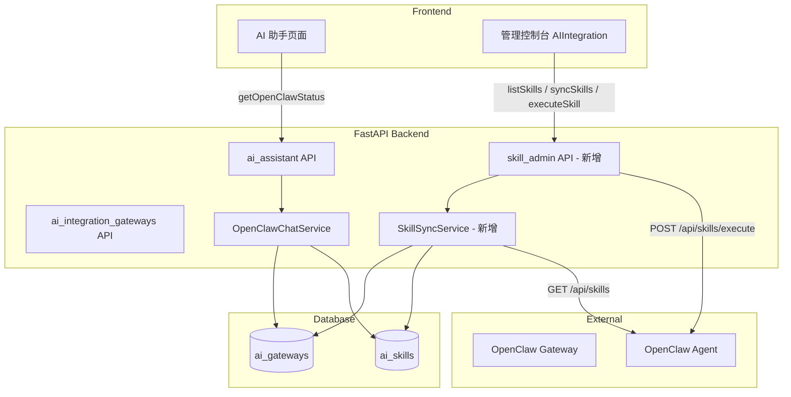
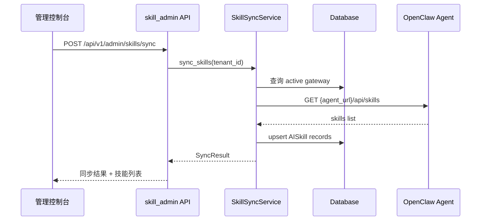
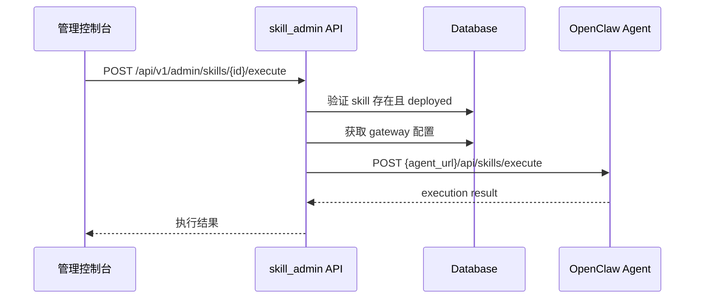

# Design Document: OpenClaw 技能端到端集成

## Overview

当前系统存在两个独立的技能数据源：AI 助手页面通过后端 `/chat/openclaw-status` 从数据库查询技能，而管理控制台的 AIIntegration 页面直接调用 Agent 服务 (`localhost:8081`)。两者数据不互通，导致管理控制台"已部署技能"始终为空。

本设计将管理控制台的技能数据源统一到后端 API，复用已有的 `AIGateway` / `AISkill` 数据库模型和 `OpenClawChatService`，使管理员能查看、同步、管理 OpenClaw 网关上的技能，并支持端到端技能执行。

## Architecture



## 主要流程

### 技能同步流程



### 技能执行流程



## Components and Interfaces

### Component 1: SkillAdminRouter (新增后端路由)

```python
# src/api/skill_admin.py
router = APIRouter(prefix="/api/v1/admin/skills", tags=["skill-admin"])

@router.get("/", response_model=SkillListResponse)
async def list_skills(tenant_id: str, db: Session) -> SkillListResponse: ...

@router.post("/sync", response_model=SyncResultResponse)
async def sync_skills(tenant_id: str, db: Session) -> SyncResultResponse: ...

@router.post("/{skill_id}/execute", response_model=ExecuteResultResponse)
async def execute_skill(skill_id: str, params: ExecuteRequest, db: Session) -> ExecuteResultResponse: ...

@router.patch("/{skill_id}/status", response_model=SkillDetailResponse)
async def toggle_skill_status(skill_id: str, body: StatusToggle, db: Session) -> SkillDetailResponse: ...
```

### Component 2: SkillSyncService (新增同步服务)

```python
# src/ai_integration/skill_sync_service.py
class SkillSyncService:
    def __init__(self, db: Session):
        self.db = db

    async def sync_from_agent(self, gateway: AIGateway) -> SyncResult:
        """从 Agent 拉取技能列表，upsert 到 ai_skills 表"""
        ...

    async def execute_skill(self, skill: AISkill, gateway: AIGateway, params: dict) -> dict:
        """通过 Agent 执行指定技能"""
        ...
```

### Component 3: 前端 skillAdminApi (新增前端 API 服务)

```typescript
// frontend/src/services/skillAdminApi.ts
export async function listSkills(): Promise<SkillListResponse> { ... }
export async function syncSkills(): Promise<SyncResultResponse> { ... }
export async function executeSkill(skillId: string, params: ExecuteRequest): Promise<ExecuteResultResponse> { ... }
export async function toggleSkillStatus(skillId: string, active: boolean): Promise<SkillDetailResponse> { ... }
```

### Component 4: AIIntegration 技能管理 Tab (修改现有组件)

将 `AIIntegration.tsx` 的技能管理 tab 从直连 Agent 改为调用后端 API，复用 `SkillInfo` 类型。

## Data Models

### 新增 Pydantic Schemas

```python
# src/ai_integration/schemas.py (扩展)
class SkillDetailResponse(BaseModel):
    id: str
    name: str
    version: str
    status: str  # pending | deployed | failed
    description: Optional[str] = None
    category: Optional[str] = None
    gateway_id: str
    gateway_name: str
    deployed_at: Optional[datetime] = None
    created_at: datetime

class SkillListResponse(BaseModel):
    skills: list[SkillDetailResponse]
    total: int

class SyncResultResponse(BaseModel):
    added: int
    updated: int
    removed: int
    skills: list[SkillDetailResponse]

class ExecuteRequest(BaseModel):
    parameters: dict = {}

class ExecuteResultResponse(BaseModel):
    success: bool
    result: Optional[dict] = None
    error: Optional[str] = None
    execution_time_ms: Optional[int] = None

class StatusToggle(BaseModel):
    status: Literal["deployed", "pending"]
```

### 前端类型扩展

```typescript
// frontend/src/types/aiAssistant.ts (扩展)
export interface SkillDetail extends SkillInfo {
  category?: string;
  gateway_id: string;
  gateway_name: string;
  deployed_at?: string;
  created_at: string;
}

export interface SyncResult {
  added: number;
  updated: number;
  removed: number;
  skills: SkillDetail[];
}

export interface ExecuteResult {
  success: boolean;
  result?: Record<string, unknown>;
  error?: string;
  execution_time_ms?: number;
}
```

## Key Functions with Formal Specifications

### Function 1: sync_from_agent()

```python
async def sync_from_agent(self, gateway: AIGateway) -> SyncResult:
```

**Preconditions:**
- `gateway` is active and type == "openclaw"
- `gateway.configuration` contains valid `agent_url`

**Postconditions:**
- DB 中 `ai_skills` 与 Agent 返回的技能列表一致
- 新技能 → INSERT，已有技能 → UPDATE version/status，Agent 中不存在 → 标记 status="removed"
- 返回 added/updated/removed 计数

### Function 2: execute_skill()

```python
async def execute_skill(self, skill: AISkill, gateway: AIGateway, params: dict) -> dict:
```

**Preconditions:**
- `skill.status == "deployed"`
- `skill.gateway_id == gateway.id`
- `gateway.status == "active"`

**Postconditions:**
- 成功时返回 `{"success": True, "result": ...}`
- Agent 不可达时返回 `{"success": False, "error": "..."}`
- 写入 `ai_audit_logs` 记录执行事件

### Function 3: list_skills() (API endpoint)

```python
async def list_skills(tenant_id: str, db: Session) -> SkillListResponse:
```

**Preconditions:**
- `tenant_id` 来自 JWT token，已认证

**Postconditions:**
- 仅返回该 tenant 下 active gateway 的技能
- 技能按 `deployed_at` 降序排列

## Example Usage

```typescript
// 管理控制台：同步并展示技能
const handleSync = async () => {
  setLoading(true);
  const result = await syncSkills();
  message.success(`同步完成：新增 ${result.added}，更新 ${result.updated}`);
  setSkills(result.skills);
  setLoading(false);
};

// 管理控制台：执行技能测试
const handleExecute = async (skillId: string) => {
  const result = await executeSkill(skillId, { parameters: { query: '测试' } });
  if (result.success) {
    Modal.info({ title: '执行结果', content: JSON.stringify(result.result) });
  } else {
    message.error(result.error);
  }
};
```

## Correctness Properties

*A property is a characteristic or behavior that should hold true across all valid executions of a system — essentially, a formal statement about what the system should do. Properties serve as the bridge between human-readable specifications and machine-verifiable correctness guarantees.*

### Property 1: 租户隔离

*For any* tenant_id and any skill returned by list_skills(tenant_id), that skill's associated gateway must have gateway.tenant_id equal to the querying tenant_id. No skill belonging to a different tenant shall ever appear in the result.

**Validates: Requirements 1.1, 2.1, 2.2**

### Property 2: 技能列表排序不变量

*For any* skill list returned by list_skills, each consecutive pair of skills (skill[i], skill[i+1]) must satisfy skill[i].deployed_at >= skill[i+1].deployed_at.

**Validates: Requirement 1.3**

### Property 3: 同步后数据库与 Agent 一致

*For any* set of skills returned by the Agent and any set of skills in the database before sync, after sync_from_agent completes: (a) every Agent skill exists in the database with status "deployed" and matching version, (b) every database skill not in the Agent response has status "removed".

**Validates: Requirements 3.2, 3.3, 3.4**

### Property 4: 同步计数准确性

*For any* sync operation, the returned SyncResult counts must satisfy: added equals the number of newly inserted records, updated equals the number of modified existing records, and removed equals the number of records marked as "removed". All counts must be non-negative.

**Validates: Requirement 3.5**

### Property 5: 非 deployed 技能执行拒绝

*For any* AISkill where skill.status is not "deployed", calling execute_skill on that skill shall be rejected with HTTP 400, and no execution request shall be forwarded to the Agent.

**Validates: Requirement 4.3**

### Property 6: 技能执行审计日志

*For any* skill execution attempt (success or failure), an AIAuditLog record with event_type "skill_execution" shall be created in the database, referencing the correct gateway_id and tenant_id.

**Validates: Requirement 4.6**

### Property 7: 状态切换生效

*For any* AISkill and any valid target status ("deployed" or "pending"), after toggle_skill_status is called, the AISkill record in the database shall have its status equal to the target status. Furthermore, skills with status "pending" shall not appear in the AI 助手页面 skill list.

**Validates: Requirements 5.1, 5.2**

## Error Handling

### 场景 1: Agent 服务不可达
**Condition**: sync 或 execute 时 Agent URL 无法连接
**Response**: 返回 HTTP 503，前端显示"Agent 服务不可用"
**Recovery**: 用户可手动重试，不影响已有 DB 数据

### 场景 2: Gateway 未配置 Agent URL
**Condition**: gateway.configuration 中缺少 agent_url
**Response**: sync 返回 400，提示配置缺失
**Recovery**: 管理员在网关配置中补充 agent_url

### 场景 3: 技能执行超时
**Condition**: Agent 执行技能超过 30s
**Response**: 返回 504，记录 audit log
**Recovery**: 前端提示超时，建议调整参数或稍后重试

## Testing Strategy

### Unit Testing
- `SkillSyncService.sync_from_agent`: mock Agent HTTP 响应，验证 upsert 逻辑
- `SkillAdminRouter`: mock service 层，验证权限和参数校验
- 租户隔离：验证 tenant_id 过滤

### Property-Based Testing (fast-check)
- 前端 `SkillDetail` 类型校验：任意 SkillDetail 对象序列化/反序列化一致
- sync 结果计数非负且 added + updated + removed <= total_agent_skills + total_db_skills

## Dependencies

- 现有模块（修改）：
  - `src/api/ai_assistant.py` — 无需修改，已有 openclaw-status
  - `frontend/src/pages/Admin/AIIntegration.tsx` — 改用后端 API
  - `frontend/src/types/aiAssistant.ts` — 扩展类型
- 新增模块：
  - `src/api/skill_admin.py` — 管理端技能 API
  - `src/ai_integration/skill_sync_service.py` — 技能同步服务
  - `frontend/src/services/skillAdminApi.ts` — 前端管理 API 服务
- 外部依赖：
  - `httpx` — 调用 Agent HTTP API（已有）
  - OpenClaw Agent — 提供 `/api/skills` 和 `/api/skills/execute`
