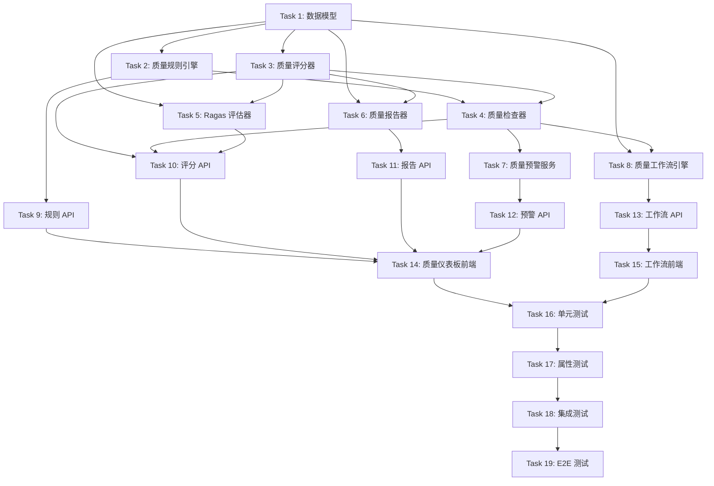

# Tasks Document: Quality Workflow (质量评分与工作流)

## Overview

本文档定义 Quality Workflow 模块的实施任务，包括多维度质量评估、自动化质量检查、质量报告生成、质量改进工作流和 Ragas 语义质量评估。

## Task Dependencies

## Tasks

### Task 1: 数据模型和数据库迁移 ✅ COMPLETED

**描述**: 创建质量管理相关的数据库模型

**依赖**: 无

**文件**:
- `src/models/quality.py`
- `alembic/versions/011_add_quality_workflow_tables.py`

**验收标准**:
- [x] 创建 QualityScore 模型（质量评分表）
- [x] 创建 QualityRule 模型（质量规则表）
- [x] 创建 QualityCheckResult 模型（检查结果表）
- [x] 创建 ImprovementTask 模型（改进任务表）
- [x] 创建 QualityAlert 模型（质量预警表）
- [x] 创建数据库迁移脚本

**对应需求**: Requirement 1, 2, 3, 5, 6

---

### Task 2: 质量规则引擎实现 ✅ COMPLETED

**描述**: 实现质量规则管理和执行功能

**依赖**: Task 1

**文件**:
- `src/quality/quality_rule_engine.py`

**验收标准**:
- [x] 实现 create_rule 方法（创建规则）
- [x] 实现 update_rule 方法（更新规则）
- [x] 实现 get_active_rules 方法（获取活跃规则）
- [x] 实现规则优先级排序
- [x] 实现规则缓存机制
- [x] 实现 create_from_template 方法（从模板创建）
- [x] 实现 get_rule_history 方法（规则版本历史）

**对应需求**: Requirement 3

---

### Task 3: 质量评分器实现 ✅ COMPLETED

**描述**: 实现多维度质量评分功能

**依赖**: Task 1

**文件**:
- `src/quality/quality_scorer.py`

**验收标准**:
- [x] 实现 score_annotation 方法（评估单个标注）
- [x] 实现准确性评分（_calculate_accuracy）
- [x] 实现完整性评分（_calculate_completeness）
- [x] 实现时效性评分（_calculate_timeliness）
- [x] 实现加权综合分数计算
- [x] 实现 calculate_consistency 方法（一致性评分）
- [x] 实现 Cohen's Kappa 和 Fleiss' Kappa 计算

**对应需求**: Requirement 1

---

### Task 4: 质量检查器实现 ✅ COMPLETED

**描述**: 实现自动化质量检查功能

**依赖**: Task 2, Task 3

**文件**:
- `src/quality/quality_checker.py`

**验收标准**:
- [x] 实现 check_annotation 方法（检查单个标注）
- [x] 实现内置规则执行（_execute_builtin_rule）
- [x] 实现自定义规则执行（_execute_custom_rule）
- [x] 实现 batch_check 方法（批量检查）
- [x] 实现问题严重程度分类
- [x] 实现检查结果记录

**对应需求**: Requirement 2

---

### Task 5: Ragas 评估器实现 ✅ COMPLETED

**描述**: 集成 Ragas 框架实现语义质量评估

**依赖**: Task 1, Task 3

**文件**:
- `src/quality/ragas_evaluator.py`

**验收标准**:
- [x] 实现 evaluate 方法（单条评估）
- [x] 实现 Faithfulness 评估（忠实度）
- [x] 实现 Answer Relevancy 评估（答案相关性）
- [x] 实现 Context Precision 评估（上下文精确度）
- [x] 实现 Context Recall 评估（上下文召回率）
- [x] 实现 batch_evaluate 方法（批量评估）

**对应需求**: Requirement 7

---

### Task 6: 质量报告器实现 ✅ COMPLETED

**描述**: 实现质量分析报告生成功能

**依赖**: Task 1, Task 3

**文件**:
- `src/quality/quality_reporter.py`

**验收标准**:
- [x] 实现 generate_project_report 方法（项目报告）
- [x] 实现 generate_annotator_ranking 方法（标注员排名）
- [x] 实现 generate_trend_report 方法（趋势报告）
- [x] 实现 export_report 方法（导出报告）
- [x] 支持 PDF、Excel、HTML 格式导出
- [x] 实现 schedule_report 方法（定时报告）

**对应需求**: Requirement 4

---

### Task 7: 质量预警服务实现 ✅ COMPLETED

**描述**: 实现质量预警和通知功能

**依赖**: Task 4

**文件**:
- `src/quality/quality_alert_service.py`

**验收标准**:
- [x] 实现 configure_thresholds 方法（配置阈值）
- [x] 实现 check_and_alert 方法（检查并预警）
- [x] 实现预警严重程度判定
- [x] 实现多渠道通知（站内、邮件、Webhook）
- [x] 实现 escalate_alert 方法（预警升级）
- [x] 实现 set_silence_period 方法（静默期）

**对应需求**: Requirement 6

---

### Task 8: 质量工作流引擎实现 ✅ COMPLETED

**描述**: 实现质量改进工作流管理功能

**依赖**: Task 1, Task 4

**文件**:
- `src/quality/quality_workflow_engine.py`

**验收标准**:
- [x] 实现 configure_workflow 方法（配置工作流）
- [x] 实现 create_improvement_task 方法（创建改进任务）
- [x] 实现任务优先级计算
- [x] 实现 submit_improvement 方法（提交改进）
- [x] 实现 review_improvement 方法（审核改进）
- [x] 实现 evaluate_improvement_effect 方法（效果评估）

**对应需求**: Requirement 5

---

### Task 9: 质量规则 API 实现 ✅ COMPLETED

**描述**: 实现质量规则管理相关的 REST API

**依赖**: Task 2

**文件**:
- `src/api/quality_rules.py`

**验收标准**:
- [x] 实现 POST /quality-rules（创建规则）
- [x] 实现 GET /quality-rules（列出规则）
- [x] 实现 PUT /quality-rules/{rule_id}（更新规则）
- [x] 实现 DELETE /quality-rules/{rule_id}（删除规则）
- [x] 实现 POST /quality-rules/from-template（从模板创建）

**对应需求**: Requirement 3

---

### Task 10: 质量评分和检查 API 实现 ✅ COMPLETED

**描述**: 实现质量评分和检查相关的 REST API

**依赖**: Task 3, Task 4, Task 5

**文件**:
- `src/api/quality.py`

**验收标准**:
- [x] 实现 POST /quality/score/{annotation_id}（评估质量）
- [x] 实现 POST /quality/consistency/{task_id}（一致性评分）
- [x] 实现 POST /quality/check/{annotation_id}（检查质量）
- [x] 实现 POST /quality/batch-check（批量检查）
- [x] 实现 POST /quality/ragas/evaluate（Ragas 评估）
- [x] 实现 POST /quality/ragas/batch-evaluate（Ragas 批量评估）

**对应需求**: Requirement 1, 2, 7

---

### Task 11: 质量报告 API 实现 ✅ COMPLETED

**描述**: 实现质量报告相关的 REST API

**依赖**: Task 6

**文件**:
- `src/api/quality_reports.py`

**验收标准**:
- [x] 实现 POST /quality-reports/project（生成项目报告）
- [x] 实现 POST /quality-reports/annotator-ranking（标注员排名）
- [x] 实现 POST /quality-reports/trend（趋势报告）
- [x] 实现 POST /quality-reports/export（导出报告）
- [x] 实现 POST /quality-reports/schedule（定时报告）

**对应需求**: Requirement 4

---

### Task 12: 质量预警 API 实现 ✅ COMPLETED

**描述**: 实现质量预警相关的 REST API

**依赖**: Task 7

**文件**:
- `src/api/quality_alerts.py`

**验收标准**:
- [x] 实现 POST /quality-alerts/configure（配置预警）
- [x] 实现 GET /quality-alerts（列出预警）
- [x] 实现 POST /quality-alerts/{alert_id}/acknowledge（确认预警）
- [x] 实现 POST /quality-alerts/{alert_id}/resolve（解决预警）
- [x] 实现 POST /quality-alerts/silence（设置静默期）

**对应需求**: Requirement 6

---

### Task 13: 质量工作流 API 实现 ✅ COMPLETED

**描述**: 实现质量工作流相关的 REST API

**依赖**: Task 8

**文件**:
- `src/api/quality_workflow.py`

**验收标准**:
- [x] 实现 POST /quality-workflow/configure（配置工作流）
- [x] 实现 POST /quality-workflow/tasks（创建改进任务）
- [x] 实现 GET /quality-workflow/tasks（列出改进任务）
- [x] 实现 POST /quality-workflow/tasks/{task_id}/submit（提交改进）
- [x] 实现 POST /quality-workflow/tasks/{task_id}/review（审核改进）

**对应需求**: Requirement 5

---

### Task 14: 质量仪表板前端实现 ✅ COMPLETED

**描述**: 实现质量仪表板和规则配置前端界面

**依赖**: Task 9, Task 10, Task 11, Task 12

**文件**:
- `frontend/src/pages/quality/QualityDashboard.tsx`
- `frontend/src/pages/quality/RuleConfig.tsx`
- `frontend/src/pages/quality/ReportViewer.tsx`
- `frontend/src/pages/quality/AlertList.tsx`
- `frontend/src/services/qualityApi.ts`

**验收标准**:
- [x] 实现质量概览仪表板（关键指标、趋势图）
- [x] 实现规则配置界面（CRUD 操作）
- [x] 实现报告查看和导出界面
- [x] 实现预警列表和处理界面
- [x] 实现 API 调用服务

**对应需求**: Requirement 8

---

### Task 15: 质量工作流前端实现 ✅ COMPLETED

**描述**: 实现质量改进工作流前端界面

**依赖**: Task 13

**文件**:
- `frontend/src/pages/quality/ImprovementTaskList.tsx`
- `frontend/src/pages/quality/ImprovementTaskDetail.tsx`
- `frontend/src/pages/quality/WorkflowConfig.tsx`
- `frontend/src/services/workflowApi.ts`

**验收标准**:
- [x] 实现改进任务列表组件
- [x] 实现改进任务详情和编辑组件
- [x] 实现工作流配置界面
- [x] 实现任务状态流转操作
- [x] 实现 API 调用服务

**对应需求**: Requirement 8

---

### Task 16: 单元测试 ✅ COMPLETED

**描述**: 编写质量管理模块的单元测试

**依赖**: Task 14, Task 15

**文件**:
- `tests/unit/test_quality_scorer.py`
- `tests/unit/test_quality_checker.py`
- `tests/unit/test_quality_rule_engine.py`
- `tests/unit/test_quality_reporter.py`
- `tests/unit/test_ragas_evaluator.py`
- `tests/unit/test_quality_workflow_engine.py`

**验收标准**:
- [x] 质量评分器单元测试（118 tests passing）
- [x] 质量检查器单元测试
- [x] 质量规则引擎单元测试
- [x] 质量报告器单元测试
- [x] Ragas 评估器单元测试
- [x] 质量工作流引擎单元测试

**对应需求**: 所有需求

---

### Task 17: 属性测试 (Property-Based Testing) ✅ COMPLETED

**描述**: 使用 Hypothesis 库编写属性测试，每个属性至少 100 次迭代

**依赖**: Task 16

**文件**:
- `tests/property/test_quality_properties.py`

**验收标准**:
- [x] Property 1: 质量分数范围（100+ 迭代）
- [x] Property 2: 规则执行确定性（100+ 迭代）
- [x] Property 3: 一致性分数对称性（100+ 迭代）
- [x] Property 4: 改进任务优先级单调性（100+ 迭代）
- [x] Property 5: 报告数据一致性（100+ 迭代）
- [x] Property 6: Ragas 评分范围（100+ 迭代）
- [x] Property 7: 预警触发一致性（100+ 迭代）

**对应需求**: 所有需求

---

### Task 18: 集成测试 ✅ COMPLETED

**描述**: 编写质量管理模块的集成测试

**依赖**: Task 17

**文件**:
- `tests/integration/test_quality_integration.py`
- `tests/integration/test_ragas_integration.py`

**验收标准**:
- [x] 质量评分和检查集成测试
- [x] 规则管理集成测试
- [x] 报告生成集成测试
- [x] 预警触发和通知集成测试
- [x] 工作流流转集成测试
- [x] Ragas 评估集成测试

**对应需求**: 所有需求

---

### Task 19: E2E 测试 ✅ COMPLETED

**描述**: 编写端到端测试验证完整功能流程

**依赖**: Task 18

**文件**:
- `frontend/e2e/quality.spec.ts`

**验收标准**:
- [x] 质量仪表板浏览 E2E 测试
- [x] 规则配置流程 E2E 测试
- [x] 报告生成和导出 E2E 测试
- [x] 预警处理流程 E2E 测试
- [x] 改进任务流程 E2E 测试
- [x] 完整质量管理工作流 E2E 测试

**对应需求**: 所有需求

---

## Summary

| Task | 描述 | 依赖 | 状态 |
|------|------|------|------|
| Task 1 | 数据模型和数据库迁移 | - | ✅ COMPLETED |
| Task 2 | 质量规则引擎实现 | Task 1 | ✅ COMPLETED |
| Task 3 | 质量评分器实现 | Task 1 | ✅ COMPLETED |
| Task 4 | 质量检查器实现 | Task 2, 3 | ✅ COMPLETED |
| Task 5 | Ragas 评估器实现 | Task 1, 3 | ✅ COMPLETED |
| Task 6 | 质量报告器实现 | Task 1, 3 | ✅ COMPLETED |
| Task 7 | 质量预警服务实现 | Task 4 | ✅ COMPLETED |
| Task 8 | 质量工作流引擎实现 | Task 1, 4 | ✅ COMPLETED |
| Task 9 | 质量规则 API 实现 | Task 2 | ✅ COMPLETED |
| Task 10 | 质量评分和检查 API 实现 | Task 3, 4, 5 | ✅ COMPLETED |
| Task 11 | 质量报告 API 实现 | Task 6 | ✅ COMPLETED |
| Task 12 | 质量预警 API 实现 | Task 7 | ✅ COMPLETED |
| Task 13 | 质量工作流 API 实现 | Task 8 | ✅ COMPLETED |
| Task 14 | 质量仪表板前端实现 | Task 9, 10, 11, 12 | ✅ COMPLETED |
| Task 15 | 质量工作流前端实现 | Task 13 | ✅ COMPLETED |
| Task 16 | 单元测试 | Task 14, 15 | ✅ COMPLETED |
| Task 17 | 属性测试 | Task 16 | ✅ COMPLETED |
| Task 18 | 集成测试 | Task 17 | ✅ COMPLETED |
| Task 19 | E2E 测试 | Task 18 | ✅ COMPLETED |

**总预估工时**: 128 小时
**完成状态**: 19/19 任务完成 (100%)

## Test Results Summary

- **Unit Tests**: 118 tests passing
- **Property Tests**: 14 tests passing (7 properties × 2 variants each)
- **Integration Tests**: 28 tests passing
- **E2E Tests**: Playwright test suite created

