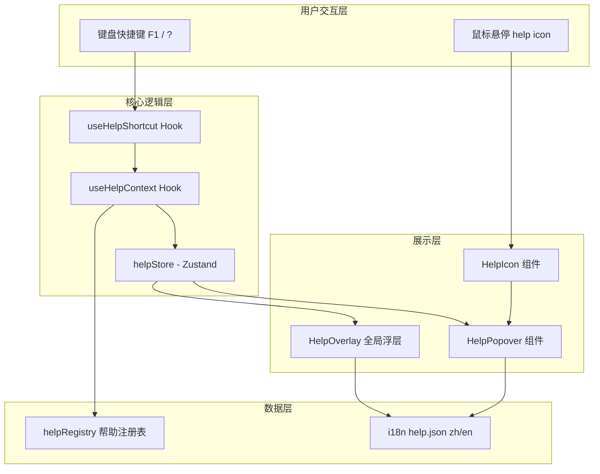
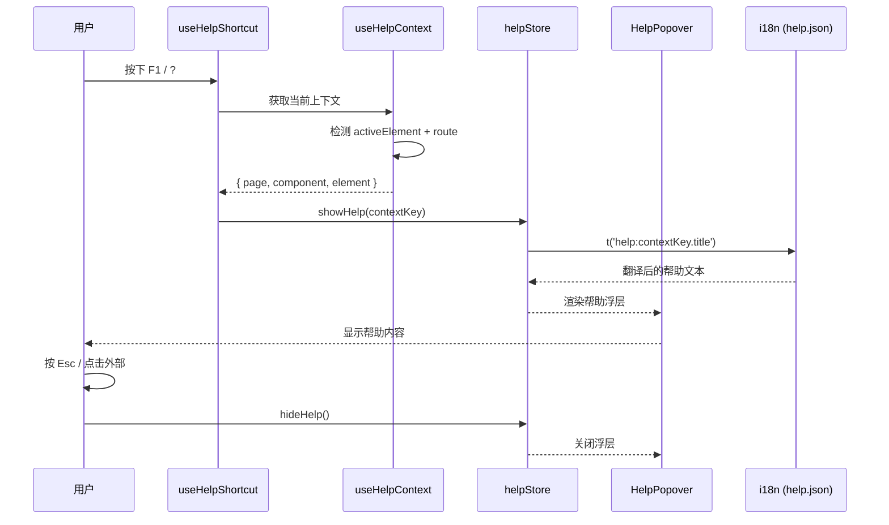

# 设计文档：智能帮助助手 (Smart Help Assistant)

## 概述

智能帮助助手是一个轻量级的上下文感知帮助系统，用户通过快捷键（F1 或 `?`）或鼠标悬停即可获取当前界面元素的即时说明。系统自动检测用户当前所在页面、聚焦的组件或输入框，并以简洁的浮层（Tooltip/Popover）展示对应的帮助内容。

帮助内容完全存储在 i18n 翻译文件中（`help.json`），支持中英文切换，跟随用户语言偏好自动适配。整体设计遵循"非侵入式"原则——不打断用户操作流程，按需显示，按需隐藏。

## 架构



## 主要工作流



## 组件与接口

### 组件 1: HelpPopover

**职责**: 展示帮助内容的浮层组件，基于 Ant Design Popover 封装。

```typescript
interface HelpPopoverProps {
  helpKey: string;           // i18n 翻译键，如 'dashboard.exportButton'
  placement?: PopoverPlacement; // 浮层位置，默认 'top'
  children: React.ReactNode; // 被包裹的目标元素
  trigger?: 'hover' | 'click'; // 触发方式，默认 'hover'
}
```

**行为**:
- 包裹目标元素，悬停或点击时显示帮助
- 自动从 `help` namespace 读取 i18n 内容
- 语言切换时实时更新内容

### 组件 2: HelpIcon

**职责**: 可选的帮助图标按钮，点击后显示帮助内容。

```typescript
interface HelpIconProps {
  helpKey: string;
  size?: 'small' | 'default';
  className?: string;
}
```

### 组件 3: HelpOverlay

**职责**: 全局帮助浮层，由快捷键触发，显示当前上下文的帮助信息。

```typescript
interface HelpOverlayProps {
  // 无需外部 props，从 helpStore 读取状态
}
```

**行为**:
- 监听 helpStore 的 `visible` 和 `currentHelpKey` 状态
- 在屏幕右下角或聚焦元素附近显示帮助卡片
- 支持 Esc 关闭
- 支持键盘导航（Tab 切换帮助内容区域）

## 数据模型

### HelpEntry（帮助条目）

```typescript
interface HelpEntry {
  title: string;        // 简短标题
  description: string;  // 详细说明
  shortcut?: string;    // 相关快捷键提示（可选）
  related?: string[];   // 关联帮助键（可选）
}
```

### HelpContext（帮助上下文）

```typescript
interface HelpContext {
  page: string;         // 当前页面路由标识，如 'dashboard'
  component?: string;   // 当前组件标识，如 'taskTable'
  element?: string;     // 当前聚焦元素标识，如 'exportButton'
}
```

**i18n 翻译文件结构** (`locales/zh/help.json`):

```json
{
  "dashboard": {
    "title": "仪表盘",
    "description": "查看项目整体数据概览和统计信息。",
    "exportButton": {
      "title": "导出数据",
      "description": "将当前仪表盘数据导出为 CSV 或 Excel 格式。",
      "shortcut": "Ctrl+E"
    }
  },
  "tasks": {
    "title": "任务管理",
    "description": "创建、分配和管理标注任务。"
  },
  "shortcuts": {
    "title": "快捷键一览",
    "toggleHelp": "F1 或 ? — 打开/关闭帮助",
    "closeHelp": "Esc — 关闭帮助",
    "navigate": "Tab — 在帮助内容间导航"
  }
}
```

### HelpRegistry（帮助注册表）

```typescript
// 静态映射：DOM data 属性 → i18n 帮助键
// 组件通过 data-help-key="dashboard.exportButton" 注册帮助
type HelpRegistry = Map<string, {
  helpKey: string;
  element?: HTMLElement;
}>;
```

**验证规则**:
- `helpKey` 必须是 `help` namespace 下的有效 i18n 键
- `page` 必须匹配路由配置中的已知页面
- 帮助内容长度：title ≤ 20 字，description ≤ 100 字


## 关键函数与形式化规格

### 函数 1: useHelpShortcut()

```typescript
function useHelpShortcut(): void
```

**前置条件:**
- 组件已挂载在 React 树中
- helpStore 已初始化

**后置条件:**
- F1 和 `?` 键被全局监听
- 按下快捷键时 helpStore.visible 状态切换
- 当焦点在 input/textarea 内时，`?` 键不触发帮助（避免干扰输入）
- 组件卸载时监听器被清理

**循环不变量:** 无循环

### 函数 2: useHelpContext()

```typescript
function useHelpContext(): HelpContext
```

**前置条件:**
- React Router 上下文可用（useLocation）
- DOM 已渲染

**后置条件:**
- 返回的 `page` 与当前路由匹配
- 如果 `document.activeElement` 有 `data-help-key` 属性，则 `element` 字段非空
- 返回值始终包含有效的 `page` 字段

**循环不变量:** 无循环

### 函数 3: resolveHelpKey()

```typescript
function resolveHelpKey(context: HelpContext): string
```

**前置条件:**
- `context.page` 是非空字符串
- `context` 是有效的 HelpContext 对象

**后置条件:**
- 返回格式为 `page.component.element` 或 `page.component` 或 `page` 的 i18n 键
- 返回的键在 help namespace 中存在（回退到页面级帮助）
- 优先级：element > component > page

**循环不变量:** 无循环

### 函数 4: helpStore (Zustand)

```typescript
interface HelpState {
  visible: boolean;
  currentHelpKey: string | null;
  position: { x: number; y: number } | null;

  showHelp: (helpKey: string, position?: { x: number; y: number }) => void;
  hideHelp: () => void;
  toggleHelp: () => void;
}
```

**showHelp 前置条件:**
- `helpKey` 是非空字符串

**showHelp 后置条件:**
- `visible` 设为 `true`
- `currentHelpKey` 设为传入的 `helpKey`
- 如果提供了 `position`，则 `position` 被更新

**hideHelp 后置条件:**
- `visible` 设为 `false`
- `currentHelpKey` 设为 `null`
- `position` 设为 `null`

## 算法伪代码

### 快捷键触发帮助算法

```typescript
// useHelpShortcut 核心逻辑
function handleKeyDown(event: KeyboardEvent): void {
  const isF1 = event.key === 'F1';
  const isQuestionMark = event.key === '?';
  
  // 卫语句：非帮助快捷键直接返回
  if (!isF1 && !isQuestionMark) return;
  
  // 卫语句：? 键在输入框内不触发
  if (isQuestionMark) {
    const tag = (event.target as HTMLElement)?.tagName;
    if (tag === 'INPUT' || tag === 'TEXTAREA' || tag === 'SELECT') return;
    const isContentEditable = (event.target as HTMLElement)?.isContentEditable;
    if (isContentEditable) return;
  }
  
  event.preventDefault();
  
  const context = resolveCurrentContext();
  const helpKey = resolveHelpKey(context);
  
  // 获取聚焦元素位置用于定位浮层
  const activeEl = document.activeElement as HTMLElement;
  const rect = activeEl?.getBoundingClientRect();
  const position = rect 
    ? { x: rect.left + rect.width / 2, y: rect.top }
    : undefined;
  
  helpStore.toggleHelp();
  if (helpStore.visible) {
    helpStore.showHelp(helpKey, position);
  }
}
```

### 上下文解析算法

```typescript
// resolveCurrentContext 核心逻辑
function resolveCurrentContext(): HelpContext {
  // Step 1: 从路由获取页面标识
  const pathname = window.location.pathname;
  const page = extractPageFromRoute(pathname);
  // 例: '/dashboard' → 'dashboard', '/tasks/123' → 'tasks'
  
  // Step 2: 从 activeElement 获取组件和元素标识
  const activeEl = document.activeElement as HTMLElement;
  const helpKey = activeEl?.closest('[data-help-key]')
    ?.getAttribute('data-help-key');
  
  if (helpKey) {
    // helpKey 格式: 'component.element' 或 'element'
    const parts = helpKey.split('.');
    return {
      page,
      component: parts.length > 1 ? parts[0] : undefined,
      element: parts.length > 1 ? parts[1] : parts[0],
    };
  }
  
  // Step 3: 回退到页面级帮助
  return { page };
}

// resolveHelpKey: 从上下文生成 i18n 键（带回退）
function resolveHelpKey(context: HelpContext): string {
  const { page, component, element } = context;
  
  // 优先级：最具体 → 最通用
  const candidates = [
    element && component ? `${page}.${component}.${element}` : null,
    component ? `${page}.${component}` : null,
    page,
  ].filter(Boolean) as string[];
  
  // 查找第一个在 i18n 中存在的键
  for (const key of candidates) {
    if (i18n.exists(`help:${key}.title`)) {
      return key;
    }
  }
  
  // 最终回退
  return page;
}
```

## 示例用法

```typescript
// 示例 1: 在按钮上添加帮助提示
import { HelpPopover } from '@/components/SmartHelp';

function DashboardPage() {
  return (
    <div>
      <HelpPopover helpKey="dashboard.exportButton">
        <Button data-help-key="dashboard.exportButton">
          导出数据
        </Button>
      </HelpPopover>
    </div>
  );
}

// 示例 2: 使用 HelpIcon 独立显示帮助
import { HelpIcon } from '@/components/SmartHelp';

function TaskForm() {
  return (
    <Form.Item label="任务名称">
      <Input data-help-key="tasks.nameInput" />
      <HelpIcon helpKey="tasks.nameInput" />
    </Form.Item>
  );
}

// 示例 3: 全局帮助浮层（在 App 根组件中挂载一次）
import { HelpOverlay } from '@/components/SmartHelp';
import { useHelpShortcut } from '@/hooks/useHelpShortcut';

function App() {
  useHelpShortcut(); // 注册全局快捷键
  
  return (
    <>
      <RouterProvider router={router} />
      <HelpOverlay />
    </>
  );
}

// 示例 4: 帮助内容跟随语言切换
// 用户切换语言后，HelpPopover 自动显示对应语言的帮助内容
// 无需额外代码，react-i18next 的 useTranslation 自动响应语言变化
```

## 正确性属性

```typescript
// 属性 1: 快捷键在输入框内不触发
// ∀ event: KeyboardEvent, 
//   event.key === '?' ∧ event.target ∈ {INPUT, TEXTAREA, SELECT, contentEditable}
//   ⟹ helpStore.visible 不变

// 属性 2: 帮助键始终解析到有效内容
// ∀ context: HelpContext,
//   resolveHelpKey(context) 返回的键 key 满足:
//   i18n.exists(`help:${key}`) === true

// 属性 3: 显示/隐藏状态一致性
// helpStore.visible === true ⟹ helpStore.currentHelpKey !== null
// helpStore.visible === false ⟹ helpStore.currentHelpKey === null

// 属性 4: 语言切换后帮助内容同步更新
// ∀ helpKey, ∀ lang ∈ {'zh', 'en'},
//   languageStore.language === lang
//   ⟹ HelpPopover 显示 help:${helpKey} 在 lang 下的翻译

// 属性 5: 组件卸载后无内存泄漏
// useHelpShortcut 卸载后，全局 keydown 监听器被移除
```

## 错误处理

### 场景 1: 帮助键不存在

**条件**: `data-help-key` 指定的键在 help.json 中不存在
**响应**: 回退到页面级帮助；如果页面级也不存在，显示通用帮助（快捷键一览）
**恢复**: 开发环境下在控制台输出警告，提示缺失的帮助键

### 场景 2: 路由无法识别

**条件**: 当前路由不在已知页面列表中
**响应**: 使用 `'general'` 作为页面标识，显示通用帮助
**恢复**: 无需恢复，通用帮助始终可用

### 场景 3: 快捷键冲突

**条件**: F1 键被浏览器或其他组件占用
**响应**: `event.preventDefault()` 阻止默认行为；如果仍被拦截，`?` 键作为备选
**恢复**: 用户可通过 HelpIcon 点击方式获取帮助

## 测试策略

### 单元测试

- `resolveHelpKey`: 测试各种上下文组合的键解析
- `useHelpShortcut`: 测试快捷键触发和输入框内屏蔽
- `helpStore`: 测试状态切换的一致性

### 属性测试 (fast-check)

**属性测试库**: fast-check

- 任意有效 HelpContext 总能解析到非空字符串
- showHelp/hideHelp 交替调用后状态始终一致
- 任意 helpKey 字符串不会导致组件崩溃

### 集成测试

- 快捷键触发 → 浮层显示 → Esc 关闭的完整流程
- 语言切换后帮助内容实时更新
- HelpPopover 包裹的元素正常交互不受影响

## 性能考量

- 全局键盘监听器使用单一事件处理器，避免每个组件重复注册
- 帮助内容通过 i18n 静态加载，无网络请求
- HelpOverlay 使用 `React.lazy` 延迟加载，不影响首屏
- `data-help-key` 属性查找使用 `closest()` 向上冒泡，O(depth) 复杂度

## 安全考量

- 帮助内容为纯文本，不渲染 HTML，防止 XSS
- `data-help-key` 值经过白名单校验，只接受 `[a-zA-Z0-9._]` 格式
- 快捷键监听不捕获密码输入框中的按键

## 依赖

- `antd` (Popover, Tooltip, Typography) — 已有依赖
- `react-i18next` (useTranslation) — 已有依赖
- `zustand` — 已有依赖
- `react-router-dom` (useLocation) — 已有依赖
- 无新增外部依赖
