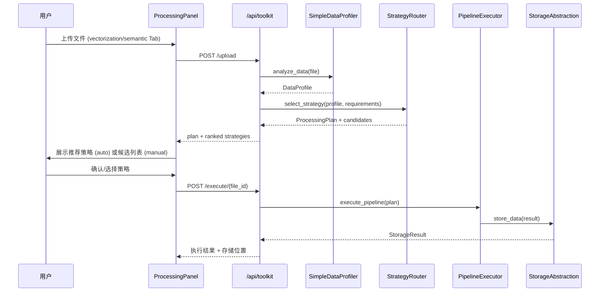

# Design Document: Smart Processing Routing

## Overview

本特性将前端向量化/语义化 Tab 的上传流程统一接入后端 Toolkit 智能路由框架，实现基于文件类型的自动策略推荐、手动覆盖、以及执行进度反馈。核心改动集中在：

1. 扩展 `/api/toolkit/route/{file_id}` 端点，接受 `origin` 参数（vectorization / semantic），自动设置 Requirements
2. 新增前端 `ProcessingPanel` 组件，展示策略推荐结果并支持 auto/manual 模式切换
3. 复用现有 `StrategyRouter.evaluate_strategies()` 返回候选策略列表
4. 保持 `/api/vectorization/jobs` 和 `/api/semantic/jobs` 不变



## Architecture

采用最小改动原则，在现有 5 层 Toolkit 架构上扩展：

| 层 | 现有组件 | 本次改动 |
|---|---------|---------|
| Profiling | SimpleDataProfiler | 无改动 |
| Routing | StrategyRouter | 扩展 `route` 端点，增加 `origin` → Requirements 映射 |
| Execution | PipelineExecutor | 无改动 |
| Storage | StorageAbstraction | 无改动 |
| API | toolkit/api/router.py | 扩展 `/route`、`/execute` 端点，增加 `origin` 和 `strategy_name` 参数 |
| Frontend | VectorizationContent / SemanticContent | 新增 ProcessingPanel、StrategySelector、StorageIndicator 组件 |

设计决策：
- 不修改 StrategyRouter 核心逻辑，仅在 API 层做 origin → Requirements 的映射
- ProcessingPanel 作为独立组件嵌入现有 Tab，不替换现有上传逻辑
- 前端使用 zustand store 管理 toolkit 状态，与现有 vectorizationStore / semanticStore 并行

## Components and Interfaces

### 后端扩展

**`/api/toolkit/route/{file_id}` 端点扩展**：

```python
# 新增参数
@router.post("/route/{file_id}")
async def route_file(
    file_id: str,
    origin: str = "vectorization",       # "vectorization" | "semantic"
    strategy_name: Optional[str] = None,  # 手动模式下用户选择的策略名
):
    # origin → Requirements 映射
    requirements = Requirements(
        needs_semantic_search=(origin == "vectorization"),
        needs_graph_traversal=(origin == "semantic"),
    )
    plan = _strategy_router.select_strategy(profile, requirements)
    candidates = _strategy_router.evaluate_strategies(profile, requirements)
    return {"plan": plan, "candidates": candidates}
```

**`/api/toolkit/execute/{file_id}` 端点扩展**：
```python
@router.post("/execute/{file_id}")
async def execute_pipeline(
    file_id: str,
    strategy_name: Optional[str] = None,  # 手动选择的策略名，None 则用 top-ranked
):
```

### 前端组件

**ProcessingPanel** (`frontend/src/components/ProcessingPanel/`):
- Props: `origin: 'vectorization' | 'semantic'`
- 状态: `mode: 'auto' | 'manual'`, `selectedStrategy`, `executionStatus`
- 调用 toolkit API 完成 upload → profile → route → execute 流程

**StrategySelector**:
- 展示 `evaluate_strategies()` 返回的候选列表（name, score, explanation）
- auto 模式下高亮 top-ranked，manual 模式下允许点选

**StorageIndicator**:
- 展示选中策略的 `primary_storage` 类型（PostgreSQL / VectorDB / GraphDB 等）

**toolkitStore** (zustand):
```typescript
interface ToolkitState {
  fileId: string | null;
  profile: DataProfile | null;
  plan: ProcessingPlan | null;
  candidates: StrategyCandidate[];
  mode: 'auto' | 'manual';
  selectedStrategy: string | null;
  executionStatus: ExecutionStatus | null;
  // actions
  uploadFile: (file: File, origin: string) => Promise<void>;
  routeFile: (origin: string) => Promise<void>;
  selectStrategy: (name: string) => void;
  executePipeline: () => Promise<void>;
  setMode: (mode: 'auto' | 'manual') => void;
}
```

## Data Models

### 新增/扩展的 API 请求/响应模型

```python
# Route 响应扩展
class RouteResponse(BaseModel):
    plan: ProcessingPlan
    candidates: list[StrategyCandidateDTO]

class StrategyCandidateDTO(BaseModel):
    name: str
    score: float
    explanation: str
    primary_storage: StorageType

# Execute 请求扩展
class ExecuteRequest(BaseModel):
    strategy_name: Optional[str] = None  # None = use top-ranked
```

### 前端 TypeScript 类型

```typescript
interface StrategyCandidate {
  name: string;
  score: number;
  explanation: string;
  primaryStorage: string;
}

interface ExecutionStatus {
  executionId: string;
  status: 'running' | 'completed' | 'failed' | 'paused';
  progress: number;
  currentStage?: string;
  error?: string;
  storageLocation?: string;
}

type ProcessingMode = 'auto' | 'manual';
```

现有模型（`ProcessingPlan`, `DataProfile`, `Requirements`, `StorageType`）无需修改，直接复用。

## Correctness Properties

*A property is a characteristic or behavior that should hold true across all valid executions of a system — essentially, a formal statement about what the system should do. Properties serve as the bridge between human-readable specifications and machine-verifiable correctness guarantees.*

### Property 1: Origin produces non-empty ranked candidates

*For any* valid file content and any origin value in {"vectorization", "semantic"}, calling the route endpoint shall return a non-empty list of candidate strategies.

**Validates: Requirements 1.1, 1.2**

### Property 2: Origin-to-Requirements mapping correctness

*For any* origin value, the generated Requirements object shall have `needs_semantic_search == (origin == "vectorization")` and `needs_graph_traversal == (origin == "semantic")`.

**Validates: Requirements 1.3, 1.4**

### Property 3: Profiler failure triggers default fallback

*For any* file that causes the DataProfiler to raise an exception, the route endpoint shall return a ProcessingPlan with `is_default_fallback == True`.

**Validates: Requirements 1.5**

### Property 4: Candidates are score-descending ordered

*For any* list of candidates returned by `evaluate_strategies()`, the scores shall be in non-increasing order (i.e., `candidates[i].score >= candidates[i+1].score` for all valid i).

**Validates: Requirements 2.2**

### Property 5: Strategy display contains all required fields

*For any* StrategyCandidateDTO returned by the route endpoint, the object shall contain non-empty `name`, a numeric `score`, non-empty `explanation`, and a valid `primary_storage` value.

**Validates: Requirements 2.1, 2.3, 2.4**

### Property 6: Manual strategy selection is honored in execution

*For any* valid strategy_name from the candidates list, when passed to the execute endpoint, the executed pipeline shall use a plan whose `strategy_name` matches the user-selected value.

**Validates: Requirements 3.3**

### Property 7: Storage type matches StorageAbstraction selection

*For any* completed pipeline execution, the storage type used shall equal the `primary_storage` of the selected strategy's StorageStrategy, which is determined by `StorageAbstraction.select_storage(profile, requirements)`.

**Validates: Requirements 6.2, 6.3**

### Property 8: Progress events contain stage name and percentage

*For any* ProgressEvent emitted during pipeline execution, the event shall contain a non-empty `stage_name` and a `progress_pct` value between 0 and 100 inclusive.

**Validates: Requirements 4.2**

### Property 9: Translation fallback for strategy names

*For any* strategy name string, if a matching translation key exists in the locale files, the display shall use the translated value; otherwise it shall fall back to the raw strategy name string (never empty or undefined).

**Validates: Requirements 5.3**

## Error Handling

| 场景 | 处理方式 |
|------|---------|
| DataProfiler 超时/异常 | 返回 default fallback plan，前端显示 warning notification |
| 无候选策略通过约束 | StrategyRouter 已有 `_create_default_plan` 兜底 |
| Pipeline 执行失败 | 返回 error + 提供 retry 按钮 |
| 文件过大 (>100MB) | 复用现有 MAX_FILE_SIZE 校验，返回 400 |
| 手动选择的 strategy_name 不在候选列表 | 返回 400 Bad Request |
| Toolkit API 网络错误 | 前端 catch 后显示 error notification，不影响现有 Tab 功能 |

## Testing Strategy

### 单元测试 (pytest)
- origin → Requirements 映射逻辑
- route 端点参数校验
- execute 端点 strategy_name 覆盖逻辑
- 前端 toolkitStore 状态管理

### 属性测试 (hypothesis)
- 每个 Correctness Property 对应一个 hypothesis 测试
- 最少 100 次迭代
- 标签格式: `Feature: smart-processing-routing, Property {N}: {title}`
- 使用 hypothesis 库的 `@given` 装饰器 + 自定义 strategy 生成 DataProfile、Requirements

### 集成测试
- 端到端: upload → profile → route → execute → verify storage
- 向后兼容: 验证 `/api/vectorization/jobs` 和 `/api/semantic/jobs` 仍正常工作

### 前端测试 (vitest)
- ProcessingPanel 组件渲染测试
- StrategySelector auto/manual 模式切换
- i18n key 完整性检查
