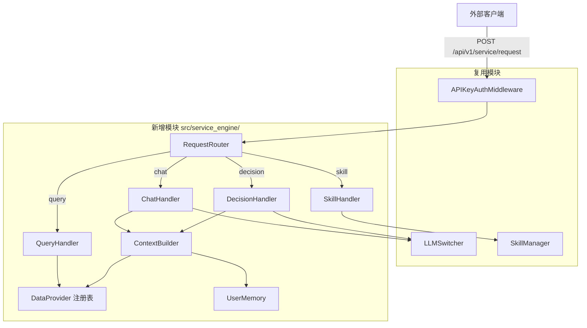

# 技术设计文档：智能服务引擎（Smart Service Engine）

## 概述

智能服务引擎通过统一入口 `POST /api/v1/service/request` 将平台的结构化数据查询、对话式分析、辅助决策和 OpenClaw 技能调用能力标准化输出。设计核心原则：**最大化复用现有模块，插件化 Handler 架构，最小改动**。

新增代码集中在 `src/service_engine/` 目录，复用现有的 API Key 认证中间件、速率限制、SkillManager、LLM 集成和 DataBridge。

## 架构



请求流程：客户端 → APIKeyAuthMiddleware（复用）→ 统一入口路由 → RequestRouter 按 `request_type` 分发 → 对应 Handler 的 `validate()` → `build_context()` → `execute()` → 统一响应格式返回。

## 组件与接口

### BaseHandler（抽象基类）

```python
class BaseHandler(ABC):
    async def validate(self, request: ServiceRequest) -> None: ...
    async def build_context(self, request: ServiceRequest) -> dict: ...
    async def execute(self, request: ServiceRequest, context: dict) -> ServiceResponse: ...
```

### RequestRouter（Handler 注册表）

通过 `dict[str, BaseHandler]` 维护 `request_type → Handler` 映射。支持动态注册/禁用，新增类型只需实现 BaseHandler 并注册。

### 四种 Handler

| Handler | 复用模块 | 核心逻辑 |
|---------|---------|---------|
| QueryHandler | DataProvider 注册表 | 按 data_type 查询，分页/排序/筛选/租户隔离 |
| ChatHandler | LLMSwitcher + ContextBuilder | SSE 流式返回，自动检索平台数据作为上下文 |
| DecisionHandler | LLMSwitcher + ContextBuilder | 结构化 JSON 报告（summary/analysis/recommendations/confidence） |
| SkillHandler | SkillManager | 白名单校验 + 技能执行 |

### DataProvider 注册表

每种 `data_type` 对应一个 DataProvider 实现，复用 `external_data_router.py` 中已有的查询逻辑（分页、排序、字段筛选、租户隔离）。

```python
class BaseDataProvider(ABC):
    async def query(self, tenant_id: str, params: QueryParams) -> PaginatedResult: ...

# 注册表
data_providers: dict[str, BaseDataProvider] = {
    "annotations": AnnotationsProvider(),
    "augmented_data": AugmentedDataProvider(),
    # ... 8 种 data_type
}
```

### ContextBuilder

组装 LLM 上下文：平台治理数据（通过 DataProvider）+ business_context + UserMemory。

### UserMemory

按 `(user_id, tenant_id)` 存储交互历史，超过 50 条时触发 LLM 总结压缩。

## 数据模型

### 新增表：user_memories

| 字段 | 类型 | 说明 |
|------|------|------|
| id | UUID PK | 主键 |
| user_id | VARCHAR(255) | 用户标识 |
| tenant_id | VARCHAR(36) | 租户隔离 |
| memory_type | VARCHAR(20) | interaction / summary |
| content | JSONB | 记忆内容 |
| created_at | TIMESTAMP | 创建时间 |

### 新增表：webhook_configs

| 字段 | 类型 | 说明 |
|------|------|------|
| id | UUID PK | 主键 |
| api_key_id | UUID FK | 关联 API Key |
| webhook_url | VARCHAR(500) | 推送地址 |
| webhook_secret | VARCHAR(255) | 签名密钥 |
| webhook_events | JSONB | 订阅事件列表 |
| enabled | BOOLEAN | 是否启用 |

### APIKeyModel 扩展字段

- `allowed_request_types`: JSONB，默认 `["query","chat","decision","skill"]`
- `skill_whitelist`: JSONB，默认 `[]`
- `webhook_config`: JSONB，预留 Webhook 配置

### 统一请求体 Schema

```python
class ServiceRequest(BaseModel):
    request_type: Literal["query", "chat", "decision", "skill"]
    user_id: str
    business_context: Optional[dict] = None  # ≤100KB
    include_memory: bool = True
    extensions: Optional[dict] = None
    # 类型特定参数
    data_type: Optional[str] = None       # query
    messages: Optional[list] = None        # chat
    question: Optional[str] = None         # decision
    context_data: Optional[dict] = None    # decision
    skill_id: Optional[str] = None         # skill
    parameters: Optional[dict] = None      # skill
    page: int = 1
    page_size: int = 50
    sort_by: Optional[str] = None
    fields: Optional[str] = None
    filters: Optional[dict] = None
```

### 统一响应体 Schema

```python
class ServiceResponse(BaseModel):
    success: bool
    request_type: str
    data: dict
    metadata: ResponseMetadata  # request_id, timestamp, processing_time_ms

class ErrorResponse(BaseModel):
    success: bool = False
    error: str
    error_code: str
    details: Optional[dict] = None
```


## 正确性属性

*属性是系统在所有有效执行中应保持为真的特征或行为——本质上是关于系统应该做什么的形式化声明。属性是人类可读规范与机器可验证正确性保证之间的桥梁。*

### 属性 1：路由正确性

*对于任意*有效的 `request_type`（query/chat/decision/skill），RequestRouter 应将请求分发到对应的 Handler 实例，且不会分发到其他 Handler。

**验证需求: 1.3, 1.4, 1.5, 1.6**

### 属性 2：无效枚举值拒绝

*对于任意*不在有效列表中的 `request_type` 或 `data_type` 字符串，系统应返回 HTTP 400 错误，且响应中包含对应的错误码（`INVALID_REQUEST_TYPE` 或 `INVALID_DATA_TYPE`）。

**验证需求: 1.7, 2.9**

### 属性 3：Scope 权限强制执行

*对于任意*请求和 API Key 组合，若 API Key 的 scopes 不包含该 `request_type`（或 query 的 `data_type`）对应的权限，系统应返回 HTTP 403 错误，包含错误码 `INSUFFICIENT_SCOPE`。

**验证需求: 2.3, 2.10, 3.9, 4.6, 5.7, 11.2, 11.3**

### 属性 4：租户隔离

*对于任意* query 请求返回的结果集，每条记录的 tenant_id 应与请求方 API Key 的 tenant_id 一致，不得包含其他租户的数据。

**验证需求: 2.8**

### 属性 5：分页默认值

*对于任意*未指定 `page` 和 `page_size` 的 query 请求，返回结果的分页元数据中 page 应为 1，page_size 应为 50。

**验证需求: 2.4**

### 属性 6：字段筛选正确性

*对于任意* query 请求指定的 `fields` 参数，返回结果中每条记录应仅包含指定的字段，不包含未指定的字段。

**验证需求: 2.6**

### 属性 7：SSE 流格式一致性

*对于任意* chat 类型请求的 SSE 响应流，所有非终止 chunk 应包含 `{"content": "...", "done": false}` 格式，且流的最后一个 chunk 应为 `{"content": "", "done": true}`。

**验证需求: 3.5, 3.6**

### 属性 8：决策响应结构完整性

*对于任意* decision 类型请求的成功响应，`data` 中应包含 `summary`、`analysis`、`recommendations`、`confidence` 四个字段，且每条 recommendation 应包含 `action`、`reason`、`priority` 三个字段。

**验证需求: 4.4, 4.5**

### 属性 9：技能白名单强制执行

*对于任意* skill 类型请求，若 `skill_id` 不在当前 API Key 的 `skill_whitelist` 中，系统应返回 HTTP 403 错误，包含错误码 `SKILL_NOT_ALLOWED`。

**验证需求: 5.2, 5.3**

### 属性 10：user_id 必传校验

*对于任意*请求类型，若请求体中缺少 `user_id` 参数，系统应返回 HTTP 400 错误，包含错误码 `MISSING_USER_ID`。

**验证需求: 6.1, 6.4**

### 属性 11：business_context 大小限制

*对于任意*请求，若 `business_context` JSON 序列化后超过 100KB，系统应拒绝该请求并返回 HTTP 400 错误。

**验证需求: 6.5**

### 属性 12：用户记忆持久化往返

*对于任意*用户交互，处理完成后应在 user_memories 表中新增一条记录，该记录的 `user_id`、`tenant_id` 与请求一致，且包含 `created_at` 时间戳。

**验证需求: 7.1, 7.3, 7.5**

### 属性 13：记忆压缩阈值

*对于任意*用户，当其记忆条目数超过 50 条时，系统应触发总结压缩，压缩后条目数应小于压缩前。

**验证需求: 7.4**

### 属性 14：include_memory 开关

*对于任意*设置 `include_memory=false` 的请求，系统不应加载历史记忆到 LLM 上下文，也不应在请求完成后追加新的记忆条目。

**验证需求: 7.6**

### 属性 15：Webhook 配置 CRUD 往返

*对于任意*有效的 Webhook 配置，创建后再读取应返回与创建时一致的 `webhook_url`、`webhook_secret` 和 `webhook_events`。

**验证需求: 8.2**

### 属性 16：统一成功响应结构

*对于任意*成功响应（非 SSE），应包含 `success=true`、`request_type`（回显）、`data` 和 `metadata`（含 `request_id`、`timestamp`、`processing_time_ms`）字段。

**验证需求: 10.2, 10.4**

### 属性 17：统一错误响应结构

*对于任意*错误响应，应包含 `success=false`、`error`、`error_code` 和 `details` 字段。

**验证需求: 10.3**

### 属性 18：动态启用/禁用 request_type

*对于任意*被禁用的 `request_type`，即使 API Key 拥有对应 scope，请求也应被拒绝。

**验证需求: 12.4**

## 错误处理

| 场景 | HTTP 状态码 | 错误码 | 处理方式 |
|------|-----------|--------|---------|
| 缺少 X-API-Key | 401 | MISSING_API_KEY | 复用现有中间件 |
| API Key 无效/过期 | 401 | INVALID_API_KEY | 复用现有中间件 |
| 速率超限 | 429 | RATE_LIMIT_EXCEEDED | 复用现有限流器，返回 Retry-After |
| 无效 request_type | 400 | INVALID_REQUEST_TYPE | Router 层校验 |
| 无效 data_type | 400 | INVALID_DATA_TYPE | QueryHandler 校验 |
| 缺少 user_id | 400 | MISSING_USER_ID | 统一入口校验 |
| business_context 超限 | 400 | CONTEXT_TOO_LARGE | 统一入口校验 |
| Scope 权限不足 | 403 | INSUFFICIENT_SCOPE | Handler validate() |
| 技能不在白名单 | 403 | SKILL_NOT_ALLOWED | SkillHandler 校验 |
| 技能不存在 | 404 | SKILL_NOT_FOUND | SkillManager 抛出 |
| LLM 不可用 | 503 | LLM_UNAVAILABLE | ChatHandler/DecisionHandler 捕获 |
| 请求超时 | 504 | REQUEST_TIMEOUT | 60 秒超时控制 |
| 内部错误 | 500 | INTERNAL_ERROR | 全局异常处理器 |

所有错误响应遵循统一的 ErrorResponse 格式。SSE 流中的错误通过 `{"error": "...", "done": true}` 传递。

## 测试策略

### 双轨测试方法

采用单元测试 + 属性测试互补策略：

- **属性测试（Hypothesis）**：验证上述 18 个正确性属性，每个属性至少运行 100 次迭代。每个属性对应一个独立的属性测试函数，标注格式：`# Feature: smart-service-engine, Property N: 属性描述`
- **单元测试（pytest）**：覆盖具体示例、边界条件和错误场景（LLM 不可用、超时、技能不存在等）

### 属性测试库

使用 **Hypothesis**（Python 属性测试库），配置 `@settings(max_examples=100)`。

### 测试重点

1. RequestRouter 路由分发正确性（属性 1、2）
2. 权限与安全（属性 3、4、9、10、11）
3. 数据查询（属性 5、6）
4. 响应格式（属性 7、8、16、17）
5. 用户记忆生命周期（属性 12、13、14）
6. CRUD 往返（属性 15）
7. 动态配置（属性 18）

### 单元测试覆盖

- SSE 流式响应端到端测试
- LLM 不可用时的 503 错误
- 60 秒超时的 504 错误
- LLM 返回非结构化内容时 confidence=0 的降级
- 现有 4 个只读端点的权限兼容性
