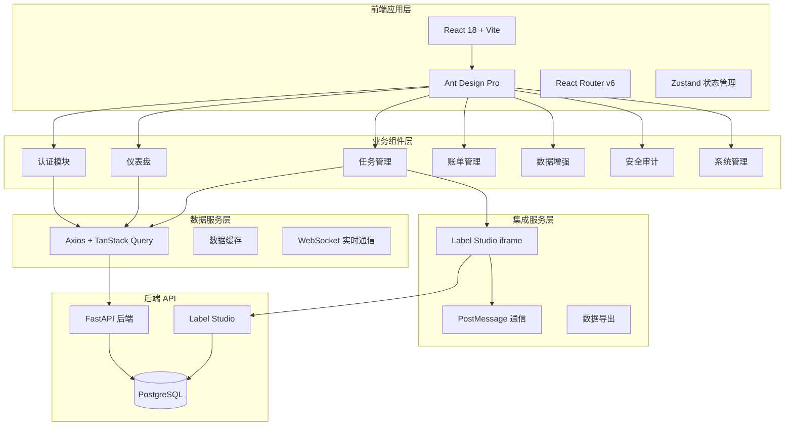

# SuperInsight 企业级管理前端 - 设计文档

## 概述

SuperInsight 企业级管理前端采用现代化的 React 18 + Ant Design Pro 技术栈，构建专业、简洁、安全的企业级数据标注管理平台。系统通过 iframe 无缝集成 Label Studio，实现标注与管理的统一体验，支持多租户隔离、实时数据更新和响应式设计。

## 架构设计

### 整体架构



### 技术栈选择

#### 前端框架
- **React 18**: 最新版本，支持并发特性和自动批处理
- **Vite**: 快速构建工具，支持热更新和 ES 模块
- **TypeScript**: 类型安全，提高代码质量和开发效率

#### UI 组件库
- **Ant Design Pro**: 企业级后台管理模板
- **Ant Design 5.x**: 现代化组件库，支持主题定制
- **Pro Components**: 高级业务组件（ProTable、ProForm 等）

#### 状态管理
- **Zustand**: 轻量级状态管理，简单易用
- **TanStack Query**: 服务端状态管理，支持缓存和同步

#### 路由和导航
- **React Router v6**: 现代化路由库
- **动态路由**: 基于权限的路由控制

#### 国际化
- **i18next**: 国际化框架，支持中英文切换
- **react-i18next**: React 集成

## 组件和接口

### 1. 认证模块 (Auth Module)

**职责**: 用户登录、注册、租户切换和权限验证

**组件设计**:
```typescript
interface AuthModule {
  // 登录组件
  LoginForm: React.FC<{
    onLogin: (credentials: LoginCredentials) => Promise<void>;
    tenants: Tenant[];
  }>;
  
  // 注册组件
  RegisterForm: React.FC<{
    onRegister: (userData: RegisterData) => Promise<void>;
  }>;
  
  // 租户切换
  TenantSelector: React.FC<{
    currentTenant: Tenant;
    tenants: Tenant[];
    onTenantChange: (tenantId: string) => void;
  }>;
  
  // 权限守卫
  PermissionGuard: React.FC<{
    permissions: string[];
    children: React.ReactNode;
  }>;
}

interface LoginCredentials {
  username: string;
  password: string;
  tenantId: string;
}

interface Tenant {
  id: string;
  name: string;
  logo?: string;
  theme?: ThemeConfig;
}
```

**API 接口**:
```typescript
interface AuthAPI {
  login(credentials: LoginCredentials): Promise<AuthResponse>;
  register(userData: RegisterData): Promise<User>;
  refreshToken(): Promise<AuthResponse>;
  logout(): Promise<void>;
  getTenants(): Promise<Tenant[]>;
  switchTenant(tenantId: string): Promise<AuthResponse>;
}
```

### 2. 仪表盘模块 (Dashboard Module)

**职责**: 显示关键指标、图表和快捷入口

**组件设计**:
```typescript
interface DashboardModule {
  // 指标卡片
  MetricCard: React.FC<{
    title: string;
    value: number | string;
    trend?: number;
    icon: React.ReactNode;
    color?: string;
  }>;
  
  // 趋势图表
  TrendChart: React.FC<{
    data: ChartData[];
    type: 'line' | 'bar' | 'area';
    timeRange: TimeRange;
  }>;
  
  // 质量分布图
  QualityDistribution: React.FC<{
    data: QualityData[];
    showLegend?: boolean;
  }>;
  
  // 快捷操作
  QuickActions: React.FC<{
    actions: QuickAction[];
    onActionClick: (actionId: string) => void;
  }>;
}

interface DashboardData {
  metrics: {
    activeTasks: number;
    todayAnnotations: number;
    totalCorpus: number;
    totalBilling: number;
  };
  trends: ChartData[];
  qualityDistribution: QualityData[];
}
```

### 3. 任务管理模块 (Task Management Module)

**职责**: 任务创建、分配、进度跟踪和 Label Studio 集成

**组件设计**:
```typescript
interface TaskModule {
  // 任务列表
  TaskList: React.FC<{
    tasks: Task[];
    onTaskSelect: (taskId: string) => void;
    onTaskCreate: () => void;
    filters: TaskFilters;
  }>;
  
  // 任务创建表单
  TaskCreateForm: React.FC<{
    onSubmit: (taskData: CreateTaskData) => Promise<void>;
    dataSources: DataSource[];
    users: User[];
  }>;
  
  // Label Studio 嵌入
  LabelStudioEmbed: React.FC<{
    projectId: string;
    taskId?: string;
    onTaskComplete: (result: AnnotationResult) => void;
  }>;
  
  // 进度跟踪
  ProgressTracker: React.FC<{
    taskId: string;
    progress: TaskProgress;
    realtime?: boolean;
  }>;
}

interface Task {
  id: string;
  name: string;
  description: string;
  status: TaskStatus;
  assignee: User;
  progress: number;
  timeSpent: number;
  createdAt: Date;
  updatedAt: Date;
}

interface CreateTaskData {
  name: string;
  description: string;
  dataSourceId: string;
  annotationType: AnnotationType;
  assigneeIds: string[];
  deadline?: Date;
}
```

**Label Studio 集成**:
```typescript
interface LabelStudioIntegration {
  // iframe 通信
  setupPostMessage(): void;
  
  // 任务同步
  syncTaskProgress(taskId: string): Promise<TaskProgress>;
  
  // 标注结果处理
  handleAnnotationComplete(result: AnnotationResult): Promise<void>;
  
  // 项目配置
  configureProject(config: ProjectConfig): Promise<void>;
}
```

### 4. 账单管理模块 (Billing Module)

**职责**: 账单查看、导出和成本分析

**组件设计**:
```typescript
interface BillingModule {
  // 账单列表
  BillList: React.FC<{
    bills: Bill[];
    onBillSelect: (billId: string) => void;
    dateRange: DateRange;
  }>;
  
  // 账单详情
  BillDetail: React.FC<{
    bill: Bill;
    onExport: (format: ExportFormat) => void;
  }>;
  
  // 工时排行榜
  TimeRanking: React.FC<{
    rankings: TimeRanking[];
    period: TimePeriod;
  }>;
  
  // 成本分析图表
  CostAnalysis: React.FC<{
    data: CostData[];
    chartType: ChartType;
  }>;
}

interface Bill {
  id: string;
  tenantId: string;
  period: string;
  totalHours: number;
  totalItems: number;
  totalAmount: number;
  details: BillDetail[];
  status: BillStatus;
}
```

### 5. 数据增强模块 (Data Augmentation Module)

**职责**: 优质样本管理和数据增强操作

**组件设计**:
```typescript
interface AugmentationModule {
  // 样本上传
  SampleUpload: React.FC<{
    onUpload: (files: File[]) => Promise<void>;
    acceptedFormats: string[];
    maxSize: number;
  }>;
  
  // 数据增强配置
  AugmentationConfig: React.FC<{
    config: AugmentationConfig;
    onConfigChange: (config: AugmentationConfig) => void;
  }>;
  
  // 数据对比预览
  DataComparison: React.FC<{
    original: DataSample[];
    augmented: DataSample[];
    showDiff?: boolean;
  }>;
  
  // 统计图表
  AugmentationStats: React.FC<{
    stats: AugmentationStats;
    chartType: 'pie' | 'bar';
  }>;
}

interface AugmentationConfig {
  fillRatio: number;
  amplificationFactor: number;
  qualityThreshold: number;
  strategies: AugmentationStrategy[];
}
```

## 数据模型

### 前端状态管理

```typescript
// 全局状态
interface GlobalState {
  // 用户状态
  auth: {
    user: User | null;
    token: string | null;
    currentTenant: Tenant | null;
    permissions: string[];
  };
  
  // UI 状态
  ui: {
    theme: 'light' | 'dark';
    language: 'zh' | 'en';
    sidebarCollapsed: boolean;
    loading: boolean;
  };
  
  // 业务状态
  business: {
    selectedTask: Task | null;
    dashboardData: DashboardData | null;
    notifications: Notification[];
  };
}

// 页面状态
interface PageState {
  // 任务页面
  tasks: {
    list: Task[];
    filters: TaskFilters;
    pagination: PaginationState;
    selectedIds: string[];
  };
  
  // 账单页面
  billing: {
    bills: Bill[];
    currentBill: Bill | null;
    dateRange: DateRange;
  };
}
```

### API 数据模型

```typescript
// 用户模型
interface User {
  id: string;
  username: string;
  email: string;
  role: UserRole;
  tenantId: string;
  avatar?: string;
  lastLoginAt: Date;
}

// 任务模型
interface Task {
  id: string;
  name: string;
  description: string;
  status: TaskStatus;
  type: AnnotationType;
  dataSource: DataSource;
  assignee: User;
  progress: TaskProgress;
  metrics: TaskMetrics;
  createdAt: Date;
  updatedAt: Date;
}

// 账单模型
interface Bill {
  id: string;
  tenantId: string;
  period: BillingPeriod;
  summary: BillSummary;
  details: BillDetail[];
  status: BillStatus;
  generatedAt: Date;
}
```

## 错误处理

### 错误分类和处理策略

1. **网络错误**
   - 连接超时: 显示重试按钮，自动重试 3 次
   - 服务不可用: 显示友好错误页面，提供联系方式
   - 请求失败: 显示具体错误信息，记录错误日志

2. **认证错误**
   - Token 过期: 自动刷新 token，失败则跳转登录页
   - 权限不足: 显示权限不足提示，隐藏相关功能
   - 租户切换失败: 回退到原租户，显示错误提示

3. **业务错误**
   - 数据验证失败: 高亮错误字段，显示验证信息
   - 操作冲突: 显示冲突提示，提供解决方案
   - 资源不存在: 显示 404 页面，提供导航链接

4. **系统错误**
   - 内存不足: 清理缓存，显示性能提示
   - 浏览器兼容性: 显示浏览器升级提示
   - JavaScript 错误: 错误边界捕获，显示错误页面

### 错误处理组件

```typescript
interface ErrorHandling {
  // 错误边界
  ErrorBoundary: React.FC<{
    fallback: React.ComponentType<ErrorInfo>;
    onError: (error: Error, errorInfo: ErrorInfo) => void;
  }>;
  
  // 网络错误处理
  NetworkErrorHandler: React.FC<{
    error: NetworkError;
    onRetry: () => void;
  }>;
  
  // 表单错误显示
  FormErrorDisplay: React.FC<{
    errors: FormErrors;
    fieldName: string;
  }>;
  
  // 全局错误提示
  GlobalErrorNotification: React.FC<{
    error: AppError;
    onDismiss: () => void;
  }>;
}
```

## 测试策略

### 单元测试

**测试范围**:
- 组件渲染和交互逻辑
- 状态管理和数据流
- 工具函数和业务逻辑
- API 调用和错误处理

**测试工具**:
- Jest 作为测试框架
- React Testing Library 用于组件测试
- MSW (Mock Service Worker) 用于 API 模拟

### 集成测试

**测试场景**:
- 用户登录和租户切换流程
- 任务创建和 Label Studio 集成
- 数据增强和导出功能
- 权限控制和安全验证

### 端到端测试

**测试工具**:
- Playwright 用于 E2E 测试
- 测试关键用户路径和业务流程
- 跨浏览器兼容性测试

### 性能测试

**测试指标**:
- 首屏加载时间 < 2 秒
- 页面切换响应时间 < 500ms
- 大数据量列表渲染性能
- 内存使用和泄漏检测

**测试工具**:
- Lighthouse 用于性能审计
- React DevTools Profiler 用于组件性能分析
- Bundle Analyzer 用于打包分析