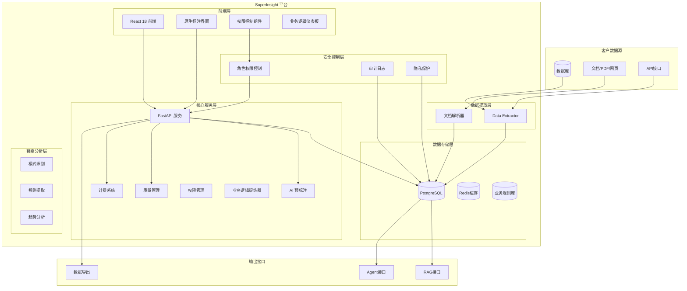
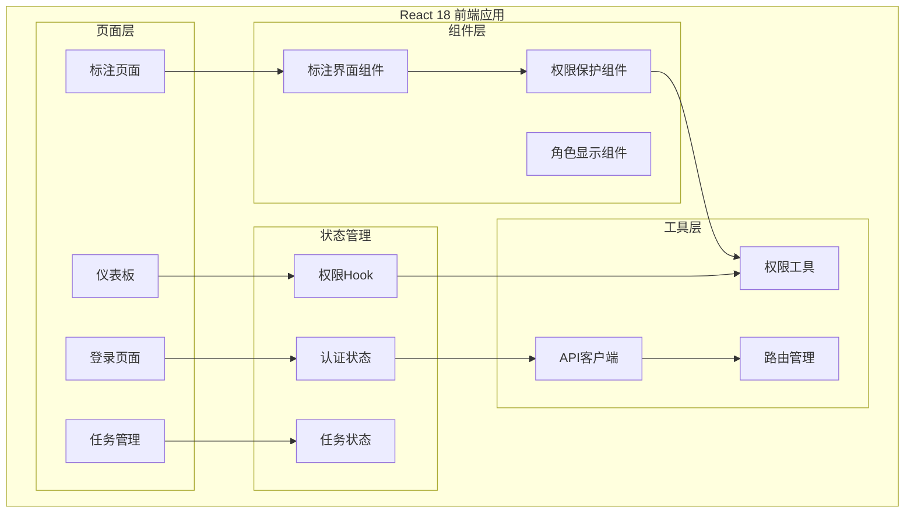

# SuperInsight AI 数据治理与标注平台 - 设计文档

## 概述

SuperInsight 平台采用现代化全栈架构，以原生标注引擎为核心，PostgreSQL 为统一数据存储，构建企业级 AI 语料治理与标注平台。平台支持腾讯云 TCB 云托管、纯私有化和混合云三种部署模式，实现"标注即治理 + 按量计费"的商业闭环。

## 架构设计

### 整体架构



### 前端架构



## 组件和接口

### 1. 原生标注引擎

**职责**: 提供完整的原生标注界面和功能

**接口设计**:
```typescript
interface AnnotationInterface {
  project: Project;
  task: Task;
  onAnnotationSave: (annotation: AnnotationData) => void;
  onAnnotationUpdate: (annotation: AnnotationData) => void;
  loading?: boolean;
}

interface AnnotationData {
  id?: number;
  result: Array<{
    value: {
      choices?: string[];
      text?: string;
      rating?: number;
    };
    from_name: string;
    to_name: string;
    type: string;
  }>;
  task: number;
}
```

**核心功能**:
- 情感分类标注
- 快速标注按钮
- 标注历史记录
- 撤销/重做功能
- 实时保存
- 进度跟踪

### 2. 权限管理系统

**职责**: 基于角色的访问控制

**接口设计**:
```typescript
enum UserRole {
  ADMIN = 'ADMIN',
  BUSINESS_EXPERT = 'BUSINESS_EXPERT', 
  ANNOTATOR = 'ANNOTATOR',
  VIEWER = 'VIEWER'
}

enum Permission {
  VIEW_ANNOTATION = 'view_annotation',
  CREATE_ANNOTATION = 'create_annotation',
  EDIT_ANNOTATION = 'edit_annotation',
  DELETE_ANNOTATION = 'delete_annotation',
  // ... 其他权限
}

interface PermissionGuardProps {
  permission?: Permission;
  permissions?: Permission[];
  requireAll?: boolean;
  fallback?: React.ReactNode;
  children: React.ReactNode;
}
```

**权限矩阵**:
- **系统管理员**: 所有权限
- **业务专家**: 查看、创建、编辑标注，管理项目
- **数据标注员**: 查看、创建、编辑标注
- **报表查看者**: 仅查看权限

### 3. 数据提取模块 (Data Extractor)

**职责**: 安全只读提取各种数据源的语料数据

**接口设计**:
```python
class DataExtractor:
    def extract_from_database(self, connection_config: DatabaseConfig) -> List[Document]
    def extract_from_files(self, file_paths: List[str]) -> List[Document]
    def extract_from_api(self, api_config: APIConfig) -> List[Document]
    def validate_connection(self, config: ConnectionConfig) -> bool
```

**安全特性**:
- 只读数据库连接
- 加密传输协议 (TLS/SSL)
- IP 白名单访问控制
- 连接超时和重试机制

### 4. 标注API服务

**职责**: 提供标注相关的后端API

**接口设计**:
```python
# 项目管理
@app.get("/api/label-studio/projects")
@app.post("/api/label-studio/projects")
@app.get("/api/label-studio/projects/{project_id}")
@app.patch("/api/label-studio/projects/{project_id}")
@app.delete("/api/label-studio/projects/{project_id}")

# 任务管理
@app.get("/api/label-studio/projects/{project_id}/tasks")
@app.post("/api/label-studio/projects/{project_id}/tasks")

# 标注管理
@app.get("/api/label-studio/projects/{project_id}/tasks/{task_id}/annotations")
@app.post("/api/label-studio/projects/{project_id}/tasks/{task_id}/annotations")
@app.patch("/api/label-studio/annotations/{annotation_id}")
@app.delete("/api/label-studio/annotations/{annotation_id}")
```

### 5. AI 预标注服务

**职责**: 提供智能预标注功能

**接口设计**:
```python
class AIAnnotator:
    def predict(self, task: Task, model_config: ModelConfig) -> Prediction
    def batch_predict(self, tasks: List[Task], model_config: ModelConfig) -> List[Prediction]
    def get_confidence_score(self, prediction: Prediction) -> float
    def update_model(self, training_data: List[Annotation]) -> ModelUpdateResult
```

**支持的模型**:
- Ollama 本地模型集成
- HuggingFace Transformers
- 自定义模型接口
- 模型版本管理

### 6. 质量管理模块

**职责**: 语义质量评估和工单管理

**接口设计**:
```python
class QualityManager:
    def evaluate_quality(self, annotations: List[Annotation]) -> QualityReport
    def create_quality_issue(self, issue: QualityIssue) -> WorkOrder
    def assign_work_order(self, order_id: str, assignee: User) -> bool
    def resolve_issue(self, order_id: str, resolution: Resolution) -> bool
```

**质量评估指标**:
- Ragas 语义评估框架
- 标注一致性检查
- 覆盖率统计
- 专家审核评分

### 7. 计费结算系统

**职责**: 工时统计和成本计算

**接口设计**:
```python
class BillingSystem:
    def track_annotation_time(self, user_id: str, task_id: str, duration: int) -> bool
    def calculate_monthly_bill(self, tenant_id: str, month: str) -> Bill
    def generate_report(self, tenant_id: str, period: DateRange) -> BillingReport
    def export_billing_data(self, tenant_id: str, format: str) -> ExportResult
```

**计费模式**:
- 按标注条数计费
- 按工时计费
- 按项目包年计费
- 混合计费模式

### 8. 业务逻辑提炼器 (Business Logic Extractor)

**职责**: 从标注数据中自动识别和提炼业务规则与模式

**接口设计**:
```python
class BusinessLogicExtractor:
    def analyze_annotation_patterns(self, annotations: List[Annotation]) -> PatternAnalysis
    def extract_business_rules(self, project_id: str, threshold: float = 0.8) -> List[BusinessRule]
    def generate_logic_visualization(self, rules: List[BusinessRule]) -> VisualizationData
    def detect_pattern_changes(self, project_id: str, time_window: DateRange) -> ChangeReport
    def calculate_rule_confidence(self, rule: BusinessRule) -> float
    def export_business_rules(self, project_id: str, format: str) -> ExportResult
    def apply_extracted_rules(self, rules: List[BusinessRule], target_project: str) -> ApplicationResult
```

**前端接口设计**:
```typescript
interface BusinessLogicDashboard {
  projectId: string;
  onRuleExtracted: (rules: BusinessRule[]) => void;
  onPatternDetected: (patterns: Pattern[]) => void;
  loading?: boolean;
}

interface BusinessRule {
  id: string;
  name: string;
  description: string;
  pattern: string;
  confidence: number;
  frequency: number;
  examples: AnnotationExample[];
  created_at: Date;
  updated_at: Date;
}

interface Pattern {
  type: 'sentiment_correlation' | 'keyword_association' | 'temporal_trend' | 'user_behavior';
  description: string;
  strength: number;
  evidence: Evidence[];
}
```

**核心功能**:
- 自动模式识别和规则提取
- 业务逻辑可视化图表
- 规则置信度评分
- 变化趋势跟踪
- 规则导出和应用
- 实时业务洞察通知
    def generate_report(self, tenant_id: str, period: DateRange) -> BillingReport
    def export_billing_data(self, tenant_id: str, format: str) -> ExportResult
```

**计费模式**:
- 按标注条数计费
- 按工时计费
- 按项目包年计费
- 混合计费模式

## 数据模型

### 核心数据结构

```python
# 文档模型
class Document:
    id: str
    source_type: str  # database, file, api
    source_config: dict
    content: str
    metadata: dict
    created_at: datetime
    updated_at: datetime

# 标注任务模型
class Task:
    id: str
    document_id: str
    project_id: str
    status: str  # pending, in_progress, completed, reviewed
    annotations: List[Annotation]
    ai_predictions: List[Prediction]
    quality_score: float
    created_at: datetime

# 标注结果模型
class Annotation:
    id: str
    task_id: str
    annotator_id: str
    annotation_data: dict
    confidence: float
    time_spent: int  # seconds
    created_at: datetime

# 用户权限模型
class UserPermission:
    user_id: str
    role: UserRole
    permissions: List[Permission]
    tenant_id: str
    created_at: datetime
    updated_at: datetime

# 质量工单模型
class QualityIssue:
    id: str
    task_id: str
    issue_type: str
    description: str
    severity: str
    status: str
    assignee_id: str
    created_at: datetime
    resolved_at: datetime

# 业务规则模型
class BusinessRule:
    id: str
    project_id: str
    name: str
    description: str
    pattern: str
    rule_type: str  # sentiment_rule, keyword_rule, temporal_rule, behavioral_rule
    confidence: float
    frequency: int
    examples: List[dict]
    is_active: bool
    created_at: datetime
    updated_at: datetime

# 业务模式模型
class BusinessPattern:
    id: str
    project_id: str
    pattern_type: str
    description: str
    strength: float
    evidence: List[dict]
    detected_at: datetime
    last_seen: datetime

# 业务洞察模型
class BusinessInsight:
    id: str
    project_id: str
    insight_type: str
    title: str
    description: str
    impact_score: float
    recommendations: List[str]
    data_points: List[dict]
    created_at: datetime
    acknowledged_at: datetime
```

### PostgreSQL 数据库设计

```sql
-- 文档表
CREATE TABLE documents (
    id UUID PRIMARY KEY DEFAULT gen_random_uuid(),
    source_type VARCHAR(50) NOT NULL,
    source_config JSONB NOT NULL,
    content TEXT NOT NULL,
    metadata JSONB DEFAULT '{}',
    created_at TIMESTAMP DEFAULT NOW(),
    updated_at TIMESTAMP DEFAULT NOW()
);

-- 创建 GIN 索引优化 JSONB 查询
CREATE INDEX idx_documents_metadata ON documents USING GIN (metadata);
CREATE INDEX idx_documents_source_config ON documents USING GIN (source_config);

-- 标注任务表
CREATE TABLE tasks (
    id UUID PRIMARY KEY DEFAULT gen_random_uuid(),
    document_id UUID REFERENCES documents(id),
    project_id VARCHAR(100) NOT NULL,
    status VARCHAR(20) DEFAULT 'pending',
    annotations JSONB DEFAULT '[]',
    ai_predictions JSONB DEFAULT '[]',
    quality_score FLOAT DEFAULT 0.0,
    created_at TIMESTAMP DEFAULT NOW()
);

-- 用户权限表
CREATE TABLE user_permissions (
    id UUID PRIMARY KEY DEFAULT gen_random_uuid(),
    user_id VARCHAR(100) NOT NULL,
    role VARCHAR(50) NOT NULL,
    permissions JSONB DEFAULT '[]',
    tenant_id VARCHAR(100) NOT NULL,
    created_at TIMESTAMP DEFAULT NOW(),
    updated_at TIMESTAMP DEFAULT NOW()
);

-- 计费记录表
CREATE TABLE billing_records (
    id UUID PRIMARY KEY DEFAULT gen_random_uuid(),
    tenant_id VARCHAR(100) NOT NULL,
    user_id VARCHAR(100) NOT NULL,
    task_id UUID REFERENCES tasks(id),
    annotation_count INTEGER DEFAULT 0,
    time_spent INTEGER DEFAULT 0,
    cost DECIMAL(10,2) DEFAULT 0.00,
    billing_date DATE DEFAULT CURRENT_DATE
);

-- 质量工单表
CREATE TABLE quality_issues (
    id UUID PRIMARY KEY DEFAULT gen_random_uuid(),
    task_id UUID REFERENCES tasks(id),
    issue_type VARCHAR(50) NOT NULL,
    description TEXT,
    severity VARCHAR(20) DEFAULT 'medium',
    status VARCHAR(20) DEFAULT 'open',
    assignee_id VARCHAR(100),
    created_at TIMESTAMP DEFAULT NOW(),
    resolved_at TIMESTAMP
);

-- 业务规则表
CREATE TABLE business_rules (
    id UUID PRIMARY KEY DEFAULT gen_random_uuid(),
    project_id VARCHAR(100) NOT NULL,
    name VARCHAR(200) NOT NULL,
    description TEXT,
    pattern TEXT NOT NULL,
    rule_type VARCHAR(50) NOT NULL,
    confidence FLOAT DEFAULT 0.0,
    frequency INTEGER DEFAULT 0,
    examples JSONB DEFAULT '[]',
    is_active BOOLEAN DEFAULT true,
    created_at TIMESTAMP DEFAULT NOW(),
    updated_at TIMESTAMP DEFAULT NOW()
);

-- 业务模式表
CREATE TABLE business_patterns (
    id UUID PRIMARY KEY DEFAULT gen_random_uuid(),
    project_id VARCHAR(100) NOT NULL,
    pattern_type VARCHAR(50) NOT NULL,
    description TEXT,
    strength FLOAT DEFAULT 0.0,
    evidence JSONB DEFAULT '[]',
    detected_at TIMESTAMP DEFAULT NOW(),
    last_seen TIMESTAMP DEFAULT NOW()
);

-- 业务洞察表
CREATE TABLE business_insights (
    id UUID PRIMARY KEY DEFAULT gen_random_uuid(),
    project_id VARCHAR(100) NOT NULL,
    insight_type VARCHAR(50) NOT NULL,
    title VARCHAR(200) NOT NULL,
    description TEXT,
    impact_score FLOAT DEFAULT 0.0,
    recommendations JSONB DEFAULT '[]',
    data_points JSONB DEFAULT '[]',
    created_at TIMESTAMP DEFAULT NOW(),
    acknowledged_at TIMESTAMP
);

-- 创建业务逻辑相关索引
CREATE INDEX idx_business_rules_project ON business_rules(project_id);
CREATE INDEX idx_business_rules_type ON business_rules(rule_type);
CREATE INDEX idx_business_patterns_project ON business_patterns(project_id);
CREATE INDEX idx_business_insights_project ON business_insights(project_id);
CREATE INDEX idx_business_insights_type ON business_insights(insight_type);
```

## 正确性属性

*属性是一个特征或行为，应该在系统的所有有效执行中保持为真——本质上是关于系统应该做什么的正式声明。属性作为人类可读规范和机器可验证正确性保证之间的桥梁。*

### 属性 1: 权限传递一致性
*对于任何*用户和权限设置，如果用户有权限访问项目，且项目包含任务，则用户应该有权限访问该任务
**验证: 需求 4.2, 4.3, 4.4, 4.5**

### 属性 2: 标注数据完整性
*对于任何*标注操作，保存后再读取的标注数据应该与原始数据完全一致
**验证: 需求 3.5**

### 属性 3: 角色权限单调性
*对于任何*用户角色升级，新角色的权限应该包含原角色的所有权限
**验证: 需求 4.1, 4.2, 4.3, 4.4, 4.5**

### 属性 4: 标注进度单调性
*对于任何*标注任务，完成标注的数量应该单调递增，不会减少
**验证: 需求 3.5, 3.6**

### 属性 5: 权限检查幂等性
*对于任何*用户和权限，多次检查相同权限应该返回相同结果
**验证: 需求 4.6, 4.7**

### 属性 6: 数据导出一致性
*对于任何*标注项目，导出后再导入的数据应该与原始项目数据保持一致
**验证: 需求 8.1, 8.2, 8.3**

### 属性 7: AI 预标注置信度范围
*对于任何*AI 预标注结果，置信度分数应该在 0.0 到 1.0 之间
**验证: 需求 5.5**

### 属性 8: 多租户数据隔离
*对于任何*两个不同的租户，一个租户不应该能够访问另一个租户的任何数据
**验证: 需求 9.4, 10.1**

### 属性 9: 标注历史记录完整性
*对于任何*标注修改操作，历史记录应该保留所有变更的完整轨迹
**验证: 需求 3.4**

### 属性 10: 快速标注一致性
*对于任何*快速标注操作，结果应该与手动选择相同选项的结果一致
**验证: 需求 3.2**

### 属性 11: 业务规则置信度单调性
*对于任何*业务规则，随着支持数据的增加，置信度应该单调递增或保持稳定
**验证: 需求 13.6**

### 属性 12: 业务模式检测一致性
*对于任何*相同的标注数据集，多次运行模式检测应该产生一致的结果
**验证: 需求 13.1, 13.2**

### 属性 13: 业务逻辑变化追踪完整性
*对于任何*业务逻辑的变化，系统应该完整记录变化的时间、内容和影响范围
**验证: 需求 13.7**

## 错误处理

### 错误分类和处理策略

1. **权限错误**
   - 权限不足: 显示友好提示，引导用户联系管理员
   - 角色验证失败: 重新登录或刷新权限
   - 权限检查超时: 使用缓存权限，异步更新

2. **标注服务错误**
   - 标注保存失败: 本地缓存，自动重试
   - 网络连接错误: 离线模式，数据同步
   - 数据格式错误: 验证输入，提示用户修正

3. **AI 预标注错误**
   - 模型服务不可用: 降级到人工标注
   - 预标注超时: 跳过预标注，直接人工标注
   - 置信度计算错误: 使用默认置信度

4. **质量检查错误**
   - 评估服务超时: 使用默认质量分数
   - 规则引擎错误: 记录异常，人工审核
   - 工单系统错误: 邮件通知备份

5. **业务逻辑提炼错误**
   - 模式识别失败: 降级到基础统计分析
   - 规则提取超时: 使用增量处理模式
   - 置信度计算错误: 使用保守的默认值
   - 可视化生成失败: 提供文本格式的分析结果
   - 规则引擎错误: 记录异常，人工审核
   - 工单系统错误: 邮件通知备份

### 错误恢复机制

```python
class ErrorHandler:
    def handle_permission_error(self, error: PermissionError) -> RecoveryAction
    def handle_annotation_error(self, error: AnnotationError) -> RecoveryAction
    def handle_ai_error(self, error: AIError) -> RecoveryAction
    def handle_quality_error(self, error: QualityError) -> RecoveryAction
    
    def log_error(self, error: Exception, context: dict) -> None
    def notify_admin(self, error: CriticalError) -> None
    def trigger_recovery(self, recovery_action: RecoveryAction) -> bool
```

## 测试策略

### 单元测试

**测试范围**:
- 权限检查逻辑的各种角色和权限组合
- 标注界面组件的交互逻辑
- AI 预标注的模型推理逻辑
- 质量评估算法的准确性
- 计费计算的正确性

**测试工具**:
- Jest + React Testing Library (前端)
- pytest 作为测试框架 (后端)
- pytest-mock 用于模拟外部依赖
- pytest-cov 用于代码覆盖率统计

### 属性测试

**测试库**: 
- Hypothesis (Python后端)
- fast-check (TypeScript前端)

**测试配置**: 每个属性测试运行最少 100 次迭代

**前端属性测试用例**:

#### 属性 1: 权限检查一致性
*对于任何*用户角色和权限组合，权限检查结果应该与权限矩阵定义一致
**验证: 需求 4.1-4.7**

#### 属性 2: 标注界面状态一致性
*对于任何*标注操作序列，界面状态应该正确反映当前的标注进度和结果
**验证: 需求 3.1-3.6**

#### 属性 3: 快速标注等价性
*对于任何*情感分类选项，快速标注按钮的结果应该等价于手动选择的结果
**验证: 需求 3.2**

**后端属性测试用例**:

#### 属性 4: 数据提取幂等性
*对于任何*有效的数据源配置，多次提取相同数据应该产生相同的结果
**验证: 需求 1.1, 1.5**

#### 属性 5: 标注数据完整性
*对于任何*标注任务，保存后再读取的标注数据应该与原始数据完全一致
**验证: 需求 3.5**

#### 属性 6: 质量评分单调性
*对于任何*标注结果，增加正确标注的数量应该不会降低整体质量评分
**验证: 需求 6.4**

#### 属性 7: 计费累加性
*对于任何*用户在任何时间段内的标注工作，总计费应该等于各个任务计费的累加
**验证: 需求 9.1, 9.2**

#### 属性 8: 多租户数据隔离
*对于任何*两个不同的租户，一个租户不应该能够访问另一个租户的任何数据
**验证: 需求 9.4, 10.1**

### 集成测试

**测试场景**:
- 前后端权限系统集成
- 标注界面与后端API的数据同步
- AI 预标注与人工标注的协作流程
- 质量工单的完整生命周期
- 多部署模式的功能一致性

**测试环境**:
- Docker Compose 测试环境
- 模拟的腾讯云 TCB 环境
- 真实的前后端集成环境

### 性能测试

**测试指标**:
- 标注界面响应时间: < 1 秒
- 权限检查性能: < 100ms
- 批量标注处理: > 1000 条/分钟
- 并发用户支持: > 100 用户同时在线
- 数据导出性能: > 10000 条记录/分钟

**测试工具**:
- Lighthouse (前端性能)
- Locust 用于负载测试
- PostgreSQL 性能监控
- React DevTools Profiler