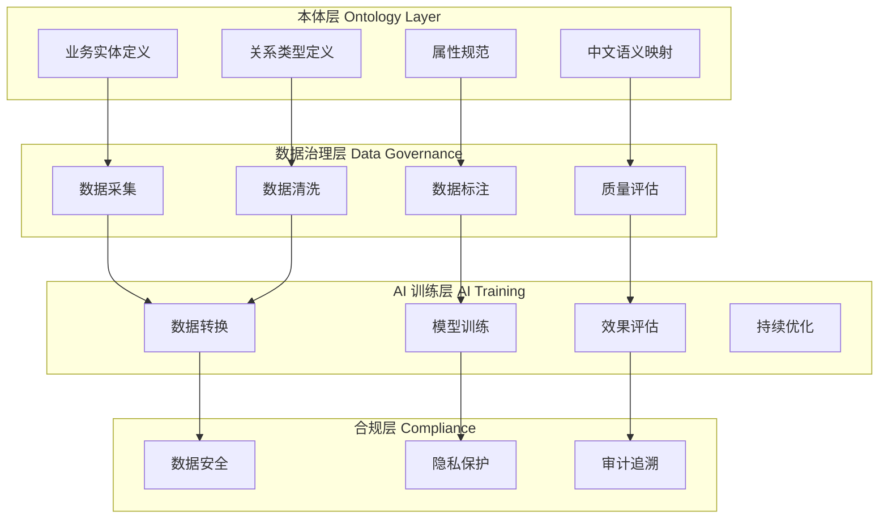
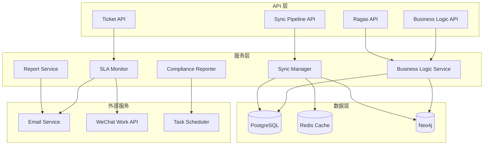
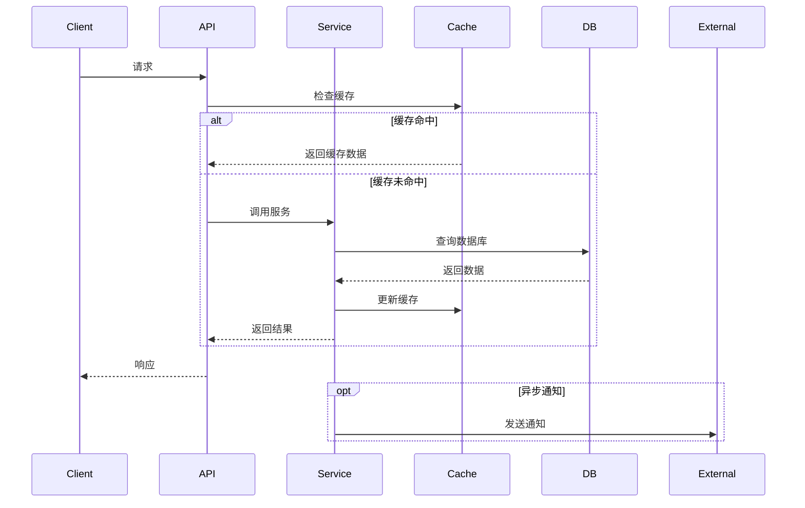
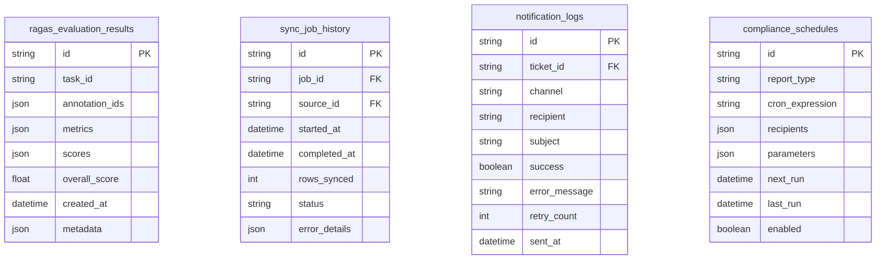

# 设计文档

## 概述

本设计文档描述了 SuperInsight 平台系统优化的技术实现方案。优化工作分为四个主要领域：

1. **TODO 完成** - 实现 7 个模块中未完成的功能代码
2. **性能优化** - Redis 缓存策略和数据库查询优化
3. **代码质量** - 错误处理、日志记录和测试覆盖
4. **功能增强** - 监控告警和安全控制

设计遵循现有架构模式，使用 FastAPI + SQLAlchemy 后端和 React + TypeScript 前端。

### 设计理念：Palantir 本体论与中国企业数据特色融合

本优化设计融合 Palantir Foundry 的本体论（Ontology）思想，结合中国企业内部数据特色，构建企业级 AI 友好型数据治理平台：

#### 核心理念

1. **语义本体层（Semantic Ontology Layer）**
   - 将企业数据抽象为统一的本体模型
   - 定义实体（Entity）、关系（Relationship）、属性（Property）的语义规范
   - 支持中文语义理解和业务术语映射

2. **数据血缘与溯源（Data Lineage & Provenance）**
   - 完整记录数据从采集到标注到训练的全生命周期
   - 支持数据质量问题的根因追溯
   - 符合中国数据安全法和个人信息保护法要求

3. **AI 友好型数据组织**
   - 标注数据自动转换为 LLM 训练格式
   - 支持多模态数据的统一管理
   - 内置数据增强和质量评估

4. **中国企业特色适配**
   - 支持中文 NLP 和多方言处理
   - 集成国产大模型（通义千问、文心一言、智谱 ChatGLM）
   - 符合等保 2.0 和数据出境安全评估要求



#### 本体模型设计

本体模型设计与现有知识图谱模块（`src/knowledge_graph/`）和数据血缘模块（`src/lineage/`）深度融合：

```python
# src/ontology/enterprise_ontology.py
"""
企业数据本体模型 - 与现有知识图谱模块融合
"""
from enum import Enum
from typing import Dict, Any, List, Optional
from datetime import datetime
from uuid import UUID, uuid4
from pydantic import BaseModel, Field

from src.knowledge_graph.core.models import (
    Entity, Relation, EntityType, RelationType
)
from src.lineage import EnhancedLineageTracker


class ChineseEntityType(str, Enum):
    """中国企业特色实体类型扩展"""
    # 继承基础类型
    PERSON = "person"
    ORGANIZATION = "organization"
    DOCUMENT = "document"
    
    # 中国企业特色类型
    DEPARTMENT = "department"          # 部门
    BUSINESS_UNIT = "business_unit"    # 业务单元
    REGULATION = "regulation"          # 法规政策
    CONTRACT = "contract"              # 合同
    APPROVAL = "approval"              # 审批流程
    SEAL = "seal"                      # 印章
    INVOICE = "invoice"                # 发票
    CERTIFICATE = "certificate"        # 资质证书


class ChineseRelationType(str, Enum):
    """中国企业特色关系类型扩展"""
    # 继承基础类型
    BELONGS_TO = "belongs_to"
    CREATED_BY = "created_by"
    
    # 中国企业特色关系
    REPORTS_TO = "reports_to"          # 汇报关系
    APPROVES = "approves"              # 审批关系
    SEALS = "seals"                    # 用印关系
    COMPLIES_WITH = "complies_with"    # 合规关系
    SUPERVISES = "supervises"          # 监管关系
    DELEGATES_TO = "delegates_to"      # 授权关系


class OntologyEntity(Entity):
    """
    本体实体 - 扩展知识图谱 Entity
    增加中文语义和业务属性
    """
    # 中文语义
    name_zh: str = Field(..., description="中文名称")
    description_zh: Optional[str] = Field(None, description="中文描述")
    aliases_zh: List[str] = Field(default_factory=list, description="中文别名")
    
    # 业务分类
    business_domain: Optional[str] = Field(None, description="业务领域")
    data_classification: Optional[str] = Field(None, description="数据分类等级")
    sensitivity_level: Optional[str] = Field(None, description="敏感度等级")
    
    # 合规属性
    retention_period_days: Optional[int] = Field(None, description="保留期限（天）")
    cross_border_allowed: bool = Field(default=True, description="是否允许跨境传输")
    pii_fields: List[str] = Field(default_factory=list, description="个人信息字段")
    
    # 数据血缘
    lineage_id: Optional[str] = Field(None, description="血缘追踪ID")
    upstream_sources: List[str] = Field(default_factory=list, description="上游数据源")
    downstream_targets: List[str] = Field(default_factory=list, description="下游目标")
    
    def to_knowledge_graph_entity(self) -> Entity:
        """转换为知识图谱实体"""
        return Entity(
            id=self.id,
            entity_type=EntityType(self.entity_type.value) if isinstance(self.entity_type, ChineseEntityType) else self.entity_type,
            name=self.name,
            properties={
                **self.properties,
                "name_zh": self.name_zh,
                "description_zh": self.description_zh,
                "business_domain": self.business_domain,
                "data_classification": self.data_classification,
                "sensitivity_level": self.sensitivity_level,
            },
            aliases=self.aliases + self.aliases_zh,
            description=self.description,
            confidence=self.confidence,
            tenant_id=self.tenant_id,
        )


class OntologyRelation(Relation):
    """
    本体关系 - 扩展知识图谱 Relation
    增加业务语义和合规属性
    """
    # 中文语义
    name_zh: Optional[str] = Field(None, description="关系中文名称")
    description_zh: Optional[str] = Field(None, description="关系中文描述")
    
    # 业务属性
    business_rule: Optional[str] = Field(None, description="关联的业务规则")
    approval_required: bool = Field(default=False, description="是否需要审批")
    audit_required: bool = Field(default=True, description="是否需要审计")
    
    # 时效性
    effective_date: Optional[datetime] = Field(None, description="生效日期")
    expiry_date: Optional[datetime] = Field(None, description="失效日期")


class DataLineageNode(BaseModel):
    """
    数据血缘节点 - 与 EnhancedLineageTracker 集成
    """
    id: UUID = Field(default_factory=uuid4)
    entity_id: UUID = Field(..., description="关联的本体实体ID")
    node_type: str = Field(..., description="节点类型: source/transform/target")
    
    # 数据源信息
    source_system: Optional[str] = Field(None, description="源系统")
    source_table: Optional[str] = Field(None, description="源表")
    source_column: Optional[str] = Field(None, description="源字段")
    
    # 转换信息
    transformation_type: Optional[str] = Field(None, description="转换类型")
    transformation_logic: Optional[str] = Field(None, description="转换逻辑")
    
    # 质量信息
    quality_score: Optional[float] = Field(None, description="数据质量分数")
    last_quality_check: Optional[datetime] = Field(None, description="最后质量检查时间")
    
    # 审计信息
    created_at: datetime = Field(default_factory=datetime.now)
    created_by: Optional[str] = Field(None)


class EnterpriseOntologyManager:
    """
    企业本体管理器 - 统一管理本体模型
    """
    
    def __init__(
        self,
        knowledge_graph_db,  # Neo4j 连接
        lineage_tracker: EnhancedLineageTracker,
    ):
        self.kg_db = knowledge_graph_db
        self.lineage_tracker = lineage_tracker
        self._entity_cache: Dict[UUID, OntologyEntity] = {}
    
    async def create_entity(
        self,
        entity: OntologyEntity,
        track_lineage: bool = True
    ) -> OntologyEntity:
        """创建本体实体，同时更新知识图谱和血缘"""
        # 保存到知识图谱
        kg_entity = entity.to_knowledge_graph_entity()
        await self.kg_db.create_entity(kg_entity)
        
        # 追踪血缘
        if track_lineage and entity.upstream_sources:
            lineage_node = DataLineageNode(
                entity_id=entity.id,
                node_type="transform",
                source_system=entity.upstream_sources[0] if entity.upstream_sources else None,
            )
            await self.lineage_tracker.track_transformation(
                source_ids=entity.upstream_sources,
                target_id=str(entity.id),
                transformation_type="ontology_mapping"
            )
        
        self._entity_cache[entity.id] = entity
        return entity
    
    async def create_relation(
        self,
        relation: OntologyRelation,
        audit_log: bool = True
    ) -> OntologyRelation:
        """创建本体关系，支持审计日志"""
        # 保存到知识图谱
        await self.kg_db.create_relation(relation)
        
        # 审计日志
        if audit_log and relation.audit_required:
            await self._log_relation_audit(relation)
        
        return relation
    
    async def get_entity_lineage(
        self,
        entity_id: UUID,
        direction: str = "both",  # upstream/downstream/both
        max_depth: int = 5
    ) -> Dict[str, Any]:
        """获取实体的完整数据血缘"""
        return await self.lineage_tracker.get_lineage(
            node_id=str(entity_id),
            direction=direction,
            max_depth=max_depth
        )
    
    async def validate_compliance(
        self,
        entity: OntologyEntity
    ) -> Dict[str, Any]:
        """验证实体的合规性"""
        issues = []
        
        # 检查数据分类
        if not entity.data_classification:
            issues.append({
                "type": "missing_classification",
                "message": "缺少数据分类等级",
                "severity": "warning"
            })
        
        # 检查跨境传输
        if not entity.cross_border_allowed and entity.downstream_targets:
            for target in entity.downstream_targets:
                if self._is_cross_border_target(target):
                    issues.append({
                        "type": "cross_border_violation",
                        "message": f"数据不允许跨境传输到 {target}",
                        "severity": "error"
                    })
        
        # 检查个人信息保护
        if entity.pii_fields and entity.sensitivity_level != "high":
            issues.append({
                "type": "pii_sensitivity_mismatch",
                "message": "包含个人信息但敏感度等级不是高",
                "severity": "warning"
            })
        
        return {
            "entity_id": str(entity.id),
            "compliant": len([i for i in issues if i["severity"] == "error"]) == 0,
            "issues": issues
        }
    
    def _is_cross_border_target(self, target: str) -> bool:
        """检查目标是否为跨境"""
        # 简化实现，实际应检查目标系统的地理位置
        cross_border_keywords = ["aws", "azure", "gcp", "overseas", "foreign"]
        return any(kw in target.lower() for kw in cross_border_keywords)
    
    async def _log_relation_audit(self, relation: OntologyRelation):
        """记录关系审计日志"""
        # 集成现有审计系统
        pass
```

#### AI 友好型数据转换

```python
# src/ontology/ai_data_converter.py
"""
AI 友好型数据转换器 - 将标注数据转换为 LLM 训练格式
"""
from typing import List, Dict, Any, Optional
from enum import Enum
from pydantic import BaseModel, Field


class AIDataFormat(str, Enum):
    """AI 训练数据格式"""
    ALPACA = "alpaca"           # Alpaca 格式
    SHAREGPT = "sharegpt"       # ShareGPT 格式
    OPENAI = "openai"           # OpenAI 微调格式
    LLAMA_FACTORY = "llama_factory"  # LLaMA-Factory 格式
    CUSTOM = "custom"           # 自定义格式


class AIDataConverter:
    """AI 数据转换器"""
    
    def __init__(self, ontology_manager: EnterpriseOntologyManager):
        self.ontology_manager = ontology_manager
    
    async def convert_annotations_to_training_data(
        self,
        annotations: List[Dict[str, Any]],
        output_format: AIDataFormat,
        include_lineage: bool = True
    ) -> List[Dict[str, Any]]:
        """将标注数据转换为 AI 训练格式"""
        
        if output_format == AIDataFormat.ALPACA:
            return self._to_alpaca_format(annotations)
        elif output_format == AIDataFormat.SHAREGPT:
            return self._to_sharegpt_format(annotations)
        elif output_format == AIDataFormat.OPENAI:
            return self._to_openai_format(annotations)
        elif output_format == AIDataFormat.LLAMA_FACTORY:
            return self._to_llama_factory_format(annotations)
        else:
            return annotations
    
    def _to_alpaca_format(self, annotations: List[Dict]) -> List[Dict]:
        """转换为 Alpaca 格式"""
        result = []
        for ann in annotations:
            result.append({
                "instruction": ann.get("question", ""),
                "input": ann.get("context", ""),
                "output": ann.get("answer", ""),
                "metadata": {
                    "source": "superinsight",
                    "annotation_id": ann.get("id"),
                    "quality_score": ann.get("quality_score", 1.0)
                }
            })
        return result
    
    def _to_sharegpt_format(self, annotations: List[Dict]) -> List[Dict]:
        """转换为 ShareGPT 格式"""
        result = []
        for ann in annotations:
            result.append({
                "conversations": [
                    {"from": "human", "value": ann.get("question", "")},
                    {"from": "gpt", "value": ann.get("answer", "")}
                ],
                "system": ann.get("system_prompt", ""),
                "metadata": {
                    "source": "superinsight",
                    "annotation_id": ann.get("id")
                }
            })
        return result
    
    def _to_openai_format(self, annotations: List[Dict]) -> List[Dict]:
        """转换为 OpenAI 微调格式"""
        result = []
        for ann in annotations:
            messages = []
            if ann.get("system_prompt"):
                messages.append({"role": "system", "content": ann["system_prompt"]})
            messages.append({"role": "user", "content": ann.get("question", "")})
            messages.append({"role": "assistant", "content": ann.get("answer", "")})
            result.append({"messages": messages})
        return result
    
    def _to_llama_factory_format(self, annotations: List[Dict]) -> List[Dict]:
        """转换为 LLaMA-Factory 格式"""
        result = []
        for ann in annotations:
            result.append({
                "instruction": ann.get("question", ""),
                "input": ann.get("context", ""),
                "output": ann.get("answer", ""),
                "history": ann.get("history", [])
            })
        return result
```

## 架构

### 系统架构图



### 数据流图



## 组件和接口

### 1. 同步管理器数据库操作 (Sync Manager)

**文件**: `src/hybrid/sync_manager.py`

**新增方法**:

```python
class SyncManager:
    async def _update_annotation_in_db(
        self, 
        session: Session, 
        resolved_item: Dict[str, Any]
    ) -> bool:
        """更新数据库中的标注记录"""
        pass
    
    async def _insert_annotation_to_db(
        self, 
        session: Session, 
        cloud_item: Dict[str, Any]
    ) -> bool:
        """插入新的标注记录到数据库"""
        pass
    
    async def _batch_insert_annotations(
        self, 
        session: Session, 
        items: List[Dict[str, Any]]
    ) -> int:
        """批量插入标注记录"""
        pass
    
    async def _download_and_save_model(
        self, 
        model_info: Dict[str, Any]
    ) -> bool:
        """下载并保存模型文件"""
        pass
```

**接口定义**:

| 方法 | 输入 | 输出 | 描述 |
|------|------|------|------|
| `_update_annotation_in_db` | session, resolved_item | bool | 更新已解决冲突的记录 |
| `_insert_annotation_to_db` | session, cloud_item | bool | 插入新记录 |
| `_batch_insert_annotations` | session, items | int | 批量插入，返回成功数量 |
| `_download_and_save_model` | model_info | bool | 下载并保存模型 |

### 2. 报告服务邮件发送 (Report Service)

**文件**: `src/monitoring/report_service.py`

**新增组件**:

```python
class EmailSender:
    """邮件发送器"""
    
    def __init__(self, smtp_config: SMTPConfig):
        self.config = smtp_config
        self.retry_count = 3
        self.retry_delay = [1, 2, 4]  # 指数退避
    
    async def send_report(
        self,
        recipients: List[str],
        subject: str,
        content: str,
        format: ReportFormat = ReportFormat.HTML
    ) -> SendResult:
        """发送报告邮件"""
        pass
    
    async def send_batch(
        self,
        recipients: List[str],
        subject: str,
        content: str
    ) -> List[SendResult]:
        """并发发送给多个收件人"""
        pass
```

**配置模型**:

```python
@dataclass
class SMTPConfig:
    host: str
    port: int
    username: str
    password: str
    use_tls: bool = True
    timeout: int = 30

@dataclass
class SendResult:
    recipient: str
    success: bool
    error_message: Optional[str] = None
    retry_count: int = 0
    sent_at: Optional[datetime] = None
```

### 3. 同步管道 API 实现 (Sync Pipeline API)

**文件**: `src/api/sync_pipeline.py`

**数据源存储服务**:

```python
class DataSourceService:
    """数据源管理服务"""
    
    def __init__(self, db: Session, cache: Redis):
        self.db = db
        self.cache = cache
    
    async def create(self, request: CreateDataSourceRequest) -> DataSourceResponse:
        """创建数据源，加密凭据"""
        pass
    
    async def list(
        self, 
        skip: int, 
        limit: int, 
        is_active: Optional[bool]
    ) -> List[DataSourceResponse]:
        """列出数据源，支持分页和过滤"""
        pass
    
    async def get(self, source_id: str) -> Optional[DataSourceResponse]:
        """获取单个数据源"""
        pass
    
    async def update(
        self, 
        source_id: str, 
        request: UpdateDataSourceRequest
    ) -> Optional[DataSourceResponse]:
        """更新数据源"""
        pass
    
    async def delete(self, source_id: str) -> bool:
        """删除数据源"""
        pass
    
    async def test_connection(self, source_id: str) -> ConnectionTestResult:
        """测试数据源连接"""
        pass
```

**调度服务**:

```python
class SyncSchedulerService:
    """同步调度服务"""
    
    def __init__(self, scheduler: APScheduler, db: Session):
        self.scheduler = scheduler
        self.db = db
    
    async def create_schedule(
        self, 
        request: CreateScheduleRequest
    ) -> ScheduledJob:
        """创建调度任务"""
        pass
    
    async def trigger_now(self, job_id: str) -> SyncResult:
        """立即触发同步"""
        pass
    
    async def get_history(
        self, 
        job_id: str, 
        limit: int
    ) -> List[SyncHistoryRecord]:
        """获取执行历史"""
        pass
```

### 4. Ragas API 存储实现

**文件**: `src/api/ragas_api.py`

**评估结果存储**:

```python
class EvaluationResultRepository:
    """评估结果仓库"""
    
    def __init__(self, db: Session):
        self.db = db
    
    async def save(self, result: EvaluationResult) -> str:
        """保存评估结果，返回 ID"""
        pass
    
    async def get_by_id(self, evaluation_id: str) -> Optional[EvaluationResult]:
        """通过 ID 获取评估结果"""
        pass
    
    async def list(
        self,
        skip: int = 0,
        limit: int = 100,
        start_date: Optional[datetime] = None,
        end_date: Optional[datetime] = None
    ) -> List[EvaluationResult]:
        """列出评估结果，支持分页和日期过滤"""
        pass
```

**数据库模型**:

```python
class EvaluationResultModel(Base):
    __tablename__ = "ragas_evaluation_results"
    
    id = Column(String(36), primary_key=True)
    task_id = Column(String(100), nullable=True, index=True)
    annotation_ids = Column(JSON, nullable=False)
    metrics = Column(JSON, nullable=False)
    scores = Column(JSON, nullable=False)
    overall_score = Column(Float, nullable=False)
    created_at = Column(DateTime, default=datetime.utcnow, index=True)
    metadata = Column(JSON, nullable=True)
```

### 5. 业务逻辑服务数据库操作

**文件**: `src/business_logic/service.py`

**仓库模式实现**:

```python
class BusinessRuleRepository:
    """业务规则仓库"""
    
    async def find_by_project(
        self,
        project_id: str,
        rule_type: Optional[str] = None,
        active_only: bool = True
    ) -> List[BusinessRule]:
        pass
    
    async def save(self, rule: BusinessRule) -> BusinessRule:
        pass
    
    async def update_confidence(self, rule_id: str, confidence: float) -> bool:
        pass
    
    async def delete(self, rule_id: str) -> bool:
        pass
    
    async def toggle_active(self, rule_id: str) -> Optional[BusinessRule]:
        pass


class BusinessPatternRepository:
    """业务模式仓库"""
    
    async def find_by_project(
        self,
        project_id: str,
        pattern_type: Optional[str] = None,
        min_strength: float = 0.0
    ) -> List[BusinessPattern]:
        pass
    
    async def save_batch(self, patterns: List[BusinessPattern]) -> int:
        pass


class BusinessInsightRepository:
    """业务洞察仓库"""
    
    async def find_by_project(
        self,
        project_id: str,
        insight_type: Optional[str] = None,
        unacknowledged_only: bool = False
    ) -> List[BusinessInsight]:
        pass
    
    async def acknowledge(self, insight_id: str) -> bool:
        pass
```

### 6. SLA 监控通知集成

**文件**: `src/ticket/sla_monitor.py`

**通知服务接口**:

```python
class NotificationService(ABC):
    """通知服务抽象基类"""
    
    @abstractmethod
    async def send(
        self,
        recipients: List[str],
        subject: str,
        message: str,
        priority: TicketPriority
    ) -> bool:
        pass


class EmailNotificationService(NotificationService):
    """邮件通知服务"""
    
    def __init__(self, smtp_config: SMTPConfig):
        self.smtp_config = smtp_config
    
    async def send(
        self,
        recipients: List[str],
        subject: str,
        message: str,
        priority: TicketPriority
    ) -> bool:
        pass


class WeChatWorkNotificationService(NotificationService):
    """企业微信通知服务"""
    
    def __init__(self, webhook_url: str, corp_id: str, agent_id: str):
        self.webhook_url = webhook_url
        self.corp_id = corp_id
        self.agent_id = agent_id
    
    async def send(
        self,
        recipients: List[str],
        subject: str,
        message: str,
        priority: TicketPriority
    ) -> bool:
        pass


class NotificationManager:
    """通知管理器"""
    
    def __init__(self):
        self.services: Dict[str, NotificationService] = {}
        self.priority_channels: Dict[TicketPriority, List[str]] = {}
    
    def register_service(self, name: str, service: NotificationService):
        pass
    
    def configure_priority_channels(
        self, 
        priority: TicketPriority, 
        channels: List[str]
    ):
        pass
    
    async def notify(
        self,
        ticket: TicketModel,
        alert_type: AlertType
    ) -> Dict[str, bool]:
        """发送通知到所有配置的渠道"""
        pass
```

### 7. 合规报告调度器集成

**文件**: `src/security/compliance_reporter.py`

**调度器集成**:

```python
class ComplianceScheduler:
    """合规报告调度器"""
    
    def __init__(self, scheduler: APScheduler):
        self.scheduler = scheduler
        self.jobs: Dict[str, str] = {}  # report_type -> job_id
    
    def schedule_report(
        self,
        report_type: str,
        cron_expression: str,
        recipients: List[str],
        parameters: Dict[str, Any]
    ) -> str:
        """调度合规报告生成"""
        pass
    
    def unschedule_report(self, report_type: str) -> bool:
        """取消调度"""
        pass
    
    def get_next_run(self, report_type: str) -> Optional[datetime]:
        """获取下次运行时间"""
        pass
    
    async def _execute_scheduled_report(
        self,
        report_type: str,
        recipients: List[str],
        parameters: Dict[str, Any]
    ):
        """执行调度的报告生成"""
        pass
```

### 8. Redis 缓存策略

**文件**: `src/utils/cache_strategy.py` (新建)

```python
class CacheStrategy:
    """缓存策略管理"""
    
    # TTL 配置（秒）
    TTL_CONFIG = {
        "data_source": 300,      # 5 分钟
        "evaluation_result": 3600,  # 1 小时
        "business_rule": 600,    # 10 分钟
        "system_config": 1800,   # 30 分钟
        "user_session": 7200,    # 2 小时
    }
    
    def __init__(self, redis: Redis):
        self.redis = redis
        self.hit_count = 0
        self.miss_count = 0
    
    async def get_or_set(
        self,
        key: str,
        factory: Callable[[], Awaitable[T]],
        ttl_type: str
    ) -> T:
        """Cache-aside 模式实现"""
        pass
    
    async def invalidate(self, pattern: str):
        """使缓存失效"""
        pass
    
    async def warm_up(self, keys: List[str], factories: Dict[str, Callable]):
        """缓存预热"""
        pass
    
    def get_hit_rate(self) -> float:
        """获取缓存命中率"""
        pass
    
    async def check_and_warn(self):
        """检查命中率并发出警告"""
        pass
```

### 9. 数据库查询优化

**索引定义** (Alembic 迁移):

```python
# alembic/versions/xxx_add_optimization_indexes.py

def upgrade():
    # 数据源表索引
    op.create_index(
        'ix_data_sources_tenant_active',
        'data_sources',
        ['tenant_id', 'is_active']
    )
    
    # 评估结果表索引
    op.create_index(
        'ix_evaluation_results_created_at',
        'ragas_evaluation_results',
        ['created_at']
    )
    
    # 业务规则表索引
    op.create_index(
        'ix_business_rules_project_type_active',
        'business_rules',
        ['project_id', 'rule_type', 'is_active']
    )
    
    # 工单表索引
    op.create_index(
        'ix_tickets_sla_status',
        'tickets',
        ['sla_deadline', 'status', 'sla_breached']
    )
```

**批量操作工具**:

```python
class BatchOperations:
    """批量数据库操作"""
    
    BATCH_SIZE = 1000
    
    @staticmethod
    async def bulk_insert(
        session: Session,
        model: Type[Base],
        items: List[Dict[str, Any]]
    ) -> int:
        """批量插入"""
        pass
    
    @staticmethod
    async def bulk_update(
        session: Session,
        model: Type[Base],
        items: List[Dict[str, Any]],
        key_field: str = "id"
    ) -> int:
        """批量更新"""
        pass
```

**慢查询监控**:

```python
class QueryMonitor:
    """查询性能监控"""
    
    SLOW_QUERY_THRESHOLD = 1.0  # 秒
    
    @staticmethod
    def log_slow_query(query: str, duration: float, params: Dict):
        """记录慢查询"""
        if duration > QueryMonitor.SLOW_QUERY_THRESHOLD:
            logger.warning(
                f"Slow query detected",
                extra={
                    "query": query[:500],
                    "duration_seconds": duration,
                    "params": params
                }
            )
```

## 数据模型

### 新增数据库表



### 现有表索引优化

| 表名 | 索引名 | 列 | 用途 |
|------|--------|-----|------|
| data_sources | ix_data_sources_tenant_active | tenant_id, is_active | 租户数据源查询 |
| ragas_evaluation_results | ix_evaluation_results_created_at | created_at | 时间范围查询 |
| business_rules | ix_business_rules_project_type_active | project_id, rule_type, is_active | 规则过滤查询 |
| tickets | ix_tickets_sla_status | sla_deadline, status, sla_breached | SLA 监控查询 |
| annotations | ix_annotations_updated_at | updated_at | 增量同步查询 |


## 正确性属性

*正确性属性是应该在系统所有有效执行中保持为真的特征或行为——本质上是关于系统应该做什么的形式化陈述。属性作为人类可读规范和机器可验证正确性保证之间的桥梁。*

### Property 1: 同步管理器数据库操作往返

*对于任意*有效的标注数据，如果通过 Sync_Manager 插入到数据库，然后从数据库查询，应该返回等价的数据。

**验证: 需求 1.1, 1.2**

### Property 2: 同步管理器批量操作阈值

*对于任意*大于 10 条记录的数据集，Sync_Manager 应该使用批量插入操作；对于 10 条或更少的记录，应该使用单条插入操作。

**验证: 需求 1.5**

### Property 3: 同步管理器错误恢复

*对于任意*包含部分失败项的数据集，Sync_Manager 应该记录失败项的错误，并成功处理所有非失败项。

**验证: 需求 1.4**

### Property 4: 报告服务邮件格式

*对于任意*报告内容和指定的格式（HTML 或纯文本），生成的邮件内容应该符合指定的格式规范。

**验证: 需求 2.2**

### Property 5: 报告服务发送日志

*对于任意*邮件发送尝试（成功或失败），系统应该生成包含收件人、状态和时间戳的日志记录。

**验证: 需求 2.4**

### Property 6: 同步管道 API 数据源 CRUD 往返

*对于任意*有效的数据源配置，创建后应该能通过 ID 检索到相同的配置；更新后应该反映更新的值；删除后应该无法检索。

**验证: 需求 3.1, 3.2, 3.8**

### Property 7: 同步管道 API 凭据加密

*对于任意*数据源配置中的密码字段，存储到数据库后应该是加密的，且解密后应该等于原始密码。

**验证: 需求 3.1**

### Property 8: 同步管道 API 分页过滤

*对于任意*数据源列表查询，返回的结果数量应该不超过指定的 limit，且 skip 参数应该正确跳过指定数量的记录。

**验证: 需求 3.2**

### Property 9: 同步管道 API 签名验证和幂等性

*对于任意* webhook 请求，如果签名无效则应该被拒绝；如果幂等键重复则应该返回之前的结果而不重复处理。

**验证: 需求 3.5**

### Property 10: 同步管道 API 检查点增量同步

*对于任意*增量拉取操作，只应该返回检查点之后更新的记录，且检查点应该更新为最新处理的记录。

**验证: 需求 3.4**

### Property 11: Ragas API 评估结果往返

*对于任意*评估结果，存储后通过 ID 检索应该返回等价的结果，包括所有指标和分数。

**验证: 需求 4.1, 4.2**

### Property 12: Ragas API 分页日期过滤

*对于任意*评估历史查询，返回的结果应该在指定的日期范围内，且数量不超过指定的 limit。

**验证: 需求 4.3**

### Property 13: 业务逻辑服务 CRUD 往返

*对于任意*业务规则、模式或洞察，保存后应该能通过查询检索到；更新后应该反映更新的值；删除后应该无法检索。

**验证: 需求 5.1-5.9**

### Property 14: SLA 监控优先级渠道配置

*对于任意*工单优先级和配置的通知渠道，SLA 违规通知应该发送到该优先级配置的所有渠道。

**验证: 需求 6.3**

### Property 15: 合规报告 cron 表达式解析

*对于任意*有效的 cron 表达式，系统应该正确计算下次运行时间；对于无效的 cron 表达式，应该返回错误。

**验证: 需求 7.2**

### Property 16: 缓存一致性

*对于任意*缓存的数据，如果底层数据更新，缓存应该失效；下次访问应该从数据库获取最新数据并更新缓存。

**验证: 需求 8.1, 8.3**

### Property 17: 缓存命中率监控

*对于任意*缓存操作序列，如果命中率低于 80%，系统应该生成警告日志。

**验证: 需求 8.5**

### Property 18: 批量数据库操作

*对于任意*批量插入或更新操作，所有项目应该在单个事务中处理，且返回的成功数量应该等于实际插入/更新的记录数。

**验证: 需求 9.2**

### Property 19: 分页查询

*对于任意*分页查询，返回的结果数量应该不超过 limit，且 offset 应该正确跳过指定数量的记录。

**验证: 需求 9.3**

### Property 20: 慢查询监控

*对于任意*执行时间超过 1 秒的查询，系统应该生成包含查询内容和执行时间的警告日志。

**验证: 需求 9.5**

### Property 21: 结构化日志格式

*对于任意*日志记录，应该包含时间戳、级别、模块名、关联 ID（如果在请求上下文中）和消息。

**验证: 需求 10.1, 10.2**

### Property 22: API 错误响应标准化

*对于任意* API 端点的未处理异常，应该返回包含 error_code、message 和 request_id 的标准化 JSON 响应。

**验证: 需求 10.5**

### Property 23: AES-256 加密往返

*对于任意*敏感数据，加密后解密应该返回原始数据；加密后的数据应该与原始数据不同。

**验证: 需求 14.1**

### Property 24: API 输入验证

*对于任意*不符合 schema 的 API 输入，系统应该返回 400 错误和验证错误详情。

**验证: 需求 14.2**

### Property 25: 速率限制

*对于任意*超过速率限制的请求序列，超出限制的请求应该返回 429 错误。

**验证: 需求 14.3**

### Property 26: 审计日志完整性

*对于任意*安全相关事件（登录、权限变更、数据访问），系统应该生成包含事件类型、用户、时间戳和详情的审计日志记录。

**验证: 需求 14.4, 14.5**

## 错误处理

### 错误分类

| 错误类型 | HTTP 状态码 | 错误码前缀 | 处理策略 |
|---------|------------|-----------|---------|
| 验证错误 | 400 | VAL_ | 返回详细的验证错误信息 |
| 认证错误 | 401 | AUTH_ | 记录审计日志，返回通用错误 |
| 授权错误 | 403 | PERM_ | 记录审计日志，返回权限不足 |
| 资源不存在 | 404 | NOT_FOUND_ | 返回资源类型和 ID |
| 冲突错误 | 409 | CONFLICT_ | 返回冲突详情 |
| 速率限制 | 429 | RATE_LIMIT_ | 返回重试时间 |
| 内部错误 | 500 | INTERNAL_ | 记录完整堆栈，返回通用错误 |
| 服务不可用 | 503 | SERVICE_ | 返回预计恢复时间 |

### 标准错误响应格式

```python
class ErrorResponse(BaseModel):
    """标准错误响应"""
    success: bool = False
    error_code: str
    message: str
    details: Optional[Dict[str, Any]] = None
    request_id: str
    timestamp: datetime
```

### 重试策略

| 操作类型 | 最大重试次数 | 退避策略 | 超时时间 |
|---------|------------|---------|---------|
| 邮件发送 | 3 | 指数退避 (1s, 2s, 4s) | 30s |
| 数据库操作 | 2 | 固定间隔 (100ms) | 5s |
| 外部 API 调用 | 3 | 指数退避 (500ms, 1s, 2s) | 10s |
| 缓存操作 | 1 | 无 | 1s |

### 降级策略

```python
class DegradationStrategy:
    """服务降级策略"""
    
    @staticmethod
    async def cache_fallback(key: str, factory: Callable) -> Any:
        """缓存不可用时直接查询数据库"""
        try:
            return await cache.get(key)
        except RedisError:
            logger.warning(f"Cache unavailable, falling back to database")
            return await factory()
    
    @staticmethod
    async def notification_fallback(
        ticket: TicketModel,
        primary_channel: str,
        fallback_channels: List[str]
    ) -> bool:
        """主通知渠道失败时使用备用渠道"""
        try:
            return await send_notification(ticket, primary_channel)
        except NotificationError:
            for channel in fallback_channels:
                try:
                    return await send_notification(ticket, channel)
                except NotificationError:
                    continue
            return False
```

## 测试策略

### 测试类型分布

| 测试类型 | 覆盖目标 | 工具 | 运行频率 |
|---------|---------|------|---------|
| 单元测试 | 80%+ | pytest | 每次提交 |
| 属性测试 | 核心逻辑 | Hypothesis | 每次提交 |
| 集成测试 | API 端点 | pytest + httpx | 每次 PR |
| E2E 测试 | 关键流程 | Playwright | 每日 |

### 属性测试配置

```python
# conftest.py
from hypothesis import settings, Verbosity

settings.register_profile(
    "ci",
    max_examples=100,
    verbosity=Verbosity.verbose,
    deadline=None
)

settings.register_profile(
    "dev",
    max_examples=10,
    verbosity=Verbosity.normal
)
```

### 属性测试示例

```python
# tests/property/test_sync_manager_properties.py
from hypothesis import given, strategies as st
from hypothesis.stateful import RuleBasedStateMachine, rule

class TestSyncManagerProperties:
    """
    Feature: system-optimization
    Property 1: 同步管理器数据库操作往返
    """
    
    @given(st.builds(
        Annotation,
        id=st.uuids(),
        text=st.text(min_size=1, max_size=1000),
        labels=st.lists(st.text(min_size=1, max_size=50)),
        confidence=st.floats(min_value=0, max_value=1)
    ))
    async def test_annotation_roundtrip(self, annotation):
        """验证标注数据的往返一致性"""
        # 插入
        await sync_manager._insert_annotation_to_db(session, annotation.to_dict())
        
        # 查询
        result = await session.execute(
            select(Annotation).where(Annotation.id == annotation.id)
        )
        retrieved = result.scalar_one()
        
        # 验证
        assert retrieved.text == annotation.text
        assert retrieved.labels == annotation.labels
        assert abs(retrieved.confidence - annotation.confidence) < 0.001


class TestBatchOperationThreshold:
    """
    Feature: system-optimization
    Property 2: 同步管理器批量操作阈值
    """
    
    @given(st.lists(
        st.builds(Annotation, id=st.uuids(), text=st.text(min_size=1)),
        min_size=1,
        max_size=50
    ))
    async def test_batch_threshold(self, annotations):
        """验证批量操作阈值"""
        with patch.object(sync_manager, '_batch_insert_annotations') as batch_mock:
            with patch.object(sync_manager, '_insert_annotation_to_db') as single_mock:
                await sync_manager.sync_annotations_to_db(annotations)
                
                if len(annotations) > 10:
                    batch_mock.assert_called()
                    single_mock.assert_not_called()
                else:
                    single_mock.assert_called()
                    batch_mock.assert_not_called()
```

### 单元测试示例

```python
# tests/unit/test_cache_strategy.py
import pytest
from unittest.mock import AsyncMock, patch

class TestCacheStrategy:
    """缓存策略单元测试"""
    
    @pytest.mark.asyncio
    async def test_cache_hit(self, cache_strategy, mock_redis):
        """测试缓存命中"""
        mock_redis.get.return_value = '{"data": "cached"}'
        
        result = await cache_strategy.get_or_set(
            "test_key",
            factory=AsyncMock(return_value={"data": "fresh"}),
            ttl_type="data_source"
        )
        
        assert result == {"data": "cached"}
        mock_redis.get.assert_called_once_with("test_key")
    
    @pytest.mark.asyncio
    async def test_cache_miss(self, cache_strategy, mock_redis):
        """测试缓存未命中"""
        mock_redis.get.return_value = None
        factory = AsyncMock(return_value={"data": "fresh"})
        
        result = await cache_strategy.get_or_set(
            "test_key",
            factory=factory,
            ttl_type="data_source"
        )
        
        assert result == {"data": "fresh"}
        factory.assert_called_once()
        mock_redis.setex.assert_called_once()
    
    @pytest.mark.asyncio
    async def test_hit_rate_warning(self, cache_strategy):
        """测试命中率警告"""
        cache_strategy.hit_count = 70
        cache_strategy.miss_count = 30
        
        with patch('logging.Logger.warning') as mock_warning:
            await cache_strategy.check_and_warn()
            mock_warning.assert_not_called()
        
        cache_strategy.hit_count = 70
        cache_strategy.miss_count = 40  # 命中率 63.6%
        
        with patch('logging.Logger.warning') as mock_warning:
            await cache_strategy.check_and_warn()
            mock_warning.assert_called_once()
```

### 集成测试示例

```python
# tests/integration/test_sync_pipeline_api.py
import pytest
from httpx import AsyncClient

class TestSyncPipelineAPI:
    """同步管道 API 集成测试"""
    
    @pytest.mark.asyncio
    async def test_create_data_source(self, client: AsyncClient, db_session):
        """测试创建数据源"""
        response = await client.post(
            "/api/v1/sync/sources",
            json={
                "name": "Test Source",
                "db_type": "postgresql",
                "host": "localhost",
                "port": 5432,
                "database": "test",
                "username": "user",
                "password": "secret"
            }
        )
        
        assert response.status_code == 201
        data = response.json()
        assert data["name"] == "Test Source"
        assert "id" in data
        
        # 验证密码已加密
        from_db = await db_session.execute(
            select(DataSourceModel).where(DataSourceModel.id == data["id"])
        )
        record = from_db.scalar_one()
        assert record.password != "secret"  # 应该是加密的
    
    @pytest.mark.asyncio
    async def test_list_data_sources_pagination(self, client: AsyncClient, sample_data_sources):
        """测试数据源列表分页"""
        response = await client.get(
            "/api/v1/sync/sources",
            params={"skip": 0, "limit": 5}
        )
        
        assert response.status_code == 200
        data = response.json()
        assert len(data) <= 5
```

### 测试覆盖率要求

| 模块 | 最低覆盖率 | 重点测试区域 |
|------|-----------|-------------|
| src/hybrid/sync_manager.py | 85% | 数据库操作、冲突解决 |
| src/monitoring/report_service.py | 80% | 邮件发送、重试逻辑 |
| src/api/sync_pipeline.py | 80% | CRUD 操作、验证 |
| src/api/ragas_api.py | 80% | 存储、检索 |
| src/business_logic/service.py | 80% | 数据库操作 |
| src/ticket/sla_monitor.py | 80% | 通知发送 |
| src/utils/cache_strategy.py | 90% | 缓存逻辑 |

### 测试数据生成

```python
# tests/conftest.py
from hypothesis import strategies as st

# 标注数据生成策略
annotation_strategy = st.builds(
    Annotation,
    id=st.uuids(),
    text=st.text(min_size=1, max_size=5000),
    labels=st.lists(st.text(min_size=1, max_size=100), max_size=10),
    confidence=st.floats(min_value=0, max_value=1),
    created_at=st.datetimes(),
    updated_at=st.datetimes()
)

# 数据源配置生成策略
data_source_strategy = st.builds(
    CreateDataSourceRequest,
    name=st.text(min_size=1, max_size=200),
    db_type=st.sampled_from(["postgresql", "mysql", "oracle"]),
    host=st.text(min_size=1, max_size=255),
    port=st.integers(min_value=1, max_value=65535),
    database=st.text(min_size=1, max_size=100),
    username=st.text(min_size=1, max_size=100),
    password=st.text(min_size=1, max_size=100)
)
```
