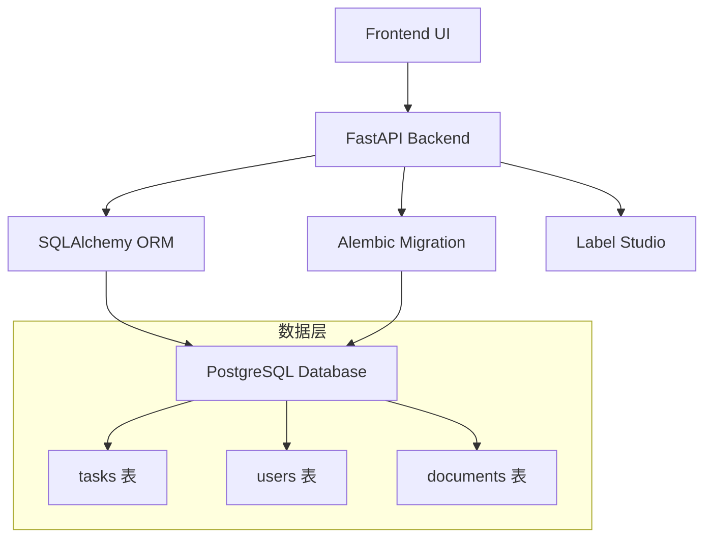
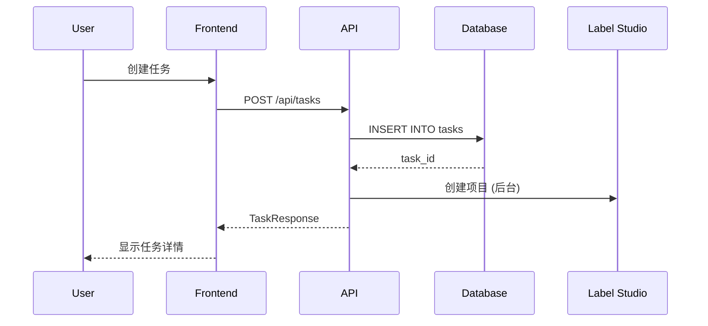
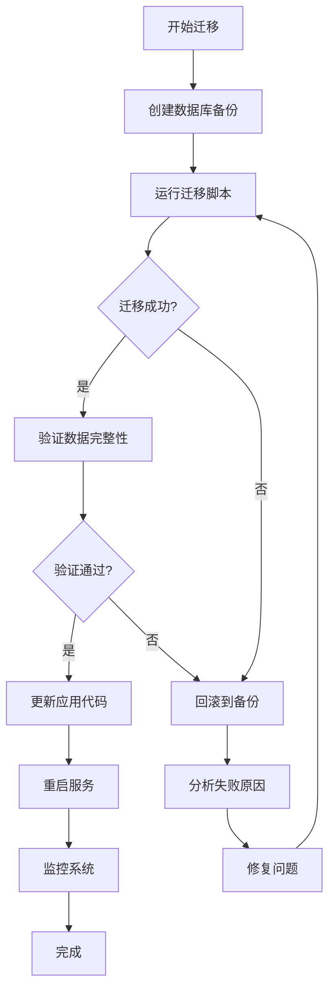

# 任务管理数据库迁移 - 设计文档

**功能名称**: task-management-database-migration  
**创建日期**: 2026-01-28  
**版本**: 1.0

## 1. 架构概览

### 1.1 系统架构



### 1.2 数据流



## 2. 数据库设计

### 2.1 扩展后的 tasks 表结构

```sql
CREATE TABLE tasks (
    -- 主键
    id UUID PRIMARY KEY DEFAULT gen_random_uuid(),
    
    -- 基本信息
    name VARCHAR(255) NOT NULL,
    description TEXT,
    status VARCHAR(50) DEFAULT 'pending',
    
    -- 任务分类
    priority VARCHAR(20) DEFAULT 'medium',
    annotation_type VARCHAR(50) DEFAULT 'custom',
    
    -- 关联关系
    document_id UUID REFERENCES documents(id),
    project_id VARCHAR(100) NOT NULL,
    assignee_id UUID REFERENCES users(id),
    created_by VARCHAR(100) NOT NULL,
    tenant_id VARCHAR(100) NOT NULL,
    
    -- 进度跟踪
    progress INTEGER DEFAULT 0 CHECK (progress >= 0 AND progress <= 100),
    total_items INTEGER DEFAULT 1 CHECK (total_items >= 1),
    completed_items INTEGER DEFAULT 0 CHECK (completed_items >= 0 AND completed_items <= total_items),
    
    -- 时间戳
    created_at TIMESTAMP WITH TIME ZONE DEFAULT CURRENT_TIMESTAMP,
    updated_at TIMESTAMP WITH TIME ZONE DEFAULT CURRENT_TIMESTAMP,
    due_date TIMESTAMP WITH TIME ZONE,
    
    -- Label Studio 集成
    label_studio_project_id VARCHAR(50),
    label_studio_project_created_at TIMESTAMP WITH TIME ZONE,
    label_studio_sync_status VARCHAR(20) DEFAULT 'pending',
    label_studio_last_sync TIMESTAMP WITH TIME ZONE,
    label_studio_task_count INTEGER DEFAULT 0,
    label_studio_annotation_count INTEGER DEFAULT 0,
    
    -- 同步相关
    sync_status VARCHAR(20),
    sync_version INTEGER DEFAULT 1,
    last_synced_at TIMESTAMP WITH TIME ZONE,
    sync_execution_id VARCHAR(36),
    is_from_sync BOOLEAN DEFAULT FALSE,
    sync_metadata JSONB DEFAULT '{}',
    
    -- 额外数据
    annotations JSONB DEFAULT '[]',
    ai_predictions JSONB DEFAULT '[]',
    quality_score FLOAT DEFAULT 0.0,
    tags JSONB DEFAULT '[]',
    task_metadata JSONB DEFAULT '{}'
);

-- 索引
CREATE INDEX idx_tasks_tenant_id ON tasks(tenant_id);
CREATE INDEX idx_tasks_status ON tasks(status);
CREATE INDEX idx_tasks_assignee_id ON tasks(assignee_id);
CREATE INDEX idx_tasks_created_at ON tasks(created_at);
CREATE INDEX idx_tasks_label_studio_project_id ON tasks(label_studio_project_id);

-- 触发器：自动更新 updated_at
CREATE OR REPLACE FUNCTION update_updated_at_column()
RETURNS TRIGGER AS $$
BEGIN
    NEW.updated_at = CURRENT_TIMESTAMP;
    RETURN NEW;
END;
$$ language 'plpgsql';

CREATE TRIGGER update_tasks_updated_at 
    BEFORE UPDATE ON tasks 
    FOR EACH ROW 
    EXECUTE FUNCTION update_updated_at_column();
```

### 2.2 枚举类型定义

```python
class TaskStatus(str, enum.Enum):
    """任务状态"""
    PENDING = "pending"
    IN_PROGRESS = "in_progress"
    COMPLETED = "completed"
    CANCELLED = "cancelled"
    REVIEWED = "reviewed"

class TaskPriority(str, enum.Enum):
    """任务优先级"""
    LOW = "low"
    MEDIUM = "medium"
    HIGH = "high"
    URGENT = "urgent"

class AnnotationType(str, enum.Enum):
    """标注类型"""
    TEXT_CLASSIFICATION = "text_classification"
    NER = "ner"
    SENTIMENT = "sentiment"
    QA = "qa"
    CUSTOM = "custom"

class LabelStudioSyncStatus(str, enum.Enum):
    """Label Studio 同步状态"""
    PENDING = "pending"
    SYNCED = "synced"
    FAILED = "failed"
```

### 2.3 数据模型

```python
class TaskModel(Base):
    """任务数据模型"""
    __tablename__ = "tasks"
    
    # 主键
    id: Mapped[UUID] = mapped_column(UUID(as_uuid=True), primary_key=True, default=uuid4)
    
    # 基本信息
    name: Mapped[str] = mapped_column(String(255), nullable=False)
    description: Mapped[Optional[str]] = mapped_column(Text, nullable=True)
    status: Mapped[TaskStatus] = mapped_column(SQLEnum(TaskStatus), default=TaskStatus.PENDING)
    
    # 任务分类
    priority: Mapped[TaskPriority] = mapped_column(SQLEnum(TaskPriority), default=TaskPriority.MEDIUM)
    annotation_type: Mapped[AnnotationType] = mapped_column(SQLEnum(AnnotationType), default=AnnotationType.CUSTOM)
    
    # 关联关系
    document_id: Mapped[Optional[UUID]] = mapped_column(UUID(as_uuid=True), ForeignKey("documents.id"), nullable=True)
    project_id: Mapped[str] = mapped_column(String(100), nullable=False)
    assignee_id: Mapped[Optional[UUID]] = mapped_column(UUID(as_uuid=True), ForeignKey("users.id"), nullable=True)
    created_by: Mapped[str] = mapped_column(String(100), nullable=False)
    tenant_id: Mapped[str] = mapped_column(String(100), nullable=False, index=True)
    
    # 进度跟踪
    progress: Mapped[int] = mapped_column(Integer, default=0)
    total_items: Mapped[int] = mapped_column(Integer, default=1)
    completed_items: Mapped[int] = mapped_column(Integer, default=0)
    
    # 时间戳
    created_at: Mapped[datetime] = mapped_column(DateTime(timezone=True), server_default=func.now())
    updated_at: Mapped[datetime] = mapped_column(DateTime(timezone=True), server_default=func.now(), onupdate=func.now())
    due_date: Mapped[Optional[datetime]] = mapped_column(DateTime(timezone=True), nullable=True)
    
    # Label Studio 集成
    label_studio_project_id: Mapped[Optional[str]] = mapped_column(String(50), nullable=True, index=True)
    label_studio_project_created_at: Mapped[Optional[datetime]] = mapped_column(DateTime(timezone=True), nullable=True)
    label_studio_sync_status: Mapped[Optional[LabelStudioSyncStatus]] = mapped_column(
        SQLEnum(LabelStudioSyncStatus), 
        default=LabelStudioSyncStatus.PENDING,
        nullable=True
    )
    label_studio_last_sync: Mapped[Optional[datetime]] = mapped_column(DateTime(timezone=True), nullable=True)
    label_studio_task_count: Mapped[int] = mapped_column(Integer, default=0)
    label_studio_annotation_count: Mapped[int] = mapped_column(Integer, default=0)
    
    # 同步相关
    sync_status: Mapped[Optional[str]] = mapped_column(String(20), nullable=True)
    sync_version: Mapped[int] = mapped_column(Integer, default=1)
    last_synced_at: Mapped[Optional[datetime]] = mapped_column(DateTime(timezone=True), nullable=True)
    sync_execution_id: Mapped[Optional[str]] = mapped_column(String(36), nullable=True)
    is_from_sync: Mapped[bool] = mapped_column(Boolean, default=False)
    sync_metadata: Mapped[dict] = mapped_column(JSONB, default={})
    
    # 额外数据
    annotations: Mapped[list] = mapped_column(JSONB, default=[])
    ai_predictions: Mapped[list] = mapped_column(JSONB, default=[])
    quality_score: Mapped[float] = mapped_column(Float, default=0.0)
    tags: Mapped[list] = mapped_column(JSONB, default=[])
    task_metadata: Mapped[dict] = mapped_column(JSONB, default={})
    
    # 关系
    document: Mapped[Optional["DocumentModel"]] = relationship("DocumentModel", back_populates="tasks")
    assignee: Mapped[Optional["UserModel"]] = relationship("UserModel", foreign_keys=[assignee_id])
    quality_issues: Mapped[List["QualityIssueModel"]] = relationship("QualityIssueModel", back_populates="task")
    billing_records: Mapped[List["BillingRecordModel"]] = relationship("BillingRecordModel", back_populates="task")
```

## 3. API 设计

### 3.1 端点更新

#### 3.1.1 创建任务

```python
@router.post("", response_model=TaskResponse)
async def create_task(
    request: TaskCreateRequest,
    background_tasks: BackgroundTasks,
    current_user: SimpleUser = Depends(get_current_user),
    db: Session = Depends(get_db_session)
):
    """创建新任务并保存到数据库"""
    # 创建任务模型
    task_model = TaskModel(
        name=request.name,
        description=request.description,
        annotation_type=AnnotationType(request.annotation_type),
        priority=TaskPriority(request.priority),
        assignee_id=UUID(request.assignee_id) if request.assignee_id else None,
        created_by=current_user.username,
        tenant_id=current_user.tenant_id,
        due_date=request.due_date,
        total_items=request.total_items,
        tags=request.tags or [],
        project_id=f"project_{uuid4()}"  # 生成项目 ID
    )
    
    # 保存到数据库
    db.add(task_model)
    db.commit()
    db.refresh(task_model)
    
    # 后台同步到 Label Studio
    background_tasks.add_task(
        sync_task_to_label_studio,
        str(task_model.id),
        task_model.name,
        task_model.annotation_type.value
    )
    
    return task_to_response(task_model)
```

#### 3.1.2 查询任务列表

```python
@router.get("", response_model=TaskListResponse)
def list_tasks(
    page: int = Query(1, ge=1),
    size: int = Query(10, ge=1, le=100),
    status: Optional[str] = Query(None),
    priority: Optional[str] = Query(None),
    assignee_id: Optional[str] = Query(None),
    search: Optional[str] = Query(None),
    current_user: SimpleUser = Depends(get_current_user),
    db: Session = Depends(get_db_session)
):
    """从数据库查询任务列表"""
    # 构建查询
    query = db.query(TaskModel).filter(TaskModel.tenant_id == current_user.tenant_id)
    
    # 应用过滤
    if status:
        query = query.filter(TaskModel.status == status)
    if priority:
        query = query.filter(TaskModel.priority == priority)
    if assignee_id:
        query = query.filter(TaskModel.assignee_id == UUID(assignee_id))
    if search:
        query = query.filter(
            or_(
                TaskModel.name.ilike(f"%{search}%"),
                TaskModel.description.ilike(f"%{search}%")
            )
        )
    
    # 计算总数
    total = query.count()
    
    # 分页
    tasks = query.order_by(TaskModel.created_at.desc()) \
                 .offset((page - 1) * size) \
                 .limit(size) \
                 .all()
    
    # 转换为响应格式
    task_responses = [task_to_response(task) for task in tasks]
    
    return TaskListResponse(
        items=task_responses,
        total=total,
        page=page,
        size=size
    )
```

#### 3.1.3 更新任务

```python
@router.patch("/{task_id}", response_model=TaskResponse)
def update_task(
    task_id: str,
    request: TaskUpdateRequest,
    current_user: SimpleUser = Depends(get_current_user),
    db: Session = Depends(get_db_session)
):
    """更新数据库中的任务"""
    # 查询任务
    task = db.query(TaskModel).filter(
        TaskModel.id == UUID(task_id),
        TaskModel.tenant_id == current_user.tenant_id
    ).first()
    
    if not task:
        raise HTTPException(status_code=404, detail="Task not found")
    
    # 更新字段
    update_data = request.dict(exclude_unset=True)
    for field, value in update_data.items():
        if hasattr(task, field):
            setattr(task, field, value)
    
    # 保存更改
    db.commit()
    db.refresh(task)
    
    return task_to_response(task)
```

### 3.2 辅助函数

```python
def task_to_response(task: TaskModel) -> TaskResponse:
    """将 TaskModel 转换为 TaskResponse"""
    return TaskResponse(
        id=str(task.id),
        name=task.name,
        description=task.description,
        status=task.status.value,
        priority=task.priority.value,
        annotation_type=task.annotation_type.value,
        assignee_id=str(task.assignee_id) if task.assignee_id else None,
        assignee_name=task.assignee.username if task.assignee else None,
        created_by=task.created_by,
        created_at=task.created_at,
        updated_at=task.updated_at,
        due_date=task.due_date,
        progress=task.progress,
        total_items=task.total_items,
        completed_items=task.completed_items,
        tenant_id=task.tenant_id,
        label_studio_project_id=task.label_studio_project_id,
        label_studio_project_created_at=task.label_studio_project_created_at,
        label_studio_sync_status=task.label_studio_sync_status.value if task.label_studio_sync_status else None,
        label_studio_last_sync=task.label_studio_last_sync,
        label_studio_task_count=task.label_studio_task_count,
        label_studio_annotation_count=task.label_studio_annotation_count,
        tags=task.tags,
        data_source=None  # 暂不支持
    )
```

## 4. 迁移策略

### 4.1 Alembic 迁移脚本

```python
"""Add extended task fields

Revision ID: add_extended_task_fields
Revises: previous_revision
Create Date: 2026-01-28

"""
from alembic import op
import sqlalchemy as sa
from sqlalchemy.dialects import postgresql

# revision identifiers
revision = 'add_extended_task_fields'
down_revision = 'previous_revision'
branch_labels = None
depends_on = None

def upgrade():
    # 添加新字段（允许 NULL）
    op.add_column('tasks', sa.Column('name', sa.String(255), nullable=True))
    op.add_column('tasks', sa.Column('description', sa.Text(), nullable=True))
    op.add_column('tasks', sa.Column('priority', sa.String(20), nullable=True))
    op.add_column('tasks', sa.Column('annotation_type', sa.String(50), nullable=True))
    op.add_column('tasks', sa.Column('assignee_id', postgresql.UUID(as_uuid=True), nullable=True))
    op.add_column('tasks', sa.Column('created_by', sa.String(100), nullable=True))
    op.add_column('tasks', sa.Column('updated_at', sa.DateTime(timezone=True), nullable=True))
    op.add_column('tasks', sa.Column('due_date', sa.DateTime(timezone=True), nullable=True))
    op.add_column('tasks', sa.Column('progress', sa.Integer(), nullable=True))
    op.add_column('tasks', sa.Column('total_items', sa.Integer(), nullable=True))
    op.add_column('tasks', sa.Column('completed_items', sa.Integer(), nullable=True))
    op.add_column('tasks', sa.Column('tags', postgresql.JSONB(), nullable=True))
    op.add_column('tasks', sa.Column('task_metadata', postgresql.JSONB(), nullable=True))
    
    # 填充默认值
    op.execute("""
        UPDATE tasks SET
            name = COALESCE(title, 'Task ' || id::text),
            description = COALESCE(description, ''),
            priority = 'medium',
            annotation_type = 'custom',
            created_by = 'system',
            updated_at = created_at,
            progress = 0,
            total_items = 1,
            completed_items = CASE WHEN status = 'completed' THEN 1 ELSE 0 END,
            tags = '[]'::jsonb,
            task_metadata = '{}'::jsonb
        WHERE name IS NULL
    """)
    
    # 设置 NOT NULL 约束
    op.alter_column('tasks', 'name', nullable=False)
    op.alter_column('tasks', 'created_by', nullable=False)
    op.alter_column('tasks', 'updated_at', nullable=False)
    
    # 设置默认值
    op.alter_column('tasks', 'priority', server_default='medium')
    op.alter_column('tasks', 'annotation_type', server_default='custom')
    op.alter_column('tasks', 'progress', server_default='0')
    op.alter_column('tasks', 'total_items', server_default='1')
    op.alter_column('tasks', 'completed_items', server_default='0')
    op.alter_column('tasks', 'tags', server_default='[]')
    op.alter_column('tasks', 'task_metadata', server_default='{}')
    
    # 创建外键
    op.create_foreign_key(
        'fk_tasks_assignee_id',
        'tasks', 'users',
        ['assignee_id'], ['id'],
        ondelete='SET NULL'
    )
    
    # 创建索引
    op.create_index('idx_tasks_assignee_id', 'tasks', ['assignee_id'])
    op.create_index('idx_tasks_priority', 'tasks', ['priority'])
    
    # 创建触发器
    op.execute("""
        CREATE OR REPLACE FUNCTION update_updated_at_column()
        RETURNS TRIGGER AS $$
        BEGIN
            NEW.updated_at = CURRENT_TIMESTAMP;
            RETURN NEW;
        END;
        $$ language 'plpgsql';
        
        CREATE TRIGGER update_tasks_updated_at 
            BEFORE UPDATE ON tasks 
            FOR EACH ROW 
            EXECUTE FUNCTION update_updated_at_column();
    """)

def downgrade():
    # 删除触发器
    op.execute("DROP TRIGGER IF EXISTS update_tasks_updated_at ON tasks")
    op.execute("DROP FUNCTION IF EXISTS update_updated_at_column()")
    
    # 删除索引
    op.drop_index('idx_tasks_priority', 'tasks')
    op.drop_index('idx_tasks_assignee_id', 'tasks')
    
    # 删除外键
    op.drop_constraint('fk_tasks_assignee_id', 'tasks', type_='foreignkey')
    
    # 删除列
    op.drop_column('tasks', 'task_metadata')
    op.drop_column('tasks', 'tags')
    op.drop_column('tasks', 'completed_items')
    op.drop_column('tasks', 'total_items')
    op.drop_column('tasks', 'progress')
    op.drop_column('tasks', 'due_date')
    op.drop_column('tasks', 'updated_at')
    op.drop_column('tasks', 'created_by')
    op.drop_column('tasks', 'assignee_id')
    op.drop_column('tasks', 'annotation_type')
    op.drop_column('tasks', 'priority')
    op.drop_column('tasks', 'description')
    op.drop_column('tasks', 'name')
```

### 4.2 迁移执行流程



## 5. 测试策略

### 5.1 单元测试

```python
def test_create_task():
    """测试创建任务"""
    task = TaskModel(
        name="Test Task",
        description="Test Description",
        priority=TaskPriority.HIGH,
        annotation_type=AnnotationType.TEXT_CLASSIFICATION,
        created_by="test_user",
        tenant_id="test_tenant",
        project_id="test_project"
    )
    db.add(task)
    db.commit()
    
    assert task.id is not None
    assert task.name == "Test Task"
    assert task.priority == TaskPriority.HIGH

def test_query_tasks():
    """测试查询任务"""
    tasks = db.query(TaskModel).filter(
        TaskModel.tenant_id == "test_tenant"
    ).all()
    
    assert len(tasks) > 0
    assert all(t.tenant_id == "test_tenant" for t in tasks)

def test_update_task():
    """测试更新任务"""
    task = db.query(TaskModel).first()
    original_updated_at = task.updated_at
    
    task.name = "Updated Name"
    db.commit()
    db.refresh(task)
    
    assert task.name == "Updated Name"
    assert task.updated_at > original_updated_at
```

### 5.2 集成测试

```python
def test_api_create_task():
    """测试 API 创建任务"""
    response = client.post(
        "/api/tasks",
        json={
            "name": "API Test Task",
            "description": "Created via API",
            "annotation_type": "text_classification",
            "priority": "high",
            "total_items": 100
        },
        headers={"Authorization": f"Bearer {token}"}
    )
    
    assert response.status_code == 200
    data = response.json()
    assert data["name"] == "API Test Task"
    assert data["priority"] == "high"

def test_api_list_tasks():
    """测试 API 查询任务列表"""
    response = client.get(
        "/api/tasks?page=1&size=10",
        headers={"Authorization": f"Bearer {token}"}
    )
    
    assert response.status_code == 200
    data = response.json()
    assert "items" in data
    assert "total" in data
    assert len(data["items"]) <= 10
```

### 5.3 性能测试

```python
def test_query_performance():
    """测试查询性能"""
    import time
    
    start = time.time()
    tasks = db.query(TaskModel).limit(1000).all()
    duration = time.time() - start
    
    assert duration < 0.2  # 应在 200ms 内完成
    assert len(tasks) <= 1000

def test_concurrent_operations():
    """测试并发操作"""
    import concurrent.futures
    
    def create_task(i):
        task = TaskModel(
            name=f"Concurrent Task {i}",
            created_by="test",
            tenant_id="test",
            project_id=f"project_{i}"
        )
        db.add(task)
        db.commit()
        return task.id
    
    with concurrent.futures.ThreadPoolExecutor(max_workers=10) as executor:
        futures = [executor.submit(create_task, i) for i in range(100)]
        results = [f.result() for f in futures]
    
    assert len(results) == 100
    assert len(set(results)) == 100  # 所有 ID 唯一
```

## 6. 监控和日志

### 6.1 关键指标

- 任务创建速率
- 查询响应时间
- 数据库连接池使用率
- 错误率
- 迁移成功率

### 6.2 日志记录

```python
logger.info(f"Task created: {task.id} by {task.created_by}")
logger.info(f"Task updated: {task.id}, fields: {updated_fields}")
logger.error(f"Failed to create task: {error}", exc_info=True)
logger.warning(f"Task query slow: {duration}ms")
```

## 7. 回滚计划

### 7.1 回滚触发条件

- 迁移失败
- 数据完整性验证失败
- 性能严重下降
- 关键功能不可用

### 7.2 回滚步骤

1. 停止应用服务
2. 恢复数据库备份
3. 回滚代码到之前版本
4. 重启服务
5. 验证系统正常

## 8. 部署清单

- [ ] 创建数据库备份
- [ ] 审查迁移脚本
- [ ] 在测试环境执行迁移
- [ ] 验证测试环境
- [ ] 准备回滚脚本
- [ ] 通知用户维护窗口
- [ ] 在生产环境执行迁移
- [ ] 验证生产环境
- [ ] 监控系统指标
- [ ] 更新文档

## 9. 相关文档

- `requirements.md` - 需求文档
- `tasks.md` - 任务列表
- `alembic/versions/` - 迁移脚本
- `src/database/models.py` - 数据模型
- `src/api/tasks.py` - API 实现
