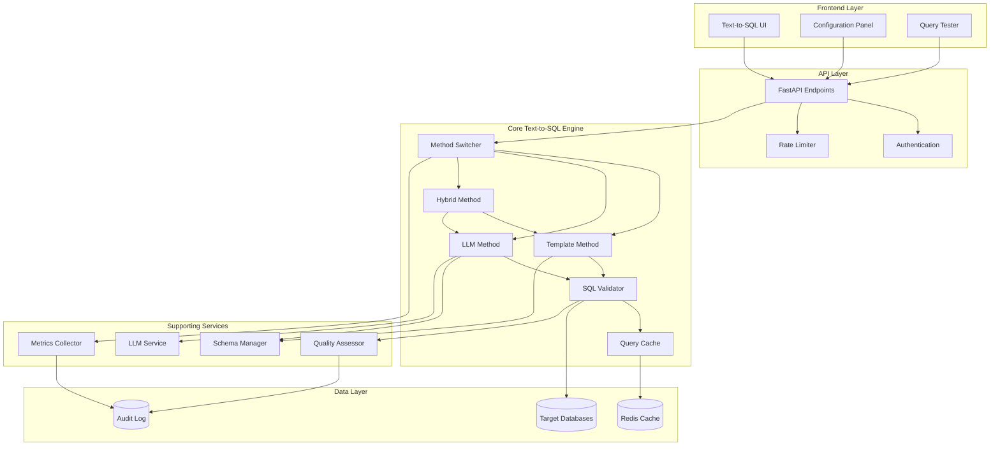
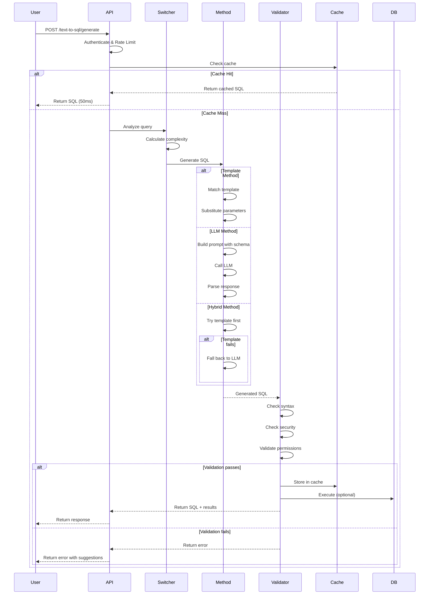

# Design Document: Text-to-SQL Methods

## Overview

The Text-to-SQL Methods feature provides a multi-strategy system for converting natural language queries into executable SQL statements. The system implements three core methods (Template-based, LLM-based, and Hybrid) with intelligent switching logic to optimize for accuracy, performance, and cost. The architecture follows a plugin-based design where each method implements a common interface, allowing for easy extension and testing.

### Key Design Goals

1. **Flexibility**: Support multiple SQL generation strategies with easy switching
2. **Performance**: Optimize response times through caching and method selection
3. **Accuracy**: Achieve >90% SQL correctness through validation and quality assessment
4. **Security**: Prevent SQL injection and unauthorized access through comprehensive validation
5. **Scalability**: Support multiple database types and multi-tenant deployments
6. **Maintainability**: Clean separation of concerns with testable components

## Architecture

### High-Level Architecture



### Component Interaction Flow



## Components and Interfaces

### 1. Method Switcher

**Responsibility**: Analyze queries and select the optimal Text-to-SQL method

**Interface**:
```python
class MethodSwitcher:
    async def select_method(
        self,
        query: str,
        database_type: DatabaseType,
        user_preference: Optional[MethodType] = None
    ) -> MethodType:
        """
        Select the best method for a given query.
        
        Args:
            query: Natural language query
            database_type: Target database type
            user_preference: Optional user-specified method
            
        Returns:
            Selected method type (TEMPLATE, LLM, or HYBRID)
        """
        pass
    
    async def calculate_complexity(self, query: str) -> QueryComplexity:
        """Calculate query complexity score (0-100)"""
        pass
    
    async def get_method_stats(self) -> Dict[MethodType, MethodStats]:
        """Get performance statistics for each method"""
        pass
```

**Complexity Calculation Logic**:
- Simple queries (0-30): Single table SELECT with <3 conditions
- Medium queries (31-60): Multiple tables, simple JOINs, basic aggregations
- Complex queries (61-100): Subqueries, complex JOINs, window functions, CTEs

**Selection Rules**:
1. If user_preference is set, use that method
2. If complexity < 30 and template exists, use Template
3. If complexity > 60, use LLM
4. Otherwise, use Hybrid

### 2. Template Method

**Responsibility**: Generate SQL using predefined templates with parameter substitution

**Interface**:
```python
class TemplateMethod:
    async def generate_sql(
        self,
        query: str,
        database_type: DatabaseType,
        schema: DatabaseSchema
    ) -> SQLGenerationResult:
        """
        Generate SQL using template matching.
        
        Args:
            query: Natural language query
            database_type: Target database type
            schema: Database schema information
            
        Returns:
            SQLGenerationResult with generated SQL or error
        """
        pass
    
    async def match_template(
        self,
        query: str,
        database_type: DatabaseType
    ) -> Optional[SQLTemplate]:
        """Find the best matching template"""
        pass
    
    async def extract_parameters(
        self,
        query: str,
        template: SQLTemplate
    ) -> Dict[str, Any]:
        """Extract parameter values from query"""
        pass
    
    async def add_template(
        self,
        pattern: str,
        sql_template: str,
        database_type: DatabaseType
    ) -> None:
        """Add a new template to the library"""
        pass
```

**Template Format**:
```python
@dataclass
class SQLTemplate:
    id: str
    pattern: str  # Regex pattern for matching
    sql_template: str  # SQL with {param} placeholders
    database_type: DatabaseType
    parameters: List[TemplateParameter]
    priority: int  # Higher priority templates checked first
    examples: List[str]  # Example queries
```

**Example Templates**:
```python
# Simple SELECT
pattern = r"(?:show|get|list|find)\s+(?:all\s+)?(\w+)"
sql_template = "SELECT * FROM {table_name} LIMIT 100"

# SELECT with condition
pattern = r"(?:show|get|find)\s+(\w+)\s+where\s+(\w+)\s*=\s*['\"]?([^'\"]+)['\"]?"
sql_template = "SELECT * FROM {table_name} WHERE {column_name} = {value}"

# COUNT aggregation
pattern = r"(?:count|how many)\s+(\w+)"
sql_template = "SELECT COUNT(*) as count FROM {table_name}"
```

### 3. LLM Method

**Responsibility**: Generate SQL using Large Language Models

**Interface**:
```python
class LLMMethod:
    async def generate_sql(
        self,
        query: str,
        database_type: DatabaseType,
        schema: DatabaseSchema
    ) -> SQLGenerationResult:
        """
        Generate SQL using LLM.
        
        Args:
            query: Natural language query
            database_type: Target database type
            schema: Database schema information
            
        Returns:
            SQLGenerationResult with generated SQL or error
        """
        pass
    
    async def build_prompt(
        self,
        query: str,
        schema: DatabaseSchema,
        database_type: DatabaseType,
        examples: List[QuerySQLPair] = []
    ) -> str:
        """Build LLM prompt with schema context"""
        pass
    
    async def parse_llm_response(
        self,
        response: str
    ) -> str:
        """Extract SQL from LLM response"""
        pass
    
    async def retry_with_refinement(
        self,
        query: str,
        previous_sql: str,
        error: str,
        schema: DatabaseSchema
    ) -> SQLGenerationResult:
        """Retry generation with error feedback"""
        pass
```

**Prompt Template**:
```python
PROMPT_TEMPLATE = """You are a SQL expert. Generate a {database_type} SQL query for the following request.

Database Schema:
{schema_description}

Example Queries:
{examples}

User Request: {query}

Requirements:
1. Generate ONLY the SQL query, no explanations
2. Use proper {database_type} syntax
3. Include appropriate WHERE clauses for filtering
4. Use JOINs when querying multiple tables
5. Add LIMIT clause for large result sets

SQL Query:"""
```

**Schema Description Format**:
```python
def format_schema(schema: DatabaseSchema) -> str:
    """
    Format schema for LLM prompt.
    
    Example output:
    Table: users
      - id (INTEGER, PRIMARY KEY)
      - name (VARCHAR(100), NOT NULL)
      - email (VARCHAR(255), UNIQUE)
      - created_at (TIMESTAMP)
    
    Table: orders
      - id (INTEGER, PRIMARY KEY)
      - user_id (INTEGER, FOREIGN KEY -> users.id)
      - total (DECIMAL(10,2))
      - status (VARCHAR(20))
    """
    pass
```

### 4. Hybrid Method

**Responsibility**: Combine template and LLM methods with intelligent fallback

**Interface**:
```python
class HybridMethod:
    async def generate_sql(
        self,
        query: str,
        database_type: DatabaseType,
        schema: DatabaseSchema
    ) -> SQLGenerationResult:
        """
        Generate SQL using hybrid approach.
        
        Strategy:
        1. Try template method first (fast)
        2. If no template match, use LLM
        3. If template SQL fails validation, retry with LLM
        4. Cache successful LLM results as new templates
        
        Args:
            query: Natural language query
            database_type: Target database type
            schema: Database schema information
            
        Returns:
            SQLGenerationResult with generated SQL or error
        """
        pass
    
    async def should_cache_as_template(
        self,
        query: str,
        sql: str,
        success_count: int
    ) -> bool:
        """Decide if LLM result should become a template"""
        pass
```

**Caching Strategy**:
- Cache LLM-generated SQL after 3 successful executions
- Extract pattern from query using NLP techniques
- Create template with extracted parameters
- Store in template library for future use

### 5. SQL Validator

**Responsibility**: Validate generated SQL for syntax, security, and permissions

**Interface**:
```python
class SQLValidator:
    async def validate(
        self,
        sql: str,
        database_type: DatabaseType,
        user_permissions: UserPermissions
    ) -> ValidationResult:
        """
        Comprehensive SQL validation.
        
        Checks:
        1. Syntax correctness for database type
        2. SQL injection patterns
        3. Dangerous operations (DROP, TRUNCATE, etc.)
        4. Table/column permissions
        5. Query complexity limits
        
        Args:
            sql: Generated SQL to validate
            database_type: Target database type
            user_permissions: User's access permissions
            
        Returns:
            ValidationResult with pass/fail and error details
        """
        pass
    
    async def check_sql_injection(self, sql: str) -> List[SecurityIssue]:
        """Detect SQL injection patterns"""
        pass
    
    async def check_permissions(
        self,
        sql: str,
        user_permissions: UserPermissions
    ) -> List[PermissionIssue]:
        """Verify user has access to queried tables"""
        pass
    
    async def check_syntax(
        self,
        sql: str,
        database_type: DatabaseType
    ) -> Optional[SyntaxError]:
        """Validate SQL syntax for database type"""
        pass
```

**Security Checks**:
```python
SQL_INJECTION_PATTERNS = [
    r";\s*DROP\s+TABLE",
    r";\s*DELETE\s+FROM",
    r"UNION\s+SELECT",
    r"--\s*$",  # SQL comments
    r"/\*.*\*/",  # Multi-line comments
    r"xp_cmdshell",  # SQL Server command execution
    r"EXEC\s*\(",  # Dynamic SQL execution
]

DANGEROUS_OPERATIONS = [
    "DROP", "TRUNCATE", "ALTER", "CREATE",
    "GRANT", "REVOKE", "EXEC", "EXECUTE"
]
```

### 6. Schema Manager

**Responsibility**: Manage database schema information and metadata

**Interface**:
```python
class SchemaManager:
    async def get_schema(
        self,
        database_connection: DatabaseConnection
    ) -> DatabaseSchema:
        """Retrieve complete database schema"""
        pass
    
    async def get_table_info(
        self,
        database_connection: DatabaseConnection,
        table_name: str
    ) -> TableInfo:
        """Get detailed information about a specific table"""
        pass
    
    async def get_relationships(
        self,
        database_connection: DatabaseConnection
    ) -> List[TableRelationship]:
        """Get foreign key relationships between tables"""
        pass
    
    async def refresh_schema_cache(
        self,
        database_connection: DatabaseConnection
    ) -> None:
        """Refresh cached schema information"""
        pass
```

**Schema Caching**:
- Cache schema for 1 hour by default
- Invalidate on DDL operations (ALTER, CREATE, DROP)
- Store in Redis with database connection as key

### 7. Query Cache

**Responsibility**: Cache query-SQL pairs to improve performance

**Interface**:
```python
class QueryCache:
    async def get(
        self,
        query: str,
        database_type: DatabaseType,
        schema_version: str
    ) -> Optional[CachedSQL]:
        """Retrieve cached SQL for query"""
        pass
    
    async def set(
        self,
        query: str,
        sql: str,
        database_type: DatabaseType,
        schema_version: str,
        ttl: int = 86400  # 24 hours
    ) -> None:
        """Cache query-SQL pair"""
        pass
    
    async def invalidate_by_schema(
        self,
        database_type: DatabaseType,
        schema_version: str
    ) -> None:
        """Invalidate cache when schema changes"""
        pass
    
    async def get_stats(self) -> CacheStats:
        """Get cache hit/miss statistics"""
        pass
```

**Cache Key Format**:
```python
def generate_cache_key(
    query: str,
    database_type: DatabaseType,
    schema_version: str
) -> str:
    """
    Generate cache key from query and context.
    
    Format: text2sql:{db_type}:{schema_hash}:{query_hash}
    Example: text2sql:postgresql:a3f2c1:b4e5d6
    """
    query_normalized = normalize_query(query)
    query_hash = hashlib.md5(query_normalized.encode()).hexdigest()[:6]
    schema_hash = hashlib.md5(schema_version.encode()).hexdigest()[:6]
    return f"text2sql:{database_type.value}:{schema_hash}:{query_hash}"
```

## Data Models

### Core Data Models

```python
from enum import Enum
from dataclasses import dataclass
from typing import Optional, List, Dict, Any
from datetime import datetime

class DatabaseType(str, Enum):
    POSTGRESQL = "postgresql"
    MYSQL = "mysql"
    ORACLE = "oracle"
    SQLSERVER = "sqlserver"

class MethodType(str, Enum):
    TEMPLATE = "template"
    LLM = "llm"
    HYBRID = "hybrid"

class QueryComplexity(str, Enum):
    SIMPLE = "simple"  # 0-30
    MEDIUM = "medium"  # 31-60
    COMPLEX = "complex"  # 61-100

@dataclass
class SQLGenerationRequest:
    query: str
    database_type: DatabaseType
    database_connection_id: str
    method_preference: Optional[MethodType] = None
    execute_query: bool = False
    max_results: int = 100

@dataclass
class SQLGenerationResult:
    sql: str
    method_used: MethodType
    execution_time_ms: float
    confidence_score: float  # 0-1
    validation_passed: bool
    validation_errors: List[str]
    query_results: Optional[List[Dict[str, Any]]] = None
    cached: bool = False

@dataclass
class DatabaseSchema:
    database_type: DatabaseType
    version: str
    tables: List[TableInfo]
    relationships: List[TableRelationship]
    last_updated: datetime

@dataclass
class TableInfo:
    name: str
    columns: List[ColumnInfo]
    primary_keys: List[str]
    indexes: List[IndexInfo]
    row_count: Optional[int] = None

@dataclass
class ColumnInfo:
    name: str
    data_type: str
    nullable: bool
    default_value: Optional[str] = None
    description: Optional[str] = None

@dataclass
class TableRelationship:
    from_table: str
    from_column: str
    to_table: str
    to_column: str
    relationship_type: str  # "one-to-many", "many-to-many", etc.

@dataclass
class ValidationResult:
    passed: bool
    errors: List[ValidationError]
    warnings: List[ValidationWarning]
    execution_time_ms: float

@dataclass
class ValidationError:
    type: str  # "syntax", "security", "permission"
    message: str
    location: Optional[str] = None  # SQL location if applicable

@dataclass
class MethodStats:
    method_type: MethodType
    total_requests: int
    successful_requests: int
    failed_requests: int
    average_execution_time_ms: float
    success_rate: float
    last_updated: datetime

@dataclass
class QuerySQLPair:
    query: str
    sql: str
    database_type: DatabaseType
    success_count: int
    created_at: datetime
    last_used: datetime
```

### Database Models

```python
from sqlalchemy import Column, String, Integer, Float, Boolean, DateTime, Text, JSON, ForeignKey, Enum as SQLEnum
from sqlalchemy.orm import relationship
from src.database.base import Base

class TextToSQLQuery(Base):
    """Store Text-to-SQL query history"""
    __tablename__ = "text_to_sql_queries"
    
    id = Column(String(36), primary_key=True)
    tenant_id = Column(String(36), ForeignKey("tenants.id"), nullable=False, index=True)
    user_id = Column(String(36), ForeignKey("users.id"), nullable=False, index=True)
    
    query = Column(Text, nullable=False)
    generated_sql = Column(Text, nullable=False)
    database_type = Column(SQLEnum(DatabaseType), nullable=False)
    database_connection_id = Column(String(36), nullable=False)
    
    method_used = Column(SQLEnum(MethodType), nullable=False)
    execution_time_ms = Column(Float, nullable=False)
    confidence_score = Column(Float, nullable=False)
    
    validation_passed = Column(Boolean, nullable=False)
    validation_errors = Column(JSON, nullable=True)
    
    executed = Column(Boolean, default=False)
    execution_success = Column(Boolean, nullable=True)
    execution_error = Column(Text, nullable=True)
    
    user_feedback = Column(String(20), nullable=True)  # "correct", "incorrect", "partially_correct"
    feedback_comment = Column(Text, nullable=True)
    
    created_at = Column(DateTime, nullable=False)
    
    # Relationships
    tenant = relationship("Tenant", back_populates="text_to_sql_queries")
    user = relationship("User", back_populates="text_to_sql_queries")

class SQLTemplate(Base):
    """Store SQL templates for template-based generation"""
    __tablename__ = "sql_templates"
    
    id = Column(String(36), primary_key=True)
    tenant_id = Column(String(36), ForeignKey("tenants.id"), nullable=True, index=True)
    
    name = Column(String(200), nullable=False)
    description = Column(Text, nullable=True)
    pattern = Column(Text, nullable=False)
    sql_template = Column(Text, nullable=False)
    database_type = Column(SQLEnum(DatabaseType), nullable=False)
    
    parameters = Column(JSON, nullable=False)  # List of parameter definitions
    priority = Column(Integer, default=0)
    examples = Column(JSON, nullable=True)  # List of example queries
    
    usage_count = Column(Integer, default=0)
    success_count = Column(Integer, default=0)
    
    is_active = Column(Boolean, default=True)
    is_system = Column(Boolean, default=False)  # System templates vs user-created
    
    created_by = Column(String(36), ForeignKey("users.id"), nullable=True)
    created_at = Column(DateTime, nullable=False)
    updated_at = Column(DateTime, nullable=False)
    
    # Relationships
    tenant = relationship("Tenant", back_populates="sql_templates")
    creator = relationship("User", back_populates="created_sql_templates")

class TextToSQLMetrics(Base):
    """Store aggregated metrics for Text-to-SQL operations"""
    __tablename__ = "text_to_sql_metrics"
    
    id = Column(String(36), primary_key=True)
    tenant_id = Column(String(36), ForeignKey("tenants.id"), nullable=False, index=True)
    
    date = Column(DateTime, nullable=False, index=True)
    method_type = Column(SQLEnum(MethodType), nullable=False)
    database_type = Column(SQLEnum(DatabaseType), nullable=False)
    
    total_requests = Column(Integer, default=0)
    successful_requests = Column(Integer, default=0)
    failed_requests = Column(Integer, default=0)
    cached_requests = Column(Integer, default=0)
    
    total_execution_time_ms = Column(Float, default=0.0)
    average_execution_time_ms = Column(Float, default=0.0)
    
    llm_tokens_used = Column(Integer, default=0)
    llm_cost_usd = Column(Float, default=0.0)
    
    created_at = Column(DateTime, nullable=False)
    
    # Relationships
    tenant = relationship("Tenant", back_populates="text_to_sql_metrics")
```

## Correctness Properties

*A property is a characteristic or behavior that should hold true across all valid executions of a system—essentially, a formal statement about what the system should do. Properties serve as the bridge between human-readable specifications and machine-verifiable correctness guarantees.*


### Property Reflection

After analyzing all acceptance criteria, I identified the following redundancies and consolidations:

**Redundancy Group 1: Method Selection Logic**
- Properties 4.2, 4.3, 4.4 all test method selection based on complexity
- **Consolidation**: Combine into single property testing complexity-based selection

**Redundancy Group 2: Validation Checks**
- Properties 5.1, 5.2, 5.3, 5.4 all test different aspects of validation
- **Keep separate**: Each tests a distinct validation concern (injection, operations, permissions, syntax)

**Redundancy Group 3: Metrics Tracking**
- Properties 8.1, 8.2, 8.3 all test metrics tracking
- **Consolidation**: Combine into single property about comprehensive metrics tracking

**Redundancy Group 4: Cache Behavior**
- Properties 10.1, 10.2, 10.3, 10.6 all test caching
- **Keep separate**: Each tests a distinct cache behavior (TTL, performance, invalidation, eviction)

**Redundancy Group 5: Multi-Tenancy**
- Properties 12.1, 12.2, 12.6 all test tenant isolation
- **Consolidation**: Combine into single property about tenant data isolation

**Redundancy Group 6: Error Handling**
- Properties 11.1, 11.6, 11.7 all test error handling
- **Keep separate**: Each tests a distinct error handling aspect (i18n, highlighting, logging)

### Correctness Properties

Property 1: Template Parameter Substitution
*For any* query matching a template pattern and any valid parameter values, substituting the parameters into the template should produce valid SQL containing all substituted values.
**Validates: Requirements 1.1**

Property 2: Template Selection Specificity
*For any* query matching multiple templates, the selected template should be the one with the highest specificity score (based on parameter count and pattern complexity).
**Validates: Requirements 1.2**

Property 3: Template Non-Match Handling
*For any* query that does not match any template pattern, the template method should return a "no match" status without generating SQL.
**Validates: Requirements 1.3**

Property 4: SQL Injection Prevention in Templates
*For any* parameter value containing SQL injection patterns (e.g., "; DROP TABLE", "UNION SELECT"), the template method should reject the parameter and not generate SQL.
**Validates: Requirements 1.5**

Property 5: Schema Context Retrieval
*For any* template requiring schema information, the template method should retrieve current schema metadata before generating SQL.
**Validates: Requirements 1.6**

Property 6: LLM SQL Generation
*For any* unstructured natural language query, the LLM method should generate syntactically valid SQL for the target database type.
**Validates: Requirements 2.1**

Property 7: LLM Prompt Schema Inclusion
*For any* query processed by the LLM method, the generated prompt should include database schema information (tables, columns, relationships).
**Validates: Requirements 2.2**

Property 8: LLM Retry Logic
*For any* LLM-generated SQL that fails validation, the LLM method should retry up to 3 times with refined prompts before returning an error.
**Validates: Requirements 2.3**

Property 9: LLM Timeout Enforcement
*For any* LLM generation request, if execution exceeds 5 seconds, the method should timeout and return an error.
**Validates: Requirements 2.5**

Property 10: LLM Logging Completeness
*For any* SQL generated by the LLM method, both the prompt and generated SQL should be logged for quality assessment.
**Validates: Requirements 2.6**

Property 11: Hybrid Method Execution Order
*For any* query processed by the hybrid method, template matching should be attempted before LLM generation.
**Validates: Requirements 3.1**

Property 12: Hybrid Fallback Behavior
*For any* query where template matching fails, the hybrid method should automatically fall back to LLM generation.
**Validates: Requirements 3.2**

Property 13: Hybrid Error Handling
*For any* query where both template and LLM methods fail, the hybrid method should return a descriptive error message indicating both failures.
**Validates: Requirements 3.3**

Property 14: Hybrid Validation Fallback
*For any* template-generated SQL that fails validation, the hybrid method should retry with LLM generation.
**Validates: Requirements 3.5**

Property 15: Hybrid Template Caching
*For any* LLM-generated SQL that executes successfully 3 or more times, the hybrid method should cache it as a new template for future use.
**Validates: Requirements 3.6**

Property 16: Query Complexity Analysis
*For any* submitted query, the method switcher should calculate a complexity score between 0 and 100 based on keyword patterns and structure.
**Validates: Requirements 4.1**

Property 17: Complexity-Based Method Selection
*For any* query, the method switcher should select Template for complexity <30, LLM for complexity >60, and Hybrid for complexity 31-60.
**Validates: Requirements 4.2, 4.3, 4.4**

Property 18: Database-Aware Method Selection
*For any* query, the method switcher should consider the target database type when selecting the generation method.
**Validates: Requirements 4.5**

Property 19: Method Fallback on Failure
*For any* query where the selected method fails, the method switcher should automatically try the next best method.
**Validates: Requirements 4.6**

Property 20: SQL Injection Detection
*For any* generated SQL containing SQL injection patterns (e.g., "; DROP", "UNION SELECT", "--", "/**/"), the validator should reject the SQL and return a security error.
**Validates: Requirements 5.1**

Property 21: Dangerous Operation Detection
*For any* generated SQL containing dangerous operations (DROP, TRUNCATE, ALTER, CREATE, GRANT, REVOKE, EXEC), the validator should reject the SQL unless explicitly allowed.
**Validates: Requirements 5.2**

Property 22: Permission Validation
*For any* generated SQL accessing tables, the validator should verify the user has permissions for all referenced tables and reject if unauthorized.
**Validates: Requirements 5.3**

Property 23: Syntax Validation
*For any* generated SQL, the validator should verify syntax correctness for the target database type before allowing execution.
**Validates: Requirements 5.4**

Property 24: Validation Error Specificity
*For any* SQL that fails validation, the validator should return specific error messages indicating the type of violation (syntax, security, permission) and location.
**Validates: Requirements 5.5**

Property 25: Validation Audit Logging
*For any* validation attempt (pass or fail), the validator should create an audit log entry with timestamp, SQL, result, and user information.
**Validates: Requirements 5.6**

Property 26: Database-Specific Syntax Generation
*For any* query, the generated SQL should use syntax appropriate for the target database type (e.g., LIMIT for PostgreSQL/MySQL, TOP for SQL Server).
**Validates: Requirements 6.2**

Property 27: Database Type Auto-Detection
*For any* database connection, the system should automatically detect the database type (PostgreSQL, MySQL, Oracle, SQL Server).
**Validates: Requirements 6.3**

Property 28: Database-Specific Template Libraries
*For any* database type, the system should maintain a separate template library with database-specific SQL patterns.
**Validates: Requirements 6.4**

Property 29: Database-Specific Syntax Validation
*For any* generated SQL, the validator should apply syntax rules specific to the target database type.
**Validates: Requirements 6.6**

Property 30: UI Real-Time Updates
*For any* query entered in the UI, the system should display the selected method and generated SQL in real-time (within 100ms of input change).
**Validates: Requirements 7.3**

Property 31: UI Query Execution Display
*For any* query tested in the UI, the system should execute the SQL and display results with execution time.
**Validates: Requirements 7.5**

Property 32: UI Connection Switching
*For any* database connection switch in the UI, the system should update the schema display and available templates.
**Validates: Requirements 7.7**

Property 33: UI Internationalization
*For any* UI text element, the system should display text in the user's preferred language (zh-CN or en-US).
**Validates: Requirements 7.8**

Property 34: Comprehensive Metrics Tracking
*For any* Text-to-SQL operation, the system should track execution time, success/failure status, method used, and (for LLM) token usage and cost.
**Validates: Requirements 8.1, 8.2, 8.3**

Property 35: Performance Degradation Alerting
*For any* method where success rate falls below 80% or average execution time exceeds 3 seconds, the system should send an alert to administrators.
**Validates: Requirements 8.4**

Property 36: Prometheus Metrics Export
*For any* Text-to-SQL operation, the system should export metrics to Prometheus in standard format.
**Validates: Requirements 8.5**

Property 37: Slow Query Logging
*For any* query with execution time >2 seconds, the system should log the query, SQL, and execution time for analysis.
**Validates: Requirements 8.6**

Property 38: User Feedback Collection
*For any* generated SQL, the system should allow users to provide feedback (correct/incorrect/partially_correct) and store it for quality improvement.
**Validates: Requirements 9.2**

Property 39: Ragas Quality Assessment
*For any* generated SQL, the system should use the Ragas framework to assess semantic quality and store the quality score.
**Validates: Requirements 9.3**

Property 40: Accuracy Metrics Tracking
*For any* SQL generation, the system should track syntax correctness, semantic correctness, and execution success as accuracy metrics.
**Validates: Requirements 9.4**

Property 41: Accuracy Threshold Alerting
*For any* 24-hour period where overall accuracy falls below 90%, the system should trigger a review process and notify administrators.
**Validates: Requirements 9.5**

Property 42: Query-SQL Caching with TTL
*For any* successful query-SQL pair, the system should cache it in Redis with a TTL of 24 hours.
**Validates: Requirements 10.1**

Property 43: Cache Performance
*For any* cached query, the system should return the cached SQL within 50ms.
**Validates: Requirements 10.2**

Property 44: Schema Change Cache Invalidation
*For any* database schema change (ALTER, CREATE, DROP), the system should invalidate all cache entries for that database.
**Validates: Requirements 10.3**

Property 45: LRU Cache Eviction
*For any* cache at maximum capacity, when a new entry is added, the system should evict the least recently used entry.
**Validates: Requirements 10.6**

Property 46: Internationalized Error Messages
*For any* error, the system should return error messages in the user's preferred language (zh-CN or en-US).
**Validates: Requirements 11.1**

Property 47: Ambiguous Query Suggestions
*For any* query identified as ambiguous, the system should provide clarification suggestions or alternative phrasings.
**Validates: Requirements 11.2**

Property 48: LLM Unavailable Fallback
*For any* query when the LLM service is unavailable, the system should fall back to template method and notify the user of the fallback.
**Validates: Requirements 11.4**

Property 49: Validation Error Highlighting
*For any* SQL that fails validation, the system should highlight the problematic part of the SQL in the error response.
**Validates: Requirements 11.6**

Property 50: Error Correlation Logging
*For any* error, the system should log the error with a correlation ID that can be used to trace the request across services.
**Validates: Requirements 11.7**

Property 51: Tenant Data Isolation
*For any* tenant, all Text-to-SQL configurations, database connections, cache entries, and logs should be isolated from other tenants.
**Validates: Requirements 12.1, 12.2, 12.6**

Property 52: Tenant Usage Tracking
*For any* tenant, the system should track usage metrics (query count, LLM token usage, execution time) for billing purposes.
**Validates: Requirements 12.3**

Property 53: Tenant Quota Enforcement
*For any* tenant that exceeds their LLM usage quota, the system should automatically switch to template-only mode for that tenant.
**Validates: Requirements 12.4**

Property 54: Consistent API Error Responses
*For any* API error, the system should return a response with consistent format including error code, message, and correlation ID.
**Validates: Requirements 14.8**

## Error Handling

### Error Categories

1. **Validation Errors** (4xx status codes)
   - Invalid query format
   - SQL injection detected
   - Dangerous operations not allowed
   - Permission denied
   - Syntax errors

2. **Generation Errors** (5xx status codes)
   - LLM service unavailable
   - Template matching failed
   - Timeout exceeded
   - Database connection failed

3. **System Errors** (5xx status codes)
   - Cache service unavailable
   - Database error
   - Internal server error

### Error Response Format

```python
@dataclass
class ErrorResponse:
    error_code: str  # e.g., "SQL_INJECTION_DETECTED"
    message: str  # User-friendly message in preferred language
    details: Optional[Dict[str, Any]] = None
    correlation_id: str = ""
    suggestions: List[str] = field(default_factory=list)
    timestamp: datetime = field(default_factory=datetime.utcnow)
```

### Error Handling Strategy

```python
async def handle_text_to_sql_error(
    error: Exception,
    context: RequestContext
) -> ErrorResponse:
    """
    Centralized error handling for Text-to-SQL operations.
    
    Strategy:
    1. Log error with correlation ID
    2. Determine error category
    3. Generate user-friendly message in preferred language
    4. Provide actionable suggestions
    5. Return structured error response
    """
    correlation_id = context.correlation_id
    
    # Log error
    logger.error(
        f"Text-to-SQL error: {error}",
        extra={
            "correlation_id": correlation_id,
            "user_id": context.user_id,
            "tenant_id": context.tenant_id,
            "query": context.query
        }
    )
    
    # Determine error type and generate response
    if isinstance(error, SQLInjectionError):
        return ErrorResponse(
            error_code="SQL_INJECTION_DETECTED",
            message=translate("error.sql_injection", context.language),
            correlation_id=correlation_id,
            suggestions=[
                translate("suggestion.remove_special_chars", context.language)
            ]
        )
    elif isinstance(error, TemplateNotFoundError):
        return ErrorResponse(
            error_code="TEMPLATE_NOT_FOUND",
            message=translate("error.template_not_found", context.language),
            correlation_id=correlation_id,
            suggestions=[
                translate("suggestion.try_llm_method", context.language),
                translate("suggestion.rephrase_query", context.language)
            ]
        )
    # ... handle other error types
```

### Retry Logic

```python
async def generate_sql_with_retry(
    query: str,
    method: TextToSQLMethod,
    max_retries: int = 3
) -> SQLGenerationResult:
    """
    Generate SQL with automatic retry on transient failures.
    
    Retry conditions:
    - LLM timeout (retry with shorter prompt)
    - LLM rate limit (retry with exponential backoff)
    - Invalid SQL (retry with error feedback)
    
    No retry conditions:
    - SQL injection detected
    - Permission denied
    - Invalid query format
    """
    last_error = None
    
    for attempt in range(max_retries):
        try:
            result = await method.generate_sql(query)
            
            if result.validation_passed:
                return result
            
            # Retry with error feedback
            query = refine_query_with_feedback(query, result.validation_errors)
            
        except LLMTimeoutError as e:
            last_error = e
            await asyncio.sleep(2 ** attempt)  # Exponential backoff
            continue
        
        except (SQLInjectionError, PermissionDeniedError) as e:
            # Don't retry on security errors
            raise e
    
    raise MaxRetriesExceededError(f"Failed after {max_retries} attempts", last_error)
```

## Testing Strategy

### Unit Testing

**Scope**: Test individual components in isolation

**Test Coverage**:
- Template matching logic
- Parameter extraction
- SQL generation for each method
- Validation rules
- Cache operations
- Schema parsing

**Example Unit Test**:
```python
@pytest.mark.asyncio
async def test_template_method_parameter_substitution():
    """Test that template method correctly substitutes parameters"""
    template_method = TemplateMethod()
    
    query = "show users where email = 'test@example.com'"
    template = SQLTemplate(
        pattern=r"show (\w+) where (\w+) = '([^']+)'",
        sql_template="SELECT * FROM {table} WHERE {column} = '{value}'"
    )
    
    result = await template_method.generate_sql(query, DatabaseType.POSTGRESQL, schema)
    
    assert result.sql == "SELECT * FROM users WHERE email = 'test@example.com'"
    assert result.validation_passed
```

### Property-Based Testing

**Scope**: Test universal properties across many generated inputs

**Test Configuration**:
- Minimum 100 iterations per property test
- Use hypothesis library for Python
- Tag each test with property number and description

**Example Property Test**:
```python
from hypothesis import given, strategies as st

@given(
    query=st.text(min_size=10, max_size=200),
    injection_pattern=st.sampled_from([
        "; DROP TABLE",
        "UNION SELECT",
        "' OR '1'='1",
        "--",
        "/**/",
        "xp_cmdshell"
    ])
)
@pytest.mark.property
def test_property_20_sql_injection_detection(query: str, injection_pattern: str):
    """
    Property 20: SQL Injection Detection
    
    For any query containing SQL injection patterns, the validator
    should reject the SQL and return a security error.
    
    Feature: text-to-sql-methods, Property 20: SQL Injection Detection
    """
    malicious_query = f"{query} {injection_pattern}"
    validator = SQLValidator()
    
    # Generate SQL (might succeed)
    result = template_method.generate_sql(malicious_query, DatabaseType.POSTGRESQL, schema)
    
    # Validation should fail
    validation_result = await validator.validate(
        result.sql,
        DatabaseType.POSTGRESQL,
        user_permissions
    )
    
    assert not validation_result.passed
    assert any(error.type == "security" for error in validation_result.errors)
    assert "injection" in validation_result.errors[0].message.lower()
```

**Property Test Tags**:
```python
# Tag format for all property tests
"""
Feature: text-to-sql-methods, Property {number}: {property_title}
"""
```

### Integration Testing

**Scope**: Test complete workflows with real dependencies

**Test Scenarios**:
1. End-to-end SQL generation with real database
2. Method switching based on query complexity
3. Cache hit/miss scenarios
4. LLM integration with real API calls
5. Multi-tenant isolation
6. Error handling and recovery

**Example Integration Test**:
```python
@pytest.mark.integration
@pytest.mark.asyncio
async def test_complete_text_to_sql_workflow():
    """Test complete workflow from query to execution"""
    # Setup
    db_connection = await create_test_database()
    await seed_test_data(db_connection)
    
    # Test query
    query = "show all users created in the last 7 days"
    
    # Generate SQL
    result = await text_to_sql_service.generate_sql(
        query=query,
        database_type=DatabaseType.POSTGRESQL,
        database_connection_id=db_connection.id,
        execute_query=True
    )
    
    # Assertions
    assert result.validation_passed
    assert result.method_used in [MethodType.LLM, MethodType.HYBRID]
    assert result.query_results is not None
    assert len(result.query_results) > 0
    assert result.execution_time_ms < 2000
    
    # Verify SQL correctness
    assert "users" in result.sql.lower()
    assert "created_at" in result.sql.lower() or "created" in result.sql.lower()
    assert "7" in result.sql or "interval" in result.sql.lower()
    
    # Cleanup
    await cleanup_test_database(db_connection)
```

### Performance Testing

**Scope**: Benchmark method performance and identify bottlenecks

**Metrics to Track**:
- SQL generation time per method
- Cache hit rate
- LLM token usage
- Database query execution time
- End-to-end latency

**Performance Benchmarks**:
```python
@pytest.mark.benchmark
def test_template_method_performance(benchmark):
    """Benchmark template method performance"""
    query = "show users where status = 'active'"
    
    result = benchmark(
        lambda: asyncio.run(
            template_method.generate_sql(query, DatabaseType.POSTGRESQL, schema)
        )
    )
    
    # Assert performance requirements
    assert benchmark.stats.mean < 0.1  # <100ms average
    assert benchmark.stats.max < 0.5   # <500ms max

@pytest.mark.benchmark
def test_llm_method_performance(benchmark):
    """Benchmark LLM method performance"""
    query = "show me all orders with total greater than 1000 joined with customer information"
    
    result = benchmark(
        lambda: asyncio.run(
            llm_method.generate_sql(query, DatabaseType.POSTGRESQL, schema)
        )
    )
    
    # Assert performance requirements
    assert benchmark.stats.mean < 5.0  # <5s average
    assert benchmark.stats.max < 10.0  # <10s max
```

### Security Testing

**Scope**: Verify SQL injection prevention and permission enforcement

**Test Cases**:
- SQL injection patterns
- Dangerous operations
- Permission violations
- Cross-tenant access attempts

**Example Security Test**:
```python
@pytest.mark.security
@pytest.mark.parametrize("injection_pattern", [
    "; DROP TABLE users;",
    "' OR '1'='1",
    "UNION SELECT * FROM passwords",
    "'; DELETE FROM users WHERE '1'='1",
    "-- comment",
    "/* comment */",
    "xp_cmdshell 'dir'",
])
async def test_sql_injection_prevention(injection_pattern: str):
    """Test that all SQL injection patterns are detected"""
    query = f"show users where name = '{injection_pattern}'"
    
    result = await text_to_sql_service.generate_sql(
        query=query,
        database_type=DatabaseType.POSTGRESQL,
        database_connection_id=test_connection_id
    )
    
    # Should either fail generation or fail validation
    assert not result.validation_passed or "error" in result.sql.lower()
    
    if not result.validation_passed:
        assert any("injection" in error.lower() or "security" in error.lower() 
                   for error in result.validation_errors)
```

### Test Organization

```
tests/
├── unit/
│   ├── test_template_method.py
│   ├── test_llm_method.py
│   ├── test_hybrid_method.py
│   ├── test_method_switcher.py
│   ├── test_sql_validator.py
│   ├── test_schema_manager.py
│   └── test_query_cache.py
├── property/
│   ├── test_text_to_sql_properties.py
│   └── test_validation_properties.py
├── integration/
│   ├── test_complete_workflow.py
│   ├── test_database_integration.py
│   └── test_llm_integration.py
├── performance/
│   ├── test_method_benchmarks.py
│   └── test_cache_performance.py
└── security/
    ├── test_sql_injection.py
    └── test_permissions.py
```

## Deployment Considerations

### Configuration

```python
# config/text_to_sql.yaml
text_to_sql:
  methods:
    template:
      enabled: true
      template_library_path: "templates/"
      max_parameters: 10
    
    llm:
      enabled: true
      provider: "ollama"  # or "openai", "chinese_llm"
      model: "codellama"
      timeout_seconds: 5
      max_retries: 3
      temperature: 0.1
    
    hybrid:
      enabled: true
      template_first: true
      cache_successful_llm: true
      cache_threshold: 3
  
  validation:
    check_sql_injection: true
    check_dangerous_operations: true
    check_permissions: true
    check_syntax: true
    allowed_dangerous_operations: []
  
  cache:
    enabled: true
    backend: "redis"
    ttl_seconds: 86400
    max_size_mb: 100
  
  performance:
    slow_query_threshold_ms: 2000
    alert_success_rate_threshold: 0.8
    alert_execution_time_threshold_ms: 3000
```

### Monitoring

**Prometheus Metrics**:
```python
# Counters
text_to_sql_requests_total{method, database_type, status}
text_to_sql_cache_hits_total{database_type}
text_to_sql_cache_misses_total{database_type}
text_to_sql_validation_failures_total{error_type}

# Histograms
text_to_sql_generation_duration_seconds{method, database_type}
text_to_sql_validation_duration_seconds{database_type}
text_to_sql_execution_duration_seconds{database_type}

# Gauges
text_to_sql_cache_size_bytes
text_to_sql_active_connections{database_type}
text_to_sql_llm_tokens_used_total
```

### Scaling Considerations

1. **Horizontal Scaling**:
   - Stateless API servers
   - Shared Redis cache
   - Load balancer for distribution

2. **LLM Service Scaling**:
   - Separate LLM service instances
   - Queue-based processing for high load
   - Rate limiting per tenant

3. **Database Connection Pooling**:
   - Connection pool per database type
   - Max connections per tenant
   - Connection timeout and retry

4. **Cache Optimization**:
   - Distributed Redis cluster
   - Cache warming for common queries
   - Intelligent cache eviction

## Future Enhancements

1. **Advanced Features**:
   - Natural language query refinement
   - Multi-step query decomposition
   - Query optimization suggestions
   - Visual query builder integration

2. **ML Improvements**:
   - Fine-tuned models per database type
   - Active learning from user feedback
   - Automated template generation from logs
   - Query intent classification

3. **Enterprise Features**:
   - Query approval workflows
   - Data masking integration
   - Compliance reporting
   - Advanced analytics dashboard

4. **Developer Experience**:
   - SDK for programmatic access
   - CLI tool for testing
   - VS Code extension
   - Jupyter notebook integration
