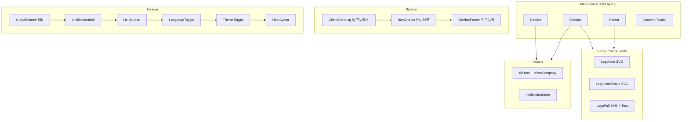
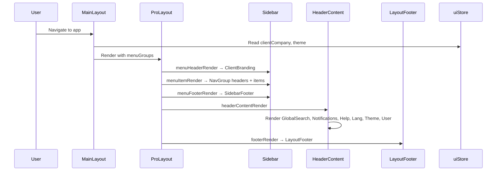

# Design Document: UI/UX Redesign (ui-ux-redesign)

## Overview

基于 Figma AI 设计参考，选择性升级问视间 (SuperInsight) 平台的 UI/UX。核心改动包括：新 Logo SVG 系统、侧边栏分组导航、客户公司品牌（白标）、Header 增强（全局搜索 + 通知 + 帮助）、底部平台品牌栏、登录页重设计。保持现有技术栈（Ant Design v5 + ProLayout + SCSS Modules + Zustand）不变，不引入 Tailwind/shadcn/Lucide。

## Architecture



## Sequence Diagrams

### Main Layout Render Flow




## Components and Interfaces

### Component 1: Logo SVG System

**Purpose**: 替换现有简单 SVG，提供新的渐变 Logo（圆形 + W 形 + 数据标注概念）

**Interface**:
```typescript
// 新增 SVG 组件，替代 img 引用
interface LogoIconProps {
  size?: number;           // default 32
  className?: string;
}

interface LogoFullProps {
  height?: number;         // default 28
  showText?: boolean;      // default true
  className?: string;
}

// 三个变体组件
const LogoIcon: React.FC<LogoIconProps>       // 圆形渐变 + W
const LogoIconSimple: React.FC<LogoIconProps> // 圆角矩形背景 + W
const LogoFull: React.FC<LogoFullProps>       // Icon + "问视间 SuperInsight" 文字
```

**Responsibilities**:
- 内联 SVG，支持 CSS 变量控制颜色
- 支持 light/dark 主题自适应
- 替换 BrandLogo 中的 img 引用为 SVG 组件

### Component 2: Sidebar Navigation Grouping

**Purpose**: 将扁平菜单项按业务分类分组，添加分组标题

**Interface**:
```typescript
interface NavGroup {
  key: string;
  titleKey: string;        // i18n key: 'navGroup.workbench'
  items: MenuItem[];
}

interface MenuItem {
  path: string;
  nameKey: string;
  icon: React.ReactNode;
  access?: 'admin';
  children?: MenuItem[];
}

// 分组定义
const NAV_GROUPS: NavGroup[] = [
  { key: 'workbench',   titleKey: 'navGroup.workbench',   items: [dashboard, aiAssistant] },
  { key: 'dataManage',  titleKey: 'navGroup.dataManage',  items: [tasks, dataSync] },
  { key: 'aiCapability',titleKey: 'navGroup.aiCapability', items: [augmentation] },
  { key: 'qualitySec',  titleKey: 'navGroup.qualitySec',  items: [quality, security] },
  { key: 'system',      titleKey: 'navGroup.system',      items: [admin, billing, settings] },
];
```

**Responsibilities**:
- ProLayout `menuItemRender` 中识别 group header 类型并渲染分组标题
- 活跃项左侧蓝色边框 accent（`border-left: 3px solid #1890FF`）
- 折叠态隐藏分组标题，仅显示图标

### Component 3: ClientBranding

**Purpose**: 侧边栏顶部显示客户公司品牌（B2B 白标模式）

**Interface**:
```typescript
interface ClientCompany {
  name: string;
  nameEn: string;
  logo?: string;           // URL，无则用首字渐变头像
  label?: string;          // e.g. "Enterprise"
}

interface ClientBrandingProps {
  collapsed: boolean;
}

const ClientBranding: React.FC<ClientBrandingProps>
```

**Responsibilities**:
- 渲染客户 Logo（或首字渐变 Avatar）+ 公司名 + 标签
- 折叠态仅显示 Avatar
- 数据来源：`uiStore.clientCompany`

### Component 4: HeaderContent Enhancement

**Purpose**: 在现有 Header 基础上增加全局搜索、通知、帮助按钮

**Interface**:
```typescript
// GlobalSearch - 搜索框 + ⌘K 快捷键提示
interface GlobalSearchProps {
  onSearch: (query: string) => void;
}
const GlobalSearch: React.FC<GlobalSearchProps>

// NotificationBell - 通知铃铛 + 未读数 Badge
interface NotificationBellProps {
  count: number;
  onClick: () => void;
}
const NotificationBell: React.FC<NotificationBellProps>

// HelpButton - 帮助按钮
const HelpButton: React.FC
```

**Responsibilities**:
- GlobalSearch: Input 框 + `⌘K` 标签，点击或快捷键打开搜索 Modal
- NotificationBell: Badge 显示未读数，点击打开通知 Drawer
- HelpButton: 点击打开帮助文档链接
- 语言切换简化为紧凑 `中/EN` 按钮

### Component 5: LayoutFooter

**Purpose**: 底部显示 "Powered by 问视间 SuperInsight" 平台品牌

**Interface**:
```typescript
interface LayoutFooterProps {
  collapsed: boolean;
}
const LayoutFooter: React.FC<LayoutFooterProps>
```

**Responsibilities**:
- 显示 LogoIconSimple + "Powered by 问视间 SuperInsight"
- 折叠态仅显示小 Logo
- 版权信息：`© {year} SuperInsight`

### Component 6: Login Page Redesign

**Purpose**: 升级登录页视觉效果

**Responsibilities**:
- 动画渐变背景 blobs（CSS animation）
- 居中卡片 + LogoFull
- 保留现有 LoginForm 组件
- 添加社交登录占位（Google、Enterprise SSO）
- 清晰的排版层次

## Data Models

### ClientCompany Config (uiStore extension)

```typescript
// 扩展 uiStore
interface UIState {
  // ... existing fields
  clientCompany: ClientCompany | null;
  setClientCompany: (company: ClientCompany | null) => void;
}

interface ClientCompany {
  name: string;
  nameEn: string;
  logo?: string;
  label?: string;
}
```

### Notification Model

```typescript
interface Notification {
  id: string;
  type: 'info' | 'warning' | 'error' | 'success';
  titleKey: string;
  messageKey: string;
  read: boolean;
  createdAt: string;
  link?: string;
}
```


## Key Functions with Formal Specifications

### Function 1: buildMenuRoutes()

```typescript
function buildMenuRoutes(
  groups: NavGroup[],
  userRole: string,
  t: TFunction
): ProLayoutRoute[]
```

**Preconditions:**
- `groups` is non-empty array of valid NavGroup objects
- `userRole` is 'admin' | 'user'
- `t` is a valid i18next translation function

**Postconditions:**
- Returns flat array of ProLayout-compatible route objects with `type: 'group'` dividers
- Admin-only items filtered out when `userRole !== 'admin'`
- All `name` fields are translated via `t()`
- Original `groups` array is not mutated

### Function 2: renderSidebarHeader()

```typescript
function renderSidebarHeader(
  clientCompany: ClientCompany | null,
  collapsed: boolean,
  theme: 'light' | 'dark'
): React.ReactNode
```

**Preconditions:**
- `collapsed` is boolean
- `theme` is 'light' or 'dark'

**Postconditions:**
- If `clientCompany` is null, renders LogoIcon + "问视间" text
- If `clientCompany` exists and has `logo`, renders logo image
- If `clientCompany` exists without `logo`, renders gradient Avatar with first char of `name`
- When `collapsed === true`, only Avatar/Icon is shown (no text)

### Function 3: useGlobalSearch()

```typescript
function useGlobalSearch(): {
  isOpen: boolean;
  query: string;
  open: () => void;
  close: () => void;
  setQuery: (q: string) => void;
}
```

**Preconditions:** None (hook)

**Postconditions:**
- Registers `⌘K` / `Ctrl+K` keyboard shortcut on mount
- Cleans up listener on unmount
- `open()` sets `isOpen = true`
- `close()` resets `isOpen = false` and `query = ''`

## Algorithmic Pseudocode

### Menu Grouping Algorithm

```typescript
// Transform NavGroup[] → ProLayout route format with group dividers
function buildMenuRoutes(groups: NavGroup[], userRole: string, t: TFunction): ProLayoutRoute[] {
  const routes: ProLayoutRoute[] = [];

  for (const group of groups) {
    // Filter items by access role
    const visibleItems = group.items.filter(item => {
      if (item.access === 'admin') return userRole === 'admin';
      return true;
    });

    if (visibleItems.length === 0) continue;

    // Add group divider (rendered as section header in sidebar)
    routes.push({
      path: `/_group_${group.key}`,
      name: t(group.titleKey),
      hideInMenu: false,
      itemType: 'group', // custom flag for menuItemRender
    });

    // Add items under this group
    for (const item of visibleItems) {
      routes.push({
        path: item.path,
        name: t(`menu.${item.nameKey}`),
        icon: item.icon,
        routes: item.children?.map(child => ({
          path: child.path,
          name: t(`menu.${child.nameKey}`),
        })),
      });
    }
  }

  return routes;
}
```

### Keyboard Shortcut Registration

```typescript
// Register ⌘K / Ctrl+K for global search
function useGlobalSearchShortcut(onOpen: () => void): void {
  useEffect(() => {
    const handler = (e: KeyboardEvent) => {
      if ((e.metaKey || e.ctrlKey) && e.key === 'k') {
        e.preventDefault();
        onOpen();
      }
    };
    document.addEventListener('keydown', handler);
    return () => document.removeEventListener('keydown', handler);
  }, [onOpen]);
}
```

## Example Usage

```typescript
// MainLayout.tsx - 核心改动示例
import { LogoIcon, LogoFull } from '@/components/Brand/Logo';
import { ClientBranding } from '@/components/Layout/ClientBranding';
import { LayoutFooter } from '@/components/Layout/LayoutFooter';
import { NAV_GROUPS, buildMenuRoutes } from '@/config/navGroups';

export const MainLayout: React.FC = () => {
  const { clientCompany, sidebarCollapsed } = useUIStore();
  const { user } = useAuthStore();
  const { t } = useTranslation('common');

  const routes = useMemo(
    () => buildMenuRoutes(NAV_GROUPS, user?.role ?? 'user', t),
    [user?.role, t]
  );

  return (
    <ProLayout
      logo={<LogoIcon size={28} />}
      title="问视间"
      menuHeaderRender={() => (
        <ClientBranding collapsed={sidebarCollapsed} />
      )}
      route={{ path: '/', routes }}
      menuItemRender={(item, dom) => {
        if (item.itemType === 'group') {
          return <div className="nav-group-header">{item.name}</div>;
        }
        return <div onClick={() => navigate(item.path!)}>{dom}</div>;
      }}
      footerRender={() => <LayoutFooter collapsed={sidebarCollapsed} />}
      headerContentRender={() => <HeaderContent />}
    >
      <Outlet />
    </ProLayout>
  );
};
```

## Error Handling

### Logo Load Failure
**Condition**: SVG 组件渲染失败（极少见，内联 SVG）
**Response**: 回退到文字 "问" 的 Avatar
**Recovery**: 无需恢复，纯展示

### Client Company Config Missing
**Condition**: `clientCompany` 为 null
**Response**: 侧边栏顶部显示默认 SuperInsight Logo + 品牌名
**Recovery**: 管理员可在设置中配置客户公司信息

### Notification API Failure
**Condition**: 通知接口请求失败
**Response**: Badge 显示 0，不阻塞其他功能
**Recovery**: 静默重试，30s 间隔

### Global Search Empty State
**Condition**: 搜索无结果
**Response**: 显示空状态提示
**Recovery**: 用户修改搜索词

## Testing Strategy

### Unit Testing
- `buildMenuRoutes`: 验证分组、权限过滤、翻译
- `ClientBranding`: 有/无 logo、折叠/展开状态
- `GlobalSearch`: 快捷键注册/注销
- Logo SVG 组件：渲染、尺寸 props

### Property-Based Testing
**Library**: fast-check
- `buildMenuRoutes` 对任意 NavGroup[] 输入不抛异常
- 过滤后的路由数 ≤ 原始项数
- admin 项在 userRole='user' 时不出现

### Integration Testing
- MainLayout 完整渲染：侧边栏分组 + Header 增强 + Footer
- 主题切换：light/dark 下所有新组件样式正确
- 响应式：折叠态下组件正确降级

## Performance Considerations

- Logo 使用内联 SVG 而非 img，避免额外网络请求
- `buildMenuRoutes` 结果用 `useMemo` 缓存，依赖 `[user.role, t]`
- 通知轮询使用 30s 间隔，非实时 WebSocket（初期简化）
- GlobalSearch Modal 使用 `React.lazy` 延迟加载

## Security Considerations

- `clientCompany.logo` URL 需验证为合法图片 URL（防 XSS）
- 通知内容使用 i18n key 而非原始 HTML（防注入）
- 全局搜索查询需 sanitize 后发送到后端

## Dependencies

- 无新外部依赖，全部基于现有技术栈：
  - `@ant-design/pro-components` (ProLayout)
  - `antd` (Badge, Avatar, Input, Drawer, Modal)
  - `@ant-design/icons`
  - `zustand`
  - `react-i18next`
  - `react-router-dom`


## Correctness Properties

*A property is a characteristic or behavior that should hold true across all valid executions of a system — essentially, a formal statement about what the system should do. Properties serve as the bridge between human-readable specifications and machine-verifiable correctness guarantees.*

### Property 1: LogoIcon renders at specified size

*For any* valid size value passed to LogoIcon, the rendered SVG element's width and height attributes SHALL equal that size value.

**Validates: Requirement 1.1**

### Property 2: buildMenuRoutes produces correct structure with role-based filtering

*For any* NavGroup[] input and userRole, the output of buildMenuRoutes SHALL be a flat array where: (a) each group with visible items has exactly one group divider followed by its visible items, (b) no item with access='admin' appears when userRole is 'user', and (c) groups with zero visible items after filtering produce no divider entry.

**Validates: Requirements 2.1, 2.2, 2.3**

### Property 3: buildMenuRoutes does not mutate input

*For any* NavGroup[] input, calling buildMenuRoutes SHALL leave the original array deeply equal to its state before the call.

**Validates: Requirement 2.6**

### Property 4: ClientBranding renders correct visual based on logo presence

*For any* ClientCompany object, if a logo URL is present the rendered output SHALL contain an img element with that URL and the company name text; if no logo URL is present the rendered output SHALL contain an Avatar displaying the first character of the company name.

**Validates: Requirements 3.1, 3.2**

### Property 5: Collapsed mode hides text across branding components

*For any* ClientCompany configuration (including null) with collapsed=true, the ClientBranding component SHALL render no visible text content — only the Avatar or Icon element.

**Validates: Requirement 3.4**

### Property 6: GlobalSearch close resets query state

*For any* non-empty query string in the GlobalSearch state, calling close() SHALL result in isOpen=false and query=''.

**Validates: Requirement 4.2**

### Property 7: NotificationBell displays correct badge count

*For any* non-negative integer count passed to NotificationBell, the rendered Badge SHALL display that exact count value.

**Validates: Requirement 4.4**

### Property 8: Client logo URL validation rejects malicious inputs

*For any* string that is not a valid HTTP/HTTPS image URL (including javascript:, data:text/html, and other non-image schemes), the ClientBranding URL validator SHALL reject it and fall back to the gradient Avatar.

**Validates: Requirement 7.1**

### Property 9: Global search query sanitization

*For any* input string containing HTML tags or script injection patterns, the GlobalSearch sanitizer SHALL produce an output string with all dangerous content removed or escaped.

**Validates: Requirement 7.3**
