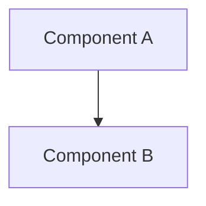
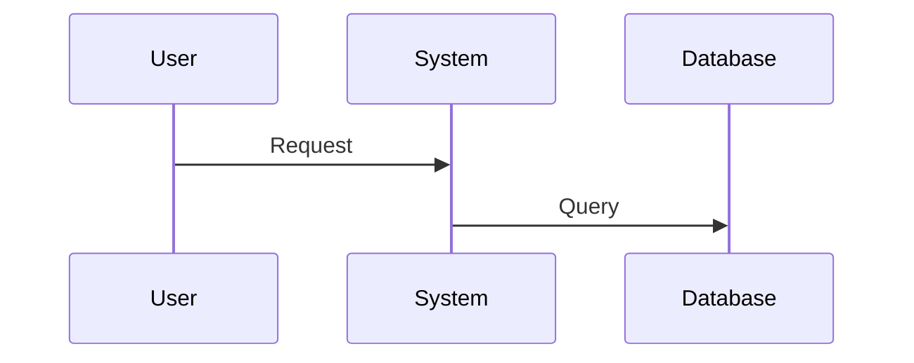

# Documentation-First Development Workflow

**Version**: 1.0  
**Status**: ✅ Active  
**Last Updated**: 2026-01-16

## Overview

This steering file enforces a strict **documentation-first development methodology** for the SuperInsight project, inspired by the SPEC-PIV hybrid approach. All code changes MUST be preceded by documentation updates to ensure alignment between specifications and implementation.

## Core Principles

### 1. Documentation Before Code
- **NEVER** modify code without updating documentation first
- **ALWAYS** verify documentation-code alignment before proceeding
- **ENFORCE** documentation review as a prerequisite for implementation

### 2. Single Responsibility Per Document
- **requirements.md**: User stories, acceptance criteria (EARS notation), priorities
- **design.md**: Architecture diagrams, technical decisions, UML/sequence diagrams
- **tasks.md**: Atomic task breakdown, time estimates, dependencies
- **CHANGELOG.md**: Version history (SemVer format), categorized changes

### 3. No Redundancy
- Use cross-references instead of duplication (e.g., "See design.md Section 3.2")
- Maintain clear hierarchy: H1 for modules, H2 for features, H3 for details
- Use tables and bullet points for structured information

### 4. Context-Aware Document Size
- **Target**: <10,000 tokens per file (AI context limit consideration)
- **Action**: Auto-split into sub-documents when threshold exceeded
- **Index**: Create master index.md with navigation table

## Workflow Stages

### Stage 1: Prime (Context Loading)
```
1. Load existing specs from .kiro/specs/{feature}/
2. Load related code from src/ and frontend/
3. Run alignment check:
   - Compare requirements vs code
   - Compare design vs implementation
   - Generate diff report if misaligned
4. BLOCK if misalignment detected → Fix docs first
```

### Stage 2: Document Update (MANDATORY Before Code)
```
For ANY task (feature/optimization/bugfix):

A. Update requirements.md
   - Add/modify user stories
   - Define acceptance criteria (EARS format)
   - Set priority (P0/P1/P2)
   
B. Update design.md
   - Add design decisions
   - Create/update diagrams (Mermaid)
   - Define interfaces and data models
   
C. Update tasks.md
   - Break down into atomic tasks
   - Add time estimates
   - Define dependencies
   
D. Update CHANGELOG.md
   - Add to [Unreleased] section
   - Categorize: Added/Changed/Fixed/Deprecated
   - Use SemVer versioning
   
E. Verify no redundancy
   - Run diff check across docs
   - Ensure cross-references used
   - Validate document structure
```

### Stage 3: Code Modification (Only After Docs Approved)
```
1. Verify all docs updated and reviewed
2. Execute code changes in sandbox
3. Write tests (unit + property-based)
4. Re-verify doc-code alignment
5. Run automated diff/static analysis
```

### Stage 4: Validate
```
1. Documentation Review
   - Clarity check
   - Completeness check
   - Redundancy check
   
2. Code Testing
   - Unit tests pass
   - Integration tests pass
   - Property-based tests pass
   
3. Alignment Report
   - Generate doc-code alignment report
   - Check document sizes
   - Trigger split if needed
```

### Stage 5: Monitor & Iterate
```
Every 5 changes:
1. Run global documentation audit
2. Check context length (<32K tokens per file)
3. Verify index completeness
4. Archive old versions to archive/ folder
```

## Document Structure Standards

### requirements.md Template
```markdown
# {Feature Name} - Requirements

## 1. User Stories

### 1.1 {Story Name}
**As a** {role}  
**I want** {capability}  
**So that** {benefit}

**Priority**: P0/P1/P2  
**Acceptance Criteria** (EARS):
- WHEN {condition}, THEN {expected result}
- IF {condition}, THEN {expected result}
- WHERE {condition}, THEN {expected result}

## 2. Non-Functional Requirements
- Performance: {metrics}
- Security: {requirements}
- Scalability: {requirements}

## 3. Dependencies
- Depends on: {other requirements}
- Blocks: {other requirements}
```

### design.md Template
```markdown
# {Feature Name} - Design

## 1. Architecture Overview


## 2. Component Design

### 2.1 {Component Name}
**Responsibility**: {description}  
**Interfaces**: {API definitions}  
**Data Models**: {schema}

## 3. Technical Decisions
- **Decision**: {what}
- **Rationale**: {why}
- **Alternatives Considered**: {options}

## 4. Sequence Diagrams


## 5. Correctness Properties
1. Property 1: {formal specification}
2. Property 2: {formal specification}
```

### tasks.md Template
```markdown
# {Feature Name} - Tasks

## Task Breakdown

- [ ] 1. {Task Name} (Est: {hours}h)
  - [ ] 1.1 {Subtask} (Est: {hours}h)
  - [ ] 1.2 {Subtask} (Est: {hours}h)
  - **Dependencies**: Task 2
  - **Validates**: Requirements 1.1, 1.2

- [ ] 2. {Task Name} (Est: {hours}h)
  - [ ] 2.1 {Subtask} (Est: {hours}h)

## Progress Tracking
- Total Tasks: {count}
- Completed: {count}
- In Progress: {count}
- Blocked: {count}
```

### CHANGELOG.md Template
```markdown
# Changelog

## [Unreleased]

### Added
- New feature X (#123)

### Changed
- Modified behavior Y (#124)

### Fixed
- Bug fix Z (#125)

### Deprecated
- Old API endpoint (#126)

## [1.2.0] - 2026-01-15

### Added
- Feature A
```

## Document Splitting Strategy

### When to Split
- Document exceeds 10,000 tokens
- Logical module boundaries exist
- Multiple teams working on different sections

### How to Split
```
Original: requirements.md (15,000 tokens)

Split into:
- requirements-core.md (5,000 tokens)
- requirements-ai.md (5,000 tokens)
- requirements-security.md (5,000 tokens)
- requirements-index.md (500 tokens)
```

### Index Format
```markdown
# {Feature Name} - Requirements Index

| Document | Description | Last Updated | Related Modules |
|----------|-------------|--------------|-----------------|
| [requirements-core.md](./requirements-core.md) | Core functionality requirements | 2026-01-15 | Core, API |
| [requirements-ai.md](./requirements-ai.md) | AI/ML requirements | 2026-01-15 | AI, LLM |
| [requirements-security.md](./requirements-security.md) | Security requirements | 2026-01-15 | Security, Audit |

## Quick Navigation
- Core Features: See requirements-core.md
- AI Features: See requirements-ai.md
- Security: See requirements-security.md
```

## Automation Hooks

### Hook 1: Block Direct Code Changes
```json
{
  "name": "Enforce Doc-First",
  "when": {
    "type": "fileEdited",
    "patterns": ["src/**/*.py", "frontend/src/**/*.tsx"]
  },
  "then": {
    "type": "askAgent",
    "prompt": "STOP! Documentation must be updated first. Have you updated requirements.md, design.md, and tasks.md for this change?"
  }
}
```

### Hook 2: Auto-Generate Doc Updates
```bash
# Command: /doc-update [task-description]
# Action: Generate documentation updates for specified task
```

### Hook 3: Create/Update Index
```bash
# Command: /doc-index [feature-name]
# Action: Create or update index.md for feature documentation
```

## Validation Commands

### Check Documentation-Code Alignment
```bash
# Run alignment check
python scripts/check_doc_alignment.py --feature {feature-name}

# Output: Alignment report with mismatches
```

### Check Document Size
```bash
# Check token count
python scripts/check_doc_size.py --path .kiro/specs/{feature}/

# Output: Token counts and split recommendations
```

### Audit Documentation Quality
```bash
# Run quality audit
python scripts/audit_docs.py --feature {feature-name}

# Checks:
# - Clarity (readability score)
# - Completeness (required sections present)
# - Redundancy (duplicate content detection)
# - Cross-references (broken links)
```

## Example Workflow

### Scenario: Optimize Audit System Performance

#### Step 1: Prime
```
✓ Load .kiro/specs/audit-security/
✓ Load src/security/audit_service.py
✓ Run alignment check
✗ MISALIGNMENT DETECTED:
  - design.md mentions "batch processing" but code uses single inserts
  - requirements.md specifies <50ms but current avg is 120ms
  
ACTION: Fix documentation first to reflect current state
```

#### Step 2: Update Documentation
```
A. requirements.md
   - Update 1.3: Change "<50ms" to "<30ms" (new target)
   - Add 1.4: Batch processing requirement
   
B. design.md
   - Add Section 3.2: Batch Processing Architecture
   - Add Mermaid diagram showing batch flow
   - Document technical decision: "Use 1000 records/batch"
   
C. tasks.md
   - Add Task 5: Implement batch processing (Est: 8h)
     - 5.1: Create batch collector (2h)
     - 5.2: Implement batch writer (3h)
     - 5.3: Add performance tests (3h)
   
D. CHANGELOG.md
   - Add to [Unreleased] > Changed:
     "Optimized audit logging with batch processing (1000 records/batch)"
```

#### Step 3: Code Modification
```
✓ Documentation approved
✓ Implement batch processing in audit_service.py
✓ Write unit tests
✓ Write property-based tests
✓ Re-verify alignment
```

#### Step 4: Validate
```
✓ Documentation review: Clear, complete, no redundancy
✓ Tests pass: 100% coverage
✓ Alignment report: 100% aligned
✓ Performance: <30ms achieved
```

## Enforcement Rules

### MUST Rules
1. **MUST** update docs before code
2. **MUST** use EARS notation for acceptance criteria
3. **MUST** create diagrams for complex designs
4. **MUST** break tasks into <8h chunks
5. **MUST** update CHANGELOG for all changes
6. **MUST** verify no redundancy across docs
7. **MUST** split docs exceeding 10K tokens

### SHOULD Rules
1. **SHOULD** use Mermaid for diagrams
2. **SHOULD** cross-reference instead of duplicate
3. **SHOULD** run alignment check every 5 changes
4. **SHOULD** archive old versions quarterly

### MUST NOT Rules
1. **MUST NOT** modify code without doc updates
2. **MUST NOT** duplicate content across docs
3. **MUST NOT** exceed 32K tokens per file
4. **MUST NOT** skip validation stage

## Metrics & Monitoring

### Track These Metrics
- Documentation-code alignment score (target: 100%)
- Average document size (target: <10K tokens)
- Documentation update frequency (target: before every code change)
- Redundancy score (target: <5%)
- Time from doc update to code change (target: <1 day)

### Monthly Audit Checklist
- [ ] All features have complete docs (requirements, design, tasks)
- [ ] No documents exceed 10K tokens
- [ ] All cross-references valid
- [ ] CHANGELOG up to date
- [ ] No redundant content detected
- [ ] Alignment score >95%

## Tools & Scripts

### Available Tools
1. `scripts/check_doc_alignment.py` - Verify doc-code alignment
2. `scripts/check_doc_size.py` - Check document token counts
3. `scripts/audit_docs.py` - Comprehensive documentation audit
4. `scripts/split_doc.py` - Auto-split large documents
5. `scripts/generate_index.py` - Create navigation index

### Integration with Kiro
- Hooks automatically enforce doc-first workflow
- Commands available: `/doc-update`, `/doc-index`, `/doc-audit`
- Real-time validation during development

## References

- [Habit Tracker Methodology](https://github.com/coleam00/habit-tracker.git)
- [EARS Notation Guide](https://www.iaria.org/conferences2012/filesICCGI12/ICCGI_2012_Tutorial_Terzakis.pdf)
- [SemVer Specification](https://semver.org/)
- [Keep a Changelog](https://keepachangelog.com/)

---

**This workflow is MANDATORY for all SuperInsight development.**  
**Violations will result in PR rejection and rework.**
