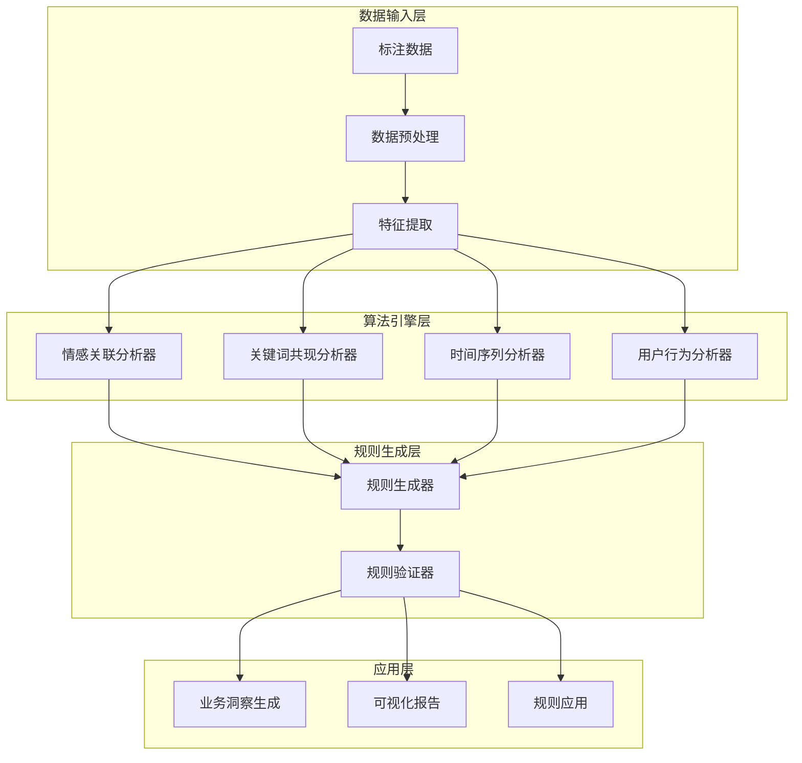

# SuperInsight 业务逻辑提炼与智能化功能文档

## 概述

SuperInsight 平台的业务逻辑提炼与智能化功能是一套完整的智能分析系统，能够从标注数据中自动识别和提炼业务规则、模式和洞察。该功能通过先进的机器学习算法和自然语言处理技术，帮助企业发现隐藏在数据中的业务价值。

## 核心功能

### 🧠 智能模式识别
- **情感关联分析**: 分析情感与关键词、用户行为的关联性
- **关键词共现分析**: 识别关键词之间的共现模式和语义关联
- **时间序列趋势分析**: 发现数据随时间变化的趋势和季节性模式
- **用户行为模式识别**: 分析用户标注行为的模式和特征

### 📊 业务规则自动生成
- **基于频率的规则生成**: 从高频模式中提取业务规则
- **机器学习驱动的规则**: 使用决策树等算法生成分类规则
- **时序规则**: 识别时间相关的业务模式
- **异常检测规则**: 自动识别异常模式并生成相应规则

### 📈 实时业务洞察
- **变化趋势跟踪**: 监控业务逻辑的变化趋势
- **智能通知系统**: 当发现重要变化时自动通知相关人员
- **可视化报告**: 生成直观的业务逻辑图表和报告

### 🔧 规则管理与应用
- **规则导出与导入**: 支持多种格式的规则导出
- **规则应用**: 将提取的规则应用到新项目
- **规则验证**: 自动验证规则的有效性和准确性

## 技术架构



## 快速开始

### 1. 基本使用

```python
from src.business_logic.api import BusinessLogicService

# 创建服务实例
service = BusinessLogicService()

# 分析业务模式
analysis_request = {
    "project_id": "your_project_id",
    "analysis_types": ["sentiment_correlation", "keyword_cooccurrence"],
    "min_confidence": 0.7
}

result = await service.analyze_patterns(analysis_request)
print(f"发现 {len(result.patterns)} 个业务模式")
```

### 2. 提取业务规则

```python
# 提取业务规则
extraction_request = {
    "project_id": "your_project_id",
    "rule_types": ["association", "classification"],
    "min_support": 5,
    "min_confidence": 0.8
}

rules = await service.extract_business_rules(extraction_request)
print(f"提取了 {len(rules.rules)} 个业务规则")
```

### 3. 生成可视化报告

```python
# 生成可视化
viz_request = {
    "project_id": "your_project_id",
    "visualization_type": "rule_network",
    "include_metrics": True
}

visualization = await service.generate_visualization(viz_request)
```

## API 参考

### 核心 API 端点

| 端点 | 方法 | 描述 |
|------|------|------|
| `/api/business-logic/analyze` | POST | 分析业务模式 |
| `/api/business-logic/rules/{project_id}` | GET | 获取业务规则 |
| `/api/business-logic/rules/extract` | POST | 提取业务规则 |
| `/api/business-logic/patterns/{project_id}` | GET | 获取业务模式 |
| `/api/business-logic/visualization` | POST | 生成可视化 |
| `/api/business-logic/export` | POST | 导出业务逻辑 |
| `/api/business-logic/apply` | POST | 应用业务规则 |

详细的 API 文档请参考 [API 参考文档](api-reference.md)。

## 算法原理

### 情感关联分析
使用 TF-IDF 和自然语言处理技术分析情感与关键词的关联性：

1. **文本预处理**: 使用 spaCy 和 NLTK 进行词性标注和命名实体识别
2. **特征提取**: 提取关键词、情感标签和语义特征
3. **关联计算**: 计算情感与关键词的共现频率和 PMI 分数
4. **统计验证**: 使用卡方检验验证关联的显著性

### 关键词共现分析
基于滑动窗口和网络分析的关键词共现模式识别：

1. **共现矩阵构建**: 在指定窗口内计算词汇共现频率
2. **PMI 计算**: 使用点互信息量化词汇关联强度
3. **网络构建**: 构建关键词网络图
4. **社区检测**: 使用 Louvain 算法识别关键词社区

### 时间序列分析
多层次的时间序列趋势分析：

1. **趋势检测**: 使用线性回归和移动平均检测长期趋势
2. **季节性分析**: 识别周期性模式（日、周、月）
3. **异常检测**: 使用 IQR 方法检测异常值
4. **预测建模**: 基于历史数据预测未来趋势

详细的算法原理请参考 [算法原理文档](algorithm-principles.md)。

## 使用指南

### 业务分析师指南
- [业务模式识别指南](user-guides/business-analyst-guide.md)
- [规则解读与应用](user-guides/rule-interpretation.md)
- [报告生成与分析](user-guides/report-generation.md)

### 技术人员指南
- [系统集成指南](user-guides/integration-guide.md)
- [自定义算法开发](user-guides/custom-algorithms.md)
- [性能优化指南](user-guides/performance-optimization.md)

### 管理员指南
- [系统配置指南](user-guides/admin-configuration.md)
- [监控与维护](user-guides/monitoring-maintenance.md)
- [故障排查指南](troubleshooting.md)

## 最佳实践

### 数据准备
1. **数据质量**: 确保标注数据的质量和一致性
2. **数据量**: 建议至少有 100 条标注数据才能获得有意义的分析结果
3. **数据多样性**: 包含不同类型、不同时间段的数据

### 参数调优
1. **置信度阈值**: 根据业务需求调整最小置信度（建议 0.6-0.8）
2. **支持度阈值**: 根据数据量调整最小支持度（建议 3-10）
3. **分析类型**: 根据具体需求选择合适的分析类型

### 结果解读
1. **置信度解读**: 置信度越高，规则越可靠
2. **支持度解读**: 支持度反映规则的普遍性
3. **提升度解读**: 提升度 > 1 表示正相关，< 1 表示负相关

## 性能指标

### 分析性能
- **小数据集** (< 1000 条): < 5 秒
- **中等数据集** (1000-10000 条): < 30 秒
- **大数据集** (> 10000 条): < 2 分钟

### 准确性指标
- **规则准确率**: > 85%
- **模式识别准确率**: > 80%
- **趋势预测准确率**: > 75%

## 版本历史

### v1.0.0 (2026-01-05)
- ✅ 核心业务逻辑提炼功能
- ✅ 四大智能分析算法
- ✅ 完整的 API 接口
- ✅ 前端可视化界面
- ✅ 规则导出与应用功能

## 支持与反馈

如果您在使用过程中遇到问题或有改进建议，请：

1. 查看 [故障排查指南](troubleshooting.md)
2. 查看 [常见问题](faq.md)
3. 联系技术支持团队

---

**SuperInsight 业务逻辑提炼与智能化功能** - 让数据洞察触手可及