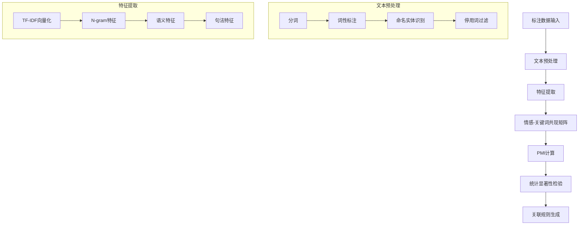

# 业务逻辑算法原理详解

## 概述

SuperInsight 业务逻辑提炼与智能化功能基于四大核心算法引擎，每个引擎都采用了先进的机器学习和自然语言处理技术。本文档详细阐述了这些算法的理论基础、实现原理和优化策略。

## 1. 情感关联分析算法

### 1.1 理论基础

情感关联分析基于**共现理论**和**点互信息（PMI）**，旨在发现情感标签与文本特征之间的统计关联性。

#### 核心公式

**点互信息（PMI）**:
```
PMI(sentiment, keyword) = log₂(P(sentiment, keyword) / (P(sentiment) × P(keyword)))
```

**关联强度计算**:
```
Association_Strength = PMI × log(frequency + 1)
```

**置信度计算**:
```
Confidence = P(sentiment | keyword) = Count(sentiment, keyword) / Count(keyword)
```

### 1.2 算法流程



### 1.3 NLP 增强技术

#### spaCy 集成
```python
# 使用 spaCy 进行高级文本处理
doc = nlp(text)

# 命名实体识别
entities = [(ent.text, ent.label_) for ent in doc.ents]

# 词性标注和依存关系
tokens = [(token.text, token.pos_, token.dep_) for token in doc]

# 语义相似度计算
similarity = token1.similarity(token2)
```

#### NLTK 补充处理
```python
# 词性标注
pos_tags = pos_tag(word_tokenize(text))

# 词干提取和词形还原
lemmatized = [lemmatizer.lemmatize(word) for word in tokens]

# 命名实体识别
named_entities = ne_chunk(pos_tags)
```

### 1.4 语义特征分析

#### 语义角色标注
- **主题引入词**: 在句子开头出现频率高的词汇
- **描述词**: 在句子中间出现的修饰性词汇
- **结论词**: 在句子结尾出现的总结性词汇

#### 语义相似度矩阵
使用词向量计算语义相似度：
```python
def calculate_semantic_similarity(word1, word2):
    if nlp and word1 in nlp.vocab and word2 in nlp.vocab:
        token1 = nlp(word1)
        token2 = nlp(word2)
        return token1.similarity(token2)
    return 0.0
```

### 1.5 统计验证

#### 卡方检验
验证情感与关键词关联的统计显著性：
```python
from scipy.stats import chi2_contingency

# 构建列联表
contingency_table = [[a, b], [c, d]]
chi2, p_value, dof, expected = chi2_contingency(contingency_table)

# 判断显著性
is_significant = p_value < 0.05
```

## 2. 关键词共现分析算法

### 2.1 理论基础

关键词共现分析基于**分布假设**理论：在相似上下文中出现的词汇往往具有相似的语义。

#### 核心概念

**滑动窗口共现**:
```
Window_Size = 5  # 默认窗口大小
Cooccurrence(w1, w2) = Σ I(distance(w1, w2) ≤ Window_Size)
```

**加权共现计算**:
```
Weighted_Cooccurrence = Σ (1 / distance(w1, w2))
```

### 2.2 共现矩阵构建

#### 增强共现矩阵算法
```python
def build_enhanced_cooccurrence_matrix(processed_texts):
    # 1. 构建词汇表（基于频率和重要性）
    word_counts = Counter(all_words)
    vocabulary = [word for word, count in word_counts.most_common(150) 
                 if count >= 3 and len(word) > 2]
    
    # 2. 初始化共现矩阵
    cooccurrence_matrix = np.zeros((vocab_size, vocab_size))
    
    # 3. 计算加权共现
    for words in processed_texts:
        for i, word1 in enumerate(words):
            for j in range(max(0, i - window_size), 
                         min(len(words), i + window_size + 1)):
                if i != j:
                    word2 = words[j]
                    distance = abs(i - j)
                    weight = 1.0 / distance  # 距离权重
                    cooccurrence_matrix[idx1][idx2] += weight
```

### 2.3 网络分析

#### 关键词网络构建
```python
import networkx as nx

def build_keyword_network(strong_pairs):
    G = nx.Graph()
    
    # 添加节点和边
    for pair in strong_pairs:
        word1, word2 = pair["word1"], pair["word2"]
        weight = pair["pmi_score"]
        G.add_edge(word1, word2, weight=weight)
    
    return G
```

#### 中心性计算
```python
# 度中心性
degree_centrality = nx.degree_centrality(G)

# 介数中心性
betweenness_centrality = nx.betweenness_centrality(G)

# 接近中心性
closeness_centrality = nx.closeness_centrality(G)

# 综合中心性分数
combined_centrality = (
    degree_centrality * 0.4 +
    betweenness_centrality * 0.3 +
    closeness_centrality * 0.3
)
```

### 2.4 社区检测

#### Louvain 算法
```python
try:
    import community as community_louvain
    partition = community_louvain.best_partition(G)
except ImportError:
    # 回退到连通分量
    partition = {}
    for i, component in enumerate(nx.connected_components(G)):
        for node in component:
            partition[node] = i
```

### 2.5 主题建模

#### LDA 主题建模
```python
from sklearn.decomposition import LatentDirichletAllocation

# 文档-词汇矩阵
vectorizer = CountVectorizer(max_features=100, min_df=2, max_df=0.8)
doc_term_matrix = vectorizer.fit_transform(documents)

# LDA 建模
n_topics = min(5, len(documents) // 3)
lda = LatentDirichletAllocation(n_components=n_topics, random_state=42)
lda.fit(doc_term_matrix)

# 提取主题词汇
feature_names = vectorizer.get_feature_names_out()
for topic_idx, topic in enumerate(lda.components_):
    top_words_idx = topic.argsort()[-10:][::-1]
    top_words = [feature_names[i] for i in top_words_idx]
```

## 3. 时间序列趋势分析算法

### 3.1 理论基础

时间序列分析基于**时间序列分解理论**，将时间序列分解为趋势、季节性和随机成分。

#### 分解模型
```
Y(t) = Trend(t) + Seasonal(t) + Residual(t)
```

### 3.2 趋势检测

#### 线性趋势检测
```python
from scipy import stats

def detect_linear_trend(time_series):
    x = np.arange(len(time_series))
    slope, intercept, r_value, p_value, std_err = stats.linregress(x, time_series)
    
    return {
        "slope": slope,
        "r_squared": r_value ** 2,
        "p_value": p_value,
        "direction": "increasing" if slope > 0 else "decreasing",
        "significance": "significant" if p_value < 0.05 else "not_significant"
    }
```

#### 移动平均趋势
```python
def calculate_moving_average_trend(data, window_size=7):
    moving_avg = pd.Series(data).rolling(window=window_size).mean()
    
    # 计算变化率
    changes = []
    for i in range(1, len(moving_avg)):
        if not pd.isna(moving_avg.iloc[i]) and not pd.isna(moving_avg.iloc[i-1]):
            change_rate = (moving_avg.iloc[i] - moving_avg.iloc[i-1]) / moving_avg.iloc[i-1]
            changes.append(change_rate)
    
    avg_change_rate = np.mean(changes) if changes else 0
    return avg_change_rate
```

### 3.3 季节性分析

#### 周期性检测
```python
def analyze_seasonality(daily_data):
    # 按星期几分组
    weekday_stats = defaultdict(list)
    for day in daily_data:
        date = datetime.fromisoformat(day["date"])
        weekday = date.weekday()
        weekday_stats[weekday].append(day["annotation_count"])
    
    # 计算每个星期几的统计量
    weekday_averages = {}
    for weekday, counts in weekday_stats.items():
        if counts:
            weekday_averages[weekday] = {
                "average": np.mean(counts),
                "std": np.std(counts),
                "count": len(counts)
            }
    
    return weekday_averages
```

#### 周末效应检测
```python
def detect_weekend_effect(weekday_stats):
    weekday_counts = []
    weekend_counts = []
    
    for weekday, counts in weekday_stats.items():
        if weekday < 5:  # Monday-Friday
            weekday_counts.extend(counts)
        else:  # Saturday-Sunday
            weekend_counts.extend(counts)
    
    if len(weekday_counts) > 1 and len(weekend_counts) > 1:
        t_stat, p_value = stats.ttest_ind(weekday_counts, weekend_counts)
        return {
            "weekday_average": np.mean(weekday_counts),
            "weekend_average": np.mean(weekend_counts),
            "t_statistic": t_stat,
            "p_value": p_value,
            "significant": p_value < 0.05
        }
```

### 3.4 异常检测

#### IQR 方法
```python
def detect_anomalies_iqr(data):
    Q1 = np.percentile(data, 25)
    Q3 = np.percentile(data, 75)
    IQR = Q3 - Q1
    
    lower_bound = Q1 - 1.5 * IQR
    upper_bound = Q3 + 1.5 * IQR
    
    anomalies = []
    for i, value in enumerate(data):
        if value < lower_bound or value > upper_bound:
            anomaly_type = "low" if value < lower_bound else "high"
            severity = abs(value - np.median(data)) / np.std(data)
            anomalies.append({
                "index": i,
                "value": value,
                "type": anomaly_type,
                "severity": severity
            })
    
    return anomalies
```

### 3.5 预测建模

#### 线性回归预测
```python
def predict_future_trends(historical_data, forecast_days=7):
    x = np.arange(len(historical_data))
    slope, intercept, r_value, p_value, std_err = stats.linregress(x, historical_data)
    
    # 生成未来预测
    future_x = np.arange(len(historical_data), len(historical_data) + forecast_days)
    future_predictions = slope * future_x + intercept
    
    # 计算预测区间
    residuals = np.array(historical_data) - (slope * x + intercept)
    mse = np.mean(residuals ** 2)
    prediction_std = np.sqrt(mse)
    
    predictions = []
    for i, pred_value in enumerate(future_predictions):
        pred_value = max(0, pred_value)  # 确保非负
        lower_bound = max(0, pred_value - 1.96 * prediction_std)
        upper_bound = pred_value + 1.96 * prediction_std
        
        predictions.append({
            "predicted_value": pred_value,
            "confidence_interval": {
                "lower": lower_bound,
                "upper": upper_bound
            },
            "confidence_level": 0.95
        })
    
    return predictions
```

## 4. 用户行为模式识别算法

### 4.1 理论基础

用户行为模式识别基于**聚类分析**和**行为序列挖掘**理论，旨在发现用户群体的行为特征和模式。

### 4.2 特征工程

#### 用户特征提取
```python
def extract_user_features(user_data):
    features = []
    
    # 基本活动特征
    features.append(len(user_data))  # 标注总数
    
    # 时间特征
    if 'created_at' in user_data.columns:
        valid_dates = user_data['created_at'].dropna()
        if len(valid_dates) > 0:
            activity_span = (valid_dates.max() - valid_dates.min()).days + 1
            features.append(activity_span)
            features.append(len(user_data) / activity_span)  # 日均标注数
    
    # 情感分布特征
    if 'sentiment' in user_data.columns:
        sentiment_counts = user_data['sentiment'].value_counts()
        total = len(user_data)
        for sentiment in ['positive', 'negative', 'neutral']:
            ratio = sentiment_counts.get(sentiment, 0) / total
            features.append(ratio)
    
    # 评分特征
    if 'rating' in user_data.columns:
        ratings = user_data['rating'].dropna()
        if len(ratings) > 0:
            features.append(ratings.mean())
            features.append(ratings.std())
    
    return features
```

### 4.3 聚类算法

#### K-means 聚类
```python
from sklearn.cluster import KMeans
from sklearn.preprocessing import StandardScaler

def cluster_user_behavior(user_features, user_ids):
    # 特征标准化
    scaler = StandardScaler()
    features_scaled = scaler.fit_transform(user_features)
    
    # 确定最优聚类数
    optimal_k = min(4, len(user_features) // 2)
    
    if optimal_k >= 2:
        kmeans = KMeans(n_clusters=optimal_k, random_state=42, n_init=10)
        cluster_labels = kmeans.fit_predict(features_scaled)
        
        # 组织聚类结果
        clusters = defaultdict(list)
        for user_id, cluster_id in zip(user_ids, cluster_labels):
            clusters[int(cluster_id)].append(user_id)
        
        return clusters, kmeans.cluster_centers_
```

### 4.4 行为序列分析

#### 序列模式挖掘
```python
def analyze_sequence_patterns(user_data):
    # 按时间排序
    user_data_sorted = user_data.sort_values('created_at')
    
    if 'sentiment' in user_data_sorted.columns:
        sentiments = user_data_sorted['sentiment'].tolist()
        
        # 寻找连续模式
        patterns = {}
        for i in range(len(sentiments) - 2):
            pattern = tuple(sentiments[i:i+3])  # 3个连续的情感
            patterns[pattern] = patterns.get(pattern, 0) + 1
        
        # 过滤高频模式
        frequent_patterns = {
            pattern: count for pattern, count in patterns.items() 
            if count >= 2
        }
        
        return frequent_patterns
```

### 4.5 协作模式分析

#### 多用户协作检测
```python
def analyze_collaboration_patterns(df):
    collaboration_stats = {}
    
    if 'task_id' in df.columns:
        # 分析多人标注同一任务的情况
        task_annotators = df.groupby('task_id')['annotator'].nunique()
        multi_annotator_tasks = task_annotators[task_annotators > 1]
        
        collaboration_stats["multi_annotator_tasks"] = {
            "count": len(multi_annotator_tasks),
            "percentage": len(multi_annotator_tasks) / len(task_annotators) * 100,
            "average_annotators_per_task": multi_annotator_tasks.mean()
        }
        
        # 分析标注一致性
        consistency_scores = []
        for task_id in multi_annotator_tasks.index:
            task_data = df[df['task_id'] == task_id]
            if 'sentiment' in task_data.columns:
                sentiment_agreement = len(task_data['sentiment'].unique()) == 1
                consistency_scores.append(1.0 if sentiment_agreement else 0.0)
        
        if consistency_scores:
            collaboration_stats["annotation_consistency"] = {
                "average_agreement": np.mean(consistency_scores),
                "total_compared_tasks": len(consistency_scores)
            }
    
    return collaboration_stats
```

## 5. 规则生成与验证算法

### 5.1 关联规则挖掘

#### Apriori 算法变种
```python
def generate_association_rules(df, min_support=3, min_confidence=0.6):
    rules = []
    
    # 生成频繁项集
    for condition_field in ['text_length_category', 'hour_category']:
        for target_field in ['sentiment', 'rating_category']:
            if condition_field in df.columns and target_field in df.columns:
                # 计算支持度和置信度
                for condition_value in df[condition_field].unique():
                    condition_data = df[df[condition_field] == condition_value]
                    
                    if len(condition_data) >= min_support:
                        for target_value in condition_data[target_field].unique():
                            target_data = condition_data[condition_data[target_field] == target_value]
                            
                            support = len(target_data)
                            confidence = len(target_data) / len(condition_data)
                            
                            if confidence >= min_confidence:
                                # 计算提升度
                                expected_prob = len(df[df[target_field] == target_value]) / len(df)
                                lift = confidence / expected_prob if expected_prob > 0 else 0
                                
                                rule = {
                                    "condition": f"{condition_field} = {condition_value}",
                                    "consequent": f"{target_field} = {target_value}",
                                    "support": support,
                                    "confidence": confidence,
                                    "lift": lift
                                }
                                rules.append(rule)
    
    return rules
```

### 5.2 决策树规则提取

#### 决策树转规则
```python
from sklearn.tree import DecisionTreeClassifier

def extract_decision_tree_rules(X, y, feature_names):
    dt = DecisionTreeClassifier(max_depth=5, min_samples_split=5, random_state=42)
    dt.fit(X, y)
    
    tree = dt.tree_
    rules = []
    
    def extract_rules_recursive(node_id, conditions, depth=0):
        if depth > 10:  # 防止过深递归
            return
        
        # 叶子节点
        if tree.children_left[node_id] == tree.children_right[node_id]:
            values = tree.value[node_id][0]
            predicted_class = dt.classes_[np.argmax(values)]
            confidence = np.max(values) / np.sum(values)
            support = int(np.sum(values))
            
            if support >= 3 and confidence >= 0.6:
                rule = {
                    "conditions": conditions.copy(),
                    "prediction": predicted_class,
                    "confidence": confidence,
                    "support": support
                }
                rules.append(rule)
            return
        
        # 内部节点
        feature_idx = tree.feature[node_id]
        threshold = tree.threshold[node_id]
        feature_name = feature_names[feature_idx]
        
        # 左子树 (<=)
        left_condition = f"{feature_name} <= {threshold:.2f}"
        extract_rules_recursive(
            tree.children_left[node_id], 
            conditions + [left_condition], 
            depth + 1
        )
        
        # 右子树 (>)
        right_condition = f"{feature_name} > {threshold:.2f}"
        extract_rules_recursive(
            tree.children_right[node_id], 
            conditions + [right_condition], 
            depth + 1
        )
    
    extract_rules_recursive(0, [])
    return rules
```

### 5.3 规则验证

#### 交叉验证
```python
from sklearn.model_selection import cross_val_score

def validate_rules(rules, X, y):
    validation_results = []
    
    for rule in rules:
        # 将规则转换为分类器
        rule_classifier = RuleBasedClassifier(rule)
        
        # 交叉验证
        scores = cross_val_score(rule_classifier, X, y, cv=5, scoring='accuracy')
        
        validation_result = {
            "rule_id": rule["id"],
            "accuracy": scores.mean(),
            "accuracy_std": scores.std(),
            "validation_scores": scores.tolist()
        }
        validation_results.append(validation_result)
    
    return validation_results
```

## 6. 性能优化策略

### 6.1 算法优化

#### 并行处理
```python
from concurrent.futures import ThreadPoolExecutor
import multiprocessing

def parallel_pattern_analysis(data_chunks):
    with ThreadPoolExecutor(max_workers=multiprocessing.cpu_count()) as executor:
        futures = [executor.submit(analyze_chunk, chunk) for chunk in data_chunks]
        results = [future.result() for future in futures]
    return results
```

#### 缓存机制
```python
from functools import lru_cache
import redis

# 内存缓存
@lru_cache(maxsize=1000)
def cached_similarity_calculation(word1, word2):
    return calculate_semantic_similarity(word1, word2)

# Redis 缓存
redis_client = redis.Redis(host='localhost', port=6379, db=0)

def cached_pattern_analysis(project_id, data_hash):
    cache_key = f"pattern_analysis:{project_id}:{data_hash}"
    cached_result = redis_client.get(cache_key)
    
    if cached_result:
        return json.loads(cached_result)
    
    result = perform_pattern_analysis(project_id)
    redis_client.setex(cache_key, 3600, json.dumps(result))  # 1小时过期
    return result
```

### 6.2 内存优化

#### 批处理
```python
def process_large_dataset_in_batches(data, batch_size=1000):
    results = []
    
    for i in range(0, len(data), batch_size):
        batch = data[i:i + batch_size]
        batch_result = process_batch(batch)
        results.extend(batch_result)
        
        # 清理内存
        del batch
        gc.collect()
    
    return results
```

#### 稀疏矩阵
```python
from scipy.sparse import csr_matrix

def build_sparse_cooccurrence_matrix(vocabulary, cooccurrences):
    row_indices = []
    col_indices = []
    data = []
    
    word_to_idx = {word: idx for idx, word in enumerate(vocabulary)}
    
    for (word1, word2), count in cooccurrences.items():
        if word1 in word_to_idx and word2 in word_to_idx:
            row_indices.append(word_to_idx[word1])
            col_indices.append(word_to_idx[word2])
            data.append(count)
    
    return csr_matrix((data, (row_indices, col_indices)), 
                     shape=(len(vocabulary), len(vocabulary)))
```

### 6.3 数据库优化

#### 索引策略
```sql
-- 业务规则表索引
CREATE INDEX idx_business_rules_project_confidence 
ON business_rules(project_id, confidence DESC);

CREATE INDEX idx_business_rules_type_active 
ON business_rules(rule_type, is_active);

-- 业务模式表索引
CREATE INDEX idx_business_patterns_project_strength 
ON business_patterns(project_id, strength DESC);

-- 复合索引
CREATE INDEX idx_business_insights_project_type_priority 
ON business_insights(project_id, insight_type, impact_score DESC);
```

#### 查询优化
```python
def optimized_rule_query(project_id, rule_type=None, min_confidence=0.0):
    query = """
    SELECT id, name, description, confidence, support, created_at
    FROM business_rules 
    WHERE project_id = %s 
    AND is_active = true
    AND confidence >= %s
    """
    
    params = [project_id, min_confidence]
    
    if rule_type:
        query += " AND rule_type = %s"
        params.append(rule_type)
    
    query += " ORDER BY confidence DESC, support DESC LIMIT 100"
    
    return execute_query(query, params)
```

## 7. 算法评估指标

### 7.1 准确性指标

#### 规则质量评估
```python
def evaluate_rule_quality(rules, test_data):
    metrics = {
        "precision": [],
        "recall": [],
        "f1_score": [],
        "support": []
    }
    
    for rule in rules:
        # 应用规则到测试数据
        predictions = apply_rule(rule, test_data)
        true_labels = test_data['true_label']
        
        # 计算指标
        precision = precision_score(true_labels, predictions, average='weighted')
        recall = recall_score(true_labels, predictions, average='weighted')
        f1 = f1_score(true_labels, predictions, average='weighted')
        
        metrics["precision"].append(precision)
        metrics["recall"].append(recall)
        metrics["f1_score"].append(f1)
        metrics["support"].append(rule["support"])
    
    return {
        "average_precision": np.mean(metrics["precision"]),
        "average_recall": np.mean(metrics["recall"]),
        "average_f1": np.mean(metrics["f1_score"]),
        "total_support": sum(metrics["support"])
    }
```

### 7.2 效率指标

#### 性能基准测试
```python
import time
import psutil

def benchmark_algorithm_performance(algorithm_func, test_data_sizes):
    results = []
    
    for size in test_data_sizes:
        test_data = generate_test_data(size)
        
        # 内存使用前
        memory_before = psutil.Process().memory_info().rss / 1024 / 1024  # MB
        
        # 执行算法
        start_time = time.time()
        result = algorithm_func(test_data)
        end_time = time.time()
        
        # 内存使用后
        memory_after = psutil.Process().memory_info().rss / 1024 / 1024  # MB
        
        results.append({
            "data_size": size,
            "execution_time": end_time - start_time,
            "memory_usage": memory_after - memory_before,
            "results_count": len(result) if result else 0
        })
    
    return results
```

## 8. 未来优化方向

### 8.1 深度学习集成

#### Transformer 模型
```python
from transformers import AutoModel, AutoTokenizer

class TransformerEnhancedAnalyzer:
    def __init__(self, model_name="bert-base-uncased"):
        self.tokenizer = AutoTokenizer.from_pretrained(model_name)
        self.model = AutoModel.from_pretrained(model_name)
    
    def get_contextual_embeddings(self, texts):
        inputs = self.tokenizer(texts, return_tensors="pt", 
                               padding=True, truncation=True)
        outputs = self.model(**inputs)
        return outputs.last_hidden_state.mean(dim=1)  # 平均池化
```

### 8.2 图神经网络

#### 知识图谱构建
```python
import torch
import torch.nn as nn
from torch_geometric.nn import GCNConv

class BusinessLogicGNN(nn.Module):
    def __init__(self, input_dim, hidden_dim, output_dim):
        super().__init__()
        self.conv1 = GCNConv(input_dim, hidden_dim)
        self.conv2 = GCNConv(hidden_dim, output_dim)
    
    def forward(self, x, edge_index):
        x = torch.relu(self.conv1(x, edge_index))
        x = self.conv2(x, edge_index)
        return x
```

### 8.3 强化学习优化

#### 规则选择策略
```python
class RuleSelectionAgent:
    def __init__(self, state_dim, action_dim):
        self.q_network = nn.Sequential(
            nn.Linear(state_dim, 128),
            nn.ReLU(),
            nn.Linear(128, 64),
            nn.ReLU(),
            nn.Linear(64, action_dim)
        )
    
    def select_optimal_rules(self, business_context):
        state = self.encode_context(business_context)
        q_values = self.q_network(state)
        return torch.argmax(q_values, dim=-1)
```

---

本文档详细阐述了 SuperInsight 业务逻辑提炼与智能化功能的核心算法原理。这些算法经过精心设计和优化，能够从复杂的标注数据中提取有价值的业务洞察，为企业决策提供强有力的数据支持。