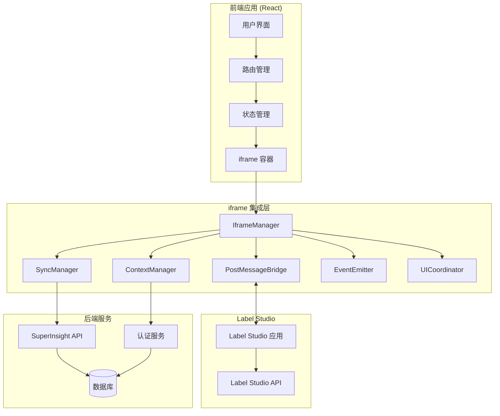

# Label Studio iframe 集成指南

## 概述

本指南详细介绍如何将 Label Studio iframe 集成到 SuperInsight 平台中，包括系统架构、配置步骤、开发指南和最佳实践。

## 系统架构

### 整体架构图



### 核心组件

1. **IframeManager**: iframe 生命周期管理
2. **PostMessageBridge**: 跨域通信桥梁
3. **ContextManager**: 权限和上下文管理
4. **SyncManager**: 数据同步管理
5. **EventEmitter**: 事件处理系统
6. **UICoordinator**: UI 协调器

## 集成步骤

### 1. 环境准备

#### 前端环境要求

```json
{
  "dependencies": {
    "react": "^18.0.0",
    "typescript": "^4.9.0",
    "antd": "^5.0.0"
  }
}
```

#### 后端环境要求

- Label Studio 1.8.x+
- PostgreSQL 13+
- Redis 6+

### 2. 安装和配置

#### 安装依赖

```bash
# 前端依赖
npm install @types/node crypto-js

# 后端依赖
pip install label-studio-sdk
```

#### 环境配置

创建 `.env` 文件：

```bash
# Label Studio 配置
REACT_APP_LABEL_STUDIO_URL=http://localhost:8080
REACT_APP_LABEL_STUDIO_API_KEY=your-api-key

# 安全配置
REACT_APP_IFRAME_ALLOWED_ORIGINS=http://localhost:3000
REACT_APP_IFRAME_REQUIRE_SIGNATURE=true
REACT_APP_IFRAME_ENCRYPTION_ENABLED=true

# 性能配置
REACT_APP_IFRAME_TIMEOUT=30000
REACT_APP_IFRAME_RETRY_ATTEMPTS=3
```

### 3. 基础集成

#### 创建 iframe 容器组件

```typescript
// src/components/LabelStudio/LabelStudioContainer.tsx
import React, { useEffect, useRef, useState } from 'react';
import { IframeManager } from '@/services/iframe/IframeManager';
import { PostMessageBridge } from '@/services/iframe/PostMessageBridge';
import { ContextManager } from '@/services/iframe/ContextManager';

interface Props {
  projectId: string;
  taskId: string;
  userId: string;
  token: string;
  permissions: Permission[];
}

export const LabelStudioContainer: React.FC<Props> = ({
  projectId,
  taskId,
  userId,
  token,
  permissions
}) => {
  const containerRef = useRef<HTMLDivElement>(null);
  const [manager, setManager] = useState<IframeManager | null>(null);
  const [bridge, setBridge] = useState<PostMessageBridge | null>(null);
  const [loading, setLoading] = useState(true);
  const [error, setError] = useState<string | null>(null);

  useEffect(() => {
    const initializeIframe = async () => {
      try {
        // 创建管理器
        const iframeManager = new IframeManager();
        const contextManager = new ContextManager();
        
        // 设置上下文
        contextManager.setContext({
          user: { id: userId, name: 'User', role: 'annotator' },
          project: { id: projectId, name: 'Project' },
          task: { id: taskId, name: 'Task', status: 'pending' },
          permissions,
          timestamp: Date.now()
        });

        // 创建 iframe
        const iframe = await iframeManager.create({
          url: process.env.REACT_APP_LABEL_STUDIO_URL!,
          projectId,
          taskId,
          userId,
          token,
          permissions
        });

        // 创建通信桥梁
        const messageBridge = new PostMessageBridge(iframe);
        
        // 监听状态变化
        iframeManager.on('statusChanged', (status) => {
          if (status === 'ready') {
            setLoading(false);
          } else if (status === 'error') {
            setError('Failed to load Label Studio');
            setLoading(false);
          }
        });

        // 添加到容器
        if (containerRef.current) {
          containerRef.current.appendChild(iframe);
        }

        setManager(iframeManager);
        setBridge(messageBridge);
      } catch (err) {
        setError(err instanceof Error ? err.message : 'Unknown error');
        setLoading(false);
      }
    };

    initializeIframe();

    return () => {
      // 清理资源
      if (manager) {
        manager.destroy();
      }
      if (bridge) {
        bridge.cleanup();
      }
    };
  }, [projectId, taskId, userId, token, permissions]);

  if (loading) {
    return <div>Loading Label Studio...</div>;
  }

  if (error) {
    return <div>Error: {error}</div>;
  }

  return (
    <div 
      ref={containerRef} 
      style={{ width: '100%', height: '100vh' }}
    />
  );
};
```

#### 在路由中使用

```typescript
// src/pages/Annotation/AnnotationPage.tsx
import React from 'react';
import { useParams } from 'react-router-dom';
import { LabelStudioContainer } from '@/components/LabelStudio/LabelStudioContainer';

export const AnnotationPage: React.FC = () => {
  const { projectId, taskId } = useParams<{
    projectId: string;
    taskId: string;
  }>();

  const userId = 'current-user-id'; // 从认证状态获取
  const token = 'jwt-token'; // 从认证状态获取
  const permissions = [
    { action: 'annotate', resource: 'task', allowed: true }
  ];

  return (
    <div style={{ height: '100vh' }}>
      <LabelStudioContainer
        projectId={projectId!}
        taskId={taskId!}
        userId={userId}
        token={token}
        permissions={permissions}
      />
    </div>
  );
};
```

### 4. 高级集成

#### 数据同步集成

```typescript
// src/hooks/useLabelStudioSync.ts
import { useEffect, useState } from 'react';
import { SyncManager } from '@/services/iframe/SyncManager';

export const useLabelStudioSync = (taskId: string) => {
  const [syncManager] = useState(() => new SyncManager());
  const [syncStatus, setSyncStatus] = useState<'idle' | 'syncing' | 'error'>('idle');
  const [lastSyncTime, setLastSyncTime] = useState<Date | null>(null);

  useEffect(() => {
    // 监听同步事件
    syncManager.on('syncStarted', () => {
      setSyncStatus('syncing');
    });

    syncManager.on('syncCompleted', (result) => {
      setSyncStatus('idle');
      setLastSyncTime(new Date());
      console.log('Sync completed:', result);
    });

    syncManager.on('syncError', (error) => {
      setSyncStatus('error');
      console.error('Sync error:', error);
    });

    // 启动自动同步
    syncManager.start();

    return () => {
      syncManager.stop();
    };
  }, [syncManager]);

  const manualSync = async () => {
    try {
      const result = await syncManager.sync();
      return result;
    } catch (error) {
      console.error('Manual sync failed:', error);
      throw error;
    }
  };

  return {
    syncStatus,
    lastSyncTime,
    manualSync
  };
};
```

#### 事件处理集成

```typescript
// src/hooks/useLabelStudioEvents.ts
import { useEffect, useState } from 'react';
import { EventEmitter, AnnotationEvent } from '@/services/iframe/EventEmitter';

export const useLabelStudioEvents = () => {
  const [eventEmitter] = useState(() => new EventEmitter());
  const [annotations, setAnnotations] = useState<any[]>([]);
  const [currentAnnotation, setCurrentAnnotation] = useState<any | null>(null);

  useEffect(() => {
    // 监听标注事件
    eventEmitter.on(AnnotationEvent.STARTED, (data) => {
      setCurrentAnnotation(data);
      console.log('Annotation started:', data);
    });

    eventEmitter.on(AnnotationEvent.UPDATED, (data) => {
      setCurrentAnnotation(data);
      console.log('Annotation updated:', data);
    });

    eventEmitter.on(AnnotationEvent.COMPLETED, (data) => {
      setAnnotations(prev => [...prev, data]);
      setCurrentAnnotation(null);
      console.log('Annotation completed:', data);
    });

    eventEmitter.on(AnnotationEvent.SAVED, (data) => {
      console.log('Annotation saved:', data);
    });

    eventEmitter.on(AnnotationEvent.ERROR, (error) => {
      console.error('Annotation error:', error);
    });

    return () => {
      // 清理事件监听器
      eventEmitter.off(AnnotationEvent.STARTED);
      eventEmitter.off(AnnotationEvent.UPDATED);
      eventEmitter.off(AnnotationEvent.COMPLETED);
      eventEmitter.off(AnnotationEvent.SAVED);
      eventEmitter.off(AnnotationEvent.ERROR);
    };
  }, [eventEmitter]);

  return {
    eventEmitter,
    annotations,
    currentAnnotation
  };
};
```

### 5. 权限控制集成

#### 权限检查中间件

```typescript
// src/middleware/permissionMiddleware.ts
import { ContextManager } from '@/services/iframe/ContextManager';

export const createPermissionMiddleware = (contextManager: ContextManager) => {
  return (requiredPermission: string) => {
    return (target: any, propertyName: string, descriptor: PropertyDescriptor) => {
      const method = descriptor.value;

      descriptor.value = function (...args: any[]) {
        if (!contextManager.checkPermission(requiredPermission)) {
          throw new Error(`Permission denied: ${requiredPermission}`);
        }
        return method.apply(this, args);
      };
    };
  };
};

// 使用示例
class AnnotationService {
  constructor(private contextManager: ContextManager) {}

  @createPermissionMiddleware(this.contextManager)('annotate')
  async createAnnotation(data: any) {
    // 创建标注逻辑
  }

  @createPermissionMiddleware(this.contextManager)('delete')
  async deleteAnnotation(id: string) {
    // 删除标注逻辑
  }
}
```

### 6. 错误处理集成

#### 全局错误边界

```typescript
// src/components/ErrorBoundary/LabelStudioErrorBoundary.tsx
import React, { Component, ErrorInfo, ReactNode } from 'react';
import { ErrorHandler } from '@/services/iframe/ErrorHandler';

interface Props {
  children: ReactNode;
}

interface State {
  hasError: boolean;
  error: Error | null;
}

export class LabelStudioErrorBoundary extends Component<Props, State> {
  private errorHandler: ErrorHandler;

  constructor(props: Props) {
    super(props);
    this.state = { hasError: false, error: null };
    this.errorHandler = new ErrorHandler();
  }

  static getDerivedStateFromError(error: Error): State {
    return { hasError: true, error };
  }

  componentDidCatch(error: Error, errorInfo: ErrorInfo) {
    this.errorHandler.handleError(error, {
      componentStack: errorInfo.componentStack,
      errorBoundary: 'LabelStudioErrorBoundary'
    });
  }

  render() {
    if (this.state.hasError) {
      return (
        <div style={{ padding: '20px', textAlign: 'center' }}>
          <h2>Label Studio 加载失败</h2>
          <p>请刷新页面重试，或联系技术支持。</p>
          <button onClick={() => window.location.reload()}>
            刷新页面
          </button>
        </div>
      );
    }

    return this.props.children;
  }
}
```

### 7. 性能优化集成

#### 懒加载实现

```typescript
// src/components/LabelStudio/LazyLabelStudioContainer.tsx
import React, { lazy, Suspense } from 'react';
import { LazyLoader } from '@/services/iframe/LazyLoader';

const LabelStudioContainer = lazy(() => 
  import('./LabelStudioContainer').then(module => ({
    default: module.LabelStudioContainer
  }))
);

interface Props {
  projectId: string;
  taskId: string;
  userId: string;
  token: string;
  permissions: Permission[];
}

export const LazyLabelStudioContainer: React.FC<Props> = (props) => {
  const lazyLoader = new LazyLoader();

  return (
    <Suspense fallback={
      <div style={{ 
        display: 'flex', 
        justifyContent: 'center', 
        alignItems: 'center', 
        height: '100vh' 
      }}>
        <div>Loading Label Studio...</div>
      </div>
    }>
      <LabelStudioContainer {...props} />
    </Suspense>
  );
};
```

## 配置选项

### 全局配置

```typescript
// src/config/labelStudioConfig.ts
export const labelStudioConfig = {
  baseUrl: process.env.REACT_APP_LABEL_STUDIO_URL || 'http://localhost:8080',
  apiKey: process.env.REACT_APP_LABEL_STUDIO_API_KEY || '',
  timeout: parseInt(process.env.REACT_APP_IFRAME_TIMEOUT || '30000'),
  retryAttempts: parseInt(process.env.REACT_APP_IFRAME_RETRY_ATTEMPTS || '3'),
  enableCache: process.env.REACT_APP_IFRAME_ENABLE_CACHE === 'true',
  enableMonitoring: process.env.REACT_APP_IFRAME_ENABLE_MONITORING === 'true',
  securityPolicy: {
    allowedOrigins: (process.env.REACT_APP_IFRAME_ALLOWED_ORIGINS || '').split(','),
    requireSignature: process.env.REACT_APP_IFRAME_REQUIRE_SIGNATURE === 'true',
    encryptionEnabled: process.env.REACT_APP_IFRAME_ENCRYPTION_ENABLED === 'true',
    auditEnabled: process.env.REACT_APP_IFRAME_AUDIT_ENABLED === 'true'
  }
};
```

### 主题配置

```typescript
// src/config/themeConfig.ts
export const themeConfig = {
  light: {
    backgroundColor: '#ffffff',
    textColor: '#000000',
    borderColor: '#d9d9d9'
  },
  dark: {
    backgroundColor: '#141414',
    textColor: '#ffffff',
    borderColor: '#434343'
  }
};
```

## 测试集成

### 单元测试示例

```typescript
// src/services/iframe/__tests__/IframeManager.test.ts
import { IframeManager } from '../IframeManager';

describe('IframeManager', () => {
  let manager: IframeManager;

  beforeEach(() => {
    manager = new IframeManager();
  });

  afterEach(async () => {
    await manager.destroy();
  });

  test('should create iframe with correct config', async () => {
    const config = {
      url: 'http://localhost:8080',
      projectId: 'test-project',
      taskId: 'test-task',
      userId: 'test-user',
      token: 'test-token',
      permissions: []
    };

    const iframe = await manager.create(config);
    
    expect(iframe).toBeInstanceOf(HTMLIFrameElement);
    expect(iframe.src).toBe(config.url);
  });

  test('should handle iframe loading states', async () => {
    const statusChanges: string[] = [];
    
    manager.on('statusChanged', (status) => {
      statusChanges.push(status);
    });

    await manager.create({
      url: 'http://localhost:8080',
      projectId: 'test-project',
      taskId: 'test-task',
      userId: 'test-user',
      token: 'test-token',
      permissions: []
    });

    expect(statusChanges).toContain('loading');
  });
});
```

### 集成测试示例

```typescript
// src/components/LabelStudio/__tests__/LabelStudioContainer.integration.test.tsx
import React from 'react';
import { render, waitFor } from '@testing-library/react';
import { LabelStudioContainer } from '../LabelStudioContainer';

describe('LabelStudioContainer Integration', () => {
  test('should render and initialize iframe', async () => {
    const props = {
      projectId: 'test-project',
      taskId: 'test-task',
      userId: 'test-user',
      token: 'test-token',
      permissions: [
        { action: 'annotate', resource: 'task', allowed: true }
      ]
    };

    const { container } = render(<LabelStudioContainer {...props} />);

    await waitFor(() => {
      const iframe = container.querySelector('iframe');
      expect(iframe).toBeInTheDocument();
    });
  });
});
```

## 部署注意事项

### 1. 跨域配置

确保 Label Studio 服务器配置了正确的 CORS 策略：

```python
# Label Studio 配置
CORS_ALLOW_ALL_ORIGINS = False
CORS_ALLOWED_ORIGINS = [
    "http://localhost:3000",
    "https://your-domain.com"
]
```

### 2. 安全配置

配置内容安全策略 (CSP)：

```html
<meta http-equiv="Content-Security-Policy" 
      content="frame-src 'self' http://localhost:8080 https://label-studio.your-domain.com;">
```

### 3. 性能优化

- 启用 gzip 压缩
- 配置 CDN 加速
- 使用 HTTP/2
- 启用浏览器缓存

## 故障排查

常见问题和解决方案请参考 [故障排查指南](./troubleshooting.md)。

---

**版本**: v1.0  
**更新日期**: 2026年1月5日